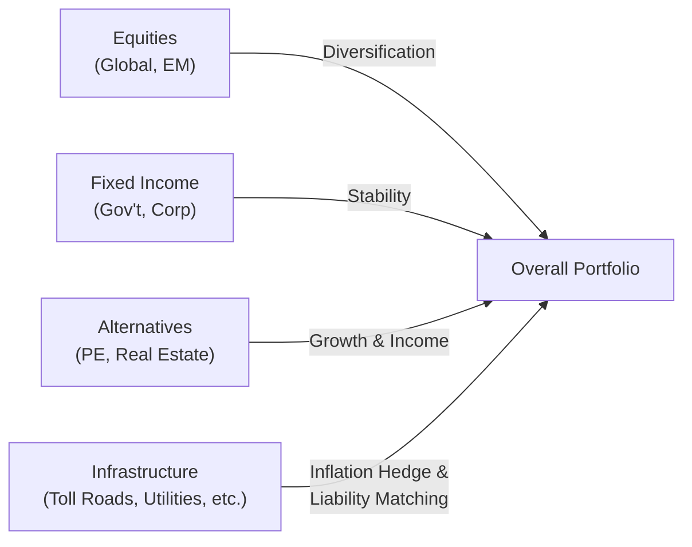

## Introduction and Overview

Let’s be honest: “infrastructure” can sound like a dull word—roads, bridges, and maybe a wind farm here or there. But in the realm of a diversified portfolio, these essential structures can suddenly seem pretty exciting. Why? Because they tend to generate steady cash flows, often have regulated or contracted revenues, and—drumroll—they can help balance out other riskier or more volatile assets. That’s why many pension funds, sovereign wealth funds, and insurers are so keen on them.

I remember chatting with a colleague who worked at a major pension fund. She told me, “Look, we need to pay out benefits to retirees for decades. Infrastructure, with its stable income and inflation linkage, helps us sleep at night.” This anecdote might sound trivial, but it captures the heart of what we’ll be exploring here: how infrastructure fits into a larger, strategic asset allocation (SAA) framework for institutional portfolios. We’ll dig into diversification, inflation protection, stable long-term cash flow generation, and more. By the end, I hope you’ll appreciate how these (sometimes overlooked) assets can play a starring role in your portfolio’s cast of characters.

## Key Characteristics Relevant to Strategic Asset Allocation

### Diversification and Low Correlation Potential
Infrastructure investments often exhibit relatively low correlation to traditional assets (like equities and bonds), especially during certain economic cycles. When equities are tanking, a toll road or regulated utility might keep chugging along, collecting fares or electricity payments. That can be a big help in smoothing overall portfolio volatility.

Analytically, we often measure correlation coefficients to see how two types of assets move together. A correlation close to +1 means they move in lockstep; −1 means they move in opposite directions. Infrastructure typically lands somewhere in the middle. In stable economic periods, it might slightly correlate with equities because GDP growth can boost infrastructure usage. But during downturns, regulated or contracted infrastructure revenue might hold up better, reducing correlation with equities.

### Inflation Protection
Another reason infrastructure often appears in a portfolio is to serve as an inflation hedge. Certain types of infrastructure, like toll roads, can adjust prices by inflation indices. Others, such as water utilities or renewable energy facilities, might have regulatory mechanisms that allow them to raise tariffs if inflation creeps up.

From a math perspective, a simple way to conceptualize real return is:

$$
R_\text{real} = \frac{1 + R_\text{nominal}}{1 + \text{Inflation Rate}} - 1
$$

If inflation is rising, but your infrastructure asset has charters or concessions allowing it to adjust fees, then your nominal return can remain higher, giving a more stable real return. In other words, you aren’t as vulnerable to inflation eroding the purchasing power of the portfolio’s cash flows.

### Stable Long-Term Cash Flows and Liability Matching
Institutional investors—pension funds, sovereign wealth funds, insurers—often have predictable future liabilities. Infrastructure aligns well with these “liability matching” objectives: you’ve got a long-lived asset that should generate relatively stable cash flows over time. For example, a water treatment plant with a 25-year concession contract might produce a steady income that can be used to meet fixed or even inflation-linked obligations.

This liability-matching aspect is particularly relevant for insurance companies that need consistent premium returns or for pension plans paying out monthly benefits. Infrastructure’s pricing (like regulated rates or usage fees) can be pegged to inflation or reviewed periodically, making it more predictable than, say, a publicly traded growth stock.

### Illiquidity Premium
Let’s not forget the illiquidity premium, which is the higher return investors expect because they can’t quickly sell the investment for its fair market value. Infrastructure projects (big highways, airports, power plants) usually aren’t easy to trade or exit from. This illiquidity can be a headache if you suddenly need cash, but it can also boost the expected returns if you’re willing to lock your capital away for a longer period.

In some sense, it’s like the difference between a short-term savings account and a certificate of deposit (CD) that locks your money for two years. The CD pays more because you have less flexibility in withdrawing your funds. With infrastructure, that premium can add up nicely over time, bolstering overall portfolio returns for long-horizon investors.

## Typical Infrastructure Allocations in Practice

If you thumb through a few pension-fund annual reports, you might find that their allocations to infrastructure range anywhere from 5% to 15% of total assets, depending on their risk tolerance, regulatory environment, and liability structure. Some larger, more sophisticated investors even go north of 15% if they believe infrastructure’s risk-return profile aligns well with their long-term obligations.

That said, the “right” allocation isn’t one-size-fits-all. It depends on:

• The investor’s liquidity needs.  
• The portfolio’s overall risk appetite.  
• Macroeconomic outlook (Are we bracing for inflation? Recession?).  
• The availability of quality investment opportunities in the infrastructure space.

## The Portfolio Context: Where Infrastructure Fits

It may help to visualize how infrastructure might slot into a broader portfolio context. Here’s a quick Mermaid diagram showing infrastructure as one component of a diversified mix:

In this diagram, infrastructure complements equities, fixed income, and other alternative assets to create an overall portfolio with balanced risk and return characteristics.

## Dynamic Asset Allocation and Infrastructure

### Challenges in Rebalancing
A standard principle in strategic asset allocation is rebalancing your portfolio when one asset class grows or shrinks too much relative to its target weight. But with an asset like infrastructure, rebalancing is trickier. You can’t usually sell a toll road or wind farm stake on a Tuesday afternoon because you’re, well, overweight in infrastructure relative to your target. Infrastructure transactions can take months—sometimes years—to complete, and valuations might only be updated periodically.

That means you have to plan your dynamic asset allocation carefully. Some institutions rely on subscription credit facilities or other temporary financing methods (as explained in Section 2.8) to handle discrepancies until they can adjust their positions. Others build in secondary-market strategies—infrastructure secondaries are less common than, say, private equity secondaries, but they’re emerging. Or they simply accept short-term drift in their infrastructure exposure until new deals or redemptions come along.

### Correlation Shifts Over Economic Cycles
It seems easy to say, “Infrastructure is a stable, uncorrelated asset.” But be aware that correlations can shift over time. During a recession, government budgets might be cut, which could affect infrastructure expansions or new government-supported projects. During expansionary periods, usage-based infrastructure might correlate more strongly with economic growth. So the correlation is not static—it can ebb and flow. That’s why dynamic asset allocation can be an ongoing process of monitoring how these assets behave as the macro landscape changes.

## Practical Examples and Case Studies

1. Canadian Pension Fund Investing in Renewable Energy  
   A major Canadian pension fund allocated around 10% of its assets to renewable energy (solar farms, wind turbines) as part of its infrastructure sleeve. Over a decade, these assets produced stable cash flows thanks to power purchase agreements, matching long-term retirement obligations.

2. European Toll Road Operator  
   An insurance company sought assets offering stable, inflation-linked income streams. It acquired a stake in a European toll road with concession rights that periodically adjust tolls for inflation. The toll road’s returns partially offset the insurer’s exposure to rising interest rates and maintained the real value of the portfolio.

3. Small Insurance Company Entering Infrastructure  
   A mid-sized insurer wanted in on infrastructure but had concerns about illiquidity. They formed a co-investment deal with a larger pension fund, allowing smaller capital commitments in multiple infrastructure projects. This approach reduced idiosyncratic risk, though it required thorough due diligence.

## Common Pitfalls and Best Practices

• Ignoring Political/Regulatory Risk: Infrastructure is often regulated. Changes in legislation or government policy can drastically affect returns.  
• Underestimating Capital Expenditures: Assets like airports or roads might require ongoing maintenance or expansion, which can eat into cash flows.  
• Liquidity Mismatch: If you have short-term liabilities but invest heavily in illiquid infrastructure, you could face cash crunches.  
• Overpaying for “Premium” Assets: Sometimes top-tier infrastructure in stable jurisdictions is priced quite high, compressing yields. Hunt for value, but don’t skimp on risk assessments.  

Best Practices:

• Conduct thorough due diligence (Section 7.4 covers valuation aspects).  
• Diversify geographically and by sector.  
• Align the investment horizon with liabilities (liability matching).  
• Rebalance opportunistically, considering the illiquidity constraints.

## Final Exam Tips

• Draw connections between infrastructure’s stable cash flow profile and the broader concept of liability matching. This is often tested in essay questions.  
• Understand inflation-hedging mechanisms (e.g., linking tariffs to CPI) and how these help preserve real returns.  
• Be prepared to explain how and why correlation might shift in different market conditions—exam item sets sometimes present scenario-based questions.  
• If the exam question addresses dynamic asset allocation, discuss the challenges associated with rebalancing illiquid long-term holdings.  
• Know your typical allocation ranges (e.g., 5–15%) and be ready to justify them in a scenario.  

## References and Further Reading

• CFA Institute materials on strategic asset allocation frameworks.  
• Inderst, G. (2021). “Infrastructure Investment, Private Finance, and Institutional Investors: Asia and Beyond.” ADBI Working Paper.  
• Mercer’s “Infrastructure Investment Best Practices” reports.

## Test Your Knowledge: Infrastructure in Strategic Asset Allocation



### Which of the following is a primary benefit of infrastructure in a long-term institutional portfolio?

- [ ] High daily liquidity
- [x] Stable, predictable cash flows
- [ ] Minimal political or regulatory risk
- [ ] Zero correlation with other asset classes

> **Explanation:** Infrastructure often has stable and predictable long-term cash flows, which can match liabilities. However, it is typically not highly liquid, and it does face political/regulatory risks.

### Which term best describes the process of aligning future portfolio cash flows and risk levels with future obligations?

- [ ] Inflation protection
- [ ] Dynamic asset allocation
- [x] Liability matching
- [ ] Illiquidity premium

> **Explanation:** Liability matching ensures that an investor’s cash flows and risk profile align with future obligations, such as pension payments or insurance payouts.

### How does infrastructure commonly act as an inflation hedge?

- [ ] By paying interest rates that always exceed government bond yields
- [ ] By remaining completely uncorrelated with inflation
- [x] Through regulatory or contractual mechanisms allowing fees to rise with inflation
- [ ] By offering short-term capital gains during periods of rising interest rates

> **Explanation:** Many infrastructure assets have built-in mechanisms—like regulated tariffs or inflation-linked pricing provisions—that help them maintain real returns when inflation rises.

### What is the main trade-off for earning an illiquidity premium in infrastructure investing?

- [ ] Lower profitability for short-term projects
- [ ] Less regulation
- [x] Reduced ability to quickly liquidate or rebalance the position
- [ ] Guaranteed returns in all market conditions

> **Explanation:** Illiquidity premium means you can earn higher returns but at the cost of not being able to exit or rebalance easily if market conditions or portfolio needs change.

### Which statement accurately reflects the correlation profile of infrastructure with other asset classes?

- [x] It can vary with economic cycles and is not universally low or high
- [ ] It remains at a constant negative correlation to equities
- [x] It may be low correlation in a downturn but somewhat correlated in upswings
- [ ] It is unaffected by macroeconomic factors

> **Explanation:** Infrastructure’s correlation with traditional asset classes can shift over time, depending on economic conditions and usage-based revenue patterns.

### Which of the following is a typical portfolio allocation range for infrastructure among large institutional investors?

- [ ] 1–3%
- [x] 5–15%
- [ ] 20–30%
- [ ] 50% or more

> **Explanation:** Many large pension funds and insurers allocate between 5% and 15% to infrastructure, though individual targets vary.

### What is a potential challenge faced by investors when rebalancing infrastructure assets?

- [ ] Automatic rebalancing each quarter
- [x] Slow transaction processes and infrequent valuations
- [x] Frequent daily pricing leading to high volatility
- [ ] High correlation with commodity markets

> **Explanation:** Infrastructure transactions usually take months and valuations are updated infrequently, making rebalancing more difficult than with publicly traded assets.

### Which best practice is critical when investing in infrastructure?

- [ ] Relying solely on historical equity correlations
- [x] Conducting thorough due diligence on regulatory frameworks and concessions
- [ ] Concentrating positions in a single geography
- [ ] Expecting high liquidity and daily price updates

> **Explanation:** Due diligence on regulatory and contractual structures is vital due to the significant influence these factors have on long-term returns.

### A pension fund invests in a toll road with inflation-linked toll adjustments. Which statement best describes an advantage of this investment?

- [x] It provides a natural hedge against inflation.
- [ ] It eliminates all interest rate risk.
- [ ] It ensures positive real returns in perpetuity.
- [ ] It requires daily rebalancing to maintain stable returns.

> **Explanation:** Inflation-linked toll adjustments can help preserve real returns when inflation rises, aligning with the pension fund’s liabilities.

### Infrastructure assets typically offer constant daily liquidity. True or False?

- [ ] True
- [x] False

> **Explanation:** Infrastructure is generally illiquid; selling a stake in a toll road or power plant is not as straightforward as selling a stock on a public exchange.


