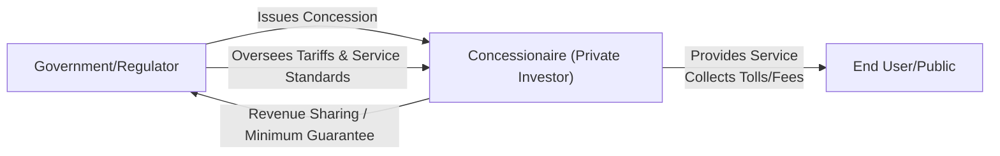

Before we dig in, let me just say: I once had a friend who worked on a highway concession project, and, wow, the stories about regulatory changes and shifting political winds nearly gave me palpitations. Um, you know, it really helped me appreciate how important stable frameworks and well-structured contracts can be—especially in infrastructure, where you’re often dealing with super long timelines and, well, enormous capital requirements. So let’s explore how regulation and concession agreements shape the world of private infrastructure ventures.

Regulatory frameworks are at the heart of most infrastructure investments. Large projects—like toll roads, power plants, airports, and water utilities—often operate as monopolies or near-monopolies in their respective regions. This means government supervision and robust legal structures can make or break an investor’s returns. Not only do these frameworks regulate pricing/tariff structures, but they also define performance benchmarks and clarify how the asset is handed back to public authorities once the contract ends.

Regulators generally aim to balance the public interest with private investors’ need for a fair return. Sure, they might put a cap on allowable returns—or require the concessionaire to meet specific service-level targets. But they also try to keep enough carrots in place so that private investors actually want to come in with that big chunk of capital. Anyway, let's look more closely at the interplay between regulatory environments and concession agreements, paying special attention to some real-world scenarios (and pitfalls).

Regulatory Environment: Core Concepts

Regulatory frameworks exist to monitor essential public goods—power, water, roads—because these goods are so vital to everyday life and economic functioning. In many jurisdictions, utility-like infrastructure operates within strict guidelines supervised by a public regulator or government ministry. For instance, a regulator might say, “You can’t make more than an X% return on equity,” or “You must provide Y level of service reliability.” These constraints are typically spelled out in enabling legislation, licensing documents, and ad hoc rules.

• Monopolistic or Near-Monopolistic Structures  
  Infrastructure assets such as water distribution or airport runways often lack direct competition. As a result, the government steps in to ensure fair pricing. Without oversight, a single toll road operator might raise prices sky-high. In return for operating constraints, the regulated entity usually gets exclusive rights (like no other competing highways within a certain radius).

• Regional Differences  
  Let’s face it: the stability of these regulatory frameworks can vary wildly among countries or regions. A stable, predictable legal environment—say in Canada, Germany, or Australia—often lowers risk because governments are less likely to backtrack on agreements. Meanwhile, in emerging markets with changing political leadership, the possibility of contract renegotiation or “unfriendly” regulatory moves can be higher.

• Government Oversight of Tariffs and Pricing  
  The entity in charge might allow periodic tariff adjustments for inflation or cost pass-through. This is especially important if you’re using a cost-plus model (where your allowable revenue is tied to operating costs plus an agreed margin) or a rate-of-return regulation (where the regulator checks your total costs and determines a fair profit).  

Concession Agreements: The Building Blocks

At the core of many infrastructure projects—like roads, bridges, airports, and sewage treatment plants—are concession agreements. These are long-term contracts between a private operator (or consortium) and a public authority. Concession periods can easily stretch beyond 20 or 30 years, so you better believe it matters what is written in the fine print.

• Pricing and Tariff Structures  
  Concession agreements usually specify how (and how much) the operator can charge end-users—think bridge tolls or electricity tariffs. Sometimes, the contract includes an automatic price escalation formula based on an index (like CPI). In other deals, the government might enforce a “cap and collar,” limiting how high or low tariffs can go to protect consumers and assure stable returns for investors.

• Performance Standards  
  The government will typically define certain service-level obligations—e.g., electrical grid uptime or road quality. If you fail to meet these, you could be slapped with penalties. Or, if you exceed them, you might be rewarded (so-called output-based incentives).  

• Revenue-Sharing and Minimum Revenue Guarantees (MRGs)  
  Some concession agreements have an MRG, meaning the government ensures a baseline revenue if usage (or traffic, or demand) falls below a certain threshold. It’s a huge risk mitigation factor for investors—especially for less predictable or new infrastructure projects. On the flip side, the government might also require revenue sharing if usage soars beyond projections.  

• Asset Handover and Concession Termination  
  At the end of the concession, the asset typically reverts to the public authority. The agreement outlines how this handover takes place: in “good working order,” for example, or with certain refurbishment standards. Early termination clauses can also appear if the investor breaches the contract or if the public authority unilaterally decides to retake ownership. Such terms have important implications for potential compensation payments to private partners.

• Dispute Resolution, Arbitration, and Cross-Border Considerations  
  Because these deals can involve foreign investors, concession agreements commonly include arbitration clauses, sometimes pointing to a neutral venue like the International Chamber of Commerce (ICC). Bilateral or multilateral investment treaties may provide additional legal protection against expropriation or discriminatory treatment.  

Let’s visualize a simple concession agreement structure. Here’s a Mermaid diagram to illustrate the core relationships among stakeholders:

Government and Political Risk

We can’t talk about infrastructure without mentioning political risk—it’s the elephant in the room. Especially in emerging economies, a new administration coming into power might target high-profile concessions for renegotiation, sometimes driven by public sentiment against “foreign profiteers.” That said, many governments recognize the harm caused by a poor reputation in the international investment community. So, at times, you see them adopt or adhere to bilateral investment treaties (BITs) or incorporate strong contractual protections that oblige governments to compensate investors if they want to make changes mid-contract.

• Renegotiation Risk  
  Many concessions get renegotiated—sometimes due to external shocks (like a severe economic downturn), sometimes due to plain old politics. A well-crafted contract tries to anticipate these scenarios by outlining the process for renegotiation and requiring compensation or arbitration.  

• Termination Clauses and Investor Protection  
  The agreement might say that unilateral termination by the public authority triggers a fair market value payout to the operator. In cross-border deals, you might rely on a BIT that offers recourse to international dispute settlement.  

Contractual Flexibility Over Long Life Cycles

Infrastructure projects often run 20 years or more. That’s, by the way, longer than many of us keep a house. So it goes without saying that changes—both minor and major—are almost inevitable. Perhaps usage patterns shift dramatically due to a new suburban development, or new environmental regulations come into play.

• Expansion or Modification Clauses  
  Large airport concessions might anticipate expansions (new runways, terminals) if passenger traffic crosses certain thresholds. The contract typically says how costs are shared and how tariffs might be adjusted so the concessionaire can finance that expansion.  

• Maintenance and Refurbishment  
  It’s common for the concessionaire to handle routine repairs. But what if you need major rehabilitation halfway through the term? The contract should specify who shoulders that cost and how.  

• Risk-Sharing Mechanisms  
  In some deals, you might see agreements that shift certain cost overruns to the government in exchange for an overall cost of capital that’s a bit lower. It’s a balancing act.  

Best Practices in Regulatory and Concession Contracting

Given the importance of stable cash flows in infrastructure, best practices for both investors and governments revolve around clarity and balance:

• Thorough Due Diligence and Stress Testing  
  Obviously, you’ll want to stress test your revenue projections—and then do it again. For the government side, you need to see if the concessionaire’s proposed tariff is fair and if the service standards are enforceable.  

• Transparent and Predictable Rules  
  The more transparent a government’s approach to regulating returns or awarding concessions, the more likely you’ll attract multiple bidders. Competition generally produces better outcomes for the public and often yields better risk-adjusted returns for private investors.  

• Clear Dispute Resolution Mechanisms  
  If you’re dealing cross-border, remember to ensure your contract includes arbitration in a reputable global forum and references to stable laws.  

• Mutual Incentives and Sharing of Upside/Downside  
  If usage skyrockets, the public might want to share in the upside via a “windfall” provision. Conversely, if usage disappoints, a well-conceived MRG might keep the concessionaire from defaulting. Aligning incentives prevents a zero-sum scenario, hopefully fostering a more cooperative relationship over the entire concession’s life.  

• ESG and Sustainability Considerations  
  Infrastructure deals increasingly incorporate sustainability. Some governments or development finance institutions impose strict environmental or social benchmarks. In certain cases, PPPs must incorporate local workforce development. Non-compliance might trigger penalties or, in extreme cases, early termination.  

Example: Toll Road Concession with an MRG

Suppose a private consortium invests in an emerging market toll road with a 25-year concession. The government wants fast improvements to regional connectivity and agrees to an MRG that ensures the project receives at least $100 million in annual revenue. The concessionaire must meet certain service-level targets (like minimal potholes, routine repaving) or forfeit a portion of the MRG. If traffic usage falls short, the government tops up actual toll receipts to $100 million. But if usage is higher than projected, the government might get 10% of revenues above $110 million. This sort of structure carefully balances investor protections and public interests, preventing either party from feeling shortchanged over the project’s life cycle.

Exam Tips: Navigating Regulatory and Concession Fundamentals

• Real-World Application: On the Level III exam, scenario-based questions might require you to identify or evaluate regulatory and political risks in a potential infrastructure investment. You might be asked to calculate how certain tariff caps or guaranteed revenues affect your discount rate assumptions.  

• Pitfalls: Don’t forget the tricky aspects—like renegotiation risk or currency risk (especially if you’re dealing with cross-border projects). Keep an eye on how a minimum revenue guarantee can shift a project’s risk-return profile.  

• Essay Essentials: If you see an essay question on concession agreements, be prepared to highlight how revenue-sharing agreements or performance benchmarks align public and private objectives. And don’t neglect to mention dispute resolution at the end.  

References for Further Exploration  
• Organisation for Economic Co-operation and Development (OECD): Research and case studies on “Regulatory Policy for Infrastructure.”  
• International Finance Corporation’s “Guidelines for Dealing with Governance in PPPs.”  
• Official government sites (e.g., the UK Department for Transport, the US Federal Transit Administration) for real concession tender documents.  
• Bilateral Investment Treaties (BIT) listings: UNCTAD’s Investment Policy Hub.  

Now let’s cement your learning with some practice questions.

## Regulatory and Concession Agreements Practice Questions



### In a rate-of-return regulatory environment for a monopoly infrastructure asset, which of the following is the primary focus of the regulator?

- [ ] Maximizing the operator’s profit.  
- [x] Ensuring a fair return on capital, given operating and capital costs.  
- [ ] Restricting the operator from adjusting prices for inflation.  
- [ ] Punishing the operator if demand falls below expectations.  

> **Explanation:** Rate-of-return regulation typically grants the operator a fair return on invested capital but caps supernormal profits. The operator can recover legitimate operating costs plus an allowed profit margin.

### Which clause in concession agreements provides a guaranteed baseline income for infrastructure projects if user demand falls short?

- [ ] Arbitration clause.  
- [ ] Regulatory oversight clause.  
- [ ] Windfall revenue clause.  
- [x] Minimum revenue guarantee (MRG).  

> **Explanation:** A minimum revenue guarantee absorbs downside demand risk by ensuring a certain threshold of revenue for the project owner or operator.

### Why are infrastructure investments particularly vulnerable to political risk?

- [ ] Their short contractual durations allow frequent government interference.  
- [x] They often involve high public visibility and long concession terms that can span changes in governance.  
- [ ] They rarely attract public scrutiny in domestic markets.  
- [ ] They are fully insulated from unilateral contract termination.  

> **Explanation:** Political shifts can result in renegotiations or expropriation of long-term infrastructure projects. Infrastructure investments are capital-intensive, highly visible, and may be considered strategic by local governments.

### Which of the following best describes a “cap and collar” provision in a concession agreement?

- [ ] A cost allocation that strictly assigns all cost overages to the public entity.  
- [ ] A type of interest rate hedge protecting both parties.  
- [x] A mechanism setting upper and lower limits on permissible tariff levels.  
- [ ] A requirement that the concessionaire repay the entire investment cost at end-of-term.  

> **Explanation:** “Cap and collar” sets bounds on allowable tariffs, ensuring a balance between consumer protection and predictable returns for the operator.

### If local regulations require that an airport operator provide a minimum service reliability level (such as a maximum number of flight delays), what risk is the operator primarily facing?

- [x] Performance risk.  
- [ ] Litigation risk.  
- [ ] Weather risk exclusively.  
- [ ] Exchange rate risk.  

> **Explanation:** Performance risk arises from failing to meet specified standards or service benchmarks, potentially resulting in penalties or contract termination.

### How do bilateral or multilateral investment treaties protect foreign investors in cross-border infrastructure deals?

- [x] They provide legal frameworks for fair treatment and possible recourse in international arbitration.  
- [ ] They encourage operators to increase toll rates.  
- [ ] They eliminate performance standards.  
- [ ] They replace local regulations entirely with foreign jurisdictions.  

> **Explanation:** Treaties protect foreign investors against expropriation or discriminatory actions, often allowing international arbitration to resolve disputes.

### Which of the following describes a common reason for renegotiating an infrastructure concession agreement?

- [ ] The project consistently outperforms all global infrastructure benchmarks.  
- [x] A change in political leadership leading to new public objectives.  
- [ ] Low user satisfaction with local municipal water services.  
- [ ] Rising private equity interest in alternative deals.  

> **Explanation:** Political leadership changes often prompt renegotiations or the introduction of new terms, driven by revised public sector priorities or public sentiment.

### In many long-term concessions, what is the significance of an early termination clause?

- [ ] It guarantees indefinite operation by the private sector.  
- [ ] It allows the concessionaire to ignore service standards without penalty.  
- [ ] It removes arbitration from all disputes.  
- [x] It outlines compensation or conditions if the public authority reclaims the asset prematurely.  

> **Explanation:** Early termination clauses define triggers, compensation mechanisms, and handover conditions, ensuring both parties understand the financial and operational implications of unilateral termination.

### Which best practice helps both government and concessionaire manage uncertainty over a 25-plus-year project horizon?

- [ ] Fixed pricing with no scope for tariff adjustments.  
- [x] Built-in mechanisms for regular contract review and adjustment.  
- [ ] Immediate full privatization of the asset.  
- [ ] Prohibiting external financing or refinancing.  

> **Explanation:** Long concessions need some contractual flexibility to adapt to new regulations, evolving demand patterns, or technological changes. Scheduled reviews allow both parties to address these issues in a structured way.

### True or False: An arbitration clause in a concession contract ensures that any dispute is automatically resolved in the concessionaire’s favor.

- [x] True  
- [ ] False  

> **Explanation:** This is a trick question—this statement is actually false. Arbitration clauses do not guarantee a win for any party. They simply establish a neutral dispute resolution mechanism outside the local court system.


