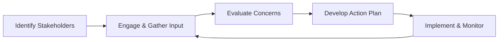

## Introduction
Let’s talk about infrastructure. It’s one of those asset classes that often feels simultaneously exciting (big projects! bold visions!) and nerve-wracking (regulations! stakeholder demands!). But infrastructure projects, whether toll roads, power generation facilities, or water treatment plants, rely heavily on operational excellence. Effective management can help ensure that financing stays on target, service quality remains high, and unforeseen issues are addressed before they escalate. In other words, if you’re serious about building and maintaining infrastructure assets, robust operational management and thoughtful stakeholder engagement are mission-critical.

Along with daily operations—scheduling, repairs, risk monitoring—there are broader concerns like environmental compliance, labor relations, and technology adoption. In some sense, infrastructure invests you right in the heart of communities, which is why stakeholder engagement and ESG (Environmental, Social, Governance) considerations cannot be overemphasized. This section explores these themes, weaving together practical experiences, real-world examples, and theoretical frameworks to give you a comprehensive understanding of operational management and stakeholder considerations in infrastructure.

## Operational Risk in Infrastructure
When you build a bridge or maintain a power grid, the job doesn’t end once construction is complete. Actually, that’s where a whole new story begins. Operational risk is the risk that your daily processes—maintenance, staffing, budgeting—don’t go according to plan. And um, trust me, in infrastructure, you can’t afford to take these details lightly.

Some typical sources of operational risk include:  
• Maintenance Schedules: Deferred maintenance can lead to catastrophic failures. Think of a structurally weakened bridge that disrupts traffic or, even worse, endangers public safety.  
• Labor Relations: From employee strikes to labor shortages, labor issues can stall projects, increase costs, or even necessitate new financing if delays produce cash shortfalls.  
• Technology Updates: Infrastructure assets often feature high-level technology (e.g., sensors for real-time performance tracking). If you fail to update or manage this tech properly, you can compromise efficiency and safety.  
• Supply Chain Dependencies: Late delivery of a crucial part could lead to project bottlenecks.  
• Environmental Compliance: Infrastructure projects face rigorous environmental and regulatory standards. Violations could result in heavy fines, reputational damage, or forced shutdowns.  

### Managing Operational Risk
Proactive planning is key. From establishing regular inspections and robust maintenance protocols to building contingency funds for “just-in-case” scenarios, thorough planning helps ward off nasty surprises. Effective frameworks often incorporate:

• Periodic Risk Assessments: Regularly perform internal checks to identify new risks—perhaps a new labor regulation or technology becoming obsolete.  
• Detailed Operating Budgets: Budget carefully for maintenance, staff, and all other operational line items. When budgets are tight, corners are often cut, but that’s where accidents happen.  
• Monitoring Systems: Use real-time data analytics to spot anomalies quickly. This can involve automated sensor systems or an advanced analytics platform that flags abnormal usage patterns or mechanical failures.  
• Training and Development: Skilled staff make all the difference. Providing ongoing education and train-the-trainer sessions ensures that operators, managers, and maintenance personnel know what to do when something goes awry.

## Stakeholder Engagement
Let’s be honest: a power plant or a highway doesn’t exist in a bubble. It sits in a community. People drive on it, rely on it, sometimes complain about it, and they want their voices heard (and they should!). Because of that, stakeholder engagement always looms large in infrastructure.

### Why Stakeholder Engagement Matters
• Social License to Operate: Especially for projects that affect local populations, like water systems or toll roads. Without community support and trust, you can face protests, regulatory scrutiny, or political backlash.  
• Transparency and Trust: When you genuinely seek input from labor unions, local municipalities, and user communities, you tend to make decisions that are better informed and more consistent over the long term.  
• Conflict Mitigation: Many misunderstandings can be avoided through upfront communication. For example, letting local towns know in advance about planned outages or expansions can help them better adjust and reduce friction.

### Stakeholder Engagement in Action
Below is a simple diagram capturing a potential engagement cycle, from identifying stakeholders to implementing feedback and continuous monitoring.

As you can see, the process tends to be iterative. Once you implement solutions, you continue monitoring, re-engaging stakeholders, and refining your approach.  

## ESG in Infrastructure
If you had told me a few years ago just how central ESG would become to infrastructure—well, it’s been quite a transformation. ESG used to be this side note, something to keep in mind mostly for reputation management. Now, it’s front and center in everything from initial project planning to ongoing operations.

### Environmental Factors
As an infrastructure operator, you’re legally and ethically obliged to meet environmental standards, whether it’s controlling emissions, minimizing waste, or preserving natural habitats. Doing the bare minimum, however, is increasingly frowned upon. Market participants, lenders, and government authorities all want to see that you’re stepping up your sustainability game—especially with large-scale, essential services.

### Social Factors
Infrastructure often touches the lives of local communities. This is especially poignant in heavily congested or densely populated regions where the introduction (or expansion) of infrastructure might lead to displacement or changes in property values. Social factors hinge on demonstrating care for local communities, through stakeholder dialogs, fair labor practices, and transparent communication.

### Governance Factors
Remember those massive corruption scandals that have sometimes surrounded infrastructure deals? If governance controls are weak—if, for instance, external audits aren’t performed or board oversight is lax—then you open the door to misallocation of funds and ethical breaches. Sound corporate governance, with strong checks and balances, is essential for attracting reliable capital and ensuring long-term viability.

## Technology Integration
Infrastructure operations have become more tech-driven than ever. Sensors can measure temperature, pressure, or structural integrity in real time. Automated control systems can adjust operational parameters based on data feeds. And digital platforms can centralize all these data streams into dashboards that managers can view in seconds.

### Practical Benefits
• Real-Time Monitoring: If a sensor picks up abnormal vibration on a major bridge, you can dispatch a maintenance crew immediately rather than wait for routine inspections.  
• Labor Efficiency: Automated systems can perform continuously, reducing labor needs for repetitive tasks and redeploying human capital to strategic or critical tasks.  
• Predictive Maintenance: Machine-learning algorithms can forecast when a piece of equipment is likely to fail, sparing you from unplanned downtime.  

### Balancing Innovation and Risk
But adopting new technology itself introduces a new set of risks. You have to handle data security, plan for technology obsolescence, and ensure that staff have the training needed to manage advanced systems. Also, the integration of new systems can disrupt current operations if implemented haphazardly. Ultimately, thoughtful, phased rollouts alongside comprehensive training programs can mitigate these challenges.

## Role of Management Teams and Governance Committees
A good chunk of operational management success, or failure, can be traced to the people in charge. Typically, infrastructure projects involve:  
• Management Teams: Overseeing daily operations, budgeting, performance metrics, and compliance issues.  
• Governance Committees: Possibly part of a board structure or an external oversight committee, representing investors, government stakeholders, or independent experts to ensure accountability.  
• External Consultants: Providing specialized guidance on, say, advanced engineering or environmental compliance.  

### Coordinating the Effort
Collaboration is key. You’d often see monthly or quarterly governance committee meetings where management presents operational reports, project updates, and cost analyses. Sometimes external consultants review these reports to validate data accuracy. This keeps everyone on the same page and helps identify red flags in a timely manner.

## Aligning Interests Among Operators, Investors, Lenders, and Municipalities
Infrastructure often attracts multiple parties with different agendas. Operators want stable operations (and a decent profit margin). Investors look for strong returns and minimal drama. Lenders want their principal and interest safely repaid. Local municipalities care about public safety, political goodwill, and sustained development. Aligning these interests requires clear documentation of responsibilities and well-structured contracts.

### Strategies for Alignment
• Clear Communication: Well-defined service-level agreements speak to the desired level of quality, maintenance, and safety for the asset.  
• Financial Incentives: For instance, performance-based fees or milestone-based capital calls can align operators’ motivations with investors’.  
• Profit-Sharing Mechanisms: Transparent frameworks can pave the way for all parties to benefit proportionately, mitigating disputes down the line.  

## Crisis Management and Contingency Planning
Sometimes, bad stuff just happens. Natural disasters, major structural failures, or pandemics can pop up out of nowhere, undermining operational continuity. This is where contingency planning proves invaluable.

### Elements of a Good Contingency Plan
• Emergency Response Protocols: Know whom to call and how to coordinate with first responders and local authorities.  
• Contingency Funds: Surprise changes in labor costs, damaged equipment, or environment remediation might require a rapid infusion of cash.  
• Communication Strategy: If a dam breaks, you need to alert local communities immediately while keeping your investors informed.  
• Business Continuity Planning: If a section of the infrastructure is taken offline, have backup processes, alternative routes, or spare capacity ready.  

## Real-World Illustration
Let’s say you’re running a major highway project, partially financed by a local municipality. Suddenly, a hurricane hits the region, causing extensive damage to a major overpass. With robust contingency protocols in place, you’d quickly assess critical damage, deploy repair crews, make sure traffic is re-routed safely, and update your insurers and city officials. You’d also keep an active dialogue with investors to reassure them about timelines and financial impacts. This sort of well-orchestrated crisis management can differentiate a top-tier operator from the rest.

## Best Practices and Potential Pitfalls
• Best Practices:  
  – Maintain Comprehensive Operating Policies: Detailed policies reduce guesswork and standardize responses.  
  – Keep Stakeholders Engaged: Engaging stakeholders early and often leads to better decision-making and robust community support.  
  – Embrace Technology Thoughtfully: Technology can boost efficiency, but only if well-selected and integrated with existing systems.  
  – Document Everything: Proper record-keeping is golden for audits, investor updates, or compliance checks.

• Common Pitfalls:  
  – Underestimating Maintenance Costs: Deferred maintenance often leads to catastrophic failures and higher future expenses.  
  – Poor Communication Channels: With multiple parties involved, miscommunication can escalate minor issues into major conflicts.  
  – Ignoring ESG: In today’s world, ESG is a massive factor in financing, reputational standing, and regulatory approvals.  
  – Lack of Crisis Planning: Failing to plan is planning to fail, especially in infrastructure with high-value assets and significant social impact.

## Exam Relevance
For CFA Level III candidates focusing on private markets, be aware that infrastructure has become a core component of many alternative investment and strategic asset allocation topics. Essays might address the complexities of managing operational risk in an infrastructure project or analyzing real-world scenarios of stakeholder engagement. A question might, for example, describe a scenario in which new technology solutions reduce operational risk but introduce new cybersecurity vulnerabilities—and ask you to evaluate the trade-offs. 

Constructed-response questions may also test your ability to propose operational improvements, weigh stakeholder perspectives, or outline ESG implications. Meanwhile, item set questions might present performance data, supply chain disruptions, or crisis events that test your skill in diagnosing operational or stakeholder challenges. Familiarizing yourself with real-life infrastructure case studies is an excellent way to prepare.

## References, Further Reading, and Resources
• Sustainalytics and MSCI ESG: Provide leading ESG data metrics for infrastructure evaluations.  
• The PRI (Principles for Responsible Investment): Offers well-regarded guidance on incorporating ESG into infrastructure.  
• International Facility Management Association (IFMA): Houses best practices in large asset operational management.  
• ISO 55000: A standardized framework for asset management, highly relevant in infrastructure contexts.  

## Test Your Knowledge: Operational Management & Stakeholder Engagement in Infrastructure



### In infrastructure, which of the following is a primary source of operational risk?

- [ ] Excess revenue from user fees
- [x] Deferred maintenance schedules
- [ ] Low leverage on balance sheet
- [ ] Underfunded sponsor commitments

> **Explanation:** Deferred maintenance is a frequent source of operational risk, as postponing essential upkeep can lead to structural failures and safety issues.

### What is the best example of robust stakeholder engagement?

- [ ] Keeping labor unions uninformed to avoid conflicts
- [x] Conducting regular town halls with local communities
- [ ] Focusing engagement only on major shareholders
- [ ] Limiting engagement to government officials

> **Explanation:** Engaging communities through regular town halls fosters transparency and addresses local concerns early, helping gain a social license to operate.

### Which ESG factor most directly concerns itself with the board structure and decision-making transparency of an infrastructure project?

- [ ] Environmental
- [ ] Social
- [x] Governance
- [ ] Operational

> **Explanation:** Governance covers how decisions are made, the composition of oversight committees, ethical norms, and reporting structures.

### A power plant is upgrading its sensor technology to enable predictive maintenance. What is a key risk associated with this move?

- [ ] Too few data points for analysis
- [x] Implementation disruptions and potential cybersecurity vulnerabilities
- [ ] Reduced regulatory oversight
- [ ] Decreased transparency to stakeholders

> **Explanation:** While predictive maintenance can enhance operational efficiency, introducing advanced digital systems can also open new cybersecurity and integration challenges.

### Which of the following is a valid benefit of performance-based fees in an infrastructure management contract?

- [x] Aligning the operator's goals with investor outcomes
- [ ] Encouraging below-standard maintenance for cost savings
- [x] Enabling the operator to earn more if performance is above expectations
- [ ] Prioritizing quick fixes over long-term reliability

> **Explanation:** By linking fees to performance metrics, you encourage the operator to meet or exceed those metrics for mutual benefit.

### What role do external consultants often play in infrastructure operational management?

- [x] They offer specialized guidance on engineering or compliance challenges.
- [ ] They replace the entire management team as needed.
- [ ] They eliminate the need for community outreach.
- [ ] They assume full financial responsibility for the project’s success.

> **Explanation:** External consultants typically step in to provide targeted expertise in areas like engineering, environmental audits, or specialized risk management.

### In a crisis situation (e.g., severe structural failure), which of the following is essential for effective contingency planning?

- [x] Clear emergency response protocols
- [ ] Relying solely on insurance companies to direct the response
- [x] A dedicated communications strategy for stakeholders
- [ ] Complete withdrawal of operational personnel until further notice

> **Explanation:** Effective crisis management depends on clearly defined protocols for emergency response and consistent stakeholder communications.

### When investing in infrastructure, what is a key social consideration?

- [ ] Only monitoring carbon emissions
- [ ] Maximizing leverage
- [x] Evaluating community impact and potential displacement
- [ ] Ignoring labor relations

> **Explanation:** Social factors include how a project affects communities, whether through displacement, job creation, or changing public services.

### Which of the following often results from weak governance frameworks in infrastructure projects?

- [x] Misallocation of funds and ethical breaches
- [ ] Reduced need for board oversight
- [ ] Less dependence on investor contributions
- [ ] Improved credibility with local authorities

> **Explanation:** Poor governance can lead to corruption, inadequate oversight, and misuse of resources, undermining project sustainability.

### True or False: Technology adoption in infrastructure invariably decreases all forms of operational risk.

- [x] True
- [ ] False

> **Explanation:** Technology can reduce certain forms of operational risk, such as unplanned downtime, but it introduces other vulnerabilities (e.g., cybersecurity, high implementation costs). Overall, it’s a trade-off that must be carefully managed.


