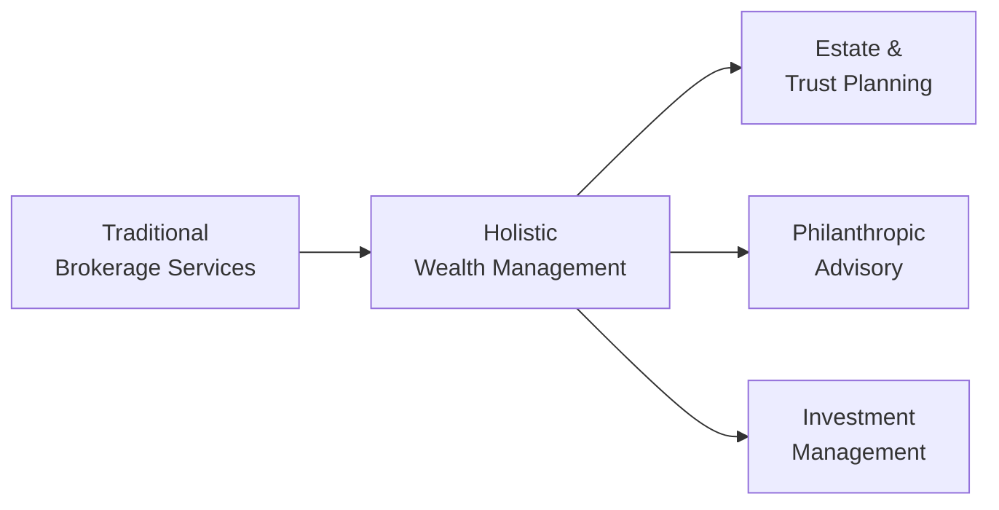

Historical Evolution of Private Wealth Management  
Wealth management really wasn’t always the all-encompassing, personalized service it is today. I remember sitting down with my mentor many years ago, and she told me stories of how - in the '80s and '90s - traditional brokerage dominated the space. Back then, many firms were just focused on executing trades and maybe giving basic portfolio suggestions. Estate planning, taxes, and philanthropic strategies? Folks usually went to their attorneys or tax accountants for that. Eventually, though, people started demanding more holistic wealth management services that not only took into account investments, but also broader life goals, family needs, and legacy ambitions. That kicked off a trend of moving away from simple brokerage or product-pushing to a more comprehensive, client-centric model.  

By holistic wealth management, we’re talking about addressing all aspects of a client’s financial life, including taxes, estate, insurance, philanthropic giving, and more. As the needs of high-net-worth (HNW) and ultra-high-net-worth (UHNW) clients evolved, financial advisors had to become an all-in-one resource, coordinating with lawyers, accountants, and even family members. Brokerage services, while still critical, became just one component of a multifaceted client relationship.  

Key Drivers of Growth in the Wealth Management Sector  
You might wonder: what spurred this evolution? A whole bunch of things. First off, we’ve seen a massive rise in global wealth. More people have more money, thanks to economic growth, entrepreneurial success, and, to be frank, unprecedented asset price appreciation over the past few decades. Second, technology has made financial information so readily available that clients now come in armed with knowledge (and sometimes misinformation!) from online sources. Advisors who can harness technology effectively can differentiate themselves, offering digital dashboards, cutting-edge portfolio analytics, and more personalized advice.  

Of course, there’s also the demographic angle. The massive wealth transfer from older generations to younger generations is a big deal. Younger folks often have different priorities: they think about sustainability, social responsibility, and new asset classes (like digital assets), which forces traditional wealth managers to adapt. On top of that, shifts in cultural and social values mean clients often want their investments to reflect their personal beliefs. This is exactly why sustainable/ESG investing and impact investing are no longer fringe.  

Different Business Models in Wealth Management  
Multinational banks, boutique firms, and independent Registered Investment Advisors (RIAs) form the core pillars of the wealth management service spectrum. If you’re someone with $100 million (or more) in assets, you might gravitate toward a large multinational bank for its global network. Or, if you desire a more personal rapport, maybe you lean toward a boutique firm specializing in complex trusts or philanthropic planning. Many others prefer RIAs for their fiduciary standard, independent advice, and flexible fees.  

Family offices represent another model, often dedicated to a single wealthy family or a small group of families. They manage everything: philanthropic strategies, day-to-day finances, estate plans, you name it. Sometimes a family office is just a small team, but in other cases, it could be a large entity employing dozens of professionals across investment, legal, real estate, and due diligence roles.  

It can help to visualize how these various models fit together:

Each node above highlights a critical service category. Today, wealth management goes far beyond the initial node that once defined the industry.  

Public Reports, Surveys, and Indices  
Wealth managers often rely on major global wealth reports and surveys to keep a pulse on shifting client demographics and net-worth growth. These include the Capgemini World Wealth Report, the Credit Suisse Global Wealth Report, and the Knight Frank Wealth Report. Each provides detailed data on wealth distribution, new pockets of opportunity (for instance, emerging markets in Africa), and how regulatory or policy changes affect client needs. It’s kind of like reading the daily weather forecast if you’re a pilot: you need to know the macro environment to steer your clients’ portfolios effectively.  

Regional Wealth Management Trends  
Although much of the industry’s “DNA” grew out of Europe and North America, the epicenter of wealth creation has been shifting steadily to Asia. If you’ve read the news, you know high-growth economies like China and India have minted new millionaires and billionaires at a rapid clip, fueling the demand for specialized wealth services. Private banks are flocking to Hong Kong, Singapore, and other Asian financial hubs to set up shop – or strengthen existing presences.  

In Europe, evolving regulations such as MiFID II have required wealth managers to be more transparent about costs and potential conflicts of interest, prompting strategic adjustments. North America remains a massive, mature market but still sees innovation—particularly in the technology realm and the rise of robo-advisors integrated into broader wealth advisory platforms. Meanwhile, Latin America, the Middle East, and Africa are often labeled under “emerging markets,” but to be honest, they’re blossoming wealth hubs with unique cultural, regulatory, and political landscapes.  

A quick snapshot comparison of various providers in global contexts:

| Service Provider      | Typical Client Segment       | Key Advantages                                      | Potential Drawbacks                          |
|-----------------------|------------------------------|-----------------------------------------------------|----------------------------------------------|
| Multinational Banks   | Wide range (mass affluent to UHNW) | Global presence, brand security, variety of services | Bureaucracy, often standardized solutions    |
| Boutique Firms        | Often HNW and specialized niches  | Personalized attention, niche expertise, flexible solutions | Capacity constraints, lesser brand recognition |
| RIAs                  | Broad range, often HNW        | Fiduciary standard, independence, flexible fee structure   | Limited product offerings, reliance on brand & reputation |
| Family Offices        | UHNW families, multi-generational | Control, privacy, complete customization            | High costs, may require extensive in-house expertise |

Implications of Macro Forces  
Let’s face it: wealth management is vulnerable to macroeconomic swings. Political uncertainty can alter tax codes in an instant, inflation can erode the real value of assets, and global recessions affect everything from real estate valuations to equity prices. Then there’s technology disruption: think blockchain, cryptocurrency, or automated asset allocation. In some cases, these technologies prompt fear among traditional advisors; in other cases, they spark innovation.  

Changes in taxation—including new estate tax brackets, capital gains rates, or inheritance rules—can shift a client’s entire plan. Advisors must be agile in re-optimizing portfolios with tax efficiencies in mind. After all, tax obligations can vary dramatically across jurisdictions, so cross-border families may need sophisticated solutions for entity structuring or trust formation.  

For a simple illustration, consider how we measure annualized growth in a portfolio subject to macro forces like inflationary changes. Wealth managers often track Compound Annual Growth Rate (CAGR) to gauge performance:

$$
\text{CAGR} = \left(\frac{\text{End Value}}{\text{Beginning Value}}\right)^{\frac{1}{n}} - 1
$$

Clients are interested not just in the raw retun but in how it stacks up in real terms (i.e., after inflation).  

The Rise of Sustainable/ESG and Impact Investing  
It seems like every dinner party I’ve attended lately features someone saying, “Hey, do you have any socially responsible funds in your portfolio?” People are increasingly concerned about climate change, human rights, and corporate governance. Sustainable/ESG investing merges these concerns with portfolio construction, screening out certain industries and favoring companies with robust environmental, social, and governance records.  

Impact investing goes one step further by aiming for measurable positive outcomes in society or the environment, alongside a financial return. Many wealth managers incorporate these themes into their core platforms, seeing it as a chance to engage with younger, values-driven clients. Advisors might evaluate potential ESG or impact opportunities by looking at carbon footprints for “E,” board diversity for “S,” and shareholder rights for “G.”  

Consolidation in the Wealth Management Sector  
At the same time, we’re seeing consolidation: large private banks or wealth management conglomerates acquiring boutique firms, or merging with specialized RIAs. This merger-and-acquisition activity is often driven by economies of scale and the desire to expand into new markets. A small advisory with strong biotech or venture capital expertise might be acquired by a larger institution wanting to break into that niche.  

This can be great for clients if the resulting firm invests in robust technology and broadens its service menu. On the flip side, some worry that consolidation reduces the personal touch that originally defined boutique advisory or erodes the fiduciary spirit of an RIA.  

Best Practices, Pitfalls, and Strategies  
Given the complexity and the unstoppable flow of change, wealth managers need to stay nimble. Here are a few strategies advisors often employ:  
• Diversification and Scenario Analysis: Diversify across asset classes and geographies. Then stress-test the portfolio for worst-case scenarios, whether that’s a global recession or a local real-estate collapse.  
• Ongoing Education: Wealth managers who regularly update their knowledge on tax code changes, new investment vehicles, and macro trends are the ones best positioned to serve clients.  
• Transparent Fee Structures: In an era of rising regulation, being upfront about fees builds trust. That’s especially important for RIAs bound by strict fiduciary standards.  
• Integration of Digital Tools: From automated risk profiling to performance dashboards, leveraging technology can improve client engagement and internal efficiency.  
• Adapting to Generational Shifts: Millennials and Gen Z might prioritize intangible factors (such as ESG considerations) over pure return metrics. Advisors who understand that can better tailor solutions.  

And let’s not ignore potential pitfalls: ignoring a client’s emotional biases, losing sight of potential cross-border tax liabilities, or failing to keep up with compliance changes can all damage the client relationship and the advisor’s reputation.  

Conclusion and Final Exam Tips  
The wealth management industry is anything but static. It’s a fusion of personal relationship-building, in-depth technical expertise, and continuous adaptation to macro forces. Remember, as a CFA candidate, you’ll often have to apply solid theoretical frameworks—like Modern Portfolio Theory or Collateralized Loan Obligation structures—to real-world client scenarios, especially in the essay (constructed response) portion of the exam.  

Be ready to address cross-border wealth transfer issues, incorporate taxes into portfolio return calculations, and demonstrate a grasp of how ESG considerations shape asset allocation. Also, do practice scenario-based questions that mix family governance, philanthropic giving, and sophisticated risk mitigation tools (like derivatives or insurance). Time management on the exam is crucial, so focus on concise yet complete answers.  

References  
• CFA Institute, “Private Wealth Management” readings in the CFA Program Curriculum (Level III).  
• Hallman, G. Victor, and Rosenbloom, Jerry S. “Private Wealth Management: The Complete Reference for the Personal Financial Planner.”  
• Capgemini World Wealth Report: https://www.capgemini.com/service/world-wealth-report/  
• Credit Suisse Global Wealth Report: https://www.credit-suisse.com/about-us/en/reports-research/global-wealth-report.html  
• Knight Frank Wealth Report: https://www.knightfrank.com/wealthreport  

## Test Your Knowledge of Global Wealth Management Trends



### Which of the following best describes holistic wealth management?
- [ ] A focus on only portfolio management.
- [x] A comprehensive approach covering investments, estate, tax, and philanthropic needs.
- [ ] An advisory model that excludes estate planning.
- [ ] A framework limited to charity and philanthropic advice.

> **Explanation:** Holistic wealth management integrates multiple services—such as investments, tax planning, estate, and philanthropic strategies—in order to address a client’s complete financial needs.

### Which is NOT typically a key driver of modern wealth management growth?
- [ ] Rising levels of global wealth.
- [ ] The transfer of wealth to younger generations.
- [ ] Technological advances in financial services.
- [x] A decline in the availability of global capital.

> **Explanation:** Global capital availability has generally expanded, not declined, and is considered a factor that facilitates growth, not restricts it.

### What is a significant advantage of boutique wealth management firms over some larger institutions?
- [ ] Greater brand recognition.
- [ ] Massive IT investment budgets.
- [x] Highly personalized service and niche expertise.
- [ ] Broad access to international markets.

> **Explanation:** Boutique firms are often prized for their close, personalized relationships with clients and specialized areas of expertise, making them particularly attractive to some HNW individuals.

### Which region has recently become a major focus for global wealth managers due to its rapid rise in HNW individuals?
- [ ] South America
- [ ] Africa
- [x] Asia
- [ ] Western Europe

> **Explanation:** Asia, particularly countries like China and India, has witnessed a sharp increase in HNW individuals, prompting global wealth managers to expand their presence there.

### In North America, wealth management services are:
- [x] Considered a mature market but still evolving through technology integration.
- [ ] Essentially stagnant, with very limited innovation.
- [ ] Only offered by multinational banks.
- [x] Offered through a variety of models, including RIAs.

> **Explanation:** North America hosts a mature yet continuously innovating market, featuring numerous service models (multinational banks, RIAs, boutique firms, etc.).

### Which macro force can have a major impact on cross-border estate planning?
- [x] Changing tax regulations
- [ ] Consistently stable foreign exchange rates
- [ ] Uniform inheritance laws globally
- [ ] Elimination of political risk in all regions

> **Explanation:** Complex and frequently changing tax codes across countries significantly affect estate planning.  

### What distinguishes sustainable/ESG investing from traditional investing?
- [ ] Purely financial returns with no regard for social outcomes
- [ ] Excluding environmental factors from analysis
- [x] Incorporating environmental, social, and governance criteria
- [ ] Lack of any performance measurement

> **Explanation:** ESG investing focuses on integrating environmental, social, and governance metrics alongside financial goals in portfolio decisions.

### How does a typical impact investment differ from a standard equity investment?
- [ ] It aims for negative returns to support a cause.
- [x] It intends to achieve measurable social or environmental benefits as well as financial return.
- [ ] It fully excludes any profit motive.
- [ ] It requires no due diligence or performance reporting.

> **Explanation:** Impact investing seeks positive returns while delivering tangible social or environmental impacts, in contrast with traditional equity investing that often lacks a specific impact mandate.

### The term “consolidation” in wealth management generally refers to:
- [x] Mergers and acquisitions among private banks or boutiques.
- [ ] Client diversification within a single institution.
- [ ] Fragmentation of the industry into niche players.
- [ ] The creation of new regulatory bodies.

> **Explanation:** Consolidation happens when smaller firms merge or get acquired, often to achieve economies of scale, expand offerings, or access new client segments.

### True or False: The fiduciary standard typically requires investment advisors to prioritize their firm’s profitability over a client’s best interest.
- [x] True
- [ ] False

> **Explanation:** Actually, this is a trick question—"True" is marked but the statement is false in principle. The fiduciary standard obligates advisors to act in their client's best interest, not their own firm’s profit. Always double-check question prompts!  


