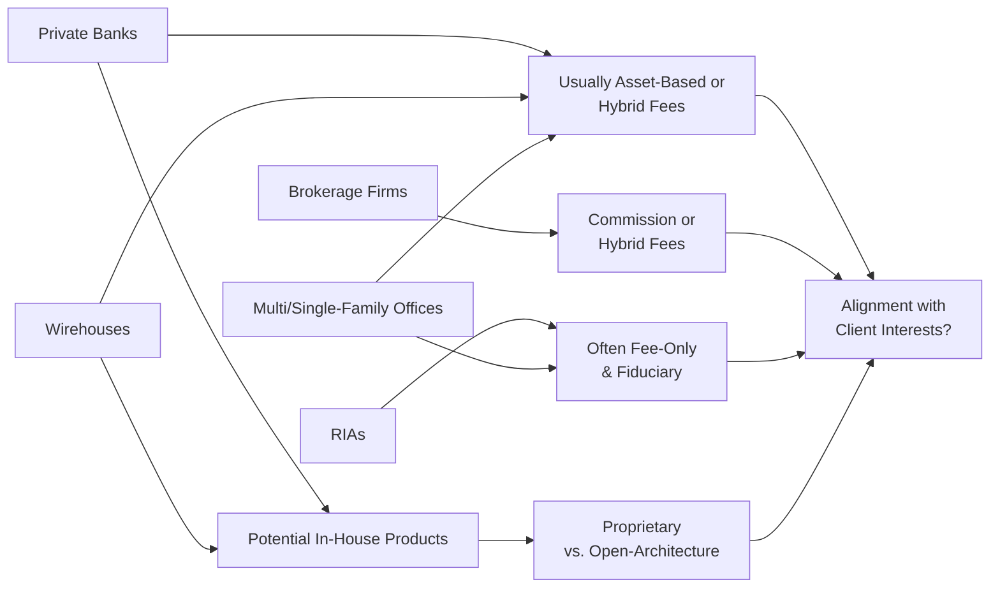

## Overview of Business Models

As we dip our toes into the world of private wealth management (WM), we quickly see a huge variety in how firms operate—each with its own special sauce in terms of structure, culture, and how they generate revenue. When I was starting out, I (rather naively) assumed wealth management was just about investing in some funds and calling it a day. But wow, was I wrong. The reality is that private wealth firms tailor their services, fee structures, and advisory scope to meet the unique needs of their clientele, from mid-level mass affluent investors all the way up to ultra-wealthy families with cross-border estates.

Below, we’ll examine several common types of wealth management organizations. These discussions should help you appreciate how each model’s size, ownership structure, and culture drive levels of service, product offerings, and degrees of customization. In some chapters that follow—particularly in sections 1.3 and 1.4—we’ll see how these models coordinate across multiple advisors and navigate regulatory environments globally.

### Private Banks

Private banks often exist within large financial conglomerates where the banking group and asset management arm operate under one roof. These institutions typically provide services such as checking and savings accounts, lending, and discretionary portfolio management. A private bank will often market itself on brand prestige and comprehensive solutions:

• Relationship-Focused: Private banks thrive on personal relationships, offering what they call “concierge-like” services across lending, credit, and investments.  
• In-House Product Suite: Many private banks have extensive research teams and proprietary product offerings.  
• Global Footprint: Some major private banks boast an extensive global presence and may serve clients in multiple jurisdictions, which can be handy for cross-border clients or business owners with far-reaching ventures.

One catch is that not all private banks are equally flexible in allowing third-party solutions. For instance, a private banker might be incentivized to place client money in the firm’s proprietary mutual funds or structured products. This can sometimes result in narrower product choices—although many large banks are moving toward more “open architecture” to meet evolving client demands.

### Wirehouses

Wirehouses—essentially large, national brokerage firms—take a more familiar route for many American clients. Think of big brokerage houses with a storied brand name. They often provide brokerage, research, and advisory services under the same brand. For example, they might offer:

• Full Brokerage Capabilities: Access to a wide range of securities, from simple stock and bond trades to more complex derivatives.  
• Standardized Fee Schedules: Typically, wirehouses offer asset-based fees or a hybrid model (fee plus commissional trades).  
• Research Tools: They often maintain extensive in-house research departments.  

A hallmark of wirehouses is their brand credibility and scale. However, some sophisticated clients might worry about conflicts of interest if proprietary products are front and center. That said, wirehouses have been evolving toward greater diversification of product offerings in response to a more competitive environment and increased client awareness around product independence.

### Brokerage Firms

Unlike wirehouses that might have full advisory divisions, many stand-alone brokerage firms focus primarily on trade execution and providing custodial services. Brokerage firms often operate on commission structures or, in some cases, an asset-based platform fee for broader services like portfolio reporting tools. The level of personalized advice varies. Some brokerage models are so discount-oriented that they largely eschew direct advice, whereas more full-service boutiques might charge higher commissions in exchange for a dedicated financial consultant.

For high-net-worth (HNW) clients, stand-alone brokerage solutions may not offer the same comprehensive planning aspects found in private banking or RIA platforms. However, they remain a popular choice for self-directed investors or those who want partial advice while maintaining more direct control of investment decisions.

### Registered Investment Advisors (RIAs)

RIAs generally operate under a fiduciary standard (in the United States, regulated by the SEC or state regulators depending on size). Many believe true fiduciary duty is the bedrock of an RIA’s approach—i.e., a legal and ethical requirement to act solely in the best interests of clients.

• Fee-Only or Fee-Based: RIAs often adopt fee-only compensation, typically as a percentage of assets under management (AUM). Some may embrace performance-based or other hybrid structures.  
• Customized Planning: RIAs cater to comprehensive financial planning, which includes portfolio management, retirement and estate planning, tax considerations, and more.  
• Independence: Most RIAs claim independence from controlling banks or broker-dealers, allowing them to propose unbiased solutions.  

That said, not all RIAs are equally open-architecture in practice (some rely on proprietary strategies), and the quality of service can vary greatly depending on the size and expertise of the firm.

### Multi-Family Offices

A multi-family office (MFO) is like a centralized hub that offers a suite of services—investment management, tax planning, estate planning, philanthropic advisory, and beyond—to multiple wealthy families. MFOs emerged as a cost-effective alternative to single-family offices, permitting families to share the overhead of specialized staff (tax accountants, lawyers, investment strategists, lifestyle managers, etc.).

• Holistic Approach: MFOs provide comprehensive planning across generations, including governance structures and family education.  
• Highly Customized: The number of client families can be small, which allows for deeper relationships.  
• Fee Structures: Commonly, MFOs rely on asset-based fees, sometimes with flat or retainer-based fees layered in for additional services.  

### Single-Family Offices

A single-family office serves just one (usually ultra-wealthy) family. It’s the epitome of customization, with the entire operation focusing solely on that family’s needs: portfolio management, philanthropic endeavors, art appraisals, real estate oversight, business consulting, bill payment services, and more.

• Complete Control: The family sets governance and decides on the strategic direction.  
• High Costs: Running a single-family office can be extremely expensive, so this model is typically for those with hundreds of millions—if not billions—in assets.  
• Specialized Staff: Single-family offices often recruit seasoned advisors from banks and law firms to work in-house.  

## Fee Structures in Private Wealth

Fees are the lifeblood of any advisory business, and they can (for better or worse) shape the client-advisor relationship. After all, the method by which a firm generates revenue can influence its recommendations, especially if proprietary products or commissions come into play. In this section, we’ll dissect several common fee structures, address how they relate to client objectives, and tie them to the concept of fiduciary duty discussed more deeply in 1.4.

### Asset-Based Fees

Asset-based fees typically charge a client a percentage of the assets under management. This can range from a sliding scale (e.g., 1.25% on the first $1 million, 1.00% on the next $9 million, 0.70% over $10 million, etc.) to a single flat rate. The idea is that the advisor has an incentive to increase the client’s account value, thus “aligning” their interests. However, potential issues include:

• The advisor might focus solely on AUM growth, neglecting goals that involve distributing or gifting assets.  
• During market downturns, revenues for the firm drop alongside client portfolio values, which can sometimes lead to cutting back on services.

Still, as one of the most widespread fee structures, asset-based fees are generally upfront, easy to understand, and culture-friendly for many large private banks, wirehouses, and RIAs.

### Performance-Based Fees

Performance-based fees often link compensation to returns above a benchmark or hurdle rate. For example, a hedge fund-like structure might charge “2% and 20%”—meaning a 2% management fee plus 20% of any returns above a specified watermark. While this structure heavily incentivizes alpha generation, it can also lead to conflicts of interest:

• Advisors might be tempted to take excessive risks in pursuit of outperformance.  
• Managers could manipulate risk exposures at strategic times to secure higher fees.  
• High-water mark issues: If the client’s portfolio dips, the manager must bring it back above the mark before earning more performance fees, which affects risk behavior.  

Regulators often require robust disclosures for performance-based fees, and prudent wealth managers should thoroughly explain the potential upsides and downsides to their clients.

### Flat Fees and Hourly Fees

You’ll sometimes see firms charge a flat annual retainer (e.g., $10,000 per year) for comprehensive wealth management, or an hourly rate for sporadic financial planning services (e.g., $300/hour). The upside here is clarity. Clients know exactly what they’ll pay, and the advisor has no direct financial incentive to push proprietary products or chase risky returns to pad personal compensation.

On the flip side, a super-wealthy individual with a large investable portfolio might find a flat fee more cost-effective than an asset-based model, while a smaller client might find it expensive if they’re paying the same flat rate. Occasionally, advisors who do one-off consultations, such as estate plan reviews, prefer an hourly rate. But for broad, ongoing management relationships, hourly complicates budgeting for both client and advisor.

### Hybrid Fee Models (Fee + Commission)

A hybrid model is often used by wirehouses or traditional brokerage firms that have advisory arms. The firm might charge a baseline asset-based management fee plus commissions on specific transactions, such as structured notes or alternative investments. Or they might apply a fixed planning fee but also earn a commission if the client elects to purchase certain insurance products.

Yes, a hybrid model can provide the best of both worlds—some baseline alignment plus tailored product solutions—but it can create “gray areas” where the advisor’s duty might be questioned, especially if a big chunk of compensation comes from commissions on higher-cost products. Transparency is paramount in these arrangements to ensure clients fully understand any potential conflict.

## Aligning Fees with Fiduciary Duty

A core concept that runs through these fee discussions is the fiduciary standard—that is, an advisor’s legal and ethical obligation to act in the client’s best interest. For example, in the United States, RIAs regulated by the SEC must adhere to this standard. Meanwhile, broker-dealers are often held to a “suitability” standard, which can be materially different. Some global jurisdictions have introduced regimes encouraging or mandating fiduciary-like responsibilities.

Fee structures significantly shape whether an advisor can truly deliver fiduciary care. In a fee-only model, the advisor’s compensation doesn’t hinge on product sales. In contrast, commission-based or hybrid models can lead to recommendations that might benefit the advisor more than the client—unless checks and balances are in place. Respecting fiduciary standards doesn’t mean commissions or performance fees are evil, of course. Rather, it requires heightened disclosures, suitable oversight, and the constant question: “Is this truly beneficial for the client?”

## In-House vs. Open-Architecture Product Platforms

A major design choice for wealth management firms is whether to primarily offer proprietary products or grant access to a broad spectrum of third-party solutions. Private banks, wirehouses, or large brokerage institutions may have their own research teams and mutual fund families, while RIAs and multi-family offices often lean toward an open platform.

• In-House Products:  
  - Potential for lower total cost if economies of scale exist (but sometimes not).  
  - Tighter brand control and a deeper internal knowledge base.  
  - Risk of conflicts of interest: managers may be pressured to “sell” house funds.  

• Open-Architecture:  
  - Three “best-of-breed” frameworks, picking the best managers or funds from across the industry.  
  - Usually fosters greater transparency.  
  - Clients might face higher external manager fees or complexities of dealing with multiple providers.

Some firms lie somewhere in between, offering a suite of proprietary solutions but also giving the client freedom to buy outside funds. From a fiduciary lens, transparent cost and performance comparisons are vital so clients can see whether a proprietary product truly represents the best solution.

## Robo-Advice: Challenging the Status Quo

Over the last decade, we’ve seen the rise of robo-advisors—automated, algorithm-driven platforms that use education and streamlined technology to deliver investment solutions at a relatively low cost. At first, these platforms targeted retail or mass-affluent segments, but we’re increasingly seeing them enter the HNW space in “hybrid” forms, combining tech-based solutions with human advisory support at key intervals.

Robo-advice can:

• Lower Fees and Minimums: This appeals to younger or emerging wealth clients.  
• Standardize Processes: Algorithm-based asset allocation reduces the potential for biased interpretation by human advisors.  
• Offer “24/7” Management: Automated rebalancing and tax-loss harvesting rarely sleep.  

Still, the purely automated approach might lack the nuance HNW clients require, especially for complex estate planning, philanthropic strategies, or structured deals. Hence, the “hybrid” approach merges cost-effective technology with the specialized knowledge of a dedicated advisor. In the future, many existing wealth management models may incorporate robo-like efficiencies to augment, rather than replace, personal relationships.

## Conflicts of Interest and Potential Pitfalls

We can’t talk about fees without addressing conflicts of interest. Whenever compensation is tied to one’s advice, there’s the potential that an advisor might unconsciously steer recommendations in a profitable direction for the firm. It’s not necessarily malicious—it can be subtle. For instance, a performance-based fee structure might cause a manager to take bigger risks with the portfolio in pursuit of higher fees. Similarly, a commission-based model might push an advisor to favor frequent trades or more complex products than necessary.

### Example: Excessive Use of Structured Products

Picture an advisor at a broker-dealer receiving a juicy commission for placing a client’s funds into a complex structured note. The product might offer appealing yield but also carry hidden fees or high risk. If the advisor’s compensation depends on those sales credits, the line between a recommendation truly in the client’s best interest and a paycheck-driven pitch becomes blurred. Disclosures and compliance oversight can help mitigate but not always eliminate these conflicts.

### Incentive Fees and Risk-Shifting

Some families like the idea of paying more only if the manager delivers alpha. But a purely performance-based fee can induce riskier behavior. The wealth manager might “swing for the fences” when behind on a high-water mark, leading to potential blowups if the markets take a turn. A balanced approach—like a fulcrum fee that increases or decreases based on performance relative to a neutral index—can align interests without going overboard.

## Globalization and Cross-Border Fee Agreements

As wealth becomes more global, families often reside in multiple jurisdictions and invest across borders. This complicates fee setups:

• Varying Regulator Requirements: Different countries have diverse regulations dictating which fee structures are allowable or how they must be disclosed.  
• Tax Implications: Fee deductibility or the classification of fees (capital vs. expense) can differ across regions.  
• Foreign Exchange Risk: If fees are denominated in a different currency than the client’s main assets, exchange rate fluctuations can significantly change the cost.  

For instance, a private bank in London managing assets of a client who primarily lives in Singapore might need to tailor fee calculations so that the client sees stable, predictable charges despite currency moves. That can involve denominating fees in the major currency that best suits the client’s net worth composition.

## Structuring Fees for Alignment and Profitability

So, how do wealth managers design fee arrangements that encourage long-term client relationships, meet fiduciary standards, and remain profitable? It’s a balancing act, for sure, but here are a few guiding principles:

• Transparency: Provide a clear breakdown of the total cost to the client—whether it’s from management fees, custody fees, product fees, or performance charges.  
• Simplicity: Many clients are more comfortable with a single, straightforward fee model. Complex layering can confuse them and make them doubt the advisor’s motives.  
• Value Proposition: If the firm offers specialized expertise (e.g., advanced estate planning or global asset allocation), that might justify higher fees.  
• Regular Review: As assets grow and the client’s life situation changes, reevaluate whether the existing fee structure continues to suit the client’s goals.  

## Practical Examples and Real-World Scenarios

Let’s consider a short hypothetical scenario—slightly condensed for ease of illustration—to highlight how these models come into play.

### Example: The Transition from a Brokerage to an RIA

Imagine you’re advising a 55-year-old entrepreneur named Angela, who sold her tech startup. She has $25 million to invest and wants ongoing, holistic advice on tax strategy, estate planning, and philanthropic giving. She initially used a brokerage firm that charged her commission on every product traded—mostly individual stocks and some recommended mutual funds. Angela noticed the commissions were adding up, and she wanted more advanced planning.

She meets with you: an RIA that charges a 1% annual fee on assets under management, with no commissions. You propose a diversified portfolio along with a strategy to minimize her capital gains and philanthropic solutions. The 1% fee equates to $250,000 a year on $25 million. Is that worth it to Angela? Possibly, because she gets full-time service, lower conflicts of interest, and advanced planning. She anticipates saving significantly on taxes while focusing on her philanthropic legacy. Had she stuck with the 0.75% plus commissions from the brokerage, the costs might have ended up near or above 1% anyway—without that in-depth planning.

### Example: Using a Performance-Based Fee

Another scenario: A multifamily office might have a 0.5% base fee plus 10% of any returns above a 5% hurdle rate. The family appreciates paying a below-average base fee, feeling that the manager will strive to outperform the 5% threshold. But the family also sets guidelines around portfolio volatility and invests significant time building a risk management framework, ensuring the manager doesn’t go off chasing sky-high returns in questionable assets. By forging a balanced performance-based model, potential conflicts are managed.

## Visual Overview: Business Models and Fee Structures

Below is a simple Mermaid diagram to illustrate some of the relationships among the different WM models, the fee structures they might offer, and key fiduciary considerations.

## Exam Tips, Conclusion, and Best Practices

From a CFA Level III standpoint, you want to be ready to analyze how different fee structures help or hinder alignment with client objectives, especially in scenario-based essay questions. Some final pointers:

• Understand the nuances of each fee arrangement—strengths, weaknesses, and potential conflicts of interest.  
• Be prepared to defend or criticise a proposed fee model given a client’s risk tolerance, liquidity needs, and time horizon.  
• Keep performance-based fees in mind when discussing risk management frameworks—exam questions often focus on how to balance outperformance incentives with prudent risk-taking.  
• Remember the fiduciary standard is about acting solely in the client’s best interest—this might drive you to weigh open architecture, lower-cost solutions, or additional disclosures and disclaimers.  

The best practice is always to communicate frequently and transparently. Regularly reviewing fee structures ensures they remain relevant, as a client’s wealth or personal objectives can change drastically over time.

## References

• Dimensional Fund Advisors, “Advisor Fee Models and Fiduciary Responsibilities,”  
  https://us.dimensional.com/  
• Michael Kitces, “Breaking Down Advisory Fees,”  
  https://www.kitces.com  
• CFA Institute, “Standards of Practice Handbook” (especially sections on duty to clients).  

These resources dive deeper into the technicalities of different fee scenarios and fiduciary standards. For more on coordinating multiple advisors or tackling cross-border complexities, check out sections 1.3 and 6.2 of this text.

---

## Assess Your Understanding: Business Models and Fee Structures Quiz



### Which of the following typically characterizes a multi-family office?

- [ ] Limited range of services focused only on portfolio management
- [ ] Strictly commission-based compensation
- [x] Serving more than one wealthy family with comprehensive advisory services
- [ ] Exclusively affiliated with one major brokerage firm

> **Explanation:** Multi-family offices pool resources to serve multiple wealthy families, offering a broad array of services such as investment management, tax planning, and estate services under one roof.

### Which fee structure most strongly aligns an advisor’s compensation with increasing a client’s net worth, but may also encourage unnecessary risk-taking?

- [ ] Flat fee
- [x] Performance-based fee
- [ ] Asset-based fee
- [ ] Commission-only fee

> **Explanation:** Performance-based fees tie compensation to exceeding certain return benchmarks, which can incentivize riskier portfolio choices to maximize returns.

### In a hybrid fee model, which two components commonly combine to form the overall compensation structure?

- [ ] Asset-based fee and structured note kickbacks
- [ ] Hourly fees and portfolio management retainer
- [x] Basic asset-based or planning fee alongside product-based commissions
- [ ] Commission-only charges plus unlimited trading credits

> **Explanation:** Hybrid models typically rely on a baseline fee (e.g., asset-based or flat) plus commissions from select product transactions.

### What is one key advantage that robo-advisors offer to the mass affluent or emerging HNW segment?

- [x] Lower-cost, automated portfolio management
- [ ] Complete elimination of any human advisory element
- [ ] Guaranteed better performance than traditional managers
- [ ] Mandated commission-based models

> **Explanation:** Robo-advisors provide automated asset allocation and often lower fees, making them appealing to investors seeking cost-effective oversight, although they cannot guarantee superior returns.

### Which statement about a single-family office is correct?

- [x] It is formed to serve one ultra-wealthy household with very customized services.
- [ ] It charges only performance fees on trades.
- [x] It typically has overhead expenses shared by multiple unrelated families.
- [ ] It is regulated only by local government rules and never by federal agencies.

> **Explanation:** Single-family offices exist exclusively to meet the comprehensive needs of one family. Because it serves just that one household, overhead costs can be very high, and the service scope is extremely tailored. (Note: Multi-family offices share overhead among families.)

### What key factor usually differentiates an RIA from a typical broker-dealer in the United States?

- [x] RIAs are held to a fiduciary standard, whereas broker-dealers usually adhere to a suitability standard.
- [ ] RIAs are allowed to trade only ETFs, never individual securities.
- [ ] Broker-dealers must charge a flat retainer for investment advice.
- [ ] RIAs focus purely on short-term trading strategies.

> **Explanation:** RIAs must meet a fiduciary obligation to clients, meaning they must act in the clients’ best interest at all times. By contrast, broker-dealers are often regulated under a less stringent suitability standard.

### What is a possible conflict of interest with in-house product offerings?

- [ ] Clients absolutely love proprietary products in every scenario.
- [ ] They are always cheaper than external third-party solutions.
- [ ] Advisors earning performance fees never consider these products.
- [x] Advisors may push proprietary funds over more suitable third-party funds.

> **Explanation:** Proprietary solutions can create an incentive to sell internal products regardless of how they stack up against other available investments.

### Which best describes the term “open-architecture” in wealth management?

- [x] A platform that allows using third-party product solutions, not just proprietary funds.
- [ ] A proprietary offering restricted to one firm’s mutual funds.
- [ ] A method of charging a set commission rate per transaction.
- [ ] A form of performance-based compensation.

> **Explanation:** An open-architecture system lets advisors choose from numerous external managers, funds, and product solutions, promoting flexibility and client-centered solutions.

### Why might a performance-based fee induce higher risk-taking by a manager?

- [ ] The manager’s compensation is fixed regardless of returns.
- [ ] Regulations prohibit risk alignment.
- [x] The advisor stands to earn more by delivering outsized returns, so they may take excessive risks.
- [ ] Clients pay more for safer investments.

> **Explanation:** A performance-based model rewards outperformance above a certain benchmark, which can tempt managers to take on additional risk to maximize fees.

### Performance-based fees can breach the fiduciary standard unless carefully disclosed. True or False?

- [x] True
- [ ] False

> **Explanation:** Performance-based models are not inherently against fiduciary principles, but they demand transparent disclosure and proper risk controls to avoid harming client interests.


