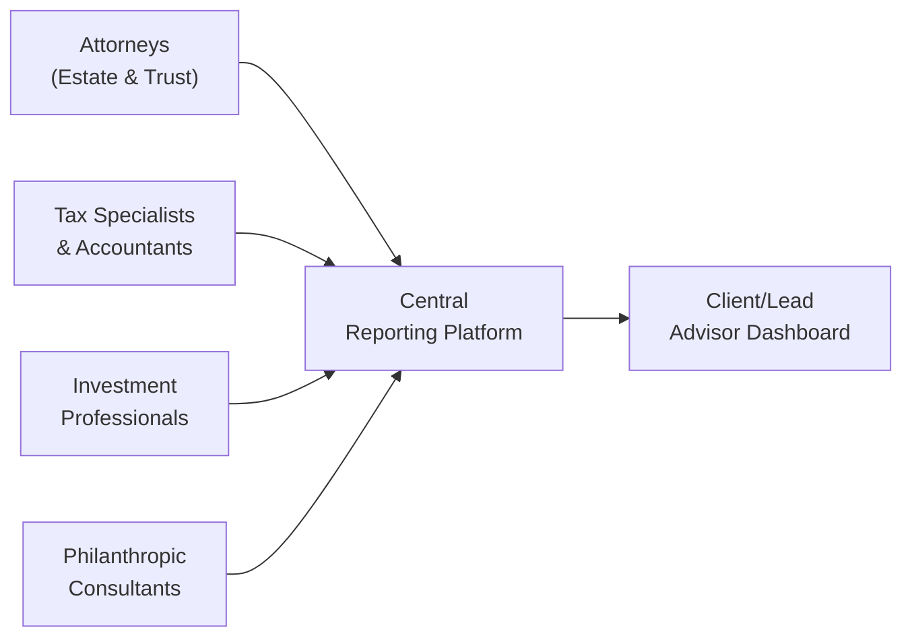

## Introduction

Coordinating multiple advisors for high-net-worth (HNW) clients is a bit like trying to conduct a full orchestra. You’ve got attorneys, tax specialists, accountants, philanthropic consultants, estate planners, and of course, investment professionals—everyone is performing a different part of the same symphony. If one section is out of tune, the overall performance suffers. So, ensuring these professionals work together seamlessly is vital to serving clients at the highest level. 

I remember the first time I was tasked with corralling a handful of specialty advisors for a newly minted ultra-high-net-worth client—let’s call them “the Johnson family.” There was the longtime family lawyer, a seasoned accountant, and an estate planner who had never even spoken to each other. And, um, can you imagine the confusion when each of them had a different idea about how the Johnsons’ trust structure should look? Eventually, it clicked that a “quarterback” role, or lead advisor, was necessary. This single point of contact ensured each specialist’s input was integrated into a cohesive strategy. 

Below, we’ll discuss key challenges, outline strategies for effective role mapping, explore consolidated reporting, address conflict resolution, and consider cross-border complexities, ultimately helping you understand how to keep the client’s total financial picture front and center.

## Key Challenges

High-net-worth individuals often have complex financial needs that span multiple disciplines—legal, tax, investment, and philanthropic. This complexity can lead to a few common hurdles:

• Overlapping Expertise: Occasionally, professionals may overlap in some areas (e.g., tax knowledge among accountants and estate planners), leading to confusion about whose perspective takes precedence.  
• Conflicting Advice: Advisors with specialty biases might propose contradictory strategies—for instance, a tax specialist might suggest a certain trust structure primarily for tax benefits, while the estate attorney prioritizes successor control and smooth governance.  
• Fragmented Information: Without a unified portrait of the client’s total wealth, assets, liabilities, philanthropic goals, and estate documents, each advisor can only see one part of the puzzle.  
• Communication Gaps: Advisors often work in isolation, which can hamper timely and accurate decision-making.  

At the end of the day, the biggest challenge is simply that no single advisor has the entire scoop. If they don’t communicate effectively—like sections in an orchestra playing with different sheet music—the result is dissonance rather than harmony.

## Roles and Responsibilities

A crucial first step is to clearly outline the roles and responsibilities for each advisor involved. You’ll want to ensure there is no ambiguity about who is in charge of what, timescales, and areas of accountability.

• Attorneys: Typically focus on legal structures like wills, trusts, business agreements, and regulatory compliance.  
• Accountants/Tax Specialists: Handle income, estate, and gift tax matters; create efficient tax strategies; ensure necessary reporting.  
• Philanthropic Consultants: Craft charitable giving plans and build structures like donor-advised funds, private foundations, or charitable trusts.  
• Estate Planners: Oversee wealth transfer details (including generational planning and guardianship issues) in tandem with legal counsel.  
• Investment Professionals: Propose portfolio strategies consistent with the client’s risk tolerance, goals, liquidity needs, legacy objectives, and any ESG or sustainable investing preferences.  

By putting these roles in writing—like an org chart with job descriptions—clients see exactly who addresses which piece of the puzzle. Advisors also get clarity, which reduces friction. In some instances, you might even sign a formal service agreement referencing these roles so that everyone is crystal clear about the scope of engagement.

## The Lead Advisor or “Quarterback”

Imagine you have too many cooks in the kitchen: it’s a classic miscommunication risk scenario. A lead advisor, or what many folks call the “quarterback,” takes the burden of central coordination off the client’s shoulders. 

• Communication Hub: All updates and decisions funnel through the quarterback, who then relays the information to the relevant advisors.  
• Strategic Alignment: The quarterback ensures, for instance, that the accountant’s tax minimization technique doesn’t conflict with the attorney’s asset protection plan.  
• Decision Maker: While the client is, of course, the ultimate decision maker, the lead advisor synthesizes the various advisors’ viewpoints and organizes them into cohesive recommendations for the client to evaluate.  

In my experience, having a single go-to person has drastically minimized confusion. During a complex estate reorganization, one of my clients struggled to get a consistent story when four different professionals each had strong but differing perspectives. Our solution was that the wealth manager became the point person to gather input and deliver a unified recommendation. This streamlined the entire process and kept the estate plan from becoming a tangle of conflicting strategies.

## Communication Protocols

A frequent culprit behind breakdowns is the simple lack of clarity about how and when people should exchange information. With so many specialists involved, it’s all too easy for them to silo themselves. So, let’s consider a few basic best practices:

• Scheduled Calls or Meetings: Decide how often the team checks in—quarterly, monthly, or more frequently for complex cases. Circulate a simple agenda of updates from each advisor.  
• Communication Channels: Some prefer email, others phone calls or secure project management platforms. Define communication methods that work best for the team’s style.  
• Documentation and Summaries: After each meeting, the lead advisor sends concise summaries to confirm decisions made, next steps, and responsibilities.

By having consistent protocols in place, you help manage expectations and ensure no one’s left out of critical developments.

## Best Practices for Integrated Reporting

Centralized reporting is powerful. Imagine the convenience of the “Johnson family” seeing a single dashboard that shows portfolio performance, trust assets, forward-looking tax liabilities, philanthropic commitments, and major estate documents. That kind of integrated snapshot is like a master scoreboard for the entire team of advisors.

Tools such as specialized wealth management software, cloud-based project collaboration platforms, or custom trust management solutions allow for:

• Consolidated Data: All financial, tax, and legal information in one place.  
• Real-Time Updates: Advisors can input new or revised data, ensuring the family sees updated numbers regularly.  
• Alerts and Action Items: The system can highlight tasks (e.g., “Trust renewal needed by year-end”) so advisors and the client can address issues promptly.

Below is a simple diagram showing how advisors feed information into a centralized reporting system:

In this diagram, all advisors feed pertinent data into a central platform (node C). The democratized data then flows to the client and the lead advisor (node F) to create an up-to-date, holistic picture.

## Conflict Resolution Frameworks

Even the best working teams run into occasional conflicts—maybe about transaction structuring, philanthropic budgets, or how to interpret new regulations. Having a structured process to resolve these conflicts:

• Identify the Core Issue: Is the disagreement about legal compliance, philosophical values, or something else?  
• Invite Dialogue: Give each advisor a chance to present their perspective calmly.  
• Explore Alternatives: Encourage brainstorming about solutions where both tax considerations and philanthropic desires can be met.  
• Escalate Strategically: In tough scenarios, the lead advisor may need to bring in a neutral mediator or secure a second opinion from an outside expert.  

I once found myself in the middle of a heated conflict between a philanthropic consultant who wanted to structure a no-strings-attached donation, and the family attorney who insisted on partial control over the donated funds to align with the family’s brand. We mediated by establishing a separate charitable entity that balanced the philanthropic consultant’s flexibility concerns and the attorney’s control stipulations. Problem solved.

## Ensuring Consistent Messaging

Different professionals can interpret a family’s goals differently, leading to contradictory recommendations. This can confuse clients and make them question the validity of the guidance they’re receiving. Ideally, the lead advisor regulates this by:

• Sharing Summaries of Client Goals: Provide each advisor with a written summary of the family’s key objectives—wealth preservation, philanthropic legacy, or cross-border asset protection.  
• Coaching Advisors on Language: Encourage plain language that’s coherent and consistent. Reduce industry jargon where possible.  
• Aligning on Presentation Style: Decide whether the group presents final proposals in writing, via teleconference, or in person, thereby controlling the narrative and preventing fragmentation.  

## Cross-Border Complexities

For families with assets in multiple jurisdictions—or with family members living abroad—the complexity level ramps up considerably. Advisors may need to address:

• Multiple Tax Regimes: Overlapping or conflicting international tax rules.  
• Estate Laws that Vary by Country: Wills and trusts may not have the same legal standing everywhere.  
• Currency Exposures: Impact on investments and philanthropic contributions when dealing with multiple currencies.  

These cross-border matters often require specialized legal counsel licensed in each relevant jurisdiction, as well as a robust tax strategy to avoid double taxation or unexpected liabilities. Whenever possible, encourage your clients to consolidate their advisory team with globally experienced professionals who can coordinate. Alternatively, local counsel in each jurisdiction can collaborate with the client’s main attorney.

## Maintaining a Dynamic Total Financial Picture

Families evolve—people marry, have children, move, start new businesses, or set up philanthropic foundations. So the best approach is to keep the total financial picture dynamic and up to date. 

• Periodic Review: On a regular schedule (often annually or semi-annually), the team should review the client’s entire wealth structure, updating for life events or changes in laws and markets.  
• Goal Shifts: As new generations step in and new preferences emerge (like ESG-friendly investing or philanthropic pivot), advisors must recalibrate strategies.  
• Scenario Planning: Applying scenario analysis or stress testing (e.g., large market drops, new tax legislation) gives the family insight into what might happen under different economic or legislative conditions.  

There’s something satisfying about seeing a 5-year wealth trajectory transform into a 25-year plan integrating multiple generations. Advisors can become the foundation for building a truly lasting legacy.

## Putting It All Together: A Real-World Scenario

Let’s say the “Johnson family”—with a net worth of over $100 million—includes members across three continents. They have to navigate currency fluctuations, multiple estate laws, philanthropic objectives, and myriad investment vehicles. To coordinate:

• The estate attorney drafted a trust to protect near-term assets. Then, an international tax attorney weighed in to see if the trust’s structure complied with multiple jurisdictions.  
• An accountant integrated the new trust’s parameters into the family’s tax strategy, focusing on potential withholding taxes from cross-border investments.  
• The philanthropic consultant designed a foundation structure that’s recognized in multiple countries, enabling tax benefits for philanthropic contributions.  
• The lead advisor compiled these recommendations and created a single integrated plan. The entire team met monthly to confirm alignment and document changes.

That’s synergy. It’s the difference between a bunch of soloists each doing their own thing and a team delivering a concerto that truly resonates.

## Final Thoughts and Exam Tips

When preparing for the CFA Level III exam—particularly with a focus on private wealth management—keep these questions in mind: How would I identify key stakeholders for a high-net-worth family? What frameworks can I use to create a synergy of advisors? Which communication protocols best reduce confusion? You might see these scenarios in constructed-response or item set questions. 

• Pitfall Alert: Don’t forget that the client is the ultimate decision-maker and that all strategies should circle back to the client’s stated objectives—no matter how many experts are in the room.  
• Time Management Strategy: In exam settings, you’ll want to concisely identify each advisor’s role and quickly demonstrate the interplay among advisors.  
• Scenario-Based Practice: Work through hypothetical “mega-client” scenarios, tackling estates, philanthropic goals, cross-border issues, and more. Summarize how you’d coordinate advisors.  
• Ethical Standards: Remember the CFA Institute Code and Standards—especially conflicts of interest and confidentiality. With multiple advisors, upholding these ethical principles requires robust recordkeeping and crystal-clear disclosures.

In the end, coordinating multiple advisors draws on your interpersonal, organizational, and leadership skills—arguably as much as your technical finance know-how.

## References

• Hughes, James E., “Family Wealth—Keeping It in the Family,” Bloomberg Press.  
• CFA Institute, “High-Net-Worth and Ultra-High-Net-Worth Client Management,” part of the Private Wealth series.  
• The Society of Trust and Estate Practitioners (STEP) website: https://www.step.org/  

---

## Coordinating Multiple Advisors: Test Your Knowledge



### When organizing multiple advisors (e.g., attorneys, accountants, estate planners) for an HNW client, what is the primary goal of the “quarterback” or lead advisor role?

- [ ] To replace other advisors entirely.  
- [ ] To identify which advisor to fire if conflicts arise.  
- [x] To serve as a central point of contact and ensure cohesive decision-making.  
- [ ] To handle only philanthropic concerns.  

> **Explanation:** The lead advisor’s primary job is to coordinate the various specialists and help provide a unified wealth management strategy, not to replace or fire any other professionals.

### Which of the following best describes integrated reporting?

- [ ] A platform that only tracks equity investments.  
- [ ] A fixed quarterly statement and no updates in between.  
- [x] A consolidated approach to centralize client data across investments, trusts, taxes, etc.  
- [ ] A verbal promise of updates but no formalized process.  

> **Explanation:** Integrated reporting centralizes data from all advisors—legal, tax, investments, philanthropic—into one cohesive dashboard or report.

### In a high-net-worth context, why is role clarity among various specialized advisors so crucial?

- [x] It helps prevent overlap and confusion, leading to more efficient collaboration.  
- [ ] It ensures each advisor is well-paid.  
- [ ] It replaces the need for estate planners and tax consultants.  
- [ ] It reduces the number of required client meetings to zero.  

> **Explanation:** When roles and responsibilities are clear, conflicts drop and collaboration improves, ensuring the client’s best interests are consistently served.

### What is a common reason for conflicts among different advisors working with the same HNW client?

- [ ] They always have identical objectives.  
- [x] Divergent professional focuses can produce contradictory recommendations.  
- [ ] Advisors are generally uninterested in serving the client.  
- [ ] All advisors must have the same specialization.  

> **Explanation:** Differing professional backgrounds and priorities can create tension if there’s no coordinated framework for resolving conflicting opinions.

### Why might cross-border complexities complicate the work of multiple advisors?

- [x] Differing tax regimes and legal systems can lead to conflicting recommendations.  
- [ ] All countries share the same tax regulations, so there is no complexity.  
- [x] Advisors may lack the necessary licenses to practice in foreign jurisdictions.  
- [ ] Cross-border issues are usually handled by the accountant alone.  

> **Explanation:** Multiple countries often have different regulations for taxes, estates, businesses—you name it. Plus, cross-border transactions can demand a specialized professional licensed to practice in each jurisdiction.

### What is one best practice to ensure consistent messaging when multiple professionals are involved?

- [x] Provide each advisor with a written summary of the family’s overarching goals.  
- [ ] Let each advisor talk directly to the client without coordination.  
- [ ] Wait until conflicts occur to clarify the message.  
- [ ] Tell the client to manage all communications.  

> **Explanation:** Sharing a single, well-documented set of the client’s priorities ensures that each advisor tailors their advice accordingly and avoids contradictory instructions.

### Which of the following is a benefit of scheduling frequent team calls among advisors?

- [x] Reduces silos by allowing timely updates and clarifications.  
- [ ] Eliminates the need for the lead advisor altogether.  
- [x] Encourages cross-pollination of ideas among specialists.  
- [ ] Is only relevant if the client cannot afford personal meetings.  

> **Explanation:** Regular communication fosters collaboration among advisors. It also ensures everyone is informed and reduces duplication of efforts or conflicting approaches.

### Why is maintaining a dynamic total financial picture important for HNW families?

- [x] Life events and legislative changes demand a fluid update of strategies.  
- [ ] Client objectives are fixed forever and should never change.  
- [ ] It eliminates the role of philanthropy.  
- [ ] Only the estate planner should update the financial picture.  

> **Explanation:** Families evolve, and so do laws and markets. Updating the total financial plan ensures that the strategies remain aligned with current reality.

### How can a lead advisor help in cases where philanthropic consultants disagree with legal counsel over donation structures?

- [x] By mediating discussions, possibly creating alternative solutions that satisfy both interests.  
- [ ] By deferring the decision until after the client’s death.  
- [ ] By ignoring philanthropic goals in favor of legal policies.  
- [ ] By dissolving the philanthropic consultant’s role.  

> **Explanation:** The lead advisor’s job is to find middle ground (or a creative solution) when advisors prioritize different aspects of a client’s goals.

### True or False: The lead advisor makes all final decisions on behalf of the client.

- [x] True  
- [ ] False  

> **Explanation:** Strictly speaking, this statement can be tricky. In practice, the client retains ultimate decision-making power. However, in many wealth management setups, the client often defers to the lead advisor’s guidance for final recommendations and cohesive implementation. For exam purposes, be clear that the client is the ultimate decision-maker yet often relies heavily on the “quarterback’s” integrated advice.


