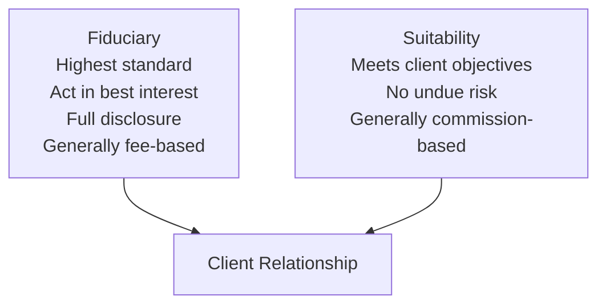
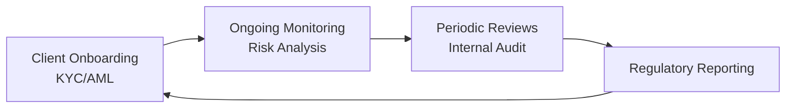

## Introduction

Let’s be honest—discussing regulations and compliance can feel a tad overwhelming, even for detail-oriented professionals. I remember my first experience with Anti-Money Laundering (AML) checks, staring at a spreadsheet of potential “red flags” while thinking, “Um, is this really necessary for every single client?” But the reality is that a solid grasp of the regulatory landscape and your firm’s compliance obligations is crucial for protecting both clients and your business.

This section explores the major regulatory frameworks that govern wealth management globally, delves into the nuances of fiduciary and suitability standards, and examines the role of AML, “Know Your Customer” (KYC), cross-border compliance, and more. We’ll highlight best practices, potential pitfalls, and considerations for ensuring a robust compliance culture. By the end, you should have a thorough understanding of how to align your wealth management activities with legal and ethical obligations—while still serving clients effectively and responsibly.

## Key Global Regulatory Frameworks

Regulations in private wealth management vary considerably across jurisdictions, but some pillars remain fairly consistent. Most frameworks focus on consumer protection, market integrity, and transparency. Four major regulators often referenced in global contexts are the U.S. Securities and Exchange Commission (SEC), the European Securities and Markets Authority (ESMA), the Monetary Authority of Singapore (MAS), and the UK Financial Conduct Authority (FCA). Familiarity with each provides a helpful perspective when dealing with cross-border clients or multinational families.

### The SEC (United States)
The SEC is the primary body ensuring fair and efficient markets in the United States. It oversees securities exchanges, broker-dealers, investment advisors, and mutual funds. For private wealth managers, the SEC enforces mandatory disclosures, focuses on preventing fraudulent activities, and requires that investment advisors either register or qualify under relevant exemptions. The SEC’s major concern is to ensure that clients are well-informed: so, advisors must provide crucial information about fees, conflicts of interest, and investment strategies.  
• One hallmark of the SEC’s approach is the Investment Advisers Act of 1940, under which registered investment advisors operate. If you’re advising US-based clients, you’ll likely be subject to these regulations, particularly pertaining to disclosures and fiduciary duty.

### ESMA (European Union)
In Europe, the overarching body is the European Securities and Markets Authority (ESMA), which issues guidelines and implements directives like MIFID II (Markets in Financial Instruments Directive). ESMA aims to safeguard investor interests and foster stable financial markets across the EU.  
• ESMA’s focus includes ensuring that advisors properly classify clients as retail or professional, abide by strict product governance rules, and follow best execution practices. Compliance with ESMA guidelines often requires robust documentation, from client onboarding forms to suitability test questionnaires.

### MAS (Singapore)
Singapore’s Monetary Authority (MAS) serves as both the central bank and main financial regulator. MAS emphasizes prudent risk management, transparent disclosure, and consumer protection. One hallmark is that wealth managers are required to comply with a Code of Conduct for capital markets—this code addresses suitability, knowledge of product offerings, and ongoing advice.  
• The MAS also has a strong stance on AML/KYC, imposing rigorous policies to catch money laundering activities. Singapore’s position as a global wealth hub makes it especially vigilant about cross-border transactions and suspicious financial flows.

### FCA (United Kingdom)
The Financial Conduct Authority (FCA) in the UK is renowned for its “principles-based” approach, which means they set overarching rules but expect firms to take responsibility for applying them in spirit, not just in letter. Compared to some prescriptive regimes, the FCA champions outcomes-focused regulation—did the client truly receive fair treatment and a suitable product?  
• The FCA also places special emphasis on avoiding conflicts of interest and ensuring transparent fee structures. If you operate or have clients in the UK, you’ll be subject to both the FCA and certain EU regulations, although post-Brexit transitions continue to evolve.

## Suitability vs. Fiduciary Standards

One of the trickiest distinctions in wealth management is the difference between operating under a fiduciary standard versus a suitability standard. Although both aim to protect the client’s interests, the scope of obligations and legal ramifications can differ dramatically:

• Fiduciary Responsibility: This is considered the highest standard of care. Advisors have a legal duty to act solely in the client’s best interest—no ifs, ands, or buts. Full disclosure of conflicts of interest is mandatory, and when conflicts cannot be mitigated, fiduciaries must put clients first. In the United States, Registered Investment Advisors (RIAs) owe a fiduciary duty, while brokers typically operate under a suitability standard (unless other rules apply).

• Suitability Standard: Under suitability, an investment recommendation must simply be suitable for the client’s needs, risk tolerance, and objectives. This doesn’t necessarily mean it’s the optimal choice or that cheaper alternatives don’t exist. Brokerage houses often follow this standard, as do many advisors in jurisdictions lacking explicit fiduciary requirements.

Here is a simple visual that compares the two standards:

In some jurisdictions and business models, these lines can blur. Hybrid models exist where an advisor might owe fiduciary duty for certain activities while being compensated in ways resembling brokerage commissions. Understanding your local regulations—and, crucially, communicating your obligations to the client—helps ensure clarity and compliance.

## AML and KYC Requirements

### Why AML and KYC Matter
Anti-Money Laundering (AML) and Know Your Customer (KYC) regulations exist to prevent illegal funds from circulating in the financial system. If you’re thinking, “Well, I’m not dealing with shady characters,” that’s not always enough. The rules create systematic checks so that criminals can't easily stash illicit proceeds in legitimate investments.  

Many countries have AML laws aligned with global standards like those promulgated by the Financial Action Task Force (FATF). The processes typically include verifying client identities, assessing risk profiles, and reporting suspicious activities to regulators.

### Typical AML/KYC Process
1. Client Identity Verification: Collect and verify information such as ID documents, proof of address, and beneficial ownership details (especially for trusts or businesses).  
2. Risk Profiling: Classify clients according to their risk level, often “low,” “medium,” or “high,” depending on factors like geographic location, politically exposed status, and transaction history.  
3. Ongoing Monitoring: Continuously check account activity. Patterns that deviate from a client’s known profile could trigger red flags or additional due diligence.  
4. Reporting: File Suspicious Activity Reports (SARs) with the relevant regulator if money laundering is suspected.  

Non-compliance with AML/KYC rules can lead to severe penalties, reputational damage, or even criminal charges—so it’s definitely an area you don’t want to overlook.

## Cross-Border Compliance

### Tax Compliance: FATCA and CRS
Cross-border wealth management brings additional complexity. U.S. citizens, for instance, are subject to the Foreign Account Tax Compliance Act (FATCA). This legislation requires financial institutions worldwide to identify and report accounts held by U.S. persons to the Internal Revenue Service (IRS). Non-compliance can mean hefty withholding taxes on foreign institutions dealing with U.S. financial markets.

Meanwhile, the Common Reporting Standard (CRS) is a global initiative led by the OECD for automatic exchange of financial information. Over 100 jurisdictions have signed up, meaning that if your client has accounts in multiples countries, those account details may be automatically shared with their home tax authority.  

### Data Privacy: GDPR
As if that weren’t enough, wealth managers with EU-based clients are also bound by the General Data Protection Regulation (GDPR). This sweeping data privacy law requires explicit consent for data collection, the right to be forgotten, and stringent rules on data breaches. In other words, you can’t just gather and store every morsel of client information forever—you need a clear, lawful basis for data usage, and you must ensure robust cybersecurity practices.

### Sanctions and Embargoes
Sanctions regimes—like those imposed by the UN, EU, U.S., or other jurisdictions—further complicate client onboarding and ongoing account management. Financial institutions must ensure they’re not providing services to sanctioned individuals or entities. That can mean running thorough checks of prospective clients and continuously monitoring watch lists, which is usually done through specialized compliance software and cross-referencing global databases.

## Building Effective Compliance Policies and Procedures

Effective compliance is less about “ticking boxes” and more about building consistent processes that both detect problems and discourage wrongdoing. Here is a simplified diagram illustrating how a compliance cycle might look in a typical wealth management firm:

1. Client Onboarding & KYC/AML: Businesses gather documentation and build a client profile.  
2. Ongoing Monitoring: Track transactions, update risk profiles, monitor unusual activity.  
3. Periodic Reviews & Internal Audit: Compliance officers and auditors check records, procedures, and technology solutions for potential issues.  
4. Regulatory Reporting: File relevant disclosures and share suspicious activity reports when necessary.

## Common Malpractice and Ethical Pitfalls

Even the best compliance program can falter if staff members (or clients) circumvent controls. Let’s highlight some frequent pitfalls:

• Conflicts of Interest: Occur when personal or firm interests improperly influence client recommendations. For example, recommending a product because it yields a high commission for the advisor.  
• Insider Trading: Buying or selling securities based on nonpublic, material information. Strict policies on “Chinese walls” or information barriers are critical to prevent misuse of insider information.  
• Front Running: Executing trades on a personal or proprietary account ahead of client trades. This is both unethical and illegal.  
• Misrepresentation: Providing misleading or false information about a product’s features, costs, or performance. Clear disclosures and disclaimers can help mitigate this risk.

## Instilling a Robust Compliance Culture

A robust compliance culture is not just about punitive measures. It’s about fostering an environment where doing the right thing is second nature. Here are some practical ways to ensure compliance is woven into your firm’s DNA:

• Training and Education: Regular workshops, case studies, and quizzes help keep staff up-to-date on new regulations. And, well, it keeps everyone on their toes.  
• Tone from the Top: Senior management must show an unwavering commitment to compliance. If leadership is dismissive, frontline employees likely won’t absorb the message.  
• Technology Investments: Automated software solutions can integrate AML checks, sanctions screening, and transaction monitoring.  
• Open Communication: Encourage employees to speak up about potential issues without fear of retaliation. Anonymous whistleblowing channels can provide an extra safety net.

Wealth managers often operate in multiple jurisdictions, each with its own standards. In my experience, the folks who succeed best are those with robust, consistent processes that can adapt to local nuances without compromising on the overarching compliance philosophy.

## Best Practices for Implementation

1. Centralize Compliance Oversight: Larger firms might establish a Chief Compliance Officer (CCO) who consolidates regulatory guidance across regions—a single source of truth for all compliance-related questions.  
2. Customize Policies to Business Model: A wealth manager serving entrepreneurial families might have different risk factors than one serving institutional pension funds. Tailor your approach.  
3. Conduct Regular Internal Audits: Independent review—either internal or via external consultants—can uncover weaknesses in controls or documentation.  
4. Keep an Eye on Evolving Regulations: Laws like GDPR evolve continuously, and new rules emerge. Subscribe to regulatory updates or join industry associations to stay abreast of changes.  
5. Maintain Thorough Documentation: Record client communications, policy decisions, and due diligence outcomes. If regulators come knocking, well-kept records are your safest bet.

## Conclusion & Exam Tips

Regulation, compliance, and fiduciary responsibilities aren’t just about keeping you or your firm out of trouble; they’re about ensuring that clients receive transparent, ethical service. For the CFA Level III exam, expect scenario-based questions that probe your understanding of these concepts in real-world contexts. You may be asked:

• How would you address a potential conflict of interest in a family office setting?  
• What steps should you take if you suspect a client is evading taxes via cross-border accounts?  
• Which regulatory framework applies when serving a multinational family?

Keep the following tips in mind for exam success:

• Understand Key Definitions: Suitability vs. Fiduciary, AML, KYC, FATCA, CRS—know not only what they stand for but also when and how they apply.  
• Leverage Case Studies: The exam may require you to identify specific red flags or compliance lapses. Practice reading real or hypothetical scenarios thoroughly.  
• Tie Concepts to Ethics: The CFA Institute Code of Ethics is heavily intertwined with compliance. Demonstrate your ability to integrate professional standards.  
• Write Concisely: In the constructed-response (essay) portion, clarity and brevity are as important as correctness. Provide succinct justifications for your answers.  

In the end, thriving in private wealth management is as much about trust as it is about returns. A well-structured compliance program and unwavering fiduciary commitment reinforce that trust, keeping clients’ best interests front and center—where they belong.

## Key Terminology

• SEC (Securities and Exchange Commission): The primary regulator of securities markets and investment advisors in the United States, enforcing disclosure requirements and protecting investors.  
• Fiduciary Responsibility: The highest legal standard of care, compelling the advisor to act solely in the client’s best interest.  
• AML (Anti-Money Laundering): Laws and regulations designed to detect and prevent the flow of illegal funds through legitimate financial systems.  
• KYC (Know Your Customer): The process of verifying the identity of clients, understanding their financial profile, and assessing potential risks.  
• FATCA (Foreign Account Tax Compliance Act): U.S. legislation requiring foreign financial institutions to report on accounts held by U.S. citizens.  
• CRS (Common Reporting Standard): A global system for the automatic exchange of financial account information among participating countries.  
• GDPR (General Data Protection Regulation): EU law governing data protection and privacy rights, with strict rules on data handling and consent.  
• Front Running: An illegal practice of trading for one’s own account before executing a client’s transaction in order to profit from the anticipated price movement.

## References

• CFA Institute, “Global Regulatory and Fiduciary Insights” in the CFA Program Curriculum  
• SEC Official Website: https://www.sec.gov/  
• OECD Guidance on CRS: https://www.oecd.org/tax/automatic-exchange/  
• ESMA Guidelines (Europe): https://www.esma.europa.eu/  

## Test Your Knowledge: Regulation, Compliance, and Fiduciary Responsibilities



### Under which standard are advisors legally required to act solely in the client’s best interest?

- [ ] Suitability standard
- [x] Fiduciary standard
- [ ] Performance standard
- [ ] Execution-only standard

> **Explanation:** Fiduciaries must place the client’s interests above all else, disclosing any potential conflicts of interest and remaining transparent in their actions.

---

### Which of the following is true regarding the “suitability” standard?

- [ ] It is legally equivalent to the fiduciary standard.
- [x] An adviser must ensure the recommended product aligns with the client’s objectives and risk tolerance.
- [ ] The adviser must always recommend the least expensive product.
- [ ] Suitability places a requirement to act solely in the client’s best interest.

> **Explanation:** The suitability standard focuses on whether an investment is appropriate for the client’s goals and risk profile, not necessarily whether it’s the absolute best option.

---

### In implementing AML and KYC procedures, what is the first step for most firms?

- [x] Client identity verification
- [ ] Filing a Suspicious Activity Report (SAR)
- [ ] Conducting a random site inspection of the client’s workplace
- [ ] Shutting down the account temporarily

> **Explanation:** KYC starts with confirming the client’s identity. Only after verification can the firm assess risk and proceed with AML checks.

---

### Which global initiative aims to automatically exchange financial account information among participating countries?

- [ ] MiFID II
- [ ] GDPR
- [x] CRS
- [ ] Basel III

> **Explanation:** The Common Reporting Standard (CRS) facilitates automatic sharing of financial account data to combat tax evasion.

---

### Which of the following best describes the main focus of GDPR?

- [ ] Preventing money laundering
- [ ] Enforcing insider trading rules
- [x] Protecting personal data and privacy
- [ ] Setting investment suitability criteria

> **Explanation:** GDPR primarily deals with data protection for EU-based individuals, ensuring they have control over how their personal data is collected, stored, and used.

---

### A client instructs you to invest in a company where you have non-public, material information. Which potential ethical violation might you face if you act on this knowledge?

- [ ] Misrepresentation
- [x] Insider trading
- [ ] Negligence
- [ ] Regulation S-K violation

> **Explanation:** Trading on non-public, material information is considered insider trading and is prohibited under most global regulatory frameworks.

---

### Under which regulatory body’s guidance do European wealth managers primarily operate?

- [ ] SEC
- [x] ESMA
- [ ] FINRA
- [ ] MAS

> **Explanation:** The European Securities and Markets Authority (ESMA) oversees regulation within the European Union, often issuing guidelines such as MiFID II.

---

### What is the primary function of a Chief Compliance Officer (CCO) in a wealth management firm?

- [ ] Execute all the firm’s trades
- [ ] Manage the firm’s marketing department
- [x] Oversee and implement regulatory and compliance policies
- [ ] Serve as the main client relationship manager

> **Explanation:** The CCO ensures the firm follows all applicable regulations, designs compliance programs, and monitors adherence to internal policies.

---

### Front running is best described as:

- [ ] Recommending a suboptimal mutual fund to earn extra commission
- [ ] Providing false disclosures to clients
- [x] Trading on a personal or proprietary account before executing a known client trade
- [ ] Listing incorrect performance track records

> **Explanation:** Front running involves capitalizing on a client’s future trade orders for personal benefit, which is illegal and unethical.

---

### True or False: A robust compliance culture solely relies on punitive measures to prevent wrongdoing.

- [x] True
- [ ] False

> **Explanation:** While punitive measures may deter wrongdoing, a truly effective compliance culture stems from proactive ethics training, leadership commitment, and open communication, not just fear of punishment.


