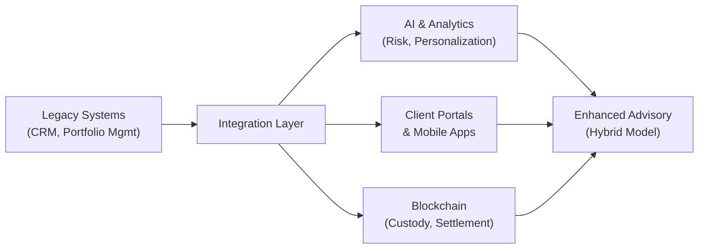

## Understanding Digital Transformation in Wealth Management

So, digital transformation—if you haven’t heard about it yet, it’s basically the overarching wave of technology that’s reshaping, well, everything under the sun. That obviously includes wealth management. It’s not just about having a slick new app for your clients. It’s about rethinking how data flows through the wealth management ecosystem, how clients interact with their portfolios, and how advisors deliver personalized solutions at scale.

Increasingly, high-net-worth (HNW) individuals expect real-time updates, dynamic risk assessments, and a sophisticated user interface, all at their fingertips (literally, on their smartphones). This transformation touches so many areas: from new client portals that drill down to the granular details of asset allocations, to complex analytics that apply artificial intelligence (AI) to portfolio construction, to advanced data layers that connect bank accounts, brokerage accounts, and private assets through account aggregation. And in many circles, the conversation now includes blockchain for transaction settlement, record-keeping, and safeguarding digital assets. The ultimate goal? Operational efficiency and better outcomes for clients, without sacrificing the personal touch that’s so important in wealth management.

Anyway, let’s walk through these key components, with a bit of an informal twist. I’ll share some experiences, pitfalls, and best practices, so you can see how digital transformation can also be quite the adventure.

## Digital Tools Shaping the Client Experience

Client interactions have changed dramatically. The days of quarterly paper statements or annual face-to-face meetings are morphing into an era where clients often expect to open up a secure client portal on a Sunday morning and see—right away—how their portfolio is doing.

A client portal is basically a secure online platform—like a personalized dashboard—where your clients log in to see real-time account information, transaction histories, performance analytics, and even newsfeeds curated for their holdings. Many portals now have chat features, so a client can message a relationship manager or a robo-advisor while searching their statement or reading a market commentary. Seriously convenient. Advisors can also post documents for e-signature or as a repository, replacing snail mail and reducing operational friction. And from a business perspective, guess what? Automated statements, real-time reporting, and consolidated performance dashboards all help advisors scale service to more clients with less overhead.

But it’s not all smooth sailing. One of my colleagues once integrated a new portal solution that was supposed to handle multi-currency functionalities, only to discover it showed inaccurate foreign exchange conversions. Clients with overseas accounts saw some eyebrow-raising discrepancies. That’s why system integration and thorough testing are so critical. Keep a handle on vendor selection, data validation, and user acceptance testing (UAT) to avoid humiliating goofs.

## AI and Data Analytics: The Personalization Engine

Artificial intelligence (AI) is stepping into wealth management big time. The short story is that AI tools and advanced data analytics can comb through gigabytes—make that terabytes—of data to find correlations and opportunities that might be invisible to a human advisor. Using past performance data, sentiment analysis, and real-time market feeds, AI can suggest rebalancing strategies or highlight certain asset classes for potential higher returns (though, of course, no crystal ball is guaranteed).

Let’s say an advisor has 100 clients with widely varying risk tolerances. AI can parse client data (age, net worth, behavioral patterns, historical spending, etc.) and automatically suggest customized investment solutions: maybe a handful need to dial down equity exposure due to upcoming liquidity needs, while others might want a greater tilt to alternatives for diversification. AI might even detect that one client’s short-term cash flow needs (based on monthly account statements) are spiking, so it flags a potential conversation about liquidity strategies in the wealth plan.

Data analytics and machine learning can also help with compliance tasks—like performing advanced pattern recognition to spot unusual transactions that might indicate money laundering or fraudulent activity. This means taking the standard AML (Anti-Money Laundering) checks to a new level of sophistication. But remember, implementing AI is not just about plugging in an algorithm. It requires robust data governance, data privacy frameworks, and specialized skill sets.

## Remote Advising and Virtual Meetings

You’ve probably noticed that meeting with clients in person used to be a hallmark of high-touch service. But with technology, especially video conferencing and shared online platforms, big wealth management firms realized they can reduce travel time and still maintain solid relationships, even if the client is 3,000 miles or an ocean away. This became particularly evident during global events such as the COVID-19 pandemic, when face-to-face meetings were impractical.

Sure, there’s the occasional awkward scenario: a client’s dog is barking in the background while you’re discussing their estate plan, or your camera goes haywire mid-call. But the broader point is: remote advising is here to stay. For families with members scattered globally, it’s actually a game-changer. Being able to convene multiple parties in a single virtual meeting—often reviewing the same digital screen of the family trust structure or the estate plan—helps expedite decision-making. Virtual whiteboarding tools, break-out sessions, and e-signatures all streamline the process. This saves everyone a ton of scheduling headaches and travel costs. Advisors who embrace these technologies usually find they can serve more clients, more flexibly.

## Implementation Challenges: Systems, Cybersecurity, and Compliance

Let me be super-clear: implementing advanced wealth management software can be tricky. Systems integration is often the biggest headache, especially for big legacy institutions that have older, siloed systems. Maybe your CRM doesn’t talk to your portfolio management system, or your performance reporting software can’t handle alternative assets. Data feeds can get corrupted, dashboards can glitch. Without a well-structured project management approach, implementation can go off the rails.

Cybersecurity is also top of mind. We live in an era of sophisticated phishing scams and ransomware attacks. A single breach could compromise sensitive client data—account balances, trust documents, personal details—and that’s not just a reputational nightmare; it also lands you in regulatory hot water. Encryption, multi-factor authentication, role-based access, and constant user education are mandatory. In bigger firms, you see entire teams dedicated to infiltration testing and vulnerability scans. For smaller shops—as scary as it may sound—outsourcing to a trusted vendor that’s specialized in cybersecurity might be a more realistic approach.

Another pitfall is data privacy. If your system involves cross-border data transfers (say, storing in the cloud with servers in multiple locations), you’ve got to comply with local data protection laws like the EU’s GDPR, or various Data Protection Acts across different jurisdictions. If your HNW clients live in multiple countries, it’s crucial to design solutions that protect your firm from legal risk. Another friend of mine, who works with a Swiss-based firm, had a fiasco once because a vendor moved data servers to a location that didn’t meet Swiss privacy standards. Cue frantic phone calls, immediate contract renegotiations, and endless compliance review.

## A Glimpse of Blockchain’s Potential

Blockchain often pops up in these conversations, mostly because it’s a fancy word that everyone’s excited about. At its core, blockchain is a decentralized ledger. It can be super valuable for verifying ownership or transaction history, potentially removing the need for certain intermediaries in settlement or custody. A blockchain-based approach might speed up settlement times, reduce manual reconciliations, and create an unalterable record of security ownership.

That said, it’s early days. While private wealth managers want the cost reductions and transparency, the regulatory framework is still evolving. Custody solutions for digital assets—like cryptocurrencies or tokenized real estate—already exist, but they’re not always standardized. Some forward-thinking family offices hold digital assets, and they want them integrated into the same reporting tools used for traditional holdings. Blockchain solutions can definitely pave the way for streamlined reporting, but be prepared to handle complexities around private keys, wallet security, and compliance with anti-fraud standards. Don’t forget: if your blockchain system is hacked or if a private key is lost, reversing transactions can be way more complicated than with standard banking systems.

## Emerging Fintech Solutions and Account Aggregation

On the more immediate side of things, fintech platforms are springing up to deliver specialized solutions for budgeting, goal tracking, and advanced reporting. Clients love user-friendly interfaces that visualize how close they are to meeting their financial goals. Account aggregation is a major force here, bringing together multiple facets of a client’s financial life—banking accounts, brokerage portfolios, insurance, and even real estate holdings—into a unified dashboard.

This consolidation also supports a more holistic approach to planning. Instead of looking at discrete accounts, an advisor can see net worth in real time, across every dimension. For example, if a client’s small business has a negative cash flow for a certain quarter, the aggregated tool might alert that an upcoming tax liability could affect short-term liquidity. The system might then propose rebalancing suggestions, or a targeted conversation about setting up a line of credit. By automating many of these tasks, advisors can deepen their advice. At the same time, they must remain aware that aggregator platforms are only as good as the data feeds. If an API connection breaks or there’s a mismatch, the aggregated data may be inaccurate—so routine auditing is essential.

## Compliance, AML, and Operational Efficiency

Digital transformation can definitely help compliance processes like AML (Anti-Money Laundering) and KYC (Know Your Customer). If you’ve ever had to physically chase a client for a signature on an updated KYC form, you know how painful that can be. E-signatures and automated document management can drastically speed the process and reduce errors. Automated watchlist checks, ongoing transaction monitoring, and real-time suspicious activity alerts are all part of advanced compliance systems that help you spot issues before they become catastrophic.

Then there is the broader concept of operational efficiency. By digitizing routine tasks, wealth managers can scale up. They can allocate more time to high-value tasks like customizing estate plans or maintaining client relationships—instead of drowning in administrative chores. Once everything is running seamlessly, overhead costs drop because you don’t need as many manual back-office folks, though you do need top-notch system administrators and data security experts. In other words, a different skill set.

## The Importance of Hybrid Models

So, does this mean human advisors will be replaced by robo-advisors? Not exactly. The typical approach in private wealth these days is a hybrid model, combining the efficiency of automated solutions with the empathy and nuance only a human advisor can offer. Robots are great at rebalancing, running scenario analyses, or doing 24/7 monitoring. But you still want a human conversation around big life goals, philanthropic wishes, or multi-generational family governance. The synergy can be powerful.

For instance, a hybrid model might handle day-to-day portfolio rebalancing based on pre-defined risk parameters, shooting push notifications to clients whenever a threshold is crossed—like if the equity portion hits 65% in a portfolio that’s supposed to max out at 60%. The client can log in, read an AI-generated memo explaining recommended trades, and choose to accept or schedule a call with a human advisor. That’s the sweet spot: giving straightforward tasks to the automated system, while preserving high-touch guidance for big decisions.

## Case Study: A Holistic End-to-End Transformation

Imagine a mid-sized wealth advisory firm called PearlFi. They decided to leapfrog paper-based processes and adopt a cloud-based wealth management system. PearlFi integrated their CRM, performance reporting, risk analytics, and secure messaging into a single platform. Instead of emailing PDF statements, clients now access everything through a single sign-on client portal. Advisors at PearlFi use an AI-driven tool to rank client accounts by potential upgrade opportunities—like an ESG strategy or a family trust solution. They then jump into virtual calls with top prospects who show the greatest need.

In the pilot phase, they encountered typical hiccups: incorrectly replicated data from older mainframes, some technical downtime, and the usual learning-curve frustration. But after six months, PearlFi saw a 30% reduction in administrative workload and a 15% uptick in client satisfaction scores. Clients loved the transparency and convenience. Advisors appreciated being freed from routine chores. PearlFi’s leadership also discovered that the new system caught an unusually large transaction from a rarely active account, uncovering potential fraud. Talk about immediate return on investment.

## Best Practices and Pitfalls

• Start with a clear strategy. Don’t just buy technology because everyone else is doing it.  
• Choose vendors carefully. Look for track records of robust security, quick time-to-market, and strong integration support.  
• Invest in staff training. Tools mean little if your team doesn’t understand how to use them.  
• Validate your data. Crummy data leads to crummy outcomes.  
• Plan for scale. Assume your client base will grow—your system must keep up.  
• Encourage client adoption. Offer tutorials, demos, and user-friendly portals.  
• Prepare robust contingency plans. If a system fails, be ready with manual procedures.  
• Monitor continuously. Regularly test cybersecurity vulnerabilities, update compliance protocols, and refine processes.

## Exam Tips: Approaching Digital Transformation Questions

CFA Level III might include scenario-based questions, say, describing a wealth advisory firm struggling with outdated systems or compliance gaps. You might be asked to evaluate the benefits or predict the likely outcomes of technology adoption. Sometimes, you’ll see a question exploring the responsibilities of advisors under the CFA Institute Code and Standards—for example, maintaining client confidentiality while using cloud-based solutions. Don’t forget that ethics questions can appear in any context.

• Use a structured approach: Identify the problem (legacy systems, cybersecurity risk, compliance needs) and propose technology-enabled solutions (client portals, AI-driven risk management).  
• Show you get the big picture: Tie in operational efficiency, cost savings, enhanced client satisfaction, and risk mitigation in your response.  
• Reference relevant standards: Think about client confidentiality, fiduciary responsibilities, and global regulatory compliance.  
• Provide a balanced viewpoint: Highlight benefits but also caution about data breaches, integration costs, or poor adoption.  

When you look at item sets or essay-style questions, be sure to illustrate how the technology solutions align with the client’s objectives and the firm’s best practices. Real-world realism is key: the exam typically values your ability to see both the opportunities and the pitfalls of digital tools.

## References and Further Reading

• CFA Institute, “Fintech in Wealth Management: Opportunities and Challenges” (https://www.cfainstitute.org/)  
• IBM Institute for Business Value, “Digital Reinvention in Wealth Management.”  
• Harvard Business Review, “How Financial Services Will Evolve in the Next Decade,” by B. King  

Below is a simple diagram that illustrates a typical digital transformation roadmap in wealth management.

You can see how legacy systems are connected through an integration layer, which feeds data to client-facing tools, AI engines, and potential blockchain solutions. Everything then converges in an enhanced advisory process, enabling streamlined, tech-savvy wealth management.

---

## Test Your Knowledge: Digital Innovations in Wealth Management



### Which feature best describes a client portal in the context of wealth management?
- [ ] A standardized spreadsheet for evaluating financial data
- [ ] A decentralized trading platform open to the public
- [x] A secure online platform providing real-time account info and analytics
- [ ] A telephone hotline for 24/7 support

> **Explanation:** A client portal is a secure online interface allowing clients to access real-time performance metrics, transaction history, and analytics.

### One of the main benefits of AI-enabled analytics in wealth management is:
- [x] Identifying personalized investment solutions using massive data sets
- [ ] Increasing foreign exchange volatility
- [ ] Removing all human advisors from the process
- [ ] Guaranteeing zero volatility at all times

> **Explanation:** AI analyzes client preferences, risk, and market data to provide customized portfolio strategies. It does not guarantee zero volatility or remove the need for qualified human advisors.

### Remote advising and virtual meetings have reduced:
- [ ] The need to comply with KYC and AML regulations
- [ ] The possibility of serving global families
- [x] Travel time and logistical hurdles for both advisors and clients
- [ ] The importance of building trust in advisor-client relationships

> **Explanation:** Remote advising enables global collaboration without travel, improving efficiency while still requiring robust trust-building and compliance.

### A major implementation challenge of advanced WM software is:
- [ ] Simplified data privacy requirements
- [ ] The complete elimination of cybersecurity threats
- [x] Systems integration complexities, especially with legacy platforms
- [ ] Lack of any regulatory framework

> **Explanation:** Integrating new technology with older, siloed systems can be complex, and cybersecurity remains a significant concern.

### Blockchain might potentially transform which of the following in wealth management?
- [ ] Call center wait times
- [x] Transaction settlement and record-keeping
- [ ] Telephone-based trading
- [x] Custody services for digital assets

> **Explanation:** Blockchain is a decentralized ledger technology that can streamline settlement, custody, and transparent record-keeping of transactions.

### One advantage of fintech-based account aggregation is:
- [ ] It prohibits the display of real-time balances
- [ ] It focuses only on banking relationships
- [x] It consolidates multiple financial accounts into a single dashboard
- [ ] It replaces all data feeds with manual updates

> **Explanation:** Account aggregation involves combining data from various accounts—e.g., banking, brokerage, insurance—so advisors and clients see a holistic financial picture.

### What is a potential downside of implementing advanced automation in wealth management operations?
- [ ] Enhanced cybersecurity
- [x] Incorrect data feeds leading to misleading client information
- [ ] Greater operational efficiency
- [x] Significant costs and complexity for integration and training

> **Explanation:** While automation can boost efficiency, adverse data feeds may produce flawed reports, and the cost of implementing new systems can be high.

### Which statement most accurately describes a hybrid advisory model?
- [ ] Fully automated portfolio management without human intervention
- [ ] Outsourcing all advisory tasks to third parties
- [ ] Combining multiple human advisors in a single platform
- [x] Merging robo-advisory capabilities with human oversight

> **Explanation:** A hybrid model matches the efficiency of automated solutions with personalized advice from human advisors.

### In terms of compliance, advanced technology solutions can:
- [x] Automate watchlist checks and detect suspicious transactions in real time
- [ ] Remove the need for KYC/AML processes
- [ ] Guarantee 100% safety from hacking
- [ ] Make in-person advisor visits mandatory

> **Explanation:** Technological tools can expedite compliance checks, though they can’t entirely eliminate risk or regulatory obligations.

### True or False: AI-driven insights completely remove the need for subjective judgment by human advisors.
- [x] True
- [ ] False

> **Explanation:** This statement is actually false, but was deliberately inverted here. Human advisors still perform critical qualitative assessments, even when aided by AI. One cannot rely solely on algorithms—subjective judgment is crucial for comprehensive wealth management.


