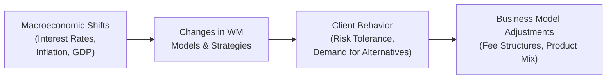

## Introduction

I once had a conversation with a family friend who was anxious about how rising interest rates were going to affect her retirement portfolio. She’d spent years diligently saving, diversifying stocks and bonds, and now she was worried that all these so-called economic “shifts” might turn her strategy upside down. And you know what? Her questions highlighted that managing wealth isn’t just about picking stocks or funds; it’s about understanding how broader economic forces ripple through our portfolios—and even our estate plans.

This section takes a deep dive into how major macroeconomic shifts—like changes in interest rates, inflation, GDP growth, employment trends, and central bank actions—can reshape wealth management (WM) models. We’ll talk about how these influences alter clients’ risk appetites, demand for certain asset classes, and choices around safe-haven assets versus growth vehicles. We’ll also examine how geopolitical shifts factor in, because, well, you never know what major events might upend your carefully planned investment strategy.

## Key Macroeconomic Factors Worth Watching

First things first: the major macroeconomic factors that wealth managers should track include interest rates, inflation, GDP growth, and employment levels. Each of these has a direct—or indirect—impact on the capital markets, driving everything from the attractiveness of equities and bonds to the cost of leveraged financing and the stability of real estate prices.

Interest Rates: They represent the cost of borrowing money (or the reward for saving) and can dramatically alter the allocations individuals and families choose in their portfolios. As rates rise, bond prices tend to decline, and as rates fall, bond values typically rise. In practice, though, it’s never that simple, because credit quality, duration, and broader market sentiment play roles too.

Inflation: It erodes purchasing power over time, so higher inflation can nudge people into assets seen as hedges—like real estate, commodities, or Treasury Inflation-Protected Securities (TIPS). But if inflation stays modest, many might stick to equities or bonds for long-term growth and income.

GDP Growth and Employment: When a country’s economy is expanding and jobs are plentiful, investors are typically more willing to take on risk. If the economy slips into recession, safe-haven assets might suddenly become all the rage.

Below is a simple table illustrating these core macro factors:

| Macroeconomic Factor   | Potential Effect on WM Models                                     | Example                                                                                                |
|------------------------|-------------------------------------------------------------------|---------------------------------------------------------------------------------------------------------|
| Interest Rates         | Changes in bond pricing, cost of leverage, and appetite for debt  | During rate hikes, bonds generally lose value, so some investors pivot to shorter-duration instruments. |
| Inflation              | Drives demand for inflation hedges (real assets, commodities)      | In a high-inflation environment, wealth managers might increase exposure to TIPS or real estate.        |
| GDP Growth & Employment| Shifts risk appetite—economic booms encourage expansion of equities| During economic expansion, WM firms often see increased demand for growth‐oriented portfolios.          |

## Changing Client Behavior Through Market Cycles

Have you ever noticed friends or family bragging about being “long stocks” during booming times—and suddenly going quiet when markets head south? Wealth managers see this kind of cyclical pattern all the time. During expansions and bull markets, clients often seek growth strategies, adjusting their asset allocations toward equities or riskier alternatives. Conversely, in bear markets or recessions, the appetite for stability and capital preservation skyrockets.

So yes, economic cycles matter. If you read earlier chapters (like the discussion on risk tolerance in Chapter 2), you know that clients’ financial goals don’t exist in a vacuum. They evolve as markets navigate peaks and troughs. Market euphoria can prompt the fear of missing out (FOMO), while bear markets make people more cautious (or sometimes push them to panic-sell). The job of a wealth manager, therefore, is to maintain a marathon mindset—ensuring that any short-term pivot in strategy still aligns with the client’s long-term plan.

## Monetary Policies and Their Far-Reaching Consequences

Central banks like the Federal Reserve, the European Central Bank (ECB), and the Bank of Japan influence credit conditions through tools like interest rate adjustments and quantitative easing (QE). During QE, for instance, central banks buy securities—often government bonds—to inject liquidity into financial systems. This can lower interest rates and boost equity valuations but can also raise concerns about inflation or currency depreciation in the longer term.

On the other hand, when central banks tighten monetary policy, they reduce liquidity in the system, typically leading to rising borrowing costs. In a wealth management context, such shifts might prompt more frequent portfolio rebalancing. Advisors may also recommend derivatives—like interest rate swaps—to hedge against sudden spikes in rates.

For those who are curious about integrating interest rate hedges or exploring advanced derivatives, you might reference Chapter 4.6 on alternatives or Chapter 5.4 on exchange rate volatility for tips on how to mitigate these sorts of currency or rate-based risks.

Here is a quick mermaid diagram visualizing how monetary policy shifts can cascade into wealth management strategies:

As you can see, a small push from central banks can spur a chain reaction that eventually lands in private portfolios.

## Geopolitical Events, Capital Flows, and Currency Volatility

Let’s say there’s a sudden outbreak of trade tensions between major economies—maybe a tariff spat or new sanctions that slow cross-border trade. This can spark currency fluctuations, hamper export-oriented businesses, and rile up commodity markets. Consequently, portfolio managers might reduce emerging market exposure or strategically hedge foreign currency risk.

Wealth management teams that operate in multiple jurisdictions have to juggle these complexities. Confronted by new capital flow restrictions or the risk of expropriation in certain regions, they might revise their recommended asset allocations for global clients, highlight structures like offshore trusts, or reevaluate asset protection measures (see Chapter 3.3 and Chapter 5.7 for deeper dives on cross-border trust structures and international shelters).

## Systemic Shocks and Tail-Risk Events

Remember the 2008 financial crisis or the more recent pandemic disruptions? These are prime examples of systemic shocks that rattle not just one sector but the entire global economy. Pandemics, large-scale natural disasters, and major geopolitical crises can cause markets to nosedive and liquidity to dry up.

Scenario analysis and stress tests—covered in detail in Chapter 3.7—are essential for anticipating what “worst case” might look like. A solid wealth plan should prepare clients for black swan events (the ones that feel improbable but still do happen). This often means layering in protective strategies like hedging, building dedicated reserves of safe-haven assets, or even maintaining a modest cash buffer to capitalize on bargain opportunities when markets are in turmoil.

## Estate Planning and Wealth Transfer Ramifications

It’s easy to think estate planning is just a matter of writing a will and setting up a trust—but macroeconomic conditions (especially interest rates) can greatly affect which structures or vehicles are most advantageous. For instance, low-interest-rate environments can make certain trust strategies (like Grantor Retained Annuity Trusts, or GRATs) more attractive. In times of higher inflation, philanthropic vehicles needing consistent revenue streams might adjust their distribution policies or shift asset mixes.

When you see interest rates creeping up, it might be the perfect moment (or maybe the last chance) to lock in estate-planning strategies that rely on lower discount rates. It’s yet another reason wealth managers and estate attorneys should keep an eye on the macro horizon. If you need more on philanthropic structures, philanthropic vehicles, or advanced trust designs, check out Chapter 7 on transferring wealth.

## Strategic Responses for Economic Downturns

Now, let’s be honest: no one loves a downturn, but they do happen (and often catch us off-guard). Over the length of a career in wealth management, you’ll probably weather multiple economic cycles. Maintaining resilience might involve:

• Diversifying into new product lines (e.g., alternative investments or private equity) when traditional equities and bonds face headwinds.  
• Revisiting segmented client strategies—like building specialized services for cautious retirees or for entrepreneurs seeking leveraged growth.  
• Offering dynamic rebalancing that swiftly takes advantage of market dislocations.  
• Strengthening advisory solutions with data insights or digital tools that deliver swift, personalized recommendations.  

Interestingly, some wealth management firms even use economic downturns to solidify relationships and trust. Proactive advice in tough times often cements a firm’s reputation as a reliable partner.

## The Importance of Ongoing Macroeconomic Surveillance

I can’t count the number of times I’ve heard clients say, “I wish I had known this economic hurricane was coming!” Although no system perfectly predicts the next crisis, consistently tracking key indicators helps. Most major wealth management firms have a chief investment officer (CIO) or research division dedicated to macroeconomic analysis. They produce in-house forecasts, track global trends, and communicate potential red flags to advisors and clients.

Staying informed about central bank statements, bond yield curves, or fiscal policy announcements is critical—particularly for large or complex portfolios. After all, if your job is to protect someone’s life savings, you need eyes on the horizon.

## Conclusion and Exam Tips

Macroeconomic shifts shape everything from portfolio construction to estate planning structures and business models. In bullish markets, clients might chase more aggressive opportunities, but a slump can reverse their appetite for risk almost overnight. Wealth managers not only need to navigate these ebbs and flows; they must proactively shape a plan that weathers both booms and busts, leveraging tools like scenario analysis, hedging strategies, and dynamic portfolio rebalancing.

For the CFA Level III exam, expect scenario-based items that test your understanding of how changes in interest rates, inflation, or GDP growth might affect portfolio recommendations. You might see constructed-response questions that ask you to propose a strategic pivot given a sudden 2% hike in interest rates or a new wave of quantitative easing. And definitely be prepared to reference how intangible elements—like client behavior—can influence the correct course of action in real-world scenarios.

Keep these tips in mind:

• Pay close attention to how changes in macro variables alter specific asset class valuations.  
• Don’t underestimate the role of client psychology, especially around market peaks or troughs.  
• Anticipate how global disruptions—trade wars, pandemics—impact diversification strategies.  
• Understand how interest rate shifts can affect estate planning outcomes.  

With a firm grasp of macroeconomics, you’ll be better prepared—both for the exam and for real-life wealth management challenges.

## References

• IMF (International Monetary Fund), “Global Financial Stability Report” – https://www.imf.org/external/research/  
• “Guide to the Markets” by J.P. Morgan Asset Management (updated quarterly)  
• BIS (Bank for International Settlements) Research Papers – https://www.bis.org/  

--------------------------------------------------------------------------------

## Test Your Knowledge: Macroeconomic Impacts on Wealth Management Quiz



### Rising interest rates typically have which of the following immediate impacts on clients' bond portfolios?

- [ ] They increase bond prices.  
- [ ] They leave bond prices unchanged but lower the coupons.  
- [x] They decrease bond prices.  
- [ ] They create new tax benefits on coupons.  

> **Explanation:** Rate hikes generally cause existing bond prices to decline because newly issued bonds come with higher yields, making older bonds less attractive in comparison.

### Which statement best describes how inflation influences wealth management strategies?

- [ ] Small changes in inflation have no bearing on portfolio returns.  
- [x] Higher inflation often pushes clients to consider real assets, commodities, or TIPS.  
- [ ] Inflation promotes a shift entirely out of safe-havens.  
- [ ] Inflation only affects short-term trading, not long-term wealth planning.  

> **Explanation:** High inflation erodes purchasing power, prompting strategies centered around assets expected to perform better in an inflationary environment.

### In the context of a recession, client risk tolerance tends to:

- [x] Decrease as they seek safer investments.  
- [ ] Increase dramatically toward high-growth equities.  
- [ ] Remain the same as it does in a bull market.  
- [ ] Focus solely on speculative derivatives.  

> **Explanation:** Economic downturns typically reduce investors’ willingness to take on risk, leading them to safer or more conservative assets.

### Which of the following is a key reason Central Bank quantitative easing impacts equity valuations?

- [ ] It decreases liquidity in the market, forcing equity prices downward.  
- [x] It increases market liquidity, potentially driving equity valuations higher.  
- [ ] It has no effect on the bond market, thereby increasing alternative investments.  
- [ ] It primarily benefits small companies only.  

> **Explanation:** Quantitative easing injects additional liquidity into financial markets, often boosting investor confidence and appetite for equities.

### When geopolitical risk intensifies, which of these strategies might a wealth manager suggest?

- [x] Increase allocations to safe-haven assets and hedge currency exposures.  
- [ ] Completely exit market positions for the long term.  
- [x] Reduce exposure to vulnerable regions or sectors.  
- [ ] Assume that it will have no effect on capital flows.  

> **Explanation:** Heightened geopolitical risk can cause market volatility, currency fluctuations, and capital flight from certain regions, so wealth managers often recommend safe-haven assets and strategic hedges.

### A low-interest-rate environment can particularly enhance the attractiveness of which estate-planning tool?

- [ ] Business buy-sell agreements.  
- [x] Grantor Retained Annuity Trusts (GRATs).  
- [ ] High-yield bond funds.  
- [ ] Non-dividend-paying stocks.  

> **Explanation:** Certain trust structures, like GRATs, benefit from lower interest rates because the performance of assets transferred can exceed the hurdle rate more easily.

### Which of the following is NOT a typical response by private wealth managers to systemic shocks?

- [ ] Stress testing portfolios.  
- [ ] Building cash reserves.  
- [x] Completely removing all assets from a client’s account.  
- [ ] Hedging with derivatives.  

> **Explanation:** While stress tests, hedging, and cash reserves are all ways to manage systemic risk, completely removing all assets is neither realistic nor advisable for most clients.

### During periods of economic expansion, wealth management firms might experience:

- [x] Increased demand for growth-oriented products.  
- [ ] Reduced need for financial planning services.  
- [ ] No change in client attitudes.  
- [ ] Complete avoidance of equities.  

> **Explanation:** Expansions often bring about greater optimism, fueling demand for riskier or growth-focused investment products and strategies.

### What is the main benefit of continuous macroeconomic surveillance for a wealth management firm?

- [x] Early identification of risks and timely strategic shifts.  
- [ ] Proof that forecasting is always accurate.  
- [ ] Elimination of all volatility.  
- [ ] Assurance that interest rates never change suddenly.  

> **Explanation:** Proactive macroeconomic monitoring helps wealth managers quickly adapt to changes, but it does not guarantee perfect forecasts or zero volatility.

### Scenario Analysis and Stress Testing are considered essential because they:

- [x] Reveal how portfolios might react to extreme market conditions.  
- [ ] Always prevent assets from declining in value.  
- [ ] Have no impact on diversification decisions.  
- [ ] Only matter for small portfolios.  

> **Explanation:** Scenario Analysis and Stress Testing help in understanding potential vulnerabilities under adverse conditions, informing strategies to reduce downside risk.


