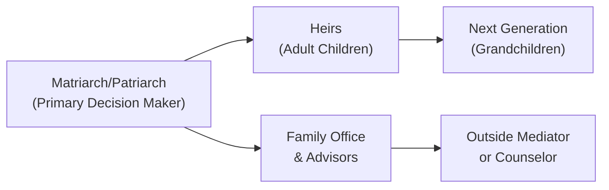

## Understanding the Influence of Wealth on Family Dynamics

Let’s be honest: family relationships can be complicated on their own, right? But when there’s significant wealth involved—maybe from a thriving business or an unexpected inheritance (and I’m talking about large assets, not just day-to-day savings)—the complexity of familial ties can move to a whole new level. It’s like turning the volume knob way up: the tension might get louder, the emotions might become stronger, and sometimes the stakes feel impossibly high.

In this section, we’re focusing on how high-net-worth households navigate those complexities. We’ll talk about the power held by a matriarch or patriarch, how heirs can feel overshadowed by the older generation, and why wealth can sometimes spark rivalry, confusion, or even guilt. Along the way, we’ll incorporate personal anecdotes—some from my own experiences advising families—and we’ll look at practical strategies for avoiding the usual pitfalls. We’ll also walk through best practices that can help families communicate more openly and preserve harmony across generations.

## Shifting Power Dynamics and Authority

One of the first things that jumps out in many high-net-worth families is the strong decision-making authority of a matriarch or patriarch. These family leaders often wield a tremendous amount of influence—particularly if they’re the ones who built or managed most of the wealth. In my opinion, that’s logical on the surface: whoever created the wealth might have the financial savvy to continue growing it. But, oh boy, it can sometimes create tension with younger heirs.

Even in smaller families, you’ll see parents who control the purse strings, setting budgets for adult children, or deciding unilaterally how assets will be invested. This arrangement can lead to friction. Older generations might feel they’re doing a service by protecting younger members from “bad” decisions, while younger generations might say, “Um, hello? I’m an adult, too.” The lines of communication can get blurred, and resentment can build up quickly. There’s even a phenomenon where adult children in their 40s or 50s still feel beholden to their parents’ financial authority—kind of like they’re stuck in a perpetual teenage stage, which fosters dependence and frustration.

### The Concentration of Financial Control

In many cases, the matriarch and patriarch are not just symbolic figureheads; they might be the only individuals with official signing authority on major financial decisions—real estate acquisitions, private equity deals, philanthropic gifts, and so on. Now, having a concentrated point of decision-making can be convenient (less friction, fewer approval loops), but it also puts extraordinary responsibility on one or two people. If that leadership is inflexible or if they fail to bring in their children’s perspectives, it can sow the seeds for family discord down the road.

An example: I once worked briefly with a family whose patriarch had spent decades building a global enterprise. His children, in their 30s, had advanced degrees in finance and business (a stellar combination for future family leadership!), but the father refused to share any financial details. The kids felt excluded, and they harbored doubts about their father’s long-term plan. So it’s not surprising that resentments cropped up: Could they trust him to plan for their future? Was he intentionally withholding information? In the end, a lot of the tension stemmed from the father’s belief that “He alone knew best.”

## Amplified Familial Challenges

Let’s not pretend rivalry, suspicion, and bickering are exclusive to wealthy families. We see these tensions at any income level. The tricky part is that wealth can amplify these issues. Sibling rivalry, for instance, might revolve around who gets to drive the family car. But if you add high-value assets, the rivalry suddenly has major financial consequences. People might start to define themselves by how much they’ve received, or how big their role in the family business is, or whether their children’s inheritance is perceived to be smaller or larger than their cousins’.

### Distrust and In-Law Tensions

Another central challenge is the addition of in-laws to the equation. When a new spouse enters the picture, especially if they marry into a family with significant wealth, the rest of the family can, well, become a bit suspicious. “Are they here for the money?” “Will they meddle in how we run the family business?” If that suspicion isn’t addressed head-on, it can transform into a deeper rift that’s passed along for generations.

In many of these scenarios, it becomes crucial to separate the person (the spouse) from the financial concerns. But that’s easier said than done. If the family does not have a framework for these discussions—like a set of well-articulated rules for inheritance and estate division—resentment can brew. Unfortunately, in-laws might bear the brunt of this tension. They may be perceived as “outsiders,” which can cause them to feel unaccepted and insecure. Meanwhile, the direct blood relatives are worried about preserving their own claims or ensuring that generational wealth doesn’t get pulled away.

## Mental and Emotional Considerations

High-net-worth families often face a unique set of mental health hurdles. Imposter syndrome can emerge, especially among younger members who didn’t personally earn the wealth. They might describe feelings of unworthiness or anxiety, like they’re wearing clothes that don’t fit. There’s also the guilt factor: some heirs wrestle with the idea that they have more than others, and that can create a sense of “I don’t deserve this.” On occasions, they might adopt self-destructive behaviors (overspending, substance abuse) as a means of coping.

Some might say, “Well, that’s a pretty nice problem to have—feeling guilty over too much cash.” But it’s real. In a culture that prizes self-made success and hard work, inheritors can struggle with their identity. Do they measure up to the achievements of the family’s founder? Are they simply living off someone else’s success? Believe it or not, that’s a heavy weight to carry. It can erode their confidence and hamper their ability to make sound decisions about the wealth.

### The Role of Family Narratives

A huge piece of the puzzle is the “family narrative.” Some families proudly talk about how their grandparents emigrated with almost nothing and built a thriving enterprise from scratch. Others might attribute fortune to savvy investments or a stroke of luck. If the wealth was created through entrepreneurial grit, there often emerges a strong ethos of diligence and hustle. If it’s passive inheritance, the dynamic might be different—members might be less engaged with the idea of working to maintain or grow the family fortune.

These narratives shape values. If the founder’s story is some version of “We overcame huge challenges,” there’s an implied responsibility for the next generation to stay humble, to continue the legacy. In contrast, if the wealth just “appeared” thanks to an IPO or unstoppable market forces, the family might not have as strong of a unifying sense of how to handle it. Either way, storytelling around the wealth’s origin can have a profound impact on how younger generations see themselves and their obligations. It can also show up in day-to-day financial decisions—like how aggressively to invest or whether to give generously to philanthropic causes.

## Promoting Open Communication

“Well,” you might say, “how do we fix these issues?” The best remedy usually involves open, consistent communication. Easy to say, tough to do. As advisors, we often encourage families to hold periodic family retreats, typically an annual or bi-annual gathering. These retreats aren’t just about vacations on a yacht (though that might sound fun). They’re structured sessions (with maybe a little fun thrown in) where everyone gets a chance to voice concerns, share goals, and discuss the family’s big picture.

At these retreats, it helps to have an agenda, especially if conflict is a real threat. You might have sessions on:

• Reviewing the family’s mission or vision for the wealth.  
• Reporting on the performance of family businesses or investment portfolios.  
• Acknowledging personal goals—like continuing education or philanthropic interests.  
• Discussing possible expansions, acquisitions, or other strategic moves.  
• Setting guidelines for how disagreements will be addressed.

### Utilizing External Mediators

Look, the emotional baggage can get pretty heavy, so sometimes families bring in a consultant or a family counselor. A neutral third party can help everyone feel heard, plus they can offer conflict-resolution strategies. They might propose a code of conduct for family meetings, or help develop a strategy for clarifying roles in a family business. 

In larger families, it’s almost essential to have some professional facilitation. Everyone might talk over each other, or the loudest voice might dominate. The external mediator’s role is to keep the discussion structured—plus, they aren’t influenced by any personal biases or hidden agendas. They just want to help the family arrive at the best solution possible.

## Developing an Inclusive Approach

An inclusive approach means each family member feels like their perspective counts. That includes everyone from the 75-year-old patriarch to the new daughter-in-law who just joined the family. If individuals feel excluded—especially if they’re direct heirs or significant decision-makers—the family risks a breakdown in trust.

Here’s a small but telling anecdote: I worked with a client whose father arranged monthly Zoom calls where each adult family member had 15 minutes to share what was going on in their life—financial or not. The father specifically asked the new in-laws, “How are you adjusting? Is there anything that feels overwhelming?” The result? They established a culture of transparency. No one was afraid to speak up, and they tackled challenges before they escalated. Honestly, it was pretty inspiring to watch.

## Example of a Family Governance Diagram

Below is a simplified Mermaid diagram illustrating a possible family governance structure. It highlights decision-making paths in a multigenerational high-net-worth family:

• The matriarch/patriarch (A) consults with outside advisors (C) and occasionally an external mediator (E).  
• Feedback from heirs (B) is funneled to both senior decision-makers and advisors.  
• The next generation (D) might attend family retreats or training sessions, ensuring a smoother transition when they inherit more responsibilities.  

This structure is just an example; many variations exist. Some families have formal “Family Council” boards, with rotating leadership, or committees for philanthropy and investments. The goal is to create transparent, well-defined channels so communication is never an afterthought.

## Common Pitfalls and How to Overcome Them

• Avoiding Tough Conversations: Some families just skip talking about money altogether. It feels taboo. Meanwhile, frustrations silently fester. The fix? Establish regularly scheduled financial discussions, maybe once a quarter or bi-annually, so people know they’ll have a safe forum for questions or concerns.

• Overprotecting Younger Generations: Parents might think they’re doing their kids a favor by shielding them from financial decisions (“You do your own thing, and we’ll handle the money”), but that can lead to children who lack financial acumen and confidence later. A better approach is to gradually give them more involvement or responsibility, maybe by overseeing a smaller account or philanthropic fund.

• Failing to Document Plans: If the family has no documented estate plan, philanthropic objectives, or investment guidelines, confusion is sure to arise. Tensions can lead to legal battles in worst-case scenarios. Overcoming this requires an up-to-date family constitution or governance framework that spells out roles and responsibilities, typically drafted in partnership with legal counsel.

• Neglecting Emotional Well-Being: It’s tempting to say, “We’re talking about finances, not feelings.” But in reality, emotions drive many financial (and family) decisions. Seeking professional help—such as a therapist or mental health counselor—can genuinely improve family outcomes. I’ve repeatedly seen families break destructive cycles after acknowledging the emotional undercurrents that fuel them.

• Unrealistic Expectations: Younger generations might assume they’ll receive a certain level of financial support or inherit at a certain time. Meanwhile, the older generation might plan to keep control until their final days. Unmet expectations breed bitterness. Address this by clarifying the timeline for wealth transfer, business succession, or philanthropic engagement.

## Practical Example: Case Study

Take the hypothetical “Riley Family,” who own a successful multinational manufacturing business. The matriarch, Ms. Riley, is in her late 70s and has three children in their 40s. Each child has a distinct professional background: one in finance, one in engineering, and one in marketing. Ms. Riley has always been the ultimate authority—making investment decisions and strategic calls for the business. Now she’s contemplating retirement, but can’t quite let go.

• Stage 1: Growing Resentment  
  The children feel they’re capable of steering the company, but Ms. Riley doesn’t delegate. They begin to argue at board meetings, and Ms. Riley criticizes them for lacking her “entrepreneurial grit.”

• Stage 2: Engaging a Mediator  
  Ms. Riley, on advice from a family friend, hires a family business consultant. During the first family retreat, each child shares how they believe the business—and their respective skills—could help the enterprise adapt to changing market conditions.

• Stage 3: Documenting Roles  
  The consultant helps them draft a family charter. Ms. Riley transitions to a chairperson role, still providing high-level input, while the children rotate the CEO position on a two-year cycle. They also form a philanthropic arm that one of the children leads.  

• Stage 4: Periodic Follow-Ups  
  They schedule a retreat every six months. An outside counselor attends to ensure new issues are identified early. Now the children are more confident, Ms. Riley still feels respected, and the entire structure is more collaborative.

Sure, the Rileys might still face future bumps in the road. But establishing open communication and clarifying responsibilities early sets them on a path that’s infinitely more stable than if they’d stayed on autopilot.

## Critical Exam Relevance

For CFA Level III candidates focusing on Private Wealth Management, understanding the qualitative aspects—like family conflicts and generational divides—is just as crucial as mastering asset allocation or performance measurement. In real exam scenarios (constructed-response or item sets), you might see vignettes describing a high-net-worth family contending with issues of governance or wealth transfer.

• Expect to be tested on how to advise a family regarding decision-making structures.  
• You could be asked about the psychological components of wealth, such as whether to recommend an external mediator or to address heirs’ risk profiles.  
• There might be a question about how a family’s narrative or entrepreneurial vs. passive investment background informs their financial goals.

Key tips:  
1. Demonstrate understanding that personal relationships and emotional factors drive many wealth decisions.  
2. Propose structured communication (like family retreats) and governance (like a family constitution).  
3. Show how suggestions align with fiduciary responsibilities and ethical standards (e.g., fairness in estate planning, adhering to client confidentiality).  
4. Incorporate the perspective of multi-generational planning, liquidity needs, tax considerations, and philanthropic objectives.

## Final Comments and Best Practices

From a practice standpoint, we want to remind advisors to keep learning about soft skills—like conflict management and empathetic communication. Often, families don’t realize they need these softer aspects of wealth management until a dispute flares up. Meanwhile, for families themselves, the biggest takeaway is that open communication, a structured governance approach, and a mindset of respect for everyone’s perspectives can keep wealth from becoming a destructive force. Instead, it can—and should—be a unifying asset, supporting the family’s well-being across generations.

Don’t forget: it’s okay to bring energy and empathy into your conversations with clients. Wealth is intimately linked to identity and emotions. By addressing the human side of finances with the same level of diligence you bring to portfolio analysis, you’ll provide a more holistic and impactful service.

## References and Further Exploration

• Hughes Jr., James E. “Family Wealth—Keeping It in the Family.” Bloomberg Press.  
• Ward, John L. “Keeping the Family Business Healthy.” Palgrave Macmillan.  
• de Visscher, Francis, et al. “Financing Transitions: Managing Capital and Liquidity in the Family Business.” Family Business Publishing.  
• [Family Firm Institute](https://www.ffi.org/) – Research, case studies, and best practices on family dynamics and governance.  

## Test Your Knowledge: Family Dynamics for High‐Net‐Worth Households



### Which statement best describes how wealth can amplify existing family tensions?

- [ ] Wealth ensures that all family members live in harmony by reducing financial stress.  
- [x] Wealth can heighten existing rivalries and power struggles due to higher financial stakes.  
- [ ] Wealth difficulties usually alleviate emotional conflicts through external advisors.  
- [ ] Wealth primarily mitigates negativity by offering many financial luxuries.  

> **Explanation:** Although greater resources can reduce some financial stress, significant wealth often magnifies common challenges like rivalry, distrust, and in-law tensions because the stakes become much larger.

### When a single matriarch or patriarch controls the majority of the family assets, which pitfall is most likely?

- [ ] Improved democratic decision-making processes.  
- [ ] Complete absence of family conflicts.  
- [x] Heightened tension if heirs feel excluded from major decisions.  
- [ ] Automatic increased returns due to central expertise.  

> **Explanation:** Concentrating all decision power in one person can alienate other family members who might feel they have no say, leading to resentment and conflict.

### Which of the following scenarios most likely reflects “imposter syndrome” in a high-net-worth context?

- [x] Younger heirs feel undeserving of the fortune and question their worth.  
- [ ] Senior family members refuse to retire from the family business.  
- [ ] In-laws request greater economic independence.  
- [ ] Adult children demand greater budgetary allowances.  

> **Explanation:** Imposter syndrome in wealthy families often presents as younger heirs feeling inadequate or as though they don’t deserve their inherited success.

### What is one key benefit of a periodic “family retreat”?

- [ ] It guarantees no emotional issues will ever surface.  
- [x] It provides a structured setting for open communication and planning.  
- [ ] It prevents any inheritance disputes from reaching the courts.  
- [ ] It legally redistributes wealth among heirs automatically.  

> **Explanation:** Family retreats create a platform for discussion, sharing goals, and airing concerns. While not a guarantee against future conflict, they establish a culture of transparency and trust.

### If a family seeks external advice for mediating conflicts, which statement best captures the role of an outside mediator?

- [x] To maintain neutrality and facilitate structured family discussions.  
- [ ] To adopt the role of a single decision-maker on all financial matters.  
- [x] To ensure in-laws vacate any claim to the family estate.  
- [ ] To relocate family businesses overseas at the earliest opportunity.  

> **Explanation:** A mediator’s primary purpose is to help the family communicate effectively and reach compromises. They do not take over financial decisions or force any party to forfeit rights.

### What is typically the first step in addressing in-law tensions within a high-net-worth family?

- [ ] Removing in-laws from all family events.  
- [x] Establishing clear ground rules and open communication channels.  
- [ ] Granting in-laws complete control over the family business.  
- [ ] Making no changes, because tensions are unavoidable.  

> **Explanation:** Early, frank discussions that clarify expectations and boundaries can prevent misunderstandings from spiraling into deeper rifts.

### Why are family narratives about wealth creation so influential in shaping attitudes?

- [ ] They ensure that every family member invests exactly the same way.  
- [ ] They remove all emotional connection to the wealth.  
- [x] They convey values, work ethic, and a sense of responsibility attached to the family fortune.  
- [ ] They legally obligate heirs to follow the founder’s investment preferences.  

> **Explanation:** Family stories serve as a blueprint for how members perceive their wealth, instilling shared values around work, investment, philanthropy, and collaboration.

### Which practice best ensures younger generations develop financial responsibility?

- [x] Gradually providing them responsibility over portions of family assets.  
- [ ] Sending them monthly “no-strings-attached” checks.  
- [ ] Restricting them from all knowledge of family finances.  
- [ ] Centering all final decisions with a single advisory firm.  

> **Explanation:** Gradual involvement teaches heirs how to manage assets responsibly, promotes learning, and builds confidence for future stewardship of the family’s wealth.

### A well-written family constitution or charter helps a high-net-worth family by:

- [x] Documenting roles, responsibilities, and governance structures.  
- [ ] Eliminating everyone’s legal claims to the inheritance entirely.  
- [ ] Ensuring the family never has emotional disputes.  
- [ ] Maximizing leveraged buyouts in family businesses.  

> **Explanation:** A documented framework clarifies guidelines for decision-making and conflict resolution, reducing ambiguity and misunderstandings about family roles and processes.

### True or False: Conflicts and resentment in high-net-worth families can often be minimized by addressing emotional factors and encouraging honest dialogue.

- [x] True  
- [ ] False  

> **Explanation:** Emotional undercurrents frequently drive or intensify financial conflicts. When families proactively talk about feelings, expectations, and worries, they’re far more likely to maintain harmony and make decisions that everyone supports.


