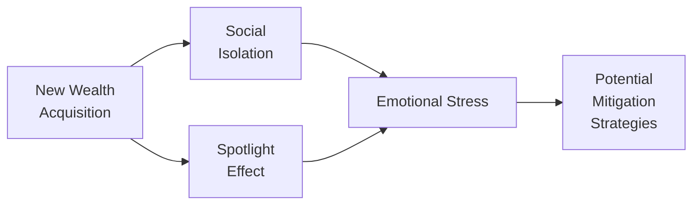

Wealth is a curious thing. It can bring about freedom and opportunity, but it can also trigger intense emotional and social challenges. You might expect everyone who’s financially secure to be on cloud nine all the time. Yet, um, it’s often more complicated than that. Many high-net-worth clients—whether they acquired their fortunes overnight through an IPO, gradually through disciplined saving, or by inheritance—find themselves grappling with unique social and psychological influences. This section uncovers some of these less obvious aspects of wealth, linking them to practical wealth management strategies relevant to private client advisors.

We’ll look at how wealth can breed social isolation, the so-called “spotlight effect,” self-image entanglement with status and prestige, and other nuanced issues. Now and then, I’ll share stories from personal experiences or clients who have faced these problems (with identities masked, of course). While the money side of things is certainly front and center, it’s often the emotional and relational side that can make or break a family’s long-term prosperity and stability.

Wealth and Social Isolation  
Many high- and ultra-high-net-worth individuals (HNWIs) experience a sudden sense of disconnection from friends and community. This can happen for a number of reasons. For a start, they might harbor fears of exploitation—worrying that others see them as walking checkbooks rather than genuine acquaintances. Also, if everyone around them is talking about stretching the monthly budget, a newly wealthy individual might feel like they can’t exactly share their own financial concerns without sounding out of touch.

I remember talking to a client—let’s call him Dave—who had recently sold his tech startup. With millions in his bank account, he was thrilled at first and treated old friends to dinner. But after a while, Dave began to notice awkward (and sometimes resentful) reactions from people he’d known for years. Some started expecting that he’d always foot the bill; others felt uncomfortable discussing everyday financial matters in front of him. Over time, the dynamic changed. Dave found himself gradually pulling away, not out of arrogance but because it was emotionally exhausting. This subtle distancing is one common face of social isolation among HNWIs.

In more formal cognitive and sociological terms, social isolation occurs when an individual feels alienated from their peer group due to diverging experiences—often tied to wealth, status, or both. This sense of alienation can affect mental health, create distrust, and push people into echo chambers of exclusively wealthy social circles, further separating them from mainstream society.

The Spotlight Effect and Anxiety  
Another concept is what’s known as the “spotlight effect,” which means people think others are paying more attention to them (and their actions) than is truly the case. HNWIs may develop a perception that the world is watching how they spend, donate, tip, or invest. This pressure can cause anxiety and second-guessing even routine financial decisions, particularly if they involve conspicuous consumption.

For instance, someone from a modest upbringing who suddenly inherits a large estate might get self-conscious about flying first class. “What if old friends see me posting pictures from the lounge? Are they going to assume I’m turning into a snob?” This internal chatter can be surprisingly powerful and might push individuals toward secretive spending or, on the flip side, toward excessive display of wealth as a way of “owning” their success.

Let’s illustrate how social isolation and the spotlight effect can overlap:

First, the acquisition of wealth (A) can spur both social isolation (B) and the spotlight effect (C). Each of these feeds into emotional stress for the individual (D). Finally, effective wealth planning, counseling, and community engagement (E) aim to mitigate that stress.

Status, Prestige, and Personal Identity  
Wealth can profoundly shape an individual’s self-definition. Money conveniently doubles as a measuring stick of success—an external validation that someone “made it.” This can be incredibly reinforcing but also fairly dangerous. If a person’s entire sense of self-worth hinges on the size of their net worth, any downturn in the markets or big investment loss can threaten their identity. And it can create a near-addiction to achievement: bigger deals, bigger acquisitions, bigger portfolio. This drive deserts the realm of rational allocation and becomes a quest for affirmation.

While a strong sense of confidence is arguably beneficial, there’s a fine line between using wealth to express your accomplishments and letting it define your self-esteem. At an extreme, this psychological entanglement leads to behaviors such as chronic overspending, constant one-upmanship, or persistent anxiety over losing it all.

Philanthropy, Social Circles, and Belonging  
On a sunnier note, many HNWIs who feel disconnected or out-of-place channel their resources into philanthropic or community-oriented activities. Joining philanthropic boards and clubs can scratch that itch for a shared mission and a sense of belonging. Sitting on, say, the board of a local art museum or environmental non-profit allows wealthy individuals to use their expertise and capital for good.

But it’s not always purely altruistic. There is a social dimension to philanthropic circles, which can serve as an exclusive club. With carefully curated charitable endeavors, individuals can forge powerful personal and professional connections. As an advisor, it’s essential to understand how philanthropic engagement influences a client’s personal identity, emotional well-being, and family legacy planning. That way, you can help them structure donations in a tax-efficient manner, ensure philanthropic vehicles (like donor-advised funds or foundations) align with their broader estate plan, and encourage them to find philanthropic projects that truly resonate.

The Role of Social Media  
It’s the age of Instagram influencers, YouTube millionaires, and flashy digital bragging rights. Some HNWIs embrace social media, carefully crafting an image of success and generosity. But others might prefer to stay hidden behind private accounts or use pseudonyms, fearful of being inundated with pitches, requests for money, or even threats.

For individuals who come into sudden wealth, social media can exacerbate the “spotlight effect.” They worry about who sees their posts—especially if these pictures reveal expensive tastes (like supercars, extravagant vacations, or a million-dollar donation to a cause). Sure, some relish the attention. However, others find themselves combing through every single post to ensure they don’t come off as bragging. This hyper-vigilance isn’t just draining; it can be mentally consuming.

Advisor Tip  
When working with clients whose public profiles are rising, consider introducing them to social media consultants (or at least offering guidance) who understand the unique reputational dynamics at play. Sometimes, a strategic approach to public relations—where wealth is acknowledged but framed in terms of initiative, philanthropic impact, or entrepreneurship—can mitigate the negative sides of online exposure.

Next-Generation Issues: Entitlement and Complacency  
Planning around next-generation wealth is one of the trickiest parts of private wealth management (discussed in more depth in Section 2.7 on “Establishing Multi-Generational Education Plans”). It’s not just about transferring money; it’s about transferring values, work ethic, and responsibility. Depending on family culture and parenting styles, children in wealthy households might grow up with a skewed view of how the world works. If all they know is that expenses are magically covered, it’s easy for them to develop complacency or entitlement. Why push themselves if they believe they’ll never need to earn their own income?

Structured allowance programs can help. Instead of an open spigot of cash that fosters unbridled spending, families can adopt incremental disbursements or matching schemes that reward productive behavior. For example, a parent might decide to match their child’s charitable donations or business earnings dollar-for-dollar. This helps keep that entrepreneurial or philanthropic spark alive. It’s also where philanthropic engagement is powerful, letting younger generations involvement in charitable causes and see the tangible impact of money beyond consumerism.

Mental Health and Emotional Well-Being  
Financial security doesn’t insulate people from stress and mental health challenges. In fact, wealth can open the door to a distinct set of anxieties—about losing money, about the sincerity of relationships, about living up to expectations, about privacy. While wealth managers and advisors are not mental health professionals, we can acknowledge the reality of these concerns and recommend professional support when needed.

Many wealth management teams now partner with counselors, therapists, or family trainers to address emotional and relational dimensions. Yes, that’s a thing—some families hold multi-day retreats with not only investment managers but also psychologists and mediators in attendance. On the surface, it might seem unusual. But in practice, it can be a game-changer in preventing resentments or disputes that tear families apart.

Integration with Broader Wealth Plans  
Advisors in the private wealth arena need to consider these social and psychological influences when crafting holistic plans. From selecting philanthropic boards that align with clients’ passions, to building communication frameworks that let families discuss money openly, the social dynamics matter.

• Financial Plan Customization: A plan structured for a client who values privacy might differ from one for a client who wants a large public presence—especially when it comes to philanthropic endeavors, estate planning, and insurance coverage.  
• Family Education: Educating younger generations about budgeting, investing, and the responsibilities of wealth fosters long-term stability and can reduce the risk of entitlement.  
• Governance and Controls: Tools like trusts and structured allowances impose governance on wealth, preventing overspending or mismanagement rooted in complacency.  
• Communication Policies: For families comfortable in the spotlight, set guidelines to communicate philanthropic work clearly and authentically. For more private families, ensure that estate structures protect anonymity and privacy where possible.  

Best Practices, Pitfalls, and Strategies  
• Best Practices:  
  – Encourage open conversations about money. Discuss the “spotlight effect” so clients see that many share similar worries.  
  – Suggest philanthropic and social outlets that can enhance a sense of purpose while enabling thoughtful networking.  
  – Consider “training wheels” for heirs—structure allowances and trust disbursements so they learn responsibility before accessing large sums.  
  – If possible, provide referrals to therapists or coaches who specialize in money-related stress and identity issues.  

• Common Pitfalls:  
  – Denying the existence of emotional tension around wealth, hoping it’ll go away on its own.  
  – Overemphasizing material success as a proxy for self-esteem, leading to destructive cycles of ego-driven decision-making.  
  – Providing unstructured, unlimited access to children or younger relatives without teaching them core principles of saving, investing, and giving.  
  – Assuming that family members automatically share the same outlook on philanthropy, investment risk tolerance, or lifestyle.  

• Strategies to Overcome Issues:  
  – Multidisciplinary Advisory Teams: Collaborate with estate attorneys, tax experts, psychologists, and philanthropic consultants in a comprehensive approach.  
  – Family Coaching Sessions: Regular, facilitated meetings around financial topics, where all voices—including younger generations—are encouraged to speak up.  
  – Encouraging Self-Reflection: In some cases, simply having a conversation about fears and perceived social pressures can bring relief and clarity.  
  – Documentation: Write a family wealth mission statement or even a philanthropic charter. This provides a moral and practical compass for how the family uses its wealth.  

Practical Example: Inheritor Anxiety  
Imagine a 30-year-old individual, Anna, who inherits several million. She’s plagued by guilt—she didn’t earn it—and she’s worried friends will treat her differently. She isolates herself, narrowly socializes with a few fellow inheritors, and tries to hide her finances from long-time friends. Depending on the plan designed by her advisors, she might:  
• Work with a money mentor or therapist to unpack guilt and develop a healthy relationship with her inherited wealth.  
• Create a philanthropic fund that channels her feelings into a positive impact on society, building new, like-minded communities.  
• Enroll in educational courses (formal or informal) about investing and philanthropy so she feels more in control and less anxious.

Exam Tips and Guidance  
When facing CFA Level III exam questions or real-world scenarios about private wealth management, be prepared to:  
• Identify psychological and social risk factors for HNWIs.  
• Suggest communication frameworks, philanthropic strategies, and structured arrangements fostering well-being and responsibility.  
• Apply multi-asset investment knowledge while considering intangible variables—like personal identity, social circles, and mental health.  
• Address potential for moral hazard among heirs.  
• Tie it all back to the principles of effective client advice and the CFA Institute Code of Ethics and Standards of Professional Conduct.  

In constructed-response questions, you might be asked how to integrate philanthropic planning or structured allowances into an overall plan, referencing the emotional context. Or you might see item sets where a client’s emotional profile and relationships are part of the data, challenging you to craft a solution that considers both short-term and long-term social implications.

References for Further Study  
• Klontz, Bradley T. et al. “Mind Over Money: Overcoming the Money Disorders That Threaten Our Financial Health.” Crown Business.  
• Sybille M. Eschapasse, “How the Wealthy Are Rethinking Their Social Identity,” The Atlantic, https://www.theatlantic.com/  
• Koppel, Ted. “Offshore Clubs and Private Societies: Impacts on Social Identity.” Journal of Wealth Studies.  
• Institute for Private Investors – https://www.member.ipi.org/  
• CFA Institute Standards of Practice Handbook – for ethical considerations related to wealth management.  

–––

## Enhance Your Understanding: Social and Psychological Influences of Wealth



### Which statement best defines the "spotlight effect" for HNWIs?

- [ ] The tendency to actively seek social isolation after a large liquidity event.  
- [x] The belief that others pay more attention to one's actions or wealth than is warranted.  
- [ ] The conscious desire to stand out in philanthropic boards and community events.  
- [ ] The misperception that no one is aware of one's social or financial status.  

> **Explanation:** The spotlight effect is when individuals mistakenly think that others are more focused on them than they actually are, often causing anxiety or self-conscious behavior.

### Which of the following scenarios best illustrates social isolation stemming from sudden wealth?

- [ ] A person with new wealth who invests aggressively to multiply their fortune.  
- [x] A newly wealthy individual who withdraws from long-standing friendships due to fear of being used for money.  
- [ ] A client searching for philanthropic boards to enhance their social profile.  
- [ ] A family that invests in a new business together after an inheritance.  

> **Explanation:** With sudden wealth, some individuals feel unable to relate to old friends or worry about exploitation or perceived jealousy, leading to withdrawal and isolation.

### How can philanthropic engagement help mitigate the effects of social isolation among HNWIs?

- [x] By providing a sense of shared purpose and opportunities to connect with like-minded individuals.  
- [ ] By eliminating potential tax obligations for the donor.  
- [ ] By preventing any tension within the family regarding money.  
- [ ] By restricting social media exposure.  

> **Explanation:** Philanthropy can offer an HNWI a meaningful way to connect with others and find a supportive community that shares similar purposes or values.

### What is a primary risk of having wealth defined too closely with personal identity?

- [ ] It guarantees perpetual happiness.  
- [ ] It strengthens existing personal relationships unconditionally.  
- [x] A market downturn or setback can threaten the person’s sense of self-worth.  
- [ ] It ensures that philanthropic efforts yield maximum recognition.  

> **Explanation:** When someone’s identity is solely wrapped up in their wealth, losses or financial headwinds can feel like personal failures, threatening emotional equilibrium.

### Which practice can help mitigate entitlement in the next generation?

- [ ] Providing unrestricted annual bonuses to all children.  
- [x] Implementing structured allowances or matching programs to encourage responsibility.  
- [ ] Encouraging children to spend freely to stimulate the economy.  
- [x] Involving heirs in philanthropic decisions early on.  

> **Explanation:** Structured allowances and philanthropic engagement instill financial literacy and responsibility, countering complacency or entitlement.

### Why might some HNWIs choose to maintain a low profile on social media?

- [x] Fear that heightened visibility might attract unwanted solicitations or safety concerns.  
- [ ] To avoid paying any online processing fees.  
- [ ] They are seeking exclusive partnerships.  
- [ ] They want to show solidarity with less affluent peers.  

> **Explanation:** Maintaining anonymity or minimizing social media presence can reduce the perceived spotlight and limit targets for exploitation or intrusion.

### Which statement correctly describes the interplay between social isolation and spotlight effect?

- [x] Both can originate from newly acquired wealth, triggering emotional stress and potential disengagement from peers.  
- [ ] Social isolation refers exclusively to living in gated communities.  
- [x] The spotlight effect always forces people to become more extroverted.  
- [ ] The spotlight effect is unrelated to emotional stress.  

> **Explanation:** Social isolation and spotlight anxiety can feed each other, resulting from sudden wealth changes and leading to higher emotional stress.

### In integrating philanthropic activities into a wealth plan, which factor should advisors emphasize?

- [x] Aligning philanthropic causes with the client’s personal interests and values.  
- [ ] Ensuring maximum publicity for donations.  
- [ ] Restricting philanthropic focus to tax benefits.  
- [ ] Securing multi-year commitments with no client input.  

> **Explanation:** Effective philanthropy should resonate with the client’s personal convictions, promoting genuine engagement and emotional satisfaction.

### How can a financial advisor help reduce a client's anxieties around the spotlight effect?

- [x] By suggesting transparent but controlled communication strategies and referring to specialized PR if necessary.  
- [ ] By advising the immediate liquidation of the client’s assets.  
- [ ] By focusing solely on maximizing returns.  
- [ ] By recommending they avoid any forms of charitable giving.  

> **Explanation:** A thoughtful approach that acknowledges public perception and personal comfort levels can alleviate stress related to heightened visibility.

### True or False: Family retreats and coaching sessions are sometimes used to address emotional conflicts related to wealth.

- [x] True  
- [ ] False  

> **Explanation:** Some families incorporate professional coaches or therapists into multi-day family retreats, focusing on communication, emotional well-being, and collective decision-making.

  
