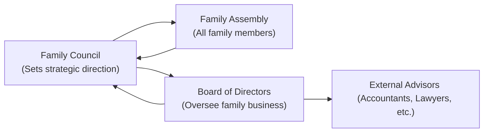

## Understanding Family Complexity

Wealthy families today come in all shapes and sizes, and not just the so-called “traditional” structures we might picture from decades past. You know, I once chatted with a family where the patriarch had gone through two marriages and was raising children from each one (and even helping raise some stepkids along the way). Talk about complexity. When things go smoothly, it can be a real blessing—there’s more love, more perspectives, and a bigger support network. But when disagreements pop up—especially when we’re debating sensitive topics like who gets what and when—the challenges can pile up fast, and the family’s wealth plan can get complicated in a hurry.

Families with multiple marriages or partnerships often create blended households where you might have adult stepchildren, children from different marriages, and maybe even grandchildren who are part of different family trees altogether. You might see a cross-generational scenario where grandparents gift assets to grandchildren directly, bypassing the parents, or where unmarried partners also have inheritance claims. All those layers can be a source of friction if you don’t get them on paper and clarify how to handle them.

Anyway, regardless of how many branches the family tree has, one thing stays the same: the need for some robust governance structures. That’s just a fancy term for “rules, processes, and decision-making frameworks.” But trust me, these frameworks are essential. They’re often the difference between a peaceful, well-coordinated plan and a free-for-all situation where folks end up in heated disputes—sometimes even legal battles.

## Designing Effective Governance

A lot of us might hear “governance” and think it’s only for big corporations or governments. It isn’t. Family governance is relatively similar in concept: you’re establishing systems that guide communication, define roles, and lay out decision-making authority. It’s like drawing up ground rules so that when tough discussions come up (like selling the family business or distributing assets), there’s a formal process to navigate it.

There are two main governance structures you’ll see with wealthy families:

• A written family constitution  
• Some sort of family council or board of directors (especially if there’s a family-run business)

The family constitution is your go-to reference that spells out the family’s values—such as philanthropic priorities, ethical guidelines, and generational vision—and sets rules for succession, conflict resolution, and big decisions that require consensus. Maybe it sounds a bit official, but families who draft these documents typically find they can avoid those dreaded “We had no idea what Dad wanted” or “Why didn’t anyone consult me?” scenarios.

The family council is the second main governance body. Picture a small group of immediate family members who meet regularly to talk about strategy, check in on the assets, and discuss any updates to the constitution or necessary changes. They can also coordinate with a family assembly if the group is extremely large (the assembly includes everyone in the extended family) and serve as a communication bridge between different branches.

Below is a simple diagram that visually represents how such governance bodies can be structured:

In this diagram, the Family Council sits at a strategic level, communicating with the larger Family Assembly to keep everyone informed. If there’s a family business, a Board of Directors often works closely with external advisors—like trust attorneys and accountants—to ensure decisions reflect both family objectives and regulatory requirements.

## Role of Governance in Mitigating Disputes

Let’s face it, humans are humans, and conflict happens. Someone disagrees with a proposed sale. Another family member thinks your philanthropic approach is too generous. Yet another wants to steer more funds into a new tech venture. Governance exists to handle such differences rationally so they don’t erupt into destructive fights.

For instance, some families may require a basic majority vote (over 50%) to proceed on day-to-day decisions such as shifting part of the investment strategy or making moderate charitable grants. But for big moves—think selling the entire family enterprise or altering inheritance distribution—they might require a super-majority vote of two-thirds or three-fourths. This extra threshold helps ensure that major decisions have broad family support. Without it, you’ll see half the family feeling steamrolled by the other, which can sour relationships and even spark lawsuits.

One big plus of a family constitution is that it’s not just a set of rules—it can also outline an internal dispute resolution process. Like, if two of you can’t see eye to eye, maybe you start with mediation by a neutral third party (perhaps a respected family elder or a professional mediator). If that fails, the next step might be binding arbitration. The whole point is to handle disagreements within the family’s own house first, so you don’t end up with a highly public legal battle.

## Periodic Reviews and Evolution

The thing is, families are living, breathing systems, and they evolve over time. People get married, divorced, re-married; children are born; someone moves abroad for work (or for good). So the governance documents can’t just be “set it and forget it.” I remember working with a family that set up an outstanding governance structure back in the late 1990s. It was thorough, bulletproof, you name it. But then a couple decades later, half the people named in that document had scattered across three continents, and some new family members weren’t even accounted for. The result: total confusion.

You have to periodically revisit the family constitution and the composition of the council (or board). Maybe it’s an annual review or a biannual summit, whatever you prefer, but it’s essential to update those documents to reflect the new reality. It keeps everyone on the same page—literally—and helps avoid the “Hey, I wasn’t included!” scenario that can crop up if the governance framework goes stale.

## External Advisors as Referees

It’s not uncommon for families to call upon outside experts to keep everything in check. We’re talking trust attorneys to ensure the trust structures match the family’s goals, accountants to verify compliance with local or cross-border tax regulations, or sometimes even a specialized family business consultant. External advisors may also serve as neutral voices of reason—someone who can interpret what the constitution says about a tricky inheritance clause or help set standard protocols so that no one’s personal biases get in the way.

This “referee” role is especially helpful if a conflict escalates beyond typical family quarrels. An external professional can say, “Here’s what your own rules specify” and “Here’s how we can proceed.” It’s harder for family members to argue with an impartial, knowledgeable, third-party perspective—or at least they’ll have a basis for discussion that doesn’t feel so personal.

## Cultural Nuances and Cross-Border Dynamics

When families span multiple countries—or even multiple cultural backgrounds—governance can get more interesting. Different legal frameworks can affect inheritance laws, wealth transfers, and even how trusts operate. For heirs living in collectivist cultures, family obligations to older generations might be strongly emphasized, while heirs in individualist cultures might believe more in personal autonomy and “my share, my decision.”

Let’s say one branch of the family is in France and the other is in Singapore, and the family holding company is domiciled in Delaware (USA). Well, guess what: you might be playing by multiple sets of rules if you’re not careful—like estate taxes here, forced heirship laws there, maybe different corporate governance laws. Trying to do it all on an ad hoc basis can quickly become a nightmare.

That’s where a comprehensive governance structure can truly shine: you can build in clauses or guidelines for how decisions are made across jurisdictions, who gets priority, and what to do if local laws conflict with family preferences. External advisors specialized in cross-border wealth management often come to the rescue here, ensuring compliance in each relevant jurisdiction.

## Living by a Family Code of Conduct

One of the best ways—maybe even the best way—to keep everyone aligned is to have a shared family code of conduct. It’s kind of like a set of family values, spelled out in writing. These are your big-picture guidelines for how you’ll treat each other, solve disagreements, and spend or invest the family’s money. It could be anything from “We believe in giving back through philanthropy” to “We respect each member’s privacy and independence.”

By having a code of conduct, you anchor discussions in shared principles. This helps cool heads prevail when emotions get hot. Instead of “I want to do this because it’s my right,” you might say, “Let’s see how this fits with our family commitment to socially responsible investing.” The conversation shifts from “me versus you” to “us upholding our shared mission.” Because when your identity is tied up in your family name and legacy, you want that legacy to carry some guiding principles. A code of conduct is like a memory bank of what your family stands for.

## A Quick Case Study

Imagine the Carter family. They run a successful global manufacturing business. The founder, now in his 70s, has three children—one from his first marriage, two from his second marriage. The oldest child is deeply involved in the business and wants to expand aggressively into new markets. The middle child is more cautious and wants to grow slowly, focusing on environmental sustainability. The youngest child, who’s only in their early 20s, has different views altogether, wanting to pivot the company into a tech-based venture.

• Without formal governance: They might hash it out over dinner, leave unresolved tensions hanging, and eventually split into opposing camps. Resentment builds, business decisions slow down, and the founder is at a loss when it comes time for succession.  
• With formal governance: The family constitution clarifies that major strategic shifts (like changing the core direction of the business) require a super-majority vote. It also spells out that environmental considerations are a shared priority. The family council meets with an external advisor to hear everyone’s vantage point, then proceeds with a vote that respects both the majority preference and the overarching “green” policy. The youngest child’s tech aspirations might be integrated into a new division or a spin-off venture. The constitution outlines the timeline for transitions of leadership, so no one is blindsided.  

In the second scenario, even though the family members don’t necessarily have identical viewpoints, the governance provides an orderly and fair system for discussion and resolution.

## Exam Tips: Applying Governance Principles in Private Wealth Management

1. Recognize that clients will often have “messy” family dynamics. Don’t shy away from discussions about family conflicts.  
2. Demonstrate your competence by proactively advocating a governance framework—mention family constitutions, family councils, and codes of conduct.  
3. In a constructed-response question, watch for key terms like “blended family,” “super-majority vote,” or “formal governance body.” You’ll likely need to discuss how these can mitigate conflict or clarify responsibilities.  
4. Remember cross-border complexities on the exam. If the question references multiple jurisdictions, tie in how local legal frameworks might affect inheritance or governance structures.  
5. Practice scenarios where you advise on periodic reviews. Many exam questions revolve around changing family circumstances (birth, divorce, retirement).

If you see a multi-part question about families with complex structures, show how you’d propose a code of conduct or a conflict-resolution approach—don’t just talk about one approach. And watch for potential pitfalls: e.g., ignoring cultural norms or local law can be an exam-trap scenario.

## Glossary

• Family Constitution: A written document outlining the family’s values, policies, succession plans, and conflict-resolution mechanisms.  
• Family Council: A governance body within a high-net-worth family that sets goals, manages family assets, and communicates important decisions.  
• Blended Family: A family unit in which one or both parents have children from previous relationships, creating layered inheritance considerations.  
• Governance Structure: The framework of rules, institutions, and practices that guide a family’s decision-making processes.  
• Super-Majority Vote: A higher-than-simple-majority threshold (e.g., two-thirds) used for critical decisions like selling a family business.  
• Code of Conduct: Agreed-upon principles that define acceptable behavior and responsibilities within the family context.

## References and Further Reading

• Carlock, Randel, and Ward, John. “Strategic Planning for the Family Business.” Palgrave Macmillan.  
• Davis, John A. “Governing the Family-Run Business.” Harvard Business Review, [https://hbr.org/](https://hbr.org/).  
• Poza, Ernesto J. “Family Business.” Cengage Learning.  
• [Family Office Exchange](https://www.familyoffice.com/) — Offers insights and frameworks for family governance best practices.

## Test Your Knowledge of Complex Family Structures and Governance



### A high-net-worth family that has stepchildren, adoptees, and children from multiple marriages is best described by which term?

- [ ] Extended Family
- [x] Blended Family
- [ ] Traditional Family
- [ ] Single-Generation Family

> **Explanation:** A blended family includes multiple branches, often involving children from previous partnerships. This scenario fits that description accurately.

### Which of the following documents typically includes a statement of family values, outlines succession plans, and details conflict-resolution mechanisms?

- [ ] Estate Plan
- [ ] Board Charter
- [x] Family Constitution
- [ ] Corporate Bylaws

> **Explanation:** A family constitution is a written document that combines the family’s vision, rules, and dispute-resolution processes, making it distinct from more formal corporate or legal documents.

### What is the most likely benefit of a super-majority vote requirement (e.g., two-thirds) when deciding whether to sell a long-standing family business?

- [ ] It allows for quick decisions.
- [x] It requires broader agreement and helps avoid contentious disputes.
- [ ] It gives ultimate control to the family council.
- [ ] It is legally mandated in most markets.

> **Explanation:** A super-majority vote mechanism ensures that major decisions have overwhelming support, helping maintain unity and reduce the likelihood of disputes among family members.

### When revisiting a family constitution, which of the following events might most strongly indicate a need for substantial revisions?

- [ ] Buying a new vacation home
- [ ] Minor changes in asset values
- [x] Births, marriages, or divorces within the family
- [ ] Single-year underperformance in investments

> **Explanation:** Significant life events—such as births, marriages, or divorces—often change the makeup of the family and require adjustments to governance and succession guidelines.

### In a cross-border family with members subject to varying cultural norms, which solution is most commonly suggested to address potential disputes?

- [x] A carefully drafted governance framework accommodating cultural differences
- [ ] Ignoring cultural differences for the sake of simplicity
- [ ] Disbursing all assets immediately to avoid conflicts
- [ ] Handling each issue on an ad hoc basis

> **Explanation:** A formal governance structure that specifically addresses cultural differences helps ensure smoother processes and reduced misunderstandings, especially in cross-border families.

### If a family council lacks the specialized legal knowledge to interpret complex tax regulations, the best course of action is usually to:

- [ ] Disregard the regulations and proceed with decisions
- [ ] Leave it to individual family members to handle separately
- [ ] Attempt to vote on the best guess
- [x] Bring in external advisors or experts for compliance

> **Explanation:** External advisors (e.g., lawyers, accountants) bring expert knowledge to ensure that decisions align with legal compliance, particularly in complex tax and estate matters.

### Which of the following is NOT typically a role of a family council?

- [ ] Setting strategic direction for the family enterprise
- [ ] Acting as a platform for communication among family members
- [ ] Facilitating conflict resolution
- [x] Authorizing marriage licenses or divorces

> **Explanation:** While the family council often manages and coordinates a range of family matters, it does not usually handle legal processes like marriage licenses or divorces, which are government functions.

### One purpose of a code of conduct in a high-net-worth family is to:

- [x] Provide shared ethical guidelines to minimize friction
- [ ] Increase secrecy and protect family members from each other
- [ ] Shift decision-making away from the family constitution
- [ ] Replace the need for external advisors

> **Explanation:** A code of conduct supports a culture of respect and shared values, helping family members approach disagreements with a common ethical framework.

### Which of the following best describes the primary function of periodic governance reviews?

- [ ] Consolidating power within one branch of the family
- [x] Adaptation to new family circumstances and changing environments
- [ ] Eliminating the need for a family constitution
- [ ] Reducing the number of heirs over time

> **Explanation:** Periodic governance reviews help ensure that the family’s governance structures and documented policies remain aligned with evolving family circumstances (e.g., marriage, divorce, inheritance laws).

### True or False: A well-structured governance framework can eliminate all family conflicts permanently.

- [x] True
- [ ] False

> **Explanation:** While “eliminate” might be a bit strong, a well-structured governance framework significantly reduces or prevents conflicts by providing clear rules. In practice, no governance structure can guarantee zero disagreements forever, but it’s the closest thing to a systematic “conflict management” toolbox.


