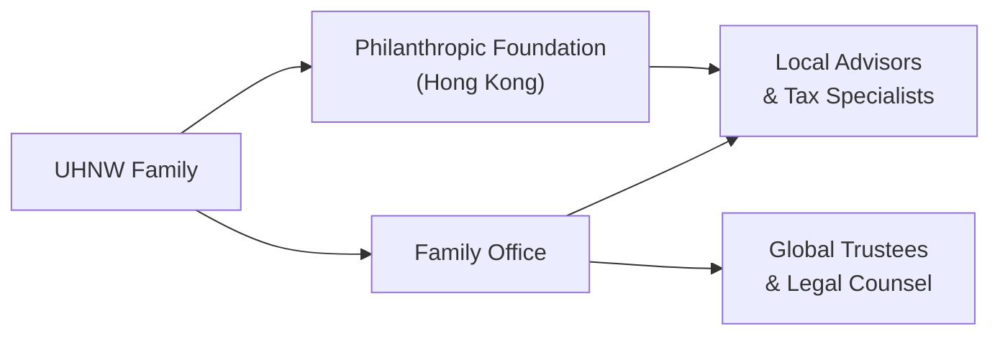

## Understanding the Unique Landscape of UHNW Clients

Ultra‐high‐net‐worth (UHNW) clients—those with investable assets above US$30 million—occupy a distinctive niche in private wealth management. These individuals and families often deal with a complex array of opportunities and challenges that differ greatly from typical high‐net‐worth requirements. In Chapter 2.1, we explored basic family and human dynamics in high‐net‐worth households. Here, we dive deeper into the specialized nature of UHNW relationships, where the stakes and intricacies are significantly higher. 

In my early advisory days, I remember sitting in a conference room with a family whose portfolio included multiple family businesses, a trust that spanned three continents, and philanthropic interests in half a dozen different countries. I felt a bit overwhelmed at first. But, it taught me that serving UHNW families requires an even broader skill set, more sophisticated communication, and an unyielding commitment to continuous learning.

Below, we’ll explore methods to tailor communication, structure educational programs, and bring in specialized expertise—while also addressing the technical complexities of multi‐jurisdictional tax and estate planning.  

## Tailored Communication and Collaboration

Ultra‐wealthy individuals are frequently well‐versed in finance, economics, and business. Indeed, we often find that they’ve run successful enterprises, led large corporate teams, or served on boards of Fortune 500 companies. That means if you present a wealth management plan, you can expect detailed questions and a thorough cross‐examination before they nod in agreement. 

Part of successful communication with UHNW clients is understanding their knowledge level and customizing your delivery to match. Some prefer high‐level discussions sprinkled with big‐picture data, while others want to roll up their sleeves and look at every note in a discounted cash flow analysis. Advisors must remain flexible—give them a “Netflix of knowledge,” letting them choose from an array of advanced or more distilled content depending on the moment.

### Building Trust Through Expertise
Being able to respond instantly to sophisticated questions helps build credibility. Most savvy UHNW families have no shortage of opinions from other top‐tier consultants, attorneys, or bankers. By referencing up‐to‐date research, staying abreast of regulatory and macroeconomic shifts, and being transparent about potential risks, you bolster trust. 

As we discussed in Section 2.2 regarding social and psychological influences of wealth, high trust levels are critical to forging a long‐term relationship. Keep in mind that with UHNW families, these relationships can span multiple generations and encompass not just wealth growth, but philanthropic goals, legacy creation, and even entrepreneurial dreams of younger family members.

### Multi‐Advisor Coordination
UHNW clients often rely on a network of specialists scattered across the globe—attorneys, tax advisors, corporate bankers, philanthropic consultants, family business coaches, and more. The challenge? Ensuring all these professionals exchange information systematically and row in the same direction. 

This is where a lead wealth manager or family office director organizes a cohesive plan. Think of it as project management at a very high level: you coordinate specialists’ efforts, ensuring there are no duplications or conflicting advice. Ultimately, your role is akin to an orchestra conductor, aligning everyone to produce a harmonious long‐term wealth strategy.

## Multi‐Jurisdictional Tax and Legal Complexities

One of the biggest differences between UHNW and smaller accounts is the complexity of cross‐border exposure. Over the course of a lifetime, these families might collect residences in Europe, Asia, or North America. They may invest in private equity funds domiciled in Luxembourg, hold an offshore trust in the Cayman Islands, or have philanthropic endeavors in emerging markets. All these structures require thorough management of tax exposures, local compliance, and regulatory changes.

### An Example of a Multi‐Country Setup
Let’s imagine a UHNW client, originally from Germany, who later gained residency in the United States while establishing a charitable foundation in Hong Kong. Each jurisdiction has its own tax treaties, currency exchange regulations, philanthropic incentives, and reporting rules. Aligning strategies demands advanced knowledge of international tax law, the ability to optimize trust structures, and a willingness to work with local counsel.

Below is a simplified illustration of how various entities might interconnect:

Although this chart is somewhat simplistic, it conveys the vast interplay between different stakeholders in a UHNW situation. You’ll often need consolidated statements that factor in currency exchange, performance analytics, risk management, and compliance with local rules.

## Providing Advanced Education and Resources

As discussed throughout this chapter (particularly in Section 2.3 on complex family structures and governance), UHNW families expect top‐notch educational resources for themselves and their heirs. They want to understand how to evaluate private equity deals, how to do an impact‐investing assessment, or how to manage fiscal responsibility across multiple generations.  

### Workshops and Seminars for Family Members
It can be immensely valuable to organize specialized educational programs—these might include “Family Investment 101” sessions, philanthropic roundtables, or even entrepreneurial boot camps for younger family members. We see many UHNW families seeking to pass on not just financial capital, but also knowledge, values, and a sense of stewardship. 

One approach is to set up weekend retreats or workshops during the family’s regular gatherings. Maybe the older generation wants to highlight the philanthropic mission, while younger members might be more comfortable learning about risk management and asset allocation in a hands‐on format. You can incorporate leaders from across the family business, philanthropic boards, or third‐party subject‐matter experts.

### Non‐Financial Topics
The scope of family education goes far beyond money management. Many UHNW parents actively encourage leadership development, public speaking, or entrepreneurial classes for their children. Ideally, each program fosters personal growth and self‐actualization. After all, wealth management is not only about preserving the finances; it’s also about safeguarding the family’s sense of purpose and continuity.

In situations where a family’s philanthropic goals are substantial, you might also introduce them to mentors with expertise in charitable governance, environmental responsibility, or social entrepreneurship. These can be powerful ways to strengthen values among heirs and ensure they’re ready to take on stewardship roles.

## Robust Reporting and Performance Analytics

When multi‐millions or even billions in assets are distributed across numerous custodians, legal entities, and geographies, consolidated reporting becomes essential. UHNW clients often demand wide‐ranging reports that draw data feeds from multiple jurisdictions. That means your reporting framework must handle:

• Currency exposures  
• Private investment valuations  
• Performance benchmarks (often custom)  
• Risk metrics (e.g., Value at Risk on private equity, stress tests, scenario analysis)  

It’s not just about monthly statements saying “your portfolio went up 2% this month.” Often, deeply granular, real‐time data that disaggregates performance by region, asset class, and currency exposure is needed. Harnessing digital transformation (as introduced in Chapter 1.6) can be invaluable here, so a sophisticated client portal or analytics dashboard can be crucial.

## Specialized Asset Classes and Cutting‐Edge Solutions

UHNW investors frequently have the flexibility to explore complex or illiquid investments. They might be comfortable with direct private equity deals, co‐investment in venture capital funds, or involvement in hedge funds that require large minimum subscriptions. They can also be interested in impact investing strategies, seeking both financial returns and measurable social or environmental outcomes.

### Case Study: Direct Private Equity Deal
Imagine a UHNW family deciding to invest directly in a promising tech startup, shying away from a standard venture capital route. On the plus side, they gain direct control and possibly higher returns. On the downside, they take on single‐company risk, potential illiquidity, and the due diligence burden. As an advisor, your role might be to organize an expert team—tech consultants, legal counsel, accountants, and industry advisors—to rigorously evaluate the opportunity. 

### ESG and Impact Preferences
Some UHNW families have turned to ESG integration or impact investing. They might require specialized frameworks to perform environmental or social impact analyses before committing capital. As we discussed in Chapter 3.6, these strategies often involve advanced metrics that go beyond standard benchmarking. Again, it’s crucial that your reporting infrastructure can capture both tangible financial performance and intangible social returns.

## Designing Programs for the Next Generation

UHNW families generally have legacy concerns that extend to multiple generations, so prudent advisors integrate educational and engagement strategies for heirs. In Chapter 2.7, we introduced the concept of multi‐generational education plans. Here, the focus is on making these plans more specialized to reflect the complexities and responsibilities that come with extremely large wealth.

### Financial Literacy and Stewardship
Children and young adults in UHNW families need an early introduction to investment fundamentals, estate structures, philanthropic philosophies, and family governance rules. The knowledge helps them become responsible stewards. You might set up simulations—like giving them a small philanthropic fund to distribute or letting them “manage” a virtually simulated portfolio. These interactive experiences boost financial literacy and confidence.

### Leadership Development and Entrepreneurship
When UHNW families want to instill leadership qualities, they might sponsor formal mentorship programs, entrepreneurship incubators, or MBA scholarships. Advisors can offer guidance and also coordinate with business coaches, private bankers, or even philanthropic institutions that can provide real‐world learning experiences. The result? Younger generations become more than just beneficiaries—they become active contributors to the family’s enterprise, philanthropic work, and overall legacy.

## Best Practices and Potential Pitfalls

Because UHNW wealth management is so specialized, let’s highlight some key best practices alongside common stumbling blocks:

• Best Practice: Conduct thorough due diligence on every investment proposal, including direct deals. UHNW families will appreciate meticulous analysis.  
• Pitfall: Failing to continually update multi‐jurisdictional strategies as regulations change or as family members relocate can lead to major tax or legal issues.  
• Best Practice: Integrate a robust governance framework, possibly including a family constitution or official governance agreements.  
• Pitfall: Relying too heavily on a single advisor. UHNW clients often need a collaborative team that spans legal, tax, philanthropic, and estate planning disciplines.  
• Best Practice: Offer open communication channels for heirs and arrange engaging educational programs—do not assume younger generations will absorb knowledge passively.  
• Pitfall: Neglecting the intangible side of wealth—e.g., ignoring the emotional, psychological, and relationship dynamics that surface in large families.

## Exam Tips for CFA Level III Candidates

• UHNW scenarios often appear in case studies where you must demonstrate knowledge of multi‐jurisdictional planning, advanced asset structures, or philanthropic complexities.  
• Expect short‐answer or essay‐style prompts concerning how to consolidate performance reporting, manage currency exposures, or structure trusts across multiple tax regimes.  
• Ethics questions might revolve around conflicts of interest or fiduciary responsibilities when coordinating a broad team of advisors.  
• Another common exam angle: showcasing best practices for educating the next generation and integrating philanthropic objectives within a broader wealth management plan.  

Staying up to date with global regulations, advanced estate planning techniques, and specialized investing strategies is key to scoring well on these types of questions. Be sure to illustrate your answers with structured reasoning and practical examples of how you would handle a UHNW client scenario.

## References and Further Reading

• Prince, Russ Alan, and Schiff, Hannah. “The Middle Eastern Luxury Market and the UHNW.” Wealth Management Journal.  
• Arron, Robert. “Global Tax Planning for Ultra‐High‐Net‐Worth Families.” Private Banking Review, https://www.pvtbankingreview.com/.  
• Gray, Tim. “Dynamics of Private Equity for UHNW Family Offices.” Journal of Alternative Investments.  
• Institute for Family Governance (IFG), https://ifgworldwide.org/  

## Serving and Educating Ultra-High-Net-Worth Clients: Knowledge Check



### Which of the following describes a primary characteristic differentiating ultra‐high‐net‐worth (UHNW) clients from typical high‐net‐worth individuals?

- [ ] Less reliance on multi-jurisdictional planning
- [ ] Minimal portfolio diversification
- [x] Greater need for complex strategies and specialized guidance
- [ ] Typically lower complexity in estate planning

> **Explanation:** UHNW clients generally have more complex financial structures, including multi‐jurisdictional factors, specialized trusts, and intricate investment vehicles.  

### Which of the following is an effective way to educate UHNW clients' heirs?

- [ ] Limit exposure to family finances until they inherit
- [x] Provide interactive workshops, simulations, and mentorship arrangements
- [ ] Rely solely on formal business school degrees
- [ ] Discourage them from pursuing leadership roles in the family business

> **Explanation:** Hands‐on workshops, mentorship programs, and simulations foster practical experience and encourage responsible stewardship.  

### When coordinating multiple advisors for a UHNW family, the wealth manager’s role most closely resembles:

- [ ] A passive observer
- [x] An orchestra conductor ensuring cohesive advice
- [ ] A sole decision‐maker
- [ ] A one‐time consultant

> **Explanation:** The wealth manager must align different specialists—such as tax advisers, attorneys, and estate planners—so the family’s overall strategy remains harmonious.  

### Why is consolidated reporting crucial for UHNW families?

- [x] They often have assets in multiple entities, currencies, and jurisdictions
- [ ] It reduces the need for compliance records
- [ ] It eliminates in‐depth analysis of private assets
- [ ] It hides volatile performance figures

> **Explanation:** Consolidated reporting helps UHNW families see a full, integrated picture of their wealth across diverse accounts, currencies, and legal structures.  

### Which of the following is a common pitfall when serving UHNW clients?

- [x] Neglecting updated regulatory changes in a key jurisdiction
- [ ] Offering detailed performance statements
- [ ] Employing a multi‐advisor coordination model
- [x] Relying exclusively on a single advisor without cross‐checking specialized needs

> **Explanation:** Significant pitfalls include ignoring regulatory updates and depending too heavily on one advisor. UHNW situations often require multiple experts.  

### Impact investing appeals to some UHNW families because:

- [x] It merges financial returns with positive social/environmental outcomes
- [ ] It guarantees above‐market returns
- [ ] It is simpler to administer than traditional equities
- [ ] It bypasses due diligence requirements

> **Explanation:** Impact investing aims to achieve both financial returns and measurable social or environmental impact.  

### Why might a UHNW family invest directly in a private company instead of using a venture capital fund?

- [ ] To avoid performing due diligence on the startup
- [x] To gain more control and potentially capture higher returns
- [ ] Because it’s risk‐free
- [x] To structure a personalized deal or partnership

> **Explanation:** Direct deals can offer more control and possibly higher returns, but also carry significant concentration and due diligence burdens.  

### A key non‐financial education topic often included in UHNW family programs is:

- [x] Leadership development and entrepreneurial training
- [ ] Currency derivatives valuation
- [ ] Day trading tactics for quick speculation
- [ ] Strictly philanthropic giving

> **Explanation:** UHNW families often foster leadership and entrepreneurial skills among younger members, aiming to cultivate well‐rounded successors who can take on multiple roles.  

### How should an advisor handle rigorous questioning by UHNW clients?

- [ ] Dismiss questions and maintain brevity
- [x] Respond with transparent, data‐driven explanations
- [ ] Provide only generalized concepts
- [ ] Redirect questions to less formal sources

> **Explanation:** UHNW clients expect thorough, expert‐level answers. Transparent, data‐driven communication helps build trust.  

### UHNW clients often appear in exam questions focusing on:

- [x] Cross‐border tax planning and sophisticated investment strategies
- [ ] Strictly single‐asset class management
- [ ] Limited governance structures
- [ ] Basic retirement allocation formulas

> **Explanation:** Exam questions on UHNW topics emphasize advanced techniques in global tax planning, coordinating complex estate strategies, and guiding multi‐generational governance.  


