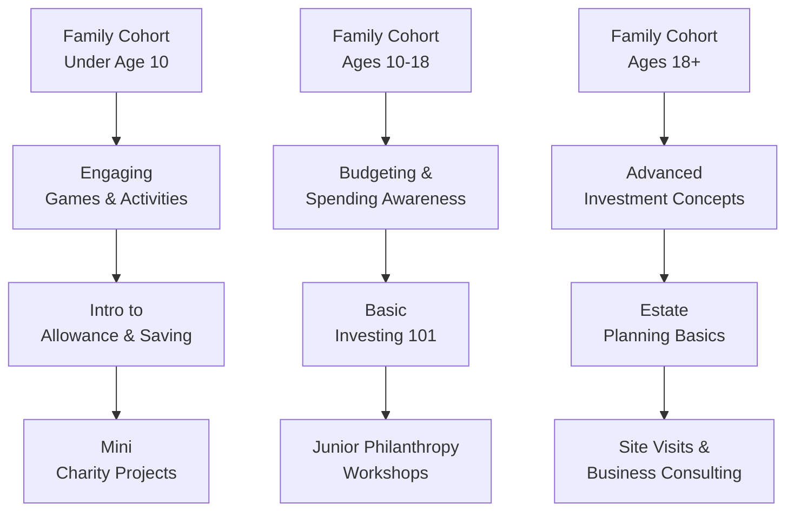

## The Importance of Multi‐Generational Education

One afternoon years ago, I met with a prominent family looking to establish a framework for teaching their teenage children about money. The parents felt that traditional schooling just wasn’t cutting it. Formal instructions on compounding interest and lines of credit were nonexistent, and the kids had never connected the concept of “budgeting” to actual real-life spending. Does this sound familiar? If so, you’re not alone. Many wealthy families find themselves unprepared to pass on wealth management skills to the next generation. 

Multi-generational education plans seek to bring families together around a shared purpose of wealth stewardship and responsibility. These programs address everything from budgeting to philanthropic giving, ensuring that younger members truly understand the resources at their disposal and the impact of their decisions. Admittedly, it can feel a bit daunting, but trust me, it’s well worth the effort. When done right, the entire family develops a sense of collective vision, deeper financial literacy, and the ability to safeguard wealth for decades—or even centuries—to come.

## Foundational Financial Education

When building multi-generational education plans, families need to ensure that the basics are solid. Even a simple concept like “debt” can be misunderstood. Younger family members often see the results of wealth (houses, cars, vacations) but miss the steps taken to get there or the potential pitfalls along the way. That’s why the fundamentals—budgeting, saving, and debt management—should be addressed early and often.

• Budgeting: Learning to track income and expenses sets the stage for all future financial decisions. Introduce a structured budget at a young age, reinforcing that money is a finite resource.  
• Saving: Teach the habit of setting aside a portion of income or allowances for both short-term goals (like new gadgets) and long-term goals (such as college funds or an investment portfolio).  
• Debt Management: Clarify how interest rates work and explain why certain debts (like a mortgage with favorable terms) can be good, while high-interest credit card debt can rapidly erode wealth.

One effective approach is to create small, age-appropriate “financial tasks” for youths. For instance, you could assign older children the responsibility of researching a particular charity, or have them compare prices when grocery shopping to show them how to minimize expenses. A key is to connect real-world prices and saving behaviors to the broader family wealth picture. 

## Advancing to Investing and Philanthropy

After the basics, many families introduce more advanced financial layers, such as investing strategies (equities, fixed income products, alternative investments) or philanthropic endeavors. The “philanthropy curriculum” can be especially meaningful. By learning that wealth extends beyond personal consumption, younger members gain broader community awareness and empathy. For instance, a structured charitable giving session might include:

• Understanding philanthropic vehicles (donor-advised funds, private foundations).  
• Exploring the social impact of targeted giving.  
• Visiting nonprofit organizations that the family supports.

This isn’t just about writing checks. It’s about letting future generations see how the family’s resources can create lasting change—which fosters a profound sense of ownership and responsibility. This is sometimes referred to as Stewardship Education. It’s learning how to align personal values with the power of wealth.

## Real‐World Examples and Engagement

Concrete experiences drive home lessons far more than abstract theories. You can pick up a textbook or watch a presentation slide deck, but it often pales in comparison to an on-site visit to a business or philanthropic project. 

Imagine organizing a “family field trip” to a manufacturing facility wholly owned by the family. Teenagers who have never witnessed daily operations might be amazed by supply chain complexities or how dozens (or hundreds) of staff rely on that business for their livelihoods. Similarly, a “site visit (charitable)” to a local community center receiving family funds transforms charity from an abstract donation into a tangible, life-changing contribution.

Such experiences encourage younger relatives to ask questions like:  
• “How do we measure whether our money is effectively used?”  
• “What happens if our business model evolves with new technology?”  
• “How does this charitable program measure its success?”  

These questions spark curiosity and critical thinking, and they build a powerful sense of engagement.

## Age‐Appropriate Techniques

Families are wonderfully diverse, which means educational techniques for a six-year-old will differ from those for a 16-year-old or a 36-year-old. Options might include interactive games for children, group workshops for adolescents, or structured seminars for adult heirs.

Younger children could benefit from play-based learning, such as board games that incorporate money lessons (e.g., Monopoly). Middle and high schoolers often respond well to “escape room” activities with clues and puzzles tied to financial topics. College-age family members might prefer a more comprehensive curriculum that includes investing fundamentals, budgeting in college, or real-life case studies from family ventures.

Below is a simplified diagram of how a multi-generational education roadmap might look. Notice how each family cohort progressively builds knowledge:

This progressive model ensures each generation advances to more sophisticated financial knowledge at a comfortable pace. It also provides a sense of continuity: younger kids watch older siblings or cousins “graduate” to the next level, building excitement around these new skills.

## Collaborating with External Experts

Despite the family’s depth of experience, wealth managers often see the value of a broader team. Having a tax attorney explain shifting legislation, or a philanthropic specialist highlight unique giving strategies, creates breadth and depth. Inviting these external professionals not only enriches the curriculum but also emphasizes the seriousness of wealth stewardship—this is no casual chat around the dinner table.

Some families schedule “family academies” or “wealth summits” where lawyers, estate planners, philanthropic consultants, and other experts present short seminars at a single, family-wide gathering. When coordinated well, these sessions become cultural milestones, fostering open communication and cementing each member’s responsibility.

## Measuring Success with Feedback and Scenario Analyses

Establishing multi-generational education plans is only half the battle; the other half is verifying whether the education sinks in. Families do well to incorporate periodic knowledge checks—brief quizzes, scenario analyses, or informal guided discussions to see how comfortable each generation is with newfound topics.

One especially effective way is to blend knowledge checks with scenario analysis. Perhaps you present a hypothetical setup: “The equity markets just dropped 15%. If your personal portfolio is heavily weighted in small-cap stocks, how might you respond to preserve your portfolio value?” Or “We have additional capital to donate this year: which philanthropic effort delivers the greatest social benefit?” These hypothetical puzzles spark conversation, reveal any misunderstandings, and encourage continuing dialogue.

## Encouraging Continuity with Family Academies

Teaching younger generations is never a one-and-done affair. Educational needs evolve over time, especially as individuals assume new family or professional roles. Some might become board members of the family foundation; others might take active roles in day-to-day operations of a family business. Scheduling formal gatherings, be it annually or bi-annually, helps keep the conversation fresh. These gatherings—colloquially known as “family academies”—offer opportunities to:

• Revisit previous lessons.  
• Introduce emerging topics like sustainable investing or advanced tax planning.  
• Build closer intergenerational relationships.  

By turning these academies into regular traditions, families reinforce the message that wealth stewardship isn’t optional; it’s a continuous responsibility that demands ongoing learning.

## Fostering Stewardship and Purpose

When families teach the “why” behind their riches, the outcomes can be surprisingly positive. Through discussing philanthropic giving strategies and engaging in site visits, younger members grow to see the bigger picture. Wealth is not simply for personal use; it can be directed toward broader social good, such as fighting hunger, supporting arts, or funding educational scholarships in underserved regions. This fosters real stewardship.

Stewardship education helps maintain a sense of humility and gratitude, traits that can be critical in a family’s development. Unlike a purely numbers-driven approach, stewardship instills a moral backbone—shifting wealth from being purely about ownership to championing responsibility, accountability, and community benefit.

## Practical Example: A Case of Gradual Empowerment

Consider the Harper family, who own a chain of organic farms. The eldest siblings (in their 50s) were actively involved in management. Their teenage grandchildren, however, only saw farmland visits as holiday getaways with scenic views. To shift the younger generation’s perspective, the family established a multi-generational education plan:

• Stage 1: Invited an agronomist to explain how the farm’s crop rotation strategy influences both profitability and sustainability.  
• Stage 2: Organized a budgeting challenge, where each grandchild managed a “mini fund” for farm-related micro-projects—like building an on-farm café kiosk.  
• Stage 3: Introduced philanthropic giving, where part of the farm’s profits sponsored local environmental education in underserved schools.  
• Stage 4: Asked each teen to develop a small business proposal that aligns with the farm’s sustainability mission, presenting it at the family’s annual get-together.

Over time, the grandchildren not only learned advanced concepts like enterprise valuation, they also experienced the satisfaction of feeding local communities and caring for the land. This combination of practical skill-building and philanthropic perspective became a hallmark of the Harper family.

## Common Pitfalls and Strategies to Overcome Them

Some families shy away from formal education sessions, fearing it will appear “too corporate.” Others worry that external experts might spill confidential information or overshadow senior family members. Here are a few pitfalls and ways to mitigate them:

• Lack of Engagement: If you notice disinterest from some heirs, incorporate interactive elements (group challenges, role-playing). Also, keep topics relevant: talk about real issues the family faces.  
• Overloading Content: Too much complexity too soon can discourage novices. Break lessons into digestible modules and provide bite-sized tasks.  
• Confidentiality Concerns: Set ground rules with your experts. Clarify the scope of their involvement and maintain a safe space for open dialogue.  
• Resistance to Change: Some older family members may feel threatened by the new generation’s ideas. Ensure that each member has a voice and emphasize collaborative problem-solving.

## A Brief Note on Mathematical Tools

Throughout these educational sessions, consider introducing straightforward formulas that illustrate how wealth grows or diminishes over time. For instance, the classic compound interest formula:


A = P \times (1 + r)^n


where  
• \\(A\\) is the future value of the investment,  
• \\(P\\) is the initial principal,  
• \\(r\\) is the annual interest rate,  
• \\(n\\) is the number of compounding periods.

Explain that compounding magnifies results over multiple decades, demonstrating why consistent investing yields exponential growth. Show them that the same principle can apply to philanthropic assets left to accumulate in a donor-advised fund. It’s also helpful to run hypothetical scenarios to illustrate the impact of inflation or rising interest rates on philanthropic disbursements.

## Final Tips for CFA Exam Relevance

Multi-generational education frameworks might be tested in a case vignette or an essay question focusing on client relationships, philanthropic planning, or estate discussions. A typical Level III item set could present a high-net-worth family with specific goals and tricky interpersonal dynamics, then ask for recommended steps to establish or evaluate a structured educational plan. Key exam strategies:

• Link your answers to the family’s overarching objectives (wealth preservation, philanthropic impact, next-gen engagement).  
• Provide practical recommendations open to revision over time.  
• Use correct fiduciary language where relevant, highlighting a thorough, holistic approach.  

Remember that the exam often rewards holistic thinking. Don’t forget intangible goals like maintaining harmony and shared vision—they can be just as vital as tax optimization.

## References and Further Exploration

• Hughes Jr., James E. “The Cycle of the Gift: Family Wealth and Wisdom.” Wiley.  
• Fredda Herz Brown and Fran Lotery. “Estate Planning for the Next Generation: A Psychological Perspective.” Family Wealth Advisors Journal.  
• Foster, Kelli. “Kids and Cash: Teaching Children About Wealth and Responsibility.” Private Wealth Series, [Link](https://www.pws.org/).  
• [National Endowment for Financial Education](https://www.nefe.org/) – Resources for creating financial literacy programs for youth and adults.  

By implementing a thoughtful, age-appropriate, and continuously evolving education plan, families can preserve financial prosperity and pass along a cherished legacy of responsibility. This structured approach balances the pragmatic demands of managing significant wealth with a deeper sense of purpose—a combination that effectively equips heirs to safeguard and grow family fortunes for generations to come.

## Test Your Knowledge: Multi-Generational Education Plans



### Which of the following is the best example of how to begin teaching financial basics to young children?

- [ ] Providing in-depth lectures on structural inflation
- [x] Using simple budgeting tasks and interactive games
- [ ] Involving them in tax filing exercises
- [ ] Translating derivatives contracts into child-friendly language

> **Explanation:** Young children learn best with accessible and engaging tasks that introduce core financial concepts like budgeting and saving in a fun way.

### A family decides to host a “family academy” involving tax attorneys and philanthropic specialists. Which is the primary benefit of including these outside experts?

- [ ] Reducing the family's internal disagreements on distribution of tasks
- [x] Providing specialized knowledge to enhance the family’s educational curriculum
- [ ] Ensuring children comply with house rules during workshops
- [ ] Decreasing the overall complexity of inheritance

> **Explanation:** External experts, like tax attorneys and philanthropic specialists, offer specialized knowledge and a comprehensive perspective on complex topics, enriching the family’s learning experience.

### Which concept best describes the idea of teaching family members to uphold responsible management of wealth for the benefit of future generations?

- [ ] Tax Loss Harvesting
- [ ] Asset Allocation
- [x] Stewardship Education
- [ ] Monte Carlo Simulation

> **Explanation:** Stewardship education focuses on developing the skills and mindset required for long-term, responsible wealth management.

### If a teenager is asked to manage a small charitable budget and report on how effectively the funds are used, what educational technique is being employed?

- [x] Real-world application of philanthropic principles
- [ ] High-pressure performance measurement
- [ ] Age-inappropriate scenario analysis
- [ ] Strict confidentiality enforcement

> **Explanation:** Giving a teenager direct control over a small charitable budget creates a practical learning experience, bridging theory and real-world application.

### Which of the following is a recommended approach to maintaining engagement at family academies for adolescents?

- [x] Facilitating interactive projects like financial “escape rooms”
- [ ] Conducting lengthy lectures on private equity
- [x] Organizing philanthropic site visits 
- [ ] Focusing solely on the family’s trust documents

> **Explanation:** Adolescents generally respond to interactive, hands-on methods and relatable learning experiences. Combining fun challenges with philanthropic site visits can keep them motivated.

### What is a common pitfall when conducting multi-generational education sessions?

- [ ] Using external experts to offer new perspectives
- [x] Overcomplicating content or going too in-depth too soon
- [ ] Encouraging open communication among family members
- [ ] Creating age-appropriate games

> **Explanation:** One of the primary pitfalls is overloading younger members with complex information and eroding their interest or willingness to learn.

### Which practice can significantly increase the impact of a philanthropy curriculum?

- [x] Incorporating site visits to organizations the family supports
- [ ] Presenting accounting standards without discussion
- [x] Encouraging each family member to propose a charitable project
- [ ] Restricting philanthropic efforts to a single cause

> **Explanation:** Site visits and personal involvement in charity selection or project proposals make philanthropy tangible, fostering a deeper sense of ownership and empathy.

### Which of the following is an appropriate metric to use when evaluating whether the multi-generational education program is effective?

- [x] Scenario analysis outcomes and feedback surveys
- [ ] Market share of the family’s main business
- [ ] Annual tax returns 
- [ ] Quarterly statements of philanthropic funds alone

> **Explanation:** Structured scenario analyses and direct feedback give insight into how well participants are absorbing lessons and applying learned skills to hypothetical or real-world situations.

### What is the primary objective of scheduling recurring “family academies” or wealth summits?

- [x] Ensuring ongoing, adaptive education for evolving roles
- [ ] Protecting senior family members’ authority over decision-making
- [ ] Minimizing external collaboration
- [ ] Avoiding discussions on sensitive topics like philanthropy

> **Explanation:** Regular family academies serve as a platform to revisit older lessons, introduce emerging financial topics, and adapt to each member’s changing role.

### True or False: A family’s desire to preserve wealth for future generations always aligns with an “accumulate as much as possible” mentality.

- [x] True
- [ ] False

> **Explanation:** While the statement might initially sound correct, in practice, a comprehensive stewardship approach balances responsible accumulation with philanthropic and legacy considerations. Hence, the desire to preserve wealth doesn’t necessarily lead to hoarding; it’s about prudent management and purposeful allocation.


