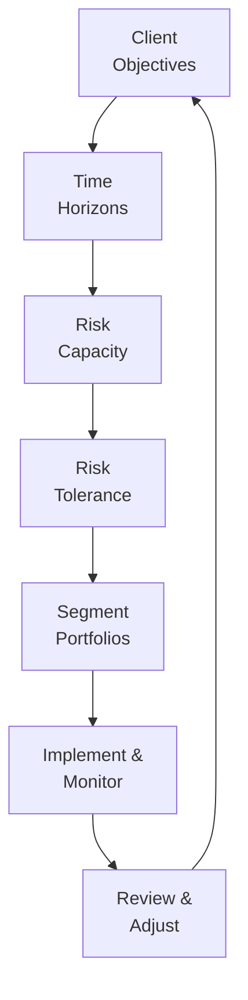
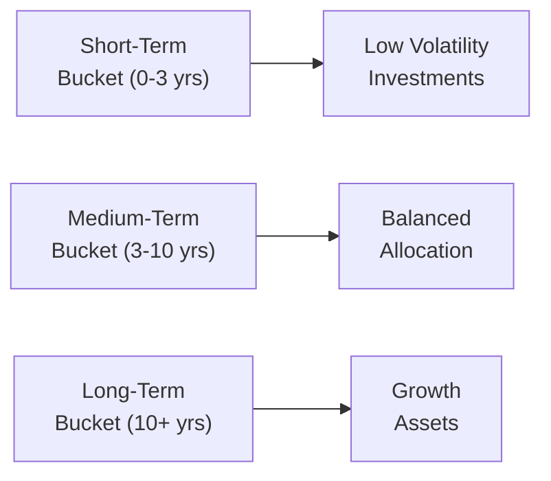

Introduction  
Goals-based financial planning, at its core, is about connecting your portfolio strategies directly to what really matters: your personal aspirations, your family’s long-term security, and the legacies or philanthropic footprints you wish to leave behind. It’s not solely about chasing maximum returns—though returns certainly matter—but about ensuring your chosen path has the highest probability of allowing you, or your family, to live the life you want without constant fear of falling short.

You might have heard the line “plan your dive and dive your plan;” well, those words of caution sum up goals-based financial planning perfectly. We begin by identifying each client’s short-, medium-, and long-term goals, clarifying tolerable risks, and then crafting an investment approach that’s robust enough to adapt when, you know, life decides to surprise us.

Understanding Goals-Based Planning  
Goals-based planning is a disciplined framework that segments a client’s aspirations into distinct objectives—such as retirement, education funding for children or grandchildren, starting an entrepreneurial venture, or philanthropic giving. Each objective is assigned:  
• A targeted time horizon (short-term: under 3 years; medium-term: 3–10 years; long-term: 10 years and beyond).  
• A recommended risk level that aligns with both your capacity to absorb losses and your emotional comfort with uncertainty.  
• A thorough documentation of how you will reach each goal (via annual contributions, portfolio allocations, rebalancing strategies, etc.).  

I remember an early example from my own practice. I met a family who, ironically, had more than enough assets to fund their kids’ education, support a comfortable retirement, and even buy a holiday home. But they lived perpetually anxious that a sudden market downturn would derail everything. Adopting a goals-based approach helped them see that each objective required different levels of liquidity and distinct risk guidelines. Once it was all mapped out and we’d run some scenario analyses, the family felt more at ease because each goal’s investment approach was separated into its own “mini-portfolios.” That sense of clarity early on is what truly sold me on the value of goals-based planning.

Key Components of Goals-Based Financial Planning  

Time Horizon Segmentation  
Time horizon is one of the most critical aspects to get right. Generally:  
• Short-term goals (less than 3 years) emphasize liquidity and capital preservation—like building an emergency fund or saving for an upcoming home renovation.  
• Medium-term goals (3–10 years) might be, well, something like planning for a child’s college tuition in 7 years, or that dream sabbatical you’ve always wanted to take. These often require a balance between moderate growth and moderate volatility management.  
• Long-term goals (10+ years) can typically bear more risk since the extended timeframe helps cushion short-term market shocks. Retirement planning often falls in this bucket, but so do philanthropic endeavors or multi-generational wealth transfers.  

Risk Capacity vs. Risk Tolerance  
Yes, these two risk concepts are distinct, though many newcomers in wealth management sometimes mix them up. Risk capacity is an objective measure: how much of a decline can your investment portfolio endure before it jeopardizes your ability to meet critical goals? Risk tolerance, on the other hand, is essentially emotional: how comfortable do you feel about fluctuations in account balances or the prospect of a significant drawdown?

• Risk Capacity: Evaluating the client’s net worth, liquidity needs, cash flow requirements, obligations, and how a potential financial setback might hamper each goal.  
• Risk Tolerance: A partly psychological concept, reflecting personal comfort with uncertainty, market volatility, and potential drawdowns.  

If you’re the type of person who checks your portfolio daily and panics at the slightest market waver, you might have a low emotional tolerance—even if you have a massive net worth. Matching these tendencies to your financial capacity is crucial in guiding portfolio design so that you don’t lose sleep on nights the S&P 500 dips 2%.

Aligning Portfolios with Goals  
In goals-based planning, many advisors use a “bucketing” approach, effectively creating separate mini-portfolios aligned to each distinct goal’s time horizon and your personal risk acceptance levels:

• Bucket 1: Short-Term Bucket  
  – High-liquidity holdings, such as money market funds or short-term investment-grade bonds.  
  – Minimal volatility tolerance, since any significant decline might prevent the investor from accomplishing the goal.  

• Bucket 2: Medium-Term Bucket  
  – Balanced portfolios, often including a moderate allocation to equities and fixed income.  
  – The emphasis is on capital appreciation while limiting volatility exposure through diversification.  

• Bucket 3: Long-Term Bucket  
  – Typically a growth-oriented equity allocation, or possibly alternative investments (like private equity, real estate, or hedge funds) if that suits the investor’s profile.  
  – The extended time horizon can help ride out market cycles, so we can handle more volatility.

Let’s illustrate with a simplified example:

• Jessica has three distinct goals:  
  1) Save for a down payment on a home in 2 years ($100,000 needed).  
  2) Fund her daughter’s college education in 10 years (estimated $300,000).  
  3) Retire in 30 years, aiming for a $2 million nest egg.  

A short time horizon of 2 years means Jessica’s home-down-payment bucket invests conservatively—mostly short-term Treasuries, money market funds, or high-yield savings. Meanwhile, her college-planning bucket has a moderate risk strategy, balancing equities and high-quality bonds over that 10-year period. The retirement bucket can tolerate more risk (maybe 70–80% equities or risk alternatives) because 30 years is ample time to ride out fluctuations.

Diagram: Goals-Based Planning Process  

In the diagram above, we see that the goals-based planning framework is cyclical: we begin by gathering the client’s objectives, define time horizons, assess risk capacity and tolerance, segment into separate portfolios (or “buckets”), then implement and monitor continuously, and finally review and adjust strategies as goals or external factors evolve.

Milestones, Monitoring, and Communication  
“Measurement is the first step that leads to control and eventually to improvement,” as the old saying goes. In goals-based planning, establishing milestones along the way helps gauge progress in real-time. Doing a quick check at year-end, or even quarterly, to see if your portfolio and contributions are on track is invaluable.  

• Milestones might include:  
  – Reaching specified savings contributions in each bucket.  
  – Evaluating how each sub-portfolio is performing against its respective benchmarks or target returns.  
  – Checking liquidity needs: do we still expect to need the funds at the planned date, or has something changed?  

• Communication ensures everyone’s still on board and not freaking out when a bear market comes along. During market sell-offs, strong communication reminds clients that a short-term bucket’s minimal equity exposure is by design, and that the deeper equity allocations in the long-term bucket have the runway to recover.  

The Role of Monte Carlo Simulations and Scenario Analysis  
In practice, advisors often employ Monte Carlo simulations to gauge the probability of achieving each goal under varying market outcomes. These simulations run thousands of random return paths to reveal how frequently you might run out of money for a particular objective. For example, a 90% probability that you’ll fund your child’s education in 10 years means that in 9 out of 10 random return scenarios, your final portfolio balance is sufficient for tuition costs.  

Scenario analysis is a bit more strategic, assessing “what if” extremes: what if inflation spikes significantly? What if there’s a recession in year 2 of the plan? By visualizing a variety of plausible outcomes, scenario analysis helps shape robust contingency plans, such as building a slightly higher cash reserve for near-term goals or adding inflation-protected securities for a medium-term objective.

Behavioral Finance Influences  
Goals-based planning is grounded in the psychology of how real people (yes, with real emotions) make decisions. Behavioral finance acknowledges that we’re not always the rational agents that classical economics fantasizes about. We have biases, like:

• Loss Aversion: Feeling the pain of losses more deeply than the pleasure of equivalent gains.  
• Overconfidence: Trading too frequently, thinking we have unique insight others lack.  
• Anchoring: Relying excessively on a past reference point, like an initial purchase price.  

These biases can lead to portfolio actions that stray from the plan—e.g., panic selling during a temporary downturn or over-allocating to equities because we believe we’ve found the “next big stock.” By explicitly acknowledging these tendencies in a goals-based structure, advisors can design systems to limit impulsive mistakes: setting rebalancing thresholds, employing dollar-cost averaging, or even simplified mental “buckets” that keep clients from messing with their long-term investments in turbulent markets.

Practical Example with Behavioral Twist  

Suppose you have an investor, Rahul, who wants to retire in 15 years, but he also wants to purchase a vacation property in 3 years. Stress levels can spike if there’s a market slump right when he’s planning on pulling funds for that property. By carved-out accounts, the short-term property bucket uses safer, more liquid instruments, helping Rahul sleep better. Meanwhile, the retirement bucket can stay intact and keep compounding. If a deep market drop hits, Rahul might see a red figure in the retirement piece but can remain calm because those funds aren’t needed anytime soon.

Here’s the subtle but powerful difference: If Rahul were to keep everything in one giant portfolio, a big daily drop of 2% or 3% might rattle him. He could panic and yank out more money than needed “just to feel safe,” harming his retirement plan. With a goals-based approach, the short-term rollout for the vacation property remains stable, and the rest can continue to ride the stock market wagon for long-term growth.

Common Pitfalls and How to Avoid Them  

• Ill-Defined Goals: Vague statements like “I want to retire rich” aren’t helpful. Define “rich” or “comfortable” with a number, approximate lifestyle expenses, and timeline.  
• Ignoring Liquidity Needs: Overcommitting to illiquid assets might hamper your ability to fund short-term goals or handle unforeseen emergencies.  
• Misalignment of Risk: Having purely subjective risk tolerance overshadow your real capacity can lead to overly cautious or overly aggressive portfolios.  
• Lack of Updates: Life events—marriage, birth of a child, job changes—alter your plan’s assumptions. Be sure to revisit and refresh your plan at least annually, or whenever something big happens.  
• Overconfidence in Scenario Models: While Monte Carlo and scenario analyses are powerful, they rely on assumptions about returns, volatilities, and correlations that may change with market conditions. Always maintain a margin of safety.

Implementation and Monitoring Techniques  

• Strategic vs. Tactical Allocation: Use strategic allocation to anchor each goal’s portfolio to a baseline asset mix. Tactical shifts may be employed to capitalize on shorter-term market views but keep these within predefined bounds.  
• Rebalancing Policies: Decide ahead of time when and how you will rebalance (e.g., quarterly or when allocations drift 5% from targets).  
• Performance Reporting: Provide performance reports that link each goal’s progress to its specific portfolio. This approach fosters an understanding that a drawdown in the long-term bucket might be acceptable if short-term goals remain on track.

Diagram: Goals-Based Portfolio Buckets

In this bucket diagram:  
• The short-term bucket invests in relatively stable, liquid assets suited for immediate spending needs.  
• The medium-term bucket balances growth and stability through a blend of equity and bond investments.  
• The long-term bucket focuses on growth assets that can deliver higher returns over a longer timeframe, accepting the volatility that comes with equity or alternative investments.

Compliance, Standards, and Ethical Considerations  
In practice, wealth managers must comply with relevant regulations and professional standards (like the CFA Institute Code of Ethics and Standards of Professional Conduct). Transparency about fees, performance measurement, and potential conflicts of interest is critically important. Additionally, keep in mind that certain tax implications (e.g., IFRS or US GAAP guidelines for structuring assets) may affect how you set up each bucket or goal structure, especially for clients with cross-border or multi-jurisdictional considerations.

Conclusion  
Goals-based planning stands out for its clarity and personalized approach, fostering deeper trust between advisors and clients. By segmenting objectives, reflecting on time horizons, carefully assigning risk, and weaving in scenario analyses, each aspiration can be pursued in a structured—and occasionally more emotionally comfortable—manner. The approach doesn’t promise a stress-free life (markets can be whipsaw, after all), but it helps keep everyone’s focus on the big-picture targets.

Final Exam Tips  
• Familiarize yourself with how to articulate goals-based planning in an essay question. The CFA Level III exam often probes your ability to structure planning recommendations or evaluate whether a proposed strategy is aligned with client objectives.  
• Provide detailed rationale when linking each goal to a specific asset allocation or recommended strategy.  
• Practice case studies where you must incorporate a client’s psychological biases, short-term liquidity needs, and long-term growth targets simultaneously.  
• Prepare to interpret outputs of Monte Carlo simulations or scenario-based stress tests. Demonstrate not only the calculation but also the interpretation of probabilities in relation to goal achievement.  
• Revisit the relevant sections in the official CFA Institute Level III Curriculum, which offers many practice questions similar in style and depth.

References for Further Study  
• CFA Institute Level III Curriculum—Goals-Based Wealth Management Frameworks.  
• Hallman, G. V., & Rosenbloom, J. (latest ed.). Private Wealth Management: The Complete Reference for the Personal Financial Planner.  
• Davidow, T. (Article Series). Goals-Based Investing: Integrating Traditional and Behavioral Finance.  
• Ackert, L., & Deaves, R. (2010). Behavioral Finance: Psychology, Decision-Making, and Markets.

## Test Your Knowledge: Goals-Based Financial Planning and Wealth Management



### Which statement best captures a core principle of goals-based financial planning?

- [x] Segmenting a portfolio based on distinct time horizons and objectives.  
- [ ] Prioritizing maximum capital growth regardless of goal timing.  
- [ ] Minimizing all volatility to prevent any losses in the portfolio.  
- [ ] Collecting assets in a single account with a single uniform risk profile.  

> **Explanation:** Goals-based planning divides a portfolio into sub-portfolios aligned with specific objectives, each having its own time horizon and risk parameters.

### What is the primary reason to assign different risk levels to short-term and long-term goals?

- [x] Longer time horizons can tolerate more volatility since there is more time to recover from market declines.  
- [ ] Longer time horizons should never hold stocks because they are too risky.  
- [ ] Short-term goals should be invested entirely in equities to deliver faster returns.  
- [ ] There is no difference in risk approach; both should be equally aggressive.  

> **Explanation:** With a longer time horizon, investors generally can tolerate more volatility in pursuit of higher potential returns. Conversely, short-term goals typically require capital preservation and liquidity.

### Which of the following best describes risk tolerance in the context of goals-based planning?

- [x] An investor’s subjective emotional ability to withstand portfolio volatility.  
- [ ] The purely mathematical volatility measure used by portfolio managers.  
- [ ] The ability to handle leverage in real estate investments only.  
- [ ] The capacity to manage short-term liquidity needs.  

> **Explanation:** Risk tolerance is the investor’s personal comfort level with potential fluctuations or losses, distinguishing it from the more objective concept of risk capacity.

### How do Monte Carlo simulations help in goals-based financial planning?

- [x] They provide probabilities of achieving financial goals under various market scenarios.  
- [ ] They eliminate all risk of loss by ensuring exact outcomes.  
- [ ] They avoid the need for diversified portfolios.  
- [ ] They guarantee that inflation will always be matched in real terms.  

> **Explanation:** Monte Carlo simulations create numerous hypothetical market paths, estimating the likelihood of success (funding goals) across different scenarios.

### Which of the following is the most accurate depiction of a “bucket” strategy?

- [x] Creating sub-portfolios, each dedicated to a distinct goal or time horizon.  
- [ ] Combining all assets into a single large portfolio for simplicity.  
- [x] Labeling when funds can be accessed, such as short-term vs. long-term, to guide asset allocation.  
- [ ] Focusing only on short-term liquidity and neglecting retirement-based assets.  

> **Explanation:** A bucket strategy partitions assets by distinct time horizons (short, medium, long) or goals, each with its own investment policy.

### Why is communication especially important in goals-based financial planning?

- [x] It ensures clients remain committed to the strategy during market volatility.  
- [ ] It conceals significant portfolio losses from clients.  
- [ ] It eliminates the need for scenario analyses.  
- [ ] It prevents the advisor from following compliance requirements.  

> **Explanation:** Clear, continuous communication helps investors stay disciplined and minimizes panic during market fluctuations.

### Which of the following biases might lead an investor to sell prematurely after a small decline, even though the long-term goal is far off?

- [x] Loss aversion  
- [ ] Overconfidence  
- [x] Anchoring  
- [ ] Hindsight bias  

> **Explanation:** Loss aversion is the strong emotional reaction against losses, anchoring can also cause investors to fixate on a recent peak portfolio value. Overconfidence and hindsight bias are separate behavioral tendencies.

### Which metric helps measure the likelihood that an investor will meet or exceed a goal?

- [x] Probability of success from a Monte Carlo simulation  
- [ ] Credit rating upgrade  
- [ ] Sharpe ratio only  
- [ ] Factor exposure analysis  

> **Explanation:** Monte Carlo simulations often convey results with a percentage likelihood of meeting a goal, which can guide adjustments in asset allocation or contributions.

### What is a major limitation of relying solely on scenario analysis in goals-based financial planning?

- [x] Scenario analysis focuses on specific hypothetical conditions, potentially missing unexpected market extremes.  
- [ ] Scenario analysis is more accurate than Monte Carlo simulations.  
- [ ] Scenario analysis guarantees stable returns.  
- [ ] Scenario analysis eliminates all behavioral biases.  

> **Explanation:** Scenario analysis typically examines a finite number of “what if” cases, which may not capture the full spectrum of possible market outcomes.

### True or False: In goals-based planning, risk capacity should always exceed risk tolerance.

- [x] True  
- [ ] False  

> **Explanation:** A client’s objective ability to bear losses (risk capacity) should ideally be greater than or at least in line with their emotional willingness to accept risk (risk tolerance). If an investor is comfortable with more risk than they can financially handle, that mismatch creates unsustainable investment conditions.


