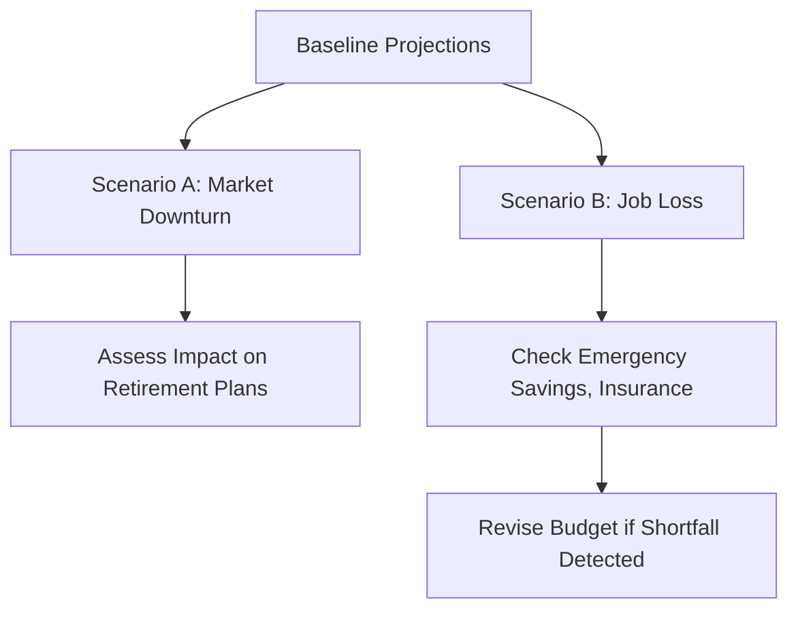

## Introduction

Managing financial exposures across life stages is a core component of Wealth Planning. In this section, we’ll explore how individuals’ assets, liabilities, income sources, and obligations change over time and how advisors can guide clients through these transitions. We’ll talk about why an early-career professional might emphasize paying down debt and maintaining liquidity, while a soon-to-be retiree may focus on preserving capital and preparing for healthcare expenses. I remember a friend who once said, “I’ll think about retirement when I’m 50,” but—believe me—that’s not necessarily the best strategy.

We’ll touch on the major life stages that are typical for most individuals, while acknowledging variations due to factors like career choices, family circumstances, or location. Regardless of the situation, understanding each stage’s key financial exposures and having a roadmap for addressing them is critical to safeguarding long-term goals and legacy objectives. 

## The Life-Cycle Hypothesis

The Life-Cycle Hypothesis posits that individuals seek to smooth consumption over a lifetime. During early adulthood, we often incur substantial expenses (education, housing) that exceed our current earning ability. Then, in the middle (peak) years, income often grows, enabling saving for retirement and other goals. Finally, in retirement, the focus shifts toward drawing down assets without running out prematurely.

Mathematically, an individual’s net worth trajectory over life might be expressed as:


\text{Net Worth} = \sum (\text{Income}_t - \text{Expenses}_t) \times (1 + r)^t


Where:
• \\( \text{Income}_t \\) is income in period \\( t \\).  
• \\( \text{Expenses}_t \\) is expenses in period \\( t \\).  
• \\( r \\) is the rate of return or discount rate.  

But let’s not get too bogged down in formulas for now. It’s just to say that if you earn more than you spend and invest your surplus wisely, your net worth grows over time, typically peaking before you begin retirement withdrawals.

Below is a simple diagram illustrating how our focal points change from one life stage to the next:

Throughout these transitions, personal events such as marriage, starting a business, having children, and encountering unexpected circumstances (job loss, divorce, etc.) can all shift financial exposures dramatically.

## Early Adulthood

Early adulthood is typically characterized by relatively lower incomes, limited financial assets, and possibly steep liabilities (like student loans or a mortgage). People in this stage might feel, "Well, I'm saddled with debt. I'm just trying to stay afloat." However, adopting solid financial habits early can set the stage for long-term prosperity.

### Key Financial Exposures

• High Debt Ratios: Whether it’s student loans or a first mortgage, early-career professionals often carry higher debt relative to income.  
• Liquidity Shortages: Cash on hand might be low due to debt payments and establishing an independent household.  
• Insurance Gaps: Many start their careers without adequate life insurance, disability coverage, or health insurance because they perceive themselves as too young to need it.  
• Career Risk: Income might be unstable, especially for entrepreneurs or contract workers.  

### Strategies and Priorities

1. Build Liquidity: Basic budgeting and emergency fund creation (3–6 months of living expenses) can mitigate short-term cash flow risk.  
2. Pay Down High-Interest Debt: Aggressively reducing higher-rate debts often yields a guaranteed return on capital (by saving on interest).  
3. Start Investing Early: Even small monthly contributions to retirement plans or diversified portfolios can have a remarkable impact when compounded over decades.  
4. Protect Against “What-Ifs”: Comprehensive insurance packages, including disability and term life, can be surprisingly affordable when purchased young.

### Example: The Case of Betty

Imagine Betty, a 26-year-old software engineer weighed down by student debts. She’s considering a down payment on a condo and is worried about her future. She starts by setting aside three months of living expenses in a money market fund to handle emergencies. Then, each month, she pays off extra principal on her highest-interest loan. Meanwhile, Betty also invests 5% of her salary into her employer’s retirement plan to get the matching contribution. She’s ensuring she isn’t missing out on “free” employer money and is forming habits that could accelerate her wealth in the future.

## Peak Earning Years

For most, the “peak earning years” occur during mid-career when salaries climb and promotions come along, though it might happen at different ages for different professionals or entrepreneurs. During this time, individuals usually have higher disposable incomes, allowing them to fast-track savings.

### Common Financial Exposures

• Lifestyle Creep: Rising income often entices people to boost spending on bigger homes, nicer cars, or lavish vacations.  
• Uninsured Risks: Higher assets can expose you to bigger liabilities, especially if you’re not updating your insurance coverage or estate planning.  
• Potential Concentrated Positions: Corporate executives or entrepreneurs may have large holdings in their company’s equity, exposing them to single-stock risk.  
• Bigger Family Obligations: Funding children’s education, caring for aging parents, or supporting extended family members might gain prominence.

### Strategies and Priorities

1. Maximize Retirement Contributions: Make full use of tax-advantaged accounts (e.g., 401(k), IRAs, or local equivalents) to shelter growth from taxes.  
2. Diversify Investment Portfolios: Avoid overweighting in your employer’s stock. Explore a strategic asset allocation plan (see Section 4.1: “Portfolio Allocations for Private Clients”).  
3. Rebalance and Revisit Insurance: As your net worth and family responsibilities grow, you might consider higher coverage for life, liability, and disability insurance.  
4. Estate Planning Basics: With bigger assets often come bigger estate obligations. Update wills, trusts, powers of attorney, and advanced directives as recommended in Section 3.4, “Tax Implications in Individual Wealth Planning,” and 3.3, “Asset Protection and Trust Structures.”

### Example: The Case of Jake and Maria

Jake (40) and Maria (38) both have stable jobs. They’re earning much more now compared to their 20s. But they’re also considering upgrading to a larger home and sending their two kids to private school. After meeting with a wealth advisor, they realize a bigger mortgage means a larger financial exposure. They decide to limit their housing budget so they can put more into retirement savings and a 529 college plan. They also purchase umbrella insurance to protect their assets because—let’s face it—one lawsuit could wipe out a substantial portion of their net worth.

## Pre-Retirement

The decade leading up to retirement can be a nail-biter. People commonly shift their focus from growth to capital preservation. Volatile markets, especially if they occur right before retirement, can erode a portfolio to a level that’s hard to recover from without more working years.

### Key Financial Exposures

• Market Downturns: A major bear market close to retirement can wreak havoc on nest eggs unless protective strategies (such as lower equity allocations) are in place.  
• Healthcare and Long-Term Care Costs: Some may face substantial out-of-pocket expenses not covered by standard insurance.  
• Sequence of Returns Risk: With retirement just around the corner, timing matters. Taking withdrawals in a down market can rapidly deplete assets.  

### Preparing for Retirement

1. Gradual De-Risking of the Portfolio: Shifting a portion of equity exposure to fixed income, stable value, or high-quality bonds to limit severe drawdowns.  
2. Funding Healthcare Accounts: In many countries, specialized health savings plans (like an HSA in the US) can help prepay some future medical costs.  
3. Estate and Legacy Preparation: Revise beneficiary designations, ensure trusts are set up, and confirm all estate documents are current. Cross-reference Chapter 7: “Transferring the Wealth.”  
4. Scenario Analysis: Evaluate multiple scenarios of retirement spending, inflation, and market returns in conjunction with the ideas in Section 3.7, “Scenario Analysis and Stress Testing for Private Wealth Plans.”

### Example: Avoiding the “No-Fun Retirement”

An executive named Sasha, age 58, wants to retire at 62. She’s worried about potential market dips. So she sets a target to keep 4–5 years’ worth of living expenses in lower-volatility instruments like short-term bonds and cash equivalents. This “liquidity cushion” means she can ride out a poor stock market without being forced to sell equities when prices are low.

## Retirement

Retirement is when active earned income typically winds down (although consulting or part-time gigs can still supplement). The challenge is generating a reliable income stream from accumulated assets. You want to avoid “longevity risk,” where you outlive your money. People at this stage may say, “Um, I need to ensure my nest egg doesn’t run dry.”

### Common Financial Exposures

• Longevity Risk: The possibility of living longer than estimated and depleting one’s portfolio prematurely.  
• Inflation Risk: Even moderate inflation can erode purchasing power significantly over 20–25 retirement years.  
• Healthcare and Assisted Living Expenses: Potential for large expenses if health deteriorates.  
• Downsizing or Relocation Shock: Housing adjustments can have financial implications (property taxes, insurance, moving costs).

### Practical Approaches

1. Annuities or Pension Maximization: Explore guaranteed income streams that are less correlated with market fluctuations.  
2. Bond Ladders: Spread out maturities so you can reinvest funds as they come due, with the aim of covering medium-term liabilities.  
3. Portfolio Withdrawal Rules: Follow a structured plan—some adopt the “4% rule,” others use dynamic spending. Adjust for personal preferences, capital size, and risk tolerance.  
4. Ongoing Monitoring: Regularly re-check spending and portfolio performance, likely every 6–12 months, so that adjustments can be made if market conditions shift.

## Financial Exposure Audits

One of the best practices across all life stages is to conduct periodic “financial exposure audits.” This is effectively a check-up that aims to answer questions like:
• How has my income changed in the past year?  
• Are my assets diversified appropriately?  
• Have I added any new liabilities, such as a mortgage or business loan?  
• Do I have any new dependents or family obligations?  
• Am I protected against potential lawsuits or accidents?

Advisors can incorporate these audits into annual or semiannual review sessions, adjusting portfolios, insurance coverage, and financial goals as necessary.

## Stress Testing and Scenario Planning

Stress testing is another key piece: evaluating how a portfolio would fare under adverse conditions. For instance, you might model a large drop in equity markets or a jump in interest rates to see if your client can still fund key goals, such as children’s college tuition or philanthropic initiatives.

Section 3.7 of this curriculum (“Scenario Analysis and Stress Testing for Private Wealth Plans”) provides more insight on how to systematically design scenarios. Be sure to integrate the following variables:  
• Market Moves: Large drops or spikes in equity prices, bond yields, or real estate values.  
• Personal Events: Disability, death of a spouse, or business failure.  
• External Shocks: Geopolitical turmoil, regulatory changes, or currency risks for cross-border families.

By anticipating “worst-case scenarios,” clients can make informed decisions about appropriate risk levels and where to place protective measures (options strategies, shifting asset allocation, or building bigger cash buffers).

Below is a simplified example of how you might visualize scenario planning for a mid-career couple with 2 children, a mortgage, and college funds:

**Interpretation:**
1. Start with baseline assumptions (A).  
2. Shock the system with market downturn or job loss scenarios (B, C).  
3. For each scenario, see how retirement and monthly expenses change (D, E).  
4. Adjust and revise as needed (F).  

## Sample Table of Life-Stage Financial Concerns

Note: This table is for illustrative purposes and not prescriptive. Always adapt to individual circumstances, regional regulations, and personal preferences.

| Life Stage        | Key Concern               | Recommended Focus                |
|-------------------|---------------------------|----------------------------------|
| Early Adulthood   | High Debt, Low Liquidity  | Pay down loans, build emergency fund, buy insurance while young |
| Peak Earning Years| Wealth Accumulation       | Maximize retirement contributions, ensure diversification, revisit estate plan |
| Pre-Retirement    | Market Volatility         | De-risk portfolio, explore healthcare coverage, finalize estate documents |
| Retirement        | Steady Income            | Annuities, bond ladders, monitor healthcare costs, refine withdrawal rates |

## Common Pitfalls

1. **Ignoring Big-Picture Goals:** Failing to think about retirement funding early on can create a shortfall later.  
2. **Underestimating Housing Costs:** Taking on a costly mortgage can crowd out essential savings.  
3. **Overconcentration in Company Stock:** Many executives build substantial holdings of employer shares, putting too many eggs in one basket.  
4. **Lack of Insurance:** Younger clients often dismiss life and disability coverage, leaving their loved ones vulnerable.  
5. **No Estate Plan:** Even minimal estate planning can help ensure assets pass to the right people.  
6. **Emotional Reactions to Market Swings:** Panic-selling during downturns undermines long-term strategies.

## Conclusion

Throughout an individual’s life, financial exposures continually shift. One year, you may be worried about paying off student debt; the next, you’re juggling college expenses for your kids, and soon after, you’re thinking about how to ensure your capital lasts through retirement. By adopting a life-stage approach—coupled with periodic financial exposure audits, stress tests, and scenario planning—clients can navigate life events with more confidence and stability.

In practice, the advisor’s role is to guide clients in adjusting their portfolios, insurance strategies, estate documents, and budgeting as they move from one stage to the next. The more proactively you adapt, the better positioned you are to thrive in the face of both expected transitions and unpredictable surprises.

## Additional Resources

• CFA Institute Level III Curriculum – For deeper insights on retirement planning, risk management, and portfolio adjustments.  
• The Journal of Portfolio Management, “The Lifecycle Investing Approach” – Scholarship on how allocation might change at each stage.  
• “Personal Finance for Dummies” by Eric Tyson – A foundational overview of building financial health across the lifecycle.  
• Financial Planning Association (FPA) – Offers academic and practitioner articles on personalized lifecycle asset allocation.  

## Final Exam Tips

• Life Stage Context: On the exam, be ready to analyze case scenarios describing individuals at different life stages. Demonstrate how their portfolios, risk tolerances, and financial exposures might change over time.  
• Stats and Formulas: You might see item-set or constructed-response questions requiring calculations related to retirement funding, such as future value of systematic contributions, or scenario-based shortfalls.  
• Behavioral Biases: Candidates are often tested on recognizing investor psychology traits in each life stage (e.g., overconfidence in peak earning years or fear-based decisions near retirement).  
• Diversification: Many candidate solutions miss the importance of diversification to mitigate single-stock or industry risks.  
• Liquidity Management: Watch for trick questions about emergency funds, short-term liabilities, or the need for immediate liquidity for business expansions or medical emergencies.

Staying fresh on these core concepts will help you address almost any “life stage” question that appears on the Level III exam.

--------------------------------------------------------------------------------

## Test Your Knowledge of Managing Financial Exposures



### In early adulthood, which of the following exposures typically takes priority?

- [ ] Managing capital gains taxes.  
- [x] Building liquidity and addressing high-interest debt.  
- [ ] Implementing complex trust structures.  
- [ ] Allocating heavily to high-yield bonds.  

> **Explanation:** Early adulthood is usually characterized by lower disposable incomes and higher debt obligations. Liquidity for emergencies and paying down debt are crucial priorities.

### Which of the following is a common risk for individuals in their peak earning years?

- [ ] Low debt ratio risk.  
- [x] Overconcentration in employer stock.  
- [ ] Limited responsibilities for family obligations.  
- [ ] Minimal insurance requirements.  

> **Explanation:** During peak earning years, employees and entrepreneurs often accumulate large holdings of their own company’s stock, which leads to significant concentration risk.

### Which approach helps investors potentially mitigate sequence-of-returns risk prior to retirement?

- [x] Holding sufficient cash or fixed-income assets to cover short-term expenses.  
- [ ] Doubling down on long-duration equities right before retirement.  
- [ ] Keeping all assets in a single global equity index fund.  
- [ ] Avoiding any use of annuities.  

> **Explanation:** By keeping a buffer (cash or short-term fixed income), investors can avoid withdrawing from an equity portfolio at unfavorable times.

### What is longevity risk?

- [ ] The risk of inflation eroding purchasing power.  
- [x] The risk of outliving one’s assets during retirement.  
- [ ] The risk of inheriting unexpected obligations.  
- [ ] The risk of taking on too much debt.  

> **Explanation:** Longevity risk refers to the possibility that individuals will live longer than expected and deplete their retirement savings prematurely.

### What is one purpose of periodic “financial exposure audits”?

- [x] To reassess insurance needs, portfolio allocation, and liability structures in light of personal changes.  
- [ ] To eliminate the need for comprehensive estate planning.  
- [x] To ensure that no life events have gone unnoticed in financial planning.  
- [ ] To guarantee a 50% reduction in taxes.  

> **Explanation:** “Financial exposure audits” help individuals and their advisors recalibrate their overall financial strategy in response to life events, income changes, regulatory shifts, or market environments.

### In pre-retirement planning, which scenario poses a key threat to portfolios?

- [x] A severe market downturn just when you start withdrawing money.  
- [ ] Higher returns on bonds than expected.  
- [ ] A sudden decrease in average life expectancy.  
- [ ] Reduced healthcare costs.  

> **Explanation:** A significant drop in the market close to retirement can undermine a portfolio’s ability to sustain distributions over a longer horizon.

### Which of these strategies is relevant for generating stable income during retirement?

- [x] Purchasing an annuity.  
- [ ] Taking on a second mortgage.  
- [x] Using a properly structured bond ladder.  
- [ ] Allocating all assets into private equity.  

> **Explanation:** Annuities provide income streams uncorrelated to market fluctuations, and a bond ladder helps systematically cover ongoing expenses.

### Why might an individual reconsider their insurance coverage during their peak earning years?

- [x] Their higher assets could subject them to greater liabilities.  
- [ ] They automatically get free coverage once they surpass a certain income level.  
- [ ] Insurance is no longer necessary once they identify a clear life stage.  
- [ ] Their employer typically forces them to cancel all coverage by this stage.  

> **Explanation:** As net worth and potential liabilities grow, ensuring adequate insurance coverage for life, disability, and liability exposures becomes more critical.

### When modeling an adverse scenario in stress testing, which variable is likely to be considered?

- [x] A significant equity market drop or interest rate spike.  
- [ ] A guaranteed 10% annual return.  
- [ ] Unchanging social or geopolitical conditions.  
- [ ] No default risk in bond portfolios.  

> **Explanation:** Stress testing involves modeling realistic adverse events, including financial market downturns or interest rate shocks, to evaluate potential impacts on a portfolio or spending plan.

### True or False: Inflation risk is of minimal concern during retirement because retirement assets are usually safe from price level changes.

- [x] True  
- [ ] False  

> **Explanation:** This is intentionally tricky. Actually, inflation risk is a major concern during retirement as it erodes purchasing power over time. Retirees need to factor in cost-of-living increases, even though they may often keep assets in relatively safe vehicles.


