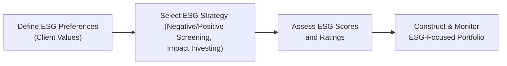

There was a time—several years back—when I was chatting with an ultra-high-net-worth client who was honestly more curious than committed to the idea of “sustainable investing.” He’d say, “I’d love my investments to be environmentally friendly, but let’s be real: does it really matter to my performance?” And you know what? That simple question opened a door to a much bigger discussion about Environmental, Social, and Governance (ESG) integration in private wealth. In effect, we plowed into how these factors impact both risk and return, along with the broader impact on society and the environment. Over the years, ESG has evolved from being a “nice to have” to a “must consider,” especially in private wealth management.

## Why ESG Matters in Private Wealth

ESG investing might look different depending on whom you ask. Some folks are deeply motivated by the idea of reducing carbon emissions—perhaps they watched a documentary on climate change and said, “Enough is enough.” Others might be passionate about improving governance standards in emerging markets or advancing workplace diversity initiatives. Regardless of the spark, the fundamental concept is this: you integrate your personal values into your portfolio, hopefully without sacrificing long-term risk-adjusted returns.

The high-net-worth (HNW) and ultra-high-net-worth communities are increasingly vocal about sustainable investing. They want to see an actual reflection of their values in their investment strategy. So, it’s on us, as wealth managers, to confidently integrate ESG factors into the planning process.

## Core Methods for ESG Integration

It helps to organize the major ESG integration strategies in a simple structure. There are several well-known approaches:

• Negative Screening: Excluding companies or entire industries deemed undesirable (e.g., fossil fuels, tobacco, firearms).  
• Positive Screening: Focusing on companies leading in sustainability metrics or recognized for excellent ESG practices.  
• Impact Investing: Seeking measurable social/environmental benefits while aiming for market-rate (or in some cases concessionary) financial returns.

And, of course, there are hybrids mixing several strategies. Some clients might only want to exclude certain products, while others aim to engage proactively with companies to influence their ESG practices.

Below is a quick comparison table of each main approach.

| Approach            | Key Features                                                 | Example                                       |
|---------------------|-------------------------------------------------------------|-----------------------------------------------|
| Negative Screening  | Exclude undesirable industries or companies                 | Omit tobacco, firearms, or thermal coal       |
| Positive Screening  | Target top ESG performers within each sector                | Invest in companies with strong carbon goals  |
| Impact Investing    | Generate measurable social or environmental outcomes        | Microfinance, green bonds, social housing     |

## The Role of ESG Data and Ratings

Ever notice how you check a company’s price-to-earnings ratio from multiple data providers and get identical results, but look at their ESG score and you might find confusion galore? That’s because ESG ratings vary across providers like MSCI, Sustainalytics, and S&P Global—each uses its own proprietary models, data, and weightings. So, it’s wise to cross-reference several ratings and evaluate the underlying methodology. Particularly in private client portfolios, there’s no universal “one-stop-shop” for ESG data. It’s more of a puzzle you piece together.

### Evaluating Different Rating Methodologies

Try to keep these questions in mind:

• What data sources do they use?  
• How frequently is data updated?  
• Are controversies or negative events factored in real time?  
• Is there a sector bias or is it adjusted to each sector’s material ESG issues?

I’ve had clients raise eyebrows when they see an oil major get an “A” rating in ESG. The rating might be high because the company excels in governance and safety standards compared to its peers. But from the client’s perspective—who might want to see minimal carbon emissions—an oil company leading in governance doesn’t quite fulfill the real intention. That’s why understanding the methodology behind the rating is crucial.

## ESG Disclosure Frameworks: SASB and GRI

Companies are also stepping up their ESG transparency. Frameworks like the Sustainability Accounting Standards Board (SASB) and the Global Reporting Initiative (GRI) have become the go-to guides for disclosure. Essentially, these frameworks map out how companies should report on sustainability topics—it’s a bit like IFRS or GAAP for non-financial data. For instance, SASB focuses heavily on material issues specific to each industry. If you’re analyzing a pharmaceutical company, SASB might prompt them to disclose data on drug pricing or patient access. Meanwhile, GRI can provide a broader overview of societal and environmental impacts.

From a private wealth standpoint, understanding these frameworks helps in evaluating a portfolio’s sustainability profile. If a client invests in, say, a water technology company, and that company aligns with GRI standards, you can more easily assess the credibility of its environmental claims.

## Themes in Sustainable Investing

Some clients want to zero in on specific themes like clean energy, sustainable agriculture, or green real estate. Thematic investing can be a great way to align personal values and convictions with a targeted growth story. For instance, if a client believes the shift to electric vehicles is unstoppable, they might concentrate on battery technology or renewable infrastructure. Thematic approaches are also a natural fit for philanthropic-minded families who like the idea of direct, visible outcomes versus an abstract portfolio of stocks that are “mostly green.”

## The Process of Integrating ESG

While every wealth manager might have a slightly different process, the broad steps are often quite similar. Here’s a simple diagram illustrating the typical process flow:

1. Define ESG Preferences: It starts with discussing the client’s priorities—climate action, corporate governance, worker rights, or any combination.  
2. Select ESG Strategy: Decide which approach (negative screening, positive screening, or impact investing) fits best.  
3. Assess ESG Scores and Ratings: Compare ratings from multiple sources.  
4. Construct & Monitor Portfolio: Build the portfolio to match the chosen ESG criteria. Then track these investments to ensure ongoing alignment with the client’s goals.

Admittedly, the tricky part is balancing these goals with traditional performance and risk considerations. Some portfolios might see short-term volatility if excluded sectors or targeted themes underperform in certain market conditions. Yet, over a longer horizon, numerous studies suggest that well-integrated ESG factors can reduce downside risk and potentially enhance returns.

## Impact on Portfolio Risk and Return

A fundamental question arises: does focusing on sustainable companies compromise returns? The evidence is increasingly pointing to “not necessarily.” Some ESG-friendly companies might outperform precisely because they manage key risks proactively (e.g., environmental liabilities, workplace safety). Remember, though, correlation isn’t causation. Just because many ESG funds have done well in recent bull markets doesn’t guarantee they’ll always outperform. Nonetheless, robust ESG integration can help reduce certain idiosyncratic or event-driven risks.  

In certain sectors, not integrating ESG might be a risk in itself. Think about how quickly the automotive industry is pivoting to electric vehicles. Companies slow to adapt might find themselves losing market share over time. For private wealth clients, it often comes down to matching their tolerance for ESG-related momentum with their risk constraints.

## Real-Life Example: Client Case Study

Let’s say Charlotte is a high-net-worth individual who made her fortune in the tech sector. She’s deeply passionate about carbon neutrality. Her portfolio used to be a broad-based equity index, along with stable real estate holdings. Feeling a bit uneasy about holding large oil & gas positions, she came to me for guidance.

• Step one: We discussed how to remove or underweight top carbon emitters using a negative screening approach.  
• Step two: We introduced a positive tilt, overweighting companies with high environmental scores (like those investing heavily in renewable energy or waste reduction).  
• Step three: For a small portion of her portfolio, we added an impact investing sleeve: green bonds and a private renewable infrastructure fund.  

Within six months, she told me, “I feel so much better that I’m putting my money where my mouth is.” And she’s watched performance remain steady, with volatility in line with her previous exposures. Granted, it’s not a universal outcome— market conditions, sector biases, and management skill factor in—but it’s a great illustration of customizing ESG solutions to meet personal values.

## Common Challenges and Pitfalls

• Greenwashing: Some companies may exaggerate their sustainability credentials or publish incomplete data. Advisors can mitigate this by comparing multiple data sources and verifying third-party audits or certifications.  
• Data Gaps: Not all companies provide robust ESG data (especially in certain emerging markets). You might have to deck out your analysis with alternative sources or direct company engagement.  
• Overexposure to Certain Sectors: Positive screening can lead to sector concentration if most top-rated companies originate in a single industry. Implementation may require diversification methods.  
• Methodological Inconsistency: Each ESG rating provider uses a different approach. Blindly depending on one rating can produce incomplete insights.

## Best Practices for Private Wealth Advisors

• Start with the Client’s Why: Each client’s ESG preference is personal. Understanding motivation is key to ensuring portfolio alignment.  
• Educate on Trade-offs: Some strategies may limit diversification or introduce sector biases. Walk clients through possible trade-offs.  
• Leverage Multiple Data Providers: Don’t get stuck with just one rating system—scrutinize them to ensure consistency or highlight discrepancies.  
• Monitor Continuously: This is not a “set it and forget it” approach. ESG metrics and disclosures evolve quickly, so keep a watchful eye on your holdings.

## Exam Relevance

For Level III exam candidates, ESG-related questions often appear in the context of portfolio construction, performance evaluation, and scenario-based prompts. You might be asked how to incorporate a client’s social concerns into a recommended policy statement or how to evaluate the impact of negative screening on portfolio risk. Be prepared for items focusing on the interplay between client objectives and how these preferences alter the standard asset allocation framework. You could see case vignettes about performance measurement complexities when a portfolio excludes certain industries, or how to propose an impact investing solution that meets a client’s risk-return objectives.

Time management on the constructed-response questions is vital: if you see an ESG-based question, outline your steps quickly: identify the relevant constraints (like negative screening), assess the potential impact on risk/return, then propose a solution aligned with the client’s financial and ethical goals. Show that you understand the nuance behind data sources and rating methodologies, and your answer will likely stand out.

## References and Further Exploration

• “ESG Integration in the Americas, EMEA, and Asia Pacific” – CFA Institute publication.  
• The UN Principles for Responsible Investment (PRI) guidelines: https://www.unpri.org  
• “Sustainable Investing: Revolutions in Theory and Practice,” edited by Herman Bril, Georg Kell, and Andreas Rasche.  
• Global Reporting Initiative (GRI) and Sustainability Accounting Standards Board (SASB) for corporate ESG disclosures.  

## Test Your Knowledge: Integrating ESG and Sustainable Investing Preferences



### Which of the following best describes “negative screening” in ESG investing?

- [x] Excluding companies or industries based on undesirable practices
- [ ] Restricting all investments solely to renewable energy
- [ ] Selecting only companies with the highest environmental scores
- [ ] Selecting funds that adhere to SASB reporting standards

> **Explanation:** Negative screening involves excluding securities of companies or industries deemed objectionable (e.g., tobacco, weapons, high carbon emitters).

### A private wealth client wants to align investments with workplace diversity initiatives. Which ESG integration technique is most appropriate?

- [ ] Negative screening
- [x] Positive screening
- [ ] Short selling high-carbon emitters
- [ ] Buying futures on broad equity indexes

> **Explanation:** Positive screening involves identifying and selecting companies that excel in diversity or other positive ESG metrics.

### What is a primary advantage of using multiple ESG rating providers?

- [ ] It increases the chance of finding a single, unified score.
- [x] It helps address discrepancies and provides a more holistic view of a company’s ESG position.
- [ ] It reduces the time needed to incorporate ESG data.
- [ ] It eliminates the need for client engagement.

> **Explanation:** Different rating providers have distinct methodologies. Using multiple sources can help advisors form a balanced assessment.

### Which statement about impact investing is accurate?

- [ ] It aims solely for financial returns without regard to social outcome.
- [ ] It prohibits investments in frontier markets.
- [x] It seeks measurable social or environmental outcomes alongside financial returns.
- [ ] It only applies to philanthropy efforts and not to for-profit investments.

> **Explanation:** Impact investing targets positive, measurable outcomes in tandem with competitive financial performance.

### A client invests in a global equity fund known for excluding companies with carbon-intensive business models. This is an example of:

- [x] Negative screening
- [ ] Positive screening
- [x] Applying a thematic approach
- [ ] Engaging in short-selling strategies

> **Explanation:** By excluding carbon-intensive businesses, the fund is using negative screening. Additionally, the focus on lower carbon intensity can be seen as thematic.

### What is one challenge of thematic ESG investing?

- [x] Potential sector or industry concentration
- [ ] Guarantee of lower risk and higher returns
- [ ] Limited alignment with clients’ values
- [ ] Inability to adjust weightings within the portfolio

> **Explanation:** Thematic investing can concentrate capital in certain themes or sectors (e.g., clean energy), potentially increasing exposure to sector-specific risks.

### How might an investor mitigate the risk of “greenwashing”?

- [x] Cross-verify a firm’s sustainability claims and third-party ESG ratings
- [ ] Rely exclusively on the firm’s own sustainability reports
- [x] Use only negative screening strategies
- [ ] Avoid large-cap companies

> **Explanation:** Greenwashing occurs when firms superficially or falsely claim green credentials. Investors reduce this risk by comparing multiple data sources and certifications.

### Which ESG framework focuses on industry-specific material factors?

- [x] SASB (Sustainability Accounting Standards Board)
- [ ] GRI (Global Reporting Initiative)
- [ ] IFRS (International Financial Reporting Standards)
- [ ] ISO 9001

> **Explanation:** SASB details material ESG topics by industry. GRI also provides guidance but is broader and less industry-specific.

### In a private wealth context, which is a typical first step in constructing an ESG-focused portfolio?

- [x] Clarify the client’s specific ESG preferences and objectives
- [ ] Immediately purchase green bonds
- [ ] Implement short-selling strategies in heavy-polluting industries
- [ ] Review historical equity market performance

> **Explanation:** The foundation of any ESG-oriented portfolio is defining what matters most to the client—environmental concerns, social causes, or governance issues.

### For the CFA Level III exam, a realistic ESG-related question might ask:

- [x] How to integrate a client’s ethical concerns into the investment policy statement
- [ ] Why short-term sentiment is irrelevant for ESG
- [ ] Whether antique collectibles are real assets
- [ ] The formula for margin call prices in a currency swap

> **Explanation:** ESG is often tested in the context of formulating or adjusting a portfolio’s policy statement to reflect the client’s values.


