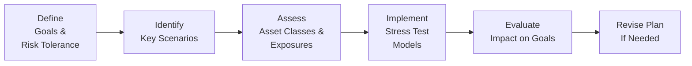

**Understanding the Purpose of Scenario Analysis and Stress Testing**  
You know, sometimes life throws curveballs—like a sudden market crash, a dramatic jump in interest rates, or unexpected policy changes that threaten your entire financial plan. In those moments, wouldn’t it be awesome to say, “Well, I’ve already tested for that scenario!”? Scenario analysis and stress testing are precisely about doing this: they give you a peak behind the curtain so that you can explore how your portfolio or overall wealth plan would react under different conditions—even the nasty ones. In the context of private wealth, it’s not just the market factors that matter; it’s stuff like losing a key income source, dealing with abrupt changes in estate tax policy, or encountering a serious family emergency.

**Scenario analysis** is a process where you create hypothetical situations—like a bear market, a commodity price surge, or a geopolitical crisis—and then assess how your wealth plan would fare in each. **Stress testing** cranks the volume up even further, pushing your plan to extremes. For instance, imagine simulating a 40% market downturn combined with a massive jump in unemployment and a liquidity freeze. Stress tests show where you might be vulnerable so that you can take steps to protect yourself now, rather than scramble when it’s too late.

This section examines how scenario analysis and stress testing fit into a broader private wealth plan, especially in conjunction with goals-based financial planning, multi-generational frameworks, and asset protection strategies. After reading this, you’ll see why these tools are so pivotal to preserving and growing your wealth, even when the market or personal circumstances take an unexpected turn.

  
**Key Differences in Private Wealth Context**  
While both institutional and private wealth managers use scenario analysis and stress testing, there are some unique twists in the private wealth realm:

• You’re not just worried about a fund’s beta or alpha. You’re worried about your family’s vacation home, college tuition, philanthropic obligations, or a family business that could face operational hiccups.  
• Private wealth stress testing frequently integrates personal risk events, like major health care costs or a sudden cessation of business revenue.  
• Estate taxes, trust structures, and philanthropic commitments can also be included, reflecting the complexities that come with high-net-worth and ultra-high-net-worth households.  

In other words, the private wealth angle demands a more tailored, individualized approach—no single scenario fits all family structures or estate complexities.

  
**Scenario Analysis: A Systematic Approach**  
At its core, scenario analysis is about constructing plausible situations and evaluating how the financial plan behaves. Here’s a personal anecdote: A friend of mine who retired early went through a scenario analysis that assumed a background of moderate inflation. Then, reality came along and gave them severe inflation plus a slowdown in his small consulting business. Did the plan survive? Barely—because he had at least tested for something that somewhat resembled a worst-case. The moral is that you want your hypothetical exercises to be both diverse and intense enough to cover the unexpected.

Here are the main steps:

1. **Identify Relevant Factors:** For private wealth, it might be market-driven factors (equity crashes, credit squeezes) or personal events (marriage, divorce, health emergencies).  
2. **Determine the Severity:** Decide how dramatic the scenario should be. It might be a mild recession or a repeat of something like the 2008–2009 global financial crisis.  
3. **Project Impact:** Estimate how these changes affect different assets—equities, bonds, real estate, private businesses—and also how they affect your personal goals. For instance, do you have enough liquidity to ride out a downturn without selling assets in a fire sale?  
4. **Evaluate the Financial Plan:** If the scenario plays out, do you still manage college tuition or philanthropic pledges? Do you have to postpone some life goals, like retirement by a few years?  
5. **Revisit Strategies:** Based on the outcomes, consider changes to risk allocation, contingency funds, or insurance coverage.  

  
**Historical vs. Forward-Looking Scenarios**  
Markets often rhyme—maybe they don’t repeat exactly, but they do sometimes produce patterns reminiscent of past crises or booms. And then again, reality can surprise us in ways the past never envisioned (looking at you, global pandemic).

• **Historical Event-Based Scenarios:** These rely on actual episodes. Think “company performance during the 2008 meltdown,” or “household liquidity if confronted with 2020-like lockdowns.” The advantage? You get real data for calibrating your model. If your wealth plan can weather the storms of 2008 or the COVID-19 shock, that’s a good start.  
• **Forward-Looking Scenarios:** Where historical scenarios end, creative hypothetical ones begin. What if a new technology disrupts an entire sector where you have large equity exposure? What if climate change triggers new taxes on carbon-intensive industries and you’re heavily invested in them? These scenarios are trickier to define precisely, but they help you plan for emerging risks that lack direct historical precedent.

Balancing both types is essential: historical scenarios help you learn from real-world data, while forward-looking scenarios ensure you’re not stuck fighting the last war.

  
**Stress Testing: Pushing to the Extremes**  
Stress testing goes beyond typical scenario analysis by focusing on tail events. These could be catastrophic market crashes—a 50% drop in equity markets, an overnight 20% currency devaluation—or life-altering personal events like a huge uninsured medical bill on top of a real estate collapse. The math can get intense if you start layering multiple extreme assumptions (like inflation surges to 10% at the same time that a family business halts distributions). 

A typical stress test might look like this:  
• Equities fall 40% in six months.  
• Corporate bonds see severe downgrades, losing 15–20% in value.  
• Real estate valuations slip by 25%.  
• Personal income drops by 50% due to job loss or a big business slowdown.  
• Estate tax rates jump unexpectedly due to legislative change.  

Then you measure the ramifications for your net worth, ability to meet ongoing liabilities, and your overall legacy planning. It’s not exactly a cheerful exercise, but it is necessary. Sometimes, the most valuable insights come from these gloomier scenarios.

  
**Tail Risk and Importance of Hedging**  
Tail risk pertains to the probability of rare, extreme outcomes. To see why this matters, think about living through a black swan event such as a rapid political coup in a major economy that your portfolio is tied to. Standard deviation might say that such an event is highly unlikely, but if it occurs, it’s game over for your plan—unless you’ve prepared.

• **Portfolio Diversification:** Spread risk across various asset classes and geographies. This helps mitigate the self-reinforcing doom effect of correlated assets all dropping together.  
• **Derivatives and Hedging:** Some private clients use protective puts on equity positions or hedge currency exposures. These might come with costs, but they can be invaluable in tail scenarios.  
• **Planning for Liquidity:** Keeping enough cash or liquid reserves can help you avoid forced liquidations at terrible prices.  

  
**Integrating Personal Cash Flow Events**  
In high-net-worth households, personal cash flow events can be as disruptive as market events—or even more so. Some examples:

• **Sudden Loss of a Key Job:** Let’s say the primary breadwinner loses their executive position and, due to an economic downturn, can’t find new employment for over a year. Sure, severance helps, but are the contingencies enough to sustain the family’s lifestyle?  
• **Medical Emergency or Disability:** Health can overshadow everything else. If a private business relies on you, a disability could cause both personal and business-income hits.  
• **Inheritances and Estate Tax Surprises:** Scenario analysis might factor in new estate tax legislation that significantly reduces the exemptions for passing wealth on.  

Stress testing for personal cash flows can involve layering a decline in business revenue or salary on top of a capital market stress—this can get brutal, but forewarned is forearmed.

  
**Documenting Rationale and Results**  
So, you run all these scenarios… but what then? A thorough private wealth plan records the assumptions, results, and recommended actions arising from each scenario. This fosters transparency—especially if you have multiple family members or co-advisors. When the market does take a weird turn, you can revisit your documented scenario analysis to see how your plan was supposed to respond. Did you plan for exactly this sort of event? Are you following the remedial steps you laid out?

Clients often gain comfort from reading the summary of scenario analyses. Even if it’s bad news, at least they understand the plan’s vulnerabilities and can weigh in on how much risk they’re willing to accept. This sense of buy-in can be important for families, especially those where multiple generations participate in decisions.

  
**Updating Scenarios Regularly**  
Markets change, families evolve, regulations shift. Scenarios from three years ago might be obsolete if your family business has pivoted, or if your portfolio is now heavily in alternative investments. Or maybe a new regulatory environment is in place. Updating the scenario library at least annually, or whenever a big life or market event happens, helps ensure you don’t carry around stale assumptions. 

If in 2025 you’re preparing for high inflation and, ironically, we slip back into a deflationary environment, your scenario set needs to reflect that pivot. On the personal side, if your child’s college acceptance includes scholarships reducing your out-of-pocket expense, that changes the stress test on your liquidity.

  
**Refining Risk Mitigation Strategies**  
After you’ve identified potential weak spots, the question is: how to fix them? For many, the solution involves at least one of these:

• **Diversification:** If you discover that 70% of your net worth is tied up in a single industry, you might shift toward a broader set of assets.  
• **Insurance and Annuities:** Sometimes the best risk transfers are accomplished with products like life insurance or annuities that guarantee certain payouts.  
• **Hedging Tools:** Currency hedges, interest rate swaps, or equity puts can protect principal in specific tail scenarios.  
• **Trust Structures and Asset Protection:** For families worried about lawsuits or estate disruptions, trusts can ring-fence assets, albeit with complexity and cost.  
• **Adjusting Leverage:** If a stress test reveals that a margin call in a downturn might devastate you, it may be time to reduce leverage.  

  
**Mermaid Diagram of the Process**  
Below is a quick, visual summary of the scenario analysis and stress testing process. Think of it as the blueprint for how you might systematically test (and retest) your wealth plan.

  
**Implementation Example: Case Study**  
Imagine a successful entrepreneur, Sarah, who sold her tech startup and invested the proceeds into a diversified portfolio: 50% in equities (dominated by tech growth funds), 30% in real estate, and 20% in fixed income. Part of her wealth is also locked up in a multi-year earnout from the company sale. She’s single, but she has obligations to aging parents and philanthropic interests.

• **Scenario 1 – Mild Recession:** Equities drop 15%, real estate dips 10%, but parents’ medical costs spike. Analysis shows that with minor portfolio adjustments, her philanthropic goals won’t be jeopardized. She reduces discretionary expenses and draws modestly from a cash reserve.  
• **Scenario 2 – Major Tech Crash + Rising Interest Rates:** Tech equities drop 40%, real estate is hammered by higher rates, down 25%. The contraction triggers layoffs, so her parents might need extra support. The stress test shows Sarah may need to trim philanthropic contributions for 2–3 years unless she sells illiquid assets at a discount. Her biggest vulnerability is the concentration in tech growth funds, so the recommended fix is to shift part of that equity exposure into broader markets or even consider hedging.  
• **Scenario 3 – Personal Health Crisis + Real Estate Downturn:** Sarah is temporarily disabled and can’t earn additional income. Meanwhile, property values fall 20%, and the yield on her rental properties declines. This scenario reveals that Sarah’s disability insurance coverage is insufficient. She also needs to maintain a bigger liquidity buffer to cover her parent’s expenses.  

From these findings, she decides to:  
1. Purchase additional disability coverage.  
2. Shift some equity holdings from purely tech growth into more balanced funds.  
3. Build a cash reserve equal to 12 months of personal and parental care expenses.  

  
**Incorporating ESG and Sustainable Investment Preferences**  
Sometimes, scenario analysis can also consider ESG or sustainable investment angles. For instance, if you foresee a future where the government strongly penalizes companies with large carbon footprints, you might want to run a forward-looking scenario that sees a carbon tax severely impacting your portfolio. Or if water scarcity becomes a major policy issue, certain agricultural or industrial bonds might be at risk. By integrating such ESG scenarios into your private wealth plan, you stay ahead of potential value erosion or reputational risks.

  
**Common Pitfalls**  
Let’s face it: scenario analysis and stress testing aren’t crystal balls. People often misestimate probabilities, or they select only a handful of relatively comforting scenarios. Here are some typical missteps to avoid:

• **Overconfidence in Historical Patterns:** Just because we saw a 40% crash in one crisis doesn’t mean the next crisis won’t be 60%.  
• **Ignoring Correlated Risks:** A meltdown in equity might coincide with real estate declines or job losses. Considering each in isolation underestimates overall risk.  
• **Failing to Update Assumptions:** If you tested for a 5% inflation scenario but inflation is hitting 9%, that old scenario analysis might be worthless.  
• **Forgetting Personal Liabilities:** The best-protected portfolio in the world is still at risk if a personal lawsuit or family emergency drains liquidity.  

  
**Practical Steps for Private Wealth Clients**  
1. **Outline Core Goals:** Identify your main financial obligations and aspirations—like retirement, philanthropic giving, estate distributions, or supporting family members.  
2. **Gather Data:** Consolidate all portfolio details across equities, fixed income, alternatives, real estate, and private businesses.  
3. **Brainstorm Scenarios:** Evaluate both historical events (2008–2009 meltdown, COVID-19 shock) and forward-looking ones (climate disruptions, new taxes, or unexpected geopolitical tensions).  
4. **Run Simulations:** Use either a sophisticated tool or work with your advisor to simulate market and personal events.  
5. **Interpret Results:** Look at how your net worth, cash flow, and ability to meet goals hold up.  
6. **Adjust Strategies:** If the plan fails in certain conditions, consider risk mitigation, rebalancing, extra insurance coverage, or building a larger emergency fund.  
7. **Document & Communicate:** Write down assumptions, results, and recommended actions. Share them with relevant family members or trustees.  
8. **Review Periodically:** At least once a year or after significant market or personal changes, revisit the scenarios and stress tests.

  
**Link to Goals-Based Financial Planning**  
Earlier in this chapter, we discussed goals-based planning. Stress tests and scenario analyses closely tie in here: if your number-one goal is to purchase a retirement home by age 60, you should test scenarios that might derail that plan—like a big market dip when you’re 59 or a surge in property prices that outstrips your savings rate. Goals-based planning can also help you prioritize. If results show that both your philanthropic goals and living expenses can’t be sustained in a crash, you might choose to reduce philanthropic outlays for a period rather than sacrifice essential living costs.

  
**Brief Note on Documentation and Regulatory Aspects**  
Different jurisdictions have varying requirements for how financial advisors document scenario analysis and stress testing. In some places, regulatory bodies encourage these exercises to ensure investors (particularly high-net-worth individuals) are fully aware of potential downside outcomes. Generally, though, robust justification of assumptions and clear communication with clients is seen as industry best practice, aligning with fiduciary duties to act in the client’s best interest.

  
**Integration with the Broader Wealth Planning Framework**  
Scenario analysis and stress testing don’t live in isolation. They support the decisions you make in tax planning, trust structures, insurance, and philanthropic giving—topics covered in the other segments of this Wealth Planning chapter. By systematically analyzing “what could go wrong,” you can refine not just your investment strategies but also decisions about entity structures, cross-border arrangements, or generational transfers. 

  
**Small Reminder**  
Well, it’s easy to get lost in the gloom and doom. But scenario analysis is about empowerment, not paranoia. By running these tests, you can sleep better at night, knowing you’ve at least contemplated the scary stuff—and you have an action plan if it comes knocking at your door.

  
**Exam Tips and Key Takeaways**  
• **Focus on Tail Risk:** The Level III exam might include scenario-based questions where you have to evaluate how a private wealth client weathers extreme conditions. Practice explaining how correlations change in tail scenarios and how to mitigate those risks.  
• **Integration with Behavioral Finance:** Remember that emotional or psychological biases can influence how a client perceives risk. The exam might ask about how to communicate scenario results effectively to maintain client buy-in.  
• **Numerical Illustrations:** You may see item set questions where you plug in scenario data—like applying a 30% equity drawdown, projecting new portfolio values, and deciding on the next steps.  
• **Ethical Considerations:** Always document assumptions thoroughly. Hiding potential negative outcomes could breach fiduciary responsibilities. Expect exam vignettes that test this aspect.  
• **Time Management in Constructed Response:** If a scenario question is multi-part, structure your answers to address each step: define assumptions, state calculations, interpret results, and propose solutions. Don’t bury the recommended solution under excessive math details—the exam often wants your recommended course of action.  

  
**References for Further Exploration**  
• Bellini, Tiziano. “Stress Testing and Risk Integration in Banks.” While focused on banking, a great conceptual framework for scenario analysis, easily adaptable to private wealth contexts.  
• “Financial Enterprises and Risk Management,” relevant sections of the CFA Institute Curriculum; focuses on scenario planning from a broad perspective but includes insights valuable to private wealth management.  
• The Journal of Wealth Management: Check out various case studies analyzing investor behavior under stressed market conditions.  
• Basel Committee on Banking Supervision Publications on Stress Testing: Although aimed at financial institutions, the underlying methods can be tweaked for private portfolios.

  
**Glossary**  
• **Stress Testing:** Evaluates how a portfolio or plan would handle extreme, adverse events that push beyond typical market conditions.  
• **Tail Risk:** Rare events on the extremes of probability distributions that can have severe financial impacts.  
• **Historical Scenarios:** Model future outcomes by reflecting actual past crises or market disruptions.  
• **Forward-Looking Scenarios:** Form hypothetical situations not observed historically but deemed plausible.  
• **Diversification:** A risk management strategy distributing investments across different assets or sectors.  

---

## Assessing Extreme Risks in Private Wealth: Scenario Analysis and Stress Testing Quiz



### Which best describes the main goal of scenario analysis in private wealth planning?

- [ ] Maximizing short-term portfolio returns
- [x] Evaluating portfolio performance under hypothetical conditions
- [ ] Ensuring 100% risk-free assets
- [ ] Minimizing the variance at any cost

> **Explanation:** Scenario analysis aims to assess how your wealth plan would hold up under various hypothetical conditions—like recessions, inflation spikes, or personal cash flow interruptions—rather than purely maximizing short-term returns or eliminating all risks.

### Which scenario type focuses on unobserved, but plausible future challenges?

- [ ] Correlation-based scenarios
- [ ] Historical event-based scenarios
- [x] Forward-looking scenarios
- [ ] 60-40 portfolio assumptions

> **Explanation:** Forward-looking scenarios project potential events not yet experienced but considered realistic. Historical event-based scenarios leverage past data to simulate future outcomes.

### Why is stress testing particularly relevant for private clients?

- [ ] Private clients have no exposure to public markets.
- [ ] They have low risk tolerance by definition.
- [x] Extreme personal events (e.g., health issues, job loss) can compound market shocks.
- [ ] Regulations require annual updates for individual investors only.

> **Explanation:** Stress tests for private clients often incorporate personal events like job losses, business slowdowns, or medical emergencies, which can amplify market-driven risks.

### A scenario that includes a 50% drop in equity markets plus a sudden increase in personal liabilities is an example of:

- [x] A tail risk stress test
- [ ] A mild recession scenario
- [ ] A positive scenario for bond investments
- [ ] A historical volatility simulation

> **Explanation:** When equity markets drop significantly, combined with a personal financial twist, we are dealing with a severe or "tail risk" stress event.

### Why is documentation of assumptions and outcomes critical in stress testing?

- [x] It fosters transparency and client buy-in.
- [x] It ensures consistent reference for future updates.
- [ ] It is mandatory in all global jurisdictions.
- [ ] It locks in the portfolio composition permanently.

> **Explanation:** Two correct answers: Documenting assumptions and results is crucial for transparency, enabling stakeholders to understand the rationale behind adjustments. It also creates a reference point for future reviews, even though not every jurisdiction mandates it.

### What is a common pitfall when constructing scenario analyses?

- [ ] Using forward-looking events only
- [x] Relying solely on historical data without considering new risks
- [ ] Engaging third-party advisors for diverse viewpoints
- [ ] Communicating assumptions to all family members

> **Explanation:** Overreliance on historical data may ignore future risks that do not mirror past patterns.

### Which of the following steps generally occurs first in the scenario analysis workflow?

- [x] Defining client goals and risk tolerance
- [ ] Implementing hedging strategies
- [ ] Evaluating the impact of each hypothetical shock
- [ ] Documenting results

> **Explanation:** The initial step is understanding what the client wants to achieve and how much risk they can tolerate before identifying scenarios or solutions.

### In constructing a forward-looking stress test for a high-net-worth client, which factor is most likely included?

- [ ] A replay of the 2008 financial crisis
- [ ] Market performance data from the 1970s
- [ ] Irrelevant scenarios not tied to the client's holdings
- [x] A proposed new tax regulation impacting estate taxes

> **Explanation:** Forward-looking stress tests incorporate potential changes (e.g., new tax policy), distinct from relying on historical crises or unrelated market data.

### A stress test reveals that a client’s retirement plans might be derailed by a perfect storm: a crashing real estate market and unexpectedly high medical costs. What could be an immediate recommendation?

- [ ] Cancel all insurance policies
- [x] Increase emergency liquidity and review insurance coverage
- [ ] Shift equity holdings fully into tech growth stocks
- [ ] Ignore the results; they're unrealistic

> **Explanation:** Combining additional liquidity reserves with better insurance coverage is a typical action to reduce vulnerability to worst-case scenarios.

### True or False: Stress testing for private wealth should only consider market factors such as stock market crashes or interest rate spikes.

- [ ] False
- [x] True

> **Explanation:** This statement is actually reversed. It's false that you should only consider market factors. Private wealth stress tests must also include personal factors like business failure, estate tax changes, or serious family medical events.


