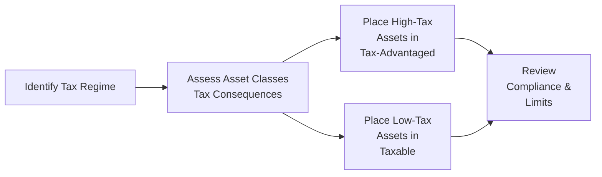

## Introduction

So you’ve painstakingly built a great portfolio—diversified across equities, bonds, real assets, maybe even alternatives. And then, come tax season, you realize a large chunk of those gains just vanished into government coffers. Frustrating, right? Well, you’re not alone. Plenty of high-net-worth individuals discover that taxes can be one of the biggest factors eroding hard-earned returns. 

In investment planning for private wealth management, mastering how to manage taxes (legally, of course) can have a big impact on long-term performance. Let’s explore how to handle the demands of different tax regimes, place assets strategically, and integrate tax planning into everything from estate structure to capital gains harvesting. By the end, you’ll have a decent toolkit for flexible, tax-aware investing—while still meeting other critical goals like growth, liquidity, and risk management.

## Impact of Tax Regimes on Investments

Every country—and sometimes every state or province—brings its own unique spin on taxing income, dividends, capital gains, and sometimes intangible wealth or inheritance. Honestly, it can feel like a maze. But we can think of it this way: the tax regime shapes the net return of each asset class and account type.

• Local, State/Provincial, and National Taxes  
  Different rates for local or state taxes can add an additional layer on top of national taxes. For instance, in some places, you might pay 10% in local tax and 20% in federal tax on your capital gains. In other regions, local or provincial taxes may not extend to investment income at all. Even though these details can get complicated, an investor should always consider the total effective tax rate on each type of income.

• Differing Treatment of Various Asset Classes  
  Equities and bonds can be taxed differently: bond interest might be taxed as ordinary income, whereas equities might benefit from lower capital gains rates (especially for long-term holdings). Real estate might have unique depreciation provisions or property tax structures, and so on. The key is to identify which asset classes benefit from favorable short- or long-term treatment.

• The Role of Tax-Advantaged Accounts  
  Many jurisdictions offer special accounts—think of a Roth IRA or a similar vehicle in other countries—where your gains can either grow tax-deferred or tax-free. Bonds, private equity, and other higher-yield instruments often make great candidates for these accounts, because the high interest or dividends won’t get nibbled away by annual taxes. But keep in mind that contribution limits and withdrawal rules may restrict how much and how often you can invest and access funds.

In short, you have to know your tax environment, which might shift frequently with legislative changes. When building a wealth plan, factor in the possibility of shifting tax structures over time. 

## Tax-Sensitive Asset Placement

Tax-sensitive asset placement (sometimes called asset location) is about putting the right investments in the right accounts. Essentially, bracket your assets to align with the tax advantage of the account.

• Placing High-Yield or High-Turnover Assets in Tax-Advantaged Accounts  
  Imagine you have an active equity strategy with frequent trades generating short-term gains. Or you have high-yield bonds throwing off lots of interest income. You probably want to house them in a retirement account or an insurance-wrapped product if you can. Why? Because otherwise you’d be paying taxes each time you collect your income or realize a short-term gain. By using a tax-advantaged structure, you shield yourself from immediate taxes, letting those gains compound more effectively.  

• Keeping Tax-Efficient Strategies in Taxable Accounts  
  Maybe you also have a passive equity index fund with low turnover. Or perhaps you hold equities that you intend to hold for a long horizon—say 10 to 15 years. These produce minimal taxable events in the short run, so you wouldn’t necessarily need to prioritize them for a tax-sheltered account. The idea is you pay lower capital gains rates or you just don’t realize large gains frequently. That’s why it makes more sense to keep them in a taxable account, freeing up the limited space in your tax-deferred vehicle for your higher-yield, higher-turnover assets.

Anyway, this is a classic puzzle we see for high-net-worth households: which assets to shelter, which to keep in taxable. But get it right, and you often see a significant improvement in after-tax returns.

Here’s a brief flowchart that conceptualizes the asset placement idea:

## Harvesting Gains and Losses

Tax-loss harvesting is one of those strategies that can sound a bit magical: “Wait, you’re telling me I can profit from losses?” Well, not exactly, but it can help reduce your current tax liability if used correctly.

• The Core Idea  
  If you have appreciated positions, you might realize some capital gains. However, if you harvest losses in underperforming securities at the same time, you can offset those gains, effectively lowering your taxable income. This can be especially beneficial if you expect higher-than-average capital gains in a given year. 

• Regular Reviews  
  I once saw a client’s portfolio that had a bunch of losing positions from a sector downturn. By systematically booking those losses to offset realized gains from other equities, the client shaved a good chunk off their tax bill. But you can’t just do it once; revisit your positions regularly. And watch out for “wash sale” or “superficially identical” sale rules, which disallow the tax loss if you buy back the same (or very similar) security within a restricted window (often 30 days before or after the sale in many jurisdictions).  

• Avoid Over-Focus  
  Although tax-loss harvesting is powerful, you don’t want to chase losses just to harvest them. Keep your portfolio aligned with your broader strategy. Focus on the big picture—diversification, overall performance, liquidity. The short-term tax break won’t be worth drifting from your fundamental plan or taking on too much risk.

## Structuring Investments for Estate or Intergenerational Transfers

If your wealth plan includes passing assets along to future generations (and for many high-net-worth families, it does), then consider how tax strategies blend with estate planning. 

• Deferring or Mitigating Taxes for Beneficiaries  
  Certain trust vehicles help postpone or reduce tax liabilities. For example, some jurisdictions allow you to create irrevocable trusts that hold family investments and manage taxes more efficiently than if those investments were owned by individuals directly. Some families use insurance products—like life insurance policies held within a trust—to pass along part of their wealth minus certain estate taxes.

• The Role of Stepped-Up Cost Basis  
  In many jurisdictions—though not all—heirs receive inherited assets at their fair market value on the date of the benefactor’s death. This “step-up” can dramatically lower the capital gains tax they might owe if they later sell that asset. For instance, if you bought shares at $10 each, and they’re worth $100 at your passing, your heirs’ cost basis might become $100, meaning minimal or no capital gains tax on subsequent sales above that new amount. That’s a big tax advantage. But, it’s also constantly in legislative crosshairs in certain regions, so keep an eye on any changes.

• Aligning Estate Transfers with Lifetime Gifts  
  Estate planning is closely linked with your lifetime gifting strategy if you want to shift wealth without incurring big taxes. As always, the best solutions are highly dependent on local rules, so working with professional estate planning counsel is essential.

## International Taxation Considerations

These days, clients might have multiple passports, properties abroad, or significant cross-border holdings. If that’s you, you know the tangle is real. Each country can have its own approach to withholding, capital gains, inheritance, property, and transaction taxes. So what do you look for?

• Withholding Taxes and Double Taxation Treaties  
  If you hold foreign stocks, you might encounter withholding taxes on dividends or interest. Lucky for you, many nations have double taxation treaties to help mitigate paying taxes twice—once in the country of source and once in your home country. Learn about foreign tax credits, which can offset some (sometimes all) of the taxes withheld abroad.  

• Changing Regulations  
  Keep your ear to the ground for new treaties or amendments to existing ones. Laws regarding foreign account reporting are also in flux. If you’re a dual citizen, you might owe comprehensive taxes in multiple nations (like how U.S. citizens owe taxes on worldwide income, no matter where they live).  
  In other words, internationally oriented clients need not only an investment strategy but also a robust plan to handle cross-border complexity.

## Tax Efficiency vs. Other Objectives

Sure, you might want to slash your tax bill. But not at the expense of stability, diversification, or liquidity. I’ve seen families hold onto real estate or heavily concentrated equity positions purely to avoid paying capital gains tax, even when they should’ve spread that risk around. Their portfolio got stuck from a risk perspective. Maybe that’s not the best plan. 

• Don’t Let Tax Minimization Override Prudent Allocation  
  The ultimate yardstick for your portfolio should be after-tax, risk-adjusted performance that aligns with your personal goals. If you desperately cling to an underperforming position just to avoid paying taxes, you might be costing yourself greater returns (or greater peace of mind).  

• Use After-Tax Performance as a Key Measure  
  It’s easy to talk about nominal returns, but net-of-fees and net-of-taxes are the real metrics that matter. Compare different strategies on the same after-tax basis to get a clearer picture of which approach genuinely meets your needs.

## Key Glossary

Tax-Advantaged Accounts  
Accounts designed to offer tax benefits such as deferred or tax-free growth (IRAs, Roth IRAs, or their equivalents in other countries). 

Tax-Loss Harvesting  
A strategy in which investors sell securities at a loss to offset realized capital gains, thereby reducing current tax liabilities. 

Wash Sale Rule  
A regulation disallowing the tax loss if you repurchase the same or a substantially identical security within a restricted time period. 

Capital Gains Tax  
A tax on the profit realized when you sell a non-inventory asset—like stocks or real estate—for more than its purchase price.

Withholding Tax  
A portion of income withheld by the payer (e.g., dividend-paying company) and remitted directly to the government as an advance payment of the final tax obligation.

## Final Tips for the Exam

• Familiarize Yourself with Multiple Tax Environments: Even if you primarily operate in a single region, the CFA exam might feature scenarios from multiple jurisdictions.  
• Pay Attention to “Residence vs. Source” Issues: Understand how cross-border treaties and tax credits come into play for internationally mobile clients.  
• Master Common Tax Strategies: Be prepared to illustrate how tax-loss harvesting, tax-sensitive asset placement, and leveraging stepped-up basis can enhance after-tax returns.  
• Use Clear, Step-by-Step Logic: On the exam, show you can prioritize certain assets for tax-advantaged accounts and rationalize your choices.  
• Watch Out for Behavioral Pitfalls: A client’s emotional reluctance to “pay taxes” can lead to heavy concentration risk in their portfolio.  
• Time Management: For essay (constructed response) questions, they might present a scenario about an investor’s tax rates, current holdings, possible rebalancing moves. Walk systematically through each step to demonstrate your reasoning clearly.

## References & Further Reading

• Poterba, James. “Taxation, Risk-Taking, and Household Portfolio Behavior,” American Economic Review.  
• IRS Publication 550 (for U.S. investors), available at:  
  https://www.irs.gov  
• “Tax-Efficient Investing for High Net Worth Individuals,” Journal of Wealth Management.  

----------------------------------------------------------------------------

## Test Your Knowledge: Tax Efficiency and Tax Management Strategies



### Which of the following best describes the rationale for placing high-yield bond funds in tax-advantaged accounts?

- [ ] They are the only assets that generate tax-deductible losses.  
- [x] They generate regular interest income subject to ordinary tax rates, so sheltering them reduces annual tax liabilities.  
- [ ] They are exempt from capital gains taxes, so it’s pointless to shelter them.  
- [ ] They always grow more slowly, so they are best kept in taxed accounts.  

> **Explanation:** High-yield bond funds typically produce frequent, substantial interest income taxed at ordinary income rates in many jurisdictions. By housing them in tax-advantaged vehicles, you minimize ongoing tax drags.

---

### What is the primary purpose of tax-loss harvesting?

- [ ] Increase your portfolio’s gross return.  
- [ ] Minimize your tracking error relative to a broad market index.  
- [x] Offset realized capital gains to reduce current income tax liabilities.  
- [ ] Generate guaranteed outperformance.  

> **Explanation:** Tax-loss harvesting involves realizing losses to offset gains, thus reducing the taxable portion of your gains. It doesn’t inherently boost gross returns.

---

### A client wants to avoid selling a highly appreciated stock despite its risk. Which is the ideal argument for why tax should not be the only factor?

- [x] Overconcentration risk might lead to greater long-term losses than paying the capital gains tax now.  
- [ ] The government frowns upon holding appreciated stocks.  
- [ ] Diversification is irrelevant if the stock is performing well.  
- [ ] A high paying dividend always offsets the tax cost.  

> **Explanation:** Focusing narrowly on avoiding capital gains taxes can lead to dangerous concentration risk. Paying some taxes now can be more beneficial than facing serious downside risk if the stock price falls.

---

### Which statement is most accurate regarding stepped-up cost basis?

- [x] It resets the depletion basis to the market value at the time of inheritance, effectively reducing future capital gain exposure.  
- [ ] It permanently eliminates estate taxes for all future heirs.  
- [ ] It applies only to short-term capital gains.  
- [ ] It allows heirs to deduct all unrealized gains for income tax purposes.  

> **Explanation:** Under a stepped-up basis, heirs inherit assets at the fair market value at the decedent’s date of death, reducing their tax liability on future sales.

---

### Which of the following is a key consideration for cross-border or dual-citizen clients?

- [x] Double taxation treaties that may reduce overall withholding amounts.  
- [ ] The irrelevance of local tax regimes.  
- [ ] Complete freedom to deduct foreign taxes from domestic employment income.  
- [ ] That foreign capital gains are never taxed.  

> **Explanation:** Cross-border investors face potential double taxation but can benefit from treaties that mitigate this. They must carefully navigate withholding taxes and reclaim them via foreign tax credits where possible.

---

### Which of the following assets is typically considered most suitable for a taxable account?

- [ ] A hedge fund with frequent short-term capital gains.  
- [ ] A high-yield bond paying monthly interest.  
- [x] A diversified equity index fund with low turnover.  
- [ ] An actively managed small-cap fund generating short-term trades.  

> **Explanation:** A low-turnover equity index fund typically incurs fewer immediate tax events, making it very tax-efficient for a taxable account.

---

### What is an example of a pitfall when prioritizing tax efficiency above all else?

- [x] Overlooking liquidity needs and creating a mismatch if funds are locked up.  
- [ ] Buying dividend-paying stocks in a tax-sheltered account.  
- [ ] Owning real estate outright instead of through a trust.  
- [ ] Opting for international securities that do not pay dividends.  

> **Explanation:** Sometimes investors who obsess over taxes forget about liquidity or other financial goals. If you lock up funds too rigidly simply to avoid taxes, you can restrict your spending flexibility.

---

### If a client realizes a loss but repurchases a “substantially identical” security within the restricted window, which regulation typically disallows the loss?

- [ ] The Beta-Averaging Rule.  
- [x] The Wash Sale Rule.  
- [ ] The Capital Gains Exclusion Rule.  
- [ ] The Super Dividend Rule.  

> **Explanation:** The Wash Sale Rule disallows claiming a tax loss if you repurchase the same or a substantially equivalent asset within a designated time frame (often 30 days before or after the sale).

---

### In managing internationally diversified portfolios, which of the following is typically advised to minimize tax drag across various geographies?

- [ ] Avoid investing in any foreign securities entirely.  
- [x] Monitor withholding rates, use foreign tax credits, and adhere to local regulations.  
- [ ] Only invest in emerging markets, as they don’t withhold taxes.  
- [ ] Convert all foreign dividends into crypto before repatriating them.  

> **Explanation:** Minimizing tax drag in cross-border investments often involves analyzing treaties, working with foreign tax credits, and aligning investments with local withholding laws.

---

### A critical best practice when measuring performance in a tax-managed portfolio is:

- [x] Focusing on after-tax, risk-adjusted returns as the ultimate metric.  
- [ ] Ignoring the impact of taxes until final liquidation of the portfolio.  
- [ ] Counting zero-basis assets as fully taxed already.  
- [ ] Only considering pretax returns, as taxes change frequently.  

> **Explanation:** After-tax, risk-adjusted performance is the most accurate measure of how effectively a portfolio is serving the client’s goals while considering the drag of taxes.


