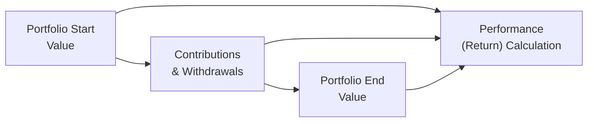

Before diving into the nitty-gritty details on performance measurement and reporting, I’ve got a quick story for you. A few years back, I was working with a private client who was honestly less fussed about how his portfolio performed relative to the S&P 500. All he cared about was ensuring his nest egg grew steadily to meet his goals—he had a target in mind and, well, that was that. It struck me how different that mindset was from the typical institutional approach focusing heavily on beating an index. This personal anecdote highlights the unique ways private clients view performance: it’s often about fulfilling personal objectives rather than strictly outperforming a benchmark.

So, how do we measure performance in a way that resonates with private clients’ goals—be those goals capital preservation, stable income, philanthropic aspirations, or something else entirely? Let’s walk through some of the key considerations in performance measurement and reporting for private wealth.

Defining Appropriate Benchmarks  
Choosing the right benchmark for a private client portfolio can be trickier than it seems. For institutional investors, standard market indices often suffice—like the MSCI World for global equities or a broad bond index for fixed income. But private clients might hold a more eclectic mix of assets: some direct real estate, a few private equity stakes, alternative investments with sporadic liquidity, and so forth.

• Blended Benchmarks:  
  If your client invests across multiple asset classes—say 60% equities, 30% bonds, and 10% alternatives—you can combine relevant indices into a single “blended” benchmark reflecting the target allocation.  
  For instance, you might use 60% of a global equity index, 30% of an aggregate bond index, and 10% of a private equity index or a proxy for alternatives, weighted appropriately.

• Customized Benchmarks:  
  Some private portfolios are so unique (perhaps they hold art, farmland, or concentrated stock positions) that standard market indices just don’t cut it. In such cases, you can craft a custom benchmark or a combination of broad market proxies that align more closely with the portfolio’s exposures.

• Relevance, Investability, and Transparency:  
  Benchmarks should be relevant (capture the asset classes in question), investable (something you can conceivably track or replicate), and transparent (methodology is clear). If you can’t actually invest in the underlying assets of a benchmark or you can’t replicate its methodology, that benchmark isn’t doing you much good.

Absolute vs. Relative Performance  
Private clients often prize absolute returns (“I want my portfolio to grow 5% per year after taxes and fees”) over relative performance (“I want to beat the broad market by 2%”). This absolute return focus stems from personal objectives, like funding retirement or sustaining a foundation’s distribution requirements.

• Absolute Return Mindset:  
  When the emphasis is on absolute performance, the question is: Are you meeting that 5% (or whatever target is set) net of fees and inflation? If so, you’re successful in the client’s eyes—even if the S&P 500 soared by 20% that year.

• Relative Metrics for Additional Insight:  
  That said, it’s sometimes helpful to keep an eye on how the portfolio is doing against a reference benchmark to confirm that your allocation or manager selection is adding value. If you’re consistently lagging an appropriate benchmark, you need to investigate whether something in the strategy is off.  
  Also, re-educating clients on how volatility fits into returns can help set accurate expectations. A year of trailing a benchmark may be acceptable if your portfolio is structured for smoother, less volatile outcomes.

Risk-Adjusted Return Metrics  
Returns alone don’t paint the full picture. If you’re generating 10% annual returns but your portfolio experiences wild monthly swings, your client might lose sleep at night. Risk-adjusted metrics help you see how effectively a portfolio generates returns for the level of risk taken.

• Sharpe Ratio:  
  This classic metric calculates how many units of excess return (over the risk-free rate) you earn per unit of total portfolio standard deviation.  

  
  \text{Sharpe Ratio} = \frac{(R_p - R_f)}{\sigma_p}
  

  Where:  
  Rₚ = portfolio return  
  R_f = risk-free rate  
  σₚ = standard deviation of the portfolio returns  

• Sortino Ratio:  
  The Sortino ratio refines the Sharpe by only considering downside volatility (rather than total volatility). This focuses on negative returns, which many private clients are more concerned about.

• Omega Ratio:  
  The Omega ratio accounts for the entire return distribution, differentiating between upside and downside in a more nuanced way. It’s not super common in casual client discussions, but it can be informative if you want a sophisticated measure that captures asymmetry and tail behavior.

Attribution Analysis  
Attribution answers the big question: “Where did my returns come from?” Imagine a scenario where you had a good year, but it was entirely because the broader equity market rallied—did your manager actually add any alpha? Or was it all a passive wave?

• Allocation vs. Selection:  
  One approach is to break performance into asset allocation (which is basically your weighting to equities vs. bonds vs. alternatives), selection (your picks within each category), and “other” effects like currency moves or derivative overlays.

• Tactical vs. Strategic Decisions:  
  Private wealth managers may shift allocations tactically based on market conditions. You can analyze if those short-term shifts contributed to or detracted from returns. If the client’s portfolio is using external managers, you’ll want to measure each manager’s alpha relative to a relevant style benchmark.

• Clear Communication:  
  In my experience, many private clients appreciate a concise summary: “Half of our outperformance came from overweighting U.S. equities, and the other half from picking strong growth stocks in the technology sector.” That’s a lot more tangible than spouting off raw numbers.

Below is a simple flowchart illustrating how performance measurement often ties into external factors like cash flows. This helps clients visualize where those returns actually come from:

Reporting Best Practices  
One of the greatest challenges we face is packaging all these data points into a report that is both comprehensive and digestible. Some clients want the works: risk ratios, style analysis, multi-factor breakdowns, you name it. Others just want to know, “Hey, did I make money last quarter?”

• Tailor to Your Audience:  
  Specialized, financially savvy clients may appreciate monthly or quarterly portfolio trackers with detailed analytics. A family trust, by contrast, might just want a simple, visually appealing snapshot twice a year, highlighting progress toward philanthropic and estate goals.

• Transparency on Fees and Taxes:  
  Private clients generally want clarity on how fees and taxes are impacting performance. A net-of-fee, after-tax return is probably the most relevant metric, so highlight these calculations to build trust.

• Show Progress Toward Personal Objectives:  
  A “progress tracker” or “on-track analysis” can be super helpful. For example, “Your house down payment fund is on track for your target date in 2027.” That real-life anchor can be much more powerful than saying, “You beat the benchmark by 1.2% last quarter.”

Periodic Review and Client Communication  
Performance reporting isn’t a one-and-done exercise. Maintaining an ongoing dialogue is key to keeping the portfolio aligned with changing market conditions and, crucially, with the client’s evolving personal situation.

• Frequency of Reviews:  
  In many cases, standard quarterly reporting with a more in-depth annual review is sufficient. However, in volatile markets or significant life changes (like selling a business or receiving a large inheritance), a more frequent check-in is wise.

• Revisiting Goals and Risk Tolerances:  
  Life situations change—birth of a child, retirement on the horizon, philanthropic desires intensifying. These shifts can affect risk appetite or time horizon, so performance goals and measurement frameworks may need an update.

• Encouraging Questions:  
  Let’s be honest: Even some sophisticated private clients are hesitant to ask for clarifications if they feel they might sound “uninformed.” Proactively encourage questions, and walk them through the big performance drivers in straightforward language.

Glossary  
• Blended Benchmark:  
  A combination of multiple indices weighted to mirror the portfolio’s target allocation.  
• Absolute Return:  
  Gross or net return over a defined period, without reference to any benchmark.  
• Attribution Analysis:  
  Tools for decomposing total returns to figure out how much is attributable to asset allocation, security selection, and other effects.

References & Further Reading  
• Maginn, J. T., Tuttle, L. E., Pinto, J. E., & McLeavey, D. W. Managing Investment Portfolios: A Dynamic Process (CFA Institute).  
• CFA Institute Global Investment Performance Standards (GIPS).  
• Bacon, Carl. Practical Portfolio Performance Measurement and Attribution. Wiley, 2021.

Practical Exam Tips for CFA Level III  
• Know the pros and cons of each risk-adjusted return metric. Sharpe vs. Sortino vs. Treynor, etc.  
• Be ready to present both absolute and relative performance in exam scenarios. The client might phrase their objectives in absolute terms, but you’ll often be asked to measure performance relative to a benchmark or peer group.  
• Practice your attribution analysis. This is a common area for constructed-response questions—showing how your smarty-pants tactical tilt added value (or not).  
• When discussing reporting, link it to the client’s goals. A frequent exam pitfall is focusing purely on numerical outcomes without addressing the client’s personal constraints and objectives.  
• The exam might include GIPS references, so be familiar with key concepts like composite construction, net-of-fee versus gross-of-fee performance, and verification requirements.  

Now let’s lock in your understanding of performance measurement and reporting concepts with some sample exam-style questions.

## Performance Measurement & Reporting Mastery: Practice Questions



### Which characteristic is most important when selecting a benchmark for a private client portfolio with multiple asset classes?

- [ ] A benchmark that has the highest level of historical return
- [x] A benchmark that closely reflects the portfolio’s actual asset allocation
- [ ] A benchmark focusing on the single largest asset class
- [ ] A benchmark that is actively managed to capture alpha

> **Explanation:** The benchmark should appropriately reflect the portfolio’s allocation across various asset classes. A blended index that mirrors the portfolio’s target weights is typically the best approach.

### A private client wants to measure performance by seeing how much return they made after fees and inflation, regardless of how the market performed. This indicates the client is emphasizing:

- [x] Absolute returns
- [ ] Relative performance to a broad equity index
- [ ] Benchmark outperformance
- [ ] Peer-group comparison

> **Explanation:** The client’s main concern is generating a certain real (inflation-adjusted) rate of return, which is an absolute measure rather than relative to the market.

### When calculating the Sharpe ratio, which factor is not included?

- [ ] Portfolio return (Rₚ)  
- [ ] Risk-free rate (R_f)  
- [ ] Portfolio standard deviation (σₚ)  
- [x] Market volatility

> **Explanation:** The Sharpe ratio measures the excess return (Rₚ − R_f) per unit of the portfolio’s own standard deviation (σₚ). Market volatility is not directly used in its calculation.

### Which statement best describes a key benefit of Sortino ratio over Sharpe ratio for private clients?

- [x] Sortino only penalizes for downside risk, aligning better with a client’s aversion to losses.
- [ ] Sortino considers upside volatility more than Sharpe does.
- [ ] Sortino ratio is calculated using risk-free rate minus portfolio returns.
- [ ] Sortino ratio focuses primarily on credit risk.

> **Explanation:** Sortino ratio refines the Sharpe ratio by using downside volatility rather than total volatility, emphasizing the risk of negative returns.

### Within performance attribution analysis, “selection effect” refers to:

- [x] The gains or losses attributed to picking specific securities within each asset class.
- [ ] The difference in performance due to underweighting or overweighting certain asset classes.
- [x] The client’s choice of a blended benchmark.
- [ ] Changes in the risk-free rate affecting total return.

> **Explanation:** Selection effect captures the contribution to performance from security selection (e.g., stock picks). Asset allocation effect is separate and deals with the choice of weighting among asset classes.

### A private client complains that they are confused when they see both net-of-fee returns and raw returns in monthly reporting. What is the best approach?

- [x] Highlight net-of-fee, after-tax results to show the client’s true outcome.
- [ ] Only provide gross-of-fee returns.
- [ ] Only show index returns for simplicity.
- [ ] Exclude tax impact from the reporting.

> **Explanation:** In private wealth, what clients really experience is net-of-fee, after-tax performance. That truly reflects the money in their pocket.

### Why should private wealth managers periodically review performance with clients?

- [x] To ensure the portfolio remains aligned with evolving objectives and risk tolerances
- [ ] To maintain regulatory compliance with performance reporting
- [x] To discuss short-term market anomalies in daily performance
- [ ] To provide updated instructions to external custodians

> **Explanation:** Regular reviews help address any changes in the client’s life or in market conditions. It keeps the strategy—and the conversation—current, so adjustments can be made as needed.

### The best reason to include risk-adjusted measures in a periodic investment report is:

- [x] They provide a clearer picture of how effectively returns are generated for the level of risk taken.
- [ ] Clients typically don’t care about absolute returns.
- [ ] Standard deviation alone sufficiently conveys risk.
- [ ] Regulations mandate the use of risk-adjusted measures.

> **Explanation:** Risk-adjusted metrics like Sharpe or Sortino help you see if returns are driven by skill or excessive risk-taking, which is essential for thorough analysis.

### In transitioning from a domestic-focused portfolio to a global blended benchmark, what is an important consideration for performance measurement?

- [x] Incorporating currency effects into attribution analysis
- [ ] Disregarding any changes in segmentation of asset classes
- [ ] Switching to an entirely new approach without client consent
- [ ] Eliminating all references to domestic indices

> **Explanation:** Moving from domestic to global investing involves currency exposures, which can significantly drive returns or add volatility. Performance measurement must break out currency gains or losses.

### True or False: Under GIPS, performance must be reported net of all taxes, fees, and carried interest for private clients in every scenario.

- [x] True
- [ ] False

> **Explanation:** GIPS standards emphasize transparency and consistency. Reporting net of all fees and expenses is highly encouraged, especially for private wealth presentations, though the specific rules can vary by jurisdiction. Always check local regulatory requirements.


