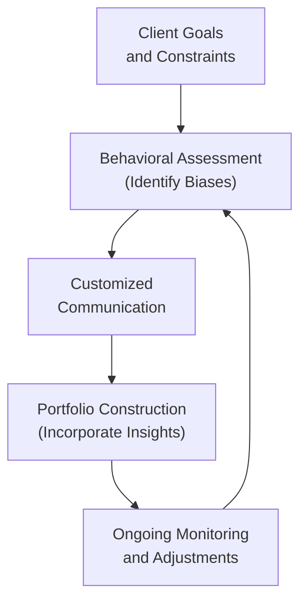
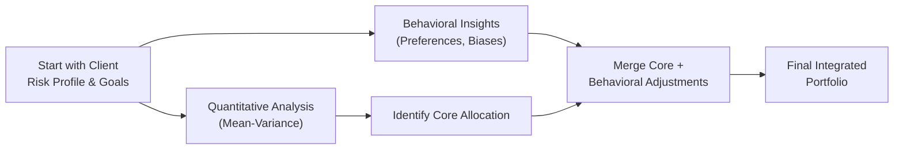

Behavioral Finance often shows us that investors, including the most intelligent and experienced ones, can struggle to behave in strictly rational ways. We all have emotional, cognitive, or social biases that lead us astray. In the realm of private wealth management, these biases can have a significant impact on how portfolios are constructed—and how well they perform over time. In this section, we’ll talk about how to spot these biases, adapt our communication and planning accordingly, and ultimately build portfolios that reflect not just a client’s financial goals but also their emotional comfort, personal values, and long-term aspirations.

Behavioral finance complements the more traditional quantitative methods of investment analysis. As discussed in other parts of this book—particularly in 2.6 (Psychological Profiling and Communication Techniques)—a strong client-advisor relationship requires skillful observation, clear communication, and the flexibility to balance what is best (from a purely analytical perspective) with what is emotionally sustainable for the client. This becomes especially relevant during market turbulences or moments of high stress.

Behavioral finance also echoes themes from 3.1 (Goals-Based Financial Planning), where we tailor portfolios around specific personal milestones, and 4.1 (Portfolio Allocations for Private Clients), which explores how we optimize expected returns given a client’s risk tolerance and constraints. When combined with robust technical approaches—like those described under 4.2 (Tax Efficiency and Tax Management Strategies)—behavioral considerations can help ensure a wealth plan is both mathematically sound and behaviorally resilient.

Behavioral finance might seem theoretical, but in reality, it can make or break a long-term planning outcome. In the upcoming sections, let’s dive deeper into the sorts of biases private wealth clients commonly exhibit and examine best practices to help them (and, frankly, ourselves) keep those biases in check.

## Behavioral Biases in Private Wealth Management

Many wealth managers will tell you that the numbers are the easiest part. The challenge is often the human side—dealing with clients’ fear, uncertainty, overconfidence, or deeply held beliefs about money. Let’s look at some of the common biases and how you might spot them in real life.

### Overconfidence

Overconfidence might manifest as the investor who thinks they can consistently outperform the market or who dismisses professional advice because “they already know how to invest.” I once encountered a client who said, “I’ve always picked winning stocks in the past, I trust my instincts,” but never realized how much luck had influenced those results. Overconfidence causes people to underestimate volatility, ignore diversification, and potentially take on too much risk.

### Loss Aversion

Loss aversion is the idea that we typically feel the pain of losses more strongly than the joy of equivalent gains. If your client is hyper-focused on the possibility of losing principal, they may avoid higher-yield investments in favor of “safer” lower-return assets—even when these choices jeopardize long-term goals. You’ll often see this crop up when markets dip and investors scramble to “stop the bleeding” by selling at a loss.

### Anchoring

Anchoring refers to the tendency to rely too heavily on the first piece of information we get. For instance, a client who bought a stock at $50 might consider $50 an “anchor,” so if the price is now $30, they insist it “should” get back to $50 before they sell. Even if the fundamentals have changed, the anchor continues to weigh on their decision making, leading to biases in how they evaluate new data.

### Herding

Sometimes, clients just want to do what everyone else is doing. When neighbors brag about making a fortune in real estate, your client might think, “Everyone’s in real estate—I must be missing out!” This herding behavior can push them to replicate others’ portfolios, disregarding personal goals, risk tolerance, or the broader market indicators that might suggest caution.

### Familiarity Bias

Familiarity bias is where investors stick with what they already know. For example, clients might be heavily concentrated in the stock of the company where they work or in the industries they understand best. This can lead to significant concentration risk, especially if the majority of their human capital (employment) is also tied to that same sector.

Below is a simple schematic representation (in Mermaid) of how behavioral biases intertwine with the wealth planning process:

This diagram underscores that behavioral considerations are not a one-time exercise. They continually inform how we manage a client’s evolving financial plan.

## Tailoring Communication

Well, let’s be honest: wealth management can seem daunting even to savvy clients—especially when markets turn volatile. So how do we ensure clients comprehend (and actually embrace) the strategies we’re recommending?

• Focus on Goals, Not Just Performance Tables. Instead of bombarding clients with pages of performance stats, highlight how much progress they’ve made toward, say, funding their children’s college tuition or ensuring a comfortable retirement income. Numbers are essential, obviously, but you might break them down into more relatable milestones.

• Use Scenario Stories. Some clients really respond to short narratives: “Let’s suppose the market drops by 15% next year—here’s how your portfolio would typically behave, and here’s why we stay the course.” Emphasizing real-life or hypothetical examples can resonate more than abstract charts.

• Incorporate Visuals. Flowcharts, bullet-point slides, or simple dashboards can help. For instance, show how a client’s portfolio is spread across different asset classes using intuitive charts. If the client has philanthropic goals, create a separate “impact investing” pie chart to illustrate how certain holdings align with their values.

• Acknowledge Emotions. Sometimes, a client just needs someone to say, “I can see why this volatility feels scary.” Validating their emotions can diffuse anxiety and build greater trust. Avoid making them feel silly for being unsure.

This communication approach helps address biases like overconfidence or anchoring—clients see more clearly what’s driving their decisions rather than focusing on a single data point or the mirage of quick market gains.

## Client Preferences and Ethical Investing

There’s a rising demand for socially responsible and environmentally sustainable investments within private wealth management, as many clients want their portfolios to reflect personal beliefs. You might hear, “I want to invest in companies that are reducing carbon emissions, or championing social justice.” You’ll see references to ESG (Environmental, Social, Governance) criteria and Impact Investing.

### ESG Considerations

• Environmental: A client might refuse to invest in companies with large carbon footprints or poor waste management practices.  
• Social: Another might ask you to avoid companies that fail to promote diversity or worker welfare.  
• Governance: Some prefer businesses with transparent boards, robust anti-corruption policies, and strong shareholder rights.

### Impact Investing

Impact investors: They’re actively looking for opportunities that support sustainable farming, renewable energy, or community development. They want to see real-world outcomes, not just financial returns.

### Balancing Returns and Values

Of course, not every client wants maximum returns at any cost—some are fine with potential underperformance compared to a conventional benchmark if it means aligning their money with their sense of purpose. That said, you want to keep them informed of the trade-offs. If excluding entire sectors (e.g., fossil fuels) reduces diversification or pushes them into higher volatility, that must be spelled out clearly. These preferences can be integrated during the strategic asset allocation phase (see 4.1, “Portfolio Allocations for Private Clients”), ensuring that any constraints are baked into the portfolio design from the start.

## Overcoming Emotional Decision-Making

Even the best plan can crumble if, during a crisis, a client succumbs to panic. An Investment Policy Statement (IPS) is a powerful tool here, setting guidelines around asset allocation, risk tolerance, and rebalancing triggers. The IPS acts like an anchor—an agreed-upon plan to guide the advisor and the client during emotional market swings. With a well-defined IPS, decisions are less likely to be dictated by fear or excitement in the moment.

### Scenario Analysis and Stress Tests

As mentioned in 3.7 (Scenario Analysis and Stress Testing for Private Wealth Plans), walking clients through hypothetical scenarios can help reduce the shock factor. If they already know a 20% market drop might happen at some point—and that the portfolio is structured to endure it—a temporary dip is less likely to drive them into rash decisions. Demonstrating how a balanced portfolio recovers (or how a dynamic rebalancing strategy capitalizes on market dips) can mitigate emotional selling.

### Systematic Rebalancing

Automating rebalancing is another way to reduce the role of impulsive choices. Rather than letting the client debate whether to sell winners or hold on in the hope of further gains, you set mechanical rules to restore the target allocation. This can help counter overconfidence because it automatically trims positions that have appreciated significantly.

## Customized Solutions for Client Comfort

You might remember that in strictly quantitative terms, mean-variance optimization suggests a single “best” portfolio for a given set of inputs. But real clients might have personal or emotional constraints. Perhaps they’ve inherited a precious family business or they hold a certain stock for sentimental reasons. Or they remember a painful market crash from decades ago and just feel better if bonds make up a larger part of the portfolio than the strict math would recommend.

### Tension Between Rational and Emotional

It’s better, in many cases, to accept a slight deviation from the “optimal” math if it means the client can sleep at night. After all, an investor who can stay invested for the long term is usually better off than someone who’s so stressed by volatility that they bail out of the market at the worst possible time.

### Hybrid Approaches

In practice, hybrid approaches blend the conventional risk-return framework with risk profiling that accounts for psychological comfort. For example, you might set aside a “personal preferences” allocation. That chunk of the portfolio can hold certain “feel-good” investments, ensuring the client’s non-financial priorities are addressed, while the rest of the portfolio follows a more traditional optimization model.

Here’s a Mermaid diagram illustrating a simplified approach to creating a behaviorally attuned portfolio:

## Practical Examples and Case Studies

Let’s walk through a few hypothetical scenarios to highlight how these concepts might play out:

• Case Study 1: Overexuberant Entrepreneur  
  - Cecilia is a tech entrepreneur who experienced a huge exit from a startup she founded. Feeling unstoppable, she places 70% of her net worth into early-stage tech companies. Although she is risk-tolerant, the advisor identifies overconfidence bias and concentration risk. Through scenario analysis, the advisor demonstrates how a downturn in tech could wipe out half of her wealth. Cecilia agrees to establish a diversified core portfolio that ensures her future goals remain feasible even if the tech sector underperforms.

• Case Study 2: Socially Conscious Heir  
  - James inherits a substantial portfolio from his father but feels morally uncomfortable investing in fossil fuel companies. He’s also concerned about child labor in emerging markets. The advisor builds an ESG-focused portfolio that excludes certain industries, while clarifying that such exclusions might slightly alter the risk-return characteristics. They formalize these exclusions in the IPS so that future rebalancing remains consistent with his social impact goals.

• Case Study 3: Loss-Averse Retiree  
  - Aria, a recently retired teacher, vividly remembers the 2008 financial crisis. Her biggest fear is losing everything in a market crash. The advisor recognizes her strong loss aversion and anchors her strategy around safer fixed-income assets, but carefully layers in some growth assets to protect her purchasing power against inflation. The advisor regularly reassures her with plain-language performance updates that focus on the longevity of her retirement income rather than short-term market volatility.

Each scenario showcases a bias or preference that requires tailoring of the investment strategy. Disregarding these personal factors could easily result in poor decisions, as the clients might abandon a portfolio if it doesn’t feel aligned with their comfort or their values.

## Best Practices and Potential Pitfalls

• Document All Observations: Keep a record (formal or informal) of the client’s stated biases, preferences, and risk tolerance changes over time. This helps with compliance, clarifies misunderstandings, and makes it easier to track if certain biases resurface.

• Revisit Assumptions Regularly: Clients evolve. Their financial situation, life events, or risk appetite may change, requiring an update to the IPS or the overall plan. As covered in 2.7 (Establishing Multi-Generational Education Plans), big shifts can occur across family generations, too.

• Watch for Contradictions: A client might claim they’re comfortable with volatility but panic at the first sign of losses. Ongoing conversation, data gathering, and empathy can help you detect these contradictions early.

• Respect Client Autonomy: Ultimately, it’s the client’s money. If they choose to invest in something unorthodox due to deeply held beliefs, your role is to advise them on potential downsides but also respect their final decision—provided it doesn’t violate professional or regulatory standards.

• Don’t Dismiss Emotions: Making clients feel ashamed or “ignorant” about their biases can damage the advisor-client relationship. Instead, help them understand how their emotional triggers might affect financial outcomes, and work together to build guardrails.

## Exam Tips for Behavioral Finance

If you’re preparing for the CFA Level III exam, know that behavioral finance can appear in both item sets and constructed-response (essay-style) questions. Typical exam prompts might provide a scenario describing an investor’s decision-making patterns or emotional responses, and you’d be asked to:

• Identify the specific bias or biases at play.  
• Recommend practical strategies to address these biases.  
• Demonstrate how you’d incorporate the client’s preferences or personal values into standard portfolio construction (with references to the IPS, rebalancing policies, etc.).

When answering constructed-response items, focus on providing clear, concise, and well-structured justifications. Lay out your reasoning logically: Show how the bias leads to a suboptimal decision and how your proposed solution mitigates it. For item sets with multiple-choice, be prepared to pick the best solution for given circumstances, or identify which bias is being demonstrated.

Time is often tight in the exam, so practice writing succinct responses that directly address the question (rather than restating extraneous theory). Also, be thorough with definitions—make sure you can define the difference between, say, loss aversion and risk aversion, or how overconfidence differs from optimism bias.

## Glossary

Behavioral Bias: Systematic errors in perception or judgment, impacting investment decisions.

Loss Aversion: Tendency to prefer avoiding losses over acquiring equivalent gains, often leading to risk-averse behaviors.

Anchoring: Over-reliance on the first piece of information encountered (the anchor) when making decisions.

Investment Policy Statement (IPS): A document outlining the client’s objectives, constraints, risk tolerance, and strategic approach.

## References and Further Reading

• Kahneman, Daniel. “Thinking, Fast and Slow.” Farrar, Straus and Giroux, 2011.  
• Thaler, Richard H. “Misbehaving: The Making of Behavioral Economics.” Norton, 2015.  
• CFA Institute, “Behavioral Finance” modules in Private Wealth Management.  
• Statman, Meir. “Behavioral Finance: Finance with Normal People.” Oxford University Press, 2019.

--------------------------------------------------------------------------------

## Test Your Knowledge: Behavioral Finance and Client Preferences



### Which of the following biases typically involves placing too much emphasis on the first piece of data received?

- [ ] Overconfidence bias
- [x] Anchoring bias
- [ ] Familiarity bias
- [ ] Loss aversion

> **Explanation:** Anchoring bias occurs when individuals rely too heavily on an initial piece of information (the “anchor”) to make subsequent judgments or decisions.

### In a client meeting, the advisor notices the client focuses only on the potential losses in their portfolio, rarely acknowledging potential gains. Which bias does this behavior most likely reflect?

- [ ] Anchoring bias
- [ ] Herding bias
- [x] Loss aversion
- [ ] Availability bias

> **Explanation:** When a client predominantly focuses on avoiding losses rather than achieving gains, they are showing loss aversion—a common behavioral bias in investing.

### A client wants to invest solely in stocks of a multinational pharmaceutical firm they work for, believing the company's prospects are extraordinary. Which bias is most evident?

- [ ] Anchoring
- [ ] Herding
- [ ] Loss aversion
- [x] Familiarity bias

> **Explanation:** Familiarity bias drives an investor to invest in what they know—like their own employer’s stock—often ignoring significant concentration risk.

### When incorporating ESG or impact investing criteria, advisors should do which of the following?

- [x] Clarify how excluding certain sectors might affect portfolio risk and return.
- [ ] Discourage ESG preferences to preserve maximum diversification.
- [ ] Allocate only to equity funds scoring “A+” on ESG metrics.
- [ ] Treat ESG as irrelevant to long-term performance.

> **Explanation:** Advisors must disclose how ESG restrictions could potentially affect risk-return characteristics and then proceed according to clients’ values and objectives.

### Which strategy most directly helps address impulsive or emotional investment decisions?

- [x] Establishing an Investment Policy Statement (IPS) with clear rebalancing rules.
- [ ] Reviewing the portfolio only when the client requests it.
- [x] Automatic rebalancing, triggered by thresholds.
- [ ] Shifting to 100% cash during volatile markets.

> **Explanation:** An IPS combined with systematic rebalancing is a standard way to address emotional decision-making by pre-defining how and when trades occur, mitigating panic-driven responses.

### What is one potential drawback of building a strictly mean-variance optimized portfolio without behavioral considerations?

- [x] Clients may exit the strategy during market stress if they feel uncomfortable.
- [ ] The portfolio will have narrower diversification.
- [ ] The returns will always be lower than an S&P 500 aggregate.
- [ ] Higher risk automatically translates to future regret.

> **Explanation:** Ignoring clients’ emotional constraints can lead to the dreaded “abandon ship” behavior under duress, negating the benefits of a purely quantitative approach.

### You notice your client wants to follow the hottest investment trend they read about in a financial magazine, purely because “everyone else is doing it.” Which bias is at play?

- [ ] Loss aversion
- [x] Herding
- [ ] Anchoring
- [ ] Overconfidence

> **Explanation:** Herding refers to following the crowd without a solid rationale, often leading to momentum-driven, and potentially suboptimal, investment decisions.

### Scenario analysis is most useful for:

- [ ] Eliminating behavioral biases entirely.
- [ ] Predicting future market performance with perfect accuracy.
- [x] Helping clients understand possible outcomes in various market conditions.
- [ ] Replacing the need for a strategic asset allocation.

> **Explanation:** Scenario analysis helps clients plan for different market conditions and can mitigate emotional reactions by setting expectations, but it doesn’t guarantee bias elimination or perfect forecasts.

### An investor believes strongly that a particular stock is “bound to recover to $100” because that was the price they originally paid for it. This is an example of:

- [ ] Herding
- [ ] Familiarity bias
- [ ] Overconfidence
- [x] Anchoring

> **Explanation:** The investor is anchoring on the original purchase price, ignoring fundamental changes or new market information.

### Behavioral biases can be fully neutralized if the advisor conducts a thorough IPS.

- [x] True
- [ ] False

> **Explanation:** While an IPS is a critical tool for mitigating biases, no plan can guarantee complete elimination of human emotional or cognitive biases. However, it significantly reduces impulsive decisions.


