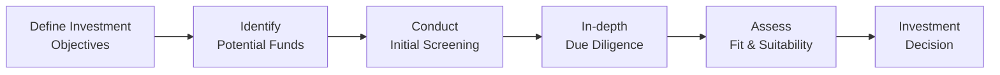

## Introduction

So, let’s chat about alternative investments in private portfolios. You know, we’ve all had those moments where we’re sitting with a wealthy client, and they say something like, “I heard hedge funds are all the rage; can we buy some?” And you’re thinking, “Well, maybe—but it’s not that simple.” That pause usually comes down to a few real concerns, like lock-up periods, high fees, or not being able to cash out whenever you please. 

In this section, we’ll explore some of the big players in the alternative investment space—hedge funds, private equity, private debt, real estate, infrastructure, and commodities—and show how you can (carefully!) incorporate them into a private wealth portfolio. We’ll break down the due diligence process, talk about the role of alternatives in diversification, share a few cautionary tales, and provide pointers on managing ongoing commitments. 

No matter whether you’ve got a client with a few million or a massive family office, understanding the intricacies of alternative assets is crucial to delivering a holistic investment strategy. Let’s jump in.

## Defining Alternative Investments

Alternative investments go beyond traditional stocks, bonds, and cash. They encompass hedge funds, private equity, private debt, real estate, infrastructure, and commodities. These asset classes can often provide unique risk-return profiles and can bring diversification benefits to high‐net‐worth portfolios.

• Hedge Funds: These are pooled investment funds open to a limited range of investors (often accredited or institutional). They can pursue a variety of trading and investment strategies—long/short equity, global macro, event-driven, or market-neutral.  
• Private Equity: These funds invest directly in private companies or conduct buyouts of public companies, resulting in their delisting. Investments can yield high returns but often come with multi-year lock-up periods and very limited liquidity.  
• Private Debt: Also known as private credit, this involves lending strategies outside the public markets, such as direct lending to mid-sized firms, distressed debt, or mezzanine financing.  
• Real Estate: Includes residential, commercial, industrial, and specialized property classes, such as data centers. Real estate can generate steady income and may appreciate over time, but it’s not always easy to sell quickly.  
• Infrastructure: Think roads, bridges, airports, or energy pipelines—assets with long useful lives, stable cash flows, and inflation-hedging features.  
• Commodities: Physical goods like precious metals, energy resources, and agricultural products. Commodities may hedge inflation, but they come with unique price volatility and storage considerations.

### Challenges of Alternatives

Why do investors even bother with these more complex assets? Well, alternatives can exhibit lower correlation to traditional markets, offering the potential to preserve capital in downturns or even produce alpha. However, they’re not exactly for everyone. Typical issues include:

• Lock-Up Periods: Investors can’t just click a button and redeem their money, especially in private equity or some hedge fund structures.  
• Performance Fees: You might see “2 and 20” (2% management, 20% performance fee), which can erode returns.  
• Limited Transparency: Many alternative strategies don’t report holdings daily, so you may have less clarity regarding portfolio exposures.  
• Regulatory Oversight: These vehicles often face fewer public reporting requirements, which can magnify risk if not carefully understood.

## Evaluating Suitability

Before recommending alternative investments, financial advisors need to assess the client’s:

• Financial Sophistication: Does the client truly understand the complexities of, say, a long/short hedge fund or a leveraged private equity deal?  
• Liquidity Appetite: Is the client comfortable tying up capital for 5–10 years (as might be required with certain private equity funds)?  
• Net Worth and Cash Flow Needs: Clients with significant net worth can handle occasional illiquidity, but those requiring regular cash flow might struggle with long lock-ups.  
• Risk Tolerance: Alternatives can use leverage, derivatives, and complex trading strategies. If the client is averse to unexpected volatility, consider simpler structured alternatives instead.  
• Regulatory and Legal Framework: Certain countries require investors to be “accredited” or “qualified” to invest in these vehicles. Always confirm local regulations and see if they align with client status.

It’s also worth mentioning that big minimum investments and limited regulatory oversight can increase the possibility of manager fraud, illiquidity, and market risk. We’ve all heard of infamous hedge fund blow-ups that left investors with massive losses, so introducing alternatives without thorough due diligence can end in heartbreak—and lawsuits.

## Due Diligence Process

Conducting robust due diligence is non-negotiable when selecting alternative investments. At a high level, you’re looking at the following components:

### Manager Track Records and Strategy

• Have they managed a similar strategy through different market cycles?  
• Do they articulate their investment approach clearly?  
• Is there key-person risk (i.e., a single “star” manager who makes all decisions)?  

### Fee Structures and Alignment of Interests

• Are fees transparent? Look for the total expense ratio: management, performance, and any administrative fees.  
• Do managers invest their own personal capital in the fund? This “skin in the game” can help ensure alignment.

### Historical Performance and Market Conditions

Investigate the track record in both bull and bear markets. You’d want to see how the fund performed during major stress events like the 2008 financial crisis or other market downturns. If they lack real-world experience during tough times, factor that into your risk assessment.

### Valuation Methods, Redemptions, and Other Provisions

• How do they value illiquid or hard‐to‐value assets?  
• What about redemption terms? Are there gating provisions or side pockets for less liquid holdings? (Side pockets separate illiquid assets so that investors exiting the fund aren’t unfairly advantaged or disadvantaged.)  
• Are financials audited by reputable firms?  

Consider the following conceptual flow of a due diligence process:

Each step in this chain is crucial. Skipping thorough due diligence can lead to nasty surprises, such as unexpected manager style drift, uncomfortably high leverage, or, in worst‐case scenarios, fraud.

## Role in Portfolio Construction

Once you’ve done your homework, it’s time to figure out how alternatives fit into the broader portfolio. Ask yourself: 

• Is the primary objective diversification? Maybe global macro or market-neutral hedge funds can reduce correlation.  
• Seeking an inflation hedge? Real estate, commodities, or infrastructure might do the trick.  
• Looking for pure alpha? Certain hedge funds or private equity managers might generate outperformance, but success depends heavily on manager skill.

Keep in mind that adding alternatives can affect your overall portfolio’s liquidity profile. If 40% of a client’s capital is locked up in private equity for seven years, that means rebalancing can get complicated. Also, large exposures to illiquid assets may limit the ability to respond quickly to market opportunities or client emergencies.

### Impact on Risk and Correlation Structure

We often measure correlation, denoted as \\\( \rho \\\) (the Greek letter rho), by:


\rho_{XY} = \frac{\mathrm{Cov}(X, Y)}{\sigma_X \sigma_Y}


Two assets with low or negative correlation can help stabilize overall returns. Many alternative strategies historically had lower correlations with traditional equity indexes, which is part of their appeal. But be cautious: correlations can spike during crises if everyone starts selling, meaning diversifiers may not always be diversifiers.

### Rebalancing Feasibility

Rebalancing is tricky when alternatives are locked up. If the public equity portion of your portfolio skyrockets, you might want to reallocate into the alternative portion. But if the alternative portion is illiquid, you’re stuck in your original allocation until redemption windows open or capital calls are made. It’s essential to plan for this in overall liquidity management (see also “3.5 Liquidity Strategies and Contingency Funding” in the Table of Contents).

## Managing Private Equity, Real Estate, and Hedge Funds

Three segments dominate many wealthy client portfolios: private equity, real estate, and hedge funds. Let’s briefly look at each:

### Private Equity

• Multi-year Lock-Up: Typically, a 10-year fund life, divided into an investment period (first few years) and a harvesting period.  
• Capital Calls and Distributions: You don’t invest everything at once; the manager calls capital over time to finance new deals. Likewise, returns aren’t realized until the underlying companies are sold.  
• Return Potential: Potentially high, but with higher risk. Manager selection matters—top-quartile PE funds can be significantly more profitable than median performers.  

I once met an entrepreneur who sold his business and placed a major chunk of liquidity into a single private equity fund. Sure, he eventually made a killing, but he went years without being able to access that capital. Not fun if you suddenly need cash for personal or business expenses.

### Real Estate

• Income Generation: Rental income and revaluation of properties are key return drivers.  
• Leverage: Many real estate investments can be financed with debt, amplifying returns (and risk).  
• Active vs. Passive Management: You could buy a building and manage it, or you could invest in a Real Estate Investment Trust (REIT) or private real estate fund for a more hands-off approach.  
• Inflation Hedge: Property values and rental incomes often rise with inflation, protecting real purchasing power.  

Not everyone wants to be a landlord, obviously. But for some HNW families, direct ownership of real estate is a passion. They like hands-on management, renovating, and having tangible assets. If that resonates with the client, real estate can be a strong anchor in the portfolio—but do factor in the cost of upkeep, property taxes, and potential vacancies.

### Hedge Funds

• Absolute Return Focus: Many hedge fund strategies aim to deliver positive returns, regardless of the broader market.  
• Diverse Strategies: You can find funds that do anything from shorting overvalued stocks to employing arbitrage, to riding macroeconomic trends, to investing in distressed credit.  
• Risk and Complexity: Some funds employ very high leverage. Others rely on derivatives that can be complicated for novices to grasp.  
• Performance Dispersion: Hedge fund returns vary dramatically. Some stellar managers exist, but so do plenty of mediocre or poor performers.  

A big point: Some hedge funds shine in specific environments only. For instance, a long/short equity manager might do well in high-volatility markets but could underperform a simple index fund in a long-running bull market. Temper expectations accordingly.

## Best Practices and Common Pitfalls

• Diversify Across Managers: Even the best managers can falter. Avoid betting too heavily on any single fund or strategy.  
• Understand Total Fees: High fees can significantly drag down net returns over time. Don’t forget to account for performance fees when projecting potential outcomes.  
• Beware of Hidden Leverage: Alternatives often use leverage, which can magnify both gains and losses.  
• Regularly Monitor Fund Developments: Strategy drift can happen. Revisit your original thesis periodically—does the manager still do what they said they’d do?  
• Plan for Taxes: Some hedge funds, private equity structures, or real estate deals can trigger complex tax situations (e.g., K-1 forms, withholding taxes). Collaborate with qualified tax professionals.

## Conclusion and Exam Tips

When blending alternative investments into private wealth portfolios, always match the solution with the client’s distinct goals, risk tolerance, and liquidity constraints. Alternatives can improve diversification and potentially enhance returns, but they demand specialized knowledge, thorough due diligence, and ongoing monitoring.

If you’re gearing up for the CFA Level III exam, keep the following suggestions in mind:

• Practice scenario-based questions involving illiquid asset classes.  
• Know the effect of lock-up periods on rebalancing and risk management.  
• Understand how to measure and interpret correlation, especially under crisis conditions.  
• Familiarize yourself with real-world fee structures, gating provisions, and side pockets—these frequently appear in both item set and constructed-response questions.  
• Always tie investment decisions back to the client’s broader wealth management plan (see also “2.1 Family and Human Dynamics in High‐Net‐Worth Households” for context on investor goals and behaviors).

## Glossary

• Lock‐Up Period: A specified time during which investors cannot redeem or sell their shares in a fund.  
• Gating Provision: A limit on how much an investor can withdraw from a fund at one time to protect remaining investors in times of heavy redemptions.  
• Side Pocket: A mechanism in hedge funds to isolate illiquid or hard-to-value assets from the main liquid portfolio.  
• Alpha: Excess return attributable to manager skill rather than market movement. Often calculated as \\\( R_p - (R_f + \beta (R_m - R_f)) \\\).  
• Correlation: A statistical measure (\\\( \rho \\\)) of how two asset returns move relative to one another. When correlation is low, the assets may provide diversification benefits.

## References & Further Reading

• Anson, Mark J. P. “Handbook of Alternative Assets.”  
• Preqin Global Alternatives Reports: [https://www.preqin.com](https://www.preqin.com)  
• Hallman, G. Victor, and Rosenbloom, Jerry. “Private Wealth Management: The Complete Reference for the Personal Financial Planner.”  
• Chapter 2 (“Working with the Wealthy”) in this curriculum for understanding client dynamics.  
• Chapter 3 (“Wealth Planning”) for liquidity planning and tax considerations.

## Test Your Knowledge: Alternative Investments Mastery Quiz



### Which of the following best describes a “lock-up period” in a hedge fund?

- [ ] The time period during which hedge funds must report results to investors daily.
- [ ] A proprietary trading blackout imposed by regulators.
- [x] A specified duration during which investors are prohibited from redeeming their investments.
- [ ] A period when all fund activities are suspended.

> **Explanation:** Hedge funds often impose lock-up periods to ensure stable capital. During this time, you can’t redeem your shares, which allows the manager to invest in longer-term or less liquid strategies.

### Which factor is most crucial when evaluating the suitability of alternative investments for a private client portfolio?

- [ ] The portfolio’s overall market index exposure.
- [x] The client’s liquidity needs and overall net worth.
- [ ] The manager’s personal marketing strategy.
- [ ] Daily correlation data with major stock market indices.

> **Explanation:** Because many alternatives are illiquid or have long lock-up periods, understanding a client’s liquidity demands and net worth is essential for a correct suitability assessment.

### During due diligence on a private equity fund, which item is typically the most significant indicator of future performance?

- [ ] Marketing materials and annual gala sponsorships.
- [ ] The presence of celebrities or high-profile endorsers.
- [x] The fund’s historic performance throughout varying market cycles and the manager’s track record.
- [ ] The low volatility of public equities during the fund inception.

> **Explanation:** Historical performance in different environments, along with the manager’s track record, is far more predictive than brand or endorsements.

### How do gating provisions affect hedge fund redemptions?

- [ ] They reduce the fund’s management fee.
- [ ] They allow for unlimited redemptions as long as the fund is profitable.
- [ ] They guarantee daily liquidity for all investors.
- [x] They limit the percentage of assets that can be withdrawn at one time.

> **Explanation:** Gating provisions protect the fund from a rapid asset drain during stress scenarios by limiting how much money investors can redeem in a single redemption period.

### Which type of alternative investment generally features capital calls and distributions over the life of the fund?

- [ ] Commodity index futures.
- [x] Private equity funds.
- [ ] Hedge funds using daily NAV calculations.
- [ ] Real Estate Investment Trusts (REITs).

> **Explanation:** Private equity funds typically call capital in stages as they identify investments. They return capital and profits (distributions) when those investments are sold, which can occur several years into the fund’s lifespan.

### Which statement about hedge funds is most accurate?

- [ ] They all employ low-risk, market-neutral strategies.
- [x] They can pursue a wide array of strategies, from long/short equity to global macro.
- [ ] They are devoid of leverage or derivatives in most cases.
- [ ] They must register all holdings monthly with the SEC or relevant regulator.

> **Explanation:** Hedge funds can have highly diverse strategies with varying risk levels and use of leverage. They are also known for their flexible investment mandates.

### An investor wants to hedge inflation risk in a largely fixed-income portfolio. Which alternative would most likely serve this objective?

- [ ] A market-neutral equity hedge fund.
- [x] Real estate or infrastructure investments.
- [ ] Traditional bank savings accounts.
- [ ] A distressed debt fund using high leverage.

> **Explanation:** Real estate and infrastructure often have inflation-linked revenue streams, enabling them to serve as partial hedges against rising prices.

### A side pocket in a hedge fund is used primarily to:

- [ ] Allocate profits in equal portions to all fund investors.
- [ ] Ensure daily valuations are always exact.
- [x] Segregate illiquid or hard-to-value assets from the main portfolio.
- [ ] Avoid capital gains taxes in certain jurisdictions.

> **Explanation:** Side pockets ensure that illiquid or complex holdings don’t unfairly affect inflows or outflows for other investors.

### A major disadvantage of lock-up periods is that:

- [x] They restrict investor liquidity at crucial times.
- [ ] They guarantee outperformance in a bull market.
- [ ] They provide daily valuation transparency.
- [ ] They enhance the correlation with public markets.

> **Explanation:** During a lock-up period, investors simply can’t redeem their funds, even if they need cash urgently or markets turn sour, which can lead to liquidity challenges.

### True or False: Correlation between alternative investments and traditional equities always remains low, even during a financial crisis.

- [x] True
- [ ] False

> **Explanation:** During systemic meltdowns, correlations between all asset classes can spike. Although alternatives may have low correlation during normal markets, this relationship can shift dramatically under stress. However, the statement as written can be a bit of a trick: it's widely observed that correlations can rise in a crisis, so asserting they “always remain low” is questionable. The correct stance is that correlation may increase in distressed markets, meaning the “always remain low” statement is generally false. If this is a trick question, it emphasizes the phenomenon that diversification can fail under market stress. In actual practice, you might find the correlation is not guaranteed to stay low in crises.


