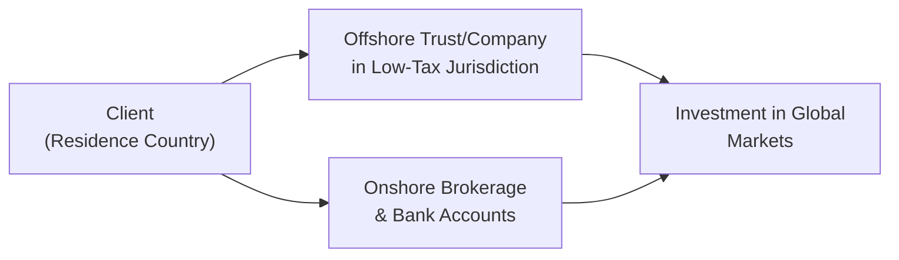

## Overview

Let’s talk about coordinating onshore and offshore investment strategies. It might sound fancy, but it basically refers to how wealthy individuals manage assets located in more than one jurisdiction. You know those global citizens who have residences in multiple countries, bank accounts scattered across continents, or business interests that span multiple time zones? They often face unique challenges when it comes to compliance, currency, and tax planning. And that’s what we’ll be exploring here.

This topic fits neatly into the broader discussion of investment planning for private wealth clients (recall prior topics in this chapter like tax efficiency in Section 4.2, alternative investments in 4.6, and so on). The big question is: how do we help clients juggle the difference in rules, laws, and opportunities available onshore (in their home country) versus offshore (in another jurisdiction)?

We’ll explore the motivations for offshore strategies, the complexities of regulatory compliance, ways to handle currency exposure, the potential for tax arbitrage, and the nuts and bolts of managing repatriation. We’ll also touch on best practices and pitfalls—nobody wants to be stuck with a draconian penalty because they forgot to file the right disclosure form!

## Reasons for Offshore Strategies

There are plenty of legit reasons folks look beyond their home country for investments or wealth planning. Let’s go through a few of the main ones:

• Tax advantages: Some jurisdictions offer preferential tax rates, certain exemptions on gains, or better deals on withholding taxes. And sure, it’s not always about pure tax “avoidance.” Many times, these structures allow precise estate planning or philanthropic goals to be realized in an efficient way.

• Asset protection: I once chatted with a business owner who was worried about losing her wealth if she got into a major legal dispute. She set up an offshore trust for added layers of protection, so that if she were ever sued, assets in that trust might be shielded (assuming she followed the relevant laws in each jurisdiction).

• Currency diversification: When your local currency is prone to big swings, storing some assets in U.S. dollars, euros, or Swiss francs can provide an extra layer of stability. We saw this in Section 4.1 (Portfolio Allocations for Private Clients), where we discussed how to manage multiple-asset and currency exposures in diversified portfolios.

• Complex cross‐border lifestyles: Some private clients hold dual citizenship or have businesses that operate in multiple countries. For such individuals, it’s practically mandatory to juggle onshore and offshore assets just to keep the business afloat.

## Regulatory Compliance and Reporting

It’s not all sunshine and roses. Managing offshore funds brings an entire stack of compliance documents, especially nowadays, with global regulatory frameworks like FATCA (Foreign Account Tax Compliance Act) and CRS (Common Reporting Standard).

### FATCA and CRS

FATCA is a U.S. regulation that basically requires foreign financial institutions to report accounts held by U.S. citizens or taxpayers. Institutions not in compliance can face significant withholding taxes on certain U.S. source payments. Maybe you’ve heard clients say, “I’m a U.S. citizen living abroad, how does FATCA affect me?” Well, it means pretty much every bank outside the U.S. that wants to handle their account must sign up to comply with these rules or face penalties. This can restrict your clients’ choice of institutions and may add layers of paperwork.

Meanwhile, CRS is the global counterpart developed by the OECD. Under CRS, over 100 countries exchange account data on foreign nationals. Let’s imagine your client is a resident of Country X but has an account in Country Y—if both countries have signed on to CRS, those account details might be shared automatically with Country X’s tax authority. Penalties for non-disclosure can be severe, including fines or criminal charges in extreme cases.

### Documentation and Disclosures

This is the area where many private clients slip up. They might open an account overseas, put a bunch of money into it, but fail to follow through with the annual reporting requirements in their home jurisdiction. While I’m not an attorney, I’d definitely stress the importance of working with a cross-border tax specialist to ensure that all forms, from FBAR (Report of Foreign Bank and Financial Accounts) in the U.S. to local equivalents in other countries, are filed accurately and on time. The compliance effort is significant, but the cost of ignoring it may be even bigger.

## Currency and Hedging

Currencies can whipsaw. That can be thrilling if you’re a currency trader, but for a private wealth client who wants smooth growth, it’s often a headache. So the question is: do we hedge, partially hedge, or leave exposures unhedged?

Well, the answer might depend on the client’s base currency and spending needs. Suppose your client is based in Europe (home currency is the euro), but they have a substantial portfolio denominated in U.S. dollars. They might want to mitigate fluctuations by entering forward contracts to sell USD and buy EUR at a set rate in the future. This reduces portfolio volatility but means you might lose out on potential currency gains if the dollar moves favorably.

### Example of a Simple Hedging Approach

Imagine you have a €10 million portfolio that invests heavily in U.S. stocks. You’re worried about short-term swings in EUR/USD. So your wealth manager arranges a currency forward contract that locks in an exchange rate for, say, 50% of that exposure. If the dollar sinked next month, that part of your portfolio value is protected. If the dollar soared, though, you won’t reap the full currency gain.

### Currency Overlay Managers

Currency overlay managers handle these strategies on a larger scale. They basically run a parallel or “overlay” portfolio of currency positions on top of the existing asset portfolio. In some cases, the overlay might even seek small alpha (additional return) by engaging in carefully calibrated currency trades.

## Tax Arbitrage and Treaty Shopping

The term “tax arbitrage” conjures images of shady deals, but it’s not necessarily so. In some situations, investing through an offshore entity set up in a jurisdiction that has favorable tax treaties can reduce withholding taxes on dividends or allow more favorable capital gains treatment. This is all about “treaty shopping”—finding jurisdictions with good bilateral tax treaties for the client’s investment plan.

### Caveats on Legitimacy

However, not all strategies are created equal. Offshore “tax havens” often attract controversy. In many advanced jurisdictions, clamping down on questionable tax shelters has become a priority. The risk is not just legal—it’s reputational, too. Clients don’t want a feature article in the local media painting them as a tax evader. So it’s crucial to emphasize that everything be done within the boundaries of law, with full transparency and compliance.

### Quick Example

Say you have a client who’s a resident of Country A, which charges a fairly high withholding tax on certain investment distributions. But they can set up a holding company in Country B, which has a tax treaty with Country A, enabling lower withholding. For instance, maybe the standard withholding is 30%, but due to the treaty, it can be reduced to 5% or 10%. Over time, that difference can significantly boost net returns.

## Asset Protection Trusts and Other Structures

When we talk about offshore structures, asset protection trusts (APTs) and offshore foundations often come to mind. Let’s mention a few:

• APTs: Frequently established in jurisdictions known for robust asset protection laws. They can help shield assets from creditors (within legal limits) and also facilitate multigenerational wealth transfers (tied to concepts in “4.7 Transferring the Wealth” in Chapter 7).

• Offshore Foundations: Similar to trusts but typically recognized as separate legal entities. They often combine philanthropic elements, estate planning, and asset protection.

It’s easy to see the appeal. But these structures require ongoing compliance and disclosures to avoid charges of fraudulent conveyance or other legal issues. In some countries, if you set up a trust primarily to evade creditors, the courts might disregard the trust.

## Repatriation and Exit Planning

One of the trickiest parts is figuring out how to bring funds back home without incurring huge taxes or running afoul of reporting rules. Let’s say you decide to unwind your offshore structure because you’re relocating permanently back to your home country. That might trigger a large tax bill if not planned carefully. Maybe you coordinate with local counsel to create a multi-year schedule of partial distributions, taking advantage of lower tax brackets or specific relief measures.

### Changing Residency Status

If your client changes their home base from a high-tax to a low-tax jurisdiction, or vice versa, the timing can make a big difference. For instance, moving to a new country after you’ve realized a capital gain might be more favorable than realizing that gain after you arrive. On the flip side, some places impose departure taxes. Considering how these transitions line up is crucial to optimizing overall net worth and avoiding nasty surprises.

## Practical Case Study Example

Picture a 55-year-old entrepreneur who splits time between Canada and Hong Kong. She has a tech startup in Hong Kong, farmland in Ontario (onshore assets), and a million-dollar account in the Cayman Islands (offshore). Here’s how a plan might unfold:

• Tax Efficiency: Her team sets up a holding company in the British Virgin Islands to channel certain investments, leading to a potential reduction in withholding taxes on dividends.  
• Currency Hedging: Given that she plans eventually to retire in Canada, she uses partial hedges on her HKD (Hong Kong dollar) exposure to smooth some currency volatility.  
• Compliance: She files annual returns with both the Canada Revenue Agency and the Hong Kong tax authority, including all relevant forms under CRS.  
• Repatriation: In the final five years leading up to retirement, she gradually transfers funds from the Cayman account to her Canadian accounts. This ensures she doesn’t trigger a large lump-sum tax event in a single year.

In practice, none of this is simple. There are lawyers, tax advisors, and compliance officers all working in tandem. But this is a pretty typical scenario for individuals who have built cross-border businesses and want to enjoy retirement back home.

## Visualizing Onshore and Offshore Flows

Below is a simple Mermaid diagram that might help visualize the relationship between onshore and offshore structures.

• From the client’s perspective, money flows both to domestic accounts (onshore) and to the offshore structure.  
• Both sets of holdings may invest in global markets, but the regulatory, tax, and reporting obligations differ significantly.

## Common Pitfalls and Challenges

While the idea of offshore diversification is appealing, let’s highlight some pitfalls:

• Inaccurate or Omitted Reporting: Even small oversights on disclosure forms can lead to stiff fines.  
• Overlooking Local Laws: Sometimes people assume that if an asset is offshore, local laws don’t apply. This can be a huge mistake.  
• Excessive Complexity: Too many layered holding companies or shell entities can create inefficiencies, confusion, or suspicion from regulators.  
• Currency Risks: Hedging can be expensive, and sometimes leaving the currency unhedged is the better decision—particularly if the client’s spending currency matches the investment currency.

## Best Practices and Strategies

• Always consult a specialized tax advisor: Laws can be drastically different from one jurisdiction to another, and they continually evolve.  
• Maintain transparent records: Keep thorough documentation, including statements, transaction records, and compliance reports.  
• Align currency strategy with personal spending: Hedge only to the extent that it makes sense for the client’s future consumption patterns.  
• Revisit structures regularly: A trust set up in 2015 might require an update in 2025 because tax treaties and local rules have changed.

## Tying It Back to Investment Planning

Remember, investment planning (as we’ve covered throughout Chapter 4) is about building a holistic portfolio that meets the client’s goals. Coordination between onshore and offshore strategies is an extension of that. It’s everything from ensuring optimum tax efficiency (4.2) to selecting the right vehicles for retirement distributions (4.3) to measuring performance when multiple jurisdictions are involved (4.4).

## Final Thoughts and Exam Tips

For the CFA Level III exam, it’s crucial to think of these strategies in practical, scenario-based ways. You might see a question about a private client with multiple citizenships and how to minimize tax drag on a global portfolio. Or a question about the pros and cons of hedging a specific currency exposure. 
Try to remember: 
• Spell out legitimate, transparent approaches rather than shady deals.  
• Emphasize comprehensive planning—tax, legal, and compliance all matter.  
• Don’t forget that behavioral and communication considerations (see 4.5) can be vital when recommending complicated offshore structures to clients who might be wary or simply not informed.

## References and Further Reading

• OECD Guidelines on Common Reporting Standard:  
  https://www.oecd.org/tax/automatic-exchange  
• “Wealth Management Unwrapped” by Charlotte B. Beyer  
• Deloitte’s “International Tax and Wealth Planning” reports for cross‐border individuals  

---

## Test Your Knowledge: Onshore vs. Offshore Investment Coordination



### Which of the following is a key motivation for establishing offshore accounts?

- [x] Asset protection and currency diversification
- [ ] Avoiding all tax obligations
- [ ] Eliminating the need to follow local laws
- [ ] Obtaining permanent residency status in foreign markets

> **Explanation:** Offshore accounts can offer various strategic benefits, including heightened asset protection and currency diversification. However, they do not eliminate the need to follow relevant local laws. Nor do they exempt a client from other tax obligations.

### What does FATCA primarily require from non-U.S. financial institutions?

- [ ] To hold reserves in U.S. dollars for all U.S. account holders
- [x] To disclose information on U.S. account holders to the IRS
- [ ] To refrain from investing in U.S. securities
- [ ] To adopt the euro as a base currency

> **Explanation:** FATCA (Foreign Account Tax Compliance Act) compels foreign financial institutions to disclose details about U.S. account holders. Failure to comply can lead to withholding taxes on U.S. source payments.

### An asset protection trust established offshore is most likely designed to:

- [x] Shield assets from certain creditor claims
- [ ] Relax local disclosure requirements
- [ ] Avoid compliance with foreign reporting standards
- [ ] Immediately convert all assets to cryptocurrencies

> **Explanation:** Offshore trusts often serve to protect assets from creditor claims under specific legal conditions. They still require thorough disclosure, and they are subject to complex reporting standards as well.

### A client who is concerned about short-term currency volatility in a U.S. dollar position might:

- [ ] Eliminate the U.S. position completely
- [ ] Avoid reporting the position to global tax authorities
- [ ] Use an unregulated currency speculation scheme
- [x] Use currency forwards or a currency overlay manager

> **Explanation:** Employing currency forwards or working with a currency overlay manager can help manage (or hedge) currency risk in a transparent, regulated manner.

### In a jurisdiction with which a client’s home country has a favorable tax treaty, the client might:

- [x] Reduce withholding on dividends or capital gains
- [ ] Invest in prohibited assets without local scrutiny
- [x] Benefit from potentially lower capital gains rates
- [ ] Bypass all anti-money laundering checks

> **Explanation:** A friendly tax treaty can reduce withholding tax rates or lead to lower capital gains taxes. However, the client remains subject to AML regulations and cannot simply invest in prohibited assets without scrutiny.

### One common pitfall related to offshore investing is:

- [x] Failing to report foreign accounts properly
- [ ] Access to too many different banks
- [ ] Avoiding all taxes altogether
- [ ] Having only one single advisor

> **Explanation:** Not reporting foreign accounts in accordance with FATCA, CRS, or other regulations is a common and costly oversight.

### Changing residency status before liquidating offshore assets might:

- [x] Affect the tax rates imposed on capital gains
- [ ] Eliminate local currency risk entirely
- [x] Require the involvement of multiple legal advisors
- [ ] Guarantee zero tax liability on future gains

> **Explanation:** Relocating can alter how gains are taxed because of different local laws and tax treaties. This process generally calls for cross-border legal and tax advice. It does not guarantee that taxes disappear.

### When coordinating offshore strategies, which approach is most aligned with ethical practice?

- [x] Transparent planning in compliance with all relevant regulations
- [ ] Relying on illegal structures
- [ ] Withholding partial disclosure of foreign accounts
- [ ] Using secret pass-through accounts for personal gains

> **Explanation:** Ethical practice in wealth management demands transparency and compliance with laws. Using illegal or secret structures poses ethical and legal risks.

### For a client with significant U.S. dollar exposure but euro-based expenses, a currency overlay:

- [x] Could actively manage forex risk for the client
- [ ] Would only invest in emerging market currencies
- [ ] Freely creates money out of thin air
- [ ] Eliminates the need to file tax forms

> **Explanation:** A currency overlay focuses on managing the currency exposure, typically in a controlled manner aiming to hedge or limit forex risk. It doesn’t negate tax obligations or create fictional money.

### True or False: State-of-the-art reporting requirements like FATCA and CRS reduce the likelihood of undisclosed offshore assets.

- [x] True
- [ ] False

> **Explanation:** Global standards (FATCA, CRS) have significantly increased cross-border information sharing, which makes it harder for individuals to hide offshore assets without detection.


