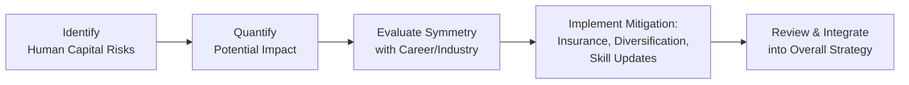
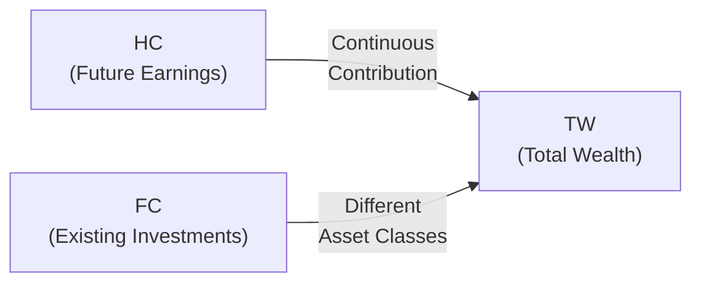

## Understanding Human Capital

Sometimes, people forget that their ability to generate an income—whether through a salary, bonus, or a profitable business—is truly the bedrock of their overall wealth. This personal “money machine” is what we commonly refer to as human capital. From a financial standpoint, human capital is the present value of all your future earning potential. If you think about it, you might say, “Wait a second, if I’m in the prime of my career, this is possibly my biggest asset!” And often, that’s absolutely correct.

In more formal terms, we can express human capital (HC) mathematically:

\text{HC} = \sum_{t=1}^{N} \frac{E_t}{(1 + r)^t}

where:
• \\( E_t \\) is the expected income (salary, bonuses, dividends from privately held companies, etc.) in year \\( t \\).  
• \\( r \\) is the required rate of return or discount rate.  
• \\( N \\) is the number of years you expect to work or earn.  

This formula wraps up all those future paychecks (or entrepreneurial profits) into a single value in today’s dollars. For a lot of young professionals or entrepreneurs, their human capital dwarfs their financial capital (their current bank and investment portfolio) by a significant margin. And that’s one reason we pay so much attention to identifying and mitigating the risks that could threaten this extremely valuable, intangible asset.

## Common Human Capital Risks

Human capital risks are those factors that might disrupt or reduce your future earnings, such as an unexpected injury, a significant shift in the industry you work in, or even reputational damage that affects your professional standing. We can break these threats into a few general categories:

Health-Related Risks  
Imagine you’re a star surgeon. You probably have a really high income and a skill set that’s in demand, but you also have one big risk: if anything happens to your physical stamina or dexterity—like a serious injury or an unforeseen diagnosis—your ability to keep working at full capacity might disappear. That’s why health-related risks such as illness or disability are one of the most critical to consider.  

Career-Related Risks  
Sometimes, people find themselves “between jobs” longer than expected, or they discover their job skills aren’t aligned with what the market wants. Career risk also includes the possibility of a total business failure if you run your own enterprise. In industries experiencing massive technological disruption—think artificial intelligence or robotics—professionals might quickly find themselves left behind if they don’t keep updating their expertise.  

Concentrated Career Risk  
This refers to instances where your livelihood is heavily tied to a single role or a singular skill set. If you have a very specialized profession, you might command a great salary when everything’s fine, but if technology changes or you suffer a crisis (like losing the ability to practice law or perform surgery), your entire income flow might evaporate. Concentrated career risk is often underscored in situations where an entrepreneur’s income, brand, or personal identity is so entwined with one business venture that nothing else can step in if disaster hits.  

## Risk Assessment

The first step toward handling human capital risk is to figure out exactly what's at stake. Assessing this risk systematically involves the following:

• Stability of your income stream. If you work in a cyclical industry such as mining, real estate development, or oil and gas, your income can swing widely with the market. If you’re in a more stable field (e.g., a teacher in a well-funded school system), your income might be more predictable.  

• Potential disruptors. Think about what could damage your professional reputation or hamper your ability to remain gainfully employed. Health issues, large-scale changes in the industry, the need for new qualifications, lawsuits—these can all affect your long-term earnings.  

• Scenario planning. We often talk about “scenario planning” in big corporations, but you can do it for your own life too. You basically ask: “What happens to my income if I’m unable to work for 12 months?” or “How would I support my lifestyle if I need to close my small business for an extended period?” By mapping out these worst-case scenarios, you get a sense of how large the potential damage might be.  

Let’s illustrate with a quick personal anecdote. A colleague of mine—let’s call her Sarah—spent about two decades building a career in a niche area of finance. She excelled until her firm went under during an industry downturn. Because her skills were so specialized, she struggled to find a new job that matched her compensation expectations. A sharp shift in the market made her old skill set less relevant, so her job search was more challenging than she ever imagined. That experience underlines the importance of assessing the stability of your skill set (and your industry) before adversity arrives.

## Techniques for Mitigation

Once you identify the key risks, the next step is to mitigate them. Think of it as layering up in winter: you don’t just wear one giant coat, but multiple layers that each serve a purpose, giving you better protection overall.

Insurance  
Insurance is probably the most direct means to shield yourself from adverse income shocks. If you’re a high-earning individual, disability insurance might give you essential income replacement in case an injury or illness derails your ability to work. Meanwhile, entrepreneurs might consider key-person insurance, ensuring the continued operation of a business if the founder or a vital executive is unable to perform. In Section 5.2, we explore a broad range of insurance solutions, but disability and life policies often stand out as particularly critical for safeguarding human capital.

Skills Diversification  
Retooling your expertise can be an excellent hedge. Pursuing advanced education, refreshing your certifications, or branching into adjacent fields can help you remain employable even if your primary job disappears. You might also consider building a professional network outside your usual circles, so if your immediate sector collapses, you’ve got a few open doors.  

Financial Diversification  
One of the best ways to avoid over-reliance on human capital is by systematically building up financial capital—your portfolio of stocks, bonds, real assets, or more complex investments. For instance, if you’re in a volatile industry (e.g., technology startups), you might prefer a more conservative investment portfolio to balance out that job-related risk. Over time, the idea is to reduce the ratio of your total wealth that depends on your continued employment, so if you face an income shock, you have at least a stable nest egg to tap.  

Below is a quick diagram visualizing the typical flow of identifying risks and integrating mitigation strategies:

## Integrating Human Capital in the Broader Wealth Strategy

Because your future income is such an integral component of your total wealth, you can’t just separate it from your overall financial planning. Let’s imagine a private wealth client, Mark, who is a top-level executive in a notoriously cyclical industry like commodities. Mark’s salary and bonus can ride the waves of resource prices, surging during commodity booms and crashing in down cycles. If Mark invests all his financial capital in the same commodity-related stocks, he doubles down on that cyclicality—essentially making his entire net worth hostage to commodity price moves. 

A better approach would be to diversify his portfolio so that it responds differently from commodity cycles. For instance, adding high-quality bonds, investments in stable sectors like consumer staples or healthcare, or even real estate in varied geographic locations might help cushion Mark’s wealth from an industry slowdown. Then, if commodity prices plummet, his human capital might suffer, but at least his financial capital holds the line.

It can be helpful to visualize how human capital (HC) and financial capital (FC) combine to form total wealth (TW):

When building an integrated wealth-management plan, pay attention to:

• Correlation between occupation/industry and investment holdings  
• Liquidity needs for times of career transition  
• Adequate insurance coverage aligned with your long-term goals and family situation  

## Continuous Monitoring and Adapting

Your human capital is not static. If you acquire new certifications, become more physically fit, or shift to a new industry, your risk profile changes. Because of this constant evolution, you should systematically review your human capital risk:

• Each time your life changes significantly (like marriage, divorce, or confrontation with health issues)  
• Whenever your industry undergoes a major disruption or transformation (take the sudden rise of AI-based automation, for instance)  
• When you move from active employment to partial retirement or from partial retirement to full retirement  

It’s like taking your car for routine maintenance. By regularly updating your “human capital check-up,” you ensure hazards don’t slip under the radar.

## Strategies for Taking Action

We often talk about “action steps” in a broad sense—like get insurance, check your skill set, blah blah. But let’s go a bit deeper with a structured approach:

Create a Personal Risk Profile  
Draft a simple chart listing all potential threats to your human capital. Rank them from most severe to least severe. If you find yourself uncertain about some items, that’s okay. It’s better to record them anyway and refine later.

Explore Suitable Coverage and Contracts  
If you’re in a partnership situation—like being a co-founder in a private business—consider buy-sell agreements that stipulate what happens if one partner can no longer work. Also, evaluate disability, critical illness, or key-person insurance to protect the revenue engine that is you.

Set Up Contingency Plans  
Maintain emergency funds or lines of credit for personal or business liquidity. If you’re a crucial figure in your small business, plan for how the organization can continue if you’re temporarily out of commission. Document these strategies so that everyone in your circle—family members, business partners, or key advisors—knows what to do if worst comes to worst.

Integrate Lifestyle Choices  
It’s easy to overlook lifestyle. But you know, if you keep your health in shape, you’re essentially adding a protective layer around your future earnings. Exercising, stress management, regular check-ups—these all reduce the likelihood of certain health-related disruptions.

Honestly, I sometimes get so entrenched in reading financial reports that I forget the messages from my personal trainer about maintaining mobility. Simple things like that can go a long way: you want to preserve your ability to perform at your professional best.

## Practical Applications in Real Cases

Case Study: Entrepreneur with a Food Business  
Imagine Linda, who built a successful chain of organic cafés. Her entire human capital is tied to the success of these cafés. If there’s a shift in consumer tastes or a large-scale supply chain disruption, Linda could see her earnings crumble. By acquiring a general management certification and investing time to build another parallel venture—say an e-commerce line—she reduces her concentrated career risk while also growing skill sets that might let her pivot if COVID-style lockdowns force her to close her physical cafés.  

Case Study: Highly Paid Executive with No Insurance  
Greg earns a high wage in a specialized field. He’s saving a lot but doesn’t carry disability insurance because he thinks, “Nothing will happen to me.” One freak skiing accident later, he’s in rehabilitation for 18 months, with no paycheck and mounting medical bills. This unfortunate scenario highlights how insurance coverage is not optional for many high-net-worth individuals if they’re reliant on specialized physical or cognitive jobs.

## Key Takeaways

• What You Earn Tomorrow Is an Asset Today: Viewing your future career or business income as “human capital” helps you plan for contingencies.  
• Concentration Risk Is Not Just About Investments: Relying on one skill or one business for all your income can be as dangerous as going all-in on one stock in your portfolio.  
• Guard Your Health, Guard Your Wealth: Health-related risks can strike anyone, so addressing them is crucial to preserving your future earning potential.  
• Synchronize Human and Financial Capital: Combine your human capital profile with a well-diversified portfolio and adequate insurance.  
• Evolve or Become Obsolete: Industries shift, skill demands change, and personal circumstances evolve—keep assessing your career or business to stay prepared.  

## Exam Relevance and Preparation Tips

In the CFA® Level III exam context, human capital ties in directly with understanding an individual’s total risk profile and how that shapes strategic portfolio decisions. Here are a few pointers:

• Stay attentive to how a client’s job affects their risk tolerance and portfolio asset allocation.  
• Demonstrate your ability to recommend insurance solutions and continuous professional development opportunities for clients.  
• Scenario-based questions might ask you to calculate the impact of a sudden career disruption on a client’s financial plan. Practice working through those “what if” calculations.  
• Integrate knowledge from prior readings on risk management and multi-asset portfolio construction. For instance, if your client works in a high-risk field, you might pair them with a heavier weighting of low-volatility assets.  

When you see a constructed-response question about an individual investor’s portfolio, it’s typical to mention human capital considerations—especially for younger clients or specialized professionals. By mastering the interplay between occupational risk and investment risk, you’ll be in a strong position for the exam’s item sets and essay-style prompts.

## References

• Bodie, Zvi, et al. “The Role of Human Capital in Asset Allocation.” The Journal of Portfolio Management.  
• CFA Institute, Level III Curriculum Reading on “Managing Individual Investor Portfolios.”  
• Moshe A. Milevsky, “Are You a Stock or a Bond? Identify Your Own Human Capital for a Secure Financial Future.” Pearson Education.  
• G. Timothy Haight et al., “Private Wealth Management: The Complete Reference for the Personal Financial Planner.”  

---

## Test Your Knowledge: Mitigating Human Capital Risks Quiz



### Which of the following best describes “human capital?”

- [ ] The portion of an investment portfolio allocated to short-term securities.  
- [x] The present value of an individual’s future earning potential.  
- [ ] The capitalization rate used when appraising private businesses.  
- [ ] A measure of the quality of skills in an entire population.  

> **Explanation:** Human capital refers to your future earnings and skill sets, essentially the income you can expect over your working life.

### Health-related risks to human capital primarily include:

- [ ] Changes in interest rates for personal loans.  
- [x] Illness, injury, or disability impacting work capacity.  
- [ ] Losses from high-risk investments in technology stocks.  
- [ ] Slow adoption of new process-automation software.  

> **Explanation:** Health-related risks are events that prevent or limit an individual’s ability to continue working at the same capacity.

### What is the main purpose of disability insurance when considering human capital risks?

- [ ] To enhance one’s credit score.  
- [x] To provide income replacement if you cannot work.  
- [ ] To hedge against inflation in a portfolio.  
- [ ] To finance higher education expenses for your children.  

> **Explanation:** Disability insurance supplies a safety net by offering income replacement if an unforeseen health issue prevents you from working.

### A concentrated career risk often occurs when:

- [x] An individual’s livelihood depends on one specialized skill or role.  
- [ ] An investment portfolio has only large-cap equity.  
- [ ] A client maintains a higher-than-average credit card balance.  
- [ ] A financial advisor changes job roles.  

> **Explanation:** Concentrated career risk means your entire earning potential hinges on a narrow skill set or single role.

### In the context of mitigating human capital risks, which of the following strategies is most effective for skill obsolescence?

- [x] Ongoing professional development and network expansion.  
- [ ] Investing solely in long-duration government bonds.  
- [x] Maintaining certifications and exploring new competencies.  
- [ ] Spending more on luxury goods to raise your public profile.  

> **Explanation:** Continuous education and skill upgrades ensure adaptability if an industry’s demands shift.

### Why is correlation between a client’s industry and portfolio asset allocation important?

- [x] To avoid doubling down on the same economic risk factors.  
- [ ] It helps reduce the client’s tax liability in most jurisdictions.  
- [ ] It guarantees personal-liability protection in a lawsuit.  
- [ ] It removes the need for rebalancing the portfolio.  

> **Explanation:** When a client’s job is already highly tied to a specific industry or economic cycle, diversifying the investment portfolio helps reduce total risk exposure.

### What is a key aspect of the “scenario planning” approach for human capital?

- [x] Evaluating multiple future possibilities (best, worst, and average-case) and their financial impact.  
- [ ] Relying primarily on short-term forecasts for market movements.  
- [x] Exploring how extended disability or job loss could influence overall income.  
- [ ] Maintaining a static, one-size-fits-all insurance policy.  

> **Explanation:** Scenario planning helps model different outcomes (e.g., losing a job vs. continuing to earn consistently) and guides contingency strategies.

### One reason to integrate human capital into an overall wealth strategy is:

- [ ] It removes all tax exposure on asset gains.  
- [ ] It outsources personal investment decisions to corporate advisors.  
- [x] It ensures that the portfolio risk aligns with income volatility and concentration levels.  
- [ ] It circumvents fiduciary responsibilities in wealth management.  

> **Explanation:** Human capital influences how risk-tolerant a person can be with their investment choices. Integrating it helps match the portfolio’s composition with the client’s true total risk.

### Which of the following lines of coverage best protect a private business if its founder can’t work?

- [ ] Futures contracts on commodity prices.  
- [ ] Homeowners insurance.  
- [x] Key-person insurance.  
- [ ] Vehicle liability insurance.  

> **Explanation:** Key-person insurance provides essential mitigations for a business that relies heavily on one individual’s expertise and presence.

### True or False: Refining your skill set over time is a valid method of reducing human capital risks.

- [x] True  
- [ ] False  

> **Explanation:** Updating and broadening your skill set helps combat the risk of obsolescence and provides career resilience if current roles become unviable.


