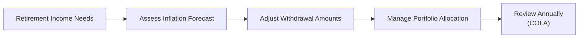

## Introduction

Inflation is the stealthy force that gradually makes everything more expensive: whether it’s your weekly groceries, your dream vacation, or that future college tuition bill for your grandkids. One moment, a $3 cup of coffee seems like a regular expense; give it 10 or 20 years of moderate inflation, and that daily latte might cost double. The implications for wealth preservation can be huge. And yes, it’s easy to overlook this creep in prices—until you realize your once-well-funded financial plan is now falling short because you forgot to factor in inflation and cost-of-living increases.

At CFA® Level III, you’ve likely come across the concept of real returns, inflation-hedged assets, and cost-of-living adjustments (COLA). But here, we explore deeper strategies and practical tips to guard your wealth from purchasing power erosion, drawing connections to global markets, behavioral biases, and multi-asset portfolio considerations. Some solutions, such as inflation-linked bonds, appear straightforward, while others require more nuanced tactics. Before diving into those tactics, let’s start with a big-picture look at why inflation risk matters for high-net-worth and ultra-high-net-worth individuals.

## The Nature of Inflation Risk

Inflation risk arises when the rising cost of goods and services surpasses the growth of an investor’s portfolio. It’s one thing to achieve a 5% nominal return, but if inflation clocks in at 4.5%, your real return barely covers your annual expenses. And let’s be honest: many families simply look at their final portfolio value on a statement, get excited about the gain, but forget that real spending power might not have improved much.

Regional Variations. Because inflation rates differ by region, families with cross-border lifestyles or properties in multiple countries must keep track of each region’s cost changes. For instance, a family living in a relatively stable currency zone but owning property in an emerging market with higher inflation will need to track inflation in both places. That can require a bit of extra homework, but it’s vital for preserving real wealth.

Central Bank Policies. Central banks often adjust interest rates to manage inflation. If you recall from macroeconomics, when inflation spikes, interest rate policies typically tighten. This impacts mortgage rates, borrowing costs, and sometimes equity valuations. So, ignoring central bank moves is never wise in private wealth management. In fact, if you’re looking at Chapter 1.7 (Impact of Macroeconomic Shifts on Wealth Management Models), you’ll see how these policies shape long-term wealth preservation strategies.

## Measuring Real Returns

To see the actual erosion effect of inflation, we focus on real returns. Rather than merely examining your portfolio’s nominal performance, the real return calculation adjusts for inflation to reveal how much you’ve truly gained or lost in purchasing power.

A common approximation:
Nominal Return – Inflation Rate ≈ Real Return

But you’ll encounter more precise formulas in advanced discussions. For instance, you might have:


\text{Real Return} = \left(\frac{1 + r_\text{nominal}}{1 + \text{Inflation Rate}} - 1\right)


where \\( r_\text{nominal} \\) is the nominal return. The point is: you could be earning 8% while inflation runs at 6%. Although 8% feels strong nominally, your real return is only about 2%—still positive, but nowhere near as comfortable as you might think.

Why Real Returns Matter. Real returns tie directly to your goals-based planning (see Chapter 3.1: Goals-Based Financial Planning). A retired individual who needs to maintain a certain standard of living for 40 more years absolutely must track real returns to avoid running out of money too soon. After all, how your cash grows (or doesn’t grow) in relation to the cost of everyday needs is what shapes long-term financial independence.

## Inflation-Hedging Strategies

Your portfolio must include components that stand a fighting chance against rising costs. While no single strategy guarantees immunity from inflation, certain assets can help lessen inflation’s sting.

### Inflation-Linked Bonds (ILBs)
These are often called TIPS (Treasury Inflation-Protected Securities) in the US, but variations exist in different jurisdictions. On the surface, TIPS are a simple idea: the bond’s principal adjusts according to changes in a recognized inflation index (such as the CPI in the United States). If inflation moves up, your principal goes up, which means your interest payments (based on that principal) will also climb. For private wealth clients—particularly those seeking a lower-volatility store of value—this can be attractive.

Pitfall: Real yields on TIPS can sometimes be low or even negative, depending on market conditions. So you don’t just buy them blindly; you track breakeven inflation rates and weigh the opportunity cost against other investments.

### Real Assets
Real estate, infrastructure, and commodities frequently stand out as inflation hedges. Let’s review each briefly:

• Real Estate. In times of rising prices, property values and rental income often keep pace with or exceed inflation. This is why many wealthy families hold commercial or residential real estate as part of their core wealth strategy. Of course, real estate markets can also be subject to local bubbles or downturns—2008 being the poster child—but historically, real estate tends to ride the inflation wave.

• Infrastructure. Toll roads, airports, and utilities sometimes benefit from the ability to increase tolls or fees with inflation. Long-term investors (like families intending to pass on these investments to future generations) find infrastructure appealing for stable cash flows and inflation linkages. You can explore Chapter 4.6 (Alternative Investments in Private Portfolios) for deeper dives on adding alternatives.

• Commodities. Raw materials—oil, gas, metals, agriculture—can jump in price when inflation rises. Holding them directly can be cumbersome (think about where you’d store barrels of oil or lumps of gold), so private wealth managers often use commodity-linked derivatives or mutual funds. Again, timing matters, as commodity prices can be notoriously volatile.

### Equities
Equities are typically championed as long-term inflation hedges. A company that sells goods or services can theoretically raise prices in inflationary periods. Over time, corporate earnings grow (in nominal terms) and stock prices may follow. But equity markets can be rocky, and it’s crucial to be mindful of sector choices. For example, if inflation soars because of spiking energy prices, an airline stock might struggle even though a mining stock could thrive.

Volatility. Keep in mind that in short-term bursts of unexpected inflation, stock prices can get hammered, especially if the market wasn’t anticipating it. So while equities can outpace inflation in the long run, there’s short-term volatility to consider.

## Cost-of-Living Adjustments (COLA)

If you’re supporting a multi-generational family, you can’t just set a static spending plan today and expect it to stand up to price increases 20 years later. That’s where COLA (Cost-of-Living Adjustments) comes into play. Many pension plans (public and private) have a built-in COLA formula so benefits keep pace with inflation. On the private wealth side, you can mimic this approach by systematically adjusting withdrawal rates or incomes to reflect a target inflation measure.

Let’s do a quick scenario. Suppose you retire with a nest egg of $10 million and project an annual withdrawal of $400,000. If inflation is 3%, that annual withdrawal effectively needs to be $412,000 next year to preserve the same standard of living. This compounding effect continues year after year—5, 10, 20 years into retirement. If you fail to incorporate some adjustment mechanism, you may inadvertently short-change your future self.

Below is a simple flowchart illustrating how COLA considerations fit into a broader retirement income plan:

## Currencies and Inflation

Exchange rate fluctuations can exacerbate or mitigate domestic inflation. A stronger currency in your home country might make imports cheaper, offsetting local inflation. Conversely, if your currency weakens while local inflation is high, you’re hit with a double whammy. This also matters if you’ve got properties, businesses, or philanthropic ventures in various nations.

Currency Diversification. Some private wealth managers advocate assembling a basket of currencies or investments in stable currency zones (e.g., Swiss franc). Others hold the viewpoint that a global equity portfolio implicitly provides some degree of currency diversification. The best approach usually involves a blend of currency-aware investing that lines up with your projected liabilities in each currency.

## Psychological and Behavioral Aspects

I’ll never forget the time I explained inflation to a friend who said, “2% inflation? That’s basically nothing.” At first glance, yes, 2% doesn’t seem huge. Then you multiply that over 30 years, and realize you can lose nearly half your purchasing power if you’re not paying attention to real returns. We humans are wired to focus on short-term experiences—we see the big jump in nominal value and assume all is well. 

Behavioral Pitfall: Money Illusion. Investors who suffer from money illusion might feel wealthy because their account balance is growing, oblivious to the fact that real purchasing power might be flat or even declining. Overcoming that requires scenario modeling, like the simulation exercises in Chapter 3.7 (Scenario Analysis and Stress Testing for Private Wealth Plans). Walking clients through an “inflation shock” scenario—e.g., 6% inflation for 5 years—can highlight the need for inflation hedges.

## Action Steps

Integrating inflation-protection strategies into a portfolio doesn’t have to be complicated, but it should be systematic. Here are some best practices:

• Asset Allocation with an Inflation Buffer. Revisit portfolio allocations periodically to ensure a healthy distribution across assets with the potential to outpace inflation (stocks, real estate, certain commodities, inflation-linked bonds).

• Ongoing Adjustments. Regularly revise financial targets, especially consumption and retirement goals, to factor in new inflation data. Link these updates to a recurring review process. (For structured policy, see Chapter 4.5 on Incorporating Behavioral Finance and Client Preferences.)

• Monitor Central Bank Policy. Keep track of interest rate changes and inflation expectations. The bond market’s “breakeven inflation rate” (the yield difference between nominal bonds and ILBs) can be a quick yardstick for forward-looking inflation expectations.

• Global Portfolio Perspective. If you hold assets abroad or have an international family, tailor your inflation assumptions for each relevant region. The complexities multiply, but so does the opportunity to smooth inflation risk across different geographies.

## Common Pitfalls

• Underestimating Inflation. Especially when inflation sits at 2% or 3%, investors may feel comfortable ignoring it. Over decades, even moderate inflation can blunt future spending power.

• Neglecting Real Return Focus. Not repositioning your portfolio after factoring in inflation adjustments can derail your financial goals. Always measure your returns on a real basis, especially for retirement calculations.

• Overconcentration in One Region. If your entire portfolio is in a currency zone that suddenly experiences high inflation, you may have limited recourse. Diversification isn’t a silver bullet, but it helps.

• Emotional Biases. Clients who see nominal gains might push back against rebalancing toward inflation-protective assets. Communicating the difference between nominal vs. real returns and performing scenario stress tests can help mitigate these biases.

## Exam Tips for the CFA® Level III

• Be prepared for scenario-based questions where a family’s expenses grow over time. You’ll need to identify which inflation-hedging asset class is most appropriate based on specific constraints and risk tolerance.  
• You might see constructed-response questions focusing on real return calculations: Know how to quickly approximate real yields on TIPS, or how to measure inflation impact on a multi-asset portfolio.  
• When asked to incorporate COLA in retirement distributions, show how you factor an inflation forecast into your annual withdrawal plan.  
• For portfolio management item sets, watch for subtle references to currency mismatch or cross-border spending. Suggest appropriate hedges to preserve purchasing power.  

## References

• “Guide to Inflation Hedging Strategies: TIPS and Beyond” – Pimco White Paper.  
• Bodie, Kane & Marcus, “Investments,” with sections on inflation-indexed securities, real assets, and commodity investments.  
• CFA Institute publications on inflation, real returns, and global diversification strategies.  
• Chapter 3.7 (Scenario Analysis and Stress Testing for Private Wealth Plans) for advanced modeling techniques.  

## Test Your Knowledge: Inflation Hedging & Real Returns Quiz



### Which best describes the key risk of ignoring inflation in wealth planning?

- [ ] The portfolio may have excessive volatility.  
- [x] The portfolio’s purchasing power may erode over time.  
- [ ] The portfolio may become too speculative.  
- [ ] The portfolio’s nominal returns may increase significantly.  

> **Explanation:** When you overlook inflation, nominal returns might look impressive, but you lose sight of how much purchasing power is actually retained. Over long horizons, inflation can drain the portfolio’s real value.

### An inflation-linked bond (such as a TIPS) generally adjusts which of the following?

- [ ] The interest rate only.  
- [x] The principal in line with an inflation index.  
- [ ] The bond’s credit risk level.  
- [ ] Nothing—it simply pays coupon interest.  

> **Explanation:** TIPS and other inflation-linked bonds often adjust the bond’s principal according to official inflation indexes, making coupon payments and final redemption amounts reflect real values over time.

### What is the primary reason real assets (e.g., real estate, commodities) help hedge inflation?

- [x] Their values often move in tandem with rising prices of goods and services.  
- [ ] They are generally immune to economic cycles.  
- [ ] They are regulated by government policies to ensure price stability.  
- [ ] They have fixed returns that exceed inflation.  

> **Explanation:** Real assets typically rise in price when inflation climbs, since their underlying value is driven by tangible factors tied to production and consumption. This linkage can help offset inflation risk in a portfolio.

### Which statement about cost-of-living adjustments (COLA) is correct?

- [x] COLA ensures that retirement payouts or withdrawals are periodically rebased to match inflation.  
- [ ] COLA is exclusively used by government pension systems.  
- [ ] COLA guarantees returns above market indexes.  
- [ ] COLA eliminates the need to hold inflation-hedged assets.  

> **Explanation:** COLA is an income or benefit adjustment mechanism that matches or exceeds inflation, ensuring real income does not deteriorate over time.

### Why might equity exposure serve as a long-term inflation hedge?

- [x] Corporate earnings can align with or exceed inflationary trends.  
- [ ] Stock prices are fixed once purchased.  
- [x] Stocks typically pay fixed dividends.  
- [ ] Stocks do not fluctuate with business cycles.  

> **Explanation:** Equity investments can often outpace inflation over the long term as companies raise prices and pass higher costs on to consumers. This is not guaranteed, and near-term volatility can be significant.

### How does currency diversification affect inflation risk?

- [x] Holding multiple currencies may mitigate impact if one region experiences higher inflation than another.  
- [ ] Multiple currencies always decrease portfolio returns.  
- [ ] Currency hedges are only beneficial in developed economies.  
- [ ] Currency diversification cannot reduce inflation risk at all.  

> **Explanation:** Maintaining different currency exposures can sometimes offset local inflation spikes or currency devaluations in a single region.

### What is the main advantage of scenario analysis for inflation planning?

- [ ] It automatically rebalances the client’s portfolio.  
- [x] It visualizes potential outcomes under various inflation levels.  
- [ ] It eliminates uncertainty entirely.  
- [ ] It replaces fundamental analysis of assets.  

> **Explanation:** Scenario analysis allows investors to see a range of results if inflation runs higher (or lower) than expected, helping with more informed decision-making and stress-testing.

### A portfolio yielding 6% in a region with 3% annual inflation has a real return close to which figure?

- [x] 3% real return.  
- [ ] 6% real return.  
- [ ] 9% real return.  
- [ ] -3% real return.  

> **Explanation:** Subtracting 3% inflation from a 6% nominal yield nets about 3% real return, ignoring compounding nuances. This is the approximate measure of the portfolio’s true growth in purchasing power.

### In times of unexpected inflation spikes, which of the following is commonly observed in equity markets?

- [x] Increased volatility due to higher uncertainty about future earnings.  
- [ ] Guaranteed positive returns because businesses can raise prices.  
- [ ] Immediate rally in all sectors.  
- [ ] No impact whatsoever.  

> **Explanation:** Equity markets can become unstable during sharp inflationary periods, as investors reassess growth, interest rate changes, and corporate profit margins.

### True or False: Investors frequently suffer from "money illusion," focusing on nominal gains while ignoring real purchasing power.

- [x] True  
- [ ] False  

> **Explanation:** Money illusion is a behavioral bias in which investors and consumers fixate on nominal currency values, overlooking how inflation diminishes actual purchasing power.


