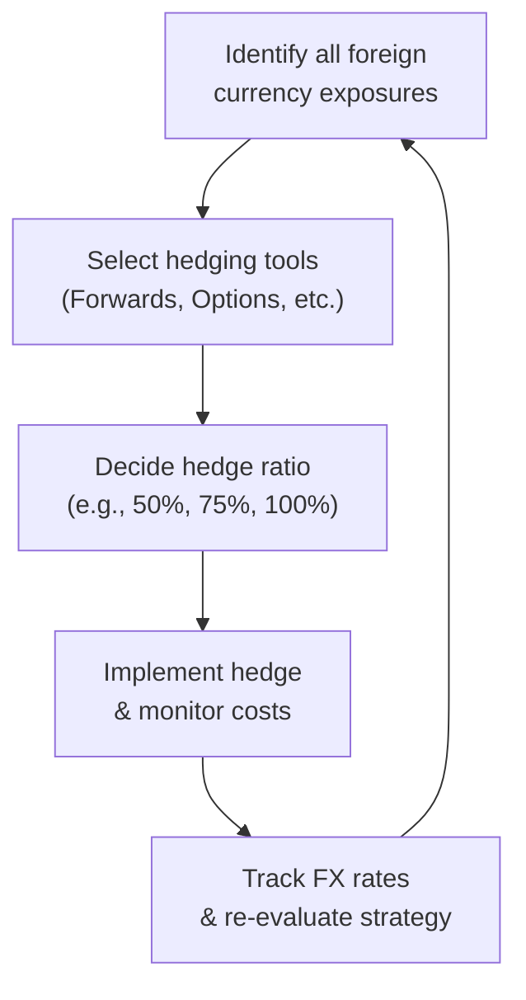

## Introduction
So—have you ever traveled abroad and noticed how the exchange rate can make your wallet feel a little heavier or lighter than expected? Well, imagine that same rate shift amplified across multiple properties, active businesses, and diversified portfolios peppered around the globe. That’s precisely what many high-net-worth individuals (HNWIs) face every day. Exchange rate volatility can seriously impact the value of assets, liabilities, or future cash flows denominated in foreign currencies. 

By now, you’ve seen how difficult consistent preservation of wealth can be (especially if you’ve peeked at Section 5.1 on risk to human capital, or 4.7 on coordinating onshore and offshore investments). Currency fluctuations just add another layer to that complexity. The good news is that thoughtful hedging tactics, combined with an understanding of how currency markets move, can help you and your clients avoid unpleasant foreign-exchange surprises. 

Below, we’ll explore best practices to manage exchange rate volatility—from measuring exposures to implementing hedging strategies like forwards, options, swaps, or natural hedges. We’ll also chat about trade-offs involved in hedging, discuss setting a currency policy, and outline steps to keep an eye on the process over time. 

## Impact of Currency Fluctuations on Wealth
When you hold or receive a foreign currency, any fluctuation in the exchange rate may boost or reduce your local currency value. If you’re a multi-residence family with, say, estate properties in Europe, rental income in euros might lose real purchasing power if that currency depreciates. On the other hand, a U.S. tech entrepreneur paying salaries in Australian dollars for an overseas operation might unexpectedly pay more if the Australian dollar rallies. 

This phenomenon can be summarized with a simple equation for a position’s value:

V_home = V_foreign × (Spot Rate_home/foreign).

• V_home = Value in the home currency.  
• V_foreign = Value in the foreign currency.  
• Spot Rate_home/foreign = The spot exchange rate quoted as home currency per foreign currency.

A 2% shift in the exchange rate can mean big money at scale. Wealth management clients, especially those with global footprints, make exchange-rate risk considerations a central part of any long-term preservation strategy.  

## Currency Risk Assessment
Before diving into any hedging solution, it’s best to quantify and categorize exposures. Ask: What fraction of your client’s total wealth or liabilities is exposed to a foreign currency? Are there specific correlations among these currencies? Also, do you see any bridging effect across your client’s personal and business interests?  

The idea is simple:  
1. Identify the foreign currencies in question (e.g., USD, EUR, GBP, CHF, JPY).  
2. Assess the relative size of each exposure (assets vs. liabilities).  
3. Evaluate correlation patterns. For instance, a client might have exposure to both the euro and the Swiss franc, which sometimes move in tandem (though not always).  
4. Compare currency exposures to the client’s base or home currency.  

When you know which currencies pose the most risk, you can intelligently plan. For instance, a retiree living in Australia but collecting a pension in U.S. dollars has a regular “positive” exposure to USD. If the U.S. dollar falls relative to the Aussie dollar, her monthly pension can suddenly feel a lot smaller. That risk is painfully clear if you track it over time.  

## Hedging Tools and Techniques
After you identify exposures, you may need to neutralize or offset them. While there’s no magic bullet (I wish there were!), you have a few proven tactics at your disposal:

### Forwards and Futures
A forward is a private agreement to buy or sell a currency at a specified future rate on a specific date. Futures are similar contracts but trade on an exchange with standardized features and daily settlement. These instruments effectively lock in the price now for a transaction in the future.  

They’re often used when clients want predictability—like a property purchase in six months or an expected repatriation of business profits next quarter. Be mindful that forward or future contracts require capital or margin requirements and may create missed opportunity if the currency unexpectedly moves in your favor.

### Options
Currency options give the purchaser the right, but not the obligation, to exchange a currency at a pre-agreed rate. If the exchange rate moves favorably, you can let the option expire and enjoy gains from the spot market. If rates move unfavorably, you can exercise the option and lock in a known cost.  

Options can be costlier because you pay a premium up front. But hey, if you want flexibility, paying a premium may be worth it. This tool also helps reduce regrets if your currency exposure moves in a beneficial direction—since you don’t have to exchange at the strike price if you don’t want to.

### Currency Swaps
Swaps involve exchanging principal and interest payments in one currency for the equivalent amounts in another. This is particularly relevant for families or corporations that service foreign-denominated debt. You can transform your payment obligations from one currency to another without necessarily unwinding your entire position.  

For example, if you have a U.S.-dollar denominated bond but your main business revenues are in euros, a swap can match interest flows in the same currency as your income, reducing exchange risk.

### Natural Hedging
Before you jump to derivatives, check if you can achieve internal offsets or “natural hedges.” Perhaps your foreign-currency denominated sales can cover your foreign-currency expenses. If your client invests in a foreign asset that produces income in the same currency as their foreign liabilities, the net exchange rate exposure might be small.  

Natural hedging often costs little and can be extremely efficient if the amounts match. However, it might be less flexible if your assets and liabilities are mismatched in timing or amount.

## Trade-Offs in Hedging
Let’s face it: While hedging can reduce volatility, it might limit upside as well. Sometimes a currency moves favorably, and a forward contract “locks” you out of potential gains. Meanwhile, if you use options, you pay a premium that erodes returns when the currency moves in your favor. 

Some wealth managers adopt partial hedges—say, hedging only half of a foreign-exchange exposure. This approach lowers the cost of hedging while still reducing part of the risk. Dynamic hedging is another solution: adjusting the hedge ratio depending on changing market conditions or volatility triggers. In good times, the hedge ratio might be dialed down; in turbulent times, it’s ramped up.  

The right solution depends on your client’s risk tolerance, time horizon, and personal preferences. A 20-year horizon might be comfortable with more “wiggle room” for favorable exchange movement, while a philanthropic foundation distributing money next year probably prefers more certainty.

## Setting a Currency Policy
Preparing a formal currency policy is often wise, especially for complex families or family offices. The policy might specify:  
• A strategic hedge ratio (e.g., hedge 60% of all foreign exposures).  
• Approved instruments (forwards, options, or swaps).  
• Decision authority (e.g., the family’s investment committee).  
• Target horizon for rebalancing or adjusting the hedge position.  

By setting a strategic framework, you ensure consistent decisions rather than ad hoc, knee-jerk responses to short-term noise. It’s somewhat like budgeting—repetitive, methodical, but oh-so-important for safeguarding the bigger picture.

## Monitoring and Rebalancing
Currencies are notoriously fickle. Ok, not always, but the market is huge, it trades 24/5, and it can be influenced by geopolitical tensions, interest rate differentials, and risk sentiment. That’s why you should track these variables carefully.  

1. Compare actual exchange rates with your baseline or policy assumptions.  
2. Look for “trigger points” if you’re using a dynamic strategy—like a maximum allowable deviation.  
3. Watch out for changes in the client’s personal situation (new cross-border investments, shifting family needs, or changes in business operations).  

If you had hedged a year’s worth of currency exposure and the year is up, it’s time to revisit the hedge. Even if that year isn’t up, large exchange rate swings might justify rebalancing earlier.

## Action Steps
Putting it all together, here’s a quick run-through:

• Identify currency exposures. Include all foreign currency assets, liabilities, and income streams—like real estate holdings in London, or a Singapore-based trust.  
• Consult with experts if necessary. Some forward contracts require advanced negotiation with banks or prime brokers. Options and swaps can also be somewhat complex.  
• Decide the hedge ratio that fits your client’s risk appetite. Zero hedging is extreme. Full hedging can be expensive and might limit upside. In practice, many settle somewhere in between.  
• Perform a cost-benefit analysis. Factor in option premiums or possible missed gains when you lock in forwards.  
• Monitor regularly. Exchange rates definitely don’t like to sit still. You might need to rebalance or adapt as conditions change.

## Case Example: A Dual-Currency Household
Imagine a family splitting time between Canada and France. They have a Canadian-dollar investment portfolio but maintain a French property generating rental income in euros. They also plan to send funds from Canada to France every eight months for property upgrades.  

• Risk: The Canadian dollar (CAD) could decline significantly against the euro (EUR), making each renovation more expensive in CAD terms.  
• Hedging Approach: The family engages in forward contracts to secure the conversion rate on predictable sums to be transferred. Meanwhile, they keep partial exposure unhedged to capture potential upside if the euro weakens.  
• Monitoring: They review exchange rates monthly. If EUR/CAD goes beyond a threshold, they roll forward into new contracts to update the hedge.  

Through mindful structuring, they maintain consistent out-of-pocket costs for their French property upkeep, ensuring peace of mind no matter how the currency wind blows.

## Visualizing the Hedging Process

The diagram shows a continuous loop: you identify exposures, select the right tool and hedge ratio, implement the hedge and monitor costs, observe changes in FX markets, and re-evaluate or adjust as needed.

## Best Practices, Pitfalls, and Challenges
• Best Practices:  
  - Maintain liquidity to meet potential margin calls, especially if you use futures or larger forward positions.  
  - Document your strategy in your Investment Policy Statement (IPS) so that all stakeholders understand your approach to managing currency exposure.  
  - Consider cross-asset correlations; sometimes an unfavorable currency move might be offset by a rise in local asset values.  

• Common Pitfalls:  
  - Ignoring Passive Exposures: People often forget that owning foreign stock indexes or global bond funds might create subtle currency exposures.  
  - Overhedging: Hedge more than you actually own or owe, leading to speculation instead of protection.  
  - Timing Mistakes: Rolling forward hedges randomly or forgetting to roll them at all, leaving you unexpectedly unhedged during a spike in volatility.  

• Challenges:  
  - Forecasting exchange rates is notoriously difficult. Don’t rely heavily on predictions that your base currency “always beats” others.  
  - Macro policy changes (like major central bank interventions) can create abrupt rate-driven shocks.  

## Final Exam Tips
• Constructed Response: You might see scenario-based questions asking you to calculate gains or losses from a forward contract or weigh the pros/cons of a dynamic hedge ratio. Be thorough with your calculations. Show all steps clearly.  
• Item Sets: Expect to interpret vignettes describing a family with multiple foreign liabilities or incomes, then pinpoint the correct hedging approach.  
• Time Management: Practice short, clean numeric examples. If you see a big chunk of text, break it down systematically—identify exposures, consider instruments, weigh the trade-offs, and propose a solution.  
• Terminology: Make sure you know the difference between “notional principal” in a swap, “strike price” in options, and “settlement” for forwards/futures.  

## References
• Madura, Jeff. “International Financial Management.” (Discusses various currency derivative products and advanced hedging strategies.)  
• CFA Institute, Level III Curriculum, “Currency Management.” (Focus on the official reading that includes forward/futures payoff diagrams and real-case examples.)  
• Vanguard Research, “Currency Hedging in Portfolios: When, Why, and How.” (A balanced perspective on partial vs. full currency hedges and cost considerations.)

--------------------------------------------------------------------------------

## Test Your Knowledge: Managing Exchange Rate Volatility Strategies



### 1. Which of the following steps best describes an initial currency risk assessment process?

- [x] Identify all foreign-currency holdings and liabilities, then assess correlations with the home currency.
- [ ] Enter into a forward contract immediately upon identifying a foreign-currency liability.
- [ ] Determine a strategic hedge ratio, then predict FX movements for the next five years.
- [ ] Convert all foreign-denominated assets into the home currency.

> **Explanation:** The first step is to identify and quantify exposures. Correlations, size, and type of exposure must be understood before deciding how to hedge.

### 2. A currency forward contract:

- [ ] Grants the holder the right, but not the obligation, to buy or sell currency.
- [x] Obligates both parties to exchange currency at a specified rate on a future date.
- [ ] Is always traded on centralized exchanges.
- [ ] May be exercised only if it has intrinsic value.

> **Explanation:** A forward is an obligation for both parties, over the counter, and does not provide the flexibility of an option contract.

### 3. Which of the following might occur if a portfolio is fully hedged and the foreign currency strengthens significantly?

- [ ] The portfolio gains more from the currency appreciation.
- [ ] The portfolio experiences no change in overall value.
- [ ] The portfolio is effectively short the foreign currency.
- [x] The investor may miss out on potential gains from the currency move.

> **Explanation:** A full hedge protects against currency losses but also forfeits potential gains from currency appreciation.

### 4. An investor who needs to finance ongoing euro-denominated expenses in six months and wants to lock in the cost using an exchange-traded product would most likely use:

- [ ] A currency option.
- [x] A currency futures contract.
- [ ] A currency swap.
- [ ] A natural hedge.

> **Explanation:** Currency futures are standardized, exchange-traded instruments that lock in a future exchange rate and are commonly used for shorter-term hedging needs.

### 5. If a client holds USD-denominated assets but has liabilities in CAD, which approach is considered a natural hedge?

- [x] Acquiring CAD-denominated assets or revenue streams that match CAD liabilities. 
- [ ] Buying CAD call options.
- [x] Matching incoming cash flows in CAD with outgoing obligations in CAD. 
- [ ] Taking no action on currency.

> **Explanation:** A natural hedge arises when asset cash flows and liabilities are in the same currency, reducing the need for formal derivatives.

### 6. A partial or dynamic hedge strategy can be advantageous because:

- [x] It may lower total hedging costs while still reducing some currency risk.
- [ ] It always captures the full upside potential of currency movements.
- [ ] It never requires ongoing monitoring.
- [ ] It eliminates all forms of currency exposure.

> **Explanation:** Partial or dynamic hedges aim to balance cost effectiveness with volatility reduction, but they still require monitoring and do not guarantee exposure elimination.

### 7. Overhedging may lead to:

- [x] A speculative position in which the investor’s net exposure could move against them.
- [ ] Perfect neutralization of foreign currency exposure.
- [x] Situations where the investor owes more currency than the natural exposure.
- [ ] Greater profits in all cases when the home currency declines.

> **Explanation:** Overhedging involves hedging more exposure than necessary, effectively creating a speculative short position in the foreign currency.

### 8. Which is a standard component of a formal currency policy?

- [x] Strategic hedge ratio guidelines.
- [ ] Mandatory daily currency forecasts from the central bank.
- [ ] Zero tolerance for any uncovered foreign assets.
- [ ] A requirement to use only options-based hedging.

> **Explanation:** The policy typically sets the hedge ratio, instruments allowed, and governance rules. Mandatory daily forecasts or forcing only one type of hedging mechanism is not standard practice.

### 9. A currency swap is typically used to:

- [x] Exchange principal and interest payments in different currencies.
- [ ] Acquire the right, but not the obligation, to buy currency at a specified rate.
- [ ] Guarantee a payoff if the spot rate goes below the strike.
- [ ] Lock in the purchase price of a commodity in a foreign currency.

> **Explanation:** A swap involves exchanging principal and interest, often for matching liabilities and assets in different currencies.

### 10. True or False: Setting a static, one-time currency hedge and never rebalancing is considered best practice.

- [x] False
- [ ] True

> **Explanation:** Best practice calls for ongoing monitoring and rebalancing since currency markets fluctuate, and clients’ needs can shift over time.


