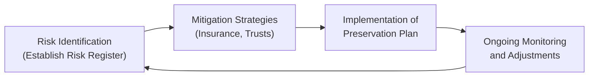

Introduction  
Wealth preservation can sometimes feel overwhelming. You know that moment when you realize there’s so much that could go wrong—market crashes, currency fluctuations, new regulations, or even personal emergencies—and you’re like, “Ah, where do I even start?” This section will help you build a truly comprehensive approach to protecting what you’ve accumulated, whether you’re just starting out or you’ve been in the game for years.

This topic connects closely to other parts of Chapter 5 on Preserving the Wealth (like identifying human capital risks in 5.1 or maintaining comprehensive insurance coverage in 5.2). We’ll walk through how to integrate these ideas into one overarching plan, coordinate multiple professionals, and create a structured process that ensures your wealth not only survives but thrives.

## Holistic Planning  
We’ve all heard the saying, “Don’t put all your eggs in one basket,” right? Well, a holistic wealth preservation strategy takes that idea and does a whole lot more. It’s not just about diversifying investments—though that matters. It’s about understanding every risk you face, then creating a sturdy umbrella that combines protection elements into one cohesive framework.

Holistic planning is crucial because wealth is rarely threatened by a single risk alone. Inflation might be your main worry this year, while next year it could be unexpected health costs or a steep drop in local real estate markets. By focusing on a plan that integrates your human capital (the skills, earning potential, and personal brand you bring to the table), insurance coverage, currency strategies, estate planning, and even philanthropic goals, you have a better chance of weathering all sorts of storms.

Above all, the idea is to align near-term priorities—like ensuring cash flow for living expenses and ensuring you have the right insurance coverage—with your longer-term vision, which might include transferring wealth to your children or philanthropic causes mentioned in Chapter 7 on Transferring the Wealth.

### Aligning Short-Term and Long-Term Goals  
Imagine software developers rolling out a new app. They typically release a “minimum viable product” first (short-term objective) while still having a five- or ten-year roadmap in mind (long-term vision). Wealth preservation planning works similarly. You organize your immediate resources (liquidity, insurance, currency hedges) to minimize risk in the near term while keeping an eye on your ultimate legacy, such as philanthropic endeavors or multi-generational wealth transfers.

#### Simple Example  
Let’s say you’ve got a big philanthropic goal to establish a major scholarship fund in 20 years. Meanwhile, you also worry about the rising costs of healthcare. A holistic plan might say:  
1. Secure health insurance with special riders for critical illnesses (short-term).  
2. Open a trust that systematically allocates a portion of your annual income toward the scholarship fund (long-term).  
3. Invest in inflation-hedged assets (like inflation-linked bonds) so the scholarship fund’s real value remains intact, which addresses an in-between need.

This synergy ensures no stone is left unturned, from immediate medical coverage to philanthropic ambitions.

## Multi-Disciplinary Approach  
Another fun twist in wealth management—okay, maybe “fun” is not the right word, but you get the gist—is that it is rarely a solo job. You typically need attorneys, tax advisers, financial planners, insurance specialists, sometimes a family therapist, and maybe even a philanthropic advisor, all working in tandem.

Why does that matter? Because each professional has a different perspective on your assets. For instance:  
• Your tax accountant sees how your wealth is taxed and can guide you to structures that reduce your tax burden.  
• Your lawyer ensures legal structures—like trusts or limited partnerships—support your family governance goals and mitigate risks of personal liability.  
• Your financial planner or investment professional can align your assets with your desired risk-return profile while also ensuring diversification.  
• Your insurance advisor can identify coverage gaps or propose specialized solutions, like key-person insurance if you hold a leadership role in a family business.

At times, these professionals may inadvertently pull you in different directions—an accountant might prioritize minimizing current taxes, while an estate lawyer might focus on maximizing intergenerational wealth transfer. A multi-disciplinary approach ensures they coordinate effectively, balancing each goal without letting one area overshadow the rest.

## Components of a Preservation Plan  
A comprehensive wealth preservation plan is more than just a “buy insurance and hope for the best” approach. It involves thoroughly mapping out your risks, actively seeking ways to mitigate them, ensuring you have contingency strategies, and so on.

### Risk Register  
Sometimes, I like to think of the risk register as a giant “to-do” and “to-watch-out-for” list. You systematically identify potential threats, be they market-related, personal (like a sudden disability that interrupts your earning ability), or regulatory.

A sample risk register might look something like this:

| Risk                              | Description                                             | Likelihood | Impact  | Mitigation or Response                   |
|-----------------------------------|---------------------------------------------------------|-----------|---------|------------------------------------------|
| Market Volatility                 | Sudden drop in equities or bond prices                 | Medium    | High    | Diversified asset mix                    |
| Currency Fluctuation              | Foreign exchange rate swings for overseas investments  | High      | Medium  | Currency hedges, multi-currency accounts |
| Medical or Disability Emergency   | Potential long-term disability affecting income        | Low       | High    | Disability insurance, emergency fund     |
| Regulatory/Tax Law Changes        | Changes in tax codes or local regulations             | Medium    | Medium  | Ongoing consultation with specialists    |
| Business Failure (if applicable)  | If you own a family business, sudden business failure  | Low       | High    | Insurance, legal structuring, coverage   |

Notice how we estimate the likelihood and impact of each risk. This helps you prioritize which ones deserve immediate attention (like disability or currency hedging) versus which might be smaller on your radar.

### Mitigation Actions  
Now that you’ve identified your top risks, how do you mitigate them?

• Insurance Coverage: Ranges from life insurance and property insurance to more specialized types like key-person or private health plans.  

• Legal Structures: Trusts, LLCs, or family limited partnerships can protect personal assets from litigation or unforeseen liabilities.  

• Guardianship Directives: If you have dependents, establishing guardianship or having powers of attorney ensures continuity and clarity if you’re incapacitated.  

• Trust Mechanisms: Revocable living trusts, generation-skipping trusts (GST), or spousal lifetime access trusts (SLATs) can minimize estate taxes and ensure that assets transfer efficiently.

### Contingency Planning  
Think of contingency planning as your “Plan B.” Actually, it might be your Plan C, D, or E, depending on how many fallback options you want. This includes having liquidity in place for emergencies—whether it’s a market downswing or a need to pivot your business strategy.

• Cash-on-Hand: Typically, in personal finance, advisors suggest three to six months of living expenses. But for high-net-worth individuals with complex assets, sometimes a year or more of easily accessible capital is warranted, especially if there’s significant entrepreneurial exposure.  
• Backup Lines of Credit: Some individuals secure revolving credit or home equity lines as additional safety nets.  
• Succession Plans: If you run a firm or have a controlling stake in a business, who steps in if you can’t lead anymore?

Having all these strategies spelled out, in writing, helps ensure no one panics in a crisis. Instead, you’ll calmly pull out your playbook and say, “Here’s what we do next.”

## Periodic Reviews and Updating  
Ever buy a smartphone and realize that after a year, it’s practically outdated? Wealth preservation plans can feel like that, too. Between market volatility, changes in your personal life (like marriage or new children), or updated regulations, it’s crucial to review your plan on a regular schedule—maybe annually or every two years.

### Key Review Triggers  
• Regulatory Changes: If a new tax law targets certain trust structures, you might need to re-examine your estate plan.  
• Life Events: Marriage, divorce, birth of a child, or health changes often necessitate new provisions.  
• Market Shifts: A significant recession or an unexpected market boom can each pose new risks or open up new hedging strategies.

Scheduling these reviews with your multi-disciplinary team ensures alignment. For instance, you don’t want your lawyer drafting a new trust that your financial planner doesn’t know about, or your insurance coverage to expire without your accountant factoring that in.

## Documentation and Accessibility  
Picture someone rummaging through drawers, trying to find a 10-year-old insurance policy while in the middle of a crisis. It’s stressful. Documentation and accessibility revolve around making sure the crucial components of your wealth preservation plan are:  
1. Properly documented, in full detail.  
2. Hard to lose (usually with secure digital backups).  
3. Accessible to the relevant people (like your family members or trustees).

### Best Practices  
• Central Repository: Some folks use dedicated cloud storage with multifactor authentication. Others lock everything in a physical vault with scanned digital copies.  
• Authorized Access: Make sure that if something happens to you, your spouse, executor, or trustee can actually access the documentation.  
• Regular Updates: If you revise your will, trust documents, or insurance details, update the repository as well.

## Measuring Plan Effectiveness  
Alright, so how do you even know if your plan is doing its job? One approach is to compare actual outcomes against stated goals. For instance, if your plan aimed to limit annual portfolio drawdowns to, say, 10% in a market downturn, measure your real performance. Did you only lose 8% while the broader market dropped 15%? That’s a sign your plan is working.

Similarly, track whether you’ve maintained your estate’s real value after inflation. Often a simple real-return calculation can be used:


\text{Real Return} = \left(\frac{1 + \text{Nominal Return}}{1 + \text{Inflation Rate}} - 1\right) \times 100\%


If your inflation rate is 3% and your nominal return is 8%, your real return is roughly 4.85%. Regularly checking this metric can show if your wealth truly stays ahead of purchasing-power erosion, a key objective highlighted in 5.3 (Countering Inflation and Cost-of-Living Erosion).

## Action Steps  
So, let’s piece this together into a tangible game plan:

• Draft a Formal Preservation Plan: Bring in all the risk register items, mitigation tactics, insurance details, estate planning goals, and communication protocols into one official document. It might be lengthy, but it’s the cornerstone of your entire approach.  
• Communication Protocol: Outline how you’ll share updates: maybe an annual meeting with the entire advisory team, plus a monthly financial statement or bulletin for family members.  
• Technology Solutions: Consider specialized software that sets up reminders for premium payments, trust distribution deadlines, and any other cyclical tasks.  
• Assign Responsibilities: Perhaps your accountant leads the charge on tax optimization. Your lawyer ensures trusts and guardianships stay current. A designated family member or trustee can be the “go-to” person to maintain a version-controlled repository.

### Wealth Preservation Plan Workflow Diagram  
Below is a simple flowchart showing how these ideas connect:

The best part of seeing it in a loop is that it drives home how this is an iterative process. You don’t just set it and forget it.

## Case Study: The Tan Family  
Quick anecdote to illustrate how all these concepts come together: The Tan family—fictional, but based on real-world experiences—runs a successful cross-border e-commerce business. Mr. and Mrs. Tan are both in their mid-40s, with two teenage children. They’re looking to preserve wealth for themselves and eventually for philanthropic activities in their home community.

1. Risk Register: They’re worried about currency changes (since they hold assets in multiple countries), potential tax changes, business liabilities, and future educational costs for their kids.  
2. Mitigation Actions: They set up a trust for the business, purchased additional cross-border medical insurance, and allocated a portion of their equity into foreign currency–denominated government bonds.  
3. Contingency Planning: They retained a line of credit secured by their real estate, just in case.  
4. Periodic Review: They do annual reviews and whenever major legislative changes are announced—particularly in the countries where they maintain operations.  
5. Documentation: They store all trust deeds, policy documents, and insurance details in a secure cloud folder. They also keep a physical copy in a safe deposit box.  
6. Measuring Effectiveness: They track how their wealth compares each year against inflation, and they watch for any changes in foreign exchange rates that might require hedging adjustments.

All these steps together form The Tan Family’s comprehensive wealth preservation strategy. You can see how multiple professionals—lawyers, accountants, and financial advisors—collaborate to ensure that no single area gets neglected.

## Common Pitfalls and Challenges  
No plan is bulletproof. Sometimes folks overlook minor details that snowball into major headaches.

• Over-Reliance on a Single Professional: Relying only on an accountant or only on your estate lawyer might lead to blind spots. Having a broad team avoids that.  
• Inadequate Liquidity: Holding a significant portion of your wealth in illiquid assets, like private equity or real estate, can cause major issues if you need emergency cash.  
• Neglecting International Aspects: If you have assets or family members in multiple countries, plan for cross-border estate taxes, currency hedging, and so forth.  
• Failing to Communicate with Heirs: Surprises at the reading of a will might spark family conflicts. Transparent discussions up front can prevent misunderstandings and conflicts later.

## Conclusion  
Developing a comprehensive wealth preservation plan is all about weaving together every dimension of risk management—human capital, insurance, tax optimization, inflation hedging, currency stability, and so on—under a single, cohesive strategy. By collaborating with multiple professionals, reviewing and updating regularly, keeping everything well-documented, and measuring effectiveness, you can help safeguard your family’s financial future.

This type of plan isn’t just a fancy binder you purchase off the shelf. It’s a living, breathing framework you revise as your life journey unfolds. Embrace it, keep it fresh, and it’ll serve you well for decades to come.

## Final Exam Tips  
• Outline Key Components: When answering essay questions on wealth preservation, emphasize the risk register, mitigation strategies, documentation, and periodic reviews.  
• Connect the Dots: Show how wealth preservation extends beyond just buying insurance. Demonstrate how it integrates estate planning, tax optimization, and your overall portfolio.  
• Illustrate with Examples: The CFA Level III exam loves scenario-based questions. Bring up either personal or hypothetical illustrations that show you know how to apply the theory.  
• Keep an Eye on Behavioral Aspects: Remember that emotional and behavioral biases might prevent clients from adopting or maintaining a thorough preservation plan. Cite relevant concepts if you see them.  
• Time Management: In an exam setting, if you see a question on wealth preservation, map out your “risk register” approach for the scenario provided, propose a few mitigating actions, highlight any estate or tax considerations, and mention communication plans. Don’t drown in detail, but demonstrate you know the big picture.

## References  
• Geneen Roth, “Women, Food, and God.” Though not finance-related, it can spark broader thinking about true priorities and values alignment.  
• James E. Hughes Jr., “Family Wealth—Keeping It in the Family.” Focuses on comprehensive legacy and generational wealth planning.  
• CFA Institute’s Private Wealth Management Readings: Provide deeper insights and case studies on integrated financial planning.  
• American Bar Association’s “Estate Planning for the Modern Family.” Good resource for understanding current estate laws and trust structures.

----------

## Test Your Knowledge: Comprehensive Wealth Preservation Planning



### Which of the following is a primary benefit of creating a “risk register” for wealth preservation?

- [ ] It serves as a public record of assets.  
- [x] It identifies potential threats with their likelihood and impact.  
- [ ] It locks in fixed rates on all existing debts.  
- [ ] It automatically updates trust documentation.  

> **Explanation:** A risk register systematically documents each threat, estimating both likelihood and potential impact. This helps investors and advisors prioritize and address issues quickly.

### Under a multi-disciplinary approach to wealth preservation, which professional would most likely help minimize immediate tax liabilities?

- [ ] Estate planning attorney  
- [ ] Insurance agent  
- [x] Tax accountant  
- [ ] Financial therapist  

> **Explanation:** A tax accountant focuses on compliance strategies, deductions, and structures that reduce your tax burden now. Estate lawyers, insurance agents, and others have related but distinct specialties.

### What is the primary aim of having regular (annual or biennial) reviews of a wealth preservation plan?

- [ ] Minimizing the number of stakeholders involved  
- [x] Adapting to regulatory, market, and personal changes  
- [ ] Eliminating the need for formal trust structures  
- [ ] Creating more complicated documents for beneficiaries  

> **Explanation:** Periodic reviews enable adjustments for any new legislation, market shifts, or life events (like marriage or inheritance) that can affect one’s preservation strategy.

### In a comprehensive wealth preservation plan, which of these best describes “contingency planning”?

- [ ] An approach that invests all assets into real estate  
- [ ] A list of potential philanthropic beneficiaries  
- [ ] Ensuring your guardianship directive remains hidden  
- [x] Preparing financial reserves or structures for sudden emergencies  

> **Explanation:** Contingency planning is about having backup strategies (like emergency funds or credit lines) for unforeseen personal or market events.

### When measuring the effectiveness of a wealth preservation plan, a key metric is real return. Which formula captures real return when nominal return is R and inflation rate is i?

- [ ] Real Return = R + i  
- [ ] Real Return = R – i  
- [x] Real Return = (1 + R) / (1 + i) – 1  
- [ ] Real Return = (1 – R) – (1 – i)  

> **Explanation:** The correct formula is Real Return = (1 + R) / (1 + i) - 1. This measures purchasing power growth accurately.

### Which of the following is the best reason to document all wealth preservation strategies in one central repository?

- [x] Ensure easy access and clarity for heirs and trustees  
- [ ] Lower the cost of high-premium life insurance  
- [ ] Avoid paying capital gains taxes on foreign assets  
- [ ] Achieve a higher credit score for long-term financing  

> **Explanation:** Transparently organizing documents in a secure but accessible location helps heirs, professionals, and family members to act quickly and effectively, especially in emergencies.

### Which action exemplifies multi-disciplinary coordination in wealth preservation?

- [x] Your estate attorney updates trust documents in tandem with a new tax strategy recommended by your accountant  
- [ ] Replacing your entire financial team annually  
- [ ] Having only your financial planner handle estate and tax matters  
- [ ] Focusing exclusively on philanthropic endeavors  

> **Explanation:** When professionals (attorney, accountant, financial planner) synchronize their efforts and communicate about changes, you get aligned strategies that minimize legal, tax, and investment conflicts.

### Which best describes a scenario where a plan’s short-term priority might conflict with a long-term vision?

- [ ] Buying a new phone every year to stay updated  
- [ ] Allocating all profits to philanthropic trusts  
- [x] Minimizing taxable income now but inadvertently creating more estate tax liabilities later  
- [ ] Offering a scholarship today but continuing the scholarship for decades  

> **Explanation:** Sometimes near-term tax minimization reduces your taxable income now but leads to structural complications with estate transfers down the road, thereby creating conflicts between short- and long-term objectives.

### In creating a fully integrated wealth preservation plan, which of these is a common pitfall to watch out for?

- [ ] Over-funding the emergency reserve  
- [x] Overlooking cross-border regulations for international assets  
- [ ] Maintaining updated wills and trusts  
- [ ] Annual review of risk exposures  

> **Explanation:** Owning assets or having family members in different jurisdictions can complicate estate and tax matters. Failing to consider cross-border rules is a frequent pitfall.

### True or False: A well-structured wealth preservation plan can remain static once it is initially created.

- [ ] True  
- [x] False  

> **Explanation:** Due to changes in personal circumstances, market conditions, and regulations, wealth preservation plans need regular updating and monitoring to stay effective.


