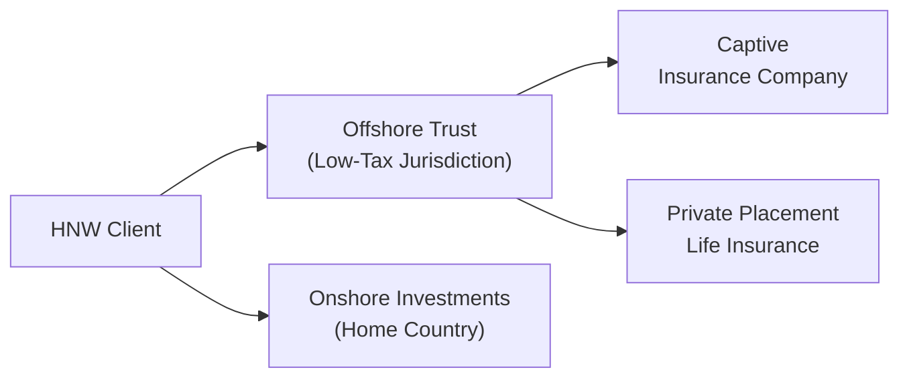

## Introduction

Well, let's be honest here: when we hear “tax shelters,” our minds often jump straight to shady or clandestine activities. But the reality is more nuanced—and completely relevant for high-net-worth individuals who are trying to preserve intergenerational wealth. At the CFA Level III stage, especially in private wealth management, you’re expected to know how to navigate the world of cross-border taxation, carefully differentiating between legitimate tax planning and unethical or illegal behavior. This discussion aims to break down the complexities of international tax shelters and regulatory arbitrage, hopefully in a way that won't have you rummaging for your coffee every five minutes.

Tax avoidance is legal, while tax evasion is not. Seems simple, right? But in practice, the global regulatory landscape is complicated. The rise of initiatives such as the Foreign Account Tax Compliance Act (FATCA) and the Common Reporting Standard (CRS) has changed the game, requiring more thorough reporting and compliance. So let’s dig in, step by step, to explore how international tax shelters work, why regulatory arbitrage is sometimes beneficial (and sometimes not), and how to manage the inherent risks. I hope by the end of this, you’ll see that there’s a method to the madness, along with an ethical line you really don’t want to cross.

## Understanding the Concept of Tax Shelters and Regulatory Arbitrage

Tax shelters are essentially legal structures or strategic methods employed to minimize or defer tax liabilities. Regulatory arbitrage, in turn, involves leveraging the disparities and gaps within different jurisdictions’ regulatory frameworks—sometimes for a favorable tax outcome, or to bypass strict regulations. Yes, it sounds a little manipulative, but that’s the nature of cross-border planning in a fragmented international system. Think of it like traveling across state lines to buy cheaper gas—except at a more complicated, global scale.

• Tax Shelters:  
  - Can be as simple as investing in tax-exempt securities or as sophisticated as forming an offshore trust.  
  - May hinge on specific loopholes or rules that allow certain deductions, credits, or deferred obligations.

• Regulatory Arbitrage:  
  - Capitalizes on differences in laws or regulations between countries.  
  - Could involve choosing a jurisdiction with less stringent regulatory requirements or more favorable capital controls.

From a private wealth perspective, these strategies can be quite attractive for preserving capital over multiple generations, especially when the client’s home jurisdiction has, say, an unfavorable estate tax regime or burdensome capital gains taxes.

## Ethical and Legal Considerations

Now, we can’t just focus on the potential gains without acknowledging the risk of stepping over certain lines. There’s a world of difference between legal, responsible tax planning and illicit activity. The key is understanding each jurisdiction’s regulations, plus the ever-changing international laws aimed at curbing tax evasion.

• Legal vs. Illegal:  
  - Tax Avoidance: Perfectly legitimate, using existing laws to minimize taxes.  
  - Tax Evasion: Flat-out illegal, often involving concealment, falsification, or fraud.

• Reporting Requirements:  
  - FATCA (Foreign Account Tax Compliance Act) requires foreign financial institutions to report on accounts held by U.S. taxpayers.  
  - CRS (Common Reporting Standard) is a global initiative that automates the exchange of financial information among participating countries.

• Reputational Risk:  
  - Let’s face it, certain offshore jurisdictions carry stigma. Even when structures are perfectly legal, public perception might be harsh.  
  - High-profile data leaks (e.g., Panama Papers) have put wealthy families and even well-known corporations in the hot seat.

If you’re advising a client, you’ve got to weigh legal compliance and reputational risk together. One quick anecdote that stands out: A friend of mine once advised an ultra-wealthy family who had assets in multiple jurisdictions. They were considering moving everything to a well-known, low-tax Caribbean island. The strategy seemed perfect on paper, but the family worried about being associated with “tax havens.” Ultimately, they pursued a more transparent approach—still tax-efficient—but with robust disclosure that kept the family’s reputation intact.

## Common Tax-Efficient Jurisdictions

Certain jurisdictions pop up repeatedly in discussions of tax shelters and regulatory arbitrage. Each has developed frameworks that cater to international investors seeking lower tax burdens, asset protection, or less invasive regulations. But—spoiler alert—these setups are evolving, and many places now require proof of “economic substance” before granting tax benefits.

Below is a simplified table that might help you compare a few popular destinations.

| Jurisdiction    | Key Benefits                                           | Potential Drawbacks                                      | Approx. Corporate Tax Rate (generalized) |
|-----------------|--------------------------------------------------------|----------------------------------------------------------|------------------------------------------|
| Cayman Islands  | No direct corporate tax; stable offshore platform;     | Substance regulations tightening; higher compliance cost | 0% nominal                                |
|                 | recognized expertise in fund formation                 |                                                          |                                          |
| Luxembourg      | Favorable tax treaties; stable EU framework;           | Higher regulatory scrutiny; transparency requirements     | 25%–27% (varies by municipality)         |
| Switzerland     | Historically low corporate taxes in some cantons;      | Costs of setup/maintenance can be high; complex rules     | 11.9%–21.6% (varies by canton)           |
|                 | strong banking secrecy tradition (less so today)       |                                                          |                                          |
| Singapore       | Very business-friendly; advanced financial services    | Residency requirements for big tax breaks; local presence| 17% (various incentives available)       |
| British Virgin  | Quick incorporation; low fees; no direct corporate tax | Reputational concerns; stricter substance rules           | 0% nominal                                |
| Islands (BVI)   |                                                        |                                                          |                                          |

Sure, the actual corporate tax rate in a place like Switzerland varies by canton, or in Luxembourg by municipality, but you get the general idea: these jurisdictions are known for distinct advantages that wealthy families or businesses might leverage. Your job is to see how each location’s benefits fit—or don’t fit—a client’s broader wealth plan.

## Techniques and Structures

“Offshore structures” might sound mysterious, but they’re usually straightforward when broken down. The real complexity arises when multiple entities are layered, often spanning different countries.

### Offshore Trusts

Offshore trusts are a classic. By placing assets in a trust formed in a jurisdiction with lower tax rates, families can sometimes defer or eliminate certain taxes in their home country. And if the trust is properly structured, it can offer estate planning benefits—like controlling how assets pass to children down the road.

• Primary Advantage: Potential estate tax reduction, asset protection from creditors, and confidentiality.  
• Caveat: Comply with the trust laws in both the forming jurisdiction and the client’s home country. Additional reporting is common.

### Captive Insurance Companies

A captive insurance company is a form of self-insurance that a business sets up to insure its own risks. While these are frequently used in corporate settings, high-net-worth families sometimes utilize them to manage personal or business risks in a tax-efficient manner.

• Primary Advantage: The underwriting profits stay within your own structure, potentially lowering premiums and harnessing tax benefits.  
• Caveat: Complex rules around legitimate “risk distribution” apply, and local regulations can be stringent about capital requirements.

### Private Placement Life Insurance (PPLI)

This technique places an investment portfolio inside an insurance “wrapper.” The client pays premiums to an insurance company that invests those premiums in various assets. Earnings inside that policy can often grow tax-free or tax-deferred.

• Primary Advantage: Can be an efficient way to invest in alternative assets while deferring taxes.  
• Caveat: Various jurisdictions have specific rules about what’s permissible inside a life insurance contract. The strategy can be undone if poorly designed or if the insurance element is a “sham.”

Here’s a little visual overview showing how a high-net-worth client (HNW) might use a combination of offshore structures:

Each arrow signifies the flow of capital or ownership, and the trust can oversee or coordinate the other vehicles.

## Risks and Challenges

It’s not all gravy. If you dive into structures without considering the bigger picture, you might run into:

• Regulatory Changes: Global efforts (think OECD’s BEPS project) are tightening loopholes and requiring more transparency.  
• Substance Requirements: Many jurisdictions now insist on genuine economic activity to justify a local entity’s tax status. In other words, you can’t just rent a mailbox.  
• Language and Cultural Barriers: Setting up in a foreign country with unfamiliar laws or business customs can be tricky.  
• Eroding Benefits: A famous story involved a client who created a complicated structure in one jurisdiction due to an attractive capital gains exemption. Then, a new administration revised the tax laws—poof, advantage lost.

As an advisor, you have to continuously monitor these risks. Annual or even quarterly reviews can help ensure you’re not caught off-guard by some obscure new legislation that drastically alters your client’s cost-benefit equation.

## Strategies for Compliance

We’ve been hammering on the point that compliance is non-negotiable. That’s because ignoring local and global rules isn’t just unethical—it will eventually backfire, possibly leading to hefty fines or criminal charges.

• Transparency: Don’t try to hide beneficial ownership or relevant activities. Regulators are more suspicious when they see incomplete documentation.  
• Global Reporting Standards: Provide accurate data under FATCA or CRS. Encourage clients to proactively disclose any overseas holdings.  
• Specialized Advisors: Engaging experienced international tax attorneys and accountants can be worth the investment, especially as the rules shift.  
• Regular Audits: It’s wise to have periodic compliance audits of international structures to ensure nothing has fallen through the cracks.

## Action Steps

If you’re mapping out a plan for a client—or yourself—some crucial steps might include:

• Document Current Holdings: Create a comprehensive list of all cross-border accounts, trusts, corporations, or partnerships.  
• Evaluate Overlapping Structures: Sometimes, clients have incidental duplication (like multiple holding companies in the same jurisdiction). Simplifying can reduce management costs and complexity.  
• Build Contingency Plans: If a specific jurisdiction changes its stance, it’s helpful to have not just a “Plan B,” but a “Plan C” too.  
• Stay Abreast of Regulatory News: Just like you track macroeconomic indicators, keep an eye on the G20, OECD, and other bodies that might update tax rules.

## Glossary

• Tax Evasion: Illegal activity of knowingly misrepresenting or concealing financial information to reduce tax liability.  
• Tax Avoidance: Legal and strategic use of tax laws (e.g., deductions, credits) to reduce liabilities.  
• FATCA (Foreign Account Tax Compliance Act): A U.S. law forcing foreign financial institutions to identify and report U.S. taxpayers’ accounts.  
• CRS (Common Reporting Standard): A global framework for the automatic exchange of financial account information to combat tax evasion.  
• International Business Company (IBC): A corporation established in certain jurisdictions offering tax or regulatory advantages.  
• Economic Substance: A requirement that entities show real presence and activities (staff, office, management) in the jurisdiction where they claim tax residency.

## References

• OECD “Harmful Tax Practices”: Guidelines and transparency initiatives.  
• Brian Dooley, “International Taxation in America” (practical insights on offshore structures and compliance basics).  
• Ronen Palan et al., “Tax Havens: How Globalization Really Works” (for an overview of international regulatory competition).  
• CFA Institute resources on cross-border taxation, regulation, and ethics.

## Exam Relevance and Final Tips

If you’re preparing for the CFA Level III exam, remember that tax efficiency is a pressing concern for private clients. Exam scenarios often involve comparing different jurisdictions or analyzing the pros and cons of certain offshore vehicles. Make sure you can:

• Identify ethical pitfalls versus legitimate structures.  
• Propose compliance-driven solutions in scenario-based questions.  
• Evaluate the suitability of various jurisdictions for specific client goals.  
• Discuss how to adjust wealth plans when regulations or tax laws change unexpectedly.

Keep an eye out for essay-style questions that challenge you to justify the use of a particular structure, factoring in cost, reputational risk, and possible regulatory shifts. Regularly brush up on new developments in global tax regulations, because the exam might reference ongoing international efforts to clamp down on abusive tax practices. Study real-world examples—these often illustrate precisely what the exam wants you to demonstrate.

Anyway, good luck on your CFA journey. My advice is to know the frameworks thoroughly, practice with realistic case studies, and keep compliance at the forefront.

## Test Your Knowledge: International Tax Shelters and Regulatory Arbitrage Quiz



### Which of the following best describes regulatory arbitrage?

- [ ] Adopting the same regulations in all jurisdictions.
- [x] Exploiting differences in laws or rules across countries to achieve a more favorable outcome.
- [ ] Choosing the worst possible location for tax planning in order to test hypothetical strategies.
- [ ] Always relying on illegal loopholes that governments aim to shut down.

> **Explanation:** Regulatory arbitrage involves capitalizing on variations in tax or regulatory frameworks among jurisdictions to gain benefits. It does not necessarily imply any illegal activity but leverages legal divergences.

### What is the primary difference between tax avoidance and tax evasion?

- [x] Tax avoidance is legal, while tax evasion is illegal.
- [ ] Tax avoidance is always unethical, while tax evasion is not.
- [ ] Tax evasion is used only in domestic contexts, while tax avoidance is international.
- [ ] They are exactly the same in practice.

> **Explanation:** Tax avoidance uses legitimate strategies within the law, while tax evasion involves misrepresentation or concealment of information, which is illegal.

### Which international initiative requires foreign financial institutions to report on accounts held by U.S. taxpayers?

- [ ] CRS (Common Reporting Standard)
- [x] FATCA (Foreign Account Tax Compliance Act)
- [ ] OECD BEPS
- [ ] MiFID II

> **Explanation:** FATCA specifically targets U.S. taxpayers and mandates reporting by foreign financial institutions to the IRS. CRS, on the other hand, is a broader multilateral initiative.

### Which of the following is NOT a risk often associated with offshore tax shelters?

- [ ] Regulatory changes eliminating benefits
- [ ] Reputation damage due to perceived secrecy
- [x] Guaranteed immunity from all taxes worldwide
- [ ] Substance requirements in certain jurisdictions

> **Explanation:** No structure guarantees universal immunity from taxation. Offshore shelter benefits can be undermined by new legislation, reputational concerns, or substance requirements.

### Which statement is most accurate about offshore trusts?

- [x] They can help reduce estate taxes and protect assets if set up legitimately.
- [ ] They automatically exempt all income from taxes in any country.
- [x] They require compliance with both the trust’s jurisdiction and the client’s home country.
- [ ] They are universally set up as illegal entities.

> **Explanation:** Offshore trusts can be beneficial for estate planning and asset protection, but must comply with relevant laws in both jurisdictions. They are not inherently illegal.

### Which of the following is most crucial for compliance when using offshore structures?

- [x] Transparency in reporting beneficial ownership and activities.
- [ ] Never disclosing information to regulatory bodies.
- [ ] Maintaining multiple layers of hidden accounts.
- [ ] Avoiding experienced legal and tax advisors to reduce costs.

> **Explanation:** Transparency is essential to comply with regulations like FATCA and CRS. Hiding accounts or avoiding professional advice can lead to serious legal consequences.

### A “captive insurance company” is best described as:

- [x] A form of self-insurance for a company or family office.
- [ ] An insurance provider unaffiliated with any client’s business.
- [x] A vehicle that can generate underwriting profit and potential tax benefits.
- [ ] Strictly illegal under international law.

> **Explanation:** A captive insurance company is formed to insure the risks of its parent organization, potentially creating proficiencies in risk management and certain tax advantages, provided it meets all regulatory conditions.

### How have global initiatives like the OECD’s BEPS project affected offshore strategies?

- [x] They have restricted certain practices by requiring more transparency.
- [ ] They have eliminated all forms of offshore accounts.
- [ ] They have legalized tax evasion.
- [ ] They have no impact on cross-border taxation policies.

> **Explanation:** The OECD’s BEPS (Base Erosion and Profit Shifting) initiatives focus on ensuring profits are taxed where economic activities occur, thereby reducing abusive tax avoidance strategies.

### Substance requirements in popular offshore jurisdictions generally mean:

- [x] Entities must prove real economic activity, such as local offices, staff, and active management.
- [ ] Entities can exist solely through a PO Box without any on-ground activity.
- [ ] Any income generated abroad is automatically taxed at 0%.
- [ ] There are no obligations beyond shareholder registration.

> **Explanation:** Substance law changes have forced companies and trusts to demonstrate genuine presence and activity in the jurisdiction to qualify for tax benefits.

### True or False: Reputational risk is irrelevant if the structure is technically legal.

- [x] True
- [ ] False

> **Explanation:** Actually, this statement can be tricky. Even if a structure is legal, public perception—and potentially damaging media coverage—can lead to reputational harm. So, it’s not irrelevant. Ethical and reputational considerations remain critical.


