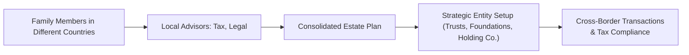

Wealthy families rarely stay within a single country’s borders. Perhaps you’ve encountered this too—when one sibling studies in the U.S., another invests in Europe, and parents remain in their home country while also keeping a second home in Singapore. That’s just life for many high‐net‐worth (HNW) households nowadays. And you know what? These cross‐border dynamics can make wealth planning feel like navigating an intricate jigsaw puzzle, especially when it comes to tax laws, estate rules, and family governance. This section provides a framework for advising wealthy families spread out across multiple jurisdictions. We’ll dig into tax treaties, cross‐border gift and estate planning, successful entity structures, FX hedging, and much more. Let’s walk through these key themes step by step.

## Multi‐Jurisdiction Family Structures
Cross‐border families typically have family members living, studying, or working in different parts of the world. Sometimes, each household has its own local accounts, plus one or two offshore or onshore trusts or holding companies to unify assets. In other cases, multiple family members have partial ownership in property or businesses in jurisdictions they rarely visit.

All these moving parts can create confusion around tax compliance, reporting deadlines, property laws, and even local inheritance regulations. Advisors often become the “central conductor,” guiding the right professionals in each jurisdiction—attorneys, accountants, trustees—so everything aligns with the family’s overall strategy.

One of my colleagues once advised a family spanning four continents: they held artwork in Liechtenstein, farmland in Argentina, and real estate in Australia, while living most of the time in Canada. Coordinating multiple legal counsel teams was essential because each country had its own rules on capital gains, estate taxes, and property rights. Without that coordination, the family risked facing double taxation or missing crucial filing deadlines.

### Practical Example
Imagine a Canadian family with a daughter residing in the U.K. for university and a business partnership in Japan. Even something as simple as paying for tuition might have cross‐border implications if funds are wired directly from the family business in Japan into a U.K. bank account. In some jurisdictions, large transfers can be categorized as gifts or distributions, triggering tax events. A consolidated strategic plan—where the family’s accountant and legal counsel from each country collaborate—can ensure that all cross‐border movements comply with local and international regulations.

## Cross‐Border Tax Treaties and Double Taxation
When incomes and assets flow across multiple territories, the big concern is: “Am I being taxed twice?” Double taxation could arise if both the source country and the resident country levy taxes on the same income. Fortunately, many nations have tax treaties—either bilateral or multilateral—to mitigate or avoid double taxation. 

Under such treaties, a country may allow a foreign tax credit, an exemption, or a reduced tax rate on certain streams of income or gains. For instance:
• A U.S. citizen receiving dividends from Canada might enjoy a reduced withholding tax rate on those dividends if the U.S.‐Canada tax treaty covers it.  
• A resident of France might claim a foreign tax credit for taxes paid to the U.K. on interest income, up to the amount that France would have imposed on that same interest.

A straightforward formula for the Foreign Tax Credit (FTC) looks like this:


\text{FTC} = \min(\text{Foreign Tax Paid}, \text{Home Country Tax on Foreign Income})


Essentially, a taxpayer’s home country tax burden on foreign‐earned income can be reduced by the amount of taxes already paid abroad, often capped at the home country’s own tax rate. Advisors with cross‐border clients need to know the relevant treaties and the specific provisions regarding interest, dividends, royalties, and capital gains. Keep in mind that inheritance taxes and gift taxes sometimes fall under different treaties altogether—or might be entirely absent in some jurisdictions.

### Quick Case Study
A father from Country A invests in a real estate property in Country B. He eventually sells the property, incurring a capital gains tax of 20% in Country B. Without a tax treaty, Country A may also levy a separate capital gains tax on global income. However, if Country A agrees that the capital gains tax already paid is creditable, the father might not face full double taxation, instead offsetting Country A’s tax bill by the amount already paid in Country B.

## Selecting Appropriate Legal Entities
Choosing the right legal structure can significantly reduce the complexity of managing and preserving wealth across borders. Various entities include trusts, holding companies, or family foundations. Each entity has pros and cons—some countries are more “trust‐friendly,” while others favor foundation setups. Anyway, the selection of entity often depends on local legal recognition, tax rates, asset protection features, and the administrative burden.

### Trusts
Trusts can offer privacy and estate‐planning benefits—particularly in common‐law jurisdictions like the U.S. or the U.K. Through a trust, a family can separate legal ownership from beneficial ownership, possibly reducing tax liabilities or offering creditor protection. However, not all jurisdictions recognize trusts. Under French forced‐heirship laws, for instance, certain claims by children or spouses may override trust distributions. This tension requires careful planning, especially if a trust beneficiary (or asset) is in such a forced‐heirship jurisdiction.

### Holding Companies
A holding company is basically an entity that “holds” or owns shares in other businesses and assets. A family might form a holding company in a jurisdiction with favorable tax treaties and corporate laws (for example, Luxembourg or the Netherlands). If carefully structured, you might get reduced withholding taxes on dividends or interest flows to that holding company, and sometimes you get a more straightforward mechanism for transferring shares within the family.

### Foundations
In many civil‐law countries (like Liechtenstein, Panama, or some European jurisdictions), a foundation can serve a similar purpose as a trust—acting as an independent legal entity that holds and manages assets for beneficiaries. Foundations can provide continuity across generations, potential confidentiality, and philanthropic structures. Sometimes families create philanthropic foundations that align with their charitable goals, but still have the flexibility to support younger generations.

### Diagram: Simplified Cross‐Border Family Structure

## Intrafamily Transactions and Gift Taxes
It’s not uncommon for wealthy families to transfer wealth among members, either as gifts or intrafamily loans, especially when certain members live abroad. However, these transfers can trigger local gift taxes if thresholds are exceeded or if the donor or donee resides in a jurisdiction imposing gift taxes. Advisors must consider:

• Gift tax thresholds in each relevant jurisdiction.  
• Documentation required to prove the transfer’s nature—especially if it’s a loan rather than a pure gift.  
• Local laws on interest rates for intrafamily loans (some countries require a minimum interest rate to avoid “implied gifts”).  

### Practical Scenario
Let’s say a Hong Kong–based grandmother wants to fund her granddaughter’s medical school in the United States. A direct wire transfer for tuition seems simple, but the U.S. imposes gift taxes on donors above a certain exemption limit. Meanwhile, Hong Kong does not have a gift tax. If structured properly—such as using a tuition payment model that qualifies for certain exceptions—the grandmother might reduce or eliminate the U.S. gift tax implications.

## Estate and Succession Planning Across Borders
Not all jurisdictions treat estates in the same manner. Some have forced‐heirship regimes (e.g., in parts of Europe, the Middle East, and Latin America) that require distributing certain shares to lineal heirs. In these places, you can’t just leave 100% of your estate to a single heir if you have children, because the law might guarantee a percentage to each child. Meanwhile, many common‐law countries (like England and the U.S.) allow more flexibility in bequests.

### Aligning Estate Documents
Advisors should align wills, beneficiary designations, and trust documents across relevant jurisdictions. Sometimes, a single “worldwide will” is not recommended because each jurisdiction might not respect all provisions, particularly if it contradicts local forced‐heirship laws. Instead, wealthy families often have multiple wills or trust deeds, one for each major jurisdiction where assets are located. Keeping them consistent is critical so they don’t conflict during probate.

### Succession Planning for International Assets
• Real estate in civil‐law jurisdictions might require local probate processes or forced shares.  
• Bank accounts in multiple countries can require separate death certificates or local court orders.  
• Company share transfers must satisfy local corporate law.  

An integrated estate plan factors in all these local wrinkles, so that nobody is thrown off by surprise taxes or legal disputes. Oh, and don’t forget beneficiary designations on life insurance policies or retirement accounts: those are often treated separately from wills in many jurisdictions!

## Currency Risk and Foreign Exchange Management
Families operating across borders inevitably face fluctuations in exchange rates. A trust might hold assets in EUR while beneficiaries live in USD zones, or a holding company invests in emerging‐market currencies. Even small currency swings can erode wealth if not appropriately managed.

### Hedging Strategies
Advisors should assess to what extent currency exposures should be hedged using forward contracts, currency swaps, or options. A forward contract, for example, locks in an exchange rate for a future date, helping families budget for known expenses. Say a family in Singapore knows they’ll need USD 500,000 in six months for a property purchase in California. Entering a forward contract can fix the exchange rate now, so they don’t get whiplash if the USD appreciates sharply.

### Multi‐Currency Portfolios
Some families deliberately maintain a multi‐currency portfolio to diversify systemic risk. They might keep bank accounts in USD, EUR, and JPY, plus smaller holdings in gold or cryptocurrencies—though the latter carry higher volatility. This approach can serve as a hedge against a single currency’s decline, but it complicates recordkeeping and can raise local tax and reporting obligations.

## Compliance with Local Tax Reporting and Filing Deadlines
In a multi‐jurisdiction environment, the family must remain vigilant about each country’s reporting mandates. Failing to report can lead to steep penalties and potential legal trouble. Examples include:

• FATCA (Foreign Account Tax Compliance Act): Requires non‐U.S. financial institutions to disclose accounts held by U.S. persons, or face withholding on U.S.‐sourced income.  
• CRS (Common Reporting Standard): An OECD‐driven standard where over 100 jurisdictions exchange financial account information on tax residents.  

In addition to global standards, each jurisdiction may have separate property or inheritance tax forms, local business filings, or currency transaction reports. Advisors have to be total experts in these deadlines or partner with compliance specialists who ensure no detail slips through the cracks.

### Example of a Missed Filing
If a U.S. citizen resides in Switzerland but neglects to file U.S. tax returns and Swiss forms, it can trigger penalties on both sides. The U.S. might penalize unreported foreign assets, while Switzerland might impose administrative fines for not declaring all foreign‐source funds. An advisor’s role is to keep a calendar or schedule of all relevant countries’ deadlines so the client never faces a last‐minute scramble.

## Use of Professional Networks and Coordination
Let’s be honest: no single advisor can master every country’s estate, tax, and compliance laws. The best approach is building a team. Lawyers, accountants, wealth managers, trust officers, and insurance agents across different jurisdictions must coordinate. And a central advisor—often the family office or a trusted private wealth manager—manages the big picture to ensure the family’s wealth plan is coherent and consistent.

In practice, this means scheduling periodic calls or conferences where each local professional updates the core group on changes in local law or new opportunities. Keeping lines of communication open prevents duplication of efforts and ensures that, for example, the trust arrangement in one country aligns with the real estate holdings in another.

## Best Practices, Common Pitfalls, and Strategies
• Best Practices:  
  – Keep thorough documentation of all cross‐border transactions in each jurisdiction.  
  – Actively track developments in local rules (e.g., how the U.K. might change non‐domiciled resident rules).  
  – Maintain multi‐disciplinary collaboration with local tax lawyers, estate attorneys, and fiduciary service providers.

• Common Pitfalls:  
  – Overlooking forced‐heirship provisions—leading to disputes or litigation.  
  – Failing to utilize available tax treaties, resulting in unnecessary double taxation.  
  – Missing local gift thresholds or ignoring intrafamily loan documentation requirements.

• Strategies to Overcome Issues:  
  – Use inter vivos trusts or holding companies to consolidate and protect assets.  
  – Adopt currency hedging for expected family expenses.  
  – Maintain meticulous compliance calendars for all relevant deadlines.  

## Final Exam Tips
• Familiarize yourself with how cross‐border tax treaties handle double taxation. Expect exam questions requiring you to demonstrate how to calculate a foreign tax credit in a real‐life scenario.  
• Understand the differences between trust structures, holding companies, and foundations. The exam might ask you to propose an optimal structure or critique a structure’s pros and cons.  
• Don’t neglect forced‐heirship and local inheritance laws. You could get a case requiring you to reconcile conflicting wills in multiple jurisdictions.  
• Be able to identify potential currency risks and recommend hedging solutions.  
• Show how you’d propose an integrated approach—coordinating multiple professionals—for a wealthy family spanning several countries. This theme aligns with the Level III exam’s emphasis on real‐life portfolio management and comprehensive wealth solutions.

## References
• Deloitte: “International Tax and Cross‐Border Strategies” (https://www2.deloitte.com)  
• PricewaterhouseCoopers (PwC): “Managing Global Family Wealth Report”  
• HSBC: “Cross‐Border Banking & Wealth Solutions” (https://www.hsbc.com)  
• OECD: “Model Tax Convention on Income and on Capital”  
• Blakelock, R. (2019). Planning for Cross-Border Family Wealth Transfers. International Tax Review.  

## Test Your Knowledge: Managing Complex Family Arrangements and Cross-Border Taxation



### A client is taxed on dividend income in their source country at 15% and also faces a 20% tax rate in their home country. They have a credit mechanism for foreign taxes. Which statement is correct?

- [x] They may reduce their home country tax by the amount of foreign tax paid, up to 15%.
- [ ] They must pay double taxation since both countries apply income tax.
- [ ] They enjoy unlimited foreign tax credit for the entire 20% tax bracket.
- [ ] They cannot offset any of the foreign taxes, as the treaties do not apply to dividends.

> **Explanation:** The foreign tax credit limit is typically the lesser of the actual foreign tax paid or the home country’s tax on the same income, so they can offset up to 15% in this example.

### Which statement best describes a forced‐heirship regime?

- [x] It obliges certain portions of an estate to be allocated to lineal descendants.
- [ ] It forces a child to disclaim inheritance in favor of the spouse.
- [x] It may conflict with trust‐based estate plans that ignore legal heirs.
- [ ] It allows complete discretion for distributing assets among any beneficiaries.

> **Explanation:** Forced‐heirship regimes generally stipulate that certain heirs automatically inherit specific shares. This may conflict with trust arrangements in jurisdictions that ignore such forced shares.

### In what scenario might a holding company be beneficial for a cross‐border family?

- [x] When consolidating multiple operating businesses under one entity in a low‐tax treaty jurisdiction.
- [ ] When local regulations forbid forming corporate entities for family wealth.
- [ ] When forced‐heirship requires direct ownership of every single asset by lineal heirs.
- [ ] When the family aims to avoid currency exposures by maintaining single‐currency accounts.

> **Explanation:** A holding company domiciled in a favorable jurisdiction may reduce withholding taxes on dividend and interest flows from various countries, improving tax efficiency.

### A Swiss‐resident client subject to U.S. FATCA rules fails to report their U.S. accounts. What might be a plausible consequence?

- [x] The Swiss bank may face withholding on U.S.‐sourced income if it doesn’t comply.
- [ ] The client has no liability because Swiss banks have complete legal immunity.
- [ ] The Swiss tax authority cannot exchange any information under FATCA.
- [ ] The client enjoys tax amnesty automatically due to Swiss secrecy laws.

> **Explanation:** Under FATCA, non‐U.S. financial institutions are subject to withholding on U.S.‐sourced payments if they fail to report U.S. account holders. Swiss secrecy laws have been adjusted to be compatible with FATCA.

### What is a primary advantage of a trust compared to a foundation in cross‐border planning?

- [x] Trusts can separate legal and beneficial ownership, supporting flexible estate plans.
- [ ] Trusts are enforceable in any jurisdiction without local legal recognition.
- [x] Trusts always eliminate forced‐heirship restrictions worldwide.
- [ ] Trusts require fewer professionals to manage than a foundation.

> **Explanation:** A trust’s legal structure separates ownership (trustee) from those who benefit (beneficiaries), providing flexibility and potential tax advantages. Not all jurisdictions recognize trusts, and forced‐heirship rules may still apply.

### Which is a common pitfall of intrafamily cross‐border loans?

- [x] Failing to document the loan properly, leading tax authorities to treat it as a gift.
- [ ] Setting a formal interest rate above market standards without consequence.
- [ ] Assuming no local gift taxes apply because the family is related.
- [ ] There is no pitfall, as intrafamily loans are never taxable.

> **Explanation:** Intrafamily loans must be properly documented, including interest rates, or they risk being reclassified as gifts for tax purposes.

### A wealthy parent in Hong Kong pays a U.S. granddaughter’s tuition directly to the university. When is this most commonly advantageous?

- [x] When direct tuition payments may be exempt from U.S. gift tax calculations.
- [ ] When the payment is guaranteed to trigger immediate gift tax in the U.S.
- [x] When the transaction is considered an intrafamily loan at no interest.
- [ ] When the payment is always considered foreign business income by the IRS.

> **Explanation:** U.S. gift tax law often excludes direct tuition (and sometimes medical) payments from gift tax thresholds, making direct payments a smart strategy.

### What is a key consideration when establishing a family office for cross‐border wealth?

- [x] Coordinating global advisors to ensure integrated support in multiple jurisdictions.
- [ ] Encouraging separate local offices in each country with no interaction.
- [ ] Minimizing communication due to privacy concerns.
- [ ] Focusing only on currency hedging rather than structural planning.

> **Explanation:** A centralized family office should orchestrate communication between tax advisors, estate attorneys, and bankers across different jurisdictions.

### Which statement best describes how foreign currency exposure might be handled?

- [x] Using forward contracts or currency swaps to lock in future exchange rates.
- [ ] Ignoring currency swings, as they rarely affect high‐net‐worth families.
- [ ] Relying solely on forced‐heirship rules for currency protection.
- [ ] Diversifying in a single currency to reduce accounting complexity.

> **Explanation:** Forward contracts or swaps are common hedging instruments to manage currency fluctuation risk in cross‐border operations.

### Cross‐border estate plans often use multiple wills. True or False?

- [x] True
- [ ] False

> **Explanation:** Multiple wills can clarify which portion of the estate is governed by which jurisdiction’s laws and help navigate forced‐heirship provisions or differing probate procedures.


