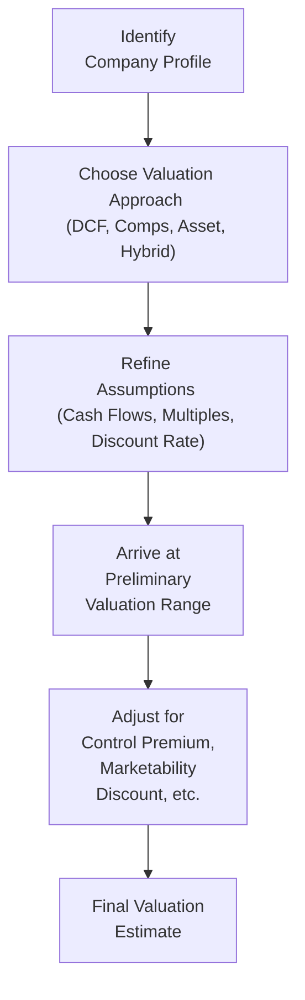
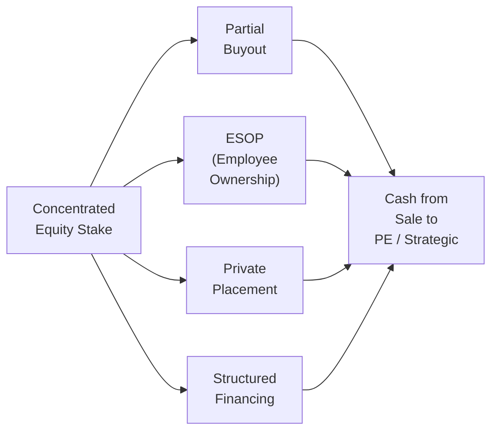

## Understanding the Challenge

Owning a large stake in a private company can be both exhilarating and daunting. On the one hand, it’s your baby: maybe you’ve built it from scratch, poured countless weekends into making it successful, and you’re emotionally (and financially!) intertwined with its future. On the other hand, all that concentrated equity means your personal wealth is tied to a single asset—an asset that isn’t publicly traded and can be very tricky to value or sell. You know that uncertain feeling—in the back of your mind—that maybe your entire net worth is riding on one horse?

Addressing concentrated equity ownership isn’t just about finding a quick sale. It’s about protecting what you’ve worked for, planning for the future, and ensuring your family’s financial stability if anything goes sideways. In this article, we’ll explore the key steps: from valuing your stake properly to hedging, monetizing, and eventually letting go (if that’s what you need to do). We’ll also consider the emotional aspect, because concentrated ownership isn’t just a black-and-white numbers game—sometimes it’s deeply personal.

## Valuation of Concentrated Holdings

Let’s start with the big question: How do you even figure out what your private company stake is worth? For publicly traded stocks, you can open an app (or your old-school broker’s terminal) and see the price. But for a private business, the valuation process is a bit of an art, right?

Common valuation techniques include:

• Discounted Cash Flow (DCF):  
  DCF projects future cash flows and then discounts them back to the present using an appropriate discount rate. In formula terms:

  
  V_0 = \sum_{t=1}^{T} \frac{FCF_t}{(1 + r)^t} + \frac{Terminal\ Value}{(1 + r)^T},
  

  where FCFᵗ represents free cash flow in year t, r is the required rate of return, and T is the final projection year.

• Comparable Company Analysis (Comps):  
  This approach evaluates the business relative to publicly traded companies or private transactions in similar industries. You might compare multiples such as P/E (price-to-earnings) or EV/EBITDA (enterprise value to earnings before interest, taxes, depreciation, and amortization).

• Asset-Based Valuation:  
  This method looks at the fair market value of company assets minus liabilities. It might be especially relevant if the business’s value is tied up in tangible assets like real estate or heavy machinery.

• Hybrid Approaches:  
  For businesses with intangible assets (e.g., strong brand, intellectual property, proprietary tech), advisors might blend multiple methods. For example, they might do a DCF for the operating assets and an asset-based approach for real estate holdings.

I once worked with a founder who assumed his company was worth at least 10× revenue because of all the sweat and tears poured into the business. After we brought in a valuation specialist, it turned out a 6× multiple (and that’s being generous) was more realistic. Despite the initial disappointment, the founder realized how crucial it was to get a credible third-party assessment if he wanted to seek outside investors or plan an eventual sale.

### Diagram: Valuation Approaches for Private Businesses

## Monetization Techniques

Okay, so you have this large chunk of stock. Maybe you want to diversify or just free up some cash for new ventures. Monetizing concentrated private business holdings is tricky because, well, there isn’t a big stock exchange waiting to scoop up your shares. Here are common routes:

• Partial Buyouts:  
  You can sell a portion of your shares to private equity firms or strategic investors. This technique offers partial liquidity, although you might end up ceding some control or board seats. The cost of capital and the final negotiated discount can vary widely, so keep your eyes open for deal terms—especially regarding governance and future exit clauses.

• Employee Stock Ownership Plans (ESOPs):  
  ESOPs allow employees to own part of the company, often gradually. They can be tax-advantageous (especially in jurisdictions where ESOP contributions receive favorable treatment). ESOPs may enhance employee loyalty but require careful structuring and administration.

• Private Placements:  
  Selling shares to institutional investors—like venture capital or family offices—can inject fresh capital. However, these deals often include lockup periods (meaning you can’t sell your shares for some time) and can impose new governance requirements.

• Structured Financing:  
  Sometimes, founders use structured loans (with the private shares as collateral) to achieve partial liquidity without selling. But be warned: if the value of the shares dips, lenders can demand collateral top-ups or new terms, so this can be risky.

### Diagram: Possible Monetization Strategies

## Hedging Strategies for Private Stock

“Wait, how do you hedge a private stock?” you might ask. True, it’s not like you can just go buy put options on an exchange. But there are still some creative ways to mitigate risk:

• Collar Strategies:  
  A collar typically involves selling a call and buying a put, limiting both upside and downside. For private companies, you’d need a synthetic version, often custom-engineered with a counterparty (think specialized investment banks). Liquidity is a big constraint, so it’s not straightforward.

• Prepaid Variable Forward:  
  This arrangement lets you receive an upfront payment in exchange for delivering a set number of shares (or their cash equivalent) at a later date. The final number depends on the share price at maturity, so you benefit from some of the upside while having partial downside protection.

• Insurance-Based Solutions:  
  Occasionally, specialized insurance products can be structured to protect a certain portion of the private stake’s value. However, these deals can carry high premiums and often require detailed underwriting of the company’s finances.

Keep in mind that private shareholders face unique lockup clauses, plus regulatory hurdles if it’s a restricted security. For all these reasons, it’s crucial to have legal counsel that understands the intricacies of private markets. And yes, it can feel more complicated than writing covered calls on a publicly traded stock, but for large business owners, the payoff might be worth it.

## Ownership Structures and Corporate Governance

“Why should I bother changing my ownership structure?” you might wonder. Well, converting your business from a single-owner to a more formalized governance structure can have a huge impact on transparency, credibility, and ultimately—valuation. Prospective buyers or investors want to see strong corporate governance, from properly documented policies to a board that oversees critical decisions. A streamlined governance structure can also help reduce the key-person risk that so often plagues concentrated businesses.

Typical steps might include:

• Forming a Board of Directors or Advisory Board.  
• Establishing committees (e.g., audit, compensation) with defined charters.  
• Enhancing financial reporting practices—potentially hiring CFO-level expertise if you haven’t already.  
• Drafting or revisiting buy-sell agreements among existing shareholders.

In my experience, founders who initially resist “corporatizing” often come around when they see that improved governance leads to better business decisions, less friction among family members, and a higher perceived value when approaching outside investors.

## Psychological Challenges of Letting Go

It’s natural to be deeply attached to something you’ve built. Selling even a portion of your business can feel like turning your back on your life’s work, or losing part of your identity. It’s not uncommon for owners to procrastinate or even sabotage deals because they’re uneasy about losing control—even if diversifying is financially prudent.

Conversations around legacy, how the business brand impacts your family name, and future roles (if any) in the company can be emotional. As an advisor, sometimes you’re as much a therapist as you are a financial professional. Patience, empathy, and involving family members in discussions can help. Consider hosting structured family meetings or enlisting the help of a family governance consultant to align everyone’s interests. That’s especially essential if multiple generations have stakes in the ownership.

## Tax and Regulatory Considerations

Don’t forget your silent partner: the tax authorities. Large owners of private stock might face:

• Capital Gains Taxes:  
  The difference between your cost basis and the sale price could generate hefty taxes. Some jurisdictions allow for step-ups in basis or have capital gains exclusions, so it’s important to plan carefully.

• Transfer Taxes or Estate Issues:  
  If shares are gifted or inherited, there might be transfer taxes or estate taxes. Structuring ownership through family limited partnerships or trusts can mitigate these.

• Buy-Sell Agreement Clauses:  
  Many operating agreements or buy-sell clauses specify how shares can be transferred and at what price. Some might require right-of-first-refusal from other shareholders or the company itself.

It’s wise to coordinate with an experienced tax attorney or CPA familiar with cross-border regulations, especially if you live or operate in multiple jurisdictions. For instance, you might be subject to multiple tax regimes if you have a U.S. passport but your business is headquartered abroad. Well, that gets complicated quickly, so do your homework up front.

## Long-Term Financial Independence

Here’s another question: once you monetize or partially exit, what do you do with the proceeds? The windfall could be enormous, but so might the temptation to jump right back into another big concentrated position. A structured approach—perhaps something along the lines of a well-diversified portfolio, or a stable annuity to cover essentials—can safeguard your newfound wealth.

Common strategies might include:

• Creating an asset allocation plan that mixes stocks, bonds, and alternative investments (real estate, private equity, hedge funds, etc.).  
• Setting up personal trusts or family trusts to manage intergenerational transfers.  
• Using a portion to set up philanthropic entities—like donor-advised funds or private foundations—if legacy and charitable giving are top of mind.

The trick is to ensure your new financial plan matches your risk tolerance and lifestyle goals. If you want to travel the world and never worry about your net worth, consider leaning toward stable, income-generating investments. If you still have an appetite for business ventures, you might reserve some capital for future entrepreneurial projects or venture investments. The bottom line: create a buffer so you can sleep at night.

## Exit Timing and Market Cycles

Selling private stock can sometimes feel like timing your jump onto a moving train—it’s not always easy to pick the perfect spot. Market dynamics, industry trends, and M&A cycles can shift your bargaining power drastically.

• Economic Conditions:  
  In bullish economic cycles, private equity investors have abundant capital to deploy and might offer more generous terms.

• Sector Sentiment:  
  If your industry is “hot” (think biotech in certain cycles, or technology during growth spurts), you’ll likely command a higher price. Conversely, if sentiment cools, that might hamper valuations.

• Competitor Activities:  
  M&A deals among your competitors or industry peers can create a wave of interest that lifts your valuation—kind of a rising-tide effect.

• Distressed Exits:  
  If you’re forced to sell under duress—maybe the business is short on cash, or personal reasons are pressing the sale—expect lower bids. This is why advanced planning is key. Don’t wait until a crisis to seek diversification.

## Common Pitfalls and Best Practices

Monetizing concentrated private equity isn’t all sunshine and roses. Watch out for these pitfalls:

• Overestimating Valuation:  
  Particularly if the company is founder-led. It’s easy to let pride overshadow objectivity.

• Underestimating Overhang:  
  Some owners assume they can find a buyer any time. But private shares can languish on the market for months (or years).

• Ignoring Governance:  
  Poor governance can derail prospective investors who expect robust financial controls and transparency.

• Holding On Too Long:  
  Emotional ties often prompt owners to maintain ownership even when diversification would be wiser. Or they might wait for “one more best-ever quarter” that never comes.

• Neglecting Tax Strategy:  
  Missing deadlines for philanthropic structures or ignoring estate tax implications can lead to unnecessarily high taxes.

Best practices include obtaining a robust valuation (even a second opinion), lining up professional advisors (legal, tax, and financial planning), involving family or key stakeholders early, and diversifying prudently—without feeling like you’re “abandoning” your creation.

## Exam Tips and Conclusion

If you’re preparing for the CFA® exam, especially at the Level III stage focusing on portfolio management and wealth planning, be ready to address scenario-based questions dealing with concentrated positions. You might face essay prompts asking how to structure a partial buyout, manage the psychological aspects of a founder reluctant to sell, or optimize the tax outcome of a private sale.

• When you see a question about concentrated private holdings, check for any mention of liquidity, valuation approach, governance, or estate-planning constraints.  
• Don’t forget that private equity valuations typically require a discount for lack of marketability (DLOM) or a control premium.  
• Practice with a variety of calculations—like partial liquidity events or collar payoffs—and master the conceptual link between emotional bias and financial outcomes.

In the real world, addressing concentrated equity ownership is as much about human emotions as it is about capital structure. On your exam—and in practice—demonstrating empathy, patience, and creativity in strategy is every bit as important as brandishing the right formula.

## References

• Damodaran, A. (2012). Investment Valuation: Tools and Techniques for Determining the Value of Any Asset. Wiley.  
• PwC: “Guide to Business Combinations and Noncontrolling Interests.”  
• Bance, A. (2016). The ESOP Handbook. Journal of Employee Ownership.  
• Northern Trust: “Strategies for Monetizing Concentrated Private Holdings.”  
• Cambridge Associates: “Private Company Valuation and M&A Trends.”  
• CFA Institute Level III Curriculum.  

## Test Your Knowledge: Addressing Concentrated Equity Ownership in Private Businesses



### Which of the following best describes why private business valuation is more challenging than public company valuation?

- [ ] Higher liquidity and numerous market comparables
- [x] Limited market data and potential discounts for lack of marketability
- [ ] Reliance solely on asset-based valuations
- [ ] Government regulations simplify private equity valuations

> **Explanation:** Private businesses typically have fewer market comparables, limited liquidity, and often require adjustments such as a discount for lack of marketability or a control premium.

### An entrepreneur seeks an immediate payment while retaining some upside as part of a deal to hedge his concentrated private position. Which strategy best meets this description?

- [ ] Simple stock sale to a private equity investor
- [x] Prepaid Variable Forward
- [ ] Traditional collar strategy
- [ ] An equity swap

> **Explanation:** A prepaid variable forward provides an upfront payment and partial exposure to future share price movements, which fits the scenario of retaining some upside while receiving immediate liquidity.

### How can robust corporate governance impact the valuation of a private business with concentrated equity?

- [x] It can increase transparency and lower perceived risk, potentially raising valuation
- [ ] It usually has no effect on valuation
- [ ] It reduces the company’s attractiveness by adding bureaucracy
- [ ] It primarily decreases the cost of goods sold

> **Explanation:** Strong governance practices and transparency often reduce investor concerns about risk. This can lead to higher valuations and more favorable deal structures.

### When founders are emotionally attached to their firms, what is a common behavioral risk?

- [x] Overestimating the firm’s valuation due to emotional bias
- [ ] Underestimating potential for growth
- [ ] Willingly giving up control to external investors
- [ ] Avoiding any involvement in corporate governance decisions

> **Explanation:** Founders often inflate the perceived value of their firms due to emotional attachment, leading to unrealistic expectations that can hinder deals.

### If an owner wants to monetize shares without relinquishing voting control, what might be an effective choice?

- [x] Setting up a dual-class share structure and partially selling non-voting shares
- [ ] Conducting an IPO and selling all shares at once
- [x] Establishing an ESOP with restricted voting rights
- [ ] Buying shares from management to increase one’s stake

> **Explanation:** Non-voting share classes or ESOPs with restricted voting rights can enable liquidity without giving up core decision-making power.

### Which of the following is a drawback of a pure asset-based valuation for a private technology firm?

- [x] It may overlook important intangible assets like intellectual property
- [ ] It generally provides higher valuations than DCF
- [ ] It does not require third-party valuations
- [ ] It zeros out all liabilities by default

> **Explanation:** Asset-based methods can understate value for technology or other IP-driven businesses because intangible assets may not be fully captured by adjusting balance sheet figures.

### Which of the following statements about lockup clauses is accurate?

- [x] They can restrict the sale of shares for a certain period after a transaction
- [ ] They refer to automatically granting employees more options
- [x] They always apply to publicly traded stocks only
- [ ] They have no relevance to private placements

> **Explanation:** Lockup clauses typically bar shareholders from selling shares for a defined period, even though such clauses appear in both public IPOs and certain private placement agreements.

### Why might an owner consider partial buyouts rather than a complete sale of a private company?

- [x] Achieve partial liquidity while retaining some operational control or upside
- [ ] Avoid the tax consequences entirely
- [ ] Guarantee a higher valuation than a full sale
- [ ] Keep the business from adopting formal governance structures

> **Explanation:** Partial buyouts free up funds for the owner while allowing continued involvement and potential benefits if the business grows further.

### What is one major limitation of using a collar strategy for a privately held company?

- [x] Lack of liquidity and difficulty finding counterparties
- [ ] Unlimited upside potential
- [ ] Its inability to protect against downside risk
- [ ] Lower tax obligations

> **Explanation:** Collars require an option market or specialized financial institution as a counterparty. In private companies, these relationships can be hard to establish or expensive.

### A key reason that timing the sale of private company shares during an economic boom may be advantageous:

- [x] The business might command a higher valuation because of abundant buyer capital
- [ ] Buy-sell agreements become null and void in economic booms
- [ ] It eliminates capital gains taxes
- [ ] It guarantees perfect corporate governance structures

> **Explanation:** In periods of strong economic activity, buyers often have more capital to invest, and valuations tend to be higher, improving sellers’ negotiating positions.


