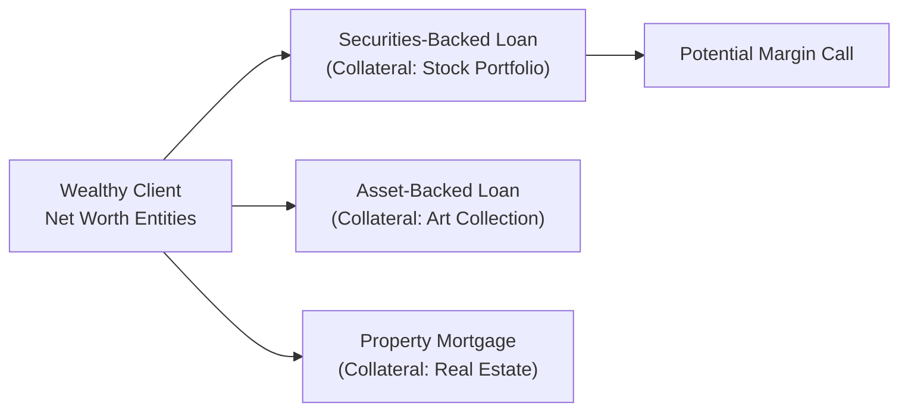
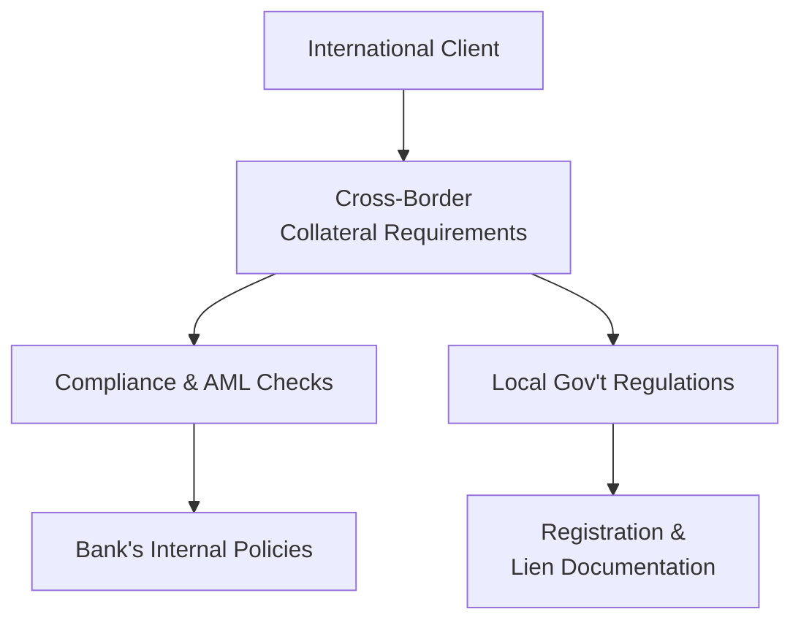

## Introduction

Specialized lending solutions often feel like one of those advanced secrets only the uber-wealthy unlock. At first glance, it’s easy to think: “Why not just use cash?” But, as we’ve explored throughout this chapter (and indeed within other sections like managing complex family arrangements and cross-border taxation), high-net-worth individuals face significant challenges when it comes to cash flow timing, asset concentration, and strategic diversification. Sometimes they need to meet tax obligations quickly, fund a new venture, or finance real estate acquisitions without triggering adverse tax consequences by liquidating large holdings.  

This is where specialized lending solutions step in. Whether it’s a securities-backed loan, a jumbo mortgage, or a line of credit collateralized by luxury real estate or a private art collection—these solutions give clients flexible ways to meet cash flow needs.  

Let’s walk through the key ideas behind managing credit, the possible pitfalls if not handled with care, and how strategic debt usage can optimize a family’s overall wealth plan.  

## Tailored Lending Products

High-net-worth families are often well-served by borrowing structures specifically designed for larger or more complex balance sheets. For instance, jumbo mortgages or “Lombard loans” (common in private banking) offer immediate liquidity, generally at competitive rates, secured by liquid portfolios. Let me share a quick anecdote: I remember a client who used a securities-backed loan (SBL) to purchase their dream vacation home without having to sell a large block of appreciated stocks. This allowed them to avoid a hefty capital gains tax bill, keep exposure to their beloved portfolio, and still lock in the new property.  

A specialized product might be:  
• Securities-Backed Loans (SBL) or Lombard Loans: Collateral is the client’s portfolio of stocks, bonds, or mutual funds.  
• Jumbo Mortgages: Larger-than-usual mortgages for high-value properties.  
• Structured financing: Customized solutions that might combine equity-linked notes, derivatives, or other specialized instruments.  

It’s not just about the product; it’s also about the interest rates, the required collateral, and the possibility that your portfolio might drop in value—hello, margin call risk! Which leads us to the next big thing: ensuring you understand the specifics of each line of credit.  

## Credit Facilities for Tax or Liquidity Events

Ever had that moment where you owe a major tax payment, but you’d like to wait a bit before selling off your big stock positions because the market is in a dip? Some wealthy families take out short-term credit lines to cover a tax liability until the timing to sell is more favorable (perhaps next year’s estate planning, or after a big corporate announcement).  

Similarly, credit lines can be used to cover capital calls for a private equity fund, or bridging the gap between buying a new real estate property and selling the old one. The critical aspect here is to keep an eye on:  
• Interest expense implications: Is the rate fixed or variable? How does it compare to anticipated investment returns?  
• Repayment timeline: What if the sale is delayed? Or if the investment distribution from the fund is postponed by several quarters?  
• Potential impact on overall liquidity strategy: Will the client still have enough liquidity to handle emergencies after taking on this new short-term debt?  

A small numeric example can put this into perspective. Suppose a client is facing a $1 million tax bill but wants to delay selling appreciated securities until the next fiscal year. They secure a six-month line of credit at an annual interest rate of 4%. Interest cost for six months on $1 million is roughly:  
(4% ÷ 2) × $1,000,000 = $20,000  

If they expect the portfolio could appreciate by at least 3–5% in that timeframe (or they want to avoid a 20% capital gains tax on a large block sale right now), it might be worthwhile to pay that $20,000 cost.  

## Debt Strategies for Diversification

Sometimes families use leverage to diversify outside of their existing holdings. Perhaps a patriarch has almost all his wealth in the family business. So, he might take out a loan against his business shares (if permissible) to invest in real estate and public equities, thereby spreading out his risk.  

But let’s be real: leverage is a double-edged sword. Sure, if markets do well, your returns might be boosted. But if markets go down—especially if you’re using margin or a loan with specific covenants—your losses can magnify quickly. It’s crucial to:  
• Stress-test: Model scenarios where markets drop by 10%, 20%, or more.  
• Revisit liquidity buffers: Are there enough reserves in place to ride out a downturn and avoid forced sales?  
• Evaluate interest costs: If the interest rate environment spikes, can you still comfortably service the debt?  

One might recall from Chapter 4.6 on Alternative Investments that using leverage alongside private equity or hedge fund investments can accelerate returns—at the cost of higher volatility and greater chance of margin calls or default triggers.  

## Collateralized Borrowing/Asset-Backed Lending

This can be quite fascinating, where wealthy clients borrow against real estate, yachts, aircraft, art collections, or even intangible assets like brand value (though that’s less common, typically in structured corporate finance). Here, the tricky parts are:  
• Reliability of valuations: Artwork might be appraised differently by different experts, and the market can be illiquid.  
• Loan-to-Value (LTV) ratios: Lenders might provide only 30–50% of the value of an art piece, for instance, because it’s not as liquid as a stock portfolio.  
• Insurance and storage: Collateral that’s physically stored (e.g., artwork in a safe facility, or a yacht in a specialized marina) may require unique insurance coverage.  
• Market liquidity risk: Even if an asset is appraised at $10 million, you might not be able to sell it quickly at that price if you need fast cash to cover a margin call.  

A friend of mine who worked in private banking told me about a client who pledged an extremely rare antique car collection valued at $15 million to secure a $5 million loan for a real estate project. Insurance and ongoing valuations were super important. The arrangement worked fine—until the client decided they wanted to drive one of the antiques on a road trip! That introduced new complications for the insurance coverage.  

## Margin Loans on Investment Portfolios

Margin loans, by definition, allow clients to borrow money secured by the value of their liquid securities (stocks, bonds, mutual funds, or exchange-traded funds). These can offer relatively low interest rates, especially if you have a high-quality portfolio.  

However, margin calls can be a big risk. If your portfolio’s value dips below a threshold, the lender requires additional collateral or partial repayment. Forced liquidation can happen at the worst time, which might lock in losses. Best practice includes:  
• Establishing a comfortable cushion above maintenance margin requirements.  
• Setting up automated alerts if the portfolio approaches critical LTV thresholds.  
• Considering a dynamic rebalancing strategy to reduce the probability of a margin call.  

In more advanced private banking settings, margin agreements might be structured in a more flexible way. But even then—market volatility can wreak havoc.  

Here’s a brief example to illustrate margin calls:  
• You have $2 million in securities. You borrow $1 million (i.e., 50% LTV).  
• The brokerage firm sets a maintenance margin of 35%.  
• If your securities drop below about $1.54 million in total value (because: amount borrowed / total portfolio value = maintenance margin), you’ll get a margin call.  
• At that point, you must either deposit more cash or securities—or the broker might sell some of your holdings.  

## Credit Risk Management

Credit lines are not just about interest rates; they integrate into the entire risk profile of a client’s balance sheet. If a family overextends leverage during good times and markets turn sour, net worth can dwindle rapidly. Consider how the 2008 financial crisis caught many investors off guard with real estate and margin loans.  

Strategies to mitigate these risks:  
• Diversification across multiple collateral types, so you’re not fully exposed to a single asset class meltdown.  
• Building liquidity buffers, such as maintaining a set of cash-equivalent assets or a stable bond portfolio.  
• Understanding cross-default clauses: If you have multiple loans, a default under one can trigger a default on another.  

From a private wealth manager’s perspective, it’s a balancing act: you want to propose feasible credit solutions that can help the client achieve goals—like bridging capital, acquiring a property, or meeting philanthropic commitments—while ensuring they’re not setting themselves up for an unexpected chain of margin calls.  

Below is a simplified Mermaid diagram illustrating how multiple credit facilities fit within an overall wealth plan. The idea is to visualize how each loan is secured, how it interacts with the total net worth, and how margin calls might cascade if a single part of the plan runs into trouble.

In this simplified illustration, each credit facility is linked to a particular type of collateral, but the entire arrangement ties back to the overall net worth of the client. A margin call in one facility can prompt rushed liquidations, which might also affect the ability to service or maintain other loans.  

## Structured Finance and Mezzanine Solutions

For ultra-high-net-worth clients, especially those looking to expand businesses, acquire new companies, or raise bridging capital, structured finance might be the route. This often involves more creative deals, like a loan with embedded equity conversion features. Mezzanine financing can be subordinated (meaning it’s riskier than senior debt) and might carry higher interest rates or equity participation for the lender.  

Key considerations:  
• Subordination level: Where does this debt rank if the borrower faces financial distress?  
• Covenants: Usually more restrictive in mezzanine deals. They might require regular financial disclosures or limit additional borrowing.  
• Cost of capital: Because it’s riskier for the lender, mezzanine interest rates can be steep. However, for a short-term bridging strategy or a pivotal business expansion, it might still be worth it.  
• Default or conversion provisions: The lender often has the right to convert debt into equity if the borrower cannot pay on time—this obviously dilutes the borrower’s ownership.  

One scenario is an entrepreneur who’s making a big acquisition but can’t quite secure the entire loan from a traditional bank. They fill the “gap” with mezzanine capital. The trade-off? Higher interest costs and more constraints from the mezz lender.  

## Regulatory and Compliance Considerations

Now, a crucial piece of the puzzle is ensuring compliance and adhering to local regulations. The wealthy might have assets in multiple countries. One property in Europe, another in New York, a private equity investment in Asia. Each region has distinct lending rules, anti-money-laundering (AML) requirements, and tax laws.  

• Cross-border collateral: Some jurisdictions don’t allow pledging certain assets located abroad, or the process requires a local bank guarantee.  
• AML compliance: Large loans often trigger AML scrutiny, so verifying the source of funds, the beneficial owners, and the intended usage is mandatory.  
• Reputational risk for the advisor: Overlooking local regulations can cause legal trouble for both the client and the advisory firm.  
• Regulatory arbitrage: Some families deliberately set up structures in favorable jurisdictions to reduce the overall cost or complexity of borrowing. Of course, the moral/HQ question is whether this is within or outside the letter and spirit of the law.  

Staying up to date with new regulations is essential. As a private wealth manager, you might coordinate with local legal advisors, trust companies, and specialists in each jurisdiction.  

In the diagram above, notice how cross-border lenders must integrate clients’ assets, local governments, compliance processes, and internal bank policies. This can get complicated fast.  

## Best Practices and Common Pitfalls

• Manage leverage conservatively: A robust margin of safety helps in periods of volatility, preventing sudden forced sales.  
• Think about interest rates: If you anticipate rates going up, locking in a fixed rate might help avoid surprises.  
• Keep everything in the broader wealth context: The credit strategy should align with overall life goals, philanthropic objectives, and estate planning.  
• Communicate with all advisors: If lawyers, tax advisors, and wealth managers don’t coordinate, you might accidentally trigger unfavorable tax outcomes or violate loan covenants.  
• Don’t get complacent: Just because rates are low or markets are rising doesn’t mean it’s safe to max out your credit lines.  

## Conclusion and Exam Tips

Specialized lending solutions allow wealthy individuals to finance major life events, pursue new ventures, or manage tax obligations without prematurely liquidating key assets. But leverage, while powerful, raises the potential for liquidity crises if market conditions turn.  

In the CFA Level III exam, scenario-based questions may ask you to:  
• Recommend the optimal type of loan for a short-term tax liability.  
• Evaluate the impact of margin calls on a portfolio’s net worth under varying market conditions.  
• Propose credit strategies for clients holding concentrated positions (like we discussed in other sections of Chapter 6).  
• Compare the trade-offs between a securities-backed loan, a mezzanine deal, and a standard mortgage.  

When tackling essay or item-set questions:  
1. Clarify the client’s situation: Time horizon, risk tolerance, asset mix, and liquidity needs.  
2. Calculate the costs: Potential interest expenses, tax considerations, and margin implications.  
3. Integrate solutions: Show how the recommended borrowing strategy fits in with the overall wealth plan.  
4. Use cautionary disclaimers: Highlight how changing interest rates or market volatility can alter the analysis.  
5. Watch for compliance references: The CFA exam often tests your ethical and regulatory knowledge.  

At the end of the day, wealth managers who master specialized debt structures can deliver enormous value to their clients—helping them meet obligations, fund opportunities, and maintain a stable nest egg for future generations. But proceed wisely: poorly timed or sized leverage can quickly erode wealth instead of preserving or growing it.

## References & Further Reading

• Credit Suisse: “Private Banking and Credit Solutions” (https://www.credit-suisse.com)  
• UBS Wealth Management: “Global Family Office Report on Leveraged Strategies”  
• Moody’s Analytics: “Structured Finance Credit Risk Assessment”  
• CFA Institute Research Foundation: “Margin Lending and Portfolio Management”  
• Milne, A. (2009). The Fall of the House of Credit. Cambridge University Press  

## Test Your Knowledge: Specialized Lending and Credit Management



### Which of the following best describes a securities-backed loan (SBL)?

- [ ] A short-term loan used exclusively to pay tax obligations on behalf of a client.  
- [x] A loan collateralized by a portfolio of marketable securities, such as stocks or bonds.  
- [ ] A construction loan typically applied to real estate development projects.  
- [ ] A non-recourse line of credit backed by precious metals.  

> **Explanation:** A securities-backed loan (SBL) is secured by a portfolio of marketable investments, which serve as collateral.  

### Which statement most accurately captures an advantage of using credit facilities to cover tax liabilities?

- [ ] They always offer better returns on the borrowed funds than the underlying investments.  
- [ ] They defer the tax obligations indefinitely without penalties.  
- [x] They can allow the client to avoid liquidating assets at unfavorable prices or during a market dip.  
- [ ] They do not require any collateral.  

> **Explanation:** One primary motivation for using a credit facility to pay taxes is to avoid forced liquidation of assets at inopportune times.  

### What is the main risk associated with margin loans on investment portfolios?

- [ ] The interest rate is always fixed, making them more expensive.  
- [x] Margin calls may force the liquidation of assets when prices are depressed.  
- [ ] They offer no flexibility in how borrowed funds are deployed.  
- [ ] Collateral is restricted to only real estate holdings.  

> **Explanation:** Margin calls can be triggered if the collateral falls in value, potentially forcing the sale of securities at lower prices.  

### When borrowing against illiquid assets such as fine art, which factor is typically the most challenging?

- [ ] Low interest rates offered by banks.  
- [ ] Lack of regulatory oversight.  
- [x] Accurately valuing and ensuring sufficient liquidity for the collateral.  
- [ ] Minimal insurance requirements.  

> **Explanation:** Illiquid assets (like artwork or collectibles) can be hard to value, and the market to sell them quickly may be very limited.  

### Which strategy best helps reduce the probability of a margin call?

- [x] Maintaining a larger cushion above the required maintenance margin.  
- [ ] Borrowing the maximum allowable under margin rules initially.  
- [x] Keeping some liquidity or unencumbered assets aside.  
- [ ] Ignoring stress tests because margin calls are rare.  

> **Explanation:** Investors can maintain a larger buffer above maintenance margin and hold some liquidity in reserve to prevent forced liquidations.  

### What distinguishes mezzanine financing from standard senior debt?

- [x] Mezzanine financing often carries the right to convert to equity if the borrower defaults.  
- [ ] Mezzanine financing is always secured by public equities.  
- [ ] Standard debt ranks below mezzanine in terms of payment priority.  
- [ ] Mezzanine financing typically comes at lower interest rates than senior debt.  

> **Explanation:** Mezzanine financing is riskier (subordinated) and may include equity conversion features if payments aren’t made on time.  

### Which of the following is NOT a recommended best practice for advisors guiding clients on specialized lending?

- [x] Encouraging clients to borrow as much as possible during low interest rate environments.  
- [ ] Stress-testing the debt structure for market downturns.  
- [x] Maintaining sufficient liquidity buffers in case of margin calls.  
- [ ] Reviewing cross-default clauses in all credit agreements.  

> **Explanation:** Borrowing as much as possible—solely due to low rates—can be extremely risky. Advisors should encourage prudent borrowing levels and maintain liquidity.  

### A cross-default clause means:

- [ ] The borrower can refinance all their loans across different lenders under one contract.  
- [ ] The borrower is protected if they default on one loan but remain current on others.  
- [ ] The lender must forgive the borrower’s remaining balance after an initial default.  
- [x] A default on one loan may trigger a default on additional loans held by the same borrower.  

> **Explanation:** Cross-default clauses allow creditors to declare a default across multiple loans if the borrower defaults on any single obligation.  

### In a jumbo mortgage context, why might a high-net-worth individual prefer this route versus paying cash?

- [x] They might want to keep funds invested in higher-returning markets.  
- [ ] Jumbo mortgages always have zero closing costs.  
- [ ] Paying cash triggers immediate capital gains taxes on real estate.  
- [ ] Jumbo mortgages are the only option for purchasing a second home.  

> **Explanation:** A common rationale is preserving investment capital in potentially higher-yielding opportunities rather than liquidating for a property purchase.  

### Margin calls can be entirely avoided if:

- [x] True  
- [ ] False  

> **Explanation:** While not guaranteed, a margin call can sometimes be avoided if the investor has enough collateral and manages the LTV proactively—some portfolios never drop to levels that prompt a call, especially with conservative borrowing.  

  
