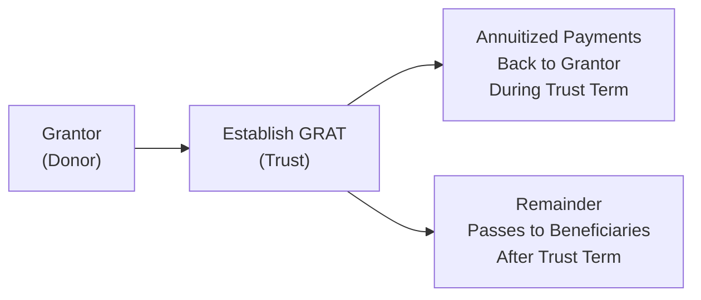

## Introduction

Maybe you’ve heard people talk about gifting assets to their kids “while they’re still around” or read about families transferring wealth to avoid hefty estate taxes. Well, lifetime gifting often proves to be a critical piece of a broader estate plan. It allows you to support beneficiaries—whether they’re children, grandchildren, or charitable organizations—during your lifetime. And, from a practical standpoint, it might reduce the overall tax burden on your estate. This section dives into the strategies, benefits, and technicalities of lifetime gifts and intergenerational transfers. 

We’ll explore a range of topics, from using annual gift tax exemptions effectively to understanding when more advanced tools (like grantor retained annuity trusts) might be worth your consideration. There’s quite a bit of nuance here, so let’s dig in.

## Definition and Rationale for Lifetime Gifts

Most of us think of wealth transfer in terms of wills and inheritances—assets passed on at death. Lifetime gifts, however, operate very differently and often more flexibly. A lifetime gift is simply a transfer of cash, property, or other assets from one individual (the donor) to another (the recipient) while the donor is still living. 

Why consider gifting during your lifetime?

• Reduce eventual estate size: By transferring assets early, you may reduce the overall value that’s considered part of your taxable estate.  
• Help loved ones now: Some donors choose to give assets before death so they can see loved ones or favorite charities benefit in real time.  
• Potential tax advantages: Most jurisdictions have annual gift tax exclusions or thresholds that let you gift a certain amount tax-free. Over time, strategic use of these exclusions can significantly lower estate tax liabilities.  
• Control and legacy: Certain structures (discussed in detail below) let you “freeze” asset values or keep some measure of control while still shifting future appreciation out of your estate.

Of course, there’s also a purely human reason: it feels good. Many individuals genuinely enjoy watching the tangible benefits of their gifts during their lifetime.

## Utilizing Annual Gift Tax Exemptions

One of the simplest strategies is to leverage annual gift tax exemptions. In some jurisdictions, there’s an annual limit that can be gifted to any individual without incurring gift tax or using up a lifetime exemption. In the United States, for example, a donor might be allowed to give up to a certain amount (e.g., US$17,000 per year, subject to IRS updates) to each recipient. 

Let’s just say, hypothetically, that you want to give your niece US$17,000. If that’s at or below the current annual exclusion, you can efficiently transfer that sum without having to file a complex gift tax return. Over multiple years—and potentially to multiple beneficiaries—this can add up to considerable wealth transferred, entirely or largely free of gift and estate tax consequences.

• Gift Splitting: If you’re married, certain tax authorities allow what’s called “gift splitting.” Essentially, you and your spouse can combine your annual gift exclusions to double the amount you transfer to a single recipient. This can be particularly powerful if you have large sums you wish to distribute methodically over time.

• Exclusion vs. Exemption: Don’t mix up annual exclusions with lifetime exemptions. The annual exclusion is the per-person, per-year limit, while the lifetime exemption (often in the millions) is the total amount you can transfer over your lifetime before gift taxes might start applying. 

By the way, I remember seeing my aunt shift a modest amount of stock to her grandson year after year. It didn’t seem like much at first, but over two decades, that consistent strategy allowed him to build a solid investment portfolio—and it was all accomplished without gift tax consequences.

## Structures for Lifetime Transfers

Simply handing over a check or physical asset to someone is the most straightforward approach. But as wealth levels increase, more sophisticated structures come into play:

• Outright Gifts: The simplest form—just an unconditional transfer. For well-defined gifts of cash or easily valued assets, an outright transfer can be quick, though you do lose control over the asset from that moment onward.

• Intra-family Loans: A structured loan between family members at a prescribed interest rate (often the Applicable Federal Rate, or AFR, in the U.S.). If the investment return on the loaned asset exceeds the loan’s interest rate, wealth accumulates in the borrower’s hands rather than the lender’s. 

• Family Limited Partnerships (FLPs): Frequently used when transferring real estate or business interests, FLPs allow donors to keep control (as general partners) while transferring limited partnership shares (with possible valuation discounts) to beneficiaries. If the partnership units cannot be easily sold (lack of marketability), or if the transferee holds a minority interest, these discounts can significantly reduce the transfer’s taxable value.

• Trust Structures: Various forms of trusts can help tailor how assets are distributed, especially if there are concerns about beneficiary maturity, competence, or potential creditors. Some trusts are specifically designed for gift strategies—like Grantor Retained Annuity Trusts (GRATs) or Intentionally Defective Grantor Trusts (IDGTs)—which we’ll explore in a bit.

Valuation discounts—particularly for FLPs—are a key concept. Because the limited partnership interest might be considered less liquid or lacking control, the IRS (in the U.S.) and other authorities often sanction a reduced valuation. This discount effectively lowers the taxable gift, stretching your gift tax exemptions even further.

## Estate Freezing Techniques

Estate freezing can be a bit of a headache initially, but it’s huge for individuals looking to limit how much of their estate gets taxed upon death. The basic idea is: you freeze an asset’s current value in your estate, and transfer any future growth or appreciation to someone else—often children or trusts for their benefit.

• Grantor Retained Annuity Trusts (GRATs): You place assets in a trust, retain the right to receive a fixed annuity for a set term, and let the remainder pass to beneficiaries when the trust term ends. If the assets grow faster than the IRS “hurdle rate,” that excess growth gets passed along free of estate or gift tax (beyond the initial cost at the trust’s setup).

• Intentionally Defective Grantor Trusts (IDGTs): The trust is considered “defective” for income tax purposes but valid for estate/gift tax. You effectively sell or transfer assets to this trust. You, the grantor, pay income taxes on trust earnings, which further reduces your taxable estate while allowing the trust assets to grow tax-free for your beneficiaries.

The common theme here is shifting future appreciation out of your estate. Yes, these can be complicated to arrange, and they require careful drafting and compliance. But done right, these tools provide potentially massive tax savings.

Below is a quick diagram illustrating a simplified view of how a GRAT might function:

In the diagram, the grantor sets up the GRAT (B) and funds it, receives a series of annuity payments (C), and whatever remains at the end is transferred to the beneficiaries (D). If the assets appreciate above the discount rate, that growth escapes the grantor’s estate.

## Strategies for Business Owners

If you own a closely held business—or any business, really—lifetime transfers can be a vital part of your succession plan. You might want your children to take over eventually, or you may want to transfer partial ownership to key employees while retaining some control.

• Transferring Future Appreciation: Giving business equity at earlier stages (when the valuation might be relatively low) ensures that future increases in the value of the shares will occur outside your estate. You effectively “lock in” a lower valuation for gifting purposes.

• Family Limited Partnerships or Corporations: Consider recapitalizing a business with voting and nonvoting shares, or using a limited partnership structure. You could hold voting shares to maintain control, while transferring nonvoting shares (often subject to valuation discounts) to heirs.

• Buy-Sell Agreements: This is more of a business continuity issue, but many buy-sell agreements contain provisions for how owners or the next generation can buy out a departing shareholder. These can dovetail nicely with a gifting or estate plan to ensure a smooth transition without forcing heirs into unwanted co-ownership or liquidity crises.

For more detail on managing private business equity and ensuring smooth transitions, you might also glance at Section 6.4 (Addressing Concentrated Equity Ownership in Private Businesses).

## Regulatory and Tax Ramifications

You’ve probably sensed by now that tax authorities pay close attention to gifts, especially large ones. Rules vary across countries, but some general considerations apply:

• Gift Tax Filings: In many places, you must file a specific return or disclosure whenever you transfer assets above a certain threshold. Even if no taxes are owed, missing the paperwork can trigger penalties or problems down the road.

• Cross-Border Issues: If you, the recipient, or the assets themselves are located in different countries, you may deal with multiple tax regimes at once. Double-taxation treaties can sometimes mitigate (or complicate) these issues. 

• Documentation: A “document everything” approach is best. Create paper trails (or digital records) of valuations, gift agreements, tax forms, and any relevant trust or FLP documentation. If authorities question your discounted valuation, you’ll need robust evidence to support it.

• Potential Clawbacks: In some jurisdictions, if you pass away within a certain timeframe after making a gift, that gift may be brought back into your estate for taxation. Always confirm local laws.

## Monitoring and Adjusting the Transfer Plan

Your life circumstances change—maybe you retire earlier than expected, or you sell a property at a gain, or someone in the family encounters new financial needs. Tax laws also shift unpredictably. 

The point is, you can’t just “set it and forget it.” Any sound wealth transfer strategy involves periodic check-ins:

• Asset Sufficiency: Verify that you’re not over-gifting. You still need sufficient resources for your own retirement or other personal goals.  
• Regulatory Updates: Keep track of your jurisdiction’s tax code changes. Politicians love to adjust gift and estate thresholds.  
• Family Dynamics: Maybe that family member you entrusted with a business interest is no longer as responsible or engaged as you’d hoped. Sometimes you have to pivot strategies—or reassign trustees or general partners.  
• Stress Testing: Build a cushion in case you live longer or need more liquidity. As a reminder, see Chapter 3.7 (Scenario Analysis and Stress Testing for Private Wealth Plans) for tools and tips here.

## Practical Example and Brief Anecdote

Imagine an investor named Danielle. She’s got a sizeable estate, including a residential property worth $2 million that she believes will skyrocket in value once a local development is complete. Danielle’s estate planning goal? Transfer the property’s future appreciation out of her estate. 

She sets up a Grantor Retained Annuity Trust, funds it with the property, and retains an annual annuity equivalent to today’s property value. If, over the next five years, that property appreciates to $3 million, the additional $1 million of value is passed to her children with minimal tax owed. Danielle sees the direct benefit—she’s “frozen” the property value in her estate while shifting new growth to her heirs. She also keeps some measure of control and a steady income-equivalent via her retained annuity. 

A few disclaimers: She needs legal help to establish the GRAT properly. Different rules might apply if the property is sold inside the trust. But the potential long-term tax savings and wealth shift can be huge.

## Glossary

Gift-Tax Exemption: A designated monetary threshold under which a gift is not subject to gift tax.  
Grantor Retained Annuity Trust (GRAT): A trust arrangement allowing a grantor to freeze an asset’s value and transfer future appreciation to heirs.  
Intentionally Defective Grantor Trust (IDGT): A trust used to shift assets to heirs, with the grantor paying income taxes on trust earnings.  
Family Limited Partnership (FLP): A partnership structure for consolidating family assets and simplifying generational transfers, often allowing valuation discounts.  
Valuation Discount: A reduction in an asset’s assessed value due to factors like lack of marketability or minority ownership.  
Estate Freeze: A strategy aimed at capping the value of certain assets in one’s estate so future appreciation bypasses additional estate taxes.  
Intra-family Loan: Providing a loan at the prescribed interest rate to a family member; used as a wealth transfer vehicle if underlying assets outperform the interest rate.  
Gift Splitting: A strategy enabling spouses to treat a gift made by one spouse as though each contributed half, effectively doubling annual exclusions or other limits.

## References and Further Reading

• “Estate Planning for Private Wealth Management” by R. Jordan (XYZ Publishing)  
• “Structuring Intergenerational Transfers in the Modern Era” (Journal of Wealth Preservation)  
• IRS Publication 950 (for U.S. readers): Introduction to Estate and Gift Taxes – https://www.irs.gov/  
• “Family Wealth Management: Seven Imperatives for Successful Investing in the New World Order” by Mark Haynes Daniell and Tom McCullough  

## Final Exam Tips

As a CFA candidate working through private wealth management concepts, expect scenario-based questions testing your ability to advise clients on lifetime gifting and estate tax minimization. You might see item sets requiring calculations around annual gift exclusions, or essay questions prompting you to recommend an optimal blend of estate freeze vehicles for a family business owner. 

• Understand how to explain, in plain English, the value of transferring assets early.  
• Practice identifying which vehicles—FLPs, GRATs, IDGTs, or simple outright gifts—best meet specific client goals.  
• Keep an eye on gift splitting and valuation discounts in calculations, as these commonly appear in exam examples.  
• Don’t forget cross-border subtleties: The exam may involve multiple jurisdictions, each with different threshold amounts or rules.

Be ready to walk through real-world examples under time pressure, confirming your mastery of the “how,” not just the “why.” Good luck—and remember, the key to effectively transferring wealth is combining strategic foresight with ongoing flexibility.

---

## Test Your Knowledge: Lifetime Gifts and Intergenerational Transfers



### Which of the following best describes a primary motivation for making lifetime gifts?

- [ ] To increase the taxable size of the estate
- [x] To transfer assets while potentially reducing future estate tax
- [ ] To pay higher taxes currently
- [ ] To eliminate the need for annual reporting to tax authorities

> **Explanation:** One of the main advantages of lifetime gifts is reducing the size of the taxable estate, thereby potentially reducing future estate tax liabilities.

### Under the annual gift tax exclusion (in jurisdictions with such rules), which statement is true?

- [x] Donors can transfer up to a certain annual limit to each beneficiary without incurring gift tax.
- [ ] Donors must pay a gift tax on every transfer, regardless of size.
- [ ] Donors must pay the beneficiary’s income taxes for any gifted amount.
- [ ] Donors cannot split the gift with a spouse in any circumstance.

> **Explanation:** Many jurisdictions allow an annual gift tax exclusion, which permits a specific amount to be gifted tax-free to each beneficiary. Gift splitting with a spouse may be authorized in certain locations.

### What is the key characteristic of a Grantor Retained Annuity Trust (GRAT)?

- [ ] It converts income into gambling proceeds.
- [ ] It only applies to international investments.
- [x] The grantor retains annuity payments, and excess appreciation passes to beneficiaries.
- [ ] It automatically triggers full estate taxes at the end of its term.

> **Explanation:** A GRAT freezes asset value for tax purposes by returning an annuity to the grantor, letting beneficiaries receive any growth above the hurdle rate.

### Intra-family loans are often used to:

- [x] Lend assets at a prescribed interest rate so any excess returns accrue to the borrower.
- [ ] Take advantage of corporate bond rates set by central banks.
- [ ] Pool family expenses for vacation planning.
- [ ] Eliminate the obligation for repayment if the loan is below the annual exclusion.

> **Explanation:** By lending assets at a prescribed “safe-harbor” rate, any returns in excess of that rate effectively transfer wealth to the borrower without incurring gift tax ramifications (beyond initial setup, if any).

### In a Family Limited Partnership (FLP), which factor often leads to a valuation discount for transferred interests?

- [x] The lack of marketability and minority interest features associated with the limited partnership.
- [ ] The guaranteed liquidity provided to general partners.
- [x] The presence of voting and non-voting shares within a single partnership.
- [ ] Its classification as a municipal bond for tax reporting purposes.

> **Explanation:** FLPs allow limited partnership interests with restricted marketability and minority positions, which can justify a valuation discount when transferring interests to heirs.

### The term "estate freeze" generally refers to:

- [x] A method to lock in the current value of assets for estate tax purposes while shifting future appreciation outside the estate.
- [ ] A jurisdictional mandate that disallows any form of gift above a nominal amount.
- [ ] A short-term arrangement that suspends all estate planning.
- [ ] A penalty imposed if the donor violates cross-border regulations.

> **Explanation:** Estate freezing moves future asset appreciation away from the donor’s estate, reducing the taxable value at death.

### A beneficiary receives shares in a private family business through an FLP. Which advantage can the beneficiary potentially enjoy?

- [x] Asset growth outside the donor’s estate, while receiving shares at a discounted value.
- [ ] Automatic conversion into a publicly traded stock at listing price.
- [x] Instant liquidity guaranteed by the general partner.
- [ ] The ability to veto all FLP decisions unilaterally.

> **Explanation:** FLPs typically allow minority interest valuation discounts and can lock in a lower transfer value. Liquidity may be limited in many FLP arrangements.

### What’s a potential risk of using advanced estate freeze strategies like Grantor Retained Annuity Trusts or IDGTs?

- [x] If the donor passes away before the trust term ends, some or all of the assets may revert to the donor’s estate for tax purposes.
- [ ] The trust automatically dissolves if the beneficiary disagrees with the arrangement.
- [ ] Any appreciation in the trust is always taxed twice.
- [ ] The donor cannot change any provisions once the strategy is implemented.

> **Explanation:** If the grantor dies during the GRAT’s term, a portion of the trust assets may be included in the estate. This can partially defeat the freeze technique.

### For a cross-border gift, which consideration is most important?

- [x] Complying with multi-jurisdictional tax reporting and potential double-tax treaties.
- [ ] Ensuring the donor’s local bank issues a check in the correct currency denomination.
- [ ] Assuming only the donor’s country has any tax jurisdiction.
- [ ] Requesting that no formal records be maintained to avoid conflict.

> **Explanation:** When the donor, recipient, or the assets are in different countries, multiple sets of tax rules may apply, and documentation is crucial.

### Estate planning strategies for lifetime transfers should be reviewed regularly because:

- [x] Tax laws and personal circumstances can change over time.
- [ ] Lifetime gifts are only effective for exactly 12 months.
- [ ] Annual gift tax exclusions can never be adjusted by authorities.
- [ ] Once established, a trust cannot continue beyond five years.

> **Explanation:** Estate laws, family dynamics, and financial circumstances evolve, requiring periodic review of any wealth transfer plan.


