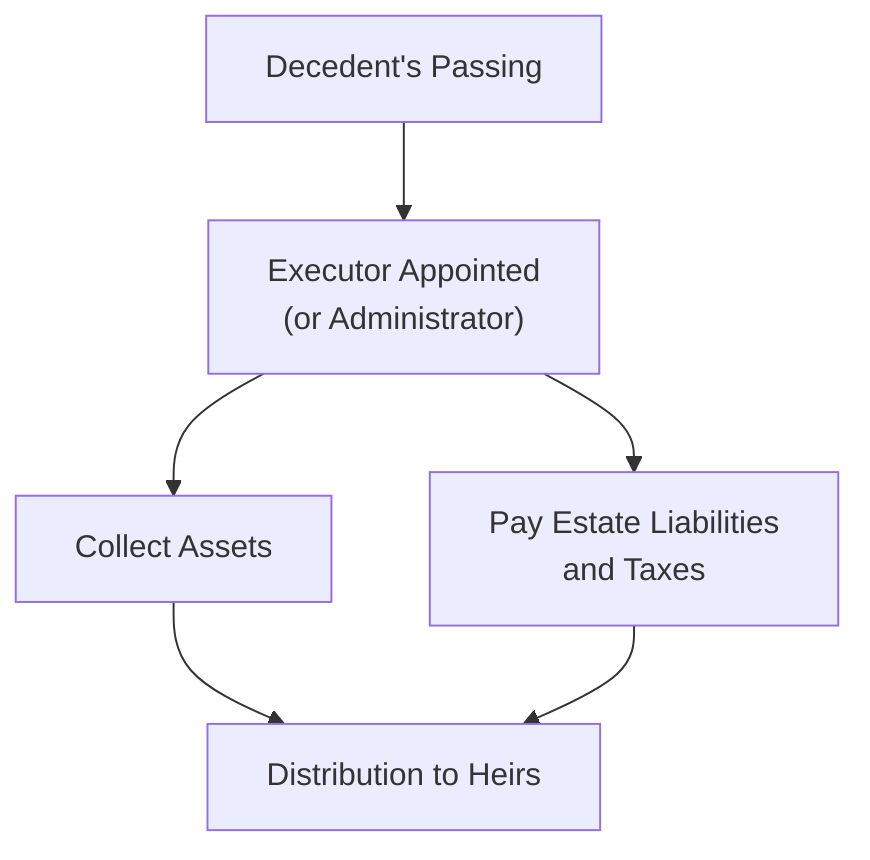

## Introduction
So, picture this scenario: you have spent years (maybe decades!) building up your wealth—through investments, real estate, maybe a private business or a carefully curated art collection. And you have all these questions about what happens when you’re gone. That’s where this section on Bequests and Inheritances comes in. It might sound a bit morbid at first, right? But bequests are simply a structured way to pass on money, property, or other assets upon your death to the people or causes you care about most. 

The idea of leaving something behind can carry sentimental weight, plus a heap of legal and tax considerations. If we don’t address these issues proactively, we can end up with bickering heirs, hefty estate tax bills, or assets stuck in a complex probate process for years. In other words, it can get messy. This article aims to walk you through the crucial (and sometimes rather finicky) details of bequests and inheritances, so you can make well-informed decisions that preserve both wealth and family harmony.

We’ll talk about how bequests fit within the broader framework of estate planning, focusing on critical considerations: from specialized legal structures like forced heirship to the practicalities of spousal rights, plus a few real-world examples illustrating key lessons. We’ll share best practices and pitfalls gleaned from years of estate planning experiences—both my own personal anecdotes and from professionals in the wider wealth management community. Let’s dive in and see how these pieces come together in a plan that outlasts you, all while maximizing the benefits for your descendants, charities, or whoever is lucky enough to get your legacy.

## The Role of Bequests in Estate Planning
The concept of a bequest is essentially about transferring an individual’s assets upon death via a will (or a codicil, which is an amendment to a will). Just as you might set aside a special box of family photos for your niece or nephew, a bequest formalizes that passing of assets—but on a grander scale, often involving properties, business holdings, or large sums of cash. 

Estate planning is all about harnessing the power of legal tools to ensure your wishes are carried out after you are no longer around to speak for yourself. A well-crafted estate plan can minimize ambiguity, thereby reducing the risk that your heirs will squabble over an asset’s rightful ownership. It can also help with controlling how much estate or inheritance tax your heirs might pay, especially if you use trusts or other structures covered elsewhere in this chapter and in Chapter 3 on Wealth Planning. 

Bequests can be a tool for charitable missions as well. Some individuals choose to bequeath gifts to philanthropic organizations, setting up scholarships, research grants, or legacy awards in their name. This philanthropic angle can reduce the taxable value of the estate. It also helps align the estate with your broader life values, ensuring that your wealth extends its impact beyond your immediate circle of loved ones. 

Plus, having bequests clearly outlined in a will can help families coordinate with other aspects of wealth transfer, from lifetime gifts (discussed in Section 7.1) and beneficiary designations on retirement accounts to responsibilities laid out for trustees. The synergy between these elements can make or break the long-term success of a generational wealth plan. 

## Forms of Bequests
Not all bequests are created equal. When you say you want to leave a certain asset to someone, it can take different shapes:

• Specific bequest: This is straightforward, like specifying, “I give my grandfather’s antique watch to my eldest nephew.” That’s basically earmarking a particular item or asset to a specific beneficiary—no wiggle room there.  
• General bequest: This is typically a certain amount of money (e.g., “I give $50,000 to my sister”). The key difference is that the decedent’s entire estate can be tapped to fulfill the cash sum, whereas a specific bequest is about a distinct item or property.  
• Residuary bequest: After you’ve made specific and general bequests, there might be leftover stuff—like unallocated real assets, intangible financial assets, or property not otherwise accounted for in your will. If your will states, “The rest goes to my spouse,” that’s a residuary bequest.  
• Contingent bequest: This only kicks in if a certain event or condition happens (or doesn’t happen). For example, “If my brother doesn’t survive me by 30 days, his share goes straight to my niece.” That’s a contingency that ensures assets flow in a manner consistent with your wishes if unexpected circumstances arise.

In practice, partial intestacy (dying with a valid will that doesn’t cover everything) can create complications that might cause beneficiaries to get more or less than intended. Another trouble spot is ambiguous language. If your will says, “I leave my condo in Manhattan to my cousin,” but you have multiple condos in Manhattan or you sold the property but later bought it back, confusion can lead to drawn-out probate disputes. 

And here’s a small personal aside: I once knew a family that had a painfully long legal battle because their mother said she wanted to leave “my paintings” to her children, but she never clarified which ones or how to divvy them up. The result? Each child claimed the most valuable pieces! Lesson learned: be precise about exactly what you want to go to whom.

## Inheritance Laws and Forced Heirship
Not every jurisdiction is equally flexible when it comes to controlling your estate from beyond the grave. In some places, forced heirship laws can override the contents of your will. Forced heirship usually means you can’t just cut your spouse or children out of your estate plan. In many civil law countries—like France, portions of Spain, and certain jurisdictions in the Middle East—there are statutory obligations to distribute a set portion (say half, or two-thirds) of your estate outright to specific heirs.

For families with multinational footprints, the interplay between local forced heirship laws and a will drafted in another country can be mind-boggling. Imagine an ex-pat who lives in France, has U.S. citizenship, and owns real estate in Dubai and Florida. Each jurisdiction might have different forced heirship rules or tax demands. If your estate plan doesn’t anticipate these differences, you can run into big emotional and financial disruptions.

If you suspect forced heirship might complicate your estate, it’s best to plan for strategic solutions. Some individuals use lifetime gifts, trusts, or choice-of-law clauses (where permissible) to keep distribution consistent with their wishes while still respecting mandatory shares. In cross-border marriages, couples might also consider marital property agreements or prenuptial/postnuptial contracts to define spousal rights in a way that’s recognized in all relevant jurisdictions. The good news: solutions exist. The not-so-good news: ignoring forced heirship usually leads to an avalanche of problems. 

## Spousal Rights in Various Jurisdictions
Speaking of spouses, there’s another piece that often surprises folks: If you cut your spouse out of your will, or you decide to leave them only a minimal share, they may have legal recourse for more. This is known as the elective share or statutory share. Let’s say an individual in certain U.S. states tries to disinherit a spouse, leaving them zero in the will. Under elective share rules, the law might allow the spouse to claim one-third of the estate anyway. Yup, your will can be partially overridden.

Things can get really complicated if you have cross-border marriages. Maybe your marriage is recognized in your home country but not in the other place you spend substantial time in, or you own property in a jurisdiction that doesn’t share the same spousal protections. In Chapter 6, we explored the complexities of managing cross-border taxation, family arrangements, and special considerations for entrepreneurs. Those same complexities apply to spousal rights if both partners are from different legal or cultural backgrounds. 

Pro tip: If you’re in a second marriage, or you got married fairly late in life, or your spouse is from another country, you really want to check with an estate attorney or wealth advisor about how your specific jurisdiction handles spousal rights upon death. On top of that, if you and your spouse have children from previous marriages, you might also have to handle the interplay of forced shares for children. It can become a big puzzle, but with the right planning, you can piece it all together so everyone (hopefully) ends up on the same page.

## Impact of Estate Taxes on Heirs
One of the main reasons individuals carefully orchestrate their bequests is to manage the potential bite of estate taxes and inheritance taxes. Depending on your jurisdiction, there could be arrangements such as a “stepped-up basis” in certain countries where the cost basis of inherited assets (like stocks or real estate) is recalculated to the fair market value on the date of death. This can reduce capital gains for the heirs if they decide to sell the assets later. However, not all countries apply stepped-up basis. In some places, the estate is taxed as if it were sold by the decedent, which can come with big tax burdens.

There might also be disclaimers. Disclaimers allow a beneficiary to reject an inheritance—kinda like saying, “No, thanks, I don’t want this asset.” Why on earth would someone do that? Typically for tax reasons, to push the asset directly to a different beneficiary (perhaps in a lower tax bracket or in a more favorable place to hold the asset). Or maybe the disclaimant simply doesn’t need the money and prefers that it go to children or grandchildren. Yes, disclaimers can be that strategic.

Wealthy individuals, especially those with substantial assets in multiple jurisdictions, often partner with tax advisors to design estate plans that coordinate potential estate or inheritance taxes. One approach is to put certain growth assets in trusts while you’re still alive so that their future appreciation isn’t counted in your estate. Another approach might be to diversify ownership across family members. Estate taxes can drastically change the net distributions your heirs receive, so advanced planning on this front can preserve a big chunk of value.

## Coordinating Beneficiary Designations
One of the biggest oversights I’ve observed is folks forgetting to align beneficiary designations on life insurance policies, retirement plans, or even certain brokerage accounts with what’s stated in their wills. If your will says, “I leave all assets to my spouse,” but your life insurance policy lists your sister as the beneficiary, guess what? The policy’s contract typically trumps the will. That means your sister is legally entitled to the proceeds, regardless of your will’s language.

This discrepancy can happen innocently enough. People just forget to update designations after they get married, divorced, or have a child—even though these are obviously major life changes. Or they might move across state or country lines, and the beneficiary forms get lost in the shuffle. Similarly, don’t forget about trust documents. If you set up a trust to hold assets for your children, your will’s instructions need to dovetail with any distribution clauses in the trust.

A best practice is to do a quick beneficiary audit every couple of years—or at least each time a significant personal event happens. That way, your will, insurance policies, retirement accounts, and any other beneficiary-based holdings remain in sync. Even in the case of cross-border families, consistent beneficiary designations can go a long way in smoothing out the entire estate settlement process.

## Estate Settlement and the Administrative Process
Estate settlement can get complicated, so let’s paint a quick picture with a simplified process flow. When you pass away, an executor (someone you named in your will, ideally) or court-appointed administrator collects your assets, pays off your debts, and handles obligations like funeral expenses and taxes. Only then can they distribute what remains to your heirs. This is what we generally call “probate,” a court-supervised procedure that ensures all the correct steps are taken.

The diagram below outlines the typical flow, from the estate’s perspective. It’s not exhaustive, but it’ll give a sense of how bequests get played out:

If there is any property that doesn’t pass through probate—like assets held in a revocable living trust or retirement accounts with named beneficiaries—those get distributed directly, bypassing the probate step. But for many estates, the probate process is essential for official validation of the will, ensuring that potential creditors get paid, and that no laws (like forced heirship) are overlooked.

In large or complex estates, an executor may need professional help, like an appraiser for real estate or artwork, and a tax specialist to file estate tax returns on time. A trust attorney might coordinate trust distributions as well. The length of time it takes can vary from a few months (for smaller or well-organized estates) to years (if there are disputes, lawsuits, or complicated cross-border holdings).

## Common Pitfalls and Best Practices
It’s easy to slip up when planning bequests, especially if your family situation is complicated or you’re dealing with multiple jurisdictions’ laws. One big pitfall: failing to adjust your estate plan after major life events (like marriage, divorce, the birth or death of an heir, or acquiring assets in a new location). Another is to rely on a will from eons ago, not realizing that laws or your personal wealth structure have changed drastically.

Best practices usually start with drafting a clearly worded will and consistently updating it. If your estate is extensive, consider trusts, lifetime gifts, or other advanced vehicles described in Chapter 7.1 and beyond. If forced heirship is a factor, you absolutely want specialized legal guidance to see if you can adopt alternative strategies (like irrevocable trusts) that comply with mandatory shares but still achieve your objectives.

It might sound silly, but even storing your documents in an easy-to-access, well-organized system can save your heirs a lot of headaches. Too many times, family members tear the house apart to find that original will tucked in an attic, eventually discovering it was invalid because the testator had a new will that nobody knew about. Being open about your estate plan (with the right confidants or even the entire family, if appropriate) may reduce the risk of claims later that you were coerced or incompetent.

## Conclusion and Final Exam Tips
Estate planning is by no means a one-size-fits-all affair. By understanding the role, structure, and implications of bequests, you can orchestrate a wealth transfer that meets your personal goals, while also abiding by the rules of your jurisdiction (or multiple jurisdictions). If there’s one thing repeated time and again in private wealth circles, it’s: “Update, update, update.” Laws can change, families expand, and personal priorities shift—so keep your plan current.

For your CFA Level III exam preparation, it’s wise to remember that exam questions on estate planning can appear in item set or constructed-response formats. You might see a scenario describing a cross-border family with specific forced heirship rules and be asked to recommend a strategy that upholds the decedent’s wishes. Or the exam could test your knowledge of how a spousal elective share works under a certain legal assumption.

Key tips for exam success:
• Practice scenario-based questions, particularly ones that involve multiple jurisdictions or complex family dynamics.  
• Know the difference between wills, trusts, beneficiary designations, disclaimers, forced heirship, and general estate tax rules.  
• Keep an eye out for how these estate topics integrate with other wealth management considerations, like philanthropic gifting (discussed in 7.3) or planning for business succession (discussed in 6.5).  
• Whenever you see mention of “stepped-up basis” for inherited assets, be ready to compare it with jurisdictions that do not offer that approach. Exam prompts may test your understanding of how cost basis impacts capital gains.  

Stay flexible, keep your mind open, and treat estate questions with the same rigor you’d bring to an advanced asset allocation or tax strategy question, because they are all part of a cohesive plan.

## Glossary
Bequest: A gift (usually of personal property) specified in a will, to be distributed upon the testator’s death.  
Specific Bequest: A gift of a particular item or specific asset named in a will.  
Residuary Bequest: A bequest of any remaining property after all other bequests have been satisfied.  
Forced Heirship: A legal framework requiring that a designated portion of the estate must go to certain heirs, typically children or a spouse.  
Intestacy: The state or condition of dying without a valid will.  
Stepped-Up Basis: An adjustment in the value of an inherited asset for tax purposes to reflect its fair market value at death.  
Elective Share: A statutory right that allows a surviving spouse to claim a portion of the decedent’s estate in lieu of what was left in the will.  
Disclaimer: A refusal by a beneficiary to accept an inheritance, often for tax or personal reasons.

## References and Further Reading
• The ABA Checklist for Family Heirs: A Guide to Inheritance and Legacy by Sally Balch Hurme.  
• International Estate Planning (IBA Publications).  
• Bequest Management in Estate Planning, Estate Planning Review Journal.  
• Local government probate and estate tax resources for specific regional guidance.  
• Chapter 7.1 of this text for details on lifetime gifts, philanthropic strategies, and trust arrangements.  
• Chapter 3.4 for a deeper dive into tax implications in individual wealth planning.  

## Test Your Knowledge: Bequests and Inheritance Quiz



### In a typical will, which type of bequest refers to a specifically named asset, such as a painting or jewelry? 
- [ ] General bequest
- [x] Specific bequest
- [ ] Residuary bequest
- [ ] Contingent bequest

> **Explanation:** A specific bequest designates a particular item or asset, while general bequests use broad monetary values, and residuary bequests refer to the remaining estate after other bequests.

### Which of the following best describes forced heirship?
- [ ] A provision that allows the surviving spouse to inherit 100% of the decedent’s estate
- [x] A legal requirement that certain heirs receive a designated portion of the estate 
- [ ] A clause that voids the will entirely if the testator lacked mental capacity 
- [ ] A creditor protection statute that shields assets from seizure

> **Explanation:** Forced heirship laws mandate that specified heirs (often children or spouses) receive a set fraction of the estate, irrespective of other instructions in the will.

### Which strategy might be used to avoid or reduce the impact of forced heirship rules?
- [ ] Naming minor children as executors 
- [ ] Having no will and relying on intestacy 
- [x] Using certain trusts and choice-of-law provisions 
- [ ] Appointing more than one trustee for your residuary estate

> **Explanation:** Individuals facing forced heirship can sometimes reduce its impact by setting up trusts or designating alternative legal frameworks, where allowed, to preserve some flexibility in distribution.

### Under an elective share statute, what is the main protection given to a surviving spouse?
- [ ] They can waive all taxes on the decedent’s estate
- [ ] They can designate a new executor for the decedent’s will
- [x] They can claim a statutory share of the estate, overriding the will if necessary
- [ ] They can automatically assume any of the decedent’s outstanding debts

> **Explanation:** An elective share (also called a statutory share) ensures that a surviving spouse receives a minimum portion of the estate, safeguarding them from complete disinheritance.

### When might disclaimers be deployed in estate planning?
- [x] When a beneficiary does not want to accept an inheritance for tax or personal reasons
- [ ] When an executor must consolidate assets from multiple jurisdictions
- [x] When redirecting assets to the next beneficiary could reduce overall taxes 
- [ ] When forced heirship constraints override the decedent’s will

> **Explanation:** Disclaimers allow beneficiaries to refuse an inheritance, often for strategic reasons such as lowering estate taxes or giving property directly to another heir.

### Suppose an individual’s will leaves all assets to their child, yet the beneficiary designation on a life insurance policy names a sibling. Who would typically receive the life insurance proceeds?
- [x] The sibling named in the policy
- [ ] The child named in the will
- [ ] The executor of the estate
- [ ] It depends on forced heirship rules

> **Explanation:** Beneficiary designations on insurance contracts usually supersede the instructions in the will, so the sibling would receive the proceeds in this scenario.

### Which estate planning method is commonly used to bypass probate and speed up the distribution of assets?
- [ ] A handwritten or holographic will 
- [x] A revocable living trust 
- [x] Naming specific beneficiaries on life insurance and retirement accounts 
- [ ] Registering assets under forced heirship structures

> **Explanation:** A revocable living trust and directly named beneficiaries allow certain assets to pass outside probate, reducing both time and administrative burdens.

### In community property jurisdictions, what typically happens to property acquired during the marriage upon one spouse’s death? 
- [x] Half generally belongs to the surviving spouse, and the other half is subject to distribution under the decedent’s will
- [ ] It goes solely to the decedent’s estate for distribution
- [ ] The state seizes control for charitable donation 
- [ ] Children automatically inherit the bulk of it

> **Explanation:** Community property systems usually give each spouse an equal share of property acquired during the marriage, so only the decedent’s half goes through the estate process.

### What is the primary advantage of having assets “stepped-up” in basis when inherited?
- [x] It lowers or eliminates capital gains taxes if the asset is sold soon after inheritance
- [ ] It completely negates the estate tax in the jurisdiction
- [ ] It prohibits forced heirship from applying
- [ ] It doubles the size of the estate

> **Explanation:** Stepped-up basis resets the cost basis to the current market value at the time of inheritance, minimizing capital gains for the heir.

### For exam purposes, which statement is TRUE regarding scenario-based estate planning questions in the CFA Level III curriculum?
- [x] Exam questions typically require analyzing complex family and jurisdictional factors to recommend appropriate estate planning strategies
- [ ] The exam never tests cross-border inheritance issues
- [ ] Estate taxes are usually not discussed in item set or essay questions
- [ ] The exam only focuses on retirement accounts

> **Explanation:** CFA Level III often tests integrative wealth management scenarios, including complex estate and cross-border elements. Understanding how to apply concepts and laws to real-world situations is a key exam skill.


