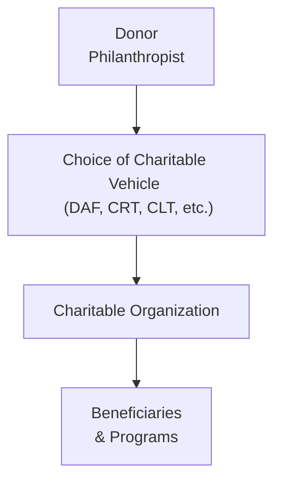
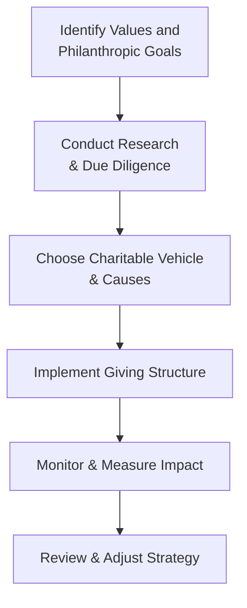

## Motivations for Philanthropy

I once met an entrepreneur who, right after selling his company, told me he felt a calling—something beyond a comfortable retirement. He wanted to preserve family values for his children and make a lasting difference in his community. This desire to give back—be it altruism, tax planning, family legacy, or all of the above—often sparks an interest in philanthropy for high-net-worth families.

From a personal standpoint, some folks find philanthropy extremely fulfilling; others focus on the practical aspects, such as tax incentives and estate planning. Regardless of motivation, it’s worth noting that charitable gifts can do more than help society—they can also provide a meaningful way for families to pass on their values and vision to the next generation. In some cases, philanthropic endeavors become the “glue” that holds multi-generational families together, giving their wealth purpose beyond self-consumption.

Common motivational drivers:
• Altruism and desire to give back  
• Creating a personal or family legacy  
• Tax incentives, such as deductions or estate tax reductions  
• Impact on local or global communities  

When discussing philanthropy with clients or with your own family, it’s always helpful to distinguish between each objective. You might find, for example, that certain philanthropic setups align better with purely altruistic goals, while others work best when tax efficiency is a prime motivating factor.

## Types of Charitable Vehicles

One of the first questions that arises is: “How should I actually give?” We have multiple vehicles to choose from, each with its own administrative tasks, tax implications, and flexibility. It’s sort of like shopping for a new car—some want it sleek and simple, others need space for a big family, and still others want specialized features. No single structure is perfect for everybody.

### Direct Donations
This is, well, the simplest approach. Write a check (or transfer assets directly) to your chosen charity. The main perks are immediate impact, simplicity, and straightforward tax deductions where applicable. But direct giving doesn’t always allow donors as much input on long-term use of the funds, and in many cases, donors lose control the moment the gift is made.

### Donor-Advised Funds (DAFs)
DAFs are basically accounts managed by a charitable sponsor—could be a community foundation or a financial institution. Donors can contribute cash or other assets, receive an immediate tax deduction if it’s available in their jurisdiction, and then “advise” grants from that fund over time. It’s relatively easy to set up, you can involve your family in deciding which causes to support, and there’s minimal administrative burden on you personally. However, you do relinquish ultimate legal control over the funds to the sponsor (though your suggestions are generally followed).

### Charitable Gift Annuities
With a charitable gift annuity, an individual donates cash or other assets to a charity—but, and here’s the twist, the donor gets a fixed income stream for life (or for a certain period). At the end of that term, the remaining assets go to the charity. This arrangement can be great for retirees who need steady income yet want to be philanthropic. Some older families find charitable gift annuities appealing because they combine personal security with charitable intentions.

### Charitable Remainder Trusts (CRTs)
CRTs are trusts that pay an income to specified individuals (often the donor or family members) for either a set period or life. After that term ends, the remaining trust assets pass to a named charity. This structure can provide immediate potential tax benefits, diversify concentrated positions, and ensure that philanthropic objectives are met later on. Keep in mind, though, the administrative aspect of setting up and maintaining a trust might be more complex than a direct donation or DAF.

### Charitable Lead Trusts (CLTs)
If you flip the concept of a CRT, you get a CLT. Here, the charity receives income payments (or “lead” interest) for a set number of years, and whatever is left (the remainder) later goes to the donor’s heirs or other beneficiaries. CLTs can be a powerful estate planning tool, especially in low-interest-rate environments, but they also entail intricate planning and management costs.

### A Quick Visual Overview

Below is a simplified Mermaid diagram illustrating how donors can interact with different charitable vehicles:

## Selecting Causes and Organizations

Once the “how” is sorted, the next big question is “who?” Because ultimately, your philanthropic impact rests on the effectiveness and integrity of the organizations you support. It’s like investing in the stock market: you want to allocate your resources to well-managed, transparent, and mission-driven charities.

Here are a few essentials:
• Mission alignment: Does the organization’s mission reflect your philanthropic goals or family’s values?  
• Financial health: Check operating budgets, overhead ratios, and resource allocation.  
• Governance: A reputable charity typically has a well-structured board, transparent leadership, and established accountability measures.  

Many donors either focus on a single cause—like education or environmental preservation—to achieve depth in one arena, or they diversify across multiple sectors to spread impact. “Focus vs. diversification” can be a useful discussion point for advisors and families, especially if your philanthropic ambitions include multi-generational engagement.

## Donation Timing and Methods

One frequently overlooked aspect is deciding when and how to donate. Yes, you can donate cash, but there might be more tax-efficient methods. For instance, you could donate appreciated securities and potentially avoid capital gains tax while still securing a charitable deduction. Real estate and tangible property can also be donated, though this often involves additional due diligence (think appraisals, environmental checks, etc.). And let’s not forget illiquid assets such as private business interests—these can be donated, but they involve specialized documentation, valuation, and sometimes regulatory restrictions.

From a practicality standpoint, if your wealth is largely locked up in a private company or restricted stock, you’ll want to look closely at how liquidity events intersect with your philanthropic timeline. Perhaps donating a portion of stock before it becomes unrestricted might yield better tax results—although you should consult with a specialized attorney or tax advisor for precise planning.

## Measuring Philanthropic Impact

I had a client who wanted to know exactly how many meals his donation would provide for a local charity. Another asked for metrics on high school graduation rates in a scholarship program they supported. Measuring philanthropic impact can be tricky, but it’s crucial if you desire accountability and proof of meaningful outcomes.

Some common metrics or approaches:
• Program efficiency or overhead ratio: Compares spending on core programs vs. administrative overhead.  
• Measurable outcomes: For example, number of students graduating, acres of land conserved, or total patients served.  
• Strategic philanthropy: Setting specific targets (like “reduce child malnutrition in Region X by 10% in five years”) and monitoring progress.

Keep in mind that not every cause can be measured by pure numbers. Arts, culture, and similar initiatives often have intangible benefits. Nonetheless, a strategic approach (sometimes called “impact philanthropy”) pushes donors and charities to define success and track results.

## Cross-Border Charitable Donations

Philanthropy can extend beyond domestic borders, especially for families with ties to multiple countries or those with a global outlook on certain issues. However, cross-border giving raises unique legal and tax questions. Some jurisdictions allow tax benefits only for donations to domestic charities. Others provide partial credit for approved foreign charities in line with tax treaties. You might also run into varying reporting standards or compliance requirements.

That’s where philanthropic intermediaries come in. These organizations specialize in bridging the gap, ensuring that your gift supports a specific cause or project overseas while also meeting the necessary legal guidelines in your home country. If you anticipate significant cross-border giving, it’s essential to plan carefully to avoid pitfalls that can arise due to conflicting regulations.

## Family Involvement in Philanthropy

When I worked with a family operating across three generations, one of the best unifying strategies was a “family philanthropic council.” They met quarterly to discuss charitable budgets, evaluate proposals, and reflect on shared values. Engaging multiple generations can strengthen family bonds and helps transmit philanthropic ideals over time.

In many families, younger members may bring fresh perspectives, new causes to champion, or digital insights to amplify philanthropic campaigns. Meanwhile, senior family members often provide historical context, networking connections, and practical wisdom. Harmonizing these viewpoints can be the backbone of a well-rounded philanthropic strategy.

## A Closer Look at the Philanthropic Process

Here’s a simple high-level overview of how one might approach setting up a thoughtful philanthropic strategy:

## Glossary

• Donor-Advised Fund (DAF): A philanthropic vehicle administered by a charitable sponsor (like a community foundation or a financial institution) in which donors can recommend grants over time.  
• Charitable Gift Annuity: A contract where the donor transfers assets to a charity in exchange for a fixed lifetime income stream. At death or term-end, the remaining principal goes to the charity.  
• Charitable Remainder Trust (CRT): A trust providing income to named beneficiaries for a set term or for life, with whatever remains distributed to charity.  
• Charitable Lead Trust (CLT): The inverse of a CRT, where a charity receives the trust income first (for a specified period), and the remainder eventually passes to non-charitable beneficiaries.  
• Strategic Philanthropy: A structured giving approach where donors set specific objectives, monitor key metrics, and hold organizations accountable for results.  
• Philanthropic Intermediary: An organization that helps donors navigate cross-border gifts and ensures compliance with applicable laws.  
• Restricted Stock Donation: Contributing shares that have vesting or trading restrictions—often requiring that donors follow strict guidelines and documentation.  
• Impact Measurement: Evaluating the tangible results of a charitable project or organization against previously agreed-upon performance measures.

## References and Further Reading

• “Philanthropy in the 21st Century: A Guide for Families” by J. Thorne (Wealth Press)  
• Council on Foundations: www.cof.org  
• “Measuring Impact in Philanthropy,” Harvard Kennedy School Working Paper  
• Global Philanthropy Guide, Alliance Magazine  

## Final Exam Tips

• Be clear on the tax considerations: In exam scenarios, you’ll often be given a client’s objectives—like reducing estate taxes or maximizing immediate impact. Practice identifying which vehicle (DAF, CRT, CLT, etc.) is most suitable.  
• Always watch for constraints: Distribution timelines, desire for income, liquidity of donated assets—these factors are critical.  
• Remember cross-border issues: The exam may present a family with international ties, testing your knowledge of philanthropic intermediaries or different tax rules.  
• Focus on philanthropic goals and family dynamics: The CFA Level III exam frequently integrates behavioral and family governance aspects.  
• Work through practice problems that simulate real-life philanthropic planning: Expect scenario-based constructed response questions that require identifying the right charitable tool or designing a philanthropic framework.  

In the end, philanthropy is about much more than just money. It’s about the legacy, the community, and the personal meaning derived from using wealth to shape a better world.  

--------------------------------------------------------------------------------

## Philanthropy and Charitable Giving Exam Practice



### Which of the following motivations is typically associated with philanthropic giving?

- [ ] Solely gaining influence over a non-profit organization
- [x] Transferring family values across generations
- [ ] Accumulating more personal wealth
- [ ] Evading all forms of taxation indefinitely

> **Explanation:** Common reasons for philanthropy include passing on values, supporting communities, and securing possible tax benefits, rather than exerting control or personal wealth accumulation.

### A donor wants to make a contribution that provides an immediate tax deduction and allows them to recommend grants over time. Which vehicle best suits this scenario?

- [ ] Charitable Gift Annuity
- [x] Donor-Advised Fund
- [ ] Charitable Lead Trust
- [ ] Direct Cash Donation Only

> **Explanation:** Donor-Advised Funds allow for an immediate tax deduction (if applicable in the donor’s jurisdiction) and flexible grant recommendations afterward.

### In a Charitable Remainder Trust (CRT), which party eventually receives the remaining trust assets?

- [ ] The trust’s grantor’s heirs
- [ ] The trustee
- [x] The designated charity
- [ ] Any remainderman appointed by the state

> **Explanation:** With a CRT, after income payments cease, the remainder assets pass to the charity named in the trust agreement.

### A family wants to ensure the charity gets an income stream now, but they wish to transfer the remaining assets to their children in 15 years. Which of the following structures is most appropriate?

- [ ] Charitable Remainder Trust
- [x] Charitable Lead Trust
- [ ] Donor-Advised Fund
- [ ] Gift in Kind

> **Explanation:** Under a Charitable Lead Trust, the charity receives the income (or “lead”) portion first, and then the remainder goes to non-charitable beneficiaries.

### Which of the following donations typically presents the most administrative complexity?

- [ ] Cash donations
- [x] Illiquid assets such as real estate or private equity interests
- [ ] Credit card donations
- [ ] Clothing and other non-monetary personal items

> **Explanation:** Donating illiquid assets often involves more complex legal and tax considerations, appraisals, and compliance issues, compared with straightforward cash or credit card gifts.

### Which metric is most relevant when assessing the effectiveness of a nonprofit’s programs?

- [ ] The number of celebrity endorsements they have
- [ ] The size of their marketing budget
- [x] Program efficiency or overhead ratio
- [ ] The personal net worth of the organization’s board members

> **Explanation:** Many donors look at a charity’s program efficiency or overhead ratio to see how funds are spent on core programs vs. administrative costs.

### Cross-border philanthropy often requires donors to:

- [x] Understand different legal and tax requirements in each jurisdiction
- [ ] Incorporate only in the offshore location
- [x] Work with philanthropic intermediaries for regulatory compliance
- [ ] Always set up a private foundation in the foreign country

> **Explanation:** Giving across borders can be complicated by differing tax rules and regulations, so philanthropic intermediaries are often used to facilitate the process.

### A family establishes a “philanthropic council” to include their children and grandchildren in giving decisions. Which main benefit does this approach typically provide?

- [x] Multi-generational engagement and deeper family bonding
- [ ] Guaranteed higher returns on donated assets
- [ ] Elimination of all estate taxes
- [ ] Automatic restoration of philanthropic gifts for personal use

> **Explanation:** A philanthropic council or similar organizing body fosters family communication, transmits values, and encourages multiple generations to participate in philanthropic decisions.

### Strategic philanthropy encourages donors to:

- [x] Set measurable targets for charitable outcomes
- [ ] Rely solely on emotional decisions
- [ ] Give randomly to any available cause
- [ ] Fully relinquish oversight of donations

> **Explanation:** Strategic, or impact-oriented, philanthropy emphasizes goal setting, performance tracking, and accountability in order to achieve measurable results.

### In a Charitable Gift Annuity:

- [x] Donors receive a fixed income stream in exchange for their gift
- [ ] The trustor retains full control of donated assets
- [ ] The charity immediately uses 100% of the donated funds
- [ ] Both donor and charity receive a double step-up in capital gains

> **Explanation:** A Charitable Gift Annuity provides the donor a lifetime (or term) income in return for the donation, with the remainder eventually benefiting the charity.


