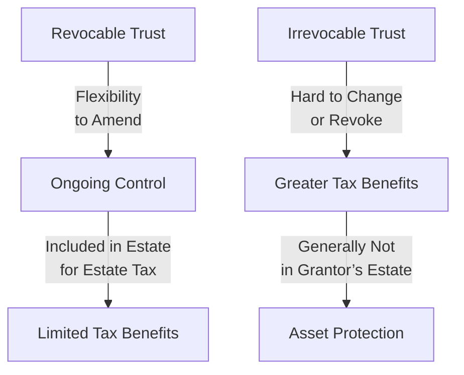

## Understanding the Role and Purpose of Trusts

You know that feeling when you realize your family’s future is, well, actually counting on the decisions you make right now? Estate planning can be a bit nerve-racking because we’re talking about your loved ones and everything you’ve worked so hard to build. But trusts can help make sure all that wealth is protected and distributed the way you want. They are like a powerful “container” that holds and safeguards your assets, even when you’re not around to direct them personally.

Trusts are often set up for reasons like:  
• Minimizing estate taxes and fees.  
• Managing and distributing assets to future generations.  
• Providing confidentiality around family finances and personal data.  
• Preventing mismanagement by, say, younger heirs or beneficiaries struggling with financial literacy (see our earlier discussion in Chapter 2 on family dynamics).  

What’s more, they create a formal legal arrangement in which the trustee holds legal title to the assets for the benefit of designated beneficiaries. If you recall from Chapter 5 on preserving wealth, risk management is all about planning for uncertainties. Trusts fit neatly into that puzzle.

At a high level, there are two broad categories:

• Revocable Trusts: These can be changed at almost any time while the grantor is alive and mentally competent, though they offer limited asset protection and tax benefits.  
• Irrevocable Trusts: These can’t be undone or easily changed once created, which can allow for stronger tax efficiency and creditor shielding.

The distinction is crucial: revocable trusts provide flexibility, while irrevocable trusts tend to provide stronger long-term structures for tax-planning and wealth transfer. There’s no free lunch, though—irrevocable trusts require you to give up some level of control.

## Common Types of Trusts

Now, let’s dig deeper into the primary flavors of trusts you’re likely to see in practice. These come up frequently in exam scenarios, client discussions, and academic materials.

### Revocable Living Trusts
A revocable living trust is, in many ways, the “starter trust.” It’s the one you can alter or even terminate as life events happen. Suppose you’re thinking: “I really want to keep hands-on control but still want some mechanism for distributing assets when I pass away.” Then revocable trusts might be your best bet. They can simplify the probate process and ensure that someone you trust can manage your affairs if you become incapacitated.

But here’s the trade-off: because you retain control, the assets remain in your estate for tax and creditor purposes. So, it usually doesn’t protect you from estate taxes nor from creditors, but it eases administrative burdens.

### Irrevocable Life Insurance Trusts (ILITs)
Insurance proceeds can be a big chunk of your estate. If you’ve got a sizable life insurance policy, the last thing you want is to inadvertently inflate your taxable estate. That’s where ILITs step into the picture. You, as the grantor, set up the trust to own the life insurance policy. Because it’s irrevocable, you can’t easily reclaim the policy, and by removing incidents of ownership from yourself, the death benefit can be excluded from your estate.  

ILITs also help ensure that your insurance payout goes to the beneficiaries without landing in your estate for estate tax calculations. This structure can be a clever way to cover estate taxes or pass on a tidy sum in a more tax-friendly manner.

### Generation-Skipping Transfer (GST) Trusts
Think of a GST trust as skipping a rung on the family ladder—like when grandparents want to leave assets directly to grandchildren (or even great-grandchildren). Why might they do that? Because it means one fewer layer of estate or inheritance tax. In some jurisdictions, there’s a specialized GST tax to capture revenue that the estate would otherwise avoid, but there’s also an exemption amount that changes over time (subject to legislative tinkering).  

So if you’re setting up a GST trust, it’s not just about generosity to the grandkids. It’s about strategic tax-planning to potentially bypass one generation’s estate tax encumbrance. Chapter 3 on wealth planning introduced scenario analysis—well, absolutely run some scenarios on how much tax gets shaved off by skipping a generation.

### Grantor Retained Annuity Trusts (GRATs)
GRATs are a bit more advanced, and they’re used especially by wealthier individuals aiming to freeze or minimize estate taxes on assets expected to appreciate. You place assets into the GRAT while retaining the right to an annuity stream for a set term. If all goes well and your assets grow beyond the IRS-assumed growth rate, the remainder passes to your beneficiaries with minimal gift or estate tax consequences. That said, if you pass away during the trust term, those assets might come back into your estate, which defeats some of the planning objectives.  

But hey, we all know risk is a big piece of personal finance. In Chapter 5 on preserving wealth, we talked about balancing the risk of early mortality with the potential for tax benefits. GRATs are a prime example of how well that risk might pay off—if you set up the structure carefully and outlive the trust term.

### Other Specialized Trusts
You’ll occasionally run across special-needs trusts, charitable trusts, or qualified personal residence trusts (QPRTs). Indeed, the estate planning world is vast. A QPRT, for instance, can transfer a personal residence at a reduced gift-tax cost. Charitable trusts can integrate philanthropic goals (see also Section 7.3 on philanthropic giving). Because each scenario is unique, the best trust choice depends on legal frameworks, personal goals, and family situations.

## Diagram: How a Trust Operates

Below is a simple Mermaid diagram illustrating the key roles: the grantor (sometimes called a settlor) forms the trust and transfers assets, the trustee manages them, and the beneficiaries eventually receive distributions.

## Generation-Skipping Transfer Planning

Now, let’s talk a little more about generation-skipping transfer (GST) planning, since this is a topic that can be quite nuanced and definitely shows up on the Level III radar. The primary purpose behind GST planning is to reduce the cumulative effect of multiple estate taxes across consecutive generations. If you can push assets straight to your grandchildren (or a GST trust for them), you potentially skip one layer of tax that would otherwise happen at your child’s level.

But remember, many jurisdictions have their own generation-skipping transfer tax regime. In the United States, for instance, there’s a GST tax specifically designed to recapture those lost taxes. There are, however, exemptions and exclusions that allow some or all of the bequest to dodge or reduce the GST tax. This is quite the balancing act—tax codes change, your beneficiaries’ needs evolve, and you have to keep an eye on trust distribution provisions.

## Asset Protection Aspects

If you’ve been following this book, you’ll have heard us mention more than once that lawsuits, divorces, and creditor claims can upend your carefully laid plans. Certain irrevocable trusts provide a layer of insulation. Generally, if you, as the grantor, don’t retain any incidents of ownership, the trust might put assets out of reach of personal creditors.  

Now, if setup is done just before a lawsuit or to evade a creditor last minute, courts might see that as fraudulent conveyance. So, plan early and be transparent (Chapter 1’s regulatory discussion matters here too). In some cases, offshore trusts in jurisdictions like the Cook Islands or the Isle of Man add extra complexity, legal hurdles, and possibly stronger protection. But these come with bigger administrative burdens and potential scrutiny from tax authorities.

## Selecting and Overseeing a Trustee

It’s critical to grasp that trustees have a fiduciary duty—an utmost standard of care—to the trust’s beneficiaries. If you pick a trustee who’s unskilled or who has conflicts of interest, you could end up with poor investment choices or mishandled distributions. So, picking the right trustee is no small task.  

Sometimes individuals pick a trusted family member or friend. Sometimes they hire a corporate trustee (e.g., a bank trust department). Each approach has pros and cons. A family member understands the beneficiaries more intimately but might not have the expertise or emotional distance to be objective. A corporate trustee offers professional management but can be somewhat impersonal.

Ongoing oversight is also vital. Think about:  
• Periodic reviews of trustee reports and performance.  
• Clear instructions in the trust document for how the trustee should react to major life events.  
• Coordinated communication among the trustee, the estate attorney, tax advisors, and possibly family governance structures (see Chapter 6 on advising the wealthy).

## Integration with Broader Estate Strategy

Trust-based planning is rarely a standalone process. Every piece must fit into the broader estate plan, which probably includes:  
• A will that catches assets not in trust.  
• Powers of attorney for healthcare and finances.  
• Life insurance policies (maybe inside an ILIT) to handle estate taxes or provide liquidity.  
• Business succession plans for privately held companies (see Chapter 6.4 on concentrated equity ownership).  

It comes down to synergy—yep, that fancy word that basically means everything is working together. A trust is a super tool, but if it’s not properly aligned with your will, your beneficiary designations, and your evolving life circumstances, it can create more chaos than clarity.

## Common Pitfalls and Oversight

Alright, let’s talk about mistakes. Because, let’s face it, no matter how carefully we plan, life can throw curveballs:

• Vague or overly restrictive trust language. If the trustee’s powers aren’t clear or the distribution instructions are ambiguous, disputes could ensue.  
• Failing to name successor trustees. If your original trustee exits, who steps in?  
• Forgetting to fund a trust. A trust that isn’t properly funded is just a fancy piece of paper.  
• Overlooking changes in tax law. Laws change—your plan must adapt.  
• Neglecting the impact of marriage, divorce, births, or deaths. Trusts often need updated provisions as family relationships evolve.  

You might recall from Chapter 2 on complex family structures: with more wealth often comes more complexity, so ensuring the trust’s terms are crystal clear is key to limiting conflict.

## Practical Example

Let’s imagine a situation. John is a successful entrepreneur who’s read a bit of Chapter 3 on wealth planning and decided he wants to set up a trust for his children and grandchildren. He’s got shares in a private tech company that he believes will skyrocket in value over the next decade. So, he sets up an irrevocable grantor retained annuity trust (GRAT). He transfers $2 million worth of shares into the trust, and the trust pays him an annuity for five years. If the shares grow as expected, the remainder value passes to his children with minimal gift tax consequences.  

But here’s the catch: John must survive the trust’s term for the plan to work. He also needs to be comfortable relinquishing control over the shares. If John micromanages trustee decisions, courts might say the trust isn’t truly irrevocable or that he maintained incidents of ownership. So everything must be consistent with the trust arrangement.

## Mermaid Diagram: Revocable vs. Irrevocable Key Differences

## Glossary Highlights

• Revocable Trust: A trust that can be changed or canceled by the grantor during their lifetime. Offers streamlining of estate distribution but limited tax or liability protection.  
• Irrevocable Trust: A trust that cannot be easily altered once created, potentially offering tax advantages and protecting assets from creditors.  
• Generation-Skipping Transfer (GST) Tax: A tax levied on transfers to beneficiaries who are at least two generations below the grantor, designed to prevent skipping a layer of estate tax.  
• Grantor (Settlor): The individual who establishes and funds the trust.  
• Trustee: The person or institution holding legal title to the trust property and administering the trust’s terms for the beneficiaries’ benefit.  
• Settlor: Another term for the grantor, used in certain legal systems.  
• Spray/Sprinkle Power: Authority given to a trustee to distribute income or principal among beneficiaries according to current needs.  
• Fiduciary Duty: The legal obligation of a trustee to act in the best interests of the trust’s beneficiaries.

## Final Exam Tips

When approaching exam questions on trusts, keep these guidelines in mind:

• Understand the difference between revocable and irrevocable trusts and the tax implications of each.  
• Look for triggers in the exam scenario about generation-skipping or indefinite asset protection—these might hint at specialized trusts like GST or offshore vehicles.  
• Watch for “red flags” in the prompt, such as a settlor retaining too much control (which might undermine the trust’s validity).  
• In the constructed response portion, demonstrate your ability to integrate a trust with other estate-planning tools like wills, life insurance, and philanthropic vehicles.  
• Don’t forget the emotional and family dynamics. The exam might present a client scenario emphasizing governance or family conflict, which can shape the best trust structure.

## References and Further Reading

• Drafting and Analyzing Trusts by Carleen Lyons (Trust & Estates Publishing)  
• The American College of Trust and Estate Counsel (ACTEC): http://www.actec.org  
• Estate and Trust Administration for Dummies by Margaret Atkins Munro  
• International Trust Laws Handbook from Oxford University Press  

--------------------------------------------------------------------------------

## Practice Questions on Trust Structures and Estate Planning



### Which best describes a primary advantage of an irrevocable trust?

- [ ] It allows the grantor to amend the trust at any time.  
- [x] It generally removes the assets from the grantor’s taxable estate.  
- [ ] It does not require a trustee.  
- [ ] It only applies to small estates.  

> **Explanation:** Irrevocable trusts generally remove assets from the grantor’s taxable estate, offering enhanced estate tax and creditor protection advantages.  

### Under what circumstance would a revocable living trust typically be used?

- [x] When the grantor wants to maintain control and possibly amend the trust.  
- [ ] When the grantor wants to ensure full estate tax relief.  
- [ ] When the trust must bypass all creditors.  
- [ ] When the beneficiaries are not known at the time of creation.  

> **Explanation:** Revocable living trusts allow the grantor to retain control and make changes throughout their lifetime. However, the assets typically remain part of the grantor’s taxable estate.  

### Which of the following is a key benefit of a Generation-Skipping Transfer (GST) trust?

- [ ] It ensures all distributions avoid taxation entirely.  
- [x] It can minimize estate taxes by removing one generation’s transfers.  
- [ ] It maximizes trustee control at the expense of the grantor.  
- [ ] It’s primarily designed to avoid spousal transfer taxes.  

> **Explanation:** A GST trust is often used to skip one layer of estate taxation by transferring wealth directly to grandchildren or future generations, subject to certain generation-skipping transfer tax rules.  

### What is an Irrevocable Life Insurance Trust (ILIT) primarily designed to do?

- [ ] Consolidate all the grantor’s insurance policies into one.  
- [x] Prevent life insurance proceeds from being included in the grantor’s estate.  
- [ ] Enable the grantor to liquidate the policy in the event of financial emergency.  
- [ ] Ensure the policy beneficiary designations remain flexible.  

> **Explanation:** An ILIT removes the life insurance proceeds from the grantor’s estate, thus providing liquidity for estate settlement without increasing estate taxes.  

### Which key factor differentiates a GRAT (Grantor Retained Annuity Trust) from a revocable trust?

- [x] A GRAT allows the grantor to receive annuity payments while aiming to transfer appreciation outside the estate.  
- [ ] A GRAT is by definition always revocable.  
- [x] A GRAT’s success depends on the investment growth rate exceeding an IRS-prescribed rate.  
- [ ] A GRAT must be held by a corporate trustee.  

> **Explanation:** A GRAT is an irrevocable trust structure in which the grantor retains an annuity interest. If assets appreciate faster than the set interest rate, the excess passes tax-free or at a reduced tax cost.  

### What is a potential downside of naming a family member as trustee?

- [x] Lack of professional expertise or emotional distance.  
- [ ] High trustee fees compared to a bank.  
- [ ] Automatic removal of assets from the estate.  
- [ ] Elimination of beneficiary oversight.  

> **Explanation:** A family member may lack the professional experience or objectivity required to carry out fiduciary responsibilities effectively.  

### Which scenario exemplifies the purpose of a generation-skipping transfer tax?

- [x] A grandparent leaving assets to a grandchild, bypassing the child’s estate.  
- [ ] A spouse transferring assets to the other spouse.  
- [x] An intermediary distribution to siblings in the same generation.  
- [ ] Insurance proceeds paid to a trust for the grantor’s benefit.  

> **Explanation:** GST tax rules apply when transfers are made to beneficiaries two or more generations below the grantor, such as from a grandparent directly to a grandchild.  

### What is a trustee’s primary fiduciary duty?

- [x] To act in the best interests of the beneficiaries in accordance with the trust terms.  
- [ ] To serve the grantor exclusively.  
- [ ] To ensure the trust continues indefinitely.  
- [ ] To prioritize creditors’ claims above all else.  

> **Explanation:** Fiduciary duty obligates the trustee to honor the trust instructions and protect the beneficiaries’ interests first and foremost.  

### Which is a common pitfall in establishing an irrevocable trust?

- [x] Failing to fund the trust properly after executing the legal documents.  
- [ ] Naming a corporate trustee instead of a family member.  
- [ ] Allocating more than one generation as beneficiaries.  
- [ ] Setting distribution instructions by age.  

> **Explanation:** Even sophisticated trust documents are useless if the trust is never actually funded with the intended assets.  

### True or False: An irrevocable trust can never offer any flexibility once it’s established.

- [x] True  
- [ ] False  

> **Explanation:** Generally, irrevocable trusts are meant to be rigid. However, some legal mechanisms and trust provisions (like decanting or trust protectors) can allow limited adjustments, but they aren’t guaranteed and can be quite restricted compared to a revocable trust.  


