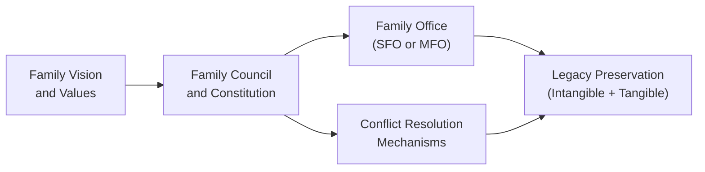

## Introduction

There’s this old joke in my family about how our biggest arguments tend to happen on holiday weekends—when everyone’s laughing, eating, and, well, occasionally debating whose name should be on the property deeds or which cousin gets to manage the family trust. It’s awkward, right? But it's also pretty common: As families grow, wealth expands, and new personalities come onboard, figuring out who decides what (and how) becomes tricky.

That’s where family governance comes in. Think of it like a strategic framework that helps you manage not only money but also relationships, reputations, and even intangible treasures like family traditions. This article will walk through the essentials of family governance, from the nuts-and-bolts of constitutions and leadership transitions to the subtler art of preserving values across generations. Whether you’re advising a high-net-worth household or are part of one, the goal here is to build a system that helps ensure unity and continuity—and that avoids those unfortunate meltdowns at the dinner table.

Throughout this section, we’ll draw upon earlier discussions (for instance, 2.1 Family and Human Dynamics in High‐Net‐Worth Households) to show how interpersonal relationships shape governance. We’ll also reference concepts from 6.6 Governance Structures for Family‐Owned Enterprises, especially if the family’s wealth is sourced from a private business. The big idea is simply this: building effective family governance can ultimately help keep valuable assets protected and also preserve the heart and soul of your family’s legacy.

## Defining Family Governance

Family governance refers to the formal framework and processes through which a family organizes itself to manage shared assets, philanthropic efforts, and broader initiatives. In many ways, it’s similar to the governance we see in a corporate board, except the “stakeholders” are family members who bring their own histories, emotions, and personal interests to the table. That’s a lot of moving parts!

An effective family governance system typically includes a set of policies (often captured in something called a family constitution) that lay out how to make decisions collectively, pin down leadership roles, and handle conflicts. The objectives often look like this:

• Maintain family unity and avoid destructive disputes.  
• Formalize a shared mission, vision, and set of values.  
• Provide guidance for wealth transfers, philanthropic ventures, and business expansions.  
• Create structured opportunities for younger generations to learn the ropes.

At its best, family governance is about more than controlling money. It’s a way to govern how wealth is used to benefit the entire family, preserve reputations, give back to society through philanthropic activities, and help future generations find their place in the ecosystem.

## Family Constitutions and Charters

A family constitution (sometimes called a family charter) is a document that spells out the family’s collective rules of the road. In contrast to a corporate charter, it may not be legally binding—but it sure feels important when everyone in the family has contributed to shaping it. This constitution might cover:

• Core family values, mission, and long-term vision.  
• Decision-making protocols: who votes on big decisions, what roles do in-laws play, and so on.  
• Ownership rights and responsibilities: clarifying how assets are held, who has access to them, and whether distributions are performance-based or more egalitarian.  
• Conflict resolution mechanisms: how disputes get escalated, whether external mediation is used, and how to handle “tie-breaker” scenarios.  

One crucial point is keeping the family constitution a living document. In my experience, families often draft this grand statement of purpose and then let it collect dust until a crisis emerges. That’s not ideal. Family constitutions should be revisited regularly—maybe every year or two—to ensure they still reflect the family’s evolving composition and ambitions. If the next generation’s priorities shift (for example, from focusing on a family business to focusing on philanthropic impact), the constitution should reflect that.

## Roles of Family Offices

For families with significant wealth, a family office can act as the operational powerhouse that implements the policies outlined in the family constitution. A single-family office (SFO) is dedicated to just one family’s array of needs, from investment management and tax planning to philanthropic coordination and personal concierge services. A multi-family office (MFO), by contrast, serves multiple families under one roof, often providing more standardized offerings at a lower cost than setting up your own stand-alone SFO.

Here’s a spectrum of what a family office might do:

• Investment Management: Overseeing portfolios, engaging with asset managers, handling performance reporting, and (hopefully) incorporating risk management strategies that align with what we covered in Chapter 4: Investment Planning.  
• Administrative Services: Bookkeeping, bill payment, property management, record-keeping for trusts, and preparing relevant documentation for tax and regulatory compliance.  
• Philanthropy Coordination: Managing charitable foundations, setting up donor-advised funds, or tracking the family’s philanthropic initiatives, which ties into 7.3 Philanthropy and Charitable Giving Approaches.  
• Governance Support: Facilitating family meetings, offering educational workshops for younger members, and even serving as a neutral party in negotiations or disputes.

Whether you go with an SFO or an MFO depends on factors like the family’s net worth, complexity, privacy needs, and willingness to pool costs with other families. In many instances, an MFO can provide a more cost-effective solution, especially if the family’s net worth doesn’t justify the expense of a custom single-family office.

## Conflict Resolution and Communication

With wealth often come complexities—especially the emotional ones. You might be thinking: “We’re all rational adults. We should be able to handle disagreements.” Well, families are rarely that simple. Issues around entitlement, sibling rivalry, or perceived favoritism can quickly escalate. In fact, wealth itself can magnify friction by introducing more variables to debate.

Best practice: adopt clear, formal dispute-resolution frameworks. Some families set up a family council—basically a committee representing different branches or generations. The council can convene regularly to tackle major decisions (think: planning a liquidity event for a major family business, or deciding how to allocate philanthropic spending). If something can’t be resolved within the council, an external mediator or trusted advisor might step in.

I’ve observed that good communication is half the battle. Annual or semi-annual family gatherings, facilitated by an outside expert, can help air out concerns before they blow up. During these sessions, each family member can share updates, concerns, or proposals. By structuring these conversations, you preserve everyone’s right to be heard while preventing them from derailing into emotional gossip-fests. It also helps to have a well-defined rule on who has voting power for each type of decision, so no one feels blindsided when big calls get made.

## Succession Planning and Leadership Development

Succession is a big deal—particularly if the family’s wealth is tied to a business that different generations work in. Transferring leadership from one generation to the next is not only about finances but also about skill sets, mindset, and emotional readiness. That’s why structured mentorship, internships within the family business, and formal governance training are often recommended starting points. If you look back at 6.5 Succession Planning for Business Owners and Professionals, you’ll see similar themes.

A well-crafted succession plan should:

• Identify potential successors early and outline how they’ll be educated and trained.  
• Define timelines for leadership transitions (e.g., when the current generation intends to step down).  
• Detail the roles of non-family executives or advisors in bridging any skill gaps.  
• Ensure that the family’s overarching vision and values remain intact.  

Sometimes, younger members don’t want to be part of the family enterprise or the day-to-day wealth management. That’s okay, too. Part of good governance is respecting each individual’s professional and personal interests, while providing ways they can still engage with the family’s legacy (for instance, philanthropic projects, advisory councils, or brand ambassadorship roles). In many cases, building well-rounded, engaged leaders means allowing them the freedom to explore their passions before taking on major responsibilities within the family structure.

## Preserving Intangible Legacy

We often think of “legacy” as a big pile of money. But intangible legacies—family stories, shared values, philanthropic missions, or a well-regarded family name—are sometimes even more critical for multi-generational wealth. Without a cohesive family identity, wealth can morph from a unifying resource into a divisive wedge.

Examples of intangible legacies include:

• A family narrative: “Our ancestors fled war-torn Europe with nothing, and look what we’ve managed to build!”  
• Reputation or “brand”: If your family is known for ethical business practices, philanthropic generosity, or creative innovation, you’ll want to keep that spirit alive.  
• A philanthropic ethos: Maybe the family is deeply committed to certain causes, like environmental conservation or healthcare.  

Preserving these legacies may involve something as simple as regularly scheduled “heritage nights,” where older relatives share stories with younger ones. It might also involve philanthropic projects that reflect the family’s long-held values. In some cases, families document their history through short film projects or custom family diaries so that future generations can see where they came from. Let’s face it, if your children and grandchildren don’t appreciate the sweat and tears that built the family’s wealth in the first place, the money itself might not mean much.

## Measuring Family Governance Success

You might wonder how to check if your governance structure is working—after all, it’s not like you can just run an ROI analysis on family unity. But you can measure certain indicators:

• Family Satisfaction: Conducting periodic surveys (formal or informal) gauging how satisfied members are with the governance process, the clarity of decision-making, and the perceived fairness of outcomes.  
• Wealth Retention: Are you successfully avoiding damaging disputes, lawsuits, or excessive wealth erosion?  
• Philanthropic Impact: If your family is committed to philanthropy, are you meeting your giving goals and making an impact in ways that align with your stated values?  
• Conflict Resolution Timeliness: Are disputes handled quickly and efficiently, or do they drag on?  
• Governance Participation: Are multiple generations attending family meetings and actually engaging? A disconnect might indicate that your structure isn’t resonating with younger members.  

Over time, you want to see these indicators trending in a positive direction. That might mean sharper mission statements, more effective philanthropic deployments, or less friction in generational transitions. Like any organizational system, family governance is iterative: you tweak, refine, and adapt to changing family circumstances and external market conditions.

## Best Practices and Common Pitfalls

It’s a cliché but still true: every family is different. Even so, a few best practices pop up repeatedly:

• Start early: Don’t wait for urgent crises to draft a governance framework. By the time you’re in a lawsuit or a leadership crisis, it’s too late.  
• Communicate broadly: Involve as many family members as reasonably possible, from older generations to the youngest who are old enough to understand. This fosters a sense of ownership and accountability.  
• Use external expertise: A trusted external advisor, family therapist, or mediator can often raise difficult questions, ensure constructive dialogue, and facilitate resolution in ways that might be tough for an in-family figure to do.  
• Stay flexible: Families and their assets evolve. Keep governance structures updated or risk irrelevance.

And pitfalls:

• Overcomplicating the system: Tons of committees, unclear voting thresholds, or heavy-handed policies can cause confusion. Start simple.  
• Ignoring personal rivalries: If you pretend tensions don’t exist, they typically intensify. Better to address them head-on with a formal conflict-resolution process.  
• Disregarding non-financial metrics: Families that focus solely on the money might lose track of shared values and identity—leading to fractures down the road.

## Visualizing the Governance Framework

Below is a simple diagram illustrating how family governance components interact:

• Family Vision and Values guide the overall purpose.  
• The Family Council and Constitution set policies.  
• The Family Office operationalizes those policies and manages daily tasks.  
• Conflict Resolution Mechanisms ensure disputes are addressed fairly.  
• Both tangible and intangible Legacy Preservation is the ultimate outcome.

## Example Scenario: The Hamilton Family

Imagine the Hamiltons, an ultra-high-net-worth family with a centuries-old reputation in shipping and logistics. They recently formed a multi-family office with two other families to manage their global investments more cost-effectively. To preserve family unity, they developed a constitution that included:

• A rotating family council representing each of the four main branches of the family.  
• A structured succession plan identifying the next “head of the council” by way of a combination of seniority and readiness evaluations.  
• A philanthropic board, chaired by a young third-generation member passionate about climate change awareness.  

Things were going well—until a conflict emerged over expansions into high-risk shipping routes. The older generation wanted stability; the younger folks wanted to capitalize on emerging markets in Africa. By using their constitution’s conflict-resolution procedure—basically, an internal family council vote with an external mediator—they arrived at a compromise: invest in the new markets but use a portion of those profits for philanthropic efforts addressing local community development. This solution not only resolved tensions but also reinforced the family’s shared values.

## Glossary

Family Governance  
A structured framework that outlines how a family makes decisions, manages joint assets, and interfaces with broader society.

Family Constitution  
A guiding document—generally non-legally binding—that articulates the family’s vision, mission, values, policies, and conflict-resolution protocols.

Single-Family Office (SFO)  
An organization dedicated exclusively to one family’s wealth management, administration, and legacy activities.

Multi-Family Office (MFO)  
A professional service firm catering to multiple families, offering shared resources in investment, administration, and governance support.

Leadership Succession  
The planned handover of leadership roles—often from older to younger generations—to preserve continuity in family-owned businesses or philanthropic entities.

Conflict Resolution Process  
Methods or protocols, formal or informal, designed to settle disputes within the family. Might involve family councils, neutral mediators, or arbitration.

Legacy Preservation  
Strategies to ensure the family’s wealth, values, name, and philanthropic commitments endure over generations.

Family Council  
A representative committee of family members tasked with key decisions and policy recommendations, often serving as the core governance body.

## References and Further Reading

• Ward, J., “Family Wealth—Keeping It in the Family.” Business Heritage Press.  
• “Family Governance and Children’s Financial Literacy,” Journal of Wealth Management Studies.  
• The Family Firm Institute: https://ffi.org/  
• Rosplock, K., “The Complete Family Office Handbook: A Guide for Affluent Families and the Advisors Who Serve Them.”  

## Exam Tips and Final Thoughts

For exam candidates, remember that CFA Level III can ask scenario-based questions that test how well you can integrate family governance into a broader wealth-management plan. Common pitfalls include overlooking intangible legacy factors (like family reputation and philanthropic traditions), misjudging conflict-resolution procedures, or ignoring how governance elements can drastically reduce or exacerbate family tension. Use real-world examples and practical frameworks to show how you’d navigate these challenges.

And keep in mind: you’ll need to demonstrate an understanding of how family governance dovetails with estate planning, philanthropic strategies, and risk management—topics we’ve covered in previous chapters. Stay flexible, consider the human aspect, and outline solutions that reflect both fiduciary duty and emotional intelligence.

All right, enough talk—let’s practice with some sample questions!

## Mastering Family Governance and Legacy Preservation: 10 Practice Questions



### A family office aimed at coordinating multiple households under one umbrella is usually referred to as:
- [ ] A single-family office.  
- [x] A multi-family office.  
- [ ] A family constitution.  
- [ ] A philanthropic foundation.  

> **Explanation:** A multi-family office (MFO) serves multiple families, allowing them to share administrative resources. In contrast, a single-family office is dedicated to just one family.

### Which statement is most accurate regarding a family constitution?
- [ ] It is legally binding in most jurisdictions.  
- [ ] It only focuses on financial issues.  
- [x] It documents the family’s mission, values, and governance processes in a generally non-legally binding manner.  
- [ ] It eliminates all disputes automatically.  

> **Explanation:** A family constitution is typically a non-legally binding document that includes the family’s values, mission, policies, and conflict-resolution procedures. It doesn’t guarantee an absence of disputes.

### How do structured family governance systems primarily mitigate disputes?
- [x] By defining decision-making and conflict-resolution protocols in advance.  
- [ ] By avoiding external advisors and handling issues internally at all times.  
- [ ] By merging all assets into a single trust automatically.  
- [ ] By making each family member financially independent.  

> **Explanation:** The key lies in well-defined governance and communication processes. Protocols established in advance help manage disagreements more effectively than ad hoc approaches.

### One potential advantage of a single-family office compared to a multi-family office is:
- [x] Greater tailoring of services to the specific family’s needs.  
- [ ] Significantly lower operational costs for a single-family.  
- [ ] Less involvement in philanthropic pursuits.  
- [ ] Automatic oversight from external mediators.  

> **Explanation:** A single-family office can deliver highly tailored services but tends to come with higher operational costs versus multi-family office structures.

### Which factor is most crucial to preserve intangible legacies in multi-generational families?
- [x] Encouraging open communication and sharing of family history.  
- [ ] Focusing solely on maximizing returns from liquid assets.  
- [x] Incorporating the family’s core values into philanthropic efforts.  
- [ ] Standardizing all distributions equally.  

> **Explanation:** Preserving intangible legacies goes beyond financial metrics, requiring open dialogue, shared narratives, and alignment of values across philanthropic and other communal ventures.

### A robust conflict-resolution process in family governance typically involves:
- [x] A clearly defined procedure for mediation or arbitration.  
- [ ] Enforcing zero communication among disputing parties.  
- [ ] Tight secrecy with no involvement of external advisors.  
- [ ] Ad-hoc, last-minute solutions with no formal framework.  

> **Explanation:** The point of formal conflict-resolution is to ensure transparency, fairness, and efficiency, often with professional mediators if needed.

### What is the primary purpose of regular family meetings or councils within a family governance framework?
- [x] To update members on developments, gather input, and make decisions through a structured process.  
- [ ] To identify and punish family members who deviate from the norm.  
- [x] To foster open communication across generations.  
- [ ] To impose constant surveillance on household spending.  

> **Explanation:** Family meetings promote a transparent decision-making environment and improve generational cohesiveness. They’re not about penalizing or surveilling individuals.

### How can the success of a family governance plan be evaluated over time?
- [x] By measuring family satisfaction, reduction in conflicts, and achievement of stated financial and philanthropic goals.  
- [ ] Solely by the family office’s growth in net revenue.  
- [ ] By how quickly each generation spends down the family’s capital.  
- [ ] Only by the performance of public equity portfolios.  

> **Explanation:** Success is measured by a combination of qualitative (e.g., satisfaction, conflict resolution) and quantitative (e.g., meeting philanthropic goals) indicators.

### A key consideration in next-generation leadership development is:
- [x] Offering mentorship, education, and skill-building programs.  
- [ ] Minimizing any responsibility younger members might have.  
- [ ] Setting a strict maximum age limit to force the older generation out.  
- [ ] Using annual wealth distributions to guarantee loyalty.  

> **Explanation:** Effective leadership succession involves identifying talent and providing training and mentorship so the next generation can step confidently into leadership roles.

### True or False: A well-crafted family governance system only focuses on legal structures and completely disregards emotional dynamics among family members.
- [x] True  
- [ ] False  

> **Explanation:** This statement is false. A balanced family governance system integrates both formal legal structures and emotional or relational elements. Neglecting emotional dynamics is a critical oversight that can lead to disputes and governance failure.


