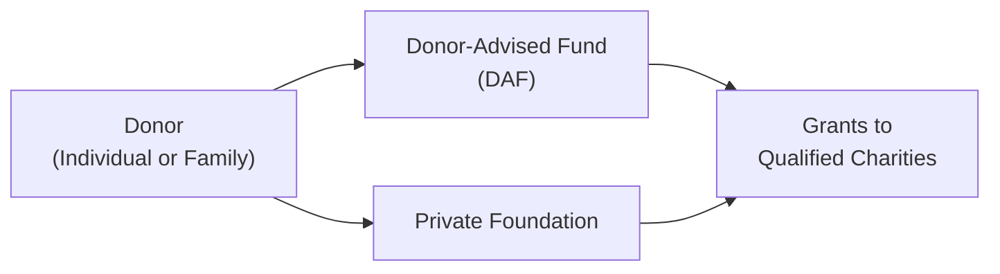

## Introduction and Overview

I’ve actually had a family friend who once joked, “Wait—if I start a private foundation, do I just get to write checks to my favorite causes all day?” And you know what? In a (very) simplified sense, that’s part of the job. But—ah—there’s also a fair share of rules, paperwork, and strategic planning that happen behind the scenes. That’s where we, as wealth advisors, get to roll up our sleeves and help structures like private foundations and donor-advised funds (DAFs) serve clients’ philanthropic goals.

Making the right choice between starting a private foundation or establishing a donor-advised fund (DAF)—or, in some cases, using both—requires a thorough understanding of the operational, regulatory, and tax implications. The selection primarily depends on the level of control the donor desires, their desired public profile, the complexity of their philanthropic mission, and the potential size of assets to be dedicated to philanthropic endeavors.

Below, we’ll walk through the essential elements of foundations and donor-advised funds, from their setup to the ongoing administration. Although it may sound like a lot to learn, the principles are straightforward once you grasp how these vehicles bring structure, accountability, and flexibility to charitable giving.

## Background on Charitable Foundations

### Private Foundations 101

A private foundation is typically funded by a single individual, family, or a closely held entity. Its defining feature is control: the donor (and potentially the donor’s family) retains significant authority over grantmaking decisions, investment strategies, and the overall mission. Oftentimes, this structure is used for multi-generational philanthropic traditions, where families value hands-on engagement in selecting and monitoring charitable grantees.

Foundations come in two main forms:

• Operating Foundations  
• Non-Operating Foundations

An operating foundation directly spends the majority of its resources on its own charitable programs (think of a philanthropic organization that runs research labs, educational programs, or community services). A non-operating foundation, in contrast, predominantly funds external charitable organizations. Most private foundations default into the non-operating category unless they actively conduct charitable activities.

#### Pros and Cons

• Pros:  
  – Broad control over grantmaking and branding.  
  – Potential family legacy vehicle across generations.  
  – Comprehensive authority over investment decisions.  

• Cons:  
  – Higher administrative costs (tax filings, legal and accounting services, board meetings, etc.).  
  – Annual minimum distribution requirements in many jurisdictions (for example, 5% of investment assets in the United States).  
  – Increased oversight by regulatory authorities and more stringent reporting obligations.

## Starting a Private Foundation

The notion of “starting your own foundation” carries a certain mystique, but the initial setup can be, well, tedious. You’d typically begin by incorporating a legal entity—often a nonprofit corporation or a charitable trust—depending on relevant local statutes. Once established, you seek formal tax-exempt status. This process might involve national or regional tax bodies (such as the IRS in the United States) along with fulfilling specific documentation, including bylaws for governance and conflict-of-interest policies.

### Steps to Incorporate a Private Foundation

1. Draft Organizational Documents. The foundation will likely need articles of incorporation (or trust documents) defining charitable objectives, governance structures, and dissolution provisions.  
2. Obtain Tax-Exempt Status. In many jurisdictions, obtaining classification as a tax-exempt charity requires disclosing your foundation’s funding sources, bylaw details, and operational plans.  
3. Create Internal Policies. This includes developing procedures for grant guidelines, conflict-of-interest policies, and compliance standards.  
4. Identify Board Members. The foundation’s board is often family members plus independent advisors or subject-matter experts in philanthropic areas.
5. Secure Initial Funding. The founder(s) will generally transfer initial assets—cash, marketable securities, shares of a closely held company, or even real estate.

Upon completion, there may be ongoing obligations like annual filings to keep the foundation’s tax-exempt standing. Also, in many countries, private foundations must meet a minimum distribution requirement to ensure they are actively dispersing resources for charitable purposes.

### Minimum Distribution Requirement

In some jurisdictions, the foundation must disburse a certain percentage of its net investment assets each year—commonly around 5%. For example, in the United States, if the foundation’s net investment assets are US$10 million, it typically needs to pay out at least US$500,000 in grants or qualifying administrative expenses annually. Failing to meet the distribution requirement can lead to excise taxes or other penalties.

## Donor-Advised Funds (DAFs)

In contrast to private foundations, donor-advised funds are simpler to establish, often come with lower startup costs, and are administered by a sponsoring organization (like a community foundation or a financial institution’s charitable subsidiary). Donors receive an immediate tax deduction upon contributing assets to the DAF, and then they can “advise” which charities should receive grants in subsequent years. However, ultimate grantmaking authority rests with the sponsoring organization.

### Key Features of DAFs

• Ease of Setup: Opening a DAF usually involves filling out some forms and making the initial contribution.  
• Ongoing Costs: Lower than foundations, as administrative and investment management expenses are handled by the sponsoring organization.  
• Donor Control: While you can recommend grants or investments, legal control remains with the sponsor. If the donor’s advice conflicts with the sponsor’s policies, the sponsor has the final say.  
• Privacy: Donations can typically be made anonymously, giving donors the discretion to remain out of the spotlight.  

Many families start with a donor-advised fund before moving to a private foundation if they wish to scale up their philanthropy and have greater involvement or control in the grantmaking process. In some cases, a large philanthropic intent emerges after a significant liquidity event (e.g., selling a business), and donors find that opening a DAF is a convenient way to quickly secure a tax deduction while deciding on long-term philanthropic plans.

### Inviting Family Participation

DAFs can be a wonderful way to engage family members without the formalities of a board structure or the operational costs of a foundation. Parents or grandparents can let younger generations suggest particular charities, effectively passing on charitable values and decision-making skills. Over time, some families choose to transition from a DAF to a foundation when philanthropic discussions become more complex, or they desire a stronger brand recognition for their giving.

## Ongoing Governance and Oversight

### Board Responsibilities in a Foundation

One of the hallmark differences between running a private foundation and contributing to a donor-advised fund is governance. In a private foundation, the board is typically responsible for:

• Setting the Foundation’s Mission and Program Priorities: Determining which areas of philanthropy (e.g., education, healthcare, environment) the foundation will focus on.  
• Reviewing and Approving Grants: Ensuring that potential grantees meet both ethical and legal standards.  
• Managing Conflicts of Interest: Family members and allied parties serving on the board must adhere to self-dealing statutes and avoid benefiting personally from foundation resources.  
• Ensuring Regulatory Compliance: Maintaining proper records, filing annual returns, and fulfilling minimum distribution requirements.  

For donor-advised funds, oversight responsibilities rest mostly with the sponsoring organization. However, donors who hold DAF accounts can opt to set up an advisory committee (often including family members) to recommend grants or direct the investment profile of the fund’s assets (to the extent allowed by the sponsor).

### Conflict-of-Interest Policies

To mitigate risk, private foundations should clearly outline conflict-of-interest policies in their bylaws. These rules typically dictate that insiders—like major donors or board members—cannot benefit financially from foundation dealings. For instance, if a family member’s business wants to charge the foundation for consulting services, that would risk violating self-dealing regulations, resulting in stiff penalties.

### Recordkeeping and Transparency

Both private foundations and donor-advised funds should keep timely and accurate records of all contributions, grants, and investment activities. Many jurisdictions require disclosures in annual reports or tax filings, and robust recordkeeping facilitates compliance. Foundations, being separate legal entities, often have more extensive reporting requirements, while DAF sponsors typically handle the bulk of reporting on behalf of individual DAF accounts.

## Investment Policies for Foundations and DAFs

### Crafting an Asset Allocation Strategy

Philanthropic entities frequently adopt a long-term investment horizon, aiming to preserve capital and fulfill distribution requirements. The approach can vary: some foundations prefer more conservative allocations (like investment-grade bonds and large-cap equities) given annual distribution obligations, while others may embrace more growth-oriented or alternative strategies to preserve the real value of their philanthropic endowments over time.

• For Private Foundations: The foundation board approves the investment policy statement (IPS), addresses ethical or sustainable investing mandates, and can incorporate mission-related investments (MRIs) or program-related investments (PRIs) to align portfolio objectives with philanthropic goals.  
• For DAFs: The sponsoring organization often provides investment pools (ranging from conservative to aggressive), and donors typically choose from these pools. Larger DAF accounts might have the opportunity to recommend customized strategies.

### Mission-Related (MRI) and Program-Related (PRI) Investments

Some foundations seek to extend their philanthropic impact by employing investments that directly contribute to their charitable mission. For example:

• MRIs: Foundations invest in for-profit entities that align with the foundation’s mission, such as clean energy startups or microfinance initiatives. While the returns are typically market-based, the approach fortifies the foundation’s broader objectives.  
• PRIs: These investments are specifically designed to accomplish charitable purposes, often at below-market returns. A foundation might provide a low-interest loan to a nonprofit affordable housing project—an activity that furthers the foundation’s philanthropic goals.

## Tax Considerations

### Donor Deduction Limits and Carryovers

One major enticement for philanthropic giving is the tax deductibility of contributions. In many jurisdictions, the tax deduction for contributions to a private foundation may be more limited than for a public charity or donor-advised fund. For instance, in the United States, annual deductions for cash gifts to a private foundation might be capped at a lower percentage of the donor’s adjusted gross income (AGI) compared to gifts made to a public charity or DAF.

Moreover, donations that exceed applicable deduction limits in a given year are typically eligible for a carryforward period (often five years) to claim the unused portion of the deduction.

### Self-Dealing and Excess Business Holdings

Private foundations must abide by strict rules prohibiting insiders (substantial contributors, family members, etc.) from engaging in transactions that benefit them personally at the foundation’s expense. Examples include borrowing from the foundation or leasing property to it at above-market rates. Violations can trigger penalty excise taxes on both the involved individuals and the foundation.

Another area of compliance is the restriction on excess business holdings: a private foundation generally cannot own more than a certain percentage (often 20%) of a for-profit business enterprise, with some preexisting exceptions or transition periods allowed.

### Cross-Border Giving

Donors who want to support charitable organizations in other countries often run into tricky legal contexts because tax authorities typically restrict or disallow deductibility for gifts made directly to foreign charities. One way around this is to use a U.S.-based “friends of” organization that qualifies as a public charity—effectively serving as an intermediary. Private foundations must carefully document any grants that go to non-U.S. charities to ensure they are used exclusively for charitable purposes.

## Transitioning from DAF to Foundation (or Vice Versa)

Sometimes philanthropic vehicles evolve over time. For instance:

• Step 1: A donor might start with a DAF for its simplicity and immediate tax benefits.  
• Step 2: Over the years, if philanthropic resources grow or the donor desires more control and more personal brand identity for the family’s giving, moving to (or adding) a private foundation can be the next step.  

Conversely, there are scenarios where a foundation’s founders decide it’s too costly or administratively hefty to maintain a private foundation. They decide to distribute the remaining assets into a DAF and let the sponsoring organization handle day-to-day operations. Each path can be valid; it really depends on philanthropic objectives, scale, and personal preferences.

## Best Practices, Common Pitfalls, and Strategies

• Define a Clear Mission and Purpose: Ensure that your foundation or DAF has a guiding mission statement. Your philanthropic initiatives will be more coherent and impactful if you’re guided by explicit goals.  
• Avoid Self-Dealing: Keep an eye out for any transactions between formal insiders and the foundation. Even an honest oversight can expose you to significant penalties.  
• Budget for Administrative Costs: If you want maximum control, a private foundation might be the route—but expect to budget for legal, accounting, and compliance fees.  
• Engage the Next Generation: Whether you manage a foundation or maintain a DAF, create opportunities for younger family members to participate in decision-making, philanthropic site visits, or investment committees.  
• Think Long-Term: Particularly for perpetual foundations. Align your investment strategy with the foundation’s time horizon to ensure the corpus can meet future funding needs while satisfying ongoing distribution requirements.

## Practical Example: Funding a Community Scholarship

Picture a family that wants to establish a scholarship fund for local high school students. They have two approaches:

1) Through a Private Foundation:  
   – The family invests US$2 million into the new foundation.  
   – Each year, they distribute at least 5% (US$100,000), which might fund 10 scholarships.  
   – They oversee the selection process, sometimes with local school advisors, and file relevant annual forms to maintain tax exemption.

2) Through a Donor-Advised Fund:  
   – The family contributes the same US$2 million into a DAF sponsored by a community foundation.  
   – The family recommends awarding US$100,000 annually for scholarships.  
   – The administrative overhead (e.g., selecting recipients, verifying the charitable use of funds) might be partially managed by the sponsor.

Either approach achieves the scholarship goal, but the private foundation route will require more direct involvement in administration and compliance, while the DAF path offers ease and reduced overhead.

## Diagram: Philanthropic Structures

Below is a simplified Mermaid diagram showing how donations flow to charities, depending on whether you use a DAF or a private foundation:

## Final Exam Tips

1. Review Real-World Compliance: Expect scenario-based questions about self-dealing, minimum distribution requirements, or philanthropic vehicle transitions.  
2. Understand the Different Deduction Limits: Examine how the exam might test you on the differences in AGI percentage limits for private foundations vs. public charities vs. DAFs.  
3. Incorporate Cross-Border Elements: Remember to check whether the exam scenario has any mention of foreign charities and possible solutions for donors to achieve deductibility.  
4. Practice Budgeting for Administration: If a question includes a philanthropic scenario, be prepared to factor in administrative costs and the resources needed to maintain compliance.  
5. Time Allocation in Essay-format Questions: If a question references philanthropic planning as part of a broader wealth plan, allocate time to highlight not just philanthropic structure choice but also your rationale on tax efficiency, governance, or multi-generational benefits.

## References and Further Reading

• Bermingham, L. (2020). “Philanthropy Across Borders: A Guide to Charitable Giving.”  
• Council on Foundations: https://www.cof.org/  
• “Setting Up a Private Foundation: Key Legal and Financial Steps,” Estate Planning Journal.  
• “Donor-Advised Funds: The Basics,” Fidelity Charitable.

## Test Your Knowledge: Charitable Foundations & DAF Essentials



### Which of the following best describes a non-operating foundation?

- [ ] A foundation that focuses on running its own charitable programs.  
- [ ] A donor-advised fund that primarily invests in low-cost index funds.  
- [x] A foundation that distributes grants primarily to external charitable organizations.  
- [ ] A foundation that is directly owned and managed by an umbrella nonprofit.  

> **Explanation:** A non-operating foundation predominantly grants funds to external charities rather than conducting its own charitable programs.

### Which attribute of a donor-advised fund most distinguishes it from a private foundation?

- [ ] The necessity to meet a minimum distribution requirement each year.  
- [x] The legal control of contributed assets resides with a sponsoring organization, not the donor.  
- [ ] The ability to engage in mission-related investments.  
- [ ] The need to be registered as a separate legal entity.  

> **Explanation:** Donor-advised funds are structured such that the sponsoring organization holds final legal control of assets, even while donors advise on distributions.

### A private foundation in many jurisdictions is generally required to distribute about what percentage of its net investment assets annually?

- [ ] 2%  
- [ ] 3%  
- [x] 5%  
- [ ] 10%  

> **Explanation:** In the United States and in some other jurisdictions, the required annual distribution for private foundations is typically around 5% of net investment assets.

### What is a primary risk factor regarding self-dealing in private foundations?

- [x] Insiders using the foundation’s assets for personal gain.  
- [ ] The foundation failing to make mission-related investments.  
- [ ] The foundation not receiving enough donations from insiders.  
- [ ] Excessive anonymity of donor contributions.  

> **Explanation:** Self-dealing involves transactions that personally benefit a substantial contributor, board member, or other disqualified person at the expense of the foundation.

### How does a donor-advised fund typically reduce administrative burdens compared to a private foundation?

- [x] The sponsoring organization handles legal filings and compliance tasks.  
- [ ] The donor is exempt from completing annual reporting on personal taxes.  
- [x] The cost of governance is usually included in the sponsor’s fee.  
- [ ] It offers a lower tax deduction for contributions.  

> **Explanation:** DAFs are maintained by sponsoring organizations, which manage administrative and compliance tasks for donors, significantly reducing the donor’s overhead.

### Why might a philanthropist choose to set up a private foundation instead of using a DAF?

- [x] Desire for full control over governance, investments, and grantmaking.  
- [ ] A need to remain anonymous in all charitable contributions.  
- [ ] Eliminate annual reporting requirements.  
- [ ] Avoid minimum distribution constraints.  

> **Explanation:** A private foundation grants the donor (and their board) direct oversight over strategy, investments, and grants, which some donors value over the streamlined but less controlling nature of a DAF.

### Which investment approach most directly unites a foundation’s portfolio strategy with its philanthropic objectives?

- [ ] Allocating 100% of assets to dividend-paying equities.  
- [ ] Maintaining only government bonds for stable returns.  
- [ ] Investing in high-growth technology startups exclusively.  
- [x] Employing mission-related or program-related investments.  

> **Explanation:** MRIs and PRIs directly support charitable or mission-driven ventures, aligning a foundation’s investments with its philanthropic goals.

### One advantage donors commonly cite for choosing a DAF over a private foundation is:

- [ ] The ability to avoid recommending grants for an indefinite period.  
- [ ] The ability for the donor to personally profit from investments.  
- [x] Increased confidentiality and potential for anonymous giving.  
- [ ] Minimizing the sponsoring organization’s involvement in granting.  

> **Explanation:** A DAF allows donors to remain discreet, as grants can typically be made anonymously, which is more challenging with a private foundation.

### Which statement most accurately describes cross-border giving considerations?

- [x] Grants to foreign charities often require an intermediary or special documentation to ensure deductible status.  
- [ ] Private foundations can freely grant to non-U.S. charities without any reporting.  
- [ ] Donor-advised funds are mandatorily restricted from giving to foreign charities.  
- [ ] There are no tax limitations regarding cross-border philanthropic activities.  

> **Explanation:** Many jurisdictions restrict or have specific rules for deducting gifts to foreign charities; this often necessitates using an intermediary or conducting extra due diligence.

### Private foundations are prohibited from which of the following transactions with substantial contributors?

- [x] Self-dealing transactions.  
- [ ] Reasonable reimbursements for volunteer travel.  
- [ ] Grants to recognized public charities.  
- [ ] The hiring of bona fide independent contractors.  

> **Explanation:** Private foundations must avoid self-dealing with substantial contributors or related insiders, as these transactions can jeopardize the foundation’s tax-exempt status.


