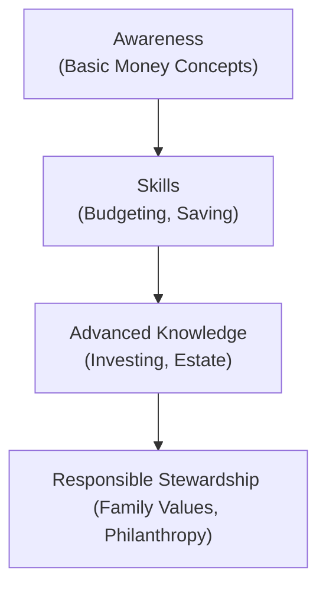

## Introduction

Wealth transfer can be both a blessing and a burden—especially if the beneficiaries aren’t prepared for its responsibilities. We’ve all heard stories of heirs who inherited massive fortunes but ended up blowing through that wealth because they just didn’t have a clue about budgets, investments, or taxes. Maybe you’ve even seen a friend or neighbor struggle with sudden money. It’s not uncommon. Over generations, family members who don’t acquire a solid financial grounding can inadvertently squander what took decades to build. So, that begs the question: how do we make sure future generations handle, maintain, and maybe even grow the family wealth?

This section is all about financial education for heirs and beneficiaries. Think of it as a roadmap for weaving practical lessons about money into the family culture so that everyone (including your niece who insists she’ll be a YouTube influencer) develops smart financial habits. We’ll go through why this education matters in a big way, what topics to cover at each age, how to run family retreats or workshops, and even how to measure whether anyone’s actually learning something. Our goal is to help you set up a lasting structure that guides each new wave of family members to become responsible stewards of the family’s legacy.

## The Importance of Multi-Generational Education

One of the toughest aspects of wealth management is the transition from one generation to the next. You might be thinking, “Well, if my parents or grandparents left me a trust, that should be straightforward enough.” But the truth is, transitioning wealth involves more than simply having the right legal or tax framework in place. It’s about preparing beneficiaries emotionally, psychologically, and intellectually to handle significant responsibilities.

Comprehensive multi-generational education does a lot of heavy lifting here:

• It helps younger family members see money not as an entitlement but as a tool for personal growth, opportunity, and contributions to society.  
• It fosters communication and collaboration, reducing all-too-common family disputes over who gets what and why.  
• It creates space for open conversations about values, philanthropy, and the broader family vision—topics that otherwise might never come up until conflict arises.

I remember a wealthy family who set up annual “family bank” gatherings, where parents and grandparents would discuss small “loans” to kids for entrepreneurial ventures. One cousin designed jewelry and sold it online, another wanted to launch a summer snack stand. The catch was that they had to pitch like they were on a reality TV show—just minus the cameras! Participating in these sessions taught them about profit margins, risk, and accountability. Years later, those kids felt empowered, not entitled, and they still talk about those early lessons.

## Core Financial Literacy Topics

Once the family recognizes the value of educational initiatives, the next question is, “Okay, so what do we actually teach?” The essentials remain surprisingly constant, whether you’re dealing with a modest inheritance or a substantial multi-million-dollar estate:

• Budgeting: Understanding income, expenses, and how to create a realistic monthly plan.  
• Saving: Recognizing the importance of emergency funds and setting aside resources for unforeseeable circumstances.  
• Credit Use: Learning how credit cards, loans, and interest rates work, so individuals can avoid drowning in high-interest debt.  
• Investment Basics: Covering fundamental concepts such as stocks, bonds, diversification, and risk vs. return.  
• Insurance and Risk Management: Explaining life insurance, health insurance, and property-casualty coverage.  
• Asset Allocation and Portfolio Theory: For intermediate and advanced learners, exploring how diversification across asset classes can help achieve risk-adjusted returns.  

Let’s briefly illustrate a universal principle of investing that helps ground the conversation about returns and compounding. The future value (FV) of an investment can be approximated by:

$$
\text{FV} = \text{PV} \times (1 + r)^n
$$

where PV is the present value, \\( r \\) is the annual interest rate, and \\( n \\) is the number of years. Even a small difference in \\( r \\) can translate into big differences over time—one of the first “aha!” moments any investor experiences.

## Age-Appropriate Education Milestones

Kids and adults absorb financial lessons in very different ways. Please don’t try teaching a 6-year-old the fine points of hedge funds or alternative investments. Instead, the approach should evolve as the child matures:

### Early Childhood: Basic Money Concepts

Starting as young as five or six, kids can grasp the idea that money buys things and that people earn money by working or providing services. Simple chores with small allowances can help illustrate the concept of exchange. You might integrate a “save-spend-give” jar system where they allocate a portion of their allowance into each jar.

### Adolescence: Saving, Earning, and Investing

As they move toward teenage years, it’s helpful to discuss savings strategies, maybe even introducing the idea of interest. You can emphasize the significance of short-term and long-term saving goals. And yes, let them make small spending mistakes—blowing a few allowances might be the best teacher. You might also consider giving a teenager oversight of a “mini-portfolio,” even if it’s a simulated environment, to pique their curiosity about investing.

### Young Adults: Complex Wealth Structures and Advanced Concepts

This is the sweet spot for more sophisticated subjects. Talk about taxes (yes, they may just roll their eyes, but it’s important), estate planning basics (possibly referencing Chapter 7.4 for trust structures), philanthropic giving (see Chapter 7.3 if they desire to support nonprofits), and advanced investing (like derivatives or private equity). If there’s a family business, young adults should learn about its financial structure and the responsibilities that come with ownership or leadership.

The family bank concept can really shine here. Imagine a newly minted college graduate who wants to start a small venture, say a specialty coffee truck. By requiring an official pitch, scrutinizing the business plan, and building in accountability for loan repayment, that graduate gets real, hands-on experience in entrepreneurship.

The progression from basic to advanced learning can be visualized like this:

## Workshops and Family Retreats

I think we’ve all rolled our eyes at some point when someone suggests a “family retreat.” But properly designed workshops can be incredibly powerful—plus, they can even be fun if you build the right atmosphere. Family wealth retreats often include:

• Educational Sessions: Facilitated by an external advisor who can cover everything from budgeting fundamentals to complex philanthropic structures (see Chapter 7.3 on philanthropy).  
• Real-World Simulations: These might simulate a board meeting for a family foundation or an investment committee deliberating on real estate or private equity deals.  
• Values Discussion: Time set aside for exploring the family mission and how wealth intersects with personal and social objectives.  

One family I know held a “philanthropy hackathon” where teams were given fictitious philanthropic budgets and had to allocate them to various charitable causes. It became a competition, but also a deeply enriching conversation about values and impact. Retreats offer unique face-to-face time that can break down communication barriers, especially for high-net-worth families who are often scattered across multiple cities or countries.

## Mentorship and Role Modeling

Although structured events can be powerful, the day-to-day reinforcement of financial habits is just as critical. Mentorship programs within the family or with trusted advisors take the learning from theory into reality. A mentor could be a grandparent with decades of investment experience or a family office professional who’s willing to guide younger members in analyzing potential deals.

Role modeling also goes a long way in demonstrating that wealth is more than just money. If an older generation member is heavily involved in philanthropic work, there’s a good chance younger members will be inspired to think about philanthropy as well. The family environment might say, “Hey, we’re not just about making or inheriting money; we’re about using money to make a difference and encourage personal development.”

## Technology and Online Platforms

When I was growing up, financial education basically meant your parents made you open a savings book at a local bank. Now, you’ve got dynamic apps, mobile payment platforms, and even advanced investment simulators that replicate real-time market movements.

• Game-Based Learning: Tools like The Stock Market Game or specialized investment apps can help novices pick mock portfolios, track performance, and learn from mistakes in a risk-free environment.  
• Online Community Portals: Families can establish secure portals for things like trust distributions, philanthropic tracking, or even family “bulletin boards.”  
• Investment Simulators: A key concept from the glossary, these simulators let beginners learn by doing—picking securities, analyzing market data, and watching how hypothetical portfolios fare in changing economic conditions.

Encourage younger family members to use these tech solutions. If your teenage niece is always glued to her phone anyway, why not harness that for basic financial skill-building? It’s a low-risk, high-engagement approach to ensuring they gain familiarity with core market concepts.

## Measuring Learning Outcomes

So how do you know if all these retreats, apps, and mentorship sessions are making a dent? Measuring progress can be tricky, but it’s crucial. Without feedback, it’s impossible to fine-tune the teaching strategies.

Some families incorporate small quizzes into gatherings—like a quick “Financial Literacy Bingo” game at the end of a workshop. Others check progress via formal accreditation or certification programs, especially if the family has a robust governance structure. You might even try a more informal approach, asking for personal reflections or encouraging younger members to lead the next educational session on a topic they’ve mastered.

Regardless of the method, continuous improvement loops keep the program relevant. People and markets evolve, so your educational content needs to be updated as well. When you gather for next year’s family meeting, you can incorporate new sessions on ESG investing or inflation hedging if that’s become a pressing concern.

## Best Practices and Common Pitfalls

It’s worth highlighting a few best practices. First, consistency is everything. The best family programs aren’t one-and-done events; they’re repeated year-on-year. Second, leading by example is non-negotiable. If the older generation preaches frugality but has extravagant spending habits, it undercuts the credibility of the education program. Third, adjust the complexity as learners grow—introduce advanced concepts when they’re ready, but don’t drown them too soon.

Pitfalls often revolve around ignoring interpersonal dynamics. I’ve seen well-structured programs falter because long-simmering sibling rivalries overshadowed any learning. That’s why some families bring in professional facilitators who can handle group tension without bias. Another pitfall is assuming everyone learns the same way. Some might love the workshop environment, while others prefer one-on-one mentorship or online modules.

## Conclusion: Exam Tips and Final Thoughts

Those preparing for the CFA® Level III exam—especially those focusing on the Private Wealth pathway—should note that financial education for future generations is more than just a nice “soft skill.” It directly ties into sustaining client relationships, as high-net-worth clients often ask for help in equipping their heirs to handle wealth. Remember, the exam might challenge you to design a multi-generational education plan, detail the components of a “family bank,” or discuss how to handle cross-border complexities. Demonstrate that you grasp the conceptual framework—proactive engagement, structured mentorship, and continuous improvement—and you’ll be well prepared for scenario-based questions.

From an exam standpoint, watch out for:

• Overlooking the psychosocial elements: The exam commonly tests your ability to integrate human dynamics with technical wealth strategies.  
• Mixing up wealth transfer structures: Understand the roles of trusts, philanthropic funds, and the importance of consistent family governance.  
• Failing to provide real-world examples: Constructed response questions often invite you to apply concepts to a hypothetical family scenario.

Ultimately, by tying together practical lessons and robust frameworks, you’ll be able to craft educational programs that endure for many generations—no matter how complex the family branches become.

## Glossary

Financial Literacy  
The set of skills and knowledge that allows an individual to make informed and effective decisions with financial resources.

Multi-Generational Education Plan  
A structured framework designed to educate different age groups within a family on financial and wealth management topics.

Family Bank Concept  
An internal lending or gifting mechanism used by families to encourage entrepreneurial projects, financial responsibility, and accountability.

Investment Simulator  
An online or offline tool that allows users to practice investment decision-making without real-world financial risk.

Mentorship Program  
Pairing less experienced individuals with seasoned professionals or family leaders for guidance.

Entitlement Mentality  
An attitude where individuals assume wealth distribution without personal effort or contribution.

Accreditation or Certification  
Formal recognition that an individual has achieved a certain level of competency in financial or investment skills.

Continuous Improvement  
Ongoing effort to enhance processes and approaches, ensuring educational initiatives remain relevant and effective.

## References and Further Reading

• Williams, R. & Preisser, V. Preparing Heirs: Five Steps to a Successful Transition of Family Wealth and Values.  
• Hughes Jr., J. E. Family Wealth—Keeping It in the Family.  
• Brooks, A. “The Financially Empowered Family.” Family Wealth Quarterly.  
• Online Simulations and Game-Based Learning Platforms, including The Stock Market Game and Khan Academy Finance Courses.

## Test Your Knowledge: Financial Education for Future Generations Quiz



### Which of the following best describes the primary goal of multi-generational education in private wealth?

- [ ] To enforce strict spending rules for heirs, ensuring minimal discretionary use of wealth
- [x] To prepare heirs to manage, grow, and steward inherited wealth responsibly
- [ ] To limit legal checks and balances, speeding up the transfer of wealth
- [ ] To reduce the role of professional advisors in the family’s wealth journey

> **Explanation:** The main objective of a multi-generational education plan is to develop responsible heirs who can handle wealth effectively and reduce family disputes over money.

### In a family bank concept, which critical element helps younger members learn accountability?

- [ ] No requirement to repay loans
- [x] A formal pitch or application process for funding
- [ ] Unlimited capital without guidance
- [ ] All entrepreneurial ideas are automatically approved

> **Explanation:** Requiring a formal pitch or application process encourages younger family members to justify how they’ll use funds, reinforcing accountability and business acumen.

### Which of the following activities typically occurs during a family retreat designed for wealth education?

- [ ] Avoiding any discussion of long-term financial goals
- [ ] Restricting family members from sharing concerns or questions
- [x] Structured events where family members discuss core principles, challenges, and philanthropic visions
- [ ] Outsourcing all decision-making to financial advisors without family involvement

> **Explanation:** Family retreats are meant to encourage active dialogue, learning, and alignment on values and goals among family members, often facilitated by external experts.

### How can technology play a role in financial education for future generations?

- [ ] Limiting interactive tools so that younger family members rely solely on textbooks
- [ ] Completely replacing human mentorship and family discussions
- [ ] Using only social media for family communication
- [x] Providing simulators, online apps, and secure portals to make learning interactive and trackable

> **Explanation:** Technology can enhance engagement through interactive tools such as simulators, apps, and portals, complementing traditional mentorship and family meetings.

### When teaching investing to a teenager, which approach is generally recommended?

- [x] Introducing basic concepts like stocks, bonds, and diversification with hands-on, possibly simulated practice
- [ ] Starting with estate tax optimization strategies
- [x] Allowing small, supervised mistakes to reinforce lessons
- [ ] Explaining only credit scores and ignoring savings or investment topics

> **Explanation:** Early exposure to investing often works best by introducing fundamental ideas and allowing safe, small-scale learning experiences. This can be combined with lessons on credit and long-term saving but typically doesn’t involve complex estate planning at this stage.

### Which method can be used to measure progress in a family’s financial education program?

- [x] Quizzes or feedback sessions during family gatherings
- [ ] Keeping learning outcomes completely confidential
- [ ] Refusing to adjust the curriculum over time
- [ ] Avoiding any documentation of educational milestones

> **Explanation:** Quizzes, feedback sessions, and documented learning milestones help gauge the effectiveness of the program and guide future improvements.

### What is a potential pitfall of having a well-designed education curriculum without proper facilitation?

- [ ] Improved family communication
- [x] Sibling rivalries or interpersonal conflicts overshadow the program
- [ ] Too much attention to estate documents and tax codes
- [ ] Greater sense of shared purpose among family members

> **Explanation:** Even an excellent curriculum can fail if ongoing family tensions are not managed, highlighting the value of professional facilitation or mediation skills.

### Why is continuous improvement essential in multi-generational financial education?

- [ ] Because once a course is set, it should never change
- [ ] To ensure that only older generations make decisions
- [ ] To prevent family members from learning about new market opportunities
- [x] Because economic conditions, family needs, and markets evolve over time, requiring updates

> **Explanation:** As needs, goals, and external conditions change, the education program must adapt to stay effective and relevant.

### How can mentorship programs complement formal financial workshops?

- [x] By offering one-on-one guidance that applies workshop insights to real-life decisions
- [ ] By completely replacing the need for structured tutorials
- [ ] By limiting the scope to budgeting discussions only
- [ ] By ensuring that younger members never interact with older generations

> **Explanation:** Mentorship provides a personal, hands-on approach, reinforcing skills learned in formal settings and guiding younger investors in practical decisions.

### Teaching a young child the concept of money most effectively involves which of the following statements?

- [x] True
- [ ] False

> **Explanation:** Children can begin comprehending basic money concepts—such as receiving an allowance and saving some of it—much earlier than many people realize.




