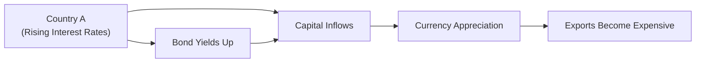

Introduction  
It’s always fascinating to see how one country’s economic policymaking can ripple through the entire world. Remember that time when interest rates in Country A started creeping upward, and then, as if by magic, investors everywhere began shifting money around, causing currencies to fluctuate in seemingly unpredictable ways? That’s a perfect example of how macroeconomic conditions, interest rates, and exchange rates are all interlinked. This section delves into these linkages, focusing on theories like Interest Rate Parity (IRP) and Purchasing Power Parity (PPP), and explores how open economies transmit shocks via capital flows, net exports, and policy spillovers. We’ll also look at the practical implications for building capital market expectations and, ultimately, shaping asset allocation decisions.

Macroeconomic Interconnections at a Glance  
Economies don’t exist in isolation (at least not anymore). Globalization has led to deeper trading relationships, more cross-border investments, and a heightened sensitivity to monetary and fiscal policies implemented in distant corners of the globe. An interest rate hike in one country can attract foreign capital inflows, appreciate its currency, and in turn influence exports, imports, and local inflation. Meanwhile, an unexpected policy shift in a large economy—such as a sudden change in central bank policy—can spark volatility in equity and bond markets all around the world.

Interest Rate Parity  
Interest Rate Parity (IRP) offers a theoretical framework for how currency forward prices (or expected future spot prices) should adjust relative to interest rate differentials between two countries. The basic notion is that you shouldn’t be able to earn a higher risk-free return in one currency than in another without incurring offsetting exchange rate changes. In other words, if the interest rate is higher in Country A’s currency, that currency might be expected to depreciate to neutralize any arbitrage or “easy money” gains.  

Under the covered or forward rate version of IRP, the forward exchange rate (F) between two currencies is determined by:

(1)  
F = S × (1 + iₐ) / (1 + i_b)  

where:  
• S = current spot exchange rate (e.g., domestic currency per unit of foreign currency),  
• iₐ = risk-free interest rate of currency A,  
• i_b = risk-free interest rate of currency B,  
• F = forward rate (domestic currency per unit of foreign currency).

If this relationship didn’t hold, there would be an arbitrage opportunity that traders would quickly exploit. For instance, if the forward rate were “too high,” investors could borrow in the low-interest-rate currency, convert at the spot rate, invest in the high-interest-rate currency, and lock in a forward contract to convert back at maturity—pocketing a riskless profit. These actions would push the forward rate in line with theory.

Example of IRP  
Imagine you’re an investor deciding whether to invest in a 6-month Treasury bill denominated in Currency A or Currency B. Suppose Currency A offers an annualized yield of 5% while Currency B offers 3%. Let’s say the current spot exchange rate is 1.20 A-per-B. If you buy currency B at the spot rate and invest at 3%, your forward contract to convert your maturity proceeds back to currency A should be 1.20 × (1 + 0.05/2) / (1 + 0.03/2), because we’re dealing with a 6-month period (half of a year). If the actual forward rate quoted in the market is different from this theoretical result, then an arbitrage arises. Eventually, market forces correct the discrepancy.

Purchasing Power Parity (PPP)  
While IRP focuses on interest rates and exchange rates, Purchasing Power Parity (PPP) zeroes in on the price of goods in different countries. The idea is that one unit of currency should purchase roughly the same basket of goods and services across countries in the long run, once you adjust for the exchange rate.  

Why does PPP matter? Well, if a currency’s purchasing power is out of line, it suggests that one currency might be overvalued or undervalued. In practice, short-term exchange rates can deviate significantly from PPP-based valuations due to interest rate differentials, risk premiums, and investor sentiment. But over the longer run—think five to ten years—the currency should trend back toward a level that makes similar goods cost roughly the same everywhere.

Example of PPP  
Let’s say a fast-food burger combo costs 5 units of Currency X in Country X and 10 units of Currency Y in Country Y. If the currencies are trading at X1.0 = Y1.0, then it’s “cheaper” to make your burger runs in Country X, comparatively speaking. Over time, there will be pressures—through trade flows, cost of imports/exports, and even tourism—that might encourage the exchange rate to move to around X1.0 = Y2.0. This new rate would reflect the ratio of burger prices. Once again, though, real-life exchange rate paths can deviate widely from the PPP “fair value” for prolonged periods.

Open Economy Extensions  
In an open economy, interest rates, currency values, and macroeconomic variables are stitched together with global trade and capital flows. Net exports (exports minus imports) can shift as currencies fluctuate, which can then nudge GDP upward or downward. Meanwhile, large cross-border capital flows—into equities, bonds, or direct investments—can magnify business cycles.  

• Fixed vs. Floating Exchange Rates: In a fixed exchange rate regime, the authorities peg the currency to another currency (or basket) and intervene in the foreign exchange market or use monetary policy tools to keep that peg in place. This can stabilize short-run exchange rates but imposes constraints on domestic monetary policy. In a floating regime, the currency’s value is largely determined by supply and demand; short-term exchange rate volatility can be higher, but monetary policy has more flexibility to react to local economic conditions.  
• Net Exports and Capital Flows: Think of net exports as a function of a country’s competitiveness, which in turn is influenced by exchange rates. With a sharp appreciation in the domestic currency, exports can become more expensive abroad, dragging down net exports. Conversely, a large depreciation can stimulate exports (though it can also stoke inflation). Meanwhile, foreign capital flows can come in or out quickly if global investors sense better yields or safer havens elsewhere.

Capital Flows and Global Liquidity  
I recall a time when a close friend of mine, who manages a small emerging market fund, told me how quickly portfolio flows reversed. Over just a few weeks, billions of dollars left the country due to a rate hike in a major developed economy. The local currency depreciated steeply, causing domestic bond prices to plunge. It underscores how capital moves quickly—and sometimes brutally—across borders in pursuit of higher returns, safer assets, or both.

Global liquidity is a function of major central banks’ monetary policies, risk appetites in financial markets, and the ease with which money can be moved across countries. When liquidity is abundant (e.g., during accommodative monetary policy), bond yields tend to stay lower, equity valuations can rise, and emerging markets often see improved access to funds. When liquidity tightens—perhaps because a major central bank starts to hike rates—capital can snap back to safer havens, exacerbating asset price declines in smaller or riskier markets.

Policy Spillovers  
Monetary policy actions rarely stop at national boundaries. A large developed-market central bank’s decision to raise interest rates can ripple across the globe through various channels:  

• Borrowing Costs Abroad: If a corporate or government has issued dollar-denominated debt, the cost to service that debt can rise if interest rates in the United States increase and/or the dollar appreciates.  
• Currency Valuations: A higher interest rate in one country often attracts capital inflows, appreciating that country’s currency. Conversely, currencies of foreign countries might weaken, which can impact trade balances and inflation rates there.  
• Foreign Investment Demand: Global investors might shift their portfolios toward bonds and equities in the rate-hiking country, given more attractive yields or a stronger currency.  

Sometimes, these spillovers can create cyclical feedback loops. For instance, when the Federal Reserve in the United States transitions to a tightening cycle, long-dated U.S. Treasury yields may rise, making them look more appealing than some emerging market bonds. This can spark an exodus of funds from emerging markets. The subsequent pressure on emerging market currencies can fuel inflation in those markets, prompting their central banks to hike rates, and so forth.

Exchange Rate Volatility  
We’ve all seen headlines about major daily swings in the pound, yen, or euro. Exchange rate volatility can spike for any number of reasons—changes in interest rate outlooks, shifting risk sentiment, geopolitical tensions, or surprising macro data. For portfolio managers and corporate treasurers, such volatility means that hedging currency risk often becomes a critical step in risk management.  

Consider an investor with a large equity position in a country whose currency is highly volatile. A sharp drop in that currency might reduce the overall return in the investor’s home currency, even if the local share prices remain steady. Likewise, a sudden appreciation of the investor’s home currency can similarly erode foreign investment returns.  

Incorporating Macroeconomic, Interest Rate, and Exchange Rate Linkages into Capital Market Expectations  
When forming capital market expectations, you need to evaluate how macroeconomic conditions—both domestic and global—will shift interest rates and currency values. A baseline approach often:
• Starts with an assessment of global growth.  
• Incorporates inflation trends, because that can influence monetary policy actions.  
• Evaluates likely paths of central bank policies—for example, how many rate hikes (or cuts) are on the horizon.  
• Considers the potential for currency appreciation or depreciation in key markets.  
• Adjusts for short-term disruptions like geopolitical tensions or supply chain shocks.  

If you believe that a major central bank is set to raise rates sooner than markets expect, you might forecast an appreciation in that central bank’s currency. That can shift your return assumptions for foreign equities and bonds. Or suppose you project that a country’s inflation rate will overshoot its target, leading to a steeper hike cycle. That scenario might encourage you to revise expected returns for local bonds and reevaluate your currency hedging strategy.

Diagrams  
Below is a simple diagram illustrating how rising interest rates in one country might influence capital flows and exchange rates.

In practice, the story can be far more complex, with feedback loops that can also include inflation changes, policy reactions in other countries, and investor risk aversion or risk-seeking behavior.

Pitfalls and Best Practices  
• Over-Reliance on Single Theory: While IRP or PPP might provide a good anchor, real markets often deviate from these theories because of risk premia, structural distortions, or plain-old market sentiment.  
• Ignoring “Second-Round Effects”: A currency devaluation might initially boost exports, but if inflationary pressures rise due to higher import costs, local monetary authorities might tighten policy, muting the initial gain.  
• Underestimating Volatility: Markets can be more volatile during economic or political uncertainty, and large swings in exchange rates can damage portfolios if not hedged or monitored.  
• Groupthink Behaviors: Policy announcements or global risk-on/risk-off shifts can happen abruptly. Being prepared with contingency plans to rebalance or quickly adjust hedges is often crucial.  

From a best-practices standpoint, combining multiple analytical frameworks—fundamental macro models, yield curve analysis (see 1.9 for more on this), historical data regressions, and possibly scenario-based simulation—can improve the robustness of capital market expectations. Stress testing your assumptions against exchange rate swings often reveals vulnerabilities that might not be obvious under a single base scenario.

Glossary  
• Interest Rate Parity (IRP): A framework suggesting the forward exchange rate should offset interest rate differentials to eliminate arbitrage.  
• Purchasing Power Parity (PPP): A long-run notion that exchange rates adjust so the same basket of goods costs roughly the same across different countries.  
• Fixed Exchange Rate Regime: A system in which a currency’s value is tied to another currency or a basket of currencies; typically involves active intervention in the forex market.  
• Floating Exchange Rate Regime: A system in which a currency’s value is determined by market supply and demand without a pre-specified target.  
• Spillover Effect: Policy or economic changes in one country that transmit to other countries, affecting their markets or macroeconomic variables.

References  
• Krugman, P. & Obstfeld, M. International Economics: Theory and Policy.  
• Bank for International Settlements (BIS): https://www.bis.org  

Final Exam Tips  
• Be prepared to calculate forward rates and currency exposures, explaining how IRP or PPP might impact expected returns.  
• Understand how global capital flow dynamics can change the risk profile of international securities.  
• Stay on top of major central bank announcements and interpret their cross-border implications.  
• Practice scenario analysis for exchange rates—knowing how small changes in assumptions (inflation, growth, or policy stance) can cascade into portfolio performance.  
• In constructed-response questions, carefully outline your assumptions about interest rates, inflation, and exchange rates. Provide a crisp justification for your stance.

## Test Your Knowledge: Macroeconomic, Interest Rate, and Exchange Rate Linkages Quiz



### In an Interest Rate Parity context, if Country A has lower interest rates than Country B, which of the following statements typically holds true for the forward rate (from A’s perspective)?

- [ ] The forward exchange rate should trade at a premium to Country B’s currency.
- [x] The forward exchange rate should trade at a discount to Country B’s currency.
- [ ] The forward exchange rate remains unchanged relative to the spot rate.
- [ ] The forward exchange rate is irrelevant given the interest rate differential.

> **Explanation:** When Country A’s interest rates are lower, Country A’s currency usually trades at a forward discount (i.e., it is expected to depreciate) relative to Country B’s currency in the covered interest rate parity framework.

### Which of the following best describes Purchasing Power Parity (PPP)?

- [ ] It states that currency forward rates are determined by interest rate differentials.
- [ ] It posits that exchange rates should follow the uncovered interest rate parity path.
- [x] It suggests that exchange rates adjust so that the same basket of goods costs the same in different countries in the long run.
- [ ] It tracks short-term capital flows in foreign exchange markets.

> **Explanation:** PPP focuses on long-run price equalization of goods across different currencies. IRP, by contrast, involves interest rates and forward exchange rates.

### In a fixed exchange rate regime:

- [x] The central bank actively intervenes to maintain the currency’s peg.
- [ ] The currency value freely floats in response to supply and demand.
- [ ] There is no relationship between interest rates and the currency’s value.
- [ ] Volatility of the currency is expected to be higher than in a floating regime.

> **Explanation:** A fixed exchange rate regime involves a commitment to keep the currency at a specified rate, necessitating monetary or market intervention to maintain that peg.

### A sudden interest rate hike in a major developed economy often leads to:

- [ ] Decreased global capital flows and appreciation of emerging market currencies.
- [ ] An immediate decrease in government bond yields in the developed economy.
- [x] Capital outflows from riskier markets, potentially pressuring emerging market currencies to depreciate.
- [ ] Automatic improvements in the trade balances of all open economies.

> **Explanation:** Higher rates in a major market can attract capital from abroad. This can cause outflows from emerging markets, pressuring their currencies and asset prices.

### Under the concept of Interest Rate Parity, if forward rates do not reflect interest rate differentials:

- [x] Arbitrageurs could exploit riskless profit opportunities.
- [ ] Authorities must intervene to correct the forward rate.
- [x] The spot rate would be unaffected by any arbitrage.
- [ ] There are no implications for currency valuation.

> **Explanation:** If IRP is violated, market participants with access to borrowing/lending and forward markets could lock in a guaranteed profit, thereby pushing the market back toward IRP-aligned values.

### A stronger currency in your home country typically:

- [x] Lowers returns on your foreign investments when these returns are converted back to your home currency.
- [ ] Boosts the value of foreign assets when translated into your home currency.
- [ ] Has no effect on multinational companies’ earnings.
- [ ] Makes imports more expensive for your home country.

> **Explanation:** A higher-value home currency means fewer units of home currency per unit of foreign currency. So, when a foreign investment is translated back, the investor often gets fewer home currency units.

### Policy spillover from a monetary tightening in one large economy to a smaller open economy often results in:

- [x] Higher local interest rates or the need to defend the exchange rate.
- [ ] Guaranteed economic growth in the smaller economy.
- [x] Greater foreign direct investment into the smaller economy.
- [ ] Reduced volatility in foreign exchange markets.

> **Explanation:** Tightening in a large economy can cause capital outflows from a smaller market back to the larger one. The smaller market might then need to raise rates to stem outflows or defend its currency.

### A key short-term driver of exchange rate volatility in floating regimes is:

- [x] Investor sentiment and market speculation.
- [ ] Perfect parity with PPP-based fair values.
- [ ] Central bank intervention only.
- [ ] Automatic adjustments in capital flows that immediately bring equilibrium.

> **Explanation:** Exchange rates in floating regimes respond quickly to investor sentiment, expectations of monetary policy changes, and various geopolitical or macroeconomic news.

### Which of the following would most likely trigger a depreciation of a country’s currency in the short run?

- [x] A surprise cut in the country’s policy interest rate.
- [ ] An unexpected rise in that country’s policy interest rate.
- [ ] A dramatic increase in capital inflows.
- [ ] An improvement in the country’s inflation outlook.

> **Explanation:** A surprise rate cut can decrease the attractiveness of a country’s assets, prompting capital outflows and causing the currency to weaken.

### Considering an environment where global liquidity is decreasing (i.e., central banks tightening worldwide), which statement is most accurate?

- [x] Emerging markets may face capital outflows and pressure on their currencies. 
- [ ] All currencies tend to appreciate simultaneously.
- [ ] There is no impact on shorter-term interest rates.
- [ ] Investors typically flock to higher-risk assets.

> **Explanation:** Less global liquidity often spurs a “flight to quality,” which can disadvantage riskier assets and currencies in emerging markets.


