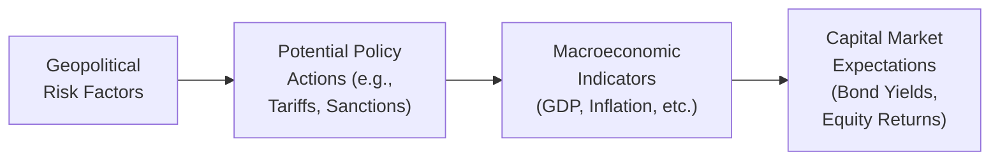

In today’s interconnected world, it’s almost impossible to make macroeconomic forecasts without factoring in the political landscape. If you think about it, a tiny policy tweak in one country—maybe a newly elected administration imposing tariffs—can ripple across supply chains and upend global trade in a matter of weeks. I remember back in 2018, when heightened trade tensions between the U.S. and China sent shockwaves through equity and commodity markets. The world suddenly felt a lot smaller.

Investors have gotten used to the idea that political decisions can affect the global investment climate just as much—if not more—than fundamental economic indicators. This section covers how to incorporate political risk into capital market expectations (CMEs). We’ll dig into all sorts of fun stuff: policy uncertainty, regional conflicts, regime changes, scenario analysis, stress testing, and even historical precedents. By the time you’re done reading, you’ll have a better understanding of how to spot the early signs of a potential flashpoint, assess its potential impact, and adapt your forecasts accordingly.

## Why Geopolitical and Political Risk Matters

Years ago, many analysts might have relegated political risk to an afterthought—“the wildcard factor,” they’d say. Now, it’s a front-and-center concern. After all, a sudden sanction on commodities from a major exporter can instantly throw a wrench into supply and demand equations. When we talk about political risk, we’re dealing with more than the outcome of a single election. We’re considering the transformations in fiscal policies, trade policies, currency regimes, leadership structures, and even diplomatic ties. These changes can cascade into:

• Shifts in investor sentiment and capital flows.  
• Sudden currency volatility (fresh capital controls or surprise revaluations).  
• Altered commodity markets (think: sanctions on oil exports).  
• Trade disruptions (new tariffs or trade barriers).  
• Changes in sovereign credit risk and bond yields.

The challenge is to determine which of these risks matter most to your forecasts and how to work them in without missing the forest for the trees.

## Policy Uncertainty and Its Consequences

Policy uncertainty can be a huge headache; just look at how equity markets react to central bank announcements or how bond yields move when a government announces expansionary budgets. You might have heard the phrase “markets hate uncertainty,” and that’s precisely why political developments can have such an outsized impact on asset prices.

• Trade Policies: One day everything’s fine, and next day a new import tariff emerges. The resulting shift in relative prices can push producers to relocate factories, forcing large capital outlays and altering workforce needs.  
• Regulatory Changes: Maybe a new climate initiative or an industry-specific crackdown. It’s not always negative, though—some policy changes open up growth opportunities for certain sectors or industries.  
• Sanctions: Think of sanctions as a specialized form of policy intervention that can either block a country’s access to capital markets or disrupt foreign investment. For instance, if a major oil exporter faces sanctions, global energy supply might tighten, causing a spike in oil prices and stoking inflation in import-dependent countries.

The more uncertain the policy environment, the more investors will price in that risk. That often shows up as higher volatility or higher yield requirements—especially in emerging markets.

## Regional Conflicts and Wars

Regional conflicts can feel distant until they suddenly aren’t. Wars and military standoffs can disrupt trade routes (like shipping lanes) or hamper energy pipelines, sending shockwaves through commodity markets. One example is the way conflicts in the Middle East have historically influenced global oil prices—short disruptions can lead to supply shortages and price spikes. These events are tough to predict, but monitoring geopolitical hotspots, diplomatic relations, and historical alliances can help you anticipate areas of concern.

### Impact on Macroeconomic Indicators

• Commodity Prices: Conflict in regions rich in natural resources can push prices skyward. Volatile energy prices feed into inflation forecasts and impact consumer spending.  
• Currency Volatility: Countries directly involved might see their currencies depreciate, especially if the international community imposes capital restrictions.  
• Flight to Quality: During times of conflict, investors often flock to perceived safety, such as U.S. Treasuries or gold. This changes capital flows, influences bond yields, and perpetuates risk-off sentiment.

## Political Regime Changes

When a country undergoes a regime change—like a major election that ushers in a radically different government—markets can become jumpy. Investors fear that the new leadership might alter tax codes, nationalize industries, or adopt populist measures. Sometimes it’s just a shift in rhetoric or in the makeup of the central bank committee, but it’s enough to shake market confidence.

It’s useful to keep track of:

• Policy Continuity vs. Policy Shift: Does the new regime promise continuity? Or is it looking to overhaul everything from the constitution to the national deposit insurance scheme?  
• Market Reforms: Some regime changes are pro-market, potentially attracting FDI (foreign direct investment), while others might be more protectionist.  
• Independence of Central Bank: If a new regime compromises central bank independence, inflation expectations could shoot through the roof, changing interest rate forecasts.

I recall an election in a major emerging market years ago where the new government championed substantial welfare spending. Local bond yields soared as global investors anticipated large budget deficits and higher inflation. Meanwhile, local stocks jumped, expecting robust consumer-driven growth. These conflicting signals are typical in politically charged transitions.

## Country Risk Premium

Now to get a bit more quantitative. Whenever you factor in political or geopolitical risk, you’re likely to see an increase in the required return for holding that country’s assets, known as the “country risk premium.” Basically, it’s the extra yield that investors demand to compensate for the possibility of adverse political events. Even if the fundamentals of a country’s corporate sector are sound, if there’s an impending election with uncertain outcomes, yields might widen—and equity valuations might take a hit.

### Assessing Country Risk Premium

• Sovereign Spreads: Look at how a country’s sovereign bond yield compares with a reference country or risk-free benchmark (e.g., U.S. Treasuries).  
• Credit Default Swaps (CDS): The premium on the CDS offers insight into the perceived probability of default or restructuring.  
• Political Stability Indicators: Agencies and think tanks (like the Eurasia Group, rating agencies, or the World Bank) produce political risk indices. These can be integrated into quantitative models to fine-tune your cost of equity or bond yield assumptions.

Keep in mind that country risk premiums can vary dramatically over time. If a coup attempt fails or a sanction is lifted, risk perceptions could revert quickly.

## Scenario Analysis and Stress Testing

By now, you might be thinking: “This is a lot to keep track of. How do we systematically incorporate big changes or potential shocks into forecasting models?” Welcome to scenario analysis and stress testing. Both are must-haves for any robust capital market expectation framework:

### Scenario Analysis

Scenario analysis involves constructing multiple plausible futures. For example, you might have a “balanced policy” scenario, a “hardline policy” scenario, and an “escalation scenario” for a key geopolitical tension. For each scenario, you’ll estimate how GDP, inflation, interest rates, and currency rates could respond. Then you might translate those macro variables into expected returns for different asset classes. In a typical approach:

1. Identify Key Political Variables: You might focus on a trade war scenario or a new wave of regulations.  
2. Model Economic Outcomes: Consider how these changes affect consumer sentiment, growth, inflation, and monetary policy.  
3. Convert to Asset Class Signals: If growth is stifled, you might lower your equity return estimates. If inflation surges, you might project higher short-term rates (unless the central bank is constrained by politics).  
4. Assign Probabilities: Estimate the likelihood of each scenario. Then take a weighted average of your outcomes to form your baseline forecast.

### Stress Testing

Stress testing is like scenario analysis on steroids. Instead of plausible scenarios, you test extreme events. Imagine imposing severe capital controls, or a worst-case conflict scenario that closes crucial shipping lanes. Stress tests help you see how your portfolio would cope under severe but possible market conditions.

• Portfolio-Level Analysis: Evaluate the effect on each asset class’ returns and correlations.  
• Systemic Impact: Some events can link multiple markets in unexpected ways. For instance, conflict in an oil-producing region might not only spike oil prices but also trigger inflationary pressure globally.  
• Liquidity Concerns: Stress testing helps reveal potential liquidity crunches—or moments when you can’t exit small local markets due to a flight of foreign capital.

## Historical Precedents

Historians love to say, “History doesn’t repeat itself, but it often rhymes,” and that’s definitely true in finance. Studying earlier episodes of geopolitical turmoil—a big war, a regime change, or an embargo—lets you see how different markets reacted. This helps you understand whether an asset typically overshoots to the downside, how quickly prices usually recover, or how quickly policies reverse course when the dust settles.

• Data from Past Events: Look at the magnitude of currency devaluations, the speed of capital outflows, or how sovereign yields jumped.  
• Parallel Cases: It might not be the same country, but a similar event in a region with comparable economic structure.  
• Adjustments for Current Context: Social media and digital banking may accelerate capital flows in ways that earlier generations of crises never experienced.

## Building Political Risk into Macroeconomic Models

Forecasting capital markets without political inputs can offer an incomplete picture, particularly for emerging or frontier markets. But how does one do it practically?

1. **Incorporate Risk Indices**  
   Many organizations publish risk indices that you can feed into an econometric model. If the index worsens, your model automatically adjusts GDP or inflation forecasts.

2. **Subjective Adjustments**  
   Let’s be honest, sometimes we rely on expert judgment. You might take a baseline forecast from a standard macro model (like the one you’d see in “1.5 Major Approaches to Economic Forecasting”) and then adjust certain inputs for a risk premium.

3. **Modeling Uncertainty Ranges**  
   If a certain election is high-stakes, you might expand the forecast range for variables like interest rates or exchange rates. Then you communicate these ranges clearly to clients or stakeholders.

4. **Regular Reassessment**  
   Stay nimble. As soon as you get new information—like a poll result indicating a surprising candidate surge—update your risk assumptions. The political environment can shift quickly.

## Practical Example: Trade Policy Shock

Imagine you’re forecasting equity returns for an export-heavy sector in Country A. Suddenly, the newly elected government in Country B threatens a 25% tariff on imports from Country A:

• Macro Impact: Reduced exports, potential slowdown in GDP growth.  
• Equity Market Impact: Lower earnings growth, potential slump in equity valuations.  
• Possible Countermeasures: Country A might retaliate, or look for new trade partners, so the original shock might get watered down over time.  
• Scenario Analysis:  
  - Best Case: The tariff negotiation fails, and no real tariff arises.  
  - Base Case: A small tariff is introduced, and the currency adjusts partially, cushioning the blow to exporters.  
  - Worst Case: A full trade war escalates, GDP slumps, and equities plunge further.

## Using a Visualization to Understand Political Risk Flows

Below is a Mermaid diagram illustrating how political risk factors can flow into macroeconomic indicators, then carry over into capital market expectations.

In this diagram:  
• Box A (“Geopolitical Risk Factors”) represents the initial event—say, rising tensions in a trade dispute.  
• Box B (“Potential Policy Actions”) shows how those tensions might translate into real policy moves—tariffs, new regulations, or sanctions.  
• Box C (“Macroeconomic Indicators”) captures the downstream economic impact (weaker GDP, higher inflation, etc.).  
• Box D (“Capital Market Expectations”) finally reflects how that shift in macro variables influences your expected returns, country risk premiums, or credit spreads.

## Best Practices

1. **Stay Informed**  
   Subscribe to political risk advisories, consult local experts, and read up on relevant press.  

2. **Maintain Diversity in Perspectives**  
   Geopolitical analysis can be subjective. Working with a diverse team or referencing multiple analytics providers can reduce confirmation bias.  

3. **Update Models Frequently**  
   In times of heightened risk, monthly or even weekly model updates might be necessary.  

4. **Communicate Uncertainty**  
   Forecasting political risk is inherently uncertain. Present your forecasts with clarity about the assumptions and disclaimers about potential triggers for revision.  

5. **Integrate Early in the Process**  
   Don’t wait until your macro forecast is baked to add political sparkles. Build it into your framework from the start so that the model is truly robust.  

## Common Pitfalls

• **Over- or Under-Reaction**: Markets can exaggerate political events. Make sure your baseline remains grounded in economic fundamentals.  
• **Post-Event Rethinking**: Analysts sometimes wait too long to update. It’s better to adapt your forecast as soon as you get credible information—surprise elections or surprise policy announcements are an almost weekly occurrence in some parts of the world.  
• **Ignoring Soft Signs**: Sometimes it’s the smaller cues (like certain poll results or local political tensions) that snowball into bigger events. Pay attention to the undercurrents.  
• **One-Size-Fits-All**: Political risk isn’t uniform across countries. Tactics that work in advanced economies might fail in emerging or frontier markets (and vice versa).

## Glossary

• **Geopolitical Risk**: The risk arising from political events, conflicts, or changes in diplomatic relationships that have economic repercussions.  
• **Sanction**: Penalties imposed by one country on another—such as trade barriers, tariffs, restricted capital market access—usually for political reasons.  
• **Country Risk Premium**: An additional yield or return demanded by investors to compensate for a country’s economic, political, and regulatory uncertainties.  
• **Regime Change**: A fundamental change in a country’s political leadership or system of governance (e.g., a complete overhaul of government structures).  
• **Stress Testing**: Simulating adverse or extreme economic events to assess potential impacts on portfolios or balance sheets.

## Final Exam Tips

When you’re sitting for a Level III exam, keep in mind that political risk often shows up in essays (constructed responses) where you’ll need to justify your assumptions:

1. **Quantify Where Possible**: Factor in a country risk premium and show how you arrived at it.  
2. **Cite Scenarios**: The exam may ask you to evaluate multiple geopolitical outcomes. Provide well-structured scenario analyses.  
3. **Stay Organized**: If a question references a hypothetical trade war or new sanction, create a step-by-step flow of how that would affect inflation, growth, currency, and ultimately asset returns.  
4. **Link Back to Objectives**: The exam loves it when you tie your analysis to the investor’s risk and return objectives. If your client is sensitive to large drawdowns, highlight how you’d mitigate that with diversification or hedging.  

Remember, your ability to incorporate political risk thoroughly yet concisely can be the difference between a good and a great answer.

## References

• Eurasia Group’s Top Risks: https://www.eurasiagroup.net  
• Political Risk Insurance research by the World Bank’s MIGA: https://www.miga.org  

---

## Test Your Knowledge of Geopolitical and Political Risk



### When a country experiences sudden policy uncertainty, which of the following is the most immediate economic impact on capital markets?  
- [ ] Decreased currency volatility  
- [x] Increased bond yield spreads due to higher risk premium  
- [ ] Reduced commodity prices  
- [ ] Unaffected inflation forecast  

> **Explanation:** Policy uncertainty typically increases perceived risk. Fixed-income investors react by demanding higher yields, leading to widened spreads.

### Which of these scenarios best exemplifies a “regime change” in a political context?  
- [ ] A slight shift in tax policy  
- [ ] A central bank interest rate decision  
- [x] The overthrow of a long-standing political party, altering governance structure  
- [ ] Quarterly GDP data release  

> **Explanation:** A regime change involves a fundamental shift in governance, such as a dramatic change in leadership or the overall system, not just a small policy adjustment.

### In assessing a Country Risk Premium, which of the following indicators is generally the most direct measure of the market's perception of that country’s default risk?  
- [ ] Equity price-to-earnings (P/E) ratios  
- [ ] Currency forward contracts  
- [x] Credit Default Swap (CDS) spreads  
- [ ] Real estate cap rates  

> **Explanation:** A CDS spread reflects the cost of insuring against default, making it a direct measure of market-perceived default risk.

### If a significant regional conflict disrupts energy supply routes, which macroeconomic variables are most likely to change first?  
- [ ] Unemployment and consumer credit growth  
- [x] Commodity prices and inflation expectations  
- [ ] Corporate governance practices  
- [ ] Real exchange rate in unaffected countries  

> **Explanation:** Disruptions to energy supply often lead to immediate changes in commodity prices (like oil), which feed quickly into inflation.

### In a geopolitical scenario analysis, what is the best approach to reflect a high-risk outcome in your forecast?  
- [ ] Ignore the outcome if it’s relatively unlikely  
- [ ] Use static, single-point estimates for all variables  
- [x] Assign a probability to the high-risk scenario and adjust macroeconomic variables accordingly  
- [ ] Only consider a high-risk outcome if the country’s central bank warns about it  

> **Explanation:** Scenario analysis requires assigning probabilities to each plausible outcome and adjusting forecasts accordingly. This approach captures the range of potential events.

### Which of the following best describes stress testing in the context of political risk?  
- [ ] Using a baseline forecast of GDP to project equity returns  
- [ ] Modeling only optimistic scenarios for new trade agreements  
- [x] Simulating extreme or adverse events (e.g., a severe conflict) to evaluate potential impacts  
- [ ] Calculating a single probability for all political scenarios  

> **Explanation:** Stress testing evaluates extremely adverse conditions, which helps a risk manager see how severe shocks could affect the portfolio.

### How does a “Flight to Quality” typically manifest in bond markets when geopolitical tensions rise sharply?  
- [x] Investors move into safer assets, driving down yields for high-rated bonds  
- [ ] Investors sell all government bonds and buy equities  
- [ ] Emerging market bond yields drop significantly  
- [ ] Investors increase leverage to arbitrage volatile markets  

> **Explanation:** Heightened geopolitical tensions usually push investors towards safe-haven assets like top-rated government bonds, decreasing their yields.

### After a contentious election, a new government plans to nationalize several key industries. Which immediate effect might you include in your macroeconomic forecast?  
- [x] Decreased foreign direct investment (FDI)  
- [ ] Lower risk premiums  
- [ ] Stable currency hedging costs  
- [ ] Increase in private sector independence  

> **Explanation:** Nationalization signals higher political risk and policy uncertainty, making the country less attractive for FDI.

### When analyzing historical precedents of geopolitical turmoil, which factor is most crucial for an accurate comparison to current events?  
- [ ] The exact timeline of events from 50 years ago  
- [ ] The frequency of central bank statements  
- [ ] The political affiliation of the actors involved  
- [x] Adjusting for modern global market structures and communication speeds  

> **Explanation:** Lessons from past conflicts or crises should be contextualized to today’s faster-moving markets and different macroeconomic conditions.

### True or False: Incorporating political risk into macroeconomic forecasts can be done entirely via quantitative models without any expert judgment.  
- [x] True  
- [ ] False  

> **Explanation:** While expert judgment is invaluable, quantitative models can integrate risk indices (such as from rating agencies or political research firms) to systematically adjust forecasts. In practice, both methods are often combined.


