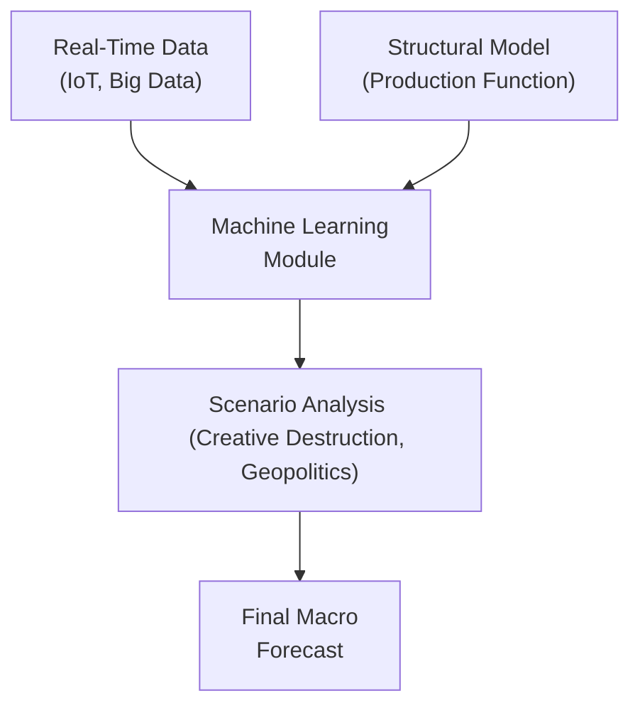

## Introduction and Context

I remember chatting with a friend who manages a small manufacturing company. She told me, over coffee, how automation and AI started revolutionizing their business processes almost overnight. The results? Their production costs dropped, efficiency skyrocketed, and she found it easier to forecast their quarterly output—at least in theory. But then new competitors entered the market, offering entirely different products, and just like that, the entire landscape changed again. That’s the tricky dance of technology in macroeconomics.

Here, we're diving into how technological disruptions can shake up production, employment, inflation, and all those macro indicators we watch closely. Technology has this uncanny ability to introduce new ways of doing things—sometimes better, sometimes just different—often flipping traditional assumptions on their heads. So, while technology can bring an exciting edge to economic growth, it can complicate forecasting models as well.

## Understanding the Influence of Technology on Economic Growth

Let’s start with the basics. In most macroeconomic models, when we talk about long-term economic output, we often use an aggregate production function such as:


Y_t = A_t \cdot F(K_t, L_t),


where:
• \\(Y_t\\) = total output at time \\(t\\),  
• \\(K_t\\) = capital stock at time \\(t\\),  
• \\(L_t\\) = labor at time \\(t\\),  
• \\(A_t\\) = total factor productivity (TFP) at time \\(t\\).  

We usually lump “technology” and “innovation” into \\(A_t\\), that productivity factor. The more advanced your technology, the more output an economy can squeeze out of the same quantity of labor and capital. But technology doesn’t remain static. It’s like quicksand beneath our forecasting models—always shifting.

## Automation and AI: Catalysts for Growth and Uncertainty

Automation and AI come up pretty often whenever we talk about the “future of work.” In fact, many are quick to equate them with job losses—“Robots stealing human jobs.” But there's also the potential for creating brand-new industries that didn’t exist before. It’s a balancing act.

### Productivity Gains and Cost Reductions  
Automation can lower the cost of producing goods by reducing labor overhead, decreasing error rates, and accelerating production speed. AI algorithms can optimize logistics or supply chains, detect fraud, and even forecast product demand more accurately—all of which feed into higher productivity. When productivity gains are large enough, you’ll often see a surge in overall economic growth.

### Challenges for Labor Markets  
There’s usually some friction. People displaced from certain jobs might not immediately have the skills for emerging AI-driven roles, creating pockets of unemployment and wage inequality. When you forecast consumption or inflation in this context, you need to consider how job displacements affect household incomes and demand for various goods.

### Example: Retail Shift to E-Commerce  
Let’s say an online retailer invests in AI-driven warehouse sorting. This might reduce the labor required for manual package sorting, pushing down costs—and sometimes prices—for end consumers. At the same time, new sectors like advanced logistics software or drone delivery spring up, potentially offering new employment opportunities. In your macro forecast, you factor in the net effect of both displacement and creation of jobs, as well as changes in consumer spending patterns that may arise from cost savings.

## Creative Destruction: The Upside and Downside of New Innovations

In economics, “creative destruction” is a fancy way of saying that new technologies can replace entire businesses or industries. The classic example is how smartphones crushed the market for standalone cameras and MP3 players. This can happen quickly—and it can wreak havoc on anyone trying to do multi-year forecasts based on old data.

• New technology might appear unexpectedly (think self-driving cars).  
• The old industries that rely heavily on manual driving, from taxi services to car insurance, might see a decline.  
• The new technology spawns complementary sectors—charging stations, advanced sensor companies, new software ecosystems, and so on.

### Impact on Employment Patterns  
Job losses in traditional industries could be substantial, while new jobs in cutting-edge sectors might demand specialized skills. This dynamic can shift the wage structure across the economy, influencing overall consumption and even tax revenue. As a result, macro forecasters must track which sectors are losing or gaining ground to get a handle on labor market dynamics over time.

### Modeling Non-Linear Change  
Forecasting creative destruction is tricky because it can accelerate or decelerate with little warning. Traditional linear regression models—those that rely heavily on historical data—might underestimate the possibility of abrupt disruptions. So, you may need more flexible forecasting frameworks, like scenario analysis or Monte Carlo simulations, to handle out-of-sample shocks.

## Network Effects and the Power of Digital Platforms

One of the hallmark features of modern technological platforms (think social media, ride-hailing apps, and e-commerce marketplaces) is the “network effect.” Essentially, the more users or participants a platform has, the more valuable it becomes to other users. This can create exponential growth that defies typical linear assumptions in economic analysis.

### Rapid Growth and Monopolistic Tendencies  
These platforms can expand quickly, dominating entire market segments. Monopolistic or oligopolistic structures can emerge, which affects competition levels and might require regulatory intervention. For instance, if a single platform cornered an entire market, it could have enough power to set prices, wages, and even shape consumer behavior.

### Forecasting Challenges for Macro Analysts  
When a platform is in hypergrowth mode, historical data might not do you much good. You may see insane growth rates that typical interpolation would never have predicted. Think about how quickly rideshare companies transformed urban transport. Incorporating non-linear growth assumptions becomes critical in macro models.

### Visualizing Network Effects

Below is a simplistic diagram illustrating how a growing user base can feed into accelerated growth, which in turn loops back to further platform value.

In a standard linear model, you might expect small, steady incremental growth. But network effects create feedback loops that accelerate expansion and adoption, often catching classical models off-guard.

## The Tug-of-War on Inflation

Technological progress can push prices down by making production more efficient—imagine manufacturing a new phone with fewer labor hours and less wasted material. On the other hand, brand-new technologies can create entire categories of consumer products and services that spark new bursts of demand.

• **Deflationary Pressures**: Automation, AI, and robotics can reduce marginal costs. Companies pass some of these savings to consumers in the form of lower prices.  
• **Inflationary Drivers**: Expanding consumer demand for next-gen gadgets, digital services, or advanced health tech can drive up aggregate demand in certain sectors, placing upward pressure on prices.

When you’re building, say, a multi-year inflation forecast, you might have to weigh out both forces. If the deflationary pressure wins out, your model might lean toward subdued inflation. If the new product categories generate robust demand (think the excitement around electric vehicles or smart homes), inflation in those segments might be significant enough to tilt the overall inflation measure upward.

## The Data Revolution: Real-Time Insights and Challenges

Anytime I think about the data revolution, I recall a conversation with a colleague who’s an economist at a tech startup. He told me they track user data in milliseconds, analyzing clicks, swipes, even dwell time. That’s unbelievably granular compared to the monthly or quarterly data macro forecasters often rely on. But more data doesn’t necessarily mean less complexity.

### IoT and Big Data  
The “Internet of Things” (IoT) means sensors are everywhere—on machines, in our cars, in our phones. This data can be aggregated to gauge real-time economic activity, from shipping container movements to the pace of online sales. Economists incorporating real-time data might get an edge in detecting turning points or shifts in consumer preferences earlier than those waiting for official government statistics.

### Requires Advanced Analytical Tools  
Of course, big data also calls for big analytical capabilities. Text analytics, machine learning, and advanced algorithms are becoming cornerstones in modern forecasting. You won’t just be plugging in last month’s data into a 30-year linear regression. You’ll be dealing with unstructured data sets requiring significant cleaning, computational power, and specialized skill sets.

### Potential Pitfalls  
While these data sets are treasure troves, they can also lead to overfitting if not used carefully. Overfitting is when your model picks up noise or spurious correlations instead of meaningful signals. Moreover, privacy concerns and biased data could hamper the reliability of your forecasts.

## Spillover Effects in a Hyperconnected World

A noteworthy dimension of technology-driven growth is how quickly it crosses borders. Emails, social media, cloud computing...these can transcend national boundaries in microseconds, facilitating the diffusion of new ideas and processes globally.

### Example: 5G and Mobile Innovation  
5G connectivity started out in a handful of countries, but it spread relatively quickly. This is a prime example of how a leap in telecommunication tech can transform everything from e-commerce in Africa, to remote health diagnostics in Asia, to self-driving cars in North America. As you forecast global economic growth, you might see spillover gains tick upward in countries adopting these technologies.

### International Policy and Collaboration  
Technological spillovers aren’t always frictionless. There might be intellectual property rights issues, trade barriers, or political tensions. If a country restricts tech exports or imposes sanctions, global supply chains can seize up. Forecasters have to keep a close eye on policy changes that could either foster or hinder the international flow of new technologies.

## Integrating Technological Shifts into Macroeconomic Forecasting Models

So, how do we channel all this information—automation, creative destruction, network effects, inflation tug-of-war, big data, and spillovers—into a coherent forecasting framework? The short answer: you do it carefully and stay flexible.

### Scenario Analysis and Stress Testing  
Rather than solely relying on one base-case model, many analysts use scenario analysis. You might outline a “rapid tech adoption” scenario and a “slow tech adoption” scenario, then gauge how each version reverberates across labor markets, GDP growth, and inflation. Stress testing can highlight vulnerabilities, especially in industries on the cusp of transformation.

### Incorporating Non-Linear and Real-Time Indicators  
Linear models can be replaced or supplemented with machine learning approaches that can capture non-linearities. Additionally, real-time data feeds (e.g., high-frequency shipping data, real-time retail sales metrics) can help refine near-term forecasts. Combining macro indicators with these more granular signals can provide a cohesive, timely forecast.

### Structural Approach vs. Reduced-Form  
A structural approach tries to model the underlying relationships—how new technology influences production, wages, and investment. A reduced-form approach might treat certain indicators just as correlated signals without fully explaining the mechanism. Proper forecasting often merges both: you keep the theoretical frameworks that help you infer causal links, but remain open to purely data-driven insights that may fill in knowledge gaps.

Below is a simplified diagram showing a possible integrated forecasting approach:

By blending real-time data, structural theory, machine learning, and scenario-based stress testing, practitioners can tackle the complexities of tech-driven disruptions more effectively.

## Best Practices and Common Pitfalls

• **Stay Curious**: Technology moves quickly, so keep an open mind and watch for new trends.  
• **Validate Data Quality**: Make sure your advanced data sets aren’t garbage in disguise.  
• **Regularly Update Models**: Old parameter estimates can quickly become obsolete.  
• **Look for Policy Clues**: Government policy on taxation, regulation, and R&D subsidies can massively amplify or slow down adoption of new tech.  
• **Watch Out for Herding**: Over-enthusiasm around popular technologies can lead to bubble-like behavior (think the dot-com era), which can distort forecasts.

## Concluding Thoughts and Exam Tips

Now, if you’re preparing for the CFA Level III exam, one big piece of advice is: expect the unexpected. A typical exam question might describe a scenario where a country experiences a surge in AI adoption. You could be asked to evaluate the possible impacts on employment, capital investment, inflation, and trade balances. Or you might see a question in the context of scenario analysis for portfolio positioning. So keep these angles in mind:

• **Cross-Asset Implications**: Automation might hit certain equity sectors harder while boosting others.  
• **Policy Shifts**: Monetary or fiscal policy might respond differently to tech-induced unemployment or deflationary episodes.  
• **Global Linkages**: The exam might test your understanding of how technology spillovers can speed up or slow down growth across multiple economies—pulling in exchange rate considerations.  
• **Time Horizon**: Distinguish between short-term cyclical changes (like immediate job displacement) versus long-term structural changes (like the emergence of entirely new industries).  
• **Risk Factors**: Technology can create tail risks or new forms of correlation across asset classes.

Finally, practice applying theoretical frameworks to real-world narratives. The exam often asks “wizard-behind-the-curtain” questions where they want you to demonstrate you can bring frameworks, data, and logic together—especially under conditions of uncertainty and incomplete information.

## Glossary

• Automation: The use of machinery or technology to perform tasks with minimal human intervention.  
• Artificial Intelligence (AI): Computer systems able to perform tasks that typically require human intelligence, such as visual perception or decision-making.  
• Creative Destruction: The process by which new innovations lead to the demise of older technologies and economic structures.  
• Network Effects: When the value of a product or service increases as more people use it.  
• Deflationary Pressure: Downward pressure on prices due to improved efficiencies or reduced costs.

## References

• Brynjolfsson, E. & McAfee, A., The Second Machine Age.  
• World Economic Forum, Fourth Industrial Revolution reports:  
  – https://www.weforum.org  

• Additional Reading/Resources:  
  – International Monetary Fund. (2022). World Economic Outlook: Countering the Cost-of-Living Crisis.  
  – OECD. (2023). The Digital Transformation: Shaping Policies, Improving Lives.  

---

## Test Your Knowledge: Technological Disruptions in Macroeconomic Forecasting



### Technological advancements such as automation and AI primarily affect which component of the standard production function?

- [ ] Labor (L)
- [ ] Capital (K)
- [x] Total Factor Productivity (A)
- [ ] Depreciation Rate

> **Explanation:** Automation and AI mainly boost the productivity factor, often captured as “A,” the total factor productivity component in macroeconomic models.

### In a scenario of creative destruction, how do most standard linear forecasting models tend to respond?

- [ ] Accurately capture the new industrial dynamics.
- [x] Underestimate the pace of sectoral shifts.
- [ ] Overestimate long-term economic stability.
- [ ] Become more accurate with each passing year.

> **Explanation:** Traditional linear models typically rely on historical relationships and may fail to anticipate sudden, non-linear disruptions caused by creative destruction.

### Which of the following is an example of network effects?

- [x] A social media platform becomes more valuable as more users join.
- [ ] A company offering seasonal discounts to boost sales.
- [ ] A grocery chain expanding its product line to attract new customers.
- [ ] A tech firm licensing its patents to a competitor.

> **Explanation:** Network effects refer to the increased value of a product or service as its user base grows, which is typical for digital platforms and social media networks.

### What kind of pressure might increased automation and improved production efficiency place on prices over time?

- [ ] Hyperinflationary pressure
- [ ] Stagflationary pressure
- [ ] No effect on prices
- [x] Deflationary pressure

> **Explanation:** When production becomes more efficient and costs fall, the result can be downward pressure on final goods and services prices.

### Which of the following can help analysts better capture non-linear growth from network effects?

- [x] Machine learning or other flexible modeling methods
- [ ] Only basic trend extrapolation
- [x] Scenario analysis or Monte Carlo simulations
- [ ] Ignoring all historical data

> **Explanation:** Flexible modeling techniques like machine learning, coupled with scenario analysis, better capture rapid shifts and nonlinear feedback loops than simple linear trend extrapolation.

### When adopting real-time data analytics (e.g., from IoT devices) into macroeconomic forecasts, what is the key challenge?

- [x] Ensuring data quality and avoiding overfitting
- [ ] Eliminating all lags in reporting
- [ ] Removing the need for official government statistics
- [ ] Bypassing seasonality effects altogether

> **Explanation:** While real-time data can be powerful, forecasting models risk overfitting noise or biased data, making data validation and robust model-building essential.

### Why is monitoring policy changes important in the context of technological disruptions?

- [x] Policies can amplify or slow down technology adoption
- [ ] Policies have no impact on technology adoption
- [x] Policies determine the existence of all growth opportunities
- [ ] Policies are irrelevant for macroeconomic forecasting

> **Explanation:** Government interventions—like R&D subsidies, regulatory restrictions, or global trade agreements—can significantly accelerate or hinder the spread of new technologies, reshaping economic outcomes.

### What is a common pitfall when forecasting the impact of automation on employment?

- [ ] Overestimating the creation of new jobs
- [x] Underestimating both job displacement and job creation
- [ ] Ignoring the role of wage adjustments
- [ ] Believing unemployment will always drop

> **Explanation:** Forecasts often struggle to capture the full balance between lost jobs in old industries and newly created jobs in emerging sectors, leading to incomplete or misleading conclusions.

### How are “spillover effects” best described in the context of technological breakthroughs?

- [x] The diffusion of innovations across borders or industries
- [ ] The collapse of existing infrastructure
- [ ] Price inflation in domestic markets only
- [ ] Reduced transaction costs for domestic businesses only

> **Explanation:** Spillover effects refer to how new technologies or processes spread—often rapidly—across geographical and sectoral boundaries, influencing growth prospects in multiple economies or industries.

### Macro forecasts that ignore the network effect and creative destruction are likely to be:

- [x] Incomplete
- [ ] Perfect
- [ ] Overly conservative
- [ ] Entirely useless

> **Explanation:** While they might still offer some directional insight, excluding the potentially transformative and nonlinear influences of network effects and new technologies can render forecasts incomplete and less predictive.


