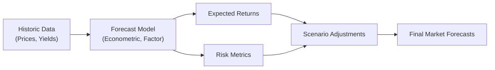

## Understanding the Difficulties of Forecasting

Let’s be real: developing capital market forecasts can feel a bit like trying to read tea leaves in the investment world. You gather your data, carefully select a model, and then—just when you’re feeling confident—something happens (like a sudden policy change or extreme market volatility) that flips your projections upside down. This phenomenon isn’t unusual. Markets are complex ecosystems driven by economics, politics, psychology, and global events. When it comes to building robust forecasts, it’s often less about predicting precisely and more about appreciating the wide margins of error you’re likely to encounter.

Below, we dive into some of the biggest challenges in developing these forecasts. We cover everything from the pitfalls of using only historical information to the dreaded “overfitting” in quantitative models. We’ll touch on practical solutions and highlight insights that will help you stay calm even when the market does something unexpected—like it inevitably does.

## Incomplete Information and Model Limitations

One of the very first hurdles in forecasting is the fact that no model perfectly captures every nuance of the real world. Sure, we have some pretty phenomenal econometric and machine learning tools, but even those rely on assumptions that might not always hold.

It helped me to think about the time I tried to build a simple regression model as a side project aimed at predicting next-month equity returns. I was so proud of my R-squared values initially—until a set of unexpected macro data revisions completely ruined my forecast. That moment was a wake-up call: while it’s tempting to trust impressive statistics, we must remain aware of a fundamental truth: markets live in a nonlinear, interconnected world.

A few common areas where these limitations materialize:

• Linear Assumptions in a Nonlinear Reality. Many models impose linear relationships, but the real market world is often nonlinear. When markets panic, for instance, correlations across assets spike in unexpected ways.  
• Behavioral Biases. Forecasts may be skewed by optimism bias when you “really want” a certain outcome. Maybe you’re expecting the economy to rebound because that’s what you’re rooting for. These emotions sneak in and distort even the most “objective” analyses.  
• Overlooking Second-Order Effects. An event—say, a central bank’s rate hike—can have ripple effects on consumer spending, corporate margins, and foreign exchange rates. Models that capture only direct impacts will miss how these effects accumulate or interact.  

## Structural Breaks and Regime Shifts

Another problem is the world doesn’t stand still. Models that assume stable relationships over time can be thrown far off course by regime shifts. A regime shift, by definition, is a fundamental change in the underlying economic or market environment—like moving from a low-interest-rate era to a rapid rate-hike cycle.

Imagine relying on historical bond yield data measured during a prolonged period of easy monetary policy. Now if the central bank abruptly decides to hike interest rates over a short span, your entire historical time series might lose much of its predictive power. This is often labeled a structural break. Such breaks imply that past relationships (like how bond returns respond to short-term rates) can flip drastically.

### Spotting and Managing Regime Shifts

• Statistical Tests: Sophisticated tests (e.g., Chow tests) can help detect structural breaks, but these can still miss truly abrupt changes.  
• Multi-Regime Models: Some practitioners use models that explicitly separate data into different states—like expansions vs. recessions, low-volatility vs. high-volatility periods.  
• Continuous Monitoring: Monthly or quarterly reviews of model performance keep you alert to early signs of drift or potential breaks.

## Black Swan Events

Every investor has heard the story of how a so-called Black Swan Event stomps all over market consensus. These events are rare, highly unpredictable, and potentially cataclysmic. Think of what happened in 2008—subprime mortgages and overloaded financial institutions triggered an unprecedented spiral. Or consider the pandemic in 2020, which abruptly froze entire sectors of the economy.

Black Swan Events are the bane of forecasters because no data can reliably capture what’s never happened before—at least not at that scale. The best we can do is acknowledge their possibility and incorporate scenario analyses. Stress tests can at least provoke us to ask: “What if everything falls apart?” Even if we can’t precisely predict the timing or shape of a Black Swan, we can brace ourselves for the consequences.

## Overfitting to Historical Noise

We often celebrate advanced quantitative models, but there’s a big catch: the risk of overfitting. Overfitting happens when a model learns all the little idiosyncrasies or “quirks” in a historical dataset—so it performs spectacularly on that historical dataset but then stumbles once applied to new data. Think of it like memorizing the answers to last year’s exam instead of understanding the underlying concepts. You may guess the new test’s questions incorrectly.

To illustrate, let’s say your model picked up that “when the S&P 500 rose by more than 2% on Fridays, the following Monday had a strong chance of a positive momentum.” This might have held true in your backtest for the past three years, but it might be nothing more than an accidental pattern or random correlation.

### Simple Safeguards

• Cross-Validation: Splitting your data into training and testing samples helps check if the model generalizes.  
• Parsimony: Keep your model simpler. Sometimes a handful of robust factors beat a labyrinth of intricate relationships.  
• Economic Rationale: Ensure that each included factor has a plausible economic or financial explanation. Random relationships might turn up in data-mining exercises, but they rarely hold under real-world conditions.

## Data Limitations and Survivorship Bias

Forecasting relies heavily on timely and accurate data, but data can be messy or incomplete:

• Limited History: If you’re analyzing emerging market assets, data might only go back a few years, making it harder to glean stable patterns (and more prone to large sampling error).  
• Survivorship Bias: Performance records often include only surviving funds or companies, ignoring those that went out of business. This inflates historical returns and can lead you astray when projecting forward.  
• Inconsistent Reporting: Different markets or time periods might use different reporting standards. Even subtle differences can introduce errors when you’re trying to calibrate a global forecast.

It’s a bit like trying to judge a restaurant by only reading the good reviews posted online. If a large chunk of negative reviews get deleted, you might think you’ve found the perfect restaurant—until you arrive and realize the service is slow, the food cold, and the bill anything but cheap.

## Reactivity to Short-Term Market Sentiment

Forecast models might also end up chasing the latest market mania or panic—a phenomenon often described as procyclical behavior. When we panic at temporary volatility, we’re more likely to overweight recent market action in our forecasts.

Picture the scenario: the market experiences a tech meltdown. In the next iteration of your equity models, you see parameters that drastically penalize or discount technology stocks. But if that meltdown was just a temporary bubble burst, you risk missing the next big technology rebound. So it’s wise to understand cyclical vs. structural changes as you incorporate market sentiment into forecasts.

## Balancing Quantitative Models with Judgmental Adjustments

Market forecasting is never purely mechanical. Even the most data-oriented shops typically add an overlay of subjective judgment. And that’s okay; in fact, it’s often critical. There are always factors that a purely statistical model can’t capture—regulatory changes that haven’t been fully legislated yet, the possibility of political upheaval, or intangible consumer trends. So, quantitative forecasting provides a useful starting point, but it shouldn’t close the book.

Yet, a caution: subjective adjustments can be twisted by biases—as described in the realm of behavioral finance. It’s easy to rationalize why “this time is different” or allow recent personal experiences to overshadow objective facts.

Key best practices for a balanced approach:

• Document Your Rationale: Keep a record of why you made the adjustment. Was it due to a structural break, new data, or an unmodeled risk?  
• Use a Committee: If multiple experts weigh in on each adjustment, you’ll mitigate the risk of any one person’s bias.  
• Reassess Regularly: Revisit past judgments to see if they helped or hurt. This fosters more objective learning over time.

## Diagram: Data Flow and Adjustments

Below is a simple Mermaid diagram that illustrates how raw data feeds into a forecasting model, which then combines it with risk metrics and scenario analysis before culminating in final capital market expectations.

## Practical Example: Forecasting a Multi-Asset Portfolio

Let’s take a quick imaginary case study. Imagine you’re managing a global multi-asset portfolio. You want to estimate the expected returns for major asset classes like U.S. equities, developed market bonds, emerging market equities, and real estate. You use a factor-based model that includes GDP growth, corporate earnings growth, and inflation expectations for each region.

When you run the model historically, it hums along nicely—until there’s a sudden commodity shock that inflates energy prices. Your model might never have dealt with such a strong supply shock in its historical sample. You try to tweak the input for inflation to see how it affects equity returns, and you find the model’s sensitivity to inflation is far larger than expected. Upon further investigation, you notice that your model includes data from a historically low-volatility environment, so it overstates the stability of the equity risk premium.

At this point, you might consider:

• Scenario analysis with higher-than-expected inflation.  
• Reviewing historical episodes of commodity supply shocks (even smaller ones) to glean possible patterns.  
• Making a judgmental adjustment to reduce your equity forecast, acknowledging new regime-like behavior.

## Best Practices to Address Challenges

• Diversify Methods. Don’t bet it all on one “perfect” model. Combine analyses (econometric, factor-based, fundamental valuations, or consensus surveys).  
• Document Assumptions. Clarity on how you got from raw data to final numbers is essential, especially if you discover a forecast was off by a mile down the line.  
• Monitor Leading Indicators. Keeping an eye on yield curves, credit spreads, and purchasing managers’ indices (PMIs) can alert you to potential regime shifts or turning points. (As discussed in more detail in 1.3 Assessing Exogenous Shocks and Their Impact on Economic Growth Trends.)  
• Incorporate Stress Tests. Don’t just rely on expected or base-case outcomes. Shock your model to see how your forecast stands up to big changes.  
• Limit Overfitting. Regularly retrain and test your model on new sets of data. If out-of-sample performance remains strong, you might have something reliable.  

## Common Pitfalls and Strategies to Overcome Them

Being aware of pitfalls is half the battle. Below are some typical mistakes forecasters make and quick strategies to avoid them:

Overconfidence  
• Pitfall: Underestimating the range of potential outcomes.  
• Mitigation: Present forecasts as a range or distribution, not a single point estimate.

Ignoring Qualitative Data  
• Pitfall: Missing out on crucial info about politics, social trends, or consumer behavior.  
• Mitigation: Combine both quantitative signals and expert interviews when finalizing your forecasts.

Forgetting Correlation Changes  
• Pitfall: Assuming asset correlations remain the same in all climates.  
• Mitigation: Incorporate dynamic or conditional correlation models, especially for tail-risk scenarios.

Failing to Revisit Inputs  
• Pitfall: Using stale data or letting the model run on autopilot.  
• Mitigation: Periodic updates—weekly, monthly, or quarterly—depending on the asset class.

## Tying This to the CFA Exam

During the CFA Level III exam, you may have to integrate these forecasting challenges into scenario-based questions: for example, a client with a large equity allocation might ask if they should switch to bonds in response to changing monetary policy. You’ll need to demonstrate an understanding of the complexities of your forecast models and highlight any limitations. Be prepared to show how you might incorporate stress tests or regime-shift analysis, and be ready to discuss your approach to balancing quantitative and judgment-based adjustments.

• Essay Tip: If the prompt asks about the reliability of your capital market forecast, always identify potential structural breaks or tail events. Use them to nuance your discussion.  
• Item Sets: Watch for data limitation traps. The question might point to a short data history or significant changes in data definitions—clues that challenge the forecast’s credibility.

## Glossary Integration

Black Swan Event  
A rare, unpredictable event with very severe consequences. Typical models fail to capture their enormity due to limited or irrelevant precedent.  

Regime Shift  
A fundamental change in how the market or economy behaves, often requiring new models or parameter recalibration.  

Overfitting  
When a model is tuned so precisely to historical data that it fails when confronted with new, real-world data.  

Survivorship Bias  
Data can be skewed if only surviving funds or companies are included. We miss the underperformers that disappeared.  

Procyclical Behavior  
Forecast adjustments that follow recent market trends too closely, increasing the risk of herding and volatility.  

Judgmental Adjustments  
Subjective tweaks applied after model outputs, incorporating real-world insights but also vulnerable to behavioral biases.

## Final Exam Tips

• Cite Uncertainty: In an exam setting, it’s often wise to mention forecast range and uncertainty.  
• Stress Testing in Essays: When writing essay responses, incorporate examples of stress tests or scenario analyses to address tail risks.  
• Time Management: If a question suggests an overreliance on past data, quickly bring up regime shifts or structural breaks.  
• Keep it Real: Summaries that highlight both the strengths and weaknesses of a forecasting model are more credible. Over-promising precision is often mistaken.

## References

• Baz, J., & Chacko, G. Financial Derivatives: Pricing, Applications, & Mathematics.  
• “Macro-Finance Forecasting,” Federal Reserve Bank of St. Louis (FRED), https://fred.stlouisfed.org  

## Test Your Knowledge: Capital Market Forecasting Challenges



### Which of the following best describes overfitting in a capital market forecasting context?

- [ ] The inclusion of economic variables that explicitly relate to current market conditions.  
- [x] Making a model so tailored to historical quirks that it fails in new environments.  
- [ ] Relying only on linear models to explain nonlinear phenomena.  
- [ ] Applying a model that includes risk-free rate but excludes any equity factors.  

> **Explanation:** Overfitting happens when a model picks up every random pattern from historical data, leading to poor predictive performance on new data.

### Which statement about black swan events is most accurate?

- [ ] They are events that occur frequently but have minor effects on markets.  
- [ ] They can be predicted using sophisticated linear models.  
- [x] They are rare and unpredictable events with extremely severe consequences.  
- [ ] They do not significantly affect capital market expectations.  

> **Explanation:** Black swan events are characterized by their rarity, unpredictability, and severe market impact, making them difficult to incorporate into typical predictive models.

### Which scenario is most likely to be an example of a regime shift?

- [x] Moving from a low-interest-rate environment to an economy with rapidly rising rates.  
- [ ] Retaining consistent policy stance over multiple economic cycles.  
- [ ] Introducing a new reporting format that does not affect economic variables.  
- [ ] Shutting down a non-systemic financial institution for compliance reasons.  

> **Explanation:** A regime shift involves fundamental changes in economic or market behavior, such as drastically different monetary policies.

### Procyclical behavior in forecasting means:

- [x] Adjusting forecasts based primarily on recent market momentum.  
- [ ] Implementing judgmental overrides to correct for biased models.  
- [ ] Using structural break analysis to anticipate regime changes.  
- [ ] Dismissing short-term signals and focusing on mean reversion.  

> **Explanation:** Procyclical behavior refers to the tendency to let recent strong or weak market trends drive optimistic or pessimistic forecasts, often amplifying volatility.

### What is the key risk of relying solely on historical data for forecasts?

- [ ] More accurate and unbiased expectations of future returns.  
- [ ] Guaranteed detection of black swan events.  
- [x] Missing the impact of fire-sales, structural changes, or data that does not capture new regimes.  
- [ ] Overly stable correlation estimates that guarantee reliable results.  

> **Explanation:** Only using historical data can overlook new structural factors, black swan events, and changes in market dynamics not observed in past data.

### Which action is most appropriate to mitigate overfitting?

- [x] Performing cross-validation and using out-of-sample testing.  
- [ ] Incorporating more random factors to capture market noise.  
- [ ] Ignoring changes in economic policies.  
- [ ] Keeping the training dataset as small as possible.  

> **Explanation:** Cross-validation and out-of-sample testing help ensure that a model’s success isn’t just due to peculiarities in the training data.

### Which statement about survivorship bias is correct?

- [ ] It suggests that all historical data is fully representative.  
- [ ] It reduces the estimated volatility in equity markets.  
- [x] It arises when failed entities are excluded, inflating historical returns.  
- [ ] It only applies when analyzing bond markets.  

> **Explanation:** Survivorship bias occurs when only surviving entities remain in the dataset, making average returns look better than they truly are.

### Why might judgmental adjustments be used in a forecasting model?

- [ ] To strictly conform with a quantitative model’s recommendations.  
- [x] To incorporate insights not captured by the model, such as politics or upcoming regulatory changes.  
- [ ] To eliminate the possibility of behavioral biases.  
- [ ] To remove all subjectivity from the process.  

> **Explanation:** Judgmental adjustments allow expert insights—like political winds or emerging risks—to refine or override purely quantitative outputs.

### How can stress testing be most valuable in forecasting?

- [x] By evaluating outcomes under extreme market scenarios or structural changes.  
- [ ] By showing that your model always remains accurate, regardless of conditions.  
- [ ] By limiting the incorporation of new data points.  
- [ ] By focusing only on favorable scenarios.  

> **Explanation:** Stress tests reveal how resilient forecasts are in the face of catastrophic market breakdowns or unexpected policy changes, enhancing risk management.

### True or False: Behavioral biases have no material impact on capital market forecasts.

- [x] True  
- [ ] False  

> **Explanation:** This is a trick question. It’s actually “False” in reality. Behavioral biases do affect forecasts significantly. Individuals often overreact to recent events or get anchored to specific viewpoints. However, if the statement is “Behavioral biases have no material impact,” that is incorrect. Thus the best choice here that it’s false that they have “no material impact.”  


