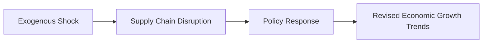

## Exogenous Shocks: Understanding the Unexpected

I distinctly remember the first time it really clicked for me that entire economies could be thrown off-course by a single unexpected event. It was, of all things, a supply chain hiccup in the technology sector—shipments for a critical component got stranded at a port because of sudden strikes. My colleagues and I were frantic: it wasn’t just our project that was stalled; entire industries dependent on those components faced cascading delays. That’s precisely the essence of an exogenous shock. It’s not something you see coming based on conventional business cycle analysis; rather, it’s an external jolt—like a pandemic, a war, or a massive natural disaster—that can promptly shift the ground beneath everyone’s feet.

An **Exogenous Shock** is an unexpected occurrence emanating from outside the economic system. Now, let’s consider how such shocks wreak havoc and, in turn, shape or reshape economic growth trends.

## The Macro-Picture: How Shocks Affect Economic Growth

Even in stable times, growth is nuanced. Economists rely on multiple data points—consumer sentiments, corporate earnings, labor force participation—to build a coherent growth forecast. Then something like a severe hurricane ravages a major manufacturing hub, or a global pandemic shuts down entire economies, and all bets are off. Suddenly, you’re looking at:

• Interruptions in the production and transport of goods.  
• Shifts in consumer behavior (e.g., panic buying, delayed spending).  
• Reallocation of fiscal budgets to emergency spending or stimulus.  
• Revised inflation forecasts due to supply shortfalls or demand collapses.  

These shocks fundamentally recalibrate the trajectory of gross domestic product (GDP) growth, sometimes for years. Swift policy moves can help mitigate immediate fallout, but the deeper the structural damage, the more lasting the consequences on real economic growth.

### A Simple Growth Model Perspective

One way to conceptualize the impact of exogenous shocks on long-term growth is via the basic components of potential output. In a stylized sense:


\text{Potential GDP Growth} = \text{Growth in Labor Force} + \text{Growth in Capital Stock} + \text{Growth in Total Factor Productivity} 


Shocks affect each term differently. A pandemic, for instance, can reduce labor force participation. A war might destroy infrastructure, reducing effective capital stock. Or a major technological shift spurred by a crisis might suddenly increase total factor productivity (TFP). The net impact on potential GDP can be significant, requiring forecasters to adjust their models promptly.

## Supply Chain Disruptions and Consumer Demand Shifts

### The Core Definition

A **Supply Chain Disruption** means processes that produce, distribute, and deliver goods or services are knocked off normal operation. This might happen when factories lose power in a natural disaster, or border closures stall international shipping lanes. The broad ripple effects can include:

• Scarcity of essential goods, driving up prices (inflationary pressures).  
• Production delays, shrinking corporate revenues.  
• Sudden changes in workforce requirements (e.g., layoffs in one sector, surge in another).  

### Tangible Example

In early 2020, some manufacturing firms heavily reliant on global inputs suddenly couldn’t source critical components from overseas. Unable to pivot quickly, they paused production lines, missed shipments, and in certain regions, unemployment ticked up. Government stimulus checks aimed to support demand, but with supply chains hobbled, the mismatch contributed to inflation. This dynamic underscores why we must keep an eye on both supply and demand when forecasting growth trends under exogenous shocks.

## The Value of Scenario Analysis

In these unforeseen circumstances, relying on a single “point forecast” is risky. That’s where **Scenario Analysis** comes in. By constructing multiple plausible future states—like best-case, base-case, and worst-case scenarios—asset allocators and policy advisors can gain a sense of how the economy and markets might respond.

| Scenario      | Key Assumptions            | Potential Outcome                           |
|---------------|----------------------------|---------------------------------------------|
| Best-Case     | Quick containment of shock; supply chains ramp up fast | Mild GDP slowdown; policy measures stabilize economy |
| Base-Case     | Partial containment; supply chain disruptions persist   | Moderate GDP decline; unemployment rises; inflation mixed |
| Worst-Case    | Ongoing disruptions; policy response lags              | Long-lasting recession; deep supply chain fractures |

By walking through such scenarios, portfolio managers and analysts can stress-test corporate earnings forecasts, credit conditions, and potential policy responses. This approach reduces the risk of being blindsided by developments that deviate from the “expected path.”

## Policy Responses That Matter

### Government and Central Bank Interventions

A **Policy Response** is the combination of government and central bank measures (e.g., stimulus checks, quantitative easing, infrastructure spending) designed to either inject liquidity into the economy or lower financing costs. In the wake of a shock, these interventions often aim to:

• Shore up consumer demand (via direct checks or unemployment benefits).  
• Stabilize credit markets through liquidity injections or interest rate cuts.  
• Provide fiscal support for afflicted industries (e.g., loan guarantees or bailouts).  

However, policy measures can also backfire. For instance, imposing tariffs during a crisis might exacerbate supply issues or spark retaliatory trade restrictions. Meanwhile, expansionary fiscal and monetary policies can stoke inflation if they outpace the economy’s productive capacity.

### Monitoring Government Expenditures

Once an exogenous shock hits, governments frequently alter budgets and strategic priorities. The effect on growth can be twofold:

1. Short-term Stimulative Effects: Infrastructure projects, relief funds, and improved social safety nets can help maintain consumer spending and business continuity.  
2. Long-term Debt Loads: Excessive borrowing to fund stimulus can lead to heightened interest bills later, constraining potential growth.

## Revising Capital Market Expectations (CMEs)

Capital market expectations rarely remain static, especially after a significant jolt to the system. Portfolio managers scramble to revise macro forecasts, reevaluate risk premiums, adjust asset allocation, or even place new hedges. Some typical modifications to CMEs might include:

• Revising equity market return estimates due to changed earnings outlook.  
• Adjusting corporate bond spread forecasts based on tighter or looser credit conditions.  
• Rethinking target allocations in specific regions, especially if the shock is geographically concentrated (e.g., a localized hurricane in a major manufacturing area).  
• Updating inflation expectations, which directly affect bond valuations and currency exchange rates.

Interestingly, these shifts in views can be self-fulfilling. If enough market participants believe that the worst is still ahead, asset prices may move sharply, effectively pulling forward the economic damage. Alternatively, timely policy announcements can inject optimism, quickly driving risk assets higher.

## Leading Indicators as Early Warning Signals

A **Leading Indicator** is an economic data series that often changes before the broader economy starts following a specific trend. When crises unfold, analysts are particularly mindful of:

• Purchasing Managers’ Index (PMI) data showing new orders or supply disruptions.  
• Initial unemployment claims reflecting labor market stress.  
• Consumer sentiment surveys capturing changes in spending intentions.  
• Credit spreads or interbank lending rates that can show stress in financial markets.

By tracking these forward-looking data points, asset managers can detect early signs of a worsening crisis or a nascent recovery. Often, pinpointing the inflection in leading indicators can guide portfolio rotation or rebalancing decisions—especially essential under high volatility conditions.

## A Chain Reaction Diagram

The complexity of exogenous shocks can be tough to visualize. The following Mermaid diagram illustrates the potential chain reaction once an unexpected external event triggers disruptions:

Each step can feed back into the prior one. For instance, a policy choice (say, a stimulus package) could either mitigate or worsen supply chain dislocations (depending on its design and execution), ultimately affecting the longer-run growth trajectory.

## Practical Examples and Case Studies

### War-Induced Shock

Consider a regional conflict that threatens global oil supplies. Energy prices spike, causing widespread cost-push inflation. Governments impose sanctions, effectively reducing trade flows. Industries reliant on petroleum-based inputs scale back production. Central banks may face a dilemma: raise rates to curb inflation or keep them low to aid growth amid the turmoil.

### Pandemic Shock

When a global pandemic struck in 2020, entire economies shuttered nearly overnight. Travel slowed drastically, manufacturing output collapsed, and large stimulus programs from governments worldwide sought to support unemployed workers and small businesses on the brink. The aftermath included supply chain strains (e.g., shipping container shortages), significant shifts in consumption patterns (more e-commerce, less travel), and inflationary pressures not seen in decades.

In both examples, **Scenario Analysis** proved invaluable. Forecasting firms offered multiple recovery timelines and shaped their asset allocation strategies accordingly—aggressive in a best-case scenario, defensive in a worst-case scenario.

## Pitfalls and Best Practices

### Pitfalls

• Over-Reliance on a Single Indicator: Locking onto just one KPI (e.g., GDP growth alone) can obscure underlying vulnerabilities.  
• Underestimating Policy Influence: Dismissing the magnitude of fiscal or monetary actions may lead to inaccurate forecasts.  
• Inadequate Time Horizons: Some shocks have immediate impacts; others might play out over months or years. Failing to account for different time horizons can cause suboptimal investment decisions.  

### Best Practices

• Consistent Scenario Planning: Develop, monitor, and regularly update best-case, base-case, and worst-case economic scenarios.  
• Diverse Data Surveillance: Keep track of multiple leading indicators—PMI, consumer confidence, credit spreads, and trade volumes—to get a robust view of economic shifts.  
• Policy Sensitivity Models: Incorporate assumptions about interest rate changes, government spending, and taxation into your macro forecasts.  
• Stress Tests and Dynamic Portfolio Adjustments: Use stress tests to see the impact of large swings in key variables on portfolio performance, and be ready to rebalance if necessary.

## Exam Tips: Handling Exogenous Shocks in Essays and Item Sets

When faced with an exam question about exogenous shocks, especially in a constructed-response (essay) section, consider these strategies:

• Clearly identify the nature of the shock. Is it supply-based (hurricane) or demand-based (sudden decrease in consumer confidence)?  
• Explain how the shock may alter inflation, interest rates, equity valuations, and bond spreads.  
• Integrate policy response analysis. Show how government or central bank actions might mitigate or worsen the impact.  
• Demonstrate scenario analysis. Outline at least two plausible scenarios and discuss potential portfolio adjustments.  
• Be succinct but thorough. In your answers, aim to connect the shock to real-world variables (e.g., GDP, PMI data, currency movements).  

In item-set (multiple-choice) questions, you might be asked to interpret a table of economic data or to evaluate the implications of a particular policy measure in response to a shock. Look for clues in the data that suggest changes in leading indicators, or for signals that the policy interventions are likely to be expansionary or contractionary.

## Conclusion

Exogenous shocks demand flexibility, a broad knowledge of macroeconomic linkages, and a keen eye on policy responses. They can quickly reshape supply chains, shift consumer demand, and make once-rosy forecasts feel hopelessly out of date. Through **Scenario Analysis**, a solid understanding of potential outcomes, and by continuously monitoring **Leading Indicators**, portfolio managers can recalibrate their **Capital Market Expectations** in a timely manner. The ability to adapt swiftly to changing landscapes often differentiates average practitioners from exceptional ones.

## References

• Reinhart, C., & Rogoff, K. (2009). This Time Is Different: Eight Centuries of Financial Folly.  
• IMF Working Papers. (n.d.). Retrieved from https://www.imf.org/en/Publications/SPROLLs/Working-Papers  

---

## Test Your Knowledge: Exogenous Shocks and Economic Growth Trends Quiz



### Which of the following best defines an exogenous shock?

- [ ] A predictable market correction tied to the end of a business cycle.
- [ ] A change in consumer preferences due to generational shifts.
- [x] An unexpected, external event that significantly influences economic conditions.
- [ ] A strategic reallocation of government resources.

> **Explanation:** An exogenous shock originates outside the usual economic dynamics and can drastically alter growth trajectories, in contrast to predictable business cycle movements or gradual shifts in consumer demands.

### How can a war in an important manufacturing region most directly impact economic growth?

- [x] By disrupting supply chains, causing shortages and slowing production in related industries.
- [ ] By reducing fiscal policy measures and eliminating government spending.
- [ ] By immediately lowering inflation to maintain stable prices.
- [ ] By boosting consumer confidence due to increased imports.

> **Explanation:** War can interrupt the normal flow of goods, increase costs, and cause economic slowdown, primarily via supply chain disruptions.  

### In scenario analysis, a worst-case scenario after an exogenous shock might involve:

- [ ] Rapid containment of the crisis and a short-lived supply chain delay.
- [ ] Significant short-term stimulus and brisk economic recovery.
- [x] Ongoing disruptions, minimal policy intervention, and a protracted recession.
- [ ] Lower unemployment and faster inflation.

> **Explanation:** In a worst-case scenario, the shock remains unresolved or policy responses prove insufficient, leading the economy into a deeper, long-lasting downturn.

### Which of the following is most likely a leading indicator when analyzing potential fallout from an exogenous shock?

- [ ] Quarterly GDP growth figures.
- [ ] Annual corporate tax returns.
- [x] Purchasing Managers’ Index (PMI).
- [ ] Consumer spending in the prior year.

> **Explanation:** PMI typically moves ahead of the broader economy, signaling shifts in manufacturing and business trends before they show up in aggregate data like GDP.

### How might a central bank respond to a major exogenous shock that stalls economic growth?

- [x] Lower interest rates or purchase government bonds to inject liquidity.
- [ ] Cease all monetary operations and leave markets to self-correct.
- [x] Provide emergency lending facilities for troubled financial institutions.
- [ ] Pass legislation mandating increased corporate taxes to reduce inflation.

> **Explanation:** Central banks often reduce rates or purchase assets (quantitative easing) to support liquidity and credit availability, and can offer emergency lending to mitigate financial contagion.  

### What is a primary risk of overusing stimulus measures during an exogenous shock?

- [x] Generating high inflation if stimulus significantly exceeds the economy’s capacity to produce goods.
- [ ] Permanently eliminating all unemployment concerns.
- [ ] Capping GDP growth at 1%.
- [ ] Fully eradicating supply chain disruptions overnight.

> **Explanation:** Excessive stimulus can stoke inflation without necessarily resolving supply chain stresses, potentially creating stagflationary conditions if output remains constrained.

### If you see a spike in initial unemployment claims following a severe natural disaster in a manufacturing region, how should this be interpreted?

- [x] It likely indicates rising labor market stress and foreshadows broader economic weakness.
- [ ] It proves that the technology sector remains unaffected.
- [x] It suggests that consumer demand will immediately rise.
- [ ] It signals zero impact on inflation over the long term.

> **Explanation:** A rise in claims often precedes broader economic deterioration, signaling potential issues in consumer spending, industrial production, and possibly inflationary pressures if productivity is hampered.

### Which of these is a best practice when revising capital market expectations (CMEs) due to an exogenous shock?

- [x] Incorporate multiple scenario outcomes and monitor key macro variables.
- [ ] Focus solely on short-term interest rates and ignore longer-term implications.
- [ ] Assume government policy will remain unchanged.
- [ ] Avoid adjusting equity return forecasts.

> **Explanation:** Flexibility and comprehensive scenario analysis are essential to capturing the full potential range of outcomes and adjusting CMEs accordingly.

### Why might policy responses to an exogenous shock inadvertently worsen its impact?

- [ ] Because they are generally designed to stabilize the economy.
- [x] Poorly crafted policies can create distortions, trade tensions, or missed fiscal targets, worsening the original problem.
- [ ] Because holiday spending increases.
- [ ] Because all policy responses are always expansionary.

> **Explanation:** A hastily implemented or poorly targeted measure may introduce new distortions or escalate trade conflicts, undermining productivity and growth.

### In the context of CFA Level III, is it critical to integrate policy response analysis when discussing exogenous shocks in exam scenarios?

- [x] True
- [ ] False

> **Explanation:** Yes, exam questions often require an understanding of both macroeconomic impacts of a shock and the potential mitigating or exacerbating effects of government or central bank actions.


