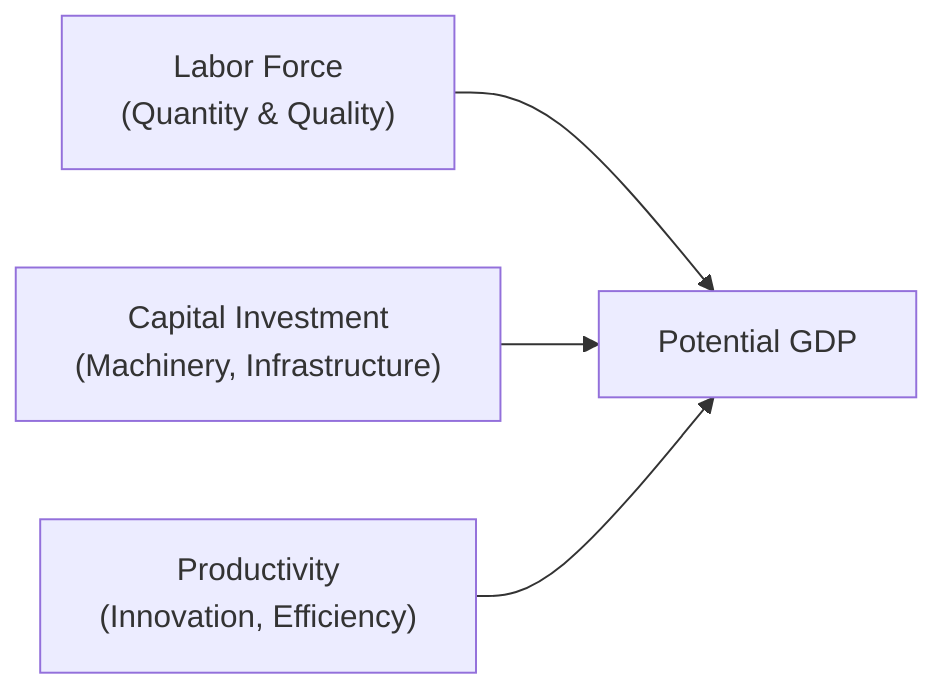
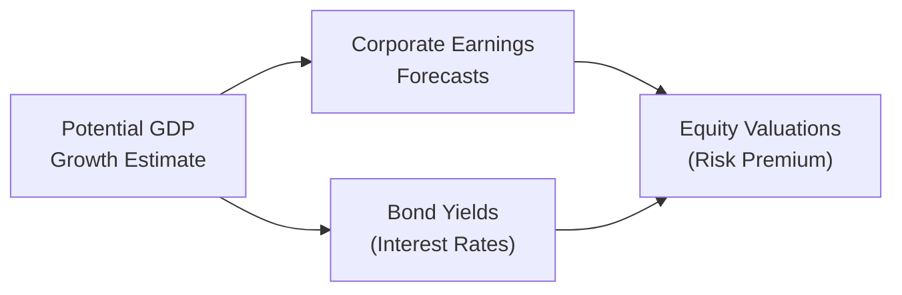

## Introduction and Overview

Well, let’s face it: every time we look at markets—equities, bonds, or even real estate—we’re really trying to figure out this elusive thing called economic growth. When I first started following macroeconomic indicators, I remember being dazzled by all the short-term ups and downs. It took me a while to realize that if you distinguish short-lived, cyclical booms or busts from the bigger, secular trends, you can form more stable long-term expectations. And that’s exactly the point of economic growth trend analysis.

Here, we focus on how to identify a country’s potential output—often referred to as potential GDP—and how factors like labor, capital, and productivity growth come together to shape these long-term trajectories. Importantly, once you have a handle on an economy’s potential, you can decide whether you expect average corporate earnings (and equity returns) to grow a bunch or stay relatively subdued. The same analysis helps you anticipate interest rates, bond yields, and the shape of the risk premium across different asset classes.

## Distinguishing Long-Term Trends from Cyclical Fluctuations

It’s super easy to get derailed by the headlines—one quarter there’s a surprising dip in GDP, the next quarter there’s a huge growth spurt, and we can all start panicking or cheering. But we need to step back and figure out how much of that noise is just cyclical, short-term movement, and how much is part of a bigger story about where the economy is headed in the next five or ten years.  

• Cyclical Components: Fluctuations influenced by business cycles, often triggered by changes in aggregate demand, monetary policy, or exogenous shocks.  
• Secular (Long-Term) Trends: The underlying trajectory of the economy’s capacity to produce goods and services, shaped by structural factors like demographics, technological change, and capital formation.  

Understanding secular trends is crucial because they inform us whether a country’s economy is consistently growing at, say, 2% or 5% on average, ignoring the short-term rumbles.  

## Key Components of Potential GDP

Potential GDP is about how much an economy can produce without generating excessive inflation. Think of it like a maximum sustainable speed limit at which the economy can run—any faster and the engine overheats. The simplest approach to potential GDP (in a growth-accounting framework) is:


\text{Potential GDP Growth} = \Delta L + \Delta K + \Delta \text{TFP}


Where:
• \\(\Delta L\\) denotes labor growth.  
• \\(\Delta K\\) denotes capital accumulation or investment growth.  
• \\(\Delta \text{TFP}\\) is total factor productivity, which captures improvements in efficiency and technology.

And I’d definitely emphasize that TFP (total factor productivity) is the magic sauce. It’s what you get from better technology, more efficient business practices, and a well-educated workforce. It’s also notoriously tricky to predict, so keep that in mind when you’re forming your capital market expectations.

### Labor Force Dynamics

Labor force growth is influenced by population growth, workforce participation rates, immigration, and demographic shifts (like aging populations). A robust labor force expansion often correlates with stronger potential GDP growth. However, in advanced economies with stagnant or even declining populations, the labor portion of potential GDP might be less supportive of higher trends.  

### Capital Investment

Capital investment is about how much money is poured into infrastructure, machinery, technology, and anything that helps produce more output. If capital investment is strong, an economy’s productive capacity rises. But bursts of capital investment in emerging economies can also be volatile—once growth expectations cool off, capital spending might slow dramatically.

### Productivity Growth

Productivity growth is the key determinant of higher per capita income and can spark leaps in corporate earnings. You can see it when new technologies (like AI or advanced robotics) help produce more goods with the same (or fewer) resources. Honestly, it’s productivity that moves the needle in the long run.  

## A Quick Mermaid Diagram on the Growth Drivers

Below is a simple diagram illustrating how the components of potential GDP fit together:

If you’re using this in your own analysis, keep in mind that measuring and predicting each of these components often involves sifting through messy data, especially in emerging markets.

## Emerging vs. Developed Markets: Different Growth Profiles

You’ve probably heard the narrative: emerging markets can grow faster than developed economies because they’re catching up. Indeed, many emerging markets have opportunities to “leapfrog” in technology and infrastructure. But the flip side is that emerging markets may face higher volatility due to political instability, less robust financial infrastructure, or commodity market swings.  

When you’re forming capital market expectations, it helps to keep these differences in mind:
• Emerging markets: Often high growth, high volatility, potential for abrupt policy changes.  
• Developed markets: More stable growth, lower volatility, stronger institutions, slower but more predictable expansions.  

This also influences asset allocation decisions. Let’s say you’re managing a multi-country equity portfolio. If you anticipate strong but bumpy growth in emerging markets, you might allocate to those regions when valuations are attractive and your risk tolerance is higher, while acknowledging that these markets can get hit hard in a global downturn.

## Integrating Top-Down and Bottom-Up Perspectives

It’s not enough just to say: “Country A’s potential growth is 4%. Great, let’s buy equities.” That might be an oversimplification. You also need help from bottom-up insights, like whether corporate earnings are poised to outpace GDP growth, or whether there are unique structural issues in certain sectors.  

• Top-Down Analysis: Start with GDP, inflation, policy environment, interest rates, and exchange rates.  
• Bottom-Up Analysis: Validate (or contradict) overall growth assumptions by delving into individual industries, corporate competitive advantages, or structural constraints.

Combining these perspectives gives you a more holistic view. For instance, you might realize that even though overall growth is strong, a specific industry is losing competitiveness due to outdated technology or new entrants. This tension between top-down optimism and bottom-up realities is part of what makes finance, well, interesting.

## Productivity Growth as the Earnings Driver

Productivity growth often translates into higher profits. Think of it this way: if companies produce more output per worker with the same wage cost, margins go up. And that can bolster stock valuations in the long term. However, keep an eye on how gains are distributed (e.g., how much is shared as wage increases). A lot of folks get surprised if wage growth accelerates and squeezes profit margins, so that’s something else you want to feed into your valuation models.

### Example: Tech Boom Boosting Productivity

Consider an advanced economy that invests heavily in cutting-edge automation—say, robots that can do routine tasks faster and more accurately than humans. Over time, corporate margins might rise. This effect then trickles into your capital market expectations for equities. But if labor unions negotiate higher wages in response, the net benefit might be smaller than you initially forecast.

## Case Study: Two Countries, Two Paths

Let’s consider two hypothetical countries—Country X (developed) and Country Y (emerging):

• Country X has slow population growth, moderate capital investment, but invests heavily in R&D. Productivity growth is decent, around 2% a year. Its potential GDP might be 2%–3% annually.  

• Country Y, an emerging market, has a young, growing population, invests rapidly in infrastructure, and is attracting foreign capital. You might estimate potential GDP around 5%–6%. However, its history of policy volatility means recessions might be deeper, currency swings more drastic, and investor sentiment more fragile.

If you’re forming a global portfolio, you might combine the stability of Country X with the upside potential of Country Y, rebalancing as valuations shift.  

## Tying It All to Equity Returns, Bond Yields, and Risk Premiums

All right, so how do we go from potential GDP to actual capital market expectations? It helps to think about key linkages:

1. **Equity Returns:** Over a long horizon, corporate earnings are often correlated with the overall growth of the economy. If an economy’s potential GDP is high and stable, you often see strong earnings growth. However, the relationship isn’t 1:1—sectors vary, and global competition can alter local dynamics.

2. **Bond Yields:** Interest rates (and by extension bond yields) often align with expectations of inflation and real economic growth. So, if you project robust growth with moderate inflation, your base level for bond yields might be higher than in a low-growth environment.

3. **Risk Premiums:** If growth is stable and predictable, required risk premiums tend to be lower. But if growth is uncertain or highly volatile, risk premiums go up. For example, some emerging markets demand a higher equity risk premium precisely because of uncertain policy or macro environment.

Here’s a flow diagram:  

Yes, it’s a bit simplified, but it captures the logic we use for capital market assumptions.

## Geographic Allocation and Multi-Country Portfolios

If you’re building multi-country portfolios, you might rank countries by:
1. Their projected growth potential.  
2. Their stage of the business cycle.  
3. Policy environment (e.g., monetary or fiscal).  

For instance, if you see that a recovering emerging market has the capacity for 6% potential GDP growth but is currently operating below trend due to a cyclical recession, you might anticipate a rebound. So you overweight that region—assuming valuations are sensible, of course. By contrast, a developed market might be close to full employment and near its potential, so if growth is already priced in, you may trim that position.

## Common Pitfalls and Challenges

1. **Overemphasizing Cyclical Swings:** Don’t extrapolate a few quarters of rapid GDP growth as a permanent new trend.  
2. **Ignoring Political or Policy Risks:** Potential GDP might seem high on paper, but abrupt policy decisions can throw a wrench in your well-laid plans.  
3. **Misjudging Productivity Gains:** Projecting productivity leaps that never materialize (or underestimating them) can lead to big forecasting errors.  
4. **Overlooking Distribution Effects:** Any productivity gains might be offset if labor compensation grows at a similar pace.  

I’ve been guilty, for sure, of letting short-term mania get in the way of a level-headed analysis. You map out your forecast for super-charged 5% annual growth, and then, wham, the economy stumbles due to a trade issue or a policy shock. So staying humble and flexible is a must.

## Practical Tips for Analysts

• Gather data from reputable sources—like the World Bank’s Global Economic Prospects—for a baseline understanding of macro variables.  
• Adjust your potential GDP estimates for local nuances: For instance, if a country invests heavily in renewable infrastructure, the capital accumulation story might be more robust than typical.  
• Supplement top-down macro with corporate-level data on earnings, margins, R&D intensity, and market share shifts.  
• Compare your assumptions with third-party consensus forecasts—but maintain your own independent view.  

## Final Thoughts

Economic growth trend analysis is an anchor for forming capital market expectations. By dissecting long-run potential GDP and layering in cyclical considerations, you’ll develop more stable, consistent views of future returns. Sure, it’s not an exact science—predicting productivity growth can feel like guesswork at times—but a structured analysis of labor, capital, and TFP is far better than flying blind.

## References

• World Bank’s Global Economic Prospects, https://www.worldbank.org  
• Barro, R. J., & Sala-i-Martin, X. (2004). Economic Growth. MIT Press.

## Exam Tips 

• On the CFA Level III exam, be prepared to link a country’s potential GDP growth rate to expected equity returns. Use the growth drivers (labor, capital, TFP) to justify your forecasts in essay questions.  
• Don’t forget to address volatility: exam questions might ask you to weigh the benefits of high growth vs. high volatility in a portfolio context.  
• Watch out for political risk and policy changes. You could be asked how a sudden shift in fiscal policy might alter long-term growth forecasts.  
• In constructed-response questions, carefully map cyclical (short-term) vs. secular (long-term) growth components and explain how they affect bond yields, equity risk premiums, or currency expectations.

## Test Your Knowledge: Economic Growth Trend Analysis Quiz



### Which of the following best describes potential GDP?

- [ ] The annual output an economy produces when inflation is above target.
- [ ] The total availability of natural resources in a country.
- [x] The economy’s maximum sustainable output without generating inflationary pressures.
- [ ] The output achieved only during strong bull markets.

> **Explanation:** Potential GDP is about the maximum sustainable level of output over the long term, not tied to short-term expansions or booms.

### Which factor is least likely to be a direct driver of labor force growth?

- [x] Fluctuations in consumer sentiment.
- [ ] Population growth trends.
- [ ] Workforce participation rates.
- [ ] Migration patterns.

> **Explanation:** Population and labor force participation rates directly affect the labor force, while consumer sentiment impacts consumption and can be cyclical but not a direct driver of labor force expansion.

### How do long-term productivity gains typically affect corporate earnings in a developed economy?

- [x] They often increase corporate earnings due to improved efficiency.
- [ ] They dilute earnings as more employees are hired at higher wages.
- [ ] They have minimal impact unless capital investment declines.
- [ ] They generally lead to wage stagnation.

> **Explanation:** Productivity gains allow firms to produce more with the same or fewer inputs, boosting margins and earnings, although wage negotiations can moderate some of the benefits.

### In the context of a multi-country equity portfolio, an emerging market’s attractiveness is primarily tied to its:

- [ ] Lower returns compared to developed markets.
- [ ] Highly stable policy and regulatory environment.
- [x] Potential for higher growth but also higher volatility.
- [ ] Guaranteed outperformance over any developed market.

> **Explanation:** Emerging markets often experience higher growth trajectories, but that growth comes with extra volatility and potential policy risks.

### Which statement about secular trends is most accurate?

- [x] They represent the long-term growth path of an economy, distinct from short-term fluctuations.
- [ ] They only last for a single business cycle.
- [x] They are the main factor behind short-term asset price volatility.
- [ ] They are solely driven by cyclical policy changes made by central banks.

> **Explanation:** Secular trends span multiple business cycles, reflecting fundamental shifts in productivity, demographics, and technology, rather than short-term policy changes.

### What is the primary mechanism by which higher labor force participation can improve potential GDP?

- [x] Increasing the total number of productive workers.
- [ ] Reducing government spending deficits.
- [ ] Expanding company profit margins directly.
- [ ] Decreasing the cost of capital.

> **Explanation:** A larger proportion of the population actively working can produce more goods and services, contributing to higher potential GDP.

### When forming capital market expectations, why is it important to separate cyclical fluctuations from secular trends?

- [x] Secular trends provide a more stable baseline for long-term returns, while cyclical factors affect short-term performance.
- [ ] Cyclical fluctuations automatically determine the optimum asset allocation strategy.
- [x] Secular trends are irrelevant for equity market forecasting.
- [ ] Cyclical fluctuations never affect equity or bond markets.

> **Explanation:** By distinguishing short-term cyclical factors from the economy’s long-term trajectory, analysts can avoid overreacting to temporary changes and form more grounded expectations.

### Which of the following factors is central to maintaining strong productivity growth?

- [ ] Lower education standards to reduce labor costs.
- [ ] Limited investment in infrastructure.
- [x] Technological innovation that enhances output per worker.
- [ ] Strict monopoly control in key industries.

> **Explanation:** Productivity growth requires innovation, improved processes, and better technology. Monopolies and underinvestment work against long-term efficiency.

### One common pitfall when forecasting emerging market growth is:

- [ ] Overestimating inflationary pressures.
- [x] Underestimating how political risk can disrupt potential growth paths.
- [ ] Overreliance on labor force data.
- [ ] Minimizing the role of capital investment.

> **Explanation:** Political or policy risk often has an outsized effect on emerging market growth, leading to abrupt shifts that can make forecasts too optimistic if risks aren’t properly accounted for.

### True or False: Productivity growth is determined solely by changes in interest rates.

- [ ] True
- [x] False

> **Explanation:** Productivity growth depends on factors like technological advancements, research and development, and human capital. Interest rates may influence investment, but they are only part of the broader picture.


