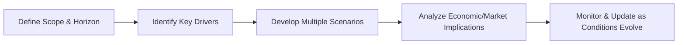

## Introduction

Forecasting economic conditions is, well, one of the trickiest parts of developing robust capital market expectations. Sometimes I still remember my first foray into predicting next quarter’s GDP at my old internship—feeling overwhelmed by all those equations and data sources. Over the years, though, I’ve come to realize that economic forecasting is both an art and a science. You can’t rely solely on a stack of sophisticated models or a data-driven black box. Instead, strong forecasting combines multiple approaches, integrates qualitative insight, and recognizes that uncertainty is inevitable.

We’ll discuss the major forecasting approaches used in practice—each with strengths, weaknesses, and best-use scenarios. As part of the CFA® 2025 Level III curriculum, having a working grasp of these techniques will sharpen your ability to interpret economic signals, set realistic return expectations, and identify risks that might surprise your portfolios. In this section, we’ll walk you through:

- Econometric Models  
- Leading Economic Indicators  
- Judgmental Methods  
- Scenario Planning  
- Dynamic Stochastic General Equilibrium (DSGE) Models  
- Nowcasting and High-Frequency Analysis  

Let’s dive in.

## Econometric Models

Econometric models form the bedrock of many classical approaches to economic forecasting. At their simplest, these models use historical data to estimate relationships between variables—think of all those linear regressions linking consumption to factors like disposable income or interest rates. At more advanced levels, they can include entire systems of equations capturing the interplay among output, inflation, unemployment, and monetary policy.

### Basic Concepts and Structure

A typical multiple linear regression model might look like this:


y_t = \alpha + \beta_1 x_{1,t} + \beta_2 x_{2,t} + \cdots + \beta_k x_{k,t} + \varepsilon_t,


where:
- \\(y_t\\) is the dependent variable (e.g., quarterly GDP growth) at time \\(t\\).
- \\(x_{1,t}, x_{2,t}, \ldots, x_{k,t}\\) are explanatory variables (such as interest rates, consumer confidence indices, or commodity prices).
- \\(\alpha\\) is the intercept term.
- \\(\beta_1, \beta_2, \ldots, \beta_k\\) are coefficients that measure the sensitivity of \\(y_t\\) to changes in each \\(x\\).
- \\(\varepsilon_t\\) is the error term, capturing random noise or omitted variables.

Once you estimate this model using historical data (e.g., ordinary least squares regression), you can plug in forecasts for the explanatory variables \\(x_{i,t}\\) to generate an outlook for \\(y_t\\). Econometric models become important predictive tools where relationships are reasonably stable over time, but, let’s face it, the economy changes, and sometimes historical relationships break down.

### Time-Series vs. Structural Approaches

Within econometrics, we can differentiate between:
- Time-Series Models (e.g., ARIMA, Vector Autoregression): These use historical patterns of a variable and its own lagged values (and sometimes other time-series variables) to predict future movements. They often have minimal theoretical structure, relying mainly on extrapolation of past patterns.
- Structural Econometric Models: These incorporate economic theory—like how interest rates might affect investment, or how consumption shapes employment. They assume some causal structure that guides which variables enter the equations and how.

### Common Pitfalls

1. Data Quality: If your underlying data is incomplete or suffers measurement errors, your model is only as good as the information you feed it.  
2. Overfitting: Throwing in too many explanatory variables may cause the model to fit historical data perfectly but perform poorly out-of-sample.  
3. Regime Shifts: Relationships can alter when the economy hits a shock, such as a global pandemic or a structural change in technology adoption.

For the CFA® exam, be aware that econometric models are a fundamental tool. But you’ll likely see exam questions focusing on the critical assumptions, model-building steps, and how you’d interpret the output (e.g., significance of coefficients, R-squared, or forecasting accuracy).

## Leading Economic Indicators

If you’ve ever glanced at headlines announcing a rise or dip in retail sales or an inverted yield curve, you’ve been introduced to leading economic indicators—data points that historically tend to move in advance of the economy’s turning points. Leading indicators offer short- to medium-term foresight into a potential expansion or downturn.

### The Conference Board Leading Economic Index

One well-known composite is the Conference Board Leading Economic Index (LEI) in the United States. It aggregates multiple indicators, such as:
- Average weekly hours in manufacturing  
- Initial claims for unemployment insurance  
- New orders for consumer goods, materials, and nondefense capital goods  
- Building permits for new housing  
- The S&P 500 Index level  
- Credit conditions  

When the LEI consistently rises over a few months, it often signals an upcoming economic upswing. If it stumbles, it could hint at a slowdown or recession.

### Practical Application

Leading indicators can be integrated in two ways:

1. **Indicator Checking**: Forecasting teams keep a close watch on leading index values—if they shift decisively, it might signal that you should revise your capital market expectations (e.g., scaling back equity exposures if a recession sign is flashing).  
2. **Augmenting Econometric Models**: You can include leading indicators as explanatory variables in a regression to get a better forward-looking sense.

### Limitations

- They’re typically best for short- to medium-term forecasts (six months to a year out).  
- They can generate false positives—a couple of unexpectedly weak sets of labor data might not always mean a downturn is guaranteed.  
- Some indicators are more relevant in one economic environment than another.

Anyway, for the Level III exam, pay attention to how leading indicators feed into an investment strategy. They are often used in tactical asset allocation to shift portfolio allocations in anticipation of a looming cycle change.

## Judgmental Methods

Not everything in economic forecasting comes down to statistical wizardry. In fact, one time I recall my old manager saying, “Sure, your model spit out this number, but does that really align with what we see on the ground?” That’s where judgmental methods come in—expert knowledge, consensus panels, and sometimes that intangible “feel” for the market that data alone might miss.

### Expert Opinions and Delphi Technique

- **Expert Opinions**: Portfolio managers, economists, and industry specialists might rely on their deep knowledge of market microstructures to predict events.  
- **Delphi Technique**: A structured approach to building consensus from a panel of experts. Typically, each expert offers a forecast anonymously, the results are shared, and experts are encouraged to revise or explain their estimates through iterative rounds—until the group’s range of forecasts converges.

### Pros and Cons

- **Advantages**: Judgmental methods capture nuances (political developments, sudden regulatory shifts, or investor psychology) that a purely data-driven approach might miss.  
- **Disadvantages**: These methods can be subjective, vulnerable to groupthink or anchoring bias, and lack the precise accuracy or replicability of statistical models.

Judgment-based forecasts often show up in real-world investment committees. Members weigh a range of quantitative data but will also add, “Look, the upcoming election might disrupt our entire manufacturing industry,” or, “Sentiment is stronger than these numbers might let on.” For the exam, remember that combining model-based forecasts with expert judgment can help reduce blind spots.

## Scenario Planning

Scenario planning goes beyond a singular point forecast (like, “GDP will grow 3.0% next year.”) and instead maps out multiple plausible futures. If there’s anything we’ve learned from, well, the last few decades, it’s that sometimes the unexpected has a way of sneaking up on you. Scenario planning helps ensure you’re not caught unprepared.

### Key Steps

Let’s illustrate the general flow in a Mermaid diagram:

- **Define Scope & Horizon**: You choose the time frame (one year, five years) and the economic variables you care about.  
- **Identify Key Drivers**: These might include technological innovations, oil prices, demographic shifts, or geopolitical tensions.  
- **Develop Multiple Scenarios**: For instance, “High Growth,” “Moderate Growth,” “Recession,” or “Stagflation.”  
- **Analyze Economic/Market Implications**: In each scenario, how might inflation, interest rates, and exchange rates evolve? Then, how do these feed into asset class forecasts?  
- **Monitor & Update**: Real-world conditions change over time, so scenario sets need to be revisited and refined.

### Example of Scenario Planning for a Portfolio

Let’s say you’re analyzing potential outcomes for the next 12 months. You generate three scenarios:

| Scenario Name | Economic Growth | Inflation | Monetary Policy | Likely Asset Class Impact |
|--------------|-----------------|----------|----------------|--------------------------|
| High Growth  | 3%–4%           | Mildly Rising | Gradual Rate Hikes | Equities rally, bond yields up slightly |
| Moderate Growth | 2%–3%        | Stable   | Balanced Approach | Equities stable, bonds relatively unchanged |
| Recession    | 0–1%           | Moderate Deflation Risk | Potential Rate Cuts | Equities down, bond prices rise, flight to quality |

By considering these three possible futures, you can stress-test your portfolio’s resilience. If you see a risk of recession, you might tilt slightly more toward safe-haven assets or incorporate hedges. On the exam, scenario planning might appear in constructed-response format—where you’re asked to propose how you’d shift allocations under different macroeconomic conditions.

## Dynamic Stochastic General Equilibrium (DSGE) Models

Now, if you’re ever curious what central banks and academic economists use to simulate entire economies, you might come across DSGE models. These are more sophisticated frameworks that incorporate microeconomic foundations, rational expectations, and random shocks. They attempt to show how the economy evolves over time in a dynamic (i.e., multi-period) environment.

### Basic Features

- **Microfoundations**: DSGE models often start with households that choose consumption and labor supply, and firms that decide on production and investment.  
- **Shocks**: They incorporate random shocks, such as technology shocks, monetary policy changes, or preference shifts among consumers.  
- **Equilibrium**: All markets (goods, labor, capital) are assumed to clear, meaning demand equals supply in each period.  

Mathematically, DSGE models can get complicated quickly. In the simplest form, they might rely on linear approximations around a “steady state,” but more advanced versions use nonlinear techniques. While these models can produce quite elegant theoretical insights, they also can be criticized for relying heavily on assumptions like rational expectations or frictionless markets.

### Real-World Applications

1. **Monetary Policy Simulation**: Central banks might use DSGE models to gauge the effect of changing interest rates or conducting quantitative easing.  
2. **Stress Testing**: Analysts might input hypothetical shocks (like a jump in oil prices) and see how the model projects the path of GDP, inflation, or employment.  

For your CFA® Level III prep, know that DSGE models are often behind the official forecasts from major central banks, but they’re rarely used for daily or tactical portfolio decisions due to their complexity. The key exam takeaway: they are robust theoretical tools but can be sensitive to assumptions.

## Nowcasting and High-Frequency Analysis

Economic reports often come out with a lag: official GDP figures might be published weeks after a quarter ends, and monthly data on unemployment or retail sales can contain large revisions. So, in fast-moving markets, analysts crave real-time snapshots of the economy. Enter “nowcasting” and high-frequency analysis.

### Nowcasting Basics

- **Goal**: Estimate the current or very near-term state of the economy before official data is published.  
- **Techniques**: Use high-frequency data, such as daily consumer credit card spending, weekly jobless claims, or even real-time macro indicators assembled from large data sets.  
- **Advantages**: More up-to-date than relying on month-old or quarter-old data. In a quickly shifting environment—say, amid a global health crisis—this near-term read can be invaluable.

### Big Data and Alternative Sources

With the explosion of “big data,” analysts increasingly incorporate diverse sources—from satellite imagery of parking lots at shopping centers (to measure real-time foot traffic) to scrapes of social media sentiment. For instance, if thousands of tweets mention rising job insecurity, some research suggests that might be an early sign of a labor market downturn. Of course, nowcasting is still subject to noise, but it’s a powerful adjunct to more conventional forecasting methods.

## Best Practices, Common Pitfalls, and Combining Approaches

### Best Practices

1. **Combine Methods**: Relying on a single approach can leave you exposed. Typically, analysts blend a baseline econometric forecast with leading indicator updates, scenario analyses, and a layer of judgment.  
2. **Regularly Recalibrate**: Economic relationships shift, so any good forecasting system updates models and assumptions—especially after major shocks or policy changes.  
3. **Clearly Communicate Uncertainties**: Forecasting is inherently uncertain. You’ll often want to present point estimates alongside confidence intervals or scenario ranges.

### Common Pitfalls

- **Groupthink**: If you’re using a judgmental approach, watch out for pressure toward consensus.  
- **Hidden Biases**: Confirming your earlier beliefs can blind you to new evidence (i.e., confirmation bias).  
- **Ignoring Regime Changes**: Big structural changes (like a new global trade regime) can make old data less useful.  

### Multi-Method Approach

For example, you might adopt:
- **Baseline**: A macroeconometric model that integrates historical data and leading indicators.  
- **Scenario Planning**: Outline how the forecast shifts if inflation overshoots or growth underperforms.  
- **Expert Input**: Gather industry feedback to incorporate intangible cyclical or policy insights.  
- **Nowcasting Tools**: Update your forecasts on short notice based on daily or weekly real-time signals.  

## Glossary

- **Econometric Model**: A statistical approach that uses historical data to estimate the relationships between economic variables.  
- **DSGE Model**: A macroeconomic model that explains economic phenomena, such as economic growth and business cycles, through microeconomic foundations.  
- **Delphi Technique**: A forecasting method based on structured expert consensus acquired via iterative rounds of questionnaires.  
- **Nowcasting**: Predicting present or very near-term economic conditions using high-frequency data, such as consumer spending or retail sales.  
- **Big Data**: Extremely large and complex data sets from nontraditional sources (like social media or satellite imagery).

## Exam Tips

1. **Model Interpretations**: If the exam question discusses an econometric forecast, be ready to interpret coefficient signs, significance, or the impact of a shift in a leading indicator.  
2. **Scenario Planning**: You might be asked to recommend a pivot in asset allocation across scenarios. Explain your reasoning clearly—mentioning expected changes in growth, inflation, and policy.  
3. **Judgment vs. Quantitative**: The exam might present conflicting signals (e.g., a negative model-based forecast but an expert consensus that’s more optimistic). Demonstrate your knowledge of how to reconcile them.  
4. **DSGE**: You won’t need to solve advanced DSGE equations, but you should articulate how such models are structured and why central banks rely on them.  
5. **Time Management**: For multi-part questions, you may have to compare multiple forecasting methods. Structure your answers systematically—like a quick bulleted outline—before writing full sentences.

## References

- Stock, J. H. & Watson, M. W.. Introduction to Econometrics.  
- Conference Board Leading Economic Index, https://www.conference-board.org/data  

## Test Your Knowledge: Economic Forecasting Approaches



### Which of the following statements about econometric models is most accurate?

- [ ] They completely eliminate forecasting uncertainty by relying on large historical data sets.
- [x] They rely on historical relationships among economic variables and can break down if those relationships shift.
- [ ] They are purely judgmental and do not incorporate statistical techniques.
- [ ] They are only suitable for scenario planning.

> **Explanation:** Econometric models are built using historical relationships, which makes them susceptible to regime changes or structural breaks in the economy. They do not eliminate predictive uncertainty.

### Which of the following best describes why judgmental methods can be valuable in forecasting?

- [ ] They are unbiased and purely data-driven.
- [ ] They always produce more accurate forecasts than models.
- [x] They incorporate expert knowledge and can capture qualitative factors not easily reflected in data.
- [ ] They are strictly for short-term forecasts.

> **Explanation:** Judgment-based forecasts allow analysts to include subjective factors, such as political uncertainty or emerging market intangible changes, that aren’t captured in econometric models.

### A key advantage of scenario planning over single-point forecasts is that scenario planning:

- [x] Considers multiple possible futures, thereby preparing for a range of outcomes.
- [ ] Eliminates the need for expert opinions.
- [ ] Provides a single “most likely” scenario for the next 12 months.
- [ ] Always includes a fully specified DSGE model.

> **Explanation:** Scenario planning does not rely on identifying one single future but outlines several plausible scenarios, helping investors gauge risk exposures across different states of the world.

### One major criticism of DSGE models in practice is that they:

- [ ] Are never used by central banks.
- [ ] Do not include any equations or assumptions.
- [ ] Have no theoretical basis in microeconomics.
- [x] May rely on strong assumptions like rational expectations and perfect market clearing.

> **Explanation:** DSGE models often assume rational agents and frictionless markets, which can be unrealistic and lead to misestimations if real-world behavior diverges significantly from these assumptions.

### Which of the following is most associated with nowcasting?

- [ ] Reliance entirely on quarterly data release from official government sources.
- [ ] Forward-looking forecasts spanning several years.
- [x] Use of high-frequency or real-time data to estimate current economic conditions.
- [ ] Focusing solely on bond market yield curves for signals.

> **Explanation:** Nowcasting attempts to gauge the present or imminent economic condition by incorporating high-frequency data like weekly jobless claims, consumer spending, or even alternative data like online search activity.

### The Delphi Technique is best described as:

- [ ] A purely statistical method using historical GDP regression.
- [ ] A tool to measure leading indicators for short-term market turning points.
- [ ] A method for nowcasting using high-frequency data.
- [x] An iterative process of gathering expert opinions to converge on a forecast consensus.

> **Explanation:** The Delphi Technique involves multiple rounds of anonymous expert input, sharing of results, and iterative revisions to arrive at a reasoned consensus.

### One common pitfall in judgmental forecasting methods is:

- [x] Susceptibility to confirmation bias or groupthink.
- [ ] Full reliance on big data analytics.
- [ ] Failure to incorporate any sort of subjective insight.
- [ ] Complete independence from external shocks.

> **Explanation:** Judgmental methods can be swayed by personal biases, group pressure, or overconfidence, which can introduce errors into forecasts.

### Leading economic indicators are often used to:

- [x] Predict short- to medium-term cyclical turning points in the economy.
- [ ] Provide precise decade-long forecasts without error.
- [ ] Replace the need for scenario planning.
- [ ] Ensure permanent asset outperformance.

> **Explanation:** Leading indicators, such as housing starts or new orders, are historically correlated with the business cycle and help predict near-term shifts in economic activity.

### Suppose you create three scenarios (High Growth, Moderate Growth, and Recession) for your portfolio allocations. This practice is known as:

- [ ] Judgmental consensus forecasting.
- [ ] Econometric modeling.
- [x] Scenario planning.
- [ ] DSGE modeling.

> **Explanation:** Laying out distinct possible futures and analyzing how each might affect your portfolio is a hallmark of scenario planning.

### True or False: A multi-method forecasting approach that blends econometric models, leading indicators, expert judgment, and scenario planning can mitigate some of the weaknesses inherent in any single approach.

- [x] True
- [ ] False

> **Explanation:** Combining different methods can provide a more well-rounded perspective on future economic conditions, reducing the blind spots that emerge from relying solely on one technique.


