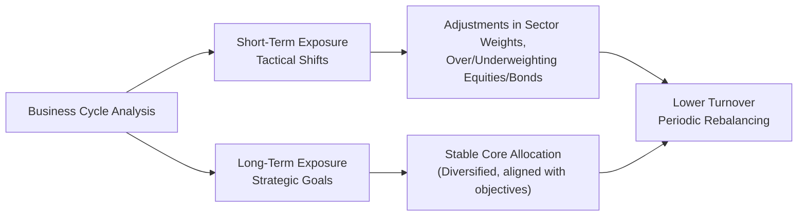

## Understanding Business Cycles

Before we dive too deep, let’s clarify what we mean by the business cycle. In our everyday lives, we tend to see our local economies soar at times, then hit rough patches, only to pick up again. That broad fluctuation in economic activity—spanning growth spurts and downswing periods—is commonly known as the “business cycle.”

The business cycle is typically broken into four phases: expansion, peak, contraction, and trough. Institutional investors, portfolio managers, and even everyday retail investors need to pay attention to these phases because they significantly influence asset returns, volatility, and our general strategies for both the short and the long term. 

Personally, I remember how, right before the Global Financial Crisis peaked around 2007–2008, everyone (myself included) seemed overly optimistic—corporate profits were robust, and equities pushed to new highs. Then came the rapid contraction phase, and suddenly, short-term expectations changed. Equities turned volatile, credit spreads ballooned, and there was this widespread scramble to figure out how to pivot and preserve capital. Those events hammered home how understanding the business cycle can be crucial when setting capital market expectations.

## Phases of the Business Cycle

Most textbooks succinctly define four stages of the business cycle:

• Expansion  
• Peak  
• Contraction  
• Trough  

They often repeat in a cyclical loop, although the timing of each phase can vary widely. Let’s sketch a simple diagram to visualize this sequence:

Expansion occurs when economic activity is humming along nicely, unemployment is gradually falling, and consumer spending is strong. Then comes the peak, which is basically an inflection point—often marked by tight labor markets, potential inflationary pressures, and possibly hawkish central bank responses. After the peak, many economies slip into contraction. Growth decelerates, corporate earnings can fall, layoffs rise, and central banks often begin cutting interest rates in an effort to re-stimulate the economy. Eventually this contraction finds a bottom and transitions into a trough, from which a new expansion phase can begin.

Grasping these stages helps in forming short-term return expectations, because each phase has distinct effects on different asset classes—especially equities, fixed income, and alternative investments (e.g., real assets). 

## Short-Term Expectations in Different Phases

During expansion phases, equity returns tend to be strong. Corporate earnings typically accelerate, investor sentiment is positive, and more cyclical sectors such as consumer discretionary and technology might outperform. Meanwhile, interest rates often rise as central banks fight off overheating or inflationary risks, which, in turn, can slow bond price appreciation. That said, certain corporate bonds might perform decently, especially if growing corporate earnings reduce default risk.

At the peak, short-term volatility may start creeping in. If you’ve traded through a late-stage bull market, you know the feeling: there’s hype, momentum, but also a sense that valuations might be stretched. Investors who recall the dot-com bubble of the early 2000s or the housing bubble of the mid-2000s understand that a peak can catch you off-guard if you focus only on today's euphoria.

Contraction periods bring their own drama. Asset prices may buckle under the strain of declining corporate earnings, rising unemployment, and general investor fear. Equities often become more volatile, and risk premiums jump. Credit spreads—the extra yield investors demand for taking on corporate default risk—can widen significantly, especially for lower-rated issuers. However, government bonds or other safe-haven assets may rally as interest rates are cut to spur economic activity.

By the time we reach the trough, short-term expectations rest on the possibility of an imminent turnaround. Early cyclical sectors might benefit first, as markets anticipate expansion. The hardest part for short-term forecasting is nailing exactly when expansion will resume. Get that point wrong, and you might exit or enter positions either too early or too late. So short-term forecasts around troughs hinge on analyzing indicators like credit conditions, central bank policies, or even anecdotal signals—like my old colleague who used to say he watched job postings in the major financial hubs to sense the start of a new uptrend in business expansion.

## Long-Term Expectations Over Multiple Cycles

In the grand scheme of investing, though, business cycles typically come and go. Over a 10-, 20-, or 30-year horizon, broader trends like productivity growth, technological innovation, demographics, and real wage increases matter more than any single contraction. The big question is whether you’re investing primarily for near-term outcomes (maybe you’re a retiree needing stable income) or you’re building wealth for decades ahead.

For example, from the mid-1980s to the late 2010s, the S&P 500 index (including dividends) delivered robust average returns, despite multiple recessions and market crashes along the way (1987, 2000, 2008). Over the long run, growth in corporate earnings and productivity overshadowed shorter-term gyrations from cyclical peaks and troughs. Hence, strategic asset allocation focuses on capturing the long-term growth trajectory of asset classes rather than timing cyclical ups and downs. 

That being said, some cycles can come with structural shifts (think of major deregulation or paradigm-altering technology). If a catastrophic event or major structural break changes the economy’s trajectory, your long-term forecast may need recalibration. But these are relatively rare. In most cases, cyclical effects are overshadowed by longer-run growth patterns.  

## Tactical vs. Strategic Allocation

Because the business cycle affects risk and return in the short run, portfolio managers sometimes deviate from their strategic asset allocation to pursue cyclical opportunities or manage cyclical risks. This approach is called “tactical asset allocation.”

• Strategic Asset Allocation: Your baseline or “target” mix, designed to match your risk tolerance and long-term goals, typically remains constant over the years (barring major life or governance changes). It leans on the assumption that, over time, markets reflect fundamental growth and fair valuation.

• Tactical Asset Allocation: Opportunistic shifts around that baseline, aiming to exploit perceived mispricings or cyclical trends. For instance, if you believe a contraction is imminent, you might temporarily hold more high-quality fixed income or reduce your equity exposure. Conversely, you might overweight equities during an early expansion period when valuations are relatively attractive and upside is significant.

If you time the cycle perfectly, you can enhance returns or mitigate downside risk—though perfect timing is notoriously hard to achieve. Some investors prefer moderate, “rules-based” tactical tilts that rely on economic signals such as leading indicators (e.g., yield curve slopes, purchasing managers’ index data, or labor market momentum) rather than large, discretionary bets.

## Sector Rotation

One of the more specialized ways of capitalizing on the business cycle is sector rotation. During expansion phases, cyclical sectors—like consumer discretionary, industrials, and technology—often see positive earnings momentum as shoppers spend and businesses invest in new projects. Near the peak, when growth is slowing and inflation looms, defensive sectors like consumer staples, health care, and utilities might start performing comparatively better, because their revenues remain more stable regardless of economic conditions.

When contraction takes hold, truly risk-averse investors may shift toward defensive sectors even further, or they might overweight bonds. By contrast, near the trough, “early cyclical” sectors can be bargains, as valuations are lower yet growth catalysts might be on the horizon. I recall how, around early 2009, many technology and consumer discretionary stocks were deemed untouchable ground by some—yet the bold investors who recognized the cycle had likely bottomed ultimately generated large returns.

All that said, sector rotation strategies require agility, deep research, and a willingness to go against prevailing sentiment. While they can boost short-term performance, incorrectly timing rotations can backfire, leading some investors simply to maintain a steadier, diversified approach.  

## Global Synchronicity and Decoupling

Historically, business cycles in different parts of the world were sometimes relatively independent. Emerging markets might experience expansions and contractions that weren’t tightly correlated with the US or European cycles, allowing global investors to benefit from diversification.

However, globalization has led to considerable synchronicity in economic activity. When demand or supply conditions in one major economy shift significantly, they can spill over to others through trade and investment linkages. That said, “decoupling” can still occasionally occur—especially for commodity-driven emerging markets or countries with unique policy regimes. For instance, an oil-exporting economy might surge while others contract if oil prices spike due to, say, geopolitical disruptions.

For short-term forecasting, paying attention to global interdependencies can reveal how quickly cyclical shifts might propagate. For long-term expectations, the interplay among technology adoption, trade patterns, and geopolitics helps shape predictions of whether certain markets may “rise above” the broader cycle or fall behind.  

## Diagram: Short-Term vs. Long-Term Focus

Below is a conceptual diagram illustrating how a portfolio manager might juggle short-term vs. long-term considerations around the business cycle:

In this diagram:  
• “Business Cycle Analysis” is at the center, informing both “Short-Term Exposure” and “Long-Term Exposure.”  
• Tactical shifts often require more active monitoring, whereas strategic allocations align with long-term goals and need only periodic reviews.

## Key Takeaways

• Economic expansions, peaks, contractions, and troughs shape short-term returns. Thoughtful, informed forecasts during each phase can help in taking advantage of or protecting against cyclical forces.  
• Long-term expectations place more emphasis on structural trends—demographics, technology, productivity—that persist beyond any single cycle.  
• Tactical asset allocation can enhance returns or mitigate risks if (and it’s a big “if”) investors time the cycle correctly. Strategic asset allocation, however, remains anchored by long-term objectives.  
• Sector rotation offers a more granular way to exploit cyclical changes, shifting exposures between cyclical and defensive sectors.  
• Globalization has made business cycles more synchronized, but certain emerging economies may still deviate or “decouple,” given distinct structural drivers.  

## Final Exam Tips

• Focus on how each phase of the business cycle affects different asset classes. In CFA Level III essay questions, you might be asked: “Given this macroeconomic scenario, how would you adjust your equity vs. fixed income weighting?” Understand the fundamentals of cyclical changes to answer quickly and confidently.  
• Be prepared to evaluate short-term tactical versus long-term strategic decisions. Emphasize not just “what” you’d do, but “why,” and tie your reasoning to the cycle’s specific indicators.  
• Use concise numeric relationships: If inflation is rising, bond yields might do X, equity valuations might do Y. In exam scenarios, show your forecasting logic in a clear, structured way.  
• Don’t overcomplicate your answers. The CFA exam values clarity. Show that you have a firm grasp of the practical link between macro conditions and portfolio positioning.  
• Manage time wisely during constructed response. Outline key points before writing. This helps you stay on topic and ensures you address all necessary components of the question.  

## Glossary

• Business Cycle: Fluctuations in economic activity characterized by periods of expansion and contraction.  
• Peak: The highest point between the end of an expansion and the start of a contraction.  
• Trough: The lowest point of an economic cycle, marking the transition out of a contraction.  
• Sector Rotation: Shifting investment exposure among different sectors of the economy depending on the phase of the business cycle.  
• Tactical Asset Allocation: Short- to medium-term changes in asset allocation to capitalize on current or expected market conditions.  

## References

• Burns, A. F., & Mitchell, W. C. (1946). Measuring Business Cycles. NBER.  
• OECD Economic Outlook. Retrieved from: https://www.oecd.org/economic-outlook  
• CFA Institute (2025). CFA® 2025 Level III Curriculum, Vol. 1: Asset Allocation.  
• Various historical market data from S&P 500 Index performance.  

## Test Your Knowledge on the Effects of Business Cycles



### Which phase of the business cycle generally features rising corporate earnings, falling unemployment, and potentially rising interest rates?

- [ ] Contraction
- [ ] Trough
- [x] Expansion
- [ ] Peak

> **Explanation:** During an expansion, economic activity and employment typically increase, leading to higher corporate earnings. Central banks may raise rates to manage inflation risk.

### Which of the following is most likely to occur during a contraction phase?

- [ ] Credit spreads narrow
- [x] Credit spreads widen
- [ ] Equity price volatility decreases
- [ ] Central banks often increase interest rates

> **Explanation:** As economic activity contracts, investors demand higher yields on riskier bonds, causing credit spreads to widen. Equity volatility typically rises as well.

### When forming long-term capital market expectations, which factor tends to be more influential than short-term cyclical volatility?

- [x] Structural productivity gains over time
- [ ] Quarterly changes in inventory levels
- [ ] Daily trading volume fluctuations
- [ ] Sentiment-driven swings in consumer confidence

> **Explanation:** Over a multi-decade horizon, structural factors like technological progress and demographic shifts overshadow short-term cyclical volatility.

### Why might investors choose to modify their portfolio in response to business cycle signals?

- [ ] To ensure their portfolio always remains heavily short in equities
- [x] To capitalize on large but temporary misvaluations in certain asset classes
- [ ] To eliminate exposure to risk permanently
- [ ] To maintain a static portfolio at all times

> **Explanation:** Tactical asset allocation is used to exploit perceived near-term mispricings or avoid downside risk, based on shifts in the business cycle.

### During the peak phase of the business cycle, which statement is most accurate regarding equity valuations?

- [x] Equity valuations may appear stretched in certain sectors
- [ ] Equity valuations are always undervalued
- [x] Defensive sector outperformance can begin
- [ ] Corporate earnings are at their weakest levels

> **Explanation:** At a peak, economic data looks strong, but equities may be fully or overvalued. Defensive sectors often start to look attractive as the cycle transitions toward contraction.

### Which of the following is a true statement about sector rotation strategies?

- [x] They often shift between cyclical and defensive sectors based on the stage of the business cycle
- [ ] They only involve investing in a single industry at all times
- [ ] They remain constant irrespective of market conditions
- [ ] They guarantee outperformance in every market environment

> **Explanation:** Sector rotation strategies seek to overweight cyclical sectors during expansions and shift to more defensive sectors during economic contractions.

### What is a primary risk of employing a tactical asset allocation strategy?

- [x] Timing mistakes can negate potential benefits
- [ ] Portfolios become over-diversified
- [x] Transaction costs are negligible
- [ ] It can completely replace the need for strategic allocation

> **Explanation:** While tactical strategies can offer upside, poor timing can lead to losses. Also, transaction costs can erode returns from frequent rebalancing.

### How does a more globally interconnected economy affect business cycle synchronization?

- [x] It generally increases the likelihood of synchronized cycles among major economies
- [ ] It guarantees emerging markets are unaffected by global downturns
- [ ] It reduces contagion risk because of diversified trade relationships
- [ ] It ensures that every country must go into recession at the same time

> **Explanation:** Increased trade and financial linkages can mean that one nation’s downturn or upturn more quickly impacts other economies, raising overall synchronicity.

### In which phase do early-cyclical sectors often become attractive to investors?

- [ ] Peak
- [ ] Contraction
- [ ] Mid-expansion
- [x] Trough

> **Explanation:** At or near the trough, the economy is poised to rebound. Early-cyclical sectors (like consumer discretionary or technology) may be undervalued yet ready to benefit from renewed growth.

### True or False: Long-term returns are generally more heavily influenced by cyclical economic downturns than by structural advances in technology and productivity.

- [x] False
- [ ] True

> **Explanation:** Short-term cyclical downturns can create volatility, but over long horizons, factors like productivity growth, demographics, and technological progress tend to dominate.


