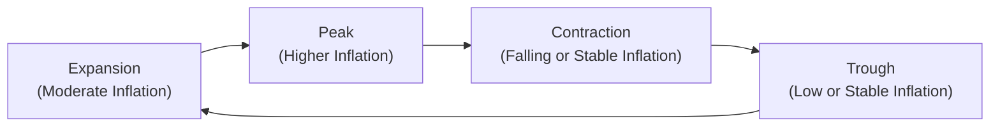
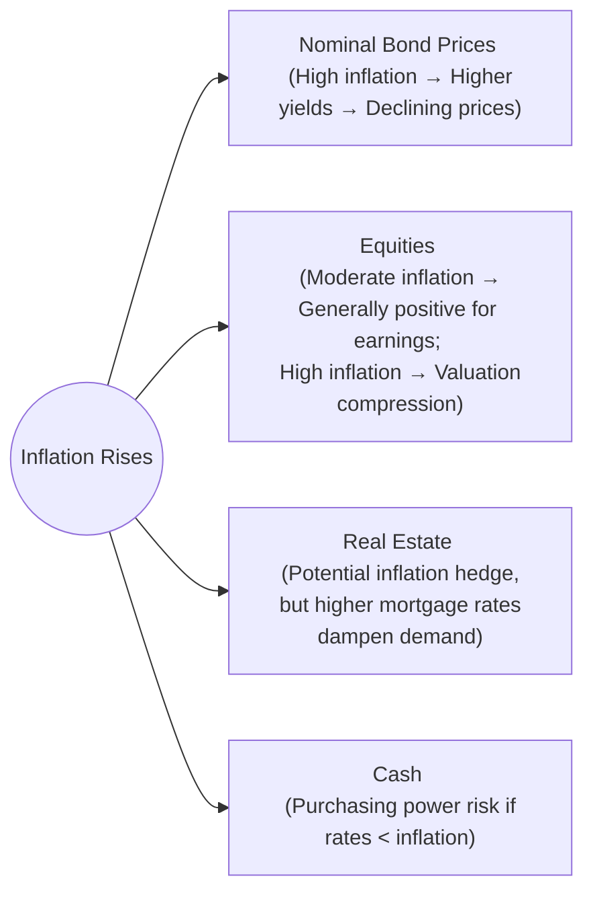

## Introduction

Inflation—you know, that rising price phenomenon that makes you realize your favorite coffee costs a bit more this year than last—plays a pivotal role in shaping capital market expectations. In fact, many would argue that understanding inflation across the business cycle is crucial for effective asset allocation. This section delves into how inflationary pressures develop throughout each phase of the business cycle and how these changes influence the relative attractiveness of various asset classes, notably cash, bonds, equities, and real estate. We’ll also look at the tricky distinction between expected and unexpected inflation, explore real-world examples, and talk about how you might position your portfolio to respond to inflationary shifts.

## Inflation Basics and the Business Cycle

Before diving deeper, let’s take a moment to clarify one big concept: inflation is the rate at which the general level of prices for goods and services rises. It’s often portrayed through indices like the Consumer Price Index (CPI) or the GDP deflator. Across different phases of the business cycle—expansion, peak, contraction, and trough—inflation can vary significantly. During expansions, you’ll often see rising consumer demand and increased production, which can nudge prices upward. Later, if the economy overheats, central banks might intervene with tighter monetary policy to rein in inflation, potentially pushing the economy toward a contraction.

Understanding these cyclical shifts is key to setting capital market expectations. A mild inflation rate (say 2–3%) is typically viewed as healthy because it suggests stable growth. But if inflation surges too much above expectations, the result could be declining consumer confidence, a spike in interest rates, and a potential slowdown or even recession. If inflation comes in too low, that may signal weak demand or even deflationary pressures—also undesirable for long-term growth.

Below is a simple illustration of how inflation might ebb and flow through the business cycle:

In this stylized flowchart, inflation typically accelerates during late expansion, reaches a peak or near-peak at the apex of the cycle, then subsides during contraction and reaches a low point around the trough—after which expansion starts again.

## Inflation and Cash

I remember chatting with a friend who had a sizable amount of cash parked in a low-interest savings account a few years ago. Naturally, she felt “safe”—but, well, when inflation started ticking up, she realized her real returns were basically negative. Even if her nominal account balance remained steady, each dollar was losing a bit of purchasing power every year.

• Purchasing Power Erosion: If the nominal interest rate on cash-equivalent instruments (like T-bills or money market funds) doesn’t keep pace with inflation, holders suffer a decline in purchasing power.  
• Real Return Impact: Suppose you’re getting 1% nominal interest on your savings, but inflation is 2%. Then your real return, which is nominal return minus inflation, becomes -1%.  
  Using KaTeX, you might express this relationship as:  
  R_{real} = R_{nominal} - \pi  
  where R_{real} is the real rate, R_{nominal} is the nominal rate, and \pi is inflation.  

• When Business Cycles Shift: In late expansions, interest rates often move higher as central banks tighten policy to control rising inflation. This can help cash investors a little, as short-term interest rates might rise. However, if central banks lag behind or if inflation spikes unexpectedly, cash holders still face eroding real values.  

## Inflation and Bonds

Bonds are especially sensitive to inflation, particularly if it’s unexpected. Let me just say from personal experience, it’s no fun watching the value of a long-term bond erode when yields spike.

• Interest Rate and Price Relationship: Higher inflation generally pushes nominal yields upward, which inversely affects bond prices. Prices fall most sharply for longer-duration bonds because they are more sensitive to interest rate movements.  
• Inflation-Linked Bonds: Securities such as Treasury Inflation-Protected Securities (TIPS) in the United States or similar instruments elsewhere adjust their principal or coupon payments in line with inflation measures. These can offer some defense against rising prices. However, even TIPS have complexities, including possible lags in adjusting to realized inflation.  
• Late-Cycle Pressures: As the expansion matures, you tend to see central banks ramping up interest rates to calm inflationary pressures, which can drive bond yields up and bond prices down. This effect can be quite pronounced for long-duration fixed coupon bonds. However, in recessions, inflation often recedes, interest rates decline, and bond prices recover.  

### Example: Long-Duration Bond During a Surge in Inflation

Let’s say you hold a 10-year bond at a fixed coupon of 3% in a stable 2% inflation environment. Then, inflation unexpectedly jumps to 5%. The market now demands a higher yield for newly issued bonds, say 7%. Investors holding the older 3% bond will watch its market price decline because new, comparable bonds offer a significantly higher coupon.

## Inflation and Equities

It might seem contradictory that moderate inflation can sometimes be good for stocks, but if it’s paired with economic expansion and rising corporate earnings, markets may thrive. However, there's a tipping point. Once inflation is perceived as out of control, input costs soar, and central banks respond aggressively, possibly slowing growth and hampering equity valuations.

• Valuation Considerations: Runaway inflation can raise discount rates, leading to valuation compression for equities. Corporate profits might get squeezed by higher costs if companies can’t pass all those costs onto consumers.  
• Sector Variances: Some sectors—like energy and materials—may benefit from rising commodity prices and inflation. Others, like consumer staples, might fare well due to stable demand. In contrast, growth-oriented sectors with big future cash flows (e.g., tech) can see hefty valuation hits as their discount rates climb.  
• Business Cycle Position: In early expansions, moderate inflation often represents healthy demand and can be supportive of equities. In the late stage of a cycle, fears of overheating and tighter monetary policy can weigh heavily on the equity market.

### Case Study: Equity Valuations in a High-Inflation Environment

Consider a scenario where inflation starts ramping up from 2% to 6% within a year. Sectors like energy or mining might see improved revenues as commodity prices ride the inflation wave. Meanwhile, technology stocks with lofty price multiples may struggle because investors suddenly discount their future earnings at a higher rate. If central banks intervene aggressively, you might see equity markets overall retrench in the short-to-medium term.

## Inflation and Real Estate

Real estate is often touted as an “inflation hedge” because property values and rental incomes can rise alongside a general increase in price levels. But there are layers to this story:

• Inflation Hedge Characteristics: Because rents and property valuations often trend upward over the long run with inflation, real estate can maintain or even increase its real value. However, rising property taxes, higher maintenance costs, and other expenses can offset some of this benefit.  
• Mortgage Rates and Affordability: An inflationary environment with higher interest rates can make mortgage financing more expensive, potentially softening demand for real property. This is a double-edged sword—while property owners might rejoice at potential appreciation, new buyers could be deterred by higher borrowing costs.  
• Economic Cycle Context: In expansions, increased household formation and business activity can boost real estate demand, pushing up prices. During contractions, job losses and tighter credit conditions can dramatically reduce demand and slow property price growth, despite inflation’s general upward push on prices.  

## Business Cycle Interaction

Inflation doesn’t exist in a vacuum. It ebbs and flows with the business cycle:

• Late-Expansion Acceleration: Demand for goods and services runs hot, labor markets tighten, and inflation typically accelerates. Central banks often attempt to curb inflation by raising rates, which dampens borrowing, including mortgage borrowing.  
• Peak and Potential Contraction: As interest rates rise, credit conditions tighten. Consumer sentiments may shift, spending can slow, and inflation tends to plateau or reverse—triggering the onset of a contraction.  
• Trough and Recovery: Inflation usually reaches a lower level in a recessionary environment, as demand is suppressed. Then, as the economy recovers, the cycle restarts with renewed momentum, moderate inflation, and a shift to expansion.  

For more details on how business cycles influence short- and long-term expectations, see Section 1.6 “The Effects of Business Cycles on Short-Term vs. Long-Term Expectations.”

## Expected vs. Unexpected Inflation

From an asset allocation standpoint, you always want to ask: Is an inflation rate already priced into the markets, or could we see surprises?

• Expected Inflation: If everyone expects inflation to be, say, 3%, lenders and borrowers will factor this into interest rates, wages, and contract terms. Capital markets respond accordingly, so you probably won’t see dramatic shifts in asset prices solely because inflation “hits its mark.”  
• Unexpected Inflation: This is the real wild card. If inflation comes in at 6% when markets were prepared for 3%, you can see sudden disruptions—bond yields might spike, equity valuations may get hammered, and real estate financing can tighten. This volatility typically affects all asset classes in some fashion, as they re-price to reflect the new information.  

## Putting It All Together: A Simple Illustrative Portfolio Scenario

Imagine you have a portfolio with 25% cash equivalents, 30% bonds, 35% equities, and 10% real estate. During an early expansion, modest inflation pick-up (from 1% to 2%) could have minimal impact on cash, steady bond performance, decent equity growth, and stable real estate appreciation. Now, fast-forward to a late expansion scenario: inflation jumps to 4–5%, yields on new bonds rise sharply, existing bonds lose value, equity multiples begin to compress, and real estate might see higher valuations but also declining transaction volume due to credit constraints. All of these dynamic shifts underscore the importance of calibrating your asset mix as inflation expectations evolve through the business cycle.

## Best Practices, Common Pitfalls, and Strategies

• Stay Vigilant About Duration: Holding long-duration bonds in a rising inflation environment is risky. Consider adjusting duration or overweighting inflation-linked bonds when inflationary pressures seem likely to accelerate.  
• Diversify Equity Sectors: Certain equity sectors (e.g., consumer staples, energy) might offer relative stability during inflationary upswings, whereas growth and tech sectors can be more sensitive.  
• Real Estate Isn’t a One-Size-Fits-All Hedge: While real estate can help cushion against inflation, local market conditions, tax policies, and financing costs can significantly influence returns.  
• Reactive vs. Proactive: A common pitfall is reacting too late. If you wait until inflation data is consistently surprising on the upside, market prices might have already incorporated those changes. Keep a forward-looking perspective, including scenario analysis.  
• Monitor Monetary Policy: Central bank actions (e.g., rate hikes, asset purchase programs) are among the strongest determinants of inflation trends. Anticipating policy moves can help you position portfolios in advance.

## Conclusion

Inflation may look like a simple metric at first glance, but it’s intricately connected to every corner of the capital markets. Cash holders face the risk of purchasing power erosion, bond prices rise or fall inversely with yields spurred by inflation expectations, equity markets may thrive on moderate inflation but suffer in extreme scenarios, and real estate can serve as a partial cushion depending on financing conditions and economic cycles. Recognizing how inflation transitions from one business cycle phase to the next—expansion to peak to contraction and back again—can give you a solid roadmap for adjusting asset allocations. And never forget: the markets might already bake in certain inflation expectations, so it’s often the unexpected elements that pack the biggest punch.

Anyway, I hope this discussion helps clarify why inflation is such a hot topic (pun intended) for CFA® candidates and practitioners alike. Keep these principles in mind when you’re building or rebalancing portfolios in inflationary or potentially inflationary times.

## Glossary

• Purchasing Power: The value of currency expressed in terms of how many goods/services one unit of money can buy.  
• Duration: A bond’s sensitivity to interest rate changes, factoring in the time to maturity and coupon payments.  
• Inflation Risk: The potential for loss in real returns because of rising price levels.  
• Inflation-Linked Bonds: Debt instruments whose principal or coupons adjust for inflation—such as TIPS in the U.S.  
• Valuation Compression: When rising interest rates or inflation cause investors to lower the multiples (like P/E) they’re willing to pay for equities.  

## References

• Mishkin, F. S., The Economics of Money, Banking, and Financial Markets.  
• Green Real Estate & Inflation, BIS Working Papers, https://www.bis.org  

## Test Your Knowledge: Inflation and Asset Class Implications



### 1. During the late expansion phase of the business cycle, rising inflation primarily affects bonds by:

- [ ] Lowering nominal yields and increasing bond prices.
- [ ] Maintaining nominal yields but drastically reducing bond prices.
- [x] Pushing nominal yields higher, leading to price declines, especially for longer-duration bonds.
- [ ] Causing nominal yields to remain unchanged.

> **Explanation:** In late expansions, central banks often impose tighter monetary policy to combat rising inflation, which leads to higher nominal yields. Because bond prices move inversely to yields, long-duration bonds typically drop in price.

### 2. Which of the following statements is most accurate regarding cash in an inflationary environment?

- [ ] Cash’s nominal returns always exceed inflation.
- [ ] Cash is unaffected by inflation since its nominal value remains the same.
- [ ] Cash preserves purchasing power effectively during high inflation.
- [x] If short-term rates fail to keep up with inflation, real returns on cash can become negative.

> **Explanation:** Cash generally loses purchasing power in an inflationary environment if interest rates do not keep pace with rising prices, causing negative real returns.

### 3. Inflation-linked bonds, such as TIPS, are designed to:

- [ ] Pay a fixed coupon regardless of inflation.
- [x] Adjust principal or coupons to compensate for changes in inflation.
- [ ] Maintain a constant real return only if inflation remains below 2%.
- [ ] Automatically decrease at times of deflation.

> **Explanation:** TIPS adjust their principal (and by extension, coupon payments) in response to changes in an inflation index, providing partial protection against rising prices.

### 4. Real estate as an inflation hedge is most effective when:

- [ ] Real estate prices move inversely to inflation.
- [x] Rental income and property values rise alongside general price levels.
- [ ] Mortgage costs do not affect buyer demand.
- [ ] Property taxes decline in high-inflation environments.

> **Explanation:** Real estate can serve as an inflation hedge primarily because property prices and rental income often rise along with inflation, preserving real value for owners.

### 5. When inflation runs considerably higher than market participants expect, the most likely outcome is:

- [x] A sudden repricing of asset classes as yields and discount rates rise.
- [ ] No change in nominal yields, as the market had already anticipated this move.
- [x] Volatility across capitals markets, affecting both bonds and equities.
- [ ] A significant drop in real estate values irrespective of mortgage costs.

> **Explanation:** Unexpected (surprise) inflation compels market participants to revise yield requirements and discount rates, often causing sharp price fluctuations across multiple asset classes.

### 6. Which statement correctly describes how equity valuations might react to rising inflation?

- [x] Moderate inflation can be supportive for earnings but high inflation can raise discount rates and compress valuations.
- [ ] Deflation usually raises discount rates, hurting equity valuations.
- [ ] Rising inflation exclusively benefits growth stocks.
- [ ] Equity valuations remain unaffected by the discount rate.

> **Explanation:** Equity valuations may initially benefit from moderate inflation tied to robust economic growth. However, as inflation rises beyond expectations, central banks often increase rates, raising discount rates and negatively impacting valuations.

### 7. In which phase of the business cycle does inflation typically decelerate, easing pressure on interest rates?

- [ ] Expansion
- [x] Contraction
- [ ] Peak
- [ ] Recovery

> **Explanation:** During the contraction phase, economic activity slows, demand for goods/services decreases, and as a result, inflation typically recedes, often leading to lower interest rates.

### 8. The greatest risk of unexpectedly high inflation is:

- [x] Deterioration in bond prices and increased market volatility.
- [ ] A permanent increase in real (inflation-adjusted) bond yields.
- [ ] Higher liquidity in all asset classes.
- [ ] Guaranteed appreciation in currency value.

> **Explanation:** Sudden, unanticipated inflation typically leads to a spike in nominal yields. Investors re-price assets rapidly, causing heightened volatility and declining bond prices.

### 9. One potential pitfall when relying on real estate to hedge inflation is:

- [x] Rising mortgage rates can decrease affordability, tempering demand and price growth.
- [ ] Property values always move up in lockstep with inflation.
- [ ] Landlords receive no benefit from higher rents.
- [ ] Real estate markets are unaffected by local economic conditions.

> **Explanation:** Though real estate can help hedge inflation in the long term, higher mortgage rates—often accompanying high inflation—can reduce demand, limiting price growth potential.

### 10. True or False: Moderate inflation during the expansion phase of the business cycle generally signals healthy economic growth.

- [x] True
- [ ] False

> **Explanation:** Moderate inflation often signals rising demand, household spending, and corporate earnings growth, aligning with a healthy expansion phase.


