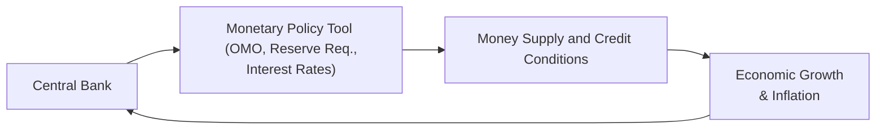
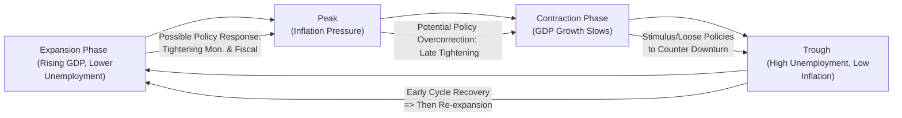

Monetary and fiscal policy are two pivotal levers that policymakers use to influence economic performance and, in turn, shape the trajectory of business cycles. At its most fundamental level, monetary policy deals with controlling the money supply and influencing interest rates, while fiscal policy focuses on government taxation and spending. In the context of portfolio management, it’s crucial to recognize how these levers can shift market sentiment, affect capital allocation, and ultimately impact long-term capital market expectations.

Sometimes, it’s helpful to think about a small example in everyday life. Imagine you’re running a local coffee shop: if interest rates go down, maybe you can afford cheaper loans to expand your café. Or if taxes go up, you might scale back your hiring plans. While your café is small in the grand scheme, at a macro level, these fluctuations show how policy changes filter through to investment, spending, and growth in the broader economy.

Monetary Policy Tools

Central banks, such as the Federal Reserve in the U.S. or the European Central Bank in the Eurozone, employ various tools to guide economic outcomes—especially inflation and growth. Three of their most common instruments are open market operations (OMO), reserve requirements, and setting target interest rates.

• Open Market Operations (OMO): Through OMO, a central bank buys or sells government securities in the open market. By purchasing securities, the central bank injects liquidity into the banking system—it’s basically putting more money “out there.” Conversely, selling securities withdraws liquidity from the market. When liquidity is abundant, interest rates tend to drift downward and vice versa.

• Reserve Requirements: Some central banks set the fraction of customer deposits that banks must hold in reserve (essentially, not lend). Lowering reserve requirements generally stimulates lending because banks can lend out a greater portion of deposits, which can boost economic activity. Raising the requirement tends to dampen lending, potentially slowing the economy.

• Interest Rate Targets: Possibly the most publicized aspect of monetary policy is the target interest rate (for example, the federal funds rate in the U.S.). When the central bank lowers its target, borrowing becomes cheaper, fueling consumption and investment. When it raises the target, borrowing costs rise, and economic growth can slow.

Here is a simple flow diagram that can help show how central banks use these tools to steer economic activity:

In this diagram, the central bank continuously monitors inflation, growth, and financial stability indicators, then tweaks its tools (step B) to manage the money supply (step C), which ultimately has repercussions for growth and inflation (step D).

Fiscal Policy Tools

Governments rely on fiscal policy to influence aggregate demand mainly through alterations in government spending (G) and taxation (T). The combination of these can be either expansionary or contractionary.

• Expansionary Fiscal Policy: When governments want to stimulate the economy, they might increase public spending or cut taxes (or both). Increased government spending puts more funds into the system; lowering taxes leaves consumers with more disposable income. Both measures raise aggregate demand.

• Contractionary Fiscal Policy: If the economy is overheating or inflation is a threat, policymakers might reduce government spending or raise taxes. Doing so takes money out of the system, cooling aggregate demand and often stabilizing inflation.

For instance, as a personal anecdote, I remember when a close friend who runs a small manufacturing firm saw a big uptick in orders right after a new government infrastructure project started. That government spending directly filtered through as demand for equipment, raw materials, and labor, boosting regional economic activity.

Policy Lags

One essential aspect of managing monetary and fiscal policies is recognizing that policy actions do not produce instant results. Instead, they take time to trickle through the economy. We usually talk about three types of policy lags:

• Recognition Lag: Policymakers first have to detect that the economy is either running too hot or growing too slowly. Economic data often lags by a few weeks or even months.

• Implementation Lag: After recognizing an issue, there’s the wait for decision-making bodies—such as a central bank’s board or a legislative body—to propose, debate, and pass policies. Monetary policy often moves faster than fiscal policy because central banks have fewer decision-makers than legislatures.

• Effectiveness Lag: Even after policy is in place, individuals and businesses need time to adjust. For example, if interest rates drop, it may take months for firms to decide to expand, take out a loan, build a new factory, and ultimately add capacity.

Because of these lags, policymakers sometimes end up “behind the curve”—they may implement expansionary measures just as the economy is peaking, inadvertently amplifying volatility in business cycles.

Crowding Out

Crowding out occurs when the government funds its spending by borrowing from the private market, typically through issuing bonds. Large-scale government borrowing can lead to higher interest rates if demand for loanable funds outstrips supply, making it more expensive for private borrowers to obtain credit. That can crowd out private investment, hamper growth, and sometimes raise risk premiums in the bond market.

If government borrowing is exceptionally high—especially in economies where bond markets are less deep or robust—crowding out can be severe. Investors must monitor whether government deficits are structurally high, especially when planning strategic asset allocations over lengthy horizons.  

Policy Coordination

Ideally, monetary and fiscal policy should move in sync to manage cyclical fluctuations effectively. When monetary and fiscal policies are aligned—say, when the central bank lowers interest rates and the government simultaneously increases spending—they can together create a potent expansionary effect during an economic downturn. However, if the central bank is tightening while the government keeps boosting spending, the conflicting signals may yield suboptimal outcomes.

In some historical episodes, governments have pressured central banks to keep rates low to accommodate large deficits, risking inflation. In others, tight monetary policy was used to offset uncomfortably expansive fiscal policies. Portfolio managers should pay close attention to such dynamics because misalignment (or alignment) can have dramatic effects on yield curves, equity valuations, and currency exchange rates.

Capital Market Sentiment

One of the most important reasons to keep tabs on monetary and fiscal policy is how intensely markets react to any anticipated shift. Let’s say the Federal Reserve hints that it will raise interest rates in upcoming meetings. Stock investors, worried about possibly higher financing costs and lower earnings, might anticipate a decline in equity prices. At the same time, bond investors—as interest rates rise—might reprice bonds downward (or demand higher yields on newly issued ones). 

Furthermore, expectations about fiscal policy—say, a forthcoming tax cut—can also stoke immediate market reactions. Even before any actual legislation passes, asset prices may shift as investors position themselves based on expectations of a more profitable or less risky environment.

Case Study: Fiscal Stimulus and Equity Markets

Consider a scenario in which a government unveils a massive infrastructure program right after a recession. Markets often react quickly:

• Construction-related stocks might jump in price.  
• Bond markets might worry about where the money will come from—perhaps the government will issue more bonds, pushing yields higher.  
• Corporate bond spreads could tighten if the market sees improved economic growth.  

In the short term, such news can heighten volatility. Longer term, the net effect on capital markets depends on whether the stimulus leads to sustained economic growth or simply higher rates and more debt.

Mermaid Diagram: Business Cycle and Policy Interventions

Below is a simplified diagram illustrating how monetary and fiscal policy interventions might occur across a single business cycle:

As depicted, policymakers often intervene at different stages of the business cycle—tightening monetary and fiscal policy near the peak, loosening it during the trough. But due to policy lags and imperfect information, the response can sometimes be mistimed, further influencing market volatility and investor sentiment.

Practical Implications for Portfolio Management

• Sector Rotation: Portfolio managers may shift sector exposures based on expected policy moves (e.g., cyclical stocks might benefit in expansionary phases, whereas defensive sectors could hold up in contractionary phases).

• Bond Duration Management: An upcoming tightening (rising interest rates) might motivate investors to shorten duration to prevent excessive losses from falling bond prices. Conversely, in a declining rate scenario, longer duration might prove more profitable.

• Inflation Hedging: When government policies are highly expansionary, inflation risk could rise. Portfolio managers might favor real assets, such as real estate or commodities, or inflation-linked bonds.

• Multinational Exposure: Different countries run different policy mixes. Diversifying across geographies may help reduce volatility if each economy is at a distinct point in its business cycle or uses divergent policy approaches.

Common Pitfalls

• Overreaction: Markets can misinterpret short-term policy signals, causing overreactions in asset prices.  
• Timing Mismatches: Policies intended for one phase of the cycle might not take effect until it’s already passed.  
• Political Constraints: Fiscal policies often face political hurdles, delaying implementation.  
• Ignoring Structural Deficits: Chronic budget shortfalls can lead to continuous crowding out, harming private investment in the long run.  

Personal Reflection: I recall the frustration many analysts felt during a certain economic downturn when the government announced a stimulus plan—yet by the time it trickled down, we were already entering a recovery. The plan then risked heating up the economy more than needed. It’s a reminder that well-coordinated policy is crucial, and anticipating these shifts can give investors an edge.

Exam Tips: Approaching Business Cycle Policy Questions

• Specificity: When the exam question mentions “the central bank has lowered interest rates,” be ready to discuss immediate asset price impacts (e.g., bond yields, equity valuations) and long-term inflation concerns.  
• Scenario Outcomes: Carefully analyze what stage of the business cycle the policy aims to address.  
• Recognize Conflicts: If monetary and fiscal policies are moving in opposite directions, identify potential net outcomes.  
• Calculations: You might see item sets that ask you to compute changes in after-tax returns following a tax adjustment. Keep your discount rate or required return logic consistent with interest rate changes.  
• Risk Premium Impact: Link expansions or contractions in money supply to risk premiums. A loosening policy might reduce risk premiums, boosting equity valuations, at least in the short run.

References for Further Study

• Blanchard, O., & Johnson, R. (various editions). Macroeconomics. A detailed explanation of policy tools and how they shape aggregate demand and overall economic activity.  
• Fiscal Monitor, International Monetary Fund (IMF). (https://www.imf.org). Valuable analyses of global fiscal developments, deficits, and government debt strategies.

Below are some key terms to keep in mind:

• Open Market Operations (OMO): Central bank transactions (buying/selling government securities) to manage money supply.  
• Policy Lag: The time between identifying an economic problem and policy changes taking effect.  
• Contractionary Policy: Measures such as higher interest rates or reduced spending aimed at cooling the economy.  
• Expansionary Policy: Lower rates or increased spending to boost demand and economic growth.  
• Crowding Out: Situation in which government borrowing raises interest rates, limiting private investment.

By fully understanding how monetary and fiscal policies interplay throughout business cycles, you’ll be better equipped to anticipate shifts in capital market expectations—a core capability for any advanced-level portfolio manager.

--------------------------------------------------------------------------------

## Practice Questions: Monetary and Fiscal Policy in Business Cycles



### When the central bank purchases government securities on the open market, what is the most direct, immediate effect?

- [ ] It decreases the money supply.
- [x] It increases the money supply.
- [ ] It raises interest rates.
- [ ] It reduces aggregate demand.

> **Explanation:** Buying securities injects liquidity into the economy, which increases the money supply. Interest rates typically move inversely to changes in the money supply.

### Which scenario best exemplifies the concept of crowding out?

- [ ] Government policy that reduces taxes to spur economic activity.
- [x] Elevated government borrowing driving up interest rates and deterring private investment.
- [ ] A reduction in central bank reserve requirements that encourages banks to lend.
- [ ] Businesses deferring investment until a more favorable capital gains tax policy is introduced.

> **Explanation:** Crowding out occurs when high government borrowing raises the cost of credit (interest rates), making it harder for private firms to invest.

### A government passes a tax cut just as the economy transitions from a recession to a robust expansion. What is the most likely outcome?

- [ ] The tax cut will perfectly stabilize the economy and eliminate inflation risk.
- [x] The tax cut may take effect after the recession has ended and could risk overheating the economy.
- [ ] The tax cut has no role in influencing inflation rates.
- [ ] The central bank will immediately tighten monetary policy.

> **Explanation:** Due to policy lags, fiscal measures often don’t become effective until well into the economic upswing. This can amplify inflationary pressures if the economy is already recovering.

### Suppose a central bank believes inflation is growing too quickly. Which monetary policy action is the bank most likely to take first?

- [ ] Decreasing reserve requirements.
- [ ] Purchasing government bonds to inject liquidity.
- [ ] Proposing a fiscal stimulus plan.
- [x] Selling government bonds or raising policy rates to reduce the money supply.

> **Explanation:** In a tightening cycle to combat inflation, the central bank generally sells bonds (open market operations) or raises its target interest rate to curtail money supply growth.

### Which statement about policy coordination is correct?

- [x] When fiscal and monetary policy jointly support expansion, the effect can be more potent than one policy alone.
- [ ] Fiscal and monetary policy always move in the same direction, regardless of economic conditions.
- [ ] Monetary policy decisions have no impact on government borrowing costs.
- [ ] Fiscal and monetary policies are always at odds with each other.

> **Explanation:** Well-coordinated policy efforts—e.g., increased government spending coupled with an accommodative monetary stance—can amplify the overall stimulus on the economy.

### An example of an effectiveness lag is:

- [ ] The time it takes a central bank’s open market committee to meet and decide on policy.
- [ ] The days between a government passing a bill and the President signing it into law.
- [x] The period after a policy is enacted but before businesses adjust investment decisions.
- [ ] The hours it takes for real-time market data to reflect price moves.

> **Explanation:** Even after a policy takes legal or operational effect, it may be months before households and firms change spending, hiring, or investment decisions.

### How can interest rate policy influence equity valuations?

- [ ] Lower interest rates always crash equity markets.
- [x] Lower rates reduce discount rates, often lifting equity valuations.
- [x] Higher rates may increase required returns, negatively impacting valuations.
- [ ] Interest rates are unrelated to equity valuations.

> **Explanation:** Equity prices are typically the discounted present value of forecasted future cash flows. Lower rates reduce the discount factor, raising present values, while higher rates have the opposite effect.

### Which of the following can happen if government spending remains persistently high and is funded by increased borrowing?

- [x] Crowding out could become a sustained phenomenon, suppressing private investment.
- [ ] Corporate bond yields will fall to zero.
- [ ] The money supply automatically contracts to offset debt levels.
- [ ] Fiscal policy no longer affects aggregate demand.

> **Explanation:** Persistent high deficits can cause the government’s debt needs to compete with private sector borrowing, pushing up interest rates and mitigating private investment.

### Why might bond portfolio managers reduce duration when central banks signal tighter policy ahead?

- [x] Longer-duration bonds are more sensitive to rate hikes and can suffer larger price declines.
- [ ] Shorter-duration bonds pay higher interest rates than longer-duration bonds in all scenarios.
- [ ] Tightening policy raises bond prices uniformly across durations.
- [ ] Duration is irrelevant to bond price volatility.

> **Explanation:** Longer-duration bonds exhibit higher price sensitivity to changes in interest rates. If rates climb, these bonds experience deeper price drops, prompting managers to consider shorter durations.

### In the context of monetary tightening, which statement is most accurate?

- [x] True
- [ ] False

> **Explanation:** True. Monetary tightening typically decreases the money supply or makes credit more expensive, thereby restraining economic expansion and potentially putting downward pressure on asset prices in the short term.


