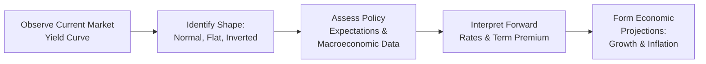

Basics of the Yield Curve  
I remember the first time I truly understood the yield curve—honestly, it felt like someone handed me the key to a hidden economic toolbox. The yield curve is just a simple graph, right? Well, yes and no. It typically shows the yields (returns) on government securities (e.g., U.S. Treasuries) across various maturities, from short-term bills to long-term bonds. But behind that simple shape lies, you know, a wealth of information about investor behavior, interest rate expectations, and potential economic shifts.

In portfolio management, analyzing the yield curve helps us form capital market expectations, which is a big part of the overall theme in Chapter 1. The shape can telegraph how the market feels about future growth, inflation, and monetary policy. Central bankers, economists, and everyday market observers often watch it like hawks—and for good reason.

Shapes and Their Implications  
Let’s talk shapes. The yield curve may look:

• Normal (Upward Sloping): This is often called the “healthy” or “normal” scenario. Short-term rates are lower than long-term rates, partly because longer maturities demand a higher yield (or term premium) to compensate for duration risk and uncertainty. Investors generally interpret this shape as an expectation of stable or robust economic growth.  
• Flat: Occasionally, the yield curve flattens if short-term rates and long-term rates converge to similar levels. Market participants might see this as a transition signal or a sign of uncertainty, as the difference in yields across maturities is minimal.  
• Inverted (Downward Sloping): Historically, an inverted yield curve—where short-term yields exceed long-term yields—has often preceded recessions. A cynic might say this is “the harbinger of doom” for economic expansions. While it’s not 100% predictive (false positives do happen), many practitioners still see inversion as a major caution flag that a contraction could be on the horizon.

Anyway, these shapes aren’t just random scribbles. They result from myriad factors, including monetary policy, inflation expectations, global capital flows, and risk appetite.

Predictive Power and Historical Evidence  
Perhaps the most famous argument for the yield curve’s predictive power is its track record of inversions prior to recessions. Studies, such as the one by Estrella and Hardouvelis (listed in References), highlight that an inverted curve signals reduced investor confidence about future growth. If you think about it: if markets expect slowing economic growth or a central bank pivot to lower future rates, they bid up long-term bonds, driving yields for those maturities lower than shorter maturities.

A personal recollection? I vividly remember 2006–2007, when I saw the yield curve invert for a few months. Some folks brushed it off, but others braced for turbulence—and we all know what happened in 2008. Still, correlation doesn’t equal causation, and it’s crucial to recognize that there can be false alarms.

Spot vs. Forward Rates  
Part of the curve’s magic lies in its decomposition into spot and forward rates. Spot rates are yields for bonds that start today and mature at some future point. Forward rates, on the other hand, are implied future interest rates that you back out from current spot rates. If the market believes the central bank will cut rates next year, forward rates may be lower for that future period, contributing to a flatter or inverted portion of the curve.

One way to see this:

• The yield curve can be viewed simply as the progression of spot yields from the shortest maturity to the longest.  
• Beneath that, each segment of the curve implies a forward rate for the next time period.  

If forward rates are drastically lower than current short-term rates, that’s a sign the market expects policy easing (and possibly weaker economic conditions).

Liquidity Preference & Risk Premium  
Okay, so maybe you’re wondering: “Why is a perfectly upward-sloping yield curve considered normal?” Well, in theory, investors demand a higher yield for holding longer bonds because of additional risks: inflation risk, duration risk, and general uncertainty. This extra yield is commonly called the term premium or liquidity premium. It compensates investors for tying up their capital for more extended periods, which might reduce their ability to respond to short-term factors.

This premium doesn’t always move in a predictable pattern. Sometimes, if investors flock to long-term bonds—maybe out of fear of an economic downturn or because they want to lock in yields—demand surges, and long-term rates compress relative to short-term rates. This activity can cause a flattening or even an inversion that’s more about flight to safety than a pure growth forecast.

Global Factors Distorting Yield Curves  
So, here’s another thing: in our globalized financial world, one country’s yield curve doesn’t solely reflect domestic supply and demand. For example, if international investors consider U.S. Treasury yields more attractive than their domestic yields (perhaps due to negative interest rates in other places), they may shift significant capital into U.S. markets. That can push U.S. yields down across maturities. In other words, global capital flows can distort the yield curve and reduce the reliability of its domestic economic signal.

Plus, central bank bond-buying programs (quantitative easing) can influence certain maturity segments. Central banks might purchase large quantities of longer-dated securities, artificially flattening the curve. That’s yet another reason to interpret yield curve signals with caution, ensuring we watch for what’s happening globally.

Diagram: Yield Curve Analysis Flow  

Below is a simplified flowchart illustrating how we might assess the shape of the yield curve and derive economic insights:

In practice, you’d also factor in geopolitical dynamics, investor sentiment surveys, and, of course, thorough fundamental analysis before drawing strong conclusions.

Case Study: Yield Curve Inversion and Recession Signals  
Let’s apply this to a hypothetical example. Suppose we see a 2-year Treasury yielding 4% while the 10-year Treasury is yielding 3.5%. Before you freak out, consider the context:

• Is inflation expected to fall quickly, leading to future rate cuts? That could invert the curve as investors buy longer bonds, locking in a higher yield before rates drop.
• Are global investors snapping up U.S. Treasuries for safety? That might depress the 10-year yield.  
• Are corporate bond spreads also tightening or widening? Sometimes yield curve inversion pairs with changes in corporate spreads, providing additional clues on financial stress.

If multiple signals align—like slowing manufacturing activity, tightening credit conditions, and falling consumer confidence—then that 2y–10y inversion might be more than a blip.

Applications in Asset Allocation  
In asset allocation, yield curve analysis can play a key role in forming interest rate forecasts and shaping bond portfolio duration decisions. For instance:

• If you expect a flattening curve, you might reduce your allocation to long-duration bonds to avoid potential capital losses if yields start to rise at the long end.  
• During a steepening environment, you might consider lengthening duration to capture higher yields and potential price appreciation if the central bank lowers short-term rates.  
• For liability-driven investors (e.g., pension funds), yield curve shapes can inform how to hedge interest rate risk matched to specific liabilities.

It’s definitely not a one-size-fits-all approach. Each portfolio has different constraints—like we discussed in other chapters here at the CFA® 2025 Level III book on Asset Allocation. But paying attention to yield curve trends is essential for both tactical and strategic decisions.

Common Pitfalls and Best Practices  
• Overreliance on Inversion Alone: An inverted yield curve can be powerful as an indicator, but it shouldn’t be your one and only guide. Look at other data—like job growth, consumer spending, etc.  
• False Positives: Sometimes the curve inverts due to technical market factors, such as tax rules or pension buy-ins, and the recession never shows up.  
• Short-term vs. Long-term Implications: A slight flattening over a few weeks doesn’t necessarily indicate a full-blown signal. Considering time horizon is crucial.  
• Global Flow Distortions: Heavy foreign capital inflows or central bank interventions can shift the curve shape independent of domestic fundamentals.

Conclusion and Exam Tips  
For the CFA Level III exam (and in real-world asset allocation), interpreting the yield curve might feel like a skill that combines art and science. You must parse out reasons behind shifting yields: Are investors reacting to macro fears, or are they responding to changes in monetary policy? Have foreign investors fueled a surprise distortion of local yields?

To tackle an exam question—especially a scenario-based item set—evaluate how yield curve changes fit within the broader economic story. For instance, if the scenario suggests a central bank strongly commits to reducing inflation, you might expect a higher short rate. Meanwhile, if expected inflation diminishes in the stable or longer term, the long rate might not climb as much, resulting in a flatter curve. Another scenario might revolve around merges and acquisitions that spur demand for corporate credit, indirectly affecting government bond yields.

A few practical tips:  
• Summarize the shape (normal, flat, inverted).  
• Check inflation and central bank policy outlook.  
• Look for divergences between short- and long-dated maturities.  
• Don’t forget capital flows and any policy interventions.  

References  
• Estrella, A., & Hardouvelis, G. A., “The Term Structure as a Predictor of Real Economic Activity.”  
• Federal Reserve Board, https://www.federalreserve.gov  

## Test Your Knowledge: Yield Curve & Economic Forecasting



### Which yield curve shape is generally associated with robust economic growth?

- [ ] Flat Yield Curve
- [x] Normal (Upward Sloping) Yield Curve
- [ ] Inverted Yield Curve
- [ ] None of the Above

> **Explanation:** A normal, upward-sloping curve often indicates positive growth prospects, reflecting higher yields for longer maturities due to inflation and risk premia.

### What is a common implication of an inverted yield curve?

- [x] A potential recession in the near future
- [ ] Higher risk appetite in emerging markets
- [ ] A steepening spread between short- and long-term rates
- [ ] Decreasing bond demand

> **Explanation:** Historically, inverted curves (short rates higher than long rates) have frequently preceded recessions, though not without occasional false positives.

### When the long-term treasury yield is significantly lower than the short-term treasury yield, what is the curve considered to be?

- [ ] Normal
- [x] Inverted
- [ ] Flat
- [ ] Bear Flattening

> **Explanation:** If short-term rates exceed long-term rates, the slope of the curve is downward, or inverted, often signaling weaker growth expectations.

### Which factor can cause yield curves to become less reliable as indicators of domestic economic activity?

- [ ] Rising consumer confidence
- [ ] Falling inflation expectations
- [x] Substantial foreign demand for a country’s government bonds
- [ ] Increasing government budget surpluses

> **Explanation:** Large capital inflows from abroad can compress yields, distorting the yield curve’s signal about domestic conditions.

### Which component of the yield curve reflects investors’ compensation for holding longer-term securities?

- [ ] Forward rate
- [x] Term premium
- [ ] Spot rate
- [ ] Credit spread

> **Explanation:** The term premium compensates bondholders for uncertainty and risks associated with holding bonds over a longer period.

### What is the main reason forward rates are useful in yield curve analysis?

- [ ] They explicitly show the realized interest rate
- [x] They give insight into the market’s expectations of future interest rates
- [ ] They eliminate interest rate risk
- [ ] They replace term premiums

> **Explanation:** Forward rates, derived from spot rates, provide a window into what the market collectively predicts about future rates, helping analysts anticipate shifts in monetary policy and economic activity.

### A “false positive” from the yield curve means:

- [ ] The yield curve accurately predicted a recession
- [x] The curve indicated a recession that did not occur
- [ ] The curve indicated strong growth that actually occurred
- [ ] The curve predicted exact short-term rate movements

> **Explanation:** False positives are when the yield curve flashes a recession signal (often via inversion), but no actual recession materializes.

### Which statement best captures the potential role of central bank bond-buying programs in shaping the yield curve?

- [ ] They have almost no impact on long-dated securities
- [ ] They primarily raise short-term yields
- [x] They can flatten the yield curve by buying longer-term bonds
- [ ] They usually invert the curve

> **Explanation:** By purchasing longer-term securities, central banks can reduce long-term yields, flattening the curve.

### Which of the following is NOT typically a factor in interpreting the message of the yield curve?

- [ ] Global capital flows
- [ ] Central bank policy stance
- [ ] Inflation expectations
- [x] Earnings per share of a particular company

> **Explanation:** While corporate earnings may influence credit spreads, they generally do not directly shape the overall government bond yield curve.

### The best way to interpret an inverted yield curve in exam scenarios is to:

- [x] Check it alongside other macroeconomic indicators and consider potential distortions
- [ ] Immediately assume a recession is imminent
- [ ] Ignore it because it’s merely a technical anomaly
- [ ] Assume it means central banks will never raise rates

> **Explanation:** Inverted yield curves should be considered alongside broader economic data, capital flows, and monetary policy. Hasty conclusions could be inaccurate without context.


