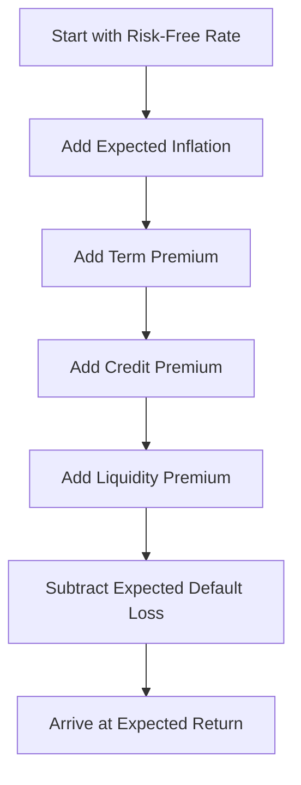

### Setting the Stage

When I was first learning about bonds—this is going back quite a few years, mind you—I kept stumbling over all the variables that could affect a bond’s return. It felt almost competitive with meteorology (so many forecasts!). Bonds look straightforward—an interest payment (the coupon), a redemption at par, done. Yet, in reality, forecasting that total return can be more complicated than you might think. Central bank policy, credit spreads, roll-down effects, tax considerations, and unexpected macroeconomic shifts all factor into the final outcome.

In professional portfolio management—especially at the CFA Level III vantage point—you need a systematic approach to project fixed-income returns. This ensures that your forecasts go beyond pure guesswork or “gut feeling.” It also helps you compare your outlook with peers in a consistent way, even if your final judgments differ.

### Decomposing Fixed-Income Returns

Fixed-income returns typically consist of several components:

• Yield Income: This is often the starting point, typically measured by a bond’s yield to maturity (YTM). If you hold the instrument to maturity and all coupons are paid as promised, your yield income is basically the bond’s coupon income adjusted for purchase price and redemption at par.

• Roll-Down Return (or Rolldown): Bonds experience price changes as they "roll" down the yield curve over time. If the yield curve is upward sloping, shorter-maturity bonds often trade at lower yields than longer-maturity bonds. So, simply going from 10 years to 9 years to maturity can (sometimes) produce price appreciation.

• Credit Spread: For corporate, emerging market, or high-yield bonds, the credit spread is that extra reward you get for taking on default and liquidity risk beyond a government benchmark.

• Price Appreciation or Depreciation: Beyond yield income and roll-down returns, price changes occur if interest rates or credit spreads move in your favor (or against you). When interest rates drop, bond prices rise, and vice versa.

• Inflation and Real Return Adjustments: Nominal returns factor in inflation. Real returns strip it out. As an investor, you’ll want to know which lens you’re using and why.

### Building-Block Methods

A popular way to tie all these components together is the building-block approach. This method can be neatly expressed in a simple equation in KaTeX:


\text{Expected Return}_{\text{Fixed Income}} 
= r_{\mathrm{rf}} + \pi + \text{Term Premium} + \text{Credit Premium} + \text{Liquidity Premium} - \text{Expected Default Loss} \pm \dots


Where:  
• \\( r_{\mathrm{rf}} \\) is the real risk-free rate.  
• \\( \pi \\) represents expected inflation.  
• The term premium compensates for locking your capital in a longer-maturity instrument.  
• The credit premium covers the risk that a corporate, municipal, or emerging market issuer might default.  
• The liquidity premium accounts for how easy (or not) it is to sell the bond at fair value on short notice.  
• Expected default loss is an estimate of how much return you might forfeit due to an issuer’s inability to make coupon or principal payments.

You add the relevant pieces, subtract risks, and voilà—there’s your forecast. Of course, the big question is always: “How do I estimate each block accurately?” That’s where economic forecasts, capital market assumptions, and seasoned judgment mesh together.

### The Role of Economic Fundamentals

Central banks remain among the principal drivers of interest rates. If you expect higher inflation or an economic boom, you might guess that central banks will lift short-term rates, which typically nudges bond yields upward across the curve. Conversely, recessionary threats or deflationary periods often lead to lower rates.

Government policy, GDP growth, demographics, and even global trade conditions all influence bond yields. In high-growth periods, yields sometimes track inflation expectations closely. In uncertain times, they might remain low due to investors fleeing to “safe havens.” As the economy expands or contracts, always revisit your bond forecast assumptions.

### Nominal vs. Real Return Considerations

Another big question: Do you care about your returns in nominal terms or real terms? Nominal includes inflation. Real strips it out. For instance, an investor with a long-term horizon, such as a pension plan, might be more focused on real returns—particularly if they need to preserve purchasing power to meet future liabilities. Meanwhile, investors targeting a short-term objective are often interested in nominal returns, since their immediate purchasing power is less of an issue.

In a building-block sense, if you only need real returns, your formula might exclude the inflation component (\\(\pi\\)) and factor in a real risk-free rate plus premiums. But ignoring inflation in forecasting can be tricky because changes in inflation expectations typically affect bond prices. So even if you’re focusing on “real” returns, keep an eye on the inflation environment.

### Yield Curve and Term Structure

Yield curve dynamics can markedly affect fixed-income returns, especially in the short run. The yield curve might steepen (longer yields rise relative to shorter yields), flatten (they converge), or even invert (shorter yields are higher than longer yields). These changes in shape occur due to shifts in monetary policy, demand for different maturities, and macroeconomic outlook.

A forward rate analysis (e.g., using implied forward yields derived from current yield curves) is often used to forecast yields and gauge expected roll-down returns. If the forward curve suggests that yields at 2-year maturity will be significantly lower in a year’s time, you might forecast capital gains from holding a 3-year bond as it “rolls” to 2 years.

### Credit Risk and Default Considerations

Let's say you’re analyzing an investment-grade corporate or high-yield bond. Beyond interest-rate movements, credit risk is another driver of bond returns. A broad approach is to estimate a “credit spread” that compensates for both expected and unexpected default losses—plus any liquidity considerations. But real-world credit analysis gets more granular:

• Default Probability: How likely is it that the issuer will be unable to meet obligations?  
• Recovery Rate: If a default happens, how much can you expect to recover, and how long might that process take?  
• Covenant Protections: If the bond has strong covenants, you might face a lower overall risk of losing capital. Meanwhile, "covenant-lite" deals can be riskier.  

A portion of that credit spread is typically “eaten away” by defaults. For instance, if the credit spread is 200 basis points, but you estimate 50 basis points as the cost of occasional defaults, your net spread compensation is 150 basis points.

### Scenario Analysis Approaches

Because forecasting the future is always uncertain (seriously, who saw some of the big macro events of the last decade coming?), scenario analysis is a valuable tool. A simple approach is to create three scenarios:

• Baseline (most likely scenario): Maybe you assume a mild inflation environment, moderate GDP growth, stable interest rates, and no major surprises.  
• Best-case scenario: Perhaps interest rates drop, or credit spreads tighten dramatically. This scenario might produce above-average capital gains.  
• Worst-case scenario: Could be an unexpected surge in inflation, hawkish central bank policy, or a credit downturn—leading to capital losses from rising rates or widening spreads.

By assigning probabilities to these scenarios, you get an “expected value” of bond returns, which can guide portfolio decisions. Of course, scenario probabilities are themselves subject to personal judgment, but the exercise encourages you (and your investment committee) to consider a broader risk spectrum.

### Practical Considerations for Return Forecasting

Adjusting for transaction costs, management fees, or potential tax inefficiencies can further refine fixed-income return forecasts. Taxes might reduce the effective yield, especially if you’re working under a tax regime that punishes interest payments at a higher marginal rate than capital gains. In some jurisdictions, municipal bonds can be more attractive because their interest is tax-exempt; that can elevate the bond’s after-tax yield advantage for certain investors.

There’s also liquidity. In normal times, investment-grade and government bonds may have negligible liquidity premiums because trading volume is high. But in crisis periods (you know, times of real panic when markets seize up), investors might pay a big premium for quick liquidity—and that changes short-term yield dynamics.

Consider these real-world factors whenever you produce official forecasts. No client wants to find out that their “expected return” was never adjusted for taxes and fees.

### Sample Calculation & Example

Imagine you’re focusing on a 5-year corporate bond with a YTM of 4.5%. You break that figure down as follows:

• Real Risk-Free Rate = 1.0%  
• Expected Inflation = 2.0%  
• Term Premium = 0.5%  
• Credit Premium = 1.0% (with 0.2% expected default loss, net 0.8%)  
• Liquidity Premium = 0.2%  

So your conclusion might be:


\text{Expected Nominal Return} 
= (1.0\%) + (2.0\%) + (0.5\%) + (1.0\%) + (0.2\%) - (0.2\%) 
= 4.5\%.


(Yes, that net line equals the bond’s overall YTM of 4.5%.) In a stable rate environment, holding the bond should net you 4.5% annually, presumably. But if interest rates spike, that 4.5% might get offset by capital losses on price depreciation. Conversely, if yields drop, you might enjoy both coupon income and price gains.

### Visualizing the Process

Here’s a Mermaid flowchart breaking down how each piece contributes to the expected return:

This is just a simple schematic, but it should give you a sense of how you tack on components step by step—then subtract any losses you anticipate. Remember that each of these elements can shift if inflation changes, GDP accelerates (or tanks), or if market sentiment for credit risk improves (or collapses).

### Conclusion

At the end of the day, forecasting fixed-income returns can feel part science, part art, and part fortune-telling. The building-block framework adds structure—like a road map—while economic fundamentals, yield curve analysis, and scenario tests help you navigate the road’s twists and turns.

If there’s one single piece of advice I’d give my past self (that rookie bond analyst), it’s this: Don’t ignore the smaller “premium” buckets. A fraction of a percent might not seem like a big deal in the short run, but over time, these small differentials can accumulate into material performance differences, especially for large portfolios.

### Final Exam Tips

• Practice Decomposition: On the exam, you could be asked to dissect a bond’s yield into risk-free rate, inflation, term premium, and credit spread. Make sure you can do this swiftly and accurately.

• Discuss Nominal vs. Real: Essays often test your ability to tie macroeconomic forecasts (like inflation) to bond returns. Be prepared to highlight the difference between nominal and real returns in your response.

• Scenario Analysis: You might see item set questions with multiple interest rate and credit spread scenarios. Practice calculating expected returns under each scenario, as well as the probability-weighting techniques you’d use.

• Common Pitfalls: Don’t forget about transaction costs, taxes, and default losses. The exam might ask how to refine your forecast once these are factored in.

• Managing Time: In constructed-response questions, it’s easy to get bogged down writing paragraphs. Be concise and targeted in your replies—outline your approach, show a brief example calculation, and interpret it.  

### References

• Fabozzi, F. (Ed.). (2021). Bond Markets, Analysis, and Strategies. McGraw-Hill.  
• CFA Institute. (2025). CFA Program Curriculum, Level III – Fixed-Income Readings.  
• Ilmanen, A. (2011). Expected Returns: An Investor’s Guide to Harvesting Market Rewards. Wiley.  

## Test Your Knowledge: Setting Fixed-Income Return Forecasts Quiz



### Which of the following components is NOT typically included in the building-block approach to estimating fixed-income returns?

- [x] Equity risk premium
- [ ] Risk-free rate
- [ ] Term premium
- [ ] Credit premium

> **Explanation:** The equity risk premium refers to the excess return demanded by investors for holding equities rather than risk-free assets. It is not typically part of the building-block approach for fixed-income instruments.

### When an investor shifts focus from nominal returns to real returns in the fixed-income market, which component is effectively excluded or set to zero?

- [ ] Credit premium
- [x] Expected inflation
- [ ] Risk-free rate
- [ ] Liquidity premium

> **Explanation:** Moving from a nominal to a real return framework means excluding the inflation component; you focus on the return that remains after adjusting for inflation.

### Which term describes the price appreciation that occurs as a bond “moves” to a shorter maturity on the yield curve?

- [ ] Convexity
- [x] Roll-down return
- [ ] Pull-to-par
- [ ] Coupon effect

> **Explanation:** Roll-down return (or rolldown) captures the price change that arises as a bond “rolls down” the yield curve as time passes.

### An analyst estimates that a 10-year corporate bond has a 150-basis-point credit spread, of which 30 basis points are expected defaults. Which premium most closely represents the net compensation for assuming credit risk?

- [ ] 150 bps
- [ ] 30 bps
- [x] 120 bps
- [ ] 180 bps

> **Explanation:** Subtract the expected default loss (30 bps) from the total spread (150 bps) to get a net compensation of 120 bps for credit risk.

### Which of the following is the best description of the term premium?

- [x] The extra yield investors demand for committing capital over a longer period
- [ ] The yield penalty an issuer must pay when market liquidity is low
- [ ] The difference between nominal and real yields due to inflation
- [ ] The yield differential due to default risk

> **Explanation:** The term premium compensates investors for the uncertainty of holding longer-term bonds, as opposed to rolling over shorter-term bonds.

### In a steepening yield curve environment, which of the following is most likely if investors hold longer-duration bonds?

- [ ] They will automatically earn a lower yield than originally expected
- [ ] They will face immediate capital gains
- [ ] They will lose their ongoing coupon income
- [x] They may observe a decline in bond prices due to the rise in long-term rates

> **Explanation:** A steepening yield curve generally involves rising long-term rates, which leads to near-term price declines for longer-duration bonds.

### Under a scenario analysis framework, an analyst forecasts baseline, best-case, and worst-case returns for a bond. The baseline scenario is given a probability of 50%, best-case 25%, and worst-case 25%. If the returns under each scenario are 4%, 7%, and –2% respectively, what is the expected return?

- [ ] 3.5%
- [ ] 4.0%
- [x] 3.25%
- [ ] 6.0%

> **Explanation:** Expected return = (0.50 × 4%) + (0.25 × 7%) + (0.25 × –2%) = 2% + 1.75% – 0.5% = 3.25%.

### Which factor is most likely to increase a bond’s credit spread in the market?

- [ ] Higher probability of central bank rate cuts
- [ ] Increased demand for safe-haven assets
- [ ] Lower inflation forecasts
- [x] Deterioration in the issuer’s credit quality

> **Explanation:** If an issuer’s ability to service debt weakens (i.e., deteriorating credit quality), its bonds become riskier, leading investors to demand a wider spread.

### In practice, how do liquidity premiums typically behave during times of market stress?

- [ ] They remain unchanged
- [ ] They become less pertinent
- [x] They increase as investors demand more return to part with capital
- [ ] They decrease because regulators force more market trading

> **Explanation:** In periods of market distress, investors often struggle to sell quickly at fair value. This increases the demand for higher liquidity premiums to compensate for that risk.

### A bond investor is only concerned with their after-tax return. Is it enough to consider the bond’s yield to maturity without further adjustments?

- [ ] Yes
- [x] No

> **Explanation:** Taxes can materially reduce the effective yield. Investors who focus on after-tax returns typically must adjust for the difference in how coupon income and capital gains are taxed.


